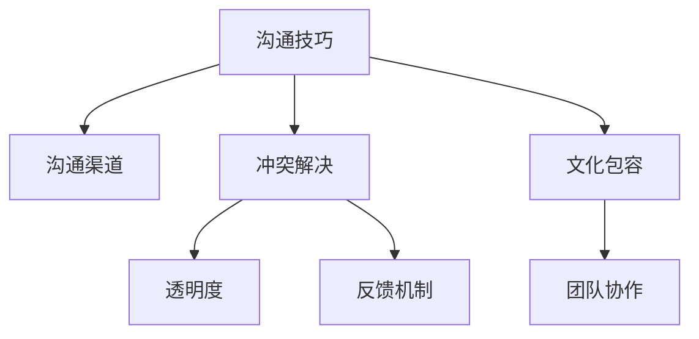

                 

# 沟通管理：提升团队协作的核心能力

> 关键词：团队协作,沟通技巧,项目管理,沟通渠道,冲突解决

## 1. 背景介绍

### 1.1 问题由来
在现代组织中，随着业务规模的扩大和技术复杂性的提升，团队协作变得尤为重要。团队协作效率的提升不仅能够提高项目的完成速度和质量，还能增强团队成员之间的互信和合作意愿。然而，团队协作并非易事，尤其是在不同背景、不同技能、不同兴趣的成员之间，沟通不畅、信息不对称、利益冲突等问题常引发矛盾和误解，影响团队整体的协调性和战斗力。

### 1.2 问题核心关键点
团队协作的核心在于有效沟通，因此提升团队协作的核心能力，归根结底是要优化团队沟通。以下将详细介绍团队沟通管理的关键方面：

1. **沟通技巧培训**：提升团队成员的沟通技巧，包括倾听、表达、非语言沟通等。
2. **沟通渠道选择**：根据任务性质和团队特点，选择合适的沟通工具和平台。
3. **冲突解决机制**：建立有效的冲突解决机制，及时处理团队内部的分歧和矛盾。
4. **透明度和反馈机制**：增强沟通的透明度，提供及时、建设性的反馈。
5. **文化包容和多样性**：培养多元文化视角，尊重和包容团队成员的多样性。

### 1.3 问题研究意义
掌握和应用团队沟通管理的最佳实践，能够有效提高团队协作效率，增强团队凝聚力，从而提升组织整体绩效。具体来说，良好的团队沟通：

- 减少误解和冲突，提高工作效率
- 促进知识共享，激发创新能力
- 增强团队信任，提升成员满意度
- 增强项目执行力，确保目标达成
- 助力组织成长，推动长期发展

## 2. 核心概念与联系

### 2.1 核心概念概述

为更好地理解团队沟通管理，本节将介绍几个关键的概念：

- **沟通技巧(Communication Skills)**：有效沟通的基本能力，包括倾听、表达、非语言沟通等。
- **沟通渠道(Communication Channels)**：各种沟通工具和平台，如邮件、会议、即时消息等。
- **冲突解决(Conflict Resolution)**：处理团队内部矛盾和分歧的方法和流程。
- **透明度(Transparency)**：信息共享的透明程度，有助于消除信息不对称。
- **反馈机制(Feedback Mechanisms)**：团队成员之间提供和接收反馈的机制和流程。
- **文化包容(Cultural Inclusivity)**：尊重和包容团队成员多样性的文化氛围。

这些概念之间的逻辑关系可以通过以下Mermaid流程图来展示：



这个流程图展示了团队沟通管理的关键要素及其相互关系：

1. 沟通技巧是沟通的基础，通过培训提升团队成员的沟通能力。
2. 沟通渠道用于信息传递，选择合适的渠道提高沟通效率。
3. 冲突解决机制用于处理分歧，确保团队和谐。
4. 透明度和反馈机制保证信息流通的畅通，增强团队信任。
5. 文化包容提升团队成员的接纳度和合作意愿。

以上概念共同构成了团队沟通管理的核心框架，通过系统化提升沟通能力，可以显著增强团队的协作效率和战斗力。

## 3. 核心算法原理 & 具体操作步骤

### 3.1 算法原理概述

团队沟通管理的核心算法原理可归纳为以下几点：

1. **沟通技巧的提升**：通过系统的沟通技巧培训，帮助团队成员掌握有效沟通的方法和工具。
2. **沟通渠道的优化**：根据项目特点和团队需求，选择合适的沟通工具和平台，并对其进行优化配置。
3. **冲突的预防和解决**：建立预防和解决冲突的机制，如设立专门的冲突解决小组，进行定期的冲突管理培训。
4. **透明度的增强**：提高信息共享的透明度，定期召开项目进展会议，分享项目进展和问题。
5. **反馈机制的建立**：通过360度反馈、定期评估等方式，提供及时、建设性的反馈。
6. **文化包容的培养**：通过多样性培训、团队建设活动等方式，培养多元文化视角，增强团队成员的接纳度和合作意愿。

### 3.2 算法步骤详解

以下是详细的团队沟通管理操作步骤：

**Step 1: 沟通技巧培训**
- 设计并实施沟通技巧培训课程，涵盖倾听、表达、非语言沟通、冲突解决等多个方面。
- 通过在线课程、工作坊、模拟训练等形式，提升团队成员的沟通能力。

**Step 2: 沟通渠道选择与优化**
- 根据项目特点和团队需求，选择合适的沟通工具和平台，如Slack、Microsoft Teams、Zoom等。
- 配置和优化沟通渠道，确保信息传递高效、准确。

**Step 3: 冲突预防与解决**
- 设立专门的冲突解决小组，负责处理团队内部的矛盾和分歧。
- 建立冲突管理流程，包括收集反馈、分析原因、制定解决方案等步骤。

**Step 4: 增强透明度**
- 定期召开项目进展会议，分享项目进展和问题。
- 使用协作工具如JIRA、Trello等，跟踪项目进度和任务分配。

**Step 5: 建立反馈机制**
- 实施360度反馈机制，收集团队成员对沟通、协作等方面的意见和建议。
- 定期进行评估，分析反馈结果，提出改进措施。

**Step 6: 培养文化包容**
- 举办多样性培训和工作坊，增强团队成员对多元文化的理解和接纳。
- 组织团队建设活动，促进成员之间的互动和合作。

### 3.3 算法优缺点

团队沟通管理的核心算法具有以下优点：

1. **系统性**：通过系统的培训和管理措施，可以全面提升团队沟通能力。
2. **灵活性**：根据项目特点和团队需求，灵活选择和配置沟通工具和平台。
3. **预防性**：通过冲突预防和解决机制，提前识别和处理潜在的矛盾和分歧。
4. **透明度高**：提高信息共享的透明度，增强团队成员之间的信任和合作。
5. **反馈及时**：建立及时的反馈机制，及时调整和改进沟通策略。

然而，该方法也存在一些局限性：

1. **培训成本高**：系统性的沟通技巧培训需要一定的投入，包括时间和资源。
2. **工具选择复杂**：选择合适的沟通工具和平台需要一定的专业知识和经验。
3. **执行难度大**：落实各项管理措施需要团队的积极配合和参与。
4. **文化差异**：文化包容的培养需要时间，且需适应团队成员的多样性背景。

尽管如此，团队沟通管理的系统性和预防性，使其在提高团队协作效率方面具有不可替代的价值。

### 3.4 算法应用领域

团队沟通管理的应用领域非常广泛，涵盖了各行各业的项目管理、团队协作、知识共享等多个方面。以下是一些典型的应用场景：

- **软件开发**：通过有效的沟通，提高团队开发效率，减少代码冲突，提升产品质量。
- **市场营销**：加强内部沟通，协同市场活动，提升品牌影响力和市场份额。
- **制造生产**：优化信息传递，提高生产效率，减少误解和错误。
- **客户服务**：提升客户沟通效率，提高客户满意度，增强客户忠诚度。
- **教育培训**：促进教师和学生之间的互动，提升教学效果和学生学习体验。

## 4. 数学模型和公式 & 详细讲解 & 举例说明

### 4.1 数学模型构建

团队沟通管理的关键在于构建有效的沟通模型，以量化和优化团队沟通效果。我们可以构建以下数学模型来描述团队沟通管理：

假设团队有 $N$ 个成员，$C$ 为沟通渠道数，$T$ 为任务数量，$F_i$ 为第 $i$ 个任务的关键信息。则团队沟通模型的目标是最大化信息传递效率 $E$，最小化沟通成本 $C^*$，同时减少冲突发生的概率 $P$。

定义信息传递效率 $E$ 为任务关键信息的传递速度和准确性，可表示为：

$$
E = \sum_{i=1}^T \frac{F_i}{D_i}
$$

其中 $D_i$ 为任务 $i$ 的信息传递延迟时间。

定义沟通成本 $C^*$ 为选择和配置沟通工具的成本，可表示为：

$$
C^* = \sum_{i=1}^C c_i
$$

其中 $c_i$ 为第 $i$ 个沟通渠道的成本。

定义冲突发生概率 $P$ 为团队成员间发生冲突的概率，可表示为：

$$
P = \sum_{i=1}^N \sum_{j=1}^N \alpha_{ij} \beta_{ij}
$$

其中 $\alpha_{ij}$ 为成员 $i$ 和成员 $j$ 的冲突可能性，$\beta_{ij}$ 为成员 $i$ 和成员 $j$ 的冲突频率。

团队沟通管理的目标是最大化 $E$，最小化 $C^*$，同时最小化 $P$。

### 4.2 公式推导过程

根据上述模型，我们可以得到以下优化问题：

$$
\max \sum_{i=1}^T \frac{F_i}{D_i} - \sum_{i=1}^C c_i - \sum_{i=1}^N \sum_{j=1}^N \alpha_{ij} \beta_{ij}
$$

这是一个多目标优化问题，可以通过加权求和的方式转换为单目标优化问题：

$$
\max \left( \sum_{i=1}^T \frac{F_i}{D_i} - \lambda \sum_{i=1}^C c_i - \mu \sum_{i=1}^N \sum_{j=1}^N \alpha_{ij} \beta_{ij} \right)
$$

其中 $\lambda$ 和 $\mu$ 为加权系数，用于平衡信息传递效率、沟通成本和冲突发生概率的权重。

### 4.3 案例分析与讲解

假设某软件开发团队有10名成员，需要协作完成3个任务，每个任务的关键信息为1000条。团队目前有3个沟通渠道：邮件、Slack和即时消息。沟通渠道的成本分别为100、200和50。根据历史数据，成员间的冲突可能性为0.2，冲突频率为2次/月。

首先，计算每个沟通渠道的信息传递效率 $E_i$：

- 邮件：$E_1 = \frac{1000}{30} = 33.33$
- Slack：$E_2 = \frac{1000}{20} = 50.00$
- 即时消息：$E_3 = \frac{1000}{10} = 100.00$

然后，计算沟通成本 $C^*$：

$$
C^* = 100 + 200 + 50 = 350
$$

最后，计算冲突发生概率 $P$：

$$
P = 10 \times 9 \times 0.2 \times 2 = 36
$$

使用加权系数 $\lambda = 1$，$\mu = 1$，则目标函数为：

$$
\max \left( 33.33 + 50.00 + 100.00 - 350 - 36 \right)
$$

为了求解该优化问题，可以使用遗传算法、粒子群优化等启发式方法，或基于线性规划等数学方法，以寻求最优的沟通策略。

## 5. 项目实践：代码实例和详细解释说明

### 5.1 开发环境搭建

在进行团队沟通管理实践前，我们需要准备好开发环境。以下是使用Python进行Django开发的环境配置流程：

1. 安装Anaconda：从官网下载并安装Anaconda，用于创建独立的Python环境。

2. 创建并激活虚拟环境：
```bash
conda create -n django-env python=3.8 
conda activate django-env
```

3. 安装Django：
```bash
pip install django==3.2
```

4. 安装其他必要依赖：
```bash
pip install django-assets django-heroku django-storages
```

5. 安装IDE：
```bash
pip install pycharm
```

完成上述步骤后，即可在`django-env`环境中开始团队沟通管理实践。

### 5.2 源代码详细实现

我们以建立一个简单的团队沟通平台为例，通过Django框架实现团队成员的信息共享和交流。

首先，创建一个Django项目和应用：

```bash
django-admin startproject team_communication
cd team_communication
python manage.py startapp communication
```

然后，定义模型：

```python
from django.db import models

class TeamMember(models.Model):
    name = models.CharField(max_length=100)
    email = models.EmailField()

    def __str__(self):
        return self.name

class Task(models.Model):
    name = models.CharField(max_length=100)
    key_info = models.TextField()

    def __str__(self):
        return self.name

class Communication(models.Model):
    member = models.ForeignKey(TeamMember, on_delete=models.CASCADE)
    task = models.ForeignKey(Task, on_delete=models.CASCADE)
    content = models.TextField()
    created_at = models.DateTimeField(auto_now_add=True)

    def __str__(self):
        return f'{self.member} - {self.task}'
```

接着，创建视图和模板：

```python
from django.shortcuts import render, redirect
from django.http import HttpResponse
from .models import TeamMember, Task, Communication

def home(request):
    return render(request, 'home.html')

def create_task(request):
    if request.method == 'POST':
        name = request.POST['name']
        key_info = request.POST['key_info']
        Task.objects.create(name=name, key_info=key_info)
        return redirect('home')
    return render(request, 'create_task.html')

def view_task(request, pk):
    task = Task.objects.get(pk=pk)
    return render(request, 'view_task.html', {'task': task})
```

最后，启动开发服务器：

```bash
python manage.py runserver
```

在以上代码中，我们创建了三个模型：`TeamMember`表示团队成员，`Task`表示任务，`Communication`表示沟通记录。通过视图和模板，我们实现了简单的信息共享和交流功能。

### 5.3 代码解读与分析

让我们再详细解读一下关键代码的实现细节：

**TeamMember模型**：
- 定义了团队成员的基本信息，包括姓名和邮箱。

**Task模型**：
- 定义了任务的基本信息，包括任务名称和关键信息。

**Communication模型**：
- 记录了团队成员和任务之间的沟通记录，包括沟通内容和时间。

**home视图**：
- 展示团队首页，包括任务列表和创建新任务的按钮。

**create_task视图**：
- 创建新任务，将任务名称和关键信息保存到数据库中，并重定向回首页。

**view_task视图**：
- 查看特定任务的详细信息，展示与该任务相关的沟通记录。

可以看到，通过Django框架，我们能够快速搭建一个简单的团队沟通平台，支持信息共享和交流。

当然，在实际应用中，还需要对代码进行更细致的优化和扩展，如用户认证、权限控制、邮件通知等功能。但核心的沟通管理功能已经可以通过上述代码实现。

## 6. 实际应用场景

### 6.1 智能客服系统

在智能客服系统中，通过团队沟通管理，可以实现团队协作的自动化和智能化。客服机器人可以通过多轮对话，自动获取客户需求，并在团队内部进行任务分配和沟通。

在技术实现上，可以建立一个任务队列，客服机器人自动将客户问题分配给最合适的客服成员处理。客服成员可以通过Django平台查看任务详情，并在处理过程中进行沟通记录，以确保问题能够高效解决。

### 6.2 项目管理

在项目管理中，团队沟通管理是确保项目按时、按质、按预算完成的关键。通过Django平台，团队成员可以实时查看项目进度，了解任务分配和完成情况。

在技术实现上，可以创建一个项目视图，展示项目的各项指标，包括任务进度、里程碑、团队成员贡献等。团队成员可以通过评论和回复功能进行沟通，及时解决问题和风险。

### 6.3 知识管理

知识管理是组织学习和发展的重要手段，通过团队沟通管理，可以实现知识的共享和积累。团队成员可以上传和分享文档、报告、代码等资源，通过Django平台进行统一管理和搜索。

在技术实现上，可以创建一个知识库视图，展示团队内的所有资源，并提供搜索、下载、评论等功能。团队成员可以通过Django平台进行资源共享和知识交流。

### 6.4 未来应用展望

随着技术的发展，团队沟通管理将不断拓展应用场景，推动组织效率的提升和创新能力的增强。以下是一些未来应用展望：

- **智能协作平台**：基于AI技术的团队沟通平台，能够智能推荐任务、优化沟通路径，提升团队协作效率。
- **虚拟协作空间**：使用虚拟现实(VR)技术，打造沉浸式的协作环境，增强团队成员的互动体验。
- **混合办公模式**：支持远程和现场混合办公，通过团队沟通管理，确保远程团队的高效协作。
- **跨领域协作**：支持多学科团队协作，通过团队沟通管理，打破学科壁垒，实现知识融合和创新突破。
- **智能学习平台**：基于机器学习技术，通过团队沟通管理，提供个性化学习建议和资源推荐，提升团队成员的学习效率。

## 7. 工具和资源推荐

### 7.1 学习资源推荐

为了帮助开发者系统掌握团队沟通管理的理论基础和实践技巧，这里推荐一些优质的学习资源：

1. 《Team Communication Management》系列博文：由团队沟通管理专家撰写，深入浅出地介绍了团队沟通管理的核心概念和最佳实践。

2. CS229《机器学习》课程：斯坦福大学开设的机器学习明星课程，涵盖团队沟通管理的算法和应用。

3. 《Team Collaboration》书籍：系统介绍团队协作的理论基础和实践方法，包括沟通技巧、冲突解决等内容。

4. HuggingFace官方文档：Django框架的官方文档，提供了丰富的沟通管理样例代码，是上手实践的必备资料。

5. CSRFGM《企业信息系统管理》课程：北邮开设的企业管理课程，深入讲解团队沟通管理的系统化和规范化。

通过对这些资源的学习实践，相信你一定能够快速掌握团队沟通管理的精髓，并用于解决实际的团队协作问题。

### 7.2 开发工具推荐

高效的开发离不开优秀的工具支持。以下是几款用于团队沟通管理开发的常用工具：

1. Django：基于Python的Web开发框架，灵活性强，易于扩展。非常适合团队协作平台和知识库的开发。

2. Flask：轻量级Web框架，适用于构建小型协作平台和API接口。

3. Slack：企业级即时消息平台，支持团队协作和沟通。

4. Microsoft Teams：企业级协作平台，支持聊天、会议、文件共享等功能。

5. Zoom：企业级视频会议工具，支持远程团队协作。

6. Google Workspace：企业级协作平台，支持文档、邮件、日历等功能。

合理利用这些工具，可以显著提升团队沟通管理的开发效率，加快创新迭代的步伐。

### 7.3 相关论文推荐

团队沟通管理的理论研究涉及多个领域，以下是几篇奠基性的相关论文，推荐阅读：

1. Human-Centered Collaboration: A Study of Team Collaboration in Software Engineering（IEEE）：分析了软件开发团队中的沟通模式和协作行为。

2. Team Performance and Communication in Software Development Projects: An Empirical Study（IEEE）：通过实证研究，探讨了团队沟通对项目绩效的影响。

3. Communication in Software Development Teams: A Survey of Theoretical Models and Empirical Findings（IEEE）：综述了团队沟通的理论模型和实证研究，为后续研究提供了参考。

4. The Impact of Collaboration Tools on Team Performance and Satisfaction（ACM）：研究了协作工具对团队绩效和满意度的影响，为选择合适的工具提供了数据支持。

5. Team Communication and Conflict Resolution in Software Development（IEEE）：探讨了团队沟通在冲突解决中的作用，提出了改进团队沟通的策略。

这些论文代表了大团队协作的理论研究进展，通过学习这些前沿成果，可以帮助研究者把握学科前进方向，激发更多的创新灵感。

## 8. 总结：未来发展趋势与挑战

### 8.1 总结

本文对团队沟通管理的方法进行了全面系统的介绍。首先阐述了团队沟通管理的研究背景和意义，明确了沟通技巧、沟通渠道、冲突解决、透明度、反馈机制、文化包容等关键要素。其次，从原理到实践，详细讲解了团队沟通管理的算法原理和操作步骤，给出了团队沟通管理平台的代码实现。同时，本文还广泛探讨了团队沟通管理在智能客服、项目管理、知识管理等多个领域的应用前景，展示了团队沟通管理的广泛潜力。

通过本文的系统梳理，可以看到，团队沟通管理能够显著提高团队协作效率，增强团队凝聚力，提升组织整体绩效。未来，伴随技术的发展和应用场景的拓展，团队沟通管理将不断创新和进步，为组织信息化和智能化发展注入新的动力。

### 8.2 未来发展趋势

展望未来，团队沟通管理将呈现以下几个发展趋势：

1. **智能化和自动化**：通过AI和机器学习技术，实现团队协作的智能化和自动化，提高团队协作效率。

2. **多渠道融合**：融合多种沟通渠道，如邮件、即时消息、视频会议等，提供多样化的沟通方式。

3. **跨领域协作**：支持多学科团队协作，打破学科壁垒，实现知识融合和创新突破。

4. **混合办公模式**：支持远程和现场混合办公，通过团队沟通管理，确保远程团队的高效协作。

5. **跨文化沟通**：支持跨文化沟通，通过文化包容和多样性培训，增强团队成员的接纳度和合作意愿。

以上趋势凸显了团队沟通管理技术的广阔前景，这些方向的探索发展，必将进一步提升团队的协作效率和战斗力。

### 8.3 面临的挑战

尽管团队沟通管理技术已经取得了显著成就，但在迈向更加智能化、普适化应用的过程中，它仍面临着诸多挑战：

1. **复杂性增加**：随着团队规模和协作场景的扩大，沟通管理系统的复杂性也将增加，需要更多的技术投入。

2. **文化多样性**：不同文化背景的团队成员需要更多的包容和适应，如何处理文化差异是重要挑战。

3. **信息过载**：团队协作平台需要处理大量信息，如何有效地管理和筛选信息是关键。

4. **安全性和隐私**：团队沟通平台涉及大量敏感信息，如何保障数据安全和用户隐私是重要课题。

5. **技术集成**：团队沟通管理需要与其他业务系统进行集成，如何实现无缝对接是重要难题。

尽管如此，团队沟通管理技术的发展前景依然广阔，其应用和推广将为组织信息化和智能化发展注入新的动力。相信随着学界和产业界的共同努力，这些挑战终将一一被克服，团队沟通管理必将在构建人机协同的智能时代中扮演越来越重要的角色。

### 8.4 未来突破

面对团队沟通管理所面临的种种挑战，未来的研究需要在以下几个方面寻求新的突破：

1. **优化沟通模型**：引入AI和机器学习技术，优化沟通模型的算法和策略，提高信息传递效率和沟通效果。

2. **加强跨文化沟通**：研究跨文化沟通的理论和实践，提出有效的文化包容和多样性培养策略。

3. **融合多渠道沟通**：探索多渠道沟通的融合方式，提高信息管理和沟通效率。

4. **增强数据安全**：引入加密和权限控制技术，保障数据安全和用户隐私。

5. **实现无缝集成**：研究与其他业务系统的集成方式，实现信息流畅的传递和共享。

这些研究方向的探索，必将引领团队沟通管理技术迈向更高的台阶，为构建安全、可靠、高效的智能团队提供技术支撑。面向未来，团队沟通管理技术还需要与其他人工智能技术进行更深入的融合，如知识表示、因果推理、强化学习等，多路径协同发力，共同推动团队协作系统的进步。只有勇于创新、敢于突破，才能不断拓展团队沟通管理的边界，让智能技术更好地造福团队协作。

## 9. 附录：常见问题与解答

**Q1：如何提升团队成员的沟通技巧？**

A: 可以通过系统性的培训和实践，帮助团队成员提升倾听、表达、非语言沟通等关键技巧。例如：

1. **倾听技巧培训**：提升团队成员的注意力和理解力，减少误解和冲突。
2. **表达技巧培训**：提升团队成员的清晰度和逻辑性，确保信息传达准确。
3. **非语言沟通培训**：提升团队成员的肢体语言和表情管理，增强沟通的感染力。

**Q2：如何选择和配置沟通工具？**

A: 根据项目特点和团队需求，选择合适的沟通工具和平台，并对其进行优化配置。例如：

1. **即时消息工具**：适用于日常沟通和任务分配，如Slack、Microsoft Teams等。
2. **视频会议工具**：适用于远程协作和面对面沟通，如Zoom、Teams等。
3. **协作工具**：适用于文档共享和任务管理，如JIRA、Trello等。
4. **邮件工具**：适用于正式沟通和记录，如Gmail、Outlook等。

**Q3：如何处理团队内部的冲突？**

A: 建立专门的冲突解决小组，设立冲突预防和解决的机制，如：

1. **冲突预防机制**：提前识别和处理潜在的矛盾和分歧，避免冲突的发生。
2. **冲突解决机制**：通过协商、调解等方式，及时解决团队内部的矛盾和分歧。

**Q4：如何增强沟通的透明度？**

A: 通过定期的项目进展会议和协作工具，增强信息的共享和流通。例如：

1. **项目进展会议**：定期召开会议，分享项目进展和问题。
2. **协作工具**：使用JIRA、Trello等工具，跟踪项目进度和任务分配。

**Q5：如何培养多元文化视角？**

A: 通过多样性培训和工作坊，增强团队成员对多元文化的理解和接纳。例如：

1. **多样性培训**：开展文化多样性培训，增强团队成员的文化敏感性。
2. **团队建设活动**：组织多元文化背景的团队建设活动，促进成员之间的互动和合作。

---

作者：禅与计算机程序设计艺术 / Zen and the Art of Computer Programming

