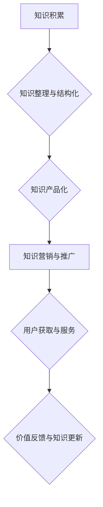

                 

## 知识变现的100种方法

> 关键词：知识变现、人工智能、软件开发、技术博客、技术文档、在线课程、开源项目、技术咨询、技术服务、知识产权、商业模式、技术趋势

### 1. 背景介绍

在当今信息爆炸的时代，知识已成为最宝贵的资源。拥有专业技能、技术知识和洞察力的个人和组织，拥有着巨大的变现潜力。知识变现是指将知识转化为经济价值的过程，它可以帮助个人和组织获得收入、提升影响力和推动发展。

随着人工智能、大数据、云计算等技术的快速发展，知识变现的模式和渠道也日益丰富。从传统的技术文档撰写到创办在线课程、从开源项目开发到技术咨询服务，越来越多的方式为知识变现提供了平台和机会。

### 2. 核心概念与联系

知识变现的核心在于将知识转化为有价值的产品或服务，并通过有效的营销和推广渠道将其推向市场。

**知识变现流程图:**

**知识变现的关键要素:**

* **知识本身:** 知识必须具有价值、实用性和独特性。
* **知识整理与结构化:** 将知识进行系统化整理和结构化，使其易于理解和应用。
* **知识产品化:** 将知识转化为有价值的产品或服务，例如技术文档、在线课程、咨询服务等。
* **知识营销与推广:** 通过有效的营销和推广渠道，将知识产品或服务推向目标用户。
* **用户获取与服务:** 提供优质的用户体验和服务，建立用户粘性。
* **价值反馈与知识更新:** 收集用户反馈，不断更新和完善知识产品或服务。

### 3. 核心算法原理 & 具体操作步骤

**3.1 算法原理概述**

知识变现的核心算法原理是基于价值链分析和用户需求挖掘。通过分析用户的需求和痛点，将知识转化为解决用户问题的解决方案，从而创造价值。

**3.2 算法步骤详解**

1. **需求分析:** 通过市场调研、用户访谈、数据分析等方式，了解用户的需求和痛点。
2. **知识库构建:** 收集、整理和结构化相关知识，构建知识库。
3. **产品设计:** 根据用户需求和知识库内容，设计知识产品或服务。
4. **营销推广:** 通过线上线下渠道，推广知识产品或服务。
5. **用户服务:** 提供优质的用户体验和服务，建立用户粘性。
6. **数据分析:** 收集用户数据，分析用户行为和反馈，不断优化知识产品或服务。

**3.3 算法优缺点**

* **优点:** 

    * 能够有效地解决用户问题，创造价值。
    * 能够根据用户需求不断迭代和优化产品或服务。
    * 能够建立用户粘性，形成长期收益。

* **缺点:** 

    * 需要投入大量时间和精力进行需求分析和知识库构建。
    * 需要不断学习和更新知识，才能满足用户的不断变化的需求。
    * 需要有效的营销推广策略，才能将知识产品或服务推向目标用户。

**3.4 算法应用领域**

* **教育培训:** 在线课程、知识付费平台、教育咨询服务等。
* **技术服务:** 软件开发、技术咨询、技术文档撰写等。
* **商业咨询:** 市场调研、商业模式设计、战略规划等。
* **创意产业:** 设计、写作、音乐、艺术等。

### 4. 数学模型和公式 & 详细讲解 & 举例说明

**4.1 数学模型构建**

知识变现可以看作是一个价值链模型，其中每个环节都涉及到一定的成本和收益。我们可以用以下数学模型来描述知识变现过程:

$$
Value = Revenue - Cost
$$

其中:

* **Value:** 知识变现的最终价值，即净利润。
* **Revenue:** 知识产品或服务的收入。
* **Cost:** 知识产品或服务的成本，包括知识积累、整理、产品化、营销推广、用户服务等方面的成本。

**4.2 公式推导过程**

知识变现的价值取决于收入和成本之间的差值。为了最大化知识变现的价值，我们需要不断优化收入和成本的平衡。

* **提高收入:** 可以通过提高产品或服务的定价、扩大用户群体、开发新的产品或服务等方式来提高收入。
* **降低成本:** 可以通过提高知识整理和产品化的效率、优化营销推广策略、降低用户服务成本等方式来降低成本。

**4.3 案例分析与讲解**

例如，一位技术专家拥有丰富的软件开发经验，他可以将自己的知识变现为以下几种方式:

* **技术文档撰写:** 将自己的技术经验撰写成技术文档，并通过在线平台或出版社进行销售。
* **在线课程:** 制作在线课程，教授软件开发相关的知识和技能，并通过在线学习平台进行销售。
* **技术咨询:** 为企业提供软件开发咨询服务，帮助企业解决技术难题。

通过以上三种方式，技术专家可以获得收入，并通过知识分享和服务，提升自己的影响力和价值。

### 5. 项目实践：代码实例和详细解释说明

**5.1 开发环境搭建**

为了实现知识变现，需要搭建一个合适的开发环境。例如，如果要开发在线课程，需要搭建一个在线学习平台，并配置必要的硬件和软件资源。

**5.2 源代码详细实现**

具体的源代码实现取决于具体的知识变现方式。例如，开发在线课程需要编写课程内容、交互功能、用户管理等方面的代码。

**5.3 代码解读与分析**

需要对代码进行详细解读和分析，了解代码的功能、逻辑和结构。

**5.4 运行结果展示**

需要对代码进行测试和运行，并展示运行结果，验证代码的功能和性能。

### 6. 实际应用场景

**6.1 教育培训**

在线课程平台可以提供各种类型的课程，例如编程、设计、写作、音乐等。用户可以根据自己的兴趣和需求选择课程学习。

**6.2 技术服务**

技术咨询服务可以帮助企业解决技术难题，例如软件开发、网络安全、数据分析等。

**6.3 商业咨询**

商业咨询服务可以帮助企业制定商业策略，例如市场调研、产品开发、营销推广等。

**6.4 未来应用展望**

随着人工智能、虚拟现实、增强现实等技术的不断发展，知识变现的模式和渠道将更加丰富和多元化。例如，我们可以看到基于人工智能的个性化学习平台、虚拟现实的沉浸式培训体验、增强现实的远程技术指导等新兴的知识变现模式。

### 7. 工具和资源推荐

**7.1 学习资源推荐**

* **在线学习平台:** Coursera、edX、Udemy、Khan Academy等。
* **技术博客:** Hacker News、Medium、Stack Overflow等。
* **技术书籍:** 《编程之美》、《深入理解计算机系统》、《设计模式》等。

**7.2 开发工具推荐**

* **代码编辑器:** Visual Studio Code、Sublime Text、Atom等。
* **版本控制系统:** Git、GitHub等。
* **在线学习平台开发工具:** Moodle、WordPress、Thinkific等。

**7.3 相关论文推荐**

* **知识管理:** "The Knowledge Management Field: A Review"
* **知识变现:** "Knowledge Commercialization: A Review and Research Agenda"
* **人工智能:** "Deep Learning"

### 8. 总结：未来发展趋势与挑战

**8.1 研究成果总结**

知识变现是一个不断发展和演变的领域，已经取得了一定的成果。例如，在线课程平台已经成为一种主流的知识变现模式，技术咨询服务也越来越受欢迎。

**8.2 未来发展趋势**

未来，知识变现将更加注重个性化、定制化和体验化。人工智能、虚拟现实、增强现实等技术的应用将推动知识变现模式的创新和发展。

**8.3 面临的挑战**

知识变现也面临着一些挑战，例如知识产权保护、知识质量控制、用户信任等。

**8.4 研究展望**

未来，需要进一步研究知识变现的机制、模式和策略，探索更有效的知识变现方法，并解决知识变现过程中面临的挑战。

### 9. 附录：常见问题与解答

**9.1 如何选择合适的知识变现方式？**

选择合适的知识变现方式需要根据自身的知识、技能、资源和目标进行综合考虑。

**9.2 如何提高知识变现的效率？**

提高知识变现的效率需要不断学习和更新知识，优化产品或服务，并通过有效的营销推广策略将知识产品或服务推向目标用户。

**9.3 如何保护知识产权？**

可以通过注册版权、申请专利等方式来保护知识产权。

作者：禅与计算机程序设计艺术 / Zen and the Art of Computer Programming 
<end_of_turn>

