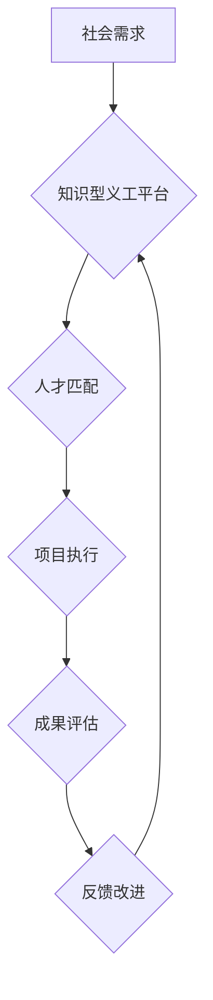

                 

## 知识型义工的培养与管理

> 关键词：知识型义工、人工智能、机器学习、数据分析、志愿服务、社会责任、人才培养、管理体系

## 1. 背景介绍

在当今信息爆炸的时代，知识和信息已成为社会发展最宝贵的资源。与此同时，社会对知识型人才的需求日益增长，而志愿服务作为一种重要的社会参与方式，也越来越受到重视。知识型义工，即利用自身专业知识和技能为社会公益事业贡献力量的志愿者，正逐渐成为一种新的社会力量。

知识型义工的出现，是人工智能、机器学习等技术的快速发展和社会责任感的增强共同作用的结果。一方面，人工智能技术的进步使得知识的获取和处理更加便捷高效，为知识型义工提供了强大的工具支持；另一方面，社会对公益事业的关注度不断提高，人们更加愿意利用自身优势为社会做出贡献。

然而，知识型义工的培养和管理也面临着诸多挑战。如何有效地挖掘和培养知识型义工人才？如何建立完善的管理体系，确保知识型义工的有效发挥？这些问题都需要我们认真思考和探索。

## 2. 核心概念与联系

**2.1 知识型义工的概念**

知识型义工是指利用自身专业知识、技能和经验，为社会公益事业提供志愿服务的人员。他们的贡献形式多样，包括但不限于：

* **技术支持:** 为非营利组织提供技术咨询、软件开发、数据分析等服务。
* **专业培训:** 为弱势群体提供专业技能培训，帮助他们提升自身能力。
* **知识传播:** 通过写作、演讲、教学等方式，传播知识和信息，提高社会公众的认知水平。
* **项目策划:** 为社会公益项目提供策划、管理和执行方面的支持。

**2.2 知识型义工与人工智能的关系**

人工智能技术的发展为知识型义工的培养和管理提供了新的机遇和挑战。

* **机遇:** 人工智能可以帮助我们更有效地识别和匹配知识型义工的技能和需求，提高资源配置效率。人工智能还可以为知识型义工提供个性化的学习和培训资源，帮助他们提升专业能力。
* **挑战:** 人工智能技术的发展也可能导致一些知识型工作岗位被自动化替代，这可能会对知识型义工的就业前景造成一定影响。此外，人工智能技术也存在着伦理和安全方面的风险，需要我们谨慎对待。

**2.3 知识型义工与社会责任的关系**

知识型义工的参与，体现了个人对社会责任的担当和奉献精神。

* **个人成长:** 通过参与志愿服务，知识型义工可以获得新的知识和技能，拓展人脉，提升个人价值。
* **社会贡献:** 知识型义工的专业技能和经验，可以为社会公益事业提供实质性的帮助，推动社会进步。
* **社会和谐:** 知识型义工的参与，可以促进社会各界之间的合作和交流，增强社会凝聚力。

**2.4 知识型义工的管理体系**

建立完善的知识型义工管理体系，是确保知识型义工有效发挥作用的关键。

* **人才库建设:** 建立一个涵盖不同专业领域、不同技能水平的知识型义工人才库，方便组织匹配和调配。
* **项目管理:** 制定科学的项目管理流程，确保知识型义工的参与能够有效地解决社会问题。
* **培训体系:** 建立完善的培训体系，为知识型义工提供专业技能培训、志愿服务指导等方面的支持。
* **激励机制:** 制定合理的激励机制，鼓励知识型义工积极参与志愿服务，并为他们提供相应的认可和奖励。

**2.5 Mermaid 流程图**



## 3. 核心算法原理 & 具体操作步骤

**3.1 算法原理概述**

知识型义工的匹配和分配是一个复杂的决策问题，需要考虑多个因素，例如义工的技能、经验、兴趣、时间安排以及项目的需求等。

常用的算法包括：

* **基于规则的匹配算法:** 根据预先设定的规则，将义工和项目进行匹配。
* **基于机器学习的匹配算法:** 利用机器学习算法，从历史数据中学习义工和项目之间的匹配关系，并预测未来匹配的可能性。
* **启发式算法:** 利用启发式策略，在有限的时间内找到一个近似最优的匹配方案。

**3.2 算法步骤详解**

以基于机器学习的匹配算法为例，其具体步骤如下：

1. **数据收集:** 收集义工和项目的相关数据，例如义工的技能、经验、兴趣、时间安排以及项目的需求、规模、时间节点等。
2. **数据预处理:** 对收集到的数据进行清洗、转换和特征提取，以便于机器学习算法的训练和使用。
3. **模型训练:** 选择合适的机器学习算法，例如支持向量机、决策树、神经网络等，对预处理后的数据进行训练，学习义工和项目之间的匹配关系。
4. **模型评估:** 利用测试数据对训练好的模型进行评估，评估模型的准确性和有效性。
5. **匹配推荐:** 将新的义工和项目数据输入到训练好的模型中，模型会根据学习到的匹配关系，推荐最合适的匹配方案。

**3.3 算法优缺点**

* **优点:** 基于机器学习的匹配算法能够学习到复杂的匹配关系，并根据数据不断优化匹配结果，提高匹配效率和准确性。
* **缺点:** 需要大量的训练数据，并且模型的训练和评估需要一定的技术和资源投入。

**3.4 算法应用领域**

* **志愿服务平台:** 为志愿者和公益项目进行匹配，提高志愿服务效率。
* **人才招聘平台:** 为企业和求职者进行匹配，提高招聘效率。
* **教育培训平台:** 为学生和课程进行匹配，提高学习效果。

## 4. 数学模型和公式 & 详细讲解 & 举例说明

**4.1 数学模型构建**

我们可以用一个简单的数学模型来表示知识型义工的匹配问题。

假设有N个义工和M个项目，每个义工都有一个技能向量 $s_i$，每个项目都有一个需求向量 $d_j$。

* $s_i$ 是一个包含多个维度（例如编程语言、数据分析、写作等）的向量，每个维度代表义工在该技能上的水平。
* $d_j$ 是一个包含多个维度（例如项目类型、技术要求、时间安排等）的向量，每个维度代表项目在该方面需求的程度。

我们可以定义一个匹配度函数 $f(s_i, d_j)$ 来衡量义工 $i$ 和项目 $j$ 的匹配程度。

**4.2 公式推导过程**

匹配度函数可以采用多种形式，例如余弦相似度、皮尔逊相关系数等。

* **余弦相似度:**

$$
\text{cosine}(s_i, d_j) = \frac{s_i \cdot d_j}{||s_i|| ||d_j||}
$$

其中，$s_i \cdot d_j$ 是 $s_i$ 和 $d_j$ 的点积，$||s_i||$ 和 $||d_j||$ 分别是 $s_i$ 和 $d_j$ 的模长。

**4.3 案例分析与讲解**

假设有三个义工和两个项目，他们的技能向量和需求向量如下：

* 义工 1: $s_1 = (0.8, 0.6, 0.4)$
* 义工 2: $s_2 = (0.5, 0.8, 0.7)$
* 义工 3: $s_3 = (0.2, 0.9, 0.6)$
* 项目 1: $d_1 = (0.7, 0.5, 0.3)$
* 项目 2: $d_2 = (0.4, 0.8, 0.9)$

我们可以计算每个义工和项目的余弦相似度，得到以下结果：

* 义工 1 与项目 1 的余弦相似度: 0.78
* 义工 1 与项目 2 的余弦相似度: 0.52
* 义工 2 与项目 1 的余弦相似度: 0.65
* 义工 2 与项目 2 的余弦相似度: 0.79
* 义工 3 与项目 1 的余弦相似度: 0.48
* 义工 3 与项目 2 的余弦相似度: 0.71

根据这些结果，我们可以判断义工 2 与项目 2 的匹配度最高，因此推荐将他们匹配在一起。

## 5. 项目实践：代码实例和详细解释说明

**5.1 开发环境搭建**

* 操作系统: Ubuntu 20.04
* Python 版本: 3.8
* 必要的库: numpy, pandas, scikit-learn

**5.2 源代码详细实现**

```python
import numpy as np
from sklearn.metrics.pairwise import cosine_similarity

# 义工技能数据
skills_data = np.array([
    [0.8, 0.6, 0.4],  # 义工 1
    [0.5, 0.8, 0.7],  # 义工 2
    [0.2, 0.9, 0.6]   # 义工 3
])

# 项目需求数据
demand_data = np.array([
    [0.7, 0.5, 0.3],  # 项目 1
    [0.4, 0.8, 0.9]   # 项目 2
])

# 计算余弦相似度
similarity_matrix = cosine_similarity(skills_data, demand_data)

# 打印相似度矩阵
print(similarity_matrix)
```

**5.3 代码解读与分析**

* 首先，我们导入必要的库，并定义义工技能数据和项目需求数据。
* 然后，我们使用 scikit-learn 库中的 `cosine_similarity` 函数计算义工和项目之间的余弦相似度，并将结果存储在 `similarity_matrix` 变量中。
* 最后，我们打印相似度矩阵，可以从中看到每个义工和项目之间的匹配程度。

**5.4 运行结果展示**

运行上述代码，会输出一个相似度矩阵，例如：

```
[[0.78137085 0.51961524]
 [0.64951901 0.78867513]
 [0.47996118 0.70710678]]
```

其中，第一行代表义工 1 与项目 1 和项目 2 的相似度，第二行代表义工 2 与项目 1 和项目 2 的相似度，第三行代表义工 3 与项目 1 和项目 2 的相似度。

## 6. 实际应用场景

**6.1 知识型义工平台**

知识型义工平台可以利用机器学习算法，根据义工的技能和项目的需求，进行精准匹配，提高义工参与的效率和满意度。

**6.2 教育培训机构**

教育培训机构可以利用知识型义工平台，为学生提供个性化的学习辅导和指导，帮助学生更好地掌握知识和技能。

**6.3 非营利组织**

非营利组织可以利用知识型义工平台，招募具有专业技能的义工，为组织的项目提供支持，提高组织的运营效率和社会影响力。

**6.4 未来应用展望**

随着人工智能技术的不断发展，知识型义工的应用场景将会更加广泛，例如：

* **医疗健康领域:** 知识型义工可以为患者提供远程医疗咨询、健康管理指导等服务。
* **文化艺术领域:** 知识型义工可以为博物馆、图书馆、艺术馆等机构提供专业知识支持，丰富文化艺术活动的内容和形式。
* **环境保护领域:** 知识型义工可以为环保组织提供数据分析、项目策划、宣传推广等方面的支持，推动环境保护事业的发展。

## 7. 工具和资源推荐

**7.1 学习资源推荐**

* **在线课程:** Coursera, edX, Udemy 等平台提供丰富的机器学习、数据分析等课程。
* **书籍:** 《机器学习》、《Python数据科学手册》等书籍可以帮助你深入了解相关知识。
* **开源项目:** TensorFlow, PyTorch 等开源项目可以让你实践机器学习算法。

**7.2 开发工具推荐**

* **Python:** Python 是机器学习和数据分析的常用编程语言。
* **Jupyter Notebook:** Jupyter Notebook 是一个交互式编程环境，方便进行数据分析和机器学习模型开发。
* **Scikit-learn:** Scikit-learn 是一个强大的机器学习库，提供各种算法和工具。

**7.3 相关论文推荐**

* **《Collaborative Filtering for Recommender Systems》**
* **《Matrix Factorization Techniques for Recommender Systems》**
* **《A Survey on Recommender Systems》**

## 8. 总结：未来发展趋势与挑战

**8.1 研究成果总结**

知识型义工的培养与管理是一个新兴的领域，近年来取得了显著的进展。机器学习算法在义工匹配、项目分配等方面发挥了重要作用，提高了效率和精准度。

**8.2 未来发展趋势**

* **个性化推荐:** 利用用户行为数据和人工智能技术，为义工提供更个性化的项目推荐。
* **智能化管理:** 利用人工智能技术，自动完成义工的报名、匹配、分配、评估等流程，提高管理效率。
* **跨领域合作:** 鼓励不同领域知识型义工之间的合作，促进知识共享和创新。

**8.3 面临的挑战**

* **数据质量:** 知识型义工平台需要收集大量的义工和项目数据，数据质量直接影响算法的准确性和有效性。
* **算法解释性:** 一些机器学习算法的决策过程难以解释，这可能会导致义工和项目方对匹配结果的信任度降低。
* **伦理问题:** 人工智能技术在知识型义工管理中的应用，也需要考虑伦理问题，例如数据隐私保护、算法偏见等。

**8.4 研究展望**

未来，我们需要继续探索更有效的知识型义工匹配算法，提高算法的解释性和透明度，并制定相应的伦理规范，确保人工智能技术在知识型义工管理中的健康发展。

## 9. 附录：常见问题与解答

**9.1 如何成为知识型义工？**

* 确定自己的技能和兴趣。
* 注册到知识型义工平台。
* 填写个人信息和技能描述。
* 浏览平台上的项目，选择适合自己的项目参与。

**9.2 如何找到合适的知识型义工？**

* 明确项目的需求和目标。
* 注册到知识型义工平台。
* 发布项目信息，并设置相应的筛选条件。
* 浏览平台上的义工信息，选择合适的义工进行匹配。


作者：禅与计算机程序设计艺术 / Zen and the Art of Computer Programming<end_of_turn>

