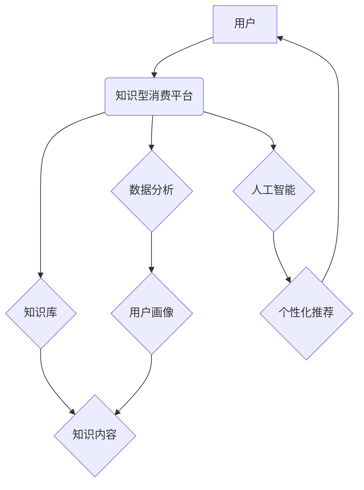

                 

## 关键词：知识型消费、人工智能、数据驱动、个性化推荐、知识图谱、机器学习、深度学习

## 1. 背景介绍

随着互联网技术的飞速发展和人工智能技术的不断突破，人们对信息的获取方式和消费方式发生了深刻的变化。传统的商品消费模式正在被知识型消费模式所取代，知识型消费已成为新兴的经济增长点。

知识型消费是指以知识、信息、技能等为主要内容的消费行为。它涵盖了广泛的领域，例如在线教育、在线课程、电子书、知识付费、咨询服务、智库研究等。

知识型消费的兴起，得益于以下几个因素：

* **信息爆炸时代:**  互联网时代，信息量呈指数级增长，人们对知识的需求日益强烈。
* **知识经济的崛起:**  全球经济结构正在向知识经济转型，知识成为重要的生产要素和竞争优势。
* **移动互联网的普及:**  智能手机和移动互联网的普及，使得人们随时随地可以获取知识信息。
* **人工智能技术的进步:**  人工智能技术的发展，为知识型消费提供了强大的技术支撑，例如个性化推荐、智能搜索等。

## 2. 核心概念与联系

**2.1 知识型消费的核心概念**

* **知识:** 指人类对客观世界认识和理解的结果，包括事实、概念、原理、技能等。
* **消费:** 指个人或组织为了满足自身需求而购买或使用商品或服务的行为。
* **知识型消费:** 指以知识、信息、技能等为主要内容的消费行为。

**2.2 知识型消费与相关技术的联系**

知识型消费与人工智能、数据分析、知识图谱等技术密切相关。

* **人工智能:**  人工智能技术可以帮助知识型消费平台提供个性化推荐、智能搜索、知识问答等服务，提升用户体验。
* **数据分析:**  数据分析技术可以帮助知识型消费平台了解用户需求、分析消费趋势、优化内容推荐等。
* **知识图谱:**  知识图谱可以帮助知识型消费平台组织和存储知识信息，实现知识的关联和推理，提供更丰富的知识服务。

**2.3 知识型消费的架构**



## 3. 核心算法原理 & 具体操作步骤

**3.1 算法原理概述**

知识型消费平台通常采用基于机器学习的推荐算法，例如协同过滤、内容过滤、混合推荐等算法，来为用户推荐相关的知识内容。

* **协同过滤:**  根据用户的历史行为数据，预测用户可能感兴趣的内容。
* **内容过滤:**  根据内容的主题、标签、作者等信息，推荐与用户兴趣相符的内容。
* **混合推荐:**  结合协同过滤和内容过滤算法，提高推荐的准确性和个性化程度。

**3.2 算法步骤详解**

以协同过滤算法为例，其具体操作步骤如下：

1. **数据收集:**  收集用户的历史行为数据，例如用户浏览过的内容、购买过的课程、评分过的书籍等。
2. **数据预处理:**  对收集到的数据进行清洗、转换、归一化等处理，以便于算法训练。
3. **用户-物品矩阵构建:**  将用户和物品信息构建成一个用户-物品矩阵，其中每个元素表示用户对物品的评分或行为。
4. **相似度计算:**  计算用户之间的相似度或物品之间的相似度，例如使用余弦相似度、皮尔逊相关系数等方法。
5. **推荐生成:**  根据用户的相似用户或物品，推荐用户可能感兴趣的内容。

**3.3 算法优缺点**

* **优点:**  能够根据用户的历史行为数据，推荐个性化的内容，提高用户体验。
* **缺点:**  容易出现冷启动问题，即对于新用户或新内容，难以进行推荐。

**3.4 算法应用领域**

协同过滤算法广泛应用于以下领域：

* **电子商务:**  商品推荐、用户画像
* **在线教育:**  课程推荐、学习路径规划
* **内容平台:**  文章推荐、视频推荐
* **社交网络:**  好友推荐、兴趣小组推荐

## 4. 数学模型和公式 & 详细讲解 & 举例说明

**4.1 数学模型构建**

协同过滤算法的核心是用户-物品矩阵，其数学模型可以表示为：

$$
R = \begin{bmatrix}
r_{11} & r_{12} & \cdots & r_{1m} \\
r_{21} & r_{22} & \cdots & r_{2m} \\
\vdots & \vdots & \ddots & \vdots \\
r_{n1} & r_{n2} & \cdots & r_{nm}
\end{bmatrix}
$$

其中：

* $R$ 为用户-物品矩阵
* $r_{ij}$ 表示用户 $i$ 对物品 $j$ 的评分或行为

**4.2 公式推导过程**

用户相似度计算可以使用余弦相似度公式：

$$
\text{sim}(u_i, u_j) = \frac{u_i \cdot u_j}{||u_i|| ||u_j||}
$$

其中：

* $u_i$ 和 $u_j$ 为用户 $i$ 和 $j$ 的评分向量
* $u_i \cdot u_j$ 为两个向量的点积
* $||u_i||$ 和 $||u_j||$ 为两个向量的模长

**4.3 案例分析与讲解**

假设有两个用户 $A$ 和 $B$，他们对以下三部电影的评分如下：

* 电影 1: $A$ 评分 5，$B$ 评分 4
* 电影 2: $A$ 评分 3，$B$ 评分 5
* 电影 3: $A$ 评分 4，$B$ 评分 3

我们可以计算出 $A$ 和 $B$ 的余弦相似度为：

$$
\text{sim}(A, B) = \frac{(5 \times 4) + (3 \times 5) + (4 \times 3)}{\sqrt{5^2 + 3^2 + 4^2} \sqrt{4^2 + 5^2 + 3^2}} = 0.75
$$

该结果表明 $A$ 和 $B$ 的兴趣偏好相似度较高。

## 5. 项目实践：代码实例和详细解释说明

**5.1 开发环境搭建**

* Python 3.x
* Jupyter Notebook
* scikit-learn

**5.2 源代码详细实现**

```python
from sklearn.metrics.pairwise import cosine_similarity

# 用户-物品矩阵
ratings = {
    'user1': {'movie1': 5, 'movie2': 3, 'movie3': 4},
    'user2': {'movie1': 4, 'movie2': 5, 'movie3': 3},
    'user3': {'movie1': 3, 'movie2': 4, 'movie3': 5}
}

# 将用户-物品矩阵转换为评分向量
user_vectors = []
for user, ratings in ratings.items():
    user_vector = list(ratings.values())
    user_vectors.append(user_vector)

# 计算用户之间的余弦相似度
similarity_matrix = cosine_similarity(user_vectors)

# 打印相似度矩阵
print(similarity_matrix)
```

**5.3 代码解读与分析**

* 代码首先定义了一个用户-物品矩阵 `ratings`，其中每个键代表一个用户，值是一个字典，包含用户对每个电影的评分。
* 然后，代码将用户-物品矩阵转换为评分向量，每个向量代表一个用户的评分信息。
* 使用 `cosine_similarity` 函数计算用户之间的余弦相似度，并将结果存储在 `similarity_matrix` 中。
* 最后，代码打印出相似度矩阵，其中每个元素表示两个用户之间的相似度。

**5.4 运行结果展示**

运行代码后，会输出一个相似度矩阵，例如：

```
[[1.         0.70710678 0.70710678]
 [0.70710678 1.         0.70710678]
 [0.70710678 0.70710678 1.        ]]
```

该矩阵表示三个用户之间的相似度，例如，用户 1 和用户 2 的相似度为 0.7071。

## 6. 实际应用场景

**6.1 在线教育平台**

* **个性化课程推荐:**  根据用户的学习历史、兴趣偏好、学习能力等信息，推荐个性化的课程。
* **学习路径规划:**  根据用户的学习目标和进度，规划个性化的学习路径。
* **智能辅导:**  利用人工智能技术，为用户提供智能辅导和答疑服务。

**6.2 内容平台**

* **个性化内容推荐:**  根据用户的阅读历史、浏览记录、点赞行为等信息，推荐个性化的文章、视频、音频等内容。
* **内容分类和标签:**  利用知识图谱技术，对内容进行分类和标签，方便用户搜索和浏览。
* **智能搜索:**  利用自然语言处理技术，理解用户的搜索意图，提供更精准的搜索结果。

**6.3 电子商务平台**

* **商品推荐:**  根据用户的购买历史、浏览记录、购物车内容等信息，推荐个性化的商品。
* **用户画像:**  分析用户的消费行为，构建用户画像，为商家提供精准的营销策略。
* **个性化营销:**  根据用户的兴趣偏好和需求，提供个性化的营销服务。

**6.4 未来应用展望**

知识型消费将继续发展壮大，未来将呈现以下趋势：

* **更加个性化:**  人工智能技术将进一步提升知识型消费的个性化程度，为用户提供更加精准的推荐和服务。
* **更加智能化:**  知识型消费平台将更加智能化，能够理解用户的需求，主动提供帮助。
* **更加融合化:**  知识型消费将与其他领域更加融合，例如游戏、娱乐、社交等，形成更加丰富的消费体验。

## 7. 工具和资源推荐

**7.1 学习资源推荐**

* **书籍:**
    * 《推荐系统实践》
    * 《机器学习》
    * 《深度学习》
* **在线课程:**
    * Coursera:  推荐系统课程
    * edX:  机器学习课程
    * Udemy:  深度学习课程

**7.2 开发工具推荐**

* **Python:**  Python 是机器学习和深度学习的常用编程语言。
* **scikit-learn:**  scikit-learn 是 Python 的一个机器学习库，提供各种推荐算法和工具。
* **TensorFlow:**  TensorFlow 是 Google 开发的深度学习框架。
* **PyTorch:**  PyTorch 是 Facebook 开发的深度学习框架。

**7.3 相关论文推荐**

* **协同过滤算法:**
    * "Collaborative Filtering: A User-Based Approach"
    * "Item-Based Collaborative Filtering Recommendation Algorithms"
* **内容过滤算法:**
    * "Content-Based Recommendation Systems"
    * "A Survey of Content-Based Recommendation Systems"
* **混合推荐算法:**
    * "Hybrid Recommender Systems: A Survey"
    * "A Survey of Hybrid Recommender Systems"

## 8. 总结：未来发展趋势与挑战

**8.1 研究成果总结**

知识型消费的兴起，推动了人工智能、数据分析、知识图谱等技术的快速发展。

* **人工智能技术:**  人工智能技术为知识型消费提供了强大的技术支撑，例如个性化推荐、智能搜索、知识问答等服务。
* **数据分析技术:**  数据分析技术帮助知识型消费平台了解用户需求、分析消费趋势、优化内容推荐等。
* **知识图谱技术:**  知识图谱技术帮助知识型消费平台组织和存储知识信息，实现知识的关联和推理，提供更丰富的知识服务。

**8.2 未来发展趋势**

* **更加个性化:**  人工智能技术将进一步提升知识型消费的个性化程度，为用户提供更加精准的推荐和服务。
* **更加智能化:**  知识型消费平台将更加智能化，能够理解用户的需求，主动提供帮助。
* **更加融合化:**  知识型消费将与其他领域更加融合，例如游戏、娱乐、社交等，形成更加丰富的消费体验。

**8.3 面临的挑战**

* **数据安全和隐私保护:**  知识型消费平台需要收集大量的用户数据，如何保障数据安全和隐私保护是一个重要的挑战。
* **算法公平性和可解释性:**  人工智能算法可能会存在偏见和不可解释性，需要进行改进和优化。
* **内容质量和真实性:**  知识型消费平台需要提供高质量、真实可靠的内容，避免虚假信息和低俗内容的传播。

**8.4 研究展望**

未来，知识型消费领域的研究方向将包括：

* **更先进的人工智能算法:**  开发更智能、更精准、更个性化的推荐算法。
* **知识图谱的构建和应用:**  构建更加完善的知识图谱，为知识型消费提供更丰富的知识服务。
* **数据安全和隐私保护技术:**  开发更有效的技术手段，保障用户数据安全和隐私保护。
* **知识型消费的伦理问题:**  探讨知识型消费的伦理问题，例如算法公平性、内容真实性等。


## 9. 附录：常见问题与解答

**9.1 如何提高知识型消费平台的推荐准确率？**

* 收集更多用户数据，例如用户浏览历史、购买记录、评分行为等。
* 使用更先进的推荐算法，例如深度学习算法。
* 结合多种推荐算法，例如协同过滤和内容过滤算法。
* 进行用户画像分析，根据用户的兴趣偏好和需求进行个性化推荐。

**9.2 如何保障知识型消费平台的用户数据安全和隐私保护？**

* 使用加密技术保护用户数据。
* 采用匿名化技术，隐藏用户的个人信息。
* 建立完善的数据安全管理制度。
* 遵守相关法律法规，保护用户的隐私权。

**9.3 如何避免知识型消费平台的算法出现偏见？**

* 使用多元化的训练数据，避免算法过度依赖特定类型的用户数据。
* 定期评估算法的公平性，及时发现和解决偏见问题。
* 开发可解释性更强的算法，方便用户理解算法的决策过程。


作者：禅与计算机程序设计艺术 / Zen and the Art of Computer Programming<end_of_turn>

