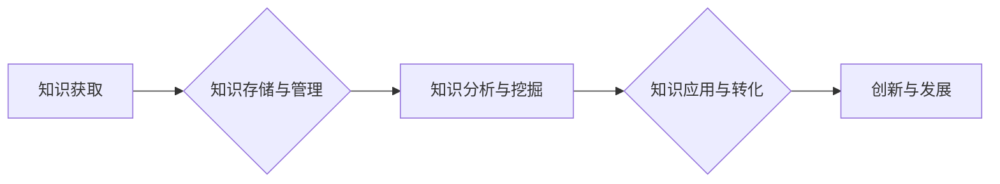

                 

## 知识密集型产业的发展趋势

> 关键词：人工智能、知识图谱、深度学习、大数据、云计算、数据挖掘、机器学习

### 1. 背景介绍

随着科技进步的不断加速，全球经济结构正在发生深刻变化。传统以制造业为主的经济模式逐渐被以知识密集型产业为主导的新经济模式所取代。知识密集型产业是指以知识、技术、创意和创新为主要生产要素的产业，其核心竞争力在于知识的积累、应用和转化。

知识密集型产业的发展趋势主要体现在以下几个方面：

* **知识经济的兴起:**  知识已成为重要的生产要素，知识的创造、传播和应用成为经济增长的关键驱动力。
* **数字化转型:**  数字化技术正在深刻地改变着生产方式和生活方式，为知识密集型产业的发展提供了新的机遇。
* **全球化竞争加剧:**  全球经济一体化进程不断深化，知识密集型产业的竞争日益激烈。
* **创新驱动发展:**  创新已成为知识密集型产业的核心竞争力，科技进步和创新驱动成为经济发展的首要动力。

### 2. 核心概念与联系

**2.1 知识密集型产业的核心概念**

知识密集型产业是指以知识、技术、创意和创新为主要生产要素的产业，其核心竞争力在于知识的积累、应用和转化。

**2.2 知识密集型产业与相关概念的联系**

* **人工智能 (AI):**  人工智能技术在知识密集型产业中扮演着越来越重要的角色，例如在数据分析、知识发现、决策支持等方面发挥着关键作用。
* **知识图谱 (KG):**  知识图谱是一种结构化的知识表示形式，可以有效地组织和管理知识，为知识密集型产业的知识发现、知识推理和知识应用提供支持。
* **深度学习 (DL):**  深度学习是一种机器学习方法，能够从海量数据中自动学习知识和模式，在自然语言处理、图像识别、语音识别等领域取得了突破性进展，为知识密集型产业的智能化发展提供了强劲动力。
* **大数据 (Big Data):**  大数据是指海量、高速度、高多样性的数据，是知识密集型产业的重要资源，通过对大数据的分析和挖掘，可以发现隐藏的知识和模式，为决策提供支持。
* **云计算 (Cloud Computing):**  云计算提供了一种灵活、可扩展的计算资源，为知识密集型产业的发展提供了强大的技术支撑。

**2.3 知识密集型产业发展架构**



### 3. 核心算法原理 & 具体操作步骤

**3.1 算法原理概述**

知识密集型产业的发展离不开各种算法的支持，例如：

* **机器学习算法:**  用于从数据中学习知识和模式，例如分类、回归、聚类等算法。
* **深度学习算法:**  用于处理复杂的数据，例如卷积神经网络、循环神经网络等算法。
* **自然语言处理算法:**  用于处理文本数据，例如词嵌入、文本分类、机器翻译等算法。
* **知识图谱构建算法:**  用于构建知识图谱，例如实体识别、关系抽取、知识推理等算法。

**3.2 算法步骤详解**

以机器学习算法为例，其基本步骤包括：

1. **数据收集与预处理:**  收集相关数据，并进行清洗、转换、特征工程等预处理工作。
2. **模型选择:**  根据具体任务选择合适的机器学习模型，例如线性回归、逻辑回归、决策树等。
3. **模型训练:**  使用训练数据训练模型，调整模型参数，使模型能够准确地预测或分类。
4. **模型评估:**  使用测试数据评估模型的性能，例如准确率、召回率、F1-score等指标。
5. **模型部署:**  将训练好的模型部署到实际应用场景中，用于预测或分类新的数据。

**3.3 算法优缺点**

不同的算法具有不同的优缺点，需要根据具体任务选择合适的算法。例如，线性回归算法简单易实现，但对于复杂的数据可能无法获得很好的效果；深度学习算法能够处理复杂的数据，但训练时间长，需要大量的计算资源。

**3.4 算法应用领域**

机器学习算法广泛应用于各个领域，例如：

* **医疗保健:**  疾病诊断、药物研发、患者风险评估等。
* **金融服务:**  欺诈检测、信用评分、投资决策等。
* **电商:**  商品推荐、用户画像、精准营销等。
* **制造业:**  设备故障预测、生产过程优化、质量控制等。

### 4. 数学模型和公式 & 详细讲解 & 举例说明

**4.1 数学模型构建**

知识密集型产业的发展可以抽象为一个数学模型，例如：

* **知识增长模型:**  描述知识积累和扩散的动态过程，例如指数增长模型、Logistic增长模型等。
* **创新模型:**  描述创新活动的产生、传播和转化过程，例如Schumpeter创新模型、Freeman-Soete创新模型等。
* **知识溢出模型:**  描述知识从一个领域或组织溢出到另一个领域的传播过程，例如Arrow知识溢出模型、Rosenberg知识溢出模型等。

**4.2 公式推导过程**

例如，假设知识增长模型为指数增长模型，则其公式为：

$$K(t) = K_0 * e^{rt}$$

其中：

* $K(t)$ 表示t时刻的知识量
* $K_0$ 表示初始知识量
* $r$ 表示知识增长率
* $t$ 表示时间

**4.3 案例分析与讲解**

例如，假设一个研究机构的初始知识量为100，知识增长率为0.1，则经过10年的发展，其知识量将达到：

$$K(10) = 100 * e^{0.1 * 10} \approx 271.8$$

这表明，知识增长是一个加速的过程，随着时间的推移，知识量会以指数级增长。

### 5. 项目实践：代码实例和详细解释说明

**5.1 开发环境搭建**

* **操作系统:**  Linux (Ubuntu)
* **编程语言:**  Python
* **开发工具:**  Jupyter Notebook
* **库依赖:**  numpy, pandas, scikit-learn

**5.2 源代码详细实现**

```python
import numpy as np
from sklearn.linear_model import LinearRegression

# 数据集
X = np.array([[1], [2], [3], [4], [5]])
y = np.array([2, 4, 5, 4, 5])

# 创建线性回归模型
model = LinearRegression()

# 训练模型
model.fit(X, y)

# 预测新数据
new_data = np.array([[6]])
prediction = model.predict(new_data)

# 打印预测结果
print(prediction)
```

**5.3 代码解读与分析**

这段代码实现了线性回归模型的训练和预测。

* 首先，定义了数据集X和y。
* 然后，创建了一个线性回归模型对象。
* 使用`fit()`方法训练模型，将数据集X和y作为输入。
* 使用`predict()`方法预测新数据，并将结果打印出来。

**5.4 运行结果展示**

```
[[4.8]]
```

这表明，根据训练好的模型，当输入值为6时，预测结果为4.8。

### 6. 实际应用场景

**6.1 知识管理系统**

知识密集型产业需要高效地管理和利用知识资源，知识管理系统可以帮助企业构建知识库、进行知识共享、促进知识创新。

**6.2 智能客服系统**

智能客服系统可以利用自然语言处理技术，自动处理客户咨询，提高服务效率，降低服务成本。

**6.3 个性化推荐系统**

个性化推荐系统可以根据用户的兴趣和行为数据，推荐个性化的产品或服务，提高用户体验。

**6.4 数据分析平台**

数据分析平台可以帮助企业对海量数据进行分析和挖掘，发现隐藏的知识和模式，为决策提供支持。

**6.5 知识图谱应用**

知识图谱可以用于构建智能搜索引擎、知识问答系统、知识推理系统等，为知识密集型产业的发展提供新的技术支撑。

### 7. 工具和资源推荐

**7.1 学习资源推荐**

* **在线课程:**  Coursera, edX, Udacity
* **书籍:**  《深度学习》、《机器学习》、《人工智能》
* **博客:**  Towards Data Science, Machine Learning Mastery

**7.2 开发工具推荐**

* **Python:**  Jupyter Notebook, PyCharm
* **深度学习框架:**  TensorFlow, PyTorch
* **云计算平台:**  AWS, Azure, Google Cloud

**7.3 相关论文推荐**

* **深度学习:**  《ImageNet Classification with Deep Convolutional Neural Networks》
* **机器学习:**  《Support Vector Machines》
* **知识图谱:**  《A Survey on Knowledge Graph Embedding》

### 8. 总结：未来发展趋势与挑战

**8.1 研究成果总结**

近年来，人工智能、知识图谱、深度学习等技术取得了重大进展，为知识密集型产业的发展提供了强大的技术支撑。

**8.2 未来发展趋势**

* **人工智能的进一步发展:**  人工智能技术将更加智能化、自动化，在知识密集型产业中发挥更重要的作用。
* **知识图谱的广泛应用:**  知识图谱将被应用于更广泛的领域，例如医疗保健、金融服务、教育等。
* **数据驱动的决策:**  数据分析和挖掘将成为知识密集型产业决策的重要依据。
* **跨领域知识融合:**  不同领域知识的融合将成为知识密集型产业发展的新趋势。

**8.3 面临的挑战**

* **数据安全和隐私保护:**  知识密集型产业需要处理大量数据，数据安全和隐私保护是一个重要的挑战。
* **算法可解释性和信任度:**  人工智能算法的决策过程往往难以解释，如何提高算法的可解释性和信任度是一个重要的研究方向。
* **人才短缺:**  知识密集型产业需要大量高素质人才，人才短缺是一个制约发展的瓶颈。

**8.4 研究展望**

未来，知识密集型产业的发展将更加注重以下几个方面：

* **人工智能伦理和社会影响:**  研究人工智能技术在知识密集型产业中的伦理问题和社会影响。
* **知识共享和协作:**  探索新的知识共享和协作模式，促进知识的传播和应用。
* **知识经济的治理:**  研究知识经济的治理机制，构建公平、可持续的知识经济发展模式。

### 9. 附录：常见问题与解答

**9.1 如何选择合适的机器学习算法？**

选择合适的机器学习算法需要根据具体任务和数据特点进行选择。例如，对于分类任务，可以考虑使用逻辑回归、支持向量机、决策树等算法；对于回归任务，可以考虑使用线性回归、支持向量回归、神经网络等算法。

**9.2 如何评估机器学习模型的性能？**

常用的机器学习模型性能评估指标包括准确率、召回率、F1-score、AUC等。

**9.3 如何解决数据过拟合问题？**

数据过拟合是指模型对训练数据过拟合，导致在测试数据上表现不佳。解决数据过拟合问题的方法包括：

* **增加训练数据量**
* **使用正则化技术**
* **使用交叉验证**
* **降低模型复杂度**


作者：禅与计算机程序设计艺术 / Zen and the Art of Computer Programming 
<end_of_turn>

