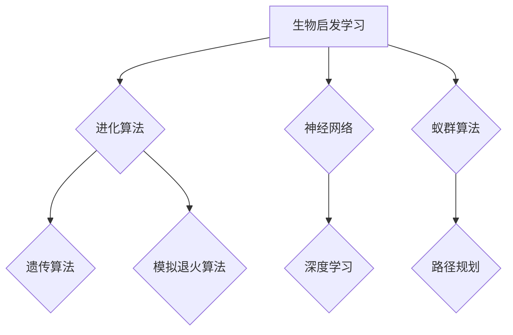

                 

## 知识的生物启发学习：自然界的智慧借鉴

> 关键词：生物启发学习、人工智能、机器学习、神经网络、进化算法、自然优化、深度学习、知识图谱

## 1. 背景介绍

在信息时代，人类对知识的获取、处理和应用能力面临着前所未有的挑战。传统的人工智能方法，例如基于规则的系统和符号逻辑，在面对复杂、不确定和动态的环境时显得捉襟见肘。而生物启发学习，通过借鉴自然界生物的进化、学习和适应机制，为解决这些挑战提供了新的思路和方法。

自然界中，生物通过漫长的进化过程，发展出高效的知识获取、存储和利用机制。例如，神经网络的结构和功能灵感来源于大脑神经元网络；进化算法借鉴了自然选择和遗传变异的原理；蚁群算法模拟了蚂蚁群体觅食的行为模式。这些生物启发学习方法在解决复杂问题、优化决策、发现新知识等方面展现出强大的潜力。

## 2. 核心概念与联系

生物启发学习的核心概念是将生物的进化、学习和适应机制应用于人工智能领域。

**2.1 生物启发学习的原理**

生物启发学习的核心原理是模仿生物的进化、学习和适应机制，通过模拟自然界的现象和过程，设计出能够解决复杂问题的算法和模型。

**2.2 生物启发学习与人工智能的关系**

生物启发学习是人工智能领域的重要研究方向之一，它为人工智能提供了新的思路和方法，帮助人工智能系统更好地理解和处理复杂世界。

**2.3 生物启发学习的应用领域**

生物启发学习的应用领域非常广泛，包括：

* **机器学习:** 神经网络、进化算法、蚁群算法等生物启发学习方法被广泛应用于机器学习领域，用于分类、回归、聚类、预测等任务。
* **优化问题:** 进化算法、模拟退火算法等生物启发学习方法可以用于解决各种优化问题，例如路径规划、资源分配、调度问题等。
* **知识发现:** 基于生物启发学习的知识图谱构建方法可以帮助人们更好地理解和组织知识，发现隐藏的知识关系。
* **机器人控制:** 生物启发学习方法可以用于设计更智能、更适应环境的机器人控制算法。

**2.4 Mermaid 流程图**



## 3. 核心算法原理 & 具体操作步骤

### 3.1 算法原理概述

进化算法是一种模仿自然选择和遗传变异的原理，用于解决优化问题的算法。

### 3.2 算法步骤详解

1. **初始化种群:** 生成一个初始的个体集合，称为种群。每个个体代表一个可能的解决方案。
2. **评估适应度:** 对每个个体进行评估，计算其适应度值，适应度值越高，表示该个体越接近理想的解决方案。
3. **选择操作:** 根据个体的适应度值，选择部分个体作为父代，用于下一代的生成。选择操作通常采用概率性方法，例如轮盘赌选择、锦标赛选择等。
4. **交叉操作:** 将两个父代个体进行交叉操作，生成新的个体，称为子代。交叉操作模拟了生物的遗传变异过程。
5. **变异操作:** 对子代个体进行变异操作，随机改变个体的一部分基因，增加种群的多样性。
6. **重复步骤2-5:** 重复上述步骤，直到达到预设的终止条件，例如最大迭代次数或最佳适应度值。

### 3.3 算法优缺点

**优点:**

* 能够解决复杂、非线性、多目标优化问题。
* 对问题的初始状态不敏感。
* 能够找到全局最优解或近似最优解。

**缺点:**

* 算法收敛速度较慢。
* 需要大量的计算资源。
* 难以确定最佳参数设置。

### 3.4 算法应用领域

进化算法广泛应用于以下领域：

* **工程设计:** 结构优化、机械设计、电路设计等。
* **金融投资:** 投资组合优化、风险管理等。
* **生物信息学:** 基因序列分析、蛋白质结构预测等。
* **人工智能:** 机器学习、神经网络训练等。

## 4. 数学模型和公式 & 详细讲解 & 举例说明

### 4.1 数学模型构建

进化算法的数学模型主要包括个体、适应度函数、选择、交叉和变异操作等。

* **个体:** 个体表示一个可能的解决方案，通常用一个向量或字符串表示。
* **适应度函数:** 适应度函数用于评估个体的优劣，适应度值越高，表示个体越接近理想的解决方案。
* **选择操作:** 选择操作用于从父代个体中选择部分个体作为下一代的父代。
* **交叉操作:** 交叉操作用于生成新的个体，模拟生物的遗传变异过程。
* **变异操作:** 变异操作用于随机改变个体的一部分基因，增加种群的多样性。

### 4.2 公式推导过程

**适应度函数:**

$$
f(x) = \frac{1}{1 + e^{-(x - \mu)/\sigma}}
$$

其中，$x$ 是个体的基因值，$\mu$ 是目标值，$\sigma$ 是标准差。

**选择操作:**

轮盘赌选择:

$$
P(i) = \frac{f(x_i)}{\sum_{j=1}^{N} f(x_j)}
$$

其中，$P(i)$ 是个体 $x_i$ 被选择的概率，$N$ 是种群大小。

### 4.3 案例分析与讲解

假设我们要用进化算法优化一个函数 $f(x) = x^2$，目标是找到最小值。

1. **初始化种群:** 生成一个包含 10 个个体的种群，每个个体的基因值随机生成。
2. **评估适应度:** 计算每个个体的适应度值，即 $f(x)$ 的值。
3. **选择操作:** 使用轮盘赌选择，选择适应度值最高的个体作为父代。
4. **交叉操作:** 将两个父代个体进行交叉操作，生成新的个体。
5. **变异操作:** 对子代个体进行变异操作，随机改变个体的一部分基因。
6. **重复步骤2-5:** 重复上述步骤，直到找到最小值。

## 5. 项目实践：代码实例和详细解释说明

### 5.1 开发环境搭建

* Python 3.x
* NumPy
* SciPy

### 5.2 源代码详细实现

```python
import numpy as np

# 定义适应度函数
def fitness_function(x):
    return x**2

# 定义种群大小
population_size = 10

# 定义最大迭代次数
max_iterations = 100

# 初始化种群
population = np.random.rand(population_size)

# 迭代优化
for i in range(max_iterations):
    # 评估适应度
    fitness_values = fitness_function(population)

    # 选择父代
    selected_indices = np.random.choice(population_size, size=population_size, p=fitness_values / np.sum(fitness_values))

    # 交叉操作
    new_population = np.zeros_like(population)
    for j in range(0, population_size, 2):
        parent1_index = selected_indices[j]
        parent2_index = selected_indices[j + 1]
        crossover_point = np.random.randint(1, len(population[0]) - 1)
        new_population[j] = np.concatenate((population[parent1_index][:crossover_point], population[parent2_index][crossover_point:]))
        new_population[j + 1] = np.concatenate((population[parent2_index][:crossover_point], population[parent1_index][crossover_point:]))

    # 变异操作
    for j in range(population_size):
        mutation_point = np.random.randint(0, len(new_population[j]))
        new_population[j][mutation_point] = np.random.rand()

    # 更新种群
    population = new_population

# 输出最优解
best_index = np.argmin(fitness_function(population))
best_solution = population[best_index]
print(f"最优解: {best_solution}")
```

### 5.3 代码解读与分析

* 代码首先定义了适应度函数，用于评估个体的优劣。
* 然后初始化种群，并设置最大迭代次数。
* 迭代优化过程中，首先评估每个个体的适应度值，然后根据适应度值进行选择操作，选择适应度值最高的个体作为父代。
* 父代个体进行交叉操作和变异操作，生成新的个体。
* 新的个体替换旧的个体，继续迭代优化。
* 最终输出最优解。

### 5.4 运行结果展示

运行代码后，会输出最优解，即函数 $f(x) = x^2$ 的最小值。

## 6. 实际应用场景

### 6.1 机器学习

进化算法可以用于优化机器学习模型的参数，例如神经网络的权重和偏差。

### 6.2 优化问题

进化算法可以用于解决各种优化问题，例如路径规划、资源分配、调度问题等。

### 6.3 知识发现

进化算法可以用于构建知识图谱，发现隐藏的知识关系。

### 6.4 未来应用展望

随着人工智能技术的不断发展，生物启发学习方法将有更广泛的应用前景，例如：

* **个性化学习:** 根据学生的学习风格和能力，设计个性化的学习路径。
* **医疗诊断:** 利用进化算法分析患者的医疗数据，辅助医生进行诊断。
* **药物研发:** 利用进化算法设计新的药物分子。

## 7. 工具和资源推荐

### 7.1 学习资源推荐

* **书籍:**
    * 《进化算法》
    * 《人工智能：现代方法》
* **在线课程:**
    * Coursera: Evolutionary Algorithms
    * edX: Artificial Intelligence

### 7.2 开发工具推荐

* **Python:** 广泛用于人工智能开发，拥有丰富的库和工具。
* **SciPy:** 提供了进化算法的实现。
* **DEAP:** 一个用于进化计算的 Python 库。

### 7.3 相关论文推荐

* **《A Survey of Evolutionary Computation》**
* **《Genetic Algorithms in Search, Optimization, and Machine Learning》**

## 8. 总结：未来发展趋势与挑战

### 8.1 研究成果总结

生物启发学习方法取得了显著的成果，在解决复杂问题、优化决策、发现新知识等方面展现出强大的潜力。

### 8.2 未来发展趋势

* **多模态生物启发学习:** 将多种生物启发学习方法结合起来，例如神经网络、进化算法和蚁群算法。
* **深度学习与生物启发学习的融合:** 将深度学习与生物启发学习方法结合起来，设计出更智能、更适应环境的算法。
* **生物启发学习在边缘计算中的应用:** 将生物启发学习方法应用于边缘计算，提高边缘设备的智能化水平。

### 8.3 面临的挑战

* **算法效率:** 许多生物启发学习方法的计算复杂度较高，需要进一步提高算法效率。
* **参数设置:** 生物启发学习方法的参数设置对算法性能有很大影响，需要开发更智能的参数设置方法。
* **可解释性:** 一些生物启发学习方法的决策过程难以解释，需要提高算法的可解释性。

### 8.4 研究展望

未来，生物启发学习将继续是一个重要的研究方向，需要进一步探索生物的智慧，设计出更智能、更高效、更可解释的算法，为解决人类面临的各种挑战提供新的思路和方法。

## 9. 附录：常见问题与解答

* **Q: 生物启发学习与传统人工智能方法有什么区别？**

A: 生物启发学习方法借鉴了自然界的进化、学习和适应机制，而传统人工智能方法主要基于规则和符号逻辑。生物启发学习方法能够更好地处理复杂、不确定和动态的环境，并且对问题的初始状态不敏感。

* **Q: 生物启发学习方法有哪些应用场景？**

A: 生物启发学习方法广泛应用于机器学习、优化问题、知识发现、机器人控制等领域。

* **Q: 如何选择合适的生物启发学习方法？**

A: 选择合适的生物启发学习方法需要根据具体问题的特点和需求进行选择。例如，对于需要找到全局最优解的问题，可以选择进化算法；对于需要快速找到局部最优解的问题，可以选择蚁群算法。


作者：禅与计算机程序设计艺术 / Zen and the Art of Computer Programming<end_of_turn>

