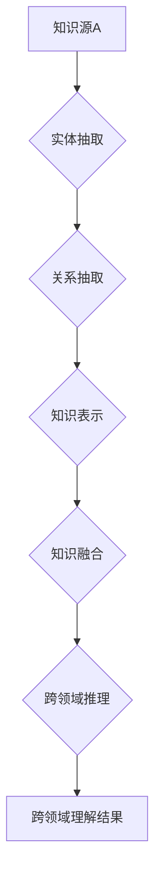

                 

## 知识的隐喻：跨领域理解的桥梁

> 关键词：跨领域理解、知识图谱、机器学习、深度学习、自然语言处理、知识表示、语义网络

### 1. 背景介绍

在当今数据爆炸的时代，信息孤岛现象日益突出。不同领域的数据分散存储，缺乏有效连接和理解，阻碍了知识的整合和创新。跨领域理解，即能够理解不同领域之间知识的联系和映射关系，成为人工智能发展的重要方向。

传统的知识表示方法，如本体论和规则库，难以有效地捕捉复杂、动态的知识关系。近年来，随着机器学习和深度学习技术的飞速发展，跨领域理解取得了显著进展。知识图谱、语义网络和嵌入式表示等方法为跨领域知识表示和推理提供了新的思路。

### 2. 核心概念与联系

**2.1 知识图谱**

知识图谱是一种基于知识表示的数据库，它以实体和关系为基本单元，将知识组织成图结构。知识图谱能够有效地存储、组织和查询知识，并支持跨领域知识推理和关联。

**2.2 语义网络**

语义网络是一种基于概念和关系的知识表示形式，它将概念作为节点，关系作为边，构建出一个语义网络。语义网络能够捕捉概念之间的语义联系，并支持概念推理和知识发现。

**2.3 嵌入式表示**

嵌入式表示将知识实体和关系映射到低维向量空间中，通过向量之间的相似性度量来表示知识关系。嵌入式表示能够捕捉知识的语义和结构信息，并支持跨领域知识匹配和推理。

**2.4 跨领域理解流程**



### 3. 核心算法原理 & 具体操作步骤

**3.1 算法原理概述**

跨领域理解算法通常包括以下步骤：

1. **知识抽取**: 从不同领域的数据源中抽取实体和关系。
2. **知识表示**: 将抽取的实体和关系表示成知识图谱、语义网络或嵌入式向量。
3. **知识融合**: 将不同领域知识图谱、语义网络或嵌入式向量进行融合，构建一个跨领域知识表示。
4. **跨领域推理**: 基于跨领域知识表示，进行跨领域知识推理和关联。

**3.2 算法步骤详解**

**3.2.1 实体抽取**

实体抽取是指从文本中识别出具有特定意义的实体，例如人名、地名、机构名等。常用的实体抽取方法包括：

* 基于规则的方法：利用预定义的规则和词典进行实体识别。
* 基于机器学习的方法：训练机器学习模型，例如条件随机场（CRF）或支持向量机（SVM），用于实体识别。
* 基于深度学习的方法：利用深度神经网络，例如循环神经网络（RNN）或卷积神经网络（CNN），进行实体识别。

**3.2.2 关系抽取**

关系抽取是指从文本中识别出实体之间的关系，例如“张三是北京大学教授”。常用的关系抽取方法包括：

* 基于规则的方法：利用预定义的规则和词典进行关系识别。
* 基于机器学习的方法：训练机器学习模型，例如逻辑回归或决策树，用于关系识别。
* 基于深度学习的方法：利用深度神经网络，例如图卷积网络（GCN）或Transformer，进行关系抽取。

**3.2.3 知识表示**

知识表示是指将抽取的实体和关系表示成知识图谱、语义网络或嵌入式向量。常用的知识表示方法包括：

* 知识图谱：将实体和关系表示成图结构，例如RDF或OWL。
* 语义网络：将概念和关系表示成网络结构，例如WordNet或ConceptNet。
* 嵌入式表示：将实体和关系映射到低维向量空间中，例如Word2Vec或TransE。

**3.2.4 知识融合**

知识融合是指将不同领域知识图谱、语义网络或嵌入式向量进行融合，构建一个跨领域知识表示。常用的知识融合方法包括：

* 实体对齐：将不同领域知识图谱中的实体进行对齐，建立实体之间的映射关系。
* 关系对齐：将不同领域知识图谱中的关系进行对齐，建立关系之间的映射关系。
* 知识图谱融合：将不同领域知识图谱进行融合，构建一个包含跨领域知识的综合知识图谱。

**3.2.5 跨领域推理**

跨领域推理是指基于跨领域知识表示，进行跨领域知识推理和关联。常用的跨领域推理方法包括：

* 规则推理：利用预定义的规则进行知识推理。
* 逻辑推理：利用逻辑推理方法进行知识推理。
* 概率推理：利用概率推理方法进行知识推理。

**3.3 算法优缺点**

**优点:**

* 能够有效地捕捉跨领域知识关系。
* 支持跨领域知识推理和关联。
* 能够促进知识整合和创新。

**缺点:**

* 知识抽取和知识表示仍然是一个挑战。
* 跨领域知识融合和推理算法复杂度高。
* 需要大量的训练数据和计算资源。

**3.4 算法应用领域**

跨领域理解算法在多个领域都有广泛的应用，例如：

* **医疗保健**: 将不同医疗领域知识融合，辅助医生诊断和治疗。
* **金融**: 分析金融市场数据，预测股票价格和风险。
* **教育**: 个性化学习推荐，帮助学生更好地理解知识。
* **法律**: 分析法律法规，辅助律师进行法律咨询和诉讼。

### 4. 数学模型和公式 & 详细讲解 & 举例说明

**4.1 数学模型构建**

假设我们有两个知识图谱，分别为 $G_1$ 和 $G_2$。$G_1$ 包含实体集合 $E_1$ 和关系集合 $R_1$，$G_2$ 包含实体集合 $E_2$ 和关系集合 $R_2$。

我们希望构建一个跨领域知识表示 $G$，该表示包含 $E_1 \cup E_2$ 和 $R_1 \cup R_2$。

**4.2 公式推导过程**

为了构建 $G$，我们可以使用以下公式：

$$
G = G_1 \cup G_2
$$

其中，$G_1 \cup G_2$ 表示将 $G_1$ 和 $G_2$ 合并在一起。

**4.3 案例分析与讲解**

例如，假设 $G_1$ 是一个关于电影的知识图谱，$G_2$ 是一个关于演员的知识图谱。我们可以将这两个知识图谱合并成一个跨领域知识表示 $G$，该表示包含电影实体、演员实体和电影-演员关系。

**4.3.1 举例说明**

* $G_1$ 中包含实体：电影《流浪地球》
* $G_2$ 中包含实体：演员吴京

通过将 $G_1$ 和 $G_2$ 合并，我们可以得到 $G$ 中的实体：电影《流浪地球》和演员吴京，以及关系：吴京出演了《流浪地球》。

### 5. 项目实践：代码实例和详细解释说明

**5.1 开发环境搭建**

* Python 3.x
* PyTorch 或 TensorFlow
* NLTK 或 SpaCy

**5.2 源代码详细实现**

```python
import torch
import torch.nn as nn

# 定义一个简单的实体识别模型
class EntityRecognizer(nn.Module):
    def __init__(self, vocab_size, embedding_dim, hidden_dim):
        super(EntityRecognizer, self).__init__()
        self.embedding = nn.Embedding(vocab_size, embedding_dim)
        self.lstm = nn.LSTM(embedding_dim, hidden_dim)
        self.fc = nn.Linear(hidden_dim, vocab_size)

    def forward(self, x):
        embedded = self.embedding(x)
        output, _ = self.lstm(embedded)
        output = self.fc(output[:, -1, :])
        return output

# 实例化模型
model = EntityRecognizer(vocab_size=10000, embedding_dim=128, hidden_dim=256)

# 训练模型
# ...

# 使用模型进行实体识别
# ...
```

**5.3 代码解读与分析**

该代码实现了一个简单的实体识别模型。模型使用嵌入层将单词映射到低维向量空间，使用LSTM层捕捉单词之间的上下文关系，最后使用全连接层进行实体分类。

**5.4 运行结果展示**

模型训练完成后，可以将模型应用于实际文本数据进行实体识别。例如，可以将模型应用于新闻文章，识别出文章中的人物、地点、机构等实体。

### 6. 实际应用场景

**6.1 跨领域知识问答**

跨领域知识问答是指在多个领域知识的背景下，回答用户提出的问题。例如，用户问“张三是哪个大学的教授？”，系统需要从多个领域知识图谱中，例如人物知识图谱、教育机构知识图谱，找到张三和其所属大学的关系，并给出答案。

**6.2 跨领域知识推荐**

跨领域知识推荐是指根据用户的兴趣和偏好，推荐跨领域相关的知识。例如，用户对人工智能感兴趣，系统可以推荐人工智能相关的书籍、论文、视频，以及与人工智能相关的其他领域知识，例如机器学习、深度学习、自然语言处理等。

**6.3 跨领域知识发现**

跨领域知识发现是指从多个领域知识中发现新的知识关系和模式。例如，可以发现医疗领域和金融领域的知识关联，例如某些疾病与金融风险相关。

**6.4 未来应用展望**

随着人工智能技术的不断发展，跨领域理解将应用于更多领域，例如：

* **个性化教育**: 根据学生的学习兴趣和能力，提供个性化的学习内容和推荐。
* **智能医疗**: 辅助医生诊断疾病、制定治疗方案，并提供个性化的健康建议。
* **智能客服**: 理解用户的复杂需求，提供更精准和有效的服务。
* **科学研究**: 促进跨学科研究，加速科学发现。

### 7. 工具和资源推荐

**7.1 学习资源推荐**

* **书籍**:
    * 《知识表示与推理》
    * 《深度学习》
    * 《自然语言处理》
* **在线课程**:
    * Coursera: 自然语言处理
    * edX: 深度学习
    * Udacity: 机器学习工程师

**7.2 开发工具推荐**

* **知识图谱构建工具**:
    * Protégé
    * GraphDB
* **机器学习框架**:
    * PyTorch
    * TensorFlow
* **自然语言处理库**:
    * NLTK
    * SpaCy

**7.3 相关论文推荐**

* 《Knowledge Graph Embedding: A Survey》
* 《A Survey on Cross-Domain Knowledge Transfer》
* 《Cross-Domain Relation Extraction via Transfer Learning》

### 8. 总结：未来发展趋势与挑战

**8.1 研究成果总结**

近年来，跨领域理解取得了显著进展，特别是知识图谱、语义网络和嵌入式表示等方法为跨领域知识表示和推理提供了新的思路。

**8.2 未来发展趋势**

* **更强大的跨领域知识表示**: 探索更有效的知识表示方法，能够更好地捕捉跨领域知识关系和语义。
* **更智能的跨领域推理**: 开发更智能的跨领域推理算法，能够进行更复杂的知识推理和关联。
* **更广泛的应用场景**: 将跨领域理解应用于更多领域，例如个性化教育、智能医疗、智能客服等。

**8.3 面临的挑战**

* **跨领域知识表示的复杂性**: 不同领域知识的结构和语义差异较大，跨领域知识表示仍然是一个挑战。
* **跨领域知识推理的复杂性**: 跨领域知识推理需要考虑多个领域知识的关联和语义，算法复杂度高。
* **数据稀缺性**: 跨领域知识数据往往稀缺，难以训练有效的跨领域理解模型。

**8.4 研究展望**

未来，跨领域理解研究将继续朝着更智能、更广泛、更深入的方向发展。

### 9. 附录：常见问题与解答

**9.1 如何进行实体对齐？**

实体对齐是指将不同知识图谱中的实体进行匹配，建立实体之间的映射关系。常用的实体对齐方法包括基于规则的方法、基于机器学习的方法和基于深度学习的方法。

**9.2 如何进行关系对齐？**

关系对齐是指将不同知识图谱中的关系进行匹配，建立关系之间的映射关系。常用的关系对齐方法包括基于规则的方法、基于机器学习的方法和基于深度学习的方法。

**9.3 如何评估跨领域理解模型的性能？**

常用的评估指标包括准确率、召回率、F1-score、平均精度等。

作者：禅与计算机程序设计艺术 / Zen and the Art of Computer Programming


<end_of_turn>

