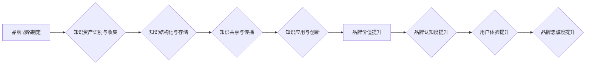

                 

## 关键词：知识管理、品牌建设、知识资产、品牌价值、数字化转型、数据分析、人工智能

## 1. 背景介绍

在当今数字化时代，品牌建设已不再仅仅依赖于传统营销手段，而是需要深度融合知识管理，将品牌内涵、价值观和用户体验有效地整合和传播。知识管理（KM）是指企业在组织、收集、存储、共享、利用和更新知识方面所采取的系统性方法和实践。它旨在将知识作为企业的核心资产，并将其转化为竞争优势。

品牌建设则是企业通过塑造品牌形象、建立品牌认知度和提升品牌忠诚度，最终实现商业目标的过程。品牌建设的核心在于建立独特的品牌价值，并将其传递给目标用户。

随着互联网和移动互联网的快速发展，信息爆炸和用户需求的多元化，传统品牌建设模式面临着新的挑战。企业需要更加注重用户体验、个性化定制和数字化互动，而知识管理为品牌建设提供了强大的支撑。

## 2. 核心概念与联系

### 2.1 知识管理与品牌建设的联系

知识管理和品牌建设之间存在着密切的联系。品牌建设需要丰富的知识资源作为基础，而知识管理则可以帮助企业有效地管理和利用这些知识资源。

* **品牌知识的积累和沉淀:** 品牌建设需要积累大量的品牌知识，包括品牌故事、品牌文化、品牌定位、品牌价值观等。知识管理可以帮助企业建立品牌知识库，并将其系统化、规范化和可视化。
* **品牌知识的共享和传播:** 品牌知识需要被有效地共享和传播给所有相关人员，包括员工、合作伙伴、客户等。知识管理可以提供平台和工具，促进品牌知识的内部和外部传播。
* **品牌知识的创新和应用:** 品牌知识需要不断地创新和应用，以适应市场变化和用户需求。知识管理可以帮助企业进行品牌知识的分析和挖掘，并将其转化为新的品牌策略和行动方案。

### 2.2  知识管理在品牌建设中的作用

知识管理在品牌建设中发挥着至关重要的作用，它可以帮助企业：

* **提升品牌认知度:** 通过知识管理，企业可以将品牌知识有效地传播给目标用户，提升品牌认知度和品牌影响力。
* **增强品牌价值:** 品牌知识是品牌价值的重要组成部分，知识管理可以帮助企业挖掘和提升品牌知识的价值，从而增强品牌竞争力。
* **提升用户体验:** 通过知识管理，企业可以更好地了解用户需求，并将其转化为产品和服务，从而提升用户体验和品牌忠诚度。
* **促进数字化转型:** 知识管理可以帮助企业将品牌知识数字化，并将其融入到数字化营销、客户关系管理等业务流程中，促进企业数字化转型。

### 2.3  知识管理与品牌建设的流程图



## 3. 核心算法原理 & 具体操作步骤

### 3.1  算法原理概述

知识管理在品牌建设中的应用涉及到多种算法和技术，例如：

* **文本挖掘算法:** 用于从海量文本数据中提取品牌相关知识，例如品牌提及、用户评价、舆情分析等。
* **知识图谱构建算法:** 用于构建品牌知识图谱，将品牌知识进行结构化表示，并建立知识之间的关联关系。
* **推荐算法:** 用于根据用户行为和偏好，推荐相关的品牌信息和产品。
* **机器学习算法:** 用于分析品牌数据，预测品牌趋势和用户需求。

### 3.2  算法步骤详解

以文本挖掘算法为例，其具体操作步骤如下：

1. **数据收集:** 收集品牌相关文本数据，例如官网内容、社交媒体评论、新闻报道等。
2. **数据预处理:** 对文本数据进行清洗、去噪、分词等预处理操作，以便于后续算法的应用。
3. **特征提取:** 使用自然语言处理技术，提取文本数据中的关键词、主题、情感等特征。
4. **知识抽取:** 使用规则引擎或机器学习模型，从文本数据中抽取品牌相关知识，例如品牌名称、品牌属性、品牌故事等。
5. **知识存储:** 将抽取的品牌知识存储到知识库中，并进行组织和管理。

### 3.3  算法优缺点

* **优点:** 文本挖掘算法能够从海量文本数据中自动提取品牌知识，提高效率和准确性。
* **缺点:** 文本挖掘算法对数据质量要求较高，需要进行充分的数据预处理和清洗。

### 3.4  算法应用领域

文本挖掘算法广泛应用于品牌建设领域，例如：

* **品牌监测:** 监控品牌相关信息在网络上的传播情况，及时发现品牌危机和舆情变化。
* **用户洞察:** 分析用户对品牌的评价和反馈，了解用户需求和痛点。
* **品牌定位:** 分析竞争对手的品牌信息，制定差异化的品牌定位策略。
* **内容营销:** 根据用户兴趣和需求，创作相关的品牌内容，提升品牌影响力。

## 4. 数学模型和公式 & 详细讲解 & 举例说明

### 4.1  数学模型构建

品牌价值可以被视为一个复杂的系统，其价值取决于多个因素的综合作用。我们可以使用数学模型来量化品牌价值，并分析不同因素对品牌价值的影响。

一个简单的品牌价值模型可以表示为：

$$BV = f(BC, BR, BE, BU)$$

其中：

* $BV$ 代表品牌价值
* $BC$ 代表品牌认知度
* $BR$ 代表品牌忠诚度
* $BE$ 代表品牌体验
* $BU$ 代表品牌资产

### 4.2  公式推导过程

每个因素的具体计算方法可以根据实际情况进行调整，例如：

* **品牌认知度:** 可以通过品牌搜索量、品牌提及量等指标进行量化。
* **品牌忠诚度:** 可以通过客户复购率、客户满意度等指标进行量化。
* **品牌体验:** 可以通过用户评价、口碑传播等指标进行量化。
* **品牌资产:** 可以包括品牌专利、品牌注册商标等资产价值。

### 4.3  案例分析与讲解

假设一家服装品牌想要评估其品牌价值，我们可以使用上述模型进行分析。

* **品牌认知度:** 通过搜索引擎数据分析，发现该品牌的搜索量为100万次/月。
* **品牌忠诚度:** 通过客户调查，发现该品牌的客户复购率为30%。
* **品牌体验:** 通过用户评价平台数据分析，发现该品牌的平均用户评分为4.5分。
* **品牌资产:** 该品牌拥有20个注册商标，估值总计为1000万元。

将这些数据代入品牌价值模型，我们可以得到该品牌的初步品牌价值评估结果。

## 5. 项目实践：代码实例和详细解释说明

### 5.1  开发环境搭建

为了实现品牌知识管理系统，我们可以使用以下开发环境：

* **操作系统:** Linux 或 Windows
* **编程语言:** Python
* **数据库:** MySQL 或 MongoDB
* **框架:** Django 或 Flask
* **工具:** Jupyter Notebook、Git

### 5.2  源代码详细实现

以下是一个简单的品牌知识管理系统代码示例，使用 Python 和 Django 框架实现：

```python
# models.py
from django.db import models

class BrandKnowledge(models.Model):
    title = models.CharField(max_length=255)
    content = models.TextField()
    category = models.CharField(max_length=255)
    created_at = models.DateTimeField(auto_now_add=True)
    updated_at = models.DateTimeField(auto_now=True)

# views.py
from django.shortcuts import render
from .models import BrandKnowledge

def index(request):
    knowledge = BrandKnowledge.objects.all()
    return render(request, 'index.html', {'knowledge': knowledge})

# index.html
<h1>品牌知识库</h1>
<ul>
    
    <li>
        <h2>{{ knowledge.title }}</h2>
        <p>{{ knowledge.content }}</p>
    </li>
    
</ul>
```

### 5.3  代码解读与分析

* **models.py:** 定义了品牌知识模型，包括标题、内容、类别、创建时间和更新时间等字段。
* **views.py:** 定义了首页视图，从数据库中获取所有品牌知识，并将其传递给模板。
* **index.html:** 定义了首页模板，展示所有品牌知识。

### 5.4  运行结果展示

运行上述代码，可以创建一个简单的品牌知识管理系统，用户可以浏览和查看品牌知识。

## 6. 实际应用场景

### 6.1  品牌危机管理

知识管理可以帮助企业建立品牌危机预警机制，及时发现潜在的品牌危机，并制定相应的应对策略。例如，可以通过监控品牌相关信息在网络上的传播情况，发现负面舆情，并及时进行澄清和引导。

### 6.2  品牌营销策划

知识管理可以帮助企业进行品牌营销策划，例如：

* **用户洞察:** 分析用户对品牌的评价和反馈，了解用户需求和痛点，制定更精准的营销策略。
* **内容营销:** 根据用户兴趣和需求，创作相关的品牌内容，提升品牌影响力。
* **口碑营销:** 利用用户评价和推荐，提升品牌口碑和信任度。

### 6.3  品牌产品开发

知识管理可以帮助企业进行品牌产品开发，例如：

* **产品定位:** 分析竞争对手的产品信息，制定差异化的产品定位策略。
* **产品创新:** 挖掘用户需求和市场趋势，开发符合用户需求的新产品。
* **产品推广:** 利用品牌知识和用户数据，制定有效的产品推广策略。

### 6.4  未来应用展望

随着人工智能、大数据等技术的不断发展，知识管理在品牌建设中的应用将更加广泛和深入。例如：

* **智能品牌监测:** 利用人工智能技术，自动识别和分析品牌相关信息，并提供智能化的品牌监测报告。
* **个性化品牌体验:** 利用大数据技术，分析用户行为和偏好，提供个性化的品牌体验。
* **品牌知识图谱:** 建立更加完善的品牌知识图谱，将品牌知识进行更深入的分析和挖掘。

## 7. 工具和资源推荐

### 7.1  学习资源推荐

* **书籍:**
    * 《知识管理》 - 弗兰克·林德曼
    * 《知识管理实践指南》 - 迈克尔·波特
* **在线课程:**
    * Coursera: Knowledge Management
    * edX: Introduction to Knowledge Management

### 7.2  开发工具推荐

* **文本挖掘工具:** NLTK, SpaCy
* **知识图谱构建工具:** Neo4j, GraphDB
* **机器学习平台:** TensorFlow, PyTorch

### 7.3  相关论文推荐

* **The Role of Knowledge Management in Brand Building**
* **Knowledge Management and Brand Equity: A Conceptual Framework**
* **Knowledge Management for Brand Innovation**

## 8. 总结：未来发展趋势与挑战

### 8.1  研究成果总结

知识管理在品牌建设中的应用已经取得了一定的成果，例如：

* 提升了品牌认知度和品牌价值
* 增强了用户体验和品牌忠诚度
* 促进了品牌创新和发展

### 8.2  未来发展趋势

未来，知识管理在品牌建设中的应用将更加智能化、个性化和数据化。例如：

* **人工智能驱动的知识管理:** 利用人工智能技术，自动识别、分析和管理品牌知识。
* **个性化品牌知识推荐:** 根据用户行为和偏好，推荐个性化的品牌知识。
* **数据驱动品牌知识决策:** 利用数据分析，为品牌知识决策提供支持。

### 8.3  面临的挑战

知识管理在品牌建设中的应用也面临着一些挑战，例如：

* **知识获取和共享的难点:** 品牌知识往往分散在不同的部门和人员手中，如何有效地获取和共享这些知识是一个难题。
* **知识质量的控制:** 品牌知识的质量直接影响到品牌建设的效果，如何保证知识的准确性和可靠性是一个挑战。
* **知识管理技术的应用:** 如何将先进的知识管理技术应用到品牌建设中，是一个需要不断探索和实践的问题。

### 8.4  研究展望

未来，我们需要继续深入研究知识管理在品牌建设中的应用，探索新的方法和技术，以更好地帮助企业利用知识资源，提升品牌竞争力。


## 9. 附录：常见问题与解答

### 9.1  常见问题

* **如何建立品牌知识库？**

可以采用多种方法建立品牌知识库，例如：

* **手动录入:** 由专业人员手动录入品牌知识。
* **自动提取:** 利用文本挖掘技术，从海量文本数据中自动提取品牌知识。
* **用户贡献:** 鼓励用户参与品牌知识的创建和分享。

* **如何保证知识库的知识质量？**

可以采用以下方法保证知识库的知识质量：

* **知识审核机制:** 建立知识审核机制，由专业人员对知识进行审核和验证。
* **知识更新机制:** 定期更新知识库，确保知识的时效性。
* **用户反馈机制:** 鼓励用户对知识进行反馈，并及时进行修改和完善。

* **如何利用知识库提升品牌价值？**

可以利用知识库进行以下方面的提升：

* **品牌定位:** 分析竞争对手和用户对品牌的认知，制定差异化的品牌定位策略。
* **品牌营销:** 根据用户需求和兴趣，创作相关的品牌内容，提升品牌影响力。
* **品牌产品开发:** 挖掘用户需求和市场趋势，开发符合用户需求的新产品。

作者：禅与计算机程序设计艺术 / Zen and the Art of Computer Programming 


<end_of_turn>

