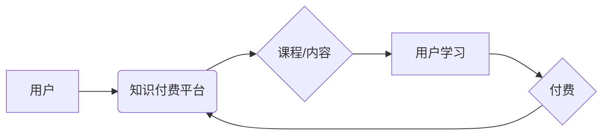

                 

## 程序员利用知识付费打造个人品牌

> 关键词：程序员、知识付费、个人品牌、技术博客、在线课程、社区建设、内容营销、收入多元化

### 1. 背景介绍

在当今科技飞速发展的时代，程序员作为数字时代的核心力量，拥有着巨大的价值和潜力。然而，随着编程人才的日益增多，竞争也日益激烈。传统的求职模式已经不再适用，程序员需要寻求新的途径来提升自身价值，建立个人品牌，并获得更丰厚的回报。知识付费作为一种新兴的商业模式，为程序员提供了打造个人品牌、实现收入多元化的绝佳机会。

知识付费是指通过提供有价值的知识和技能，向付费用户收取费用。它涵盖了多种形式，例如在线课程、技术博客、电子书、付费社区等。对于程序员来说，知识付费可以帮助他们：

* **建立个人品牌：** 通过分享自己的技术经验和见解，程序员可以建立自己的专业形象，成为行业内的知名人士。
* **获得被动收入：** 一旦课程或内容上线，程序员可以持续获得收益，无需花费过多时间精力。
* **拓展人脉资源：** 知识付费平台可以帮助程序员与其他开发者、企业和用户建立联系，拓展人脉资源。
* **提升个人价值：** 通过不断学习和创作，程序员可以不断提升自己的技能水平，增强竞争力。

### 2. 核心概念与联系

知识付费的核心概念是“价值交换”。程序员提供有价值的知识和技能，用户付费获取这些知识和技能。

**知识付费平台架构**



### 3. 核心算法原理 & 具体操作步骤

知识付费的成功离不开算法的支撑。以下是一些常用的算法原理和操作步骤：

### 3.1  算法原理概述

* **推荐算法：** 根据用户的学习历史、兴趣偏好等信息，推荐合适的课程或内容。
* **内容分发算法：** 根据内容的质量、热度、用户反馈等因素，决定内容的展示顺序和位置。
* **支付算法：** 安全、高效地处理用户支付流程。

### 3.2  算法步骤详解

* **推荐算法：**
    1. 收集用户数据：包括用户学习记录、浏览历史、评分反馈等。
    2. 建立用户画像：根据用户数据，构建用户兴趣、学习习惯等特征。
    3. 计算相似度：根据用户画像，计算用户与其他用户的相似度。
    4. 推荐课程：推荐与用户兴趣相符、评分高的课程。
* **内容分发算法：**
    1. 收集内容数据：包括内容标题、描述、标签、阅读量、评论数等。
    2. 计算内容权重：根据内容质量、热度、用户反馈等因素，计算内容的权重。
    3. 排序内容：根据内容权重，对内容进行排序，决定展示顺序。
    4. 分发内容：将排序后的内容展示给用户。
* **支付算法：**
    1. 用户发起支付请求。
    2. 平台验证用户身份和支付信息。
    3. 平台与支付机构进行交互，完成支付流程。
    4. 平台记录支付信息，并向用户提供支付成功通知。

### 3.3  算法优缺点

* **推荐算法：**
    * 优点：可以精准推荐用户感兴趣的内容，提高用户粘性。
    * 缺点：容易陷入“信息茧房”，缺乏多样性。
* **内容分发算法：**
    * 优点：可以提高优质内容的曝光率，促进用户发现。
    * 缺点：容易被“流量作弊”行为影响，降低算法的准确性。
* **支付算法：**
    * 优点：安全、高效，保障用户权益。
    * 缺点：需要与多个支付机构进行集成，成本较高。

### 3.4  算法应用领域

* **电商平台：** 推荐商品、个性化商品展示。
* **社交媒体：** 推荐好友、个性化内容流。
* **教育平台：** 推荐课程、个性化学习路径。
* **新闻平台：** 推荐新闻、个性化新闻订阅。

### 4. 数学模型和公式 & 详细讲解 & 举例说明

知识付费平台的算法模型通常基于数学模型和公式，例如：

### 4.1  数学模型构建

* **推荐算法：** 基于协同过滤、内容过滤、深度学习等算法模型。
* **内容分发算法：** 基于PageRank、TF-IDF、深度学习等算法模型。
* **支付算法：** 基于加密算法、安全协议等数学模型。

### 4.2  公式推导过程

* **协同过滤算法：** 
    * 用户相似度计算公式：
    $$Sim(u_i, u_j) = \frac{\sum_{m \in M(u_i \cap u_j)} r_{i,m} * r_{j,m}}{\sqrt{\sum_{m \in M(u_i)} r_{i,m}^2} * \sqrt{\sum_{m \in M(u_j)} r_{j,m}^2}}$$
    * 其中，$u_i$ 和 $u_j$ 表示两个用户，$M(u_i \cap u_j)$ 表示两个用户共同评分的物品集合，$r_{i,m}$ 表示用户 $u_i$ 对物品 $m$ 的评分。
* **PageRank算法：**
    $$PR(A) = (1-d) + d * \sum_{Page B \rightarrow A} \frac{PR(B)}{Outlink(B)}$$
    * 其中，$PR(A)$ 表示网页 $A$ 的 PageRank 值，$d$ 是阻尼系数，$Outlink(B)$ 表示网页 $B$ 的出链数量。

### 4.3  案例分析与讲解

* **推荐算法：** Netflix 使用协同过滤算法推荐电影，根据用户的观看历史和评分，推荐与用户兴趣相符的电影。
* **内容分发算法：** Google 使用 PageRank 算法对网页进行排序，将高质量的网页展示在搜索结果的顶部。

### 5. 项目实践：代码实例和详细解释说明

以下是一个简单的 Python 代码实例，演示如何使用协同过滤算法进行推荐：

```python
import numpy as np

# 用户评分矩阵
ratings = np.array([
    [5, 4, 3, 2, 1],
    [4, 5, 2, 1, 3],
    [3, 2, 5, 4, 1],
    [2, 1, 4, 5, 3],
    [1, 3, 1, 3, 5]
])

# 计算用户相似度
def calculate_similarity(user1, user2):
    # 使用余弦相似度计算用户相似度
    return np.dot(ratings[user1], ratings[user2]) / (np.linalg.norm(ratings[user1]) * np.linalg.norm(ratings[user2]))

# 获取用户1的相似用户
user1 = 0
similar_users = [i for i in range(len(ratings)) if i != user1]
similarities = [calculate_similarity(user1, user) for user in similar_users]
sorted_similarities = sorted(zip(similar_users, similarities), key=lambda x: x[1], reverse=True)

# 推荐物品
recommended_items = []
for user, similarity in sorted_similarities[:3]:
    rated_items = np.where(ratings[user] != 0)[0]
    for item in rated_items:
        if item not in recommended_items:
            recommended_items.append(item)

print(f"推荐给用户 {user1} 的物品：{recommended_items}")
```

### 5.1  开发环境搭建

* Python 3.x
* NumPy
* Pandas

### 5.2  源代码详细实现

* 代码示例见上文

### 5.3  代码解读与分析

* 代码首先定义了一个用户评分矩阵，表示用户对不同物品的评分。
* 然后定义了一个 `calculate_similarity` 函数，使用余弦相似度计算用户之间的相似度。
* 接着获取用户1的相似用户，并计算用户之间的相似度。
* 最后根据相似用户的评分，推荐给用户1的物品。

### 5.4  运行结果展示

运行代码后，会输出推荐给用户0的物品列表。

### 6. 实际应用场景

* **在线课程平台：** 推荐课程、个性化学习路径。
* **技术博客平台：** 推荐文章、个性化内容订阅。
* **付费社区平台：** 推荐用户、个性化社区推荐。

### 6.4  未来应用展望

* **人工智能驱动的知识付费：** 利用深度学习等人工智能技术，实现更精准的推荐和内容创作。
* **元宇宙知识付费：** 在元宇宙环境中构建沉浸式学习体验，提供更丰富的知识付费内容。
* **知识付费与 Web3.0 的结合：** 利用区块链技术，实现知识产权保护和去中心化知识付费。

### 7. 工具和资源推荐

### 7.1  学习资源推荐

* **Coursera:** https://www.coursera.org/
* **edX:** https://www.edx.org/
* **Udemy:** https://www.udemy.com/

### 7.2  开发工具推荐

* **Python:** https://www.python.org/
* **Django:** https://www.djangoproject.com/
* **Flask:** https://flask.palletsprojects.com/en/2.2.x/

### 7.3  相关论文推荐

* **Collaborative Filtering for Implicit Feedback Datasets**
* **Deep Learning for Recommender Systems**

### 8. 总结：未来发展趋势与挑战

### 8.1  研究成果总结

知识付费已经成为一种重要的商业模式，为程序员提供了新的收入来源和个人品牌建设途径。算法模型和技术手段的不断发展，将推动知识付费平台的不断创新和升级。

### 8.2  未来发展趋势

* **人工智能驱动的知识付费**
* **元宇宙知识付费**
* **知识付费与 Web3.0 的结合**

### 8.3  面临的挑战

* **内容质量控制**
* **用户隐私保护**
* **平台竞争加剧**

### 8.4  研究展望

未来，知识付费平台需要更加注重内容质量和用户体验，并探索新的商业模式和技术应用，以更好地服务于程序员和用户。

### 9. 附录：常见问题与解答

* **如何打造个人品牌？**
    * 分享自己的技术经验和见解，建立专业形象。
    * 积极参与技术社区，与其他开发者交流学习。
    * 利用社交媒体平台推广自己的知识付费产品。
* **如何选择合适的知识付费平台？**
    * 考虑平台的用户规模、流量、收费模式等因素。
    * 选择与自己目标用户群体相符的平台。
* **如何提高知识付费产品的质量？**
    * 深入研究目标用户需求，提供有价值的内容。
    * 采用高质量的制作方式，提升用户体验。
    * 定期更新内容，保持产品的竞争力。


作者：禅与计算机程序设计艺术 / Zen and the Art of Computer Programming 
<end_of_turn>

