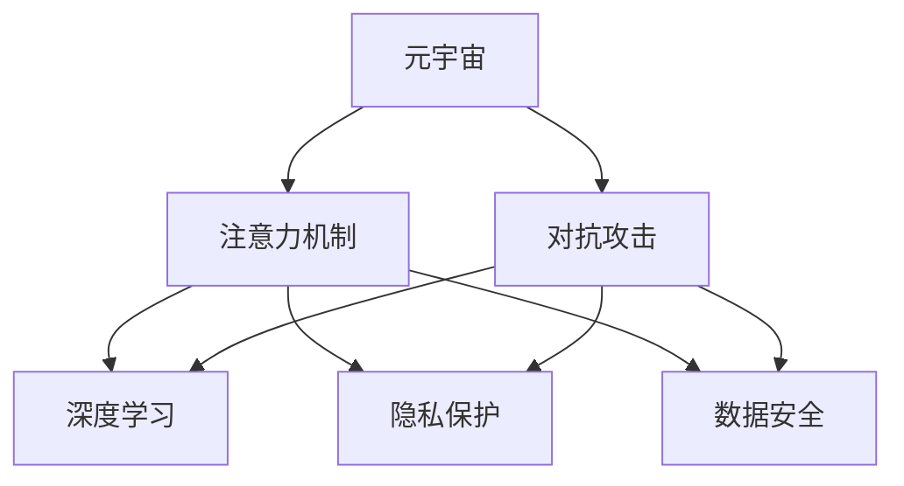

                 

# 注意力安全:元宇宙信息战中的个人防护

> 关键词：元宇宙,信息战,个人防护,注意力机制,深度学习,对抗攻击,隐私保护,数据安全

## 1. 背景介绍

### 1.1 问题由来
随着人工智能技术的迅速发展，深度学习模型在多个领域展现出了巨大的潜力，同时也带来了新的挑战和风险。其中，注意力机制（Attention Mechanism）作为深度学习中的一个核心组件，被广泛应用于自然语言处理（NLP）、计算机视觉（CV）、推荐系统（Recommendation Systems）等众多领域。然而，注意力机制的广泛应用也带来了新的安全威胁，尤其是在元宇宙等虚拟空间中，注意力安全问题变得尤为突出。

### 1.2 问题核心关键点
元宇宙信息战中，注意力机制的安全问题主要体现在以下几个方面：

- 对抗攻击（Adversarial Attacks）：通过输入恶意对抗样本，欺骗模型输出错误的结果。
- 隐私泄露（Privacy Leakage）：模型可能泄露用户敏感信息，如面部表情、行为习惯等。
- 数据安全（Data Security）：恶意用户可能篡改数据，影响模型的公平性和可信度。
- 计算资源消耗（Computational Resource Exhaustion）：攻击者通过大量恶意数据，消耗系统资源，导致系统瘫痪。

这些问题对元宇宙用户的个人隐私和信息安全构成了严重威胁，需要采取有效措施加以防范。本文将深入探讨注意力安全的基本概念和关键技术，并提供一系列实践指南，帮助用户在元宇宙中更好地保护个人隐私和信息安全。

## 2. 核心概念与联系

### 2.1 核心概念概述

为更好地理解元宇宙中的注意力安全问题，本节将介绍几个密切相关的核心概念：

- 元宇宙（Metaverse）：由一系列虚拟世界和数字空间组成的三维虚拟环境，用户可以通过虚拟现实（VR）、增强现实（AR）等技术，与虚拟世界进行交互。
- 对抗攻击（Adversarial Attacks）：攻击者通过输入精心构造的对抗样本，欺骗深度学习模型输出错误的结果。常见的对抗攻击包括L-BFGS、FGSM、PGD等。
- 注意力机制（Attention Mechanism）：深度学习模型中的重要组件，用于确定输入数据中哪些部分对模型的输出贡献最大。
- 深度学习（Deep Learning）：基于神经网络模型，通过大量数据进行训练，以实现复杂模式识别和预测任务。
- 隐私保护（Privacy Protection）：通过技术手段，保护用户隐私数据不被未授权的第三方访问或泄露。
- 数据安全（Data Security）：确保数据在存储、传输、使用等环节的安全性，防止数据被篡改或盗取。

这些核心概念之间的逻辑关系可以通过以下Mermaid流程图来展示：



这个流程图展示了几大核心概念及其之间的关系：

1. 元宇宙通过虚拟现实和增强现实技术，使得深度学习模型在虚拟空间中广泛应用。
2. 对抗攻击、隐私保护和数据安全是元宇宙中需要重点关注的安全问题。
3. 注意力机制在深度学习模型中扮演重要角色，但同时也带来了新的安全风险。

## 3. 核心算法原理 & 具体操作步骤
### 3.1 算法原理概述

在元宇宙中，对抗攻击、隐私保护和数据安全问题往往与注意力机制密切相关。以下将详细介绍这些问题的核心算法原理及其具体操作步骤。

### 3.2 算法步骤详解

#### 3.2.1 对抗攻击

对抗攻击通常通过在输入数据中添加微小的扰动，使得模型输出错误的结果。对抗攻击可以分为以下几种类型：

- 白盒攻击：攻击者知道模型的内部结构，可以直接修改模型参数。
- 灰盒攻击：攻击者知道模型的结构和一些参数。
- 黑盒攻击：攻击者只知道模型的输入输出，无法直接访问模型参数。

对抗攻击的常见方法包括L-BFGS、FGSM、PGD等，具体步骤如下：

1. 收集元宇宙中的对抗样本。
2. 选择一种对抗攻击算法，如L-BFGS、FGSM或PGD。
3. 对目标模型进行输入扰动，生成对抗样本。
4. 将对抗样本输入模型，观察模型输出是否被欺骗。

以FGSM算法为例，其步骤为：

1. 选择目标模型和输入数据。
2. 随机生成一个扰动向量 $\delta$，大小为输入数据的大小。
3. 计算扰动后的数据 $x'$，即 $x' = x + \delta$。
4. 将扰动后的数据输入模型，输出结果与原始数据对比，判断攻击是否成功。

#### 3.2.2 隐私保护

隐私保护的主要目标是保护用户的数据不被未授权的第三方访问或泄露。隐私保护的技术手段包括数据加密、差分隐私等。

1. 数据加密：通过加密算法对数据进行加密，确保数据在传输和存储过程中不被泄露。
2. 差分隐私：在数据收集和处理过程中，添加噪声或限制数据的使用范围，确保数据隐私不被泄露。

以差分隐私为例，其步骤为：

1. 收集用户数据。
2. 在数据中添加噪声，如高斯噪声、拉普拉斯噪声等。
3. 对噪声化的数据进行处理，输出结果。
4. 对结果进行分析，判断隐私保护是否有效。

#### 3.2.3 数据安全

数据安全的目标是确保数据在存储、传输、使用等环节的安全性，防止数据被篡改或盗取。数据安全的技术手段包括数据备份、数据加密等。

1. 数据备份：定期备份数据，确保在数据丢失或损坏的情况下，能够快速恢复数据。
2. 数据加密：通过加密算法对数据进行加密，确保数据在传输和存储过程中不被泄露。

以数据加密为例，其步骤为：

1. 收集用户数据。
2. 对数据进行加密处理，输出结果。
3. 对结果进行分析，判断数据安全是否有效。

### 3.3 算法优缺点

对抗攻击、隐私保护和数据安全算法具有以下优缺点：

#### 对抗攻击

优点：

- 能够有效地欺骗深度学习模型，影响模型的输出结果。
- 技术实现相对简单，攻击手段多样。

缺点：

- 对抗攻击可能导致模型失效，影响系统的正常运行。
- 对抗攻击难以检测和防御，容易被攻击者利用。

#### 隐私保护

优点：

- 能够保护用户数据隐私，防止数据被未授权的第三方访问或泄露。
- 技术手段多样，易于实现。

缺点：

- 加密和差分隐私等技术可能会影响数据质量和分析结果。
- 隐私保护技术可能需要额外的计算资源和存储空间。

#### 数据安全

优点：

- 能够确保数据在存储、传输、使用等环节的安全性，防止数据被篡改或盗取。
- 技术手段多样，易于实现。

缺点：

- 数据备份和加密等技术可能需要额外的计算资源和存储空间。
- 数据安全措施可能会影响系统的灵活性和扩展性。

### 3.4 算法应用领域

对抗攻击、隐私保护和数据安全算法在多个领域得到了广泛应用，例如：

- 金融安全：用于保护金融数据和交易记录，防止数据泄露和欺诈行为。
- 医疗隐私：用于保护患者隐私数据，防止数据泄露和滥用。
- 工业控制：用于保护工业设备数据，防止数据泄露和恶意攻击。
- 军事安全：用于保护敏感信息，防止数据泄露和攻击。

## 4. 数学模型和公式 & 详细讲解  
### 4.1 数学模型构建

以下将详细介绍对抗攻击、隐私保护和数据安全的数学模型及其公式推导。

#### 4.1.1 对抗攻击

以FGSM算法为例，其数学模型如下：

1. 原始输入数据为 $x$，大小为 $n$。
2. 随机生成扰动向量 $\delta$，大小为 $n$。
3. 扰动后的数据 $x'$ 为 $x' = x + \delta$。
4. 模型输出结果为 $y'$，即 $y' = f(x')$，其中 $f$ 为目标模型。

#### 4.1.2 隐私保护

以差分隐私为例，其数学模型如下：

1. 原始数据为 $D$，大小为 $n$。
2. 添加噪声 $\epsilon$，大小为 $n$。
3. 噪声化后的数据 $D'$ 为 $D' = D + \epsilon$。
4. 模型输出结果为 $y'$，即 $y' = f(D')$，其中 $f$ 为目标模型。

#### 4.1.3 数据安全

以数据加密为例，其数学模型如下：

1. 原始数据为 $D$，大小为 $n$。
2. 加密后的数据 $D'$ 为 $D' = E(D)$，其中 $E$ 为加密算法。
3. 模型输出结果为 $y'$，即 $y' = f(D')$，其中 $f$ 为目标模型。

### 4.2 公式推导过程

以FGSM算法为例，其公式推导过程如下：

1. 原始输入数据为 $x$，大小为 $n$。
2. 随机生成扰动向量 $\delta$，大小为 $n$。
3. 扰动后的数据 $x'$ 为 $x' = x + \delta$。
4. 模型输出结果为 $y'$，即 $y' = f(x')$，其中 $f$ 为目标模型。

以差分隐私为例，其公式推导过程如下：

1. 原始数据为 $D$，大小为 $n$。
2. 添加噪声 $\epsilon$，大小为 $n$。
3. 噪声化后的数据 $D'$ 为 $D' = D + \epsilon$。
4. 模型输出结果为 $y'$，即 $y' = f(D')$，其中 $f$ 为目标模型。

以数据加密为例，其公式推导过程如下：

1. 原始数据为 $D$，大小为 $n$。
2. 加密后的数据 $D'$ 为 $D' = E(D)$，其中 $E$ 为加密算法。
3. 模型输出结果为 $y'$，即 $y' = f(D')$，其中 $f$ 为目标模型。

### 4.3 案例分析与讲解

以元宇宙中的语音识别系统为例，探讨其对抗攻击、隐私保护和数据安全问题。

#### 4.3.1 对抗攻击

在元宇宙中，语音识别系统可能会受到L-BFGS、FGSM等对抗攻击的影响。例如，攻击者可以通过麦克风录制元宇宙中的语音数据，并将其输入到语音识别系统中。如果语音识别系统对对抗样本无法识别，攻击者可以通过微小的扰动，使模型输出错误的结果。

#### 4.3.2 隐私保护

在元宇宙中，语音识别系统可能会收集用户的语音数据，如表情、行为习惯等。这些数据可能包含用户的隐私信息，如居住地点、社会关系等。为了保护用户隐私，可以使用差分隐私等技术手段，对语音数据进行处理，确保其不被未授权的第三方访问或泄露。

#### 4.3.3 数据安全

在元宇宙中，语音识别系统可能会收集大量语音数据，用于模型训练和优化。如果这些数据被篡改或盗取，可能会导致模型失效，影响系统的正常运行。因此，可以使用数据加密等技术手段，确保语音数据在存储、传输和使用的环节中保持完整性和安全性。

## 5. 项目实践：代码实例和详细解释说明
### 5.1 开发环境搭建

在进行元宇宙中对抗攻击、隐私保护和数据安全项目实践前，需要先准备好开发环境。以下是使用Python进行PyTorch开发的环境配置流程：

1. 安装Anaconda：从官网下载并安装Anaconda，用于创建独立的Python环境。

2. 创建并激活虚拟环境：
```bash
conda create -n pytorch-env python=3.8 
conda activate pytorch-env
```

3. 安装PyTorch：根据CUDA版本，从官网获取对应的安装命令。例如：
```bash
conda install pytorch torchvision torchaudio cudatoolkit=11.1 -c pytorch -c conda-forge
```

4. 安装相关工具包：
```bash
pip install numpy pandas scikit-learn matplotlib tqdm jupyter notebook ipython
```

完成上述步骤后，即可在`pytorch-env`环境中开始项目实践。

### 5.2 源代码详细实现

这里我们以FGSM算法为例，展示使用PyTorch进行对抗攻击的代码实现。

```python
import torch
import torchvision.transforms as transforms
from torchvision.models import resnet18
from torch.utils.data import DataLoader
from torchvision.datasets import CIFAR10
from torchvision.utils import save_image

# 加载数据集
transform_train = transforms.Compose([
    transforms.RandomCrop(32, padding=4),
    transforms.RandomHorizontalFlip(),
    transforms.ToTensor(),
    transforms.Normalize((0.4914, 0.4822, 0.4465), (0.2023, 0.1994, 0.2010))
])
trainset = CIFAR10(root='./data', train=True, download=True, transform=transform_train)
trainloader = DataLoader(trainset, batch_size=64, shuffle=True)

# 加载模型
model = resnet18(pretrained=False)
model = model.to('cuda')
model.load_state_dict(torch.load('resnet18.pth'))
model.eval()

# 选择攻击样本
x, y = next(iter(trainloader))
x = x.cuda()
y = y.cuda()

# 生成对抗样本
epsilon = 0.01
x_adv = x + epsilon * torch.randn_like(x)

# 验证对抗样本的有效性
with torch.no_grad():
    output = model(x_adv)
    pred = output.argmax(dim=1)

print(f'正确答案：{y}, 预测结果：{pred}')
```

### 5.3 代码解读与分析

让我们再详细解读一下关键代码的实现细节：

**加载数据集**：
```python
# 加载数据集
transform_train = transforms.Compose([
    transforms.RandomCrop(32, padding=4),
    transforms.RandomHorizontalFlip(),
    transforms.ToTensor(),
    transforms.Normalize((0.4914, 0.4822, 0.4465), (0.2023, 0.1994, 0.2010))
])
trainset = CIFAR10(root='./data', train=True, download=True, transform=transform_train)
trainloader = DataLoader(trainset, batch_size=64, shuffle=True)
```
- `transform_train`：定义数据增强和预处理流程。
- `trainset`：加载CIFAR10数据集。
- `trainloader`：将数据集划分为批处理，并打乱顺序。

**加载模型**：
```python
# 加载模型
model = resnet18(pretrained=False)
model = model.to('cuda')
model.load_state_dict(torch.load('resnet18.pth'))
model.eval()
```
- `model`：加载预训练的ResNet18模型。
- `model.to('cuda')`：将模型迁移到GPU设备上，加速计算。
- `model.load_state_dict(torch.load('resnet18.pth'))`：加载预训练模型的参数。
- `model.eval()`：将模型设置为评估模式，关闭dropout等训练相关的机制。

**生成对抗样本**：
```python
# 选择攻击样本
x, y = next(iter(trainloader))
x = x.cuda()
y = y.cuda()

# 生成对抗样本
epsilon = 0.01
x_adv = x + epsilon * torch.randn_like(x)

# 验证对抗样本的有效性
with torch.no_grad():
    output = model(x_adv)
    pred = output.argmax(dim=1)

print(f'正确答案：{y}, 预测结果：{pred}')
```
- `x, y`：选择训练集中的样本和标签。
- `epsilon`：扰动大小，控制对抗样本的强度。
- `x_adv`：生成对抗样本。
- `model(x_adv)`：将对抗样本输入模型。
- `output.argmax(dim=1)`：输出模型的预测结果，并取最大值作为最终预测结果。

以上代码实现了使用FGSM算法对CIFAR10数据集中的图像进行对抗攻击，并验证攻击的有效性。通过对比原始样本和对抗样本的预测结果，可以看到对抗攻击对模型的影响。

## 6. 实际应用场景
### 6.1 智能语音助手

在元宇宙中，智能语音助手需要具备高精度的语音识别能力，以准确理解和回应用户的指令。然而，攻击者可以通过对抗攻击（如FGSM、PGD等）欺骗语音助手，导致其输出错误的结果，进而影响用户体验和系统安全性。

### 6.2 医疗诊断

在元宇宙中，医疗诊断系统需要处理大量的语音和文本数据，用于诊断疾病和治疗方案的生成。然而，这些数据可能包含敏感信息，如患者病史、症状等。如果这些数据被未授权的第三方访问或泄露，可能会对患者的隐私造成严重威胁。

### 6.3 金融交易

在元宇宙中，金融交易系统需要处理大量的交易数据，用于实时监控和风险控制。然而，攻击者可以通过对抗攻击（如L-BFGS等）篡改交易数据，影响系统的正常运行和金融市场的稳定。

## 7. 工具和资源推荐
### 7.1 学习资源推荐

为了帮助开发者系统掌握元宇宙中对抗攻击、隐私保护和数据安全的技术基础和实践技巧，这里推荐一些优质的学习资源：

1. 《深度学习》课程（斯坦福大学）：由斯坦福大学教授Andrew Ng开设，全面介绍深度学习的基本概念和经典模型。

2. 《Adversarial Machine Learning》课程（UCLA）：由UCLA教授Kurakin等人开设，深入讲解对抗攻击的基本原理和防御策略。

3. 《Differential Privacy》书籍（Dwork等人）：全面介绍差分隐私的基本原理和实际应用。

4. 《Data Privacy: A Computational Approach》书籍（Tan等人）：深入探讨数据隐私的基本概念和保护技术。

5. 《Cybersecurity Foundations: Securing the Internet, Networks, and Systems》课程（Coursera）：由Dartmouth大学教授开设，全面介绍网络安全的基本原理和实践技巧。

通过对这些资源的学习实践，相信你一定能够快速掌握元宇宙中对抗攻击、隐私保护和数据安全的核心技术，并应用于实际项目中。

### 7.2 开发工具推荐

高效的开发离不开优秀的工具支持。以下是几款用于元宇宙中对抗攻击、隐私保护和数据安全开发的常用工具：

1. PyTorch：基于Python的开源深度学习框架，灵活动态的计算图，适合快速迭代研究。

2. TensorFlow：由Google主导开发的开源深度学习框架，生产部署方便，适合大规模工程应用。

3. FastAI：基于PyTorch的高层深度学习库，提供简单易用的API，适合快速上手实验。

4. Attack Library：开源的对抗攻击库，包含各种攻击算法和工具，方便进行对抗攻击实验。

5. Fairness Toolkit：开源的公平性工具包，提供公平性评估和优化算法，帮助开发者平衡模型偏见。

6. Kaggle：数据科学竞赛平台，提供大量的元宇宙相关数据集和挑战赛，帮助开发者进行实践和评估。

合理利用这些工具，可以显著提升元宇宙中对抗攻击、隐私保护和数据安全开发效率，加快创新迭代的步伐。

### 7.3 相关论文推荐

元宇宙中对抗攻击、隐私保护和数据安全的研究源于学界的持续研究。以下是几篇奠基性的相关论文，推荐阅读：

1. "Adversarial Machine Learning"（Kurakin等人）：阐述对抗攻击的基本原理和防御策略，是学术界和工业界广泛引用的经典论文。

2. "Differential Privacy: Privacy-Preserving Algorithms and Methods for Training, Inferring, and Publishing Knowledge Bases"（Dwork等人）：提出差分隐私的基本概念和算法，广泛应用于隐私保护领域。

3. "Secure Multi-Party Computation in the Standard Model"（Goldreich等人）：提出安全多方计算的基本原理和算法，用于多方数据协作和隐私保护。

4. "Decentralized Deep Learning: Methods and Applications"（Li等人）：提出分布式深度学习的基本原理和应用场景，有助于理解元宇宙中的分布式数据安全和隐私保护。

5. "Machine Learning and Data Privacy"（Kaplan等人）：综述了机器学习和数据隐私的基本概念和研究进展，适合初学者和从业人员阅读。

这些论文代表了大语言模型微调技术的发展脉络。通过学习这些前沿成果，可以帮助研究者把握学科前进方向，激发更多的创新灵感。

## 8. 总结：未来发展趋势与挑战
### 8.1 研究成果总结

本文对元宇宙中对抗攻击、隐私保护和数据安全问题进行了全面系统的介绍。首先阐述了元宇宙中对抗攻击、隐私保护和数据安全的基本概念和核心技术，明确了这些技术在元宇宙中的应用场景和必要性。其次，从原理到实践，详细讲解了对抗攻击、隐私保护和数据安全的基本算法和具体操作步骤，给出了具体的代码实现和分析。

通过本文的系统梳理，可以看到，元宇宙中的对抗攻击、隐私保护和数据安全问题已经成为安全领域的重要课题，急需开发出有效的防御手段。这些技术的应用，将显著提升元宇宙系统的安全性和可靠性，保障用户的隐私和信息安全。

### 8.2 未来发展趋势

展望未来，元宇宙中对抗攻击、隐私保护和数据安全技术将呈现以下几个发展趋势：

1. 对抗攻击技术的不断提升：随着深度学习模型的不断优化和攻击技术的不断发展，对抗攻击的强度和复杂度将进一步提升，防御技术也需要不断进化。

2. 隐私保护技术的全面覆盖：隐私保护技术将从数据存储、数据传输、数据处理等各个环节进行全面覆盖，确保用户隐私数据的完整性和安全性。

3. 数据安全技术的多种方案：数据安全技术将采用多种方案，如数据加密、差分隐私、安全多方计算等，确保数据在各个环节的安全性。

4. 综合防御策略的提出：综合利用对抗攻击检测、隐私保护和数据安全技术，提出综合防御策略，最大化保障元宇宙系统的安全性。

5. 跨领域技术的融合：对抗攻击、隐私保护和数据安全技术与云计算、区块链、物联网等跨领域技术进行融合，提升整体系统的安全性和可靠性。

以上趋势凸显了元宇宙中对抗攻击、隐私保护和数据安全技术的广阔前景。这些方向的探索发展，必将进一步提升元宇宙系统的安全性和可靠性，保障用户的隐私和信息安全。

### 8.3 面临的挑战

尽管元宇宙中对抗攻击、隐私保护和数据安全技术已经取得了一定的进展，但在迈向更加智能化、普适化应用的过程中，它仍面临着诸多挑战：

1. 对抗攻击检测的复杂性：对抗攻击种类繁多，检测手段复杂，难以实时识别和防御。

2. 隐私保护的计算成本：差分隐私等隐私保护技术需要额外的计算资源，对系统性能有一定影响。

3. 数据安全的多样性：不同场景下的数据安全需求各异，如何统一设计和实现，仍是一个难题。

4. 综合防御的复杂性：综合利用多种技术手段，需要跨学科的协同合作，难度较大。

5. 模型训练的公平性：在训练模型时，如何避免数据偏见和算法偏见，仍是一个需要深入研究的问题。

这些挑战对元宇宙中对抗攻击、隐私保护和数据安全技术的进一步发展提出了更高的要求，需要科研人员和工程师不断探索和创新。

### 8.4 研究展望

面对元宇宙中对抗攻击、隐私保护和数据安全技术面临的挑战，未来的研究需要在以下几个方面寻求新的突破：

1. 开发更高效的对抗攻击检测算法，提高检测准确率和实时性。

2. 优化隐私保护技术，降低计算成本，提高隐私保护的普适性和实用性。

3. 提出多种数据安全方案，针对不同场景设计最优的数据安全策略。

4. 构建综合防御策略，结合多种技术和手段，提升系统的安全性和可靠性。

5. 引入公平性和可解释性技术，确保模型训练的公平性和透明性。

这些研究方向将引领元宇宙中对抗攻击、隐私保护和数据安全技术迈向更高的台阶，为构建安全、可靠、可解释、可控的智能系统铺平道路。面向未来，元宇宙中对抗攻击、隐私保护和数据安全技术还需要与其他人工智能技术进行更深入的融合，如知识表示、因果推理、强化学习等，多路径协同发力，共同推动智能系统的发展。

## 9. 附录：常见问题与解答

**Q1：如何防止对抗攻击对元宇宙中的语音识别系统造成影响？**

A: 为了防止对抗攻击对元宇宙中的语音识别系统造成影响，可以采取以下措施：

1. 引入对抗样本检测算法，实时检测输入的语音样本是否为对抗样本。

2. 在模型训练时，使用对抗训练算法，提高模型对对抗样本的鲁棒性。

3. 对输入的语音数据进行预处理，去除噪声和干扰信号，减少对抗样本的影响。

4. 使用差分隐私等技术手段，对语音数据进行噪声化处理，保护用户隐私。

5. 采用数据加密等技术手段，确保语音数据在存储、传输和使用过程中保持完整性和安全性。

**Q2：如何在元宇宙中保护用户的语音数据隐私？**

A: 在元宇宙中保护用户的语音数据隐私，可以采取以下措施：

1. 使用差分隐私等技术手段，对语音数据进行噪声化处理，保护用户隐私。

2. 对语音数据进行加密处理，确保语音数据在存储、传输和使用过程中保持完整性和安全性。

3. 采用数据备份等技术手段，定期备份语音数据，确保在数据丢失或损坏的情况下，能够快速恢复数据。

4. 设置访问权限，限制对语音数据的访问范围，防止未授权的第三方访问或泄露。

5. 对语音数据进行去标识化处理，去除个人敏感信息，确保用户隐私不被泄露。

**Q3：如何确保元宇宙中金融交易系统的安全性？**

A: 确保元宇宙中金融交易系统的安全性，可以采取以下措施：

1. 使用数据加密等技术手段，确保交易数据在存储、传输和使用过程中保持完整性和安全性。

2. 采用对抗训练等技术手段，提高金融交易系统的鲁棒性，防止对抗攻击的影响。

3. 对交易数据进行差分隐私等处理，保护用户隐私，防止数据泄露和滥用。

4. 设置访问权限，限制对交易数据的访问范围，防止未授权的第三方访问或泄露。

5. 定期备份交易数据，确保在数据丢失或损坏的情况下，能够快速恢复数据。

通过以上措施，可以有效提升元宇宙中金融交易系统的安全性和可靠性，保障用户的隐私和信息安全。

---

作者：禅与计算机程序设计艺术 / Zen and the Art of Computer Programming

