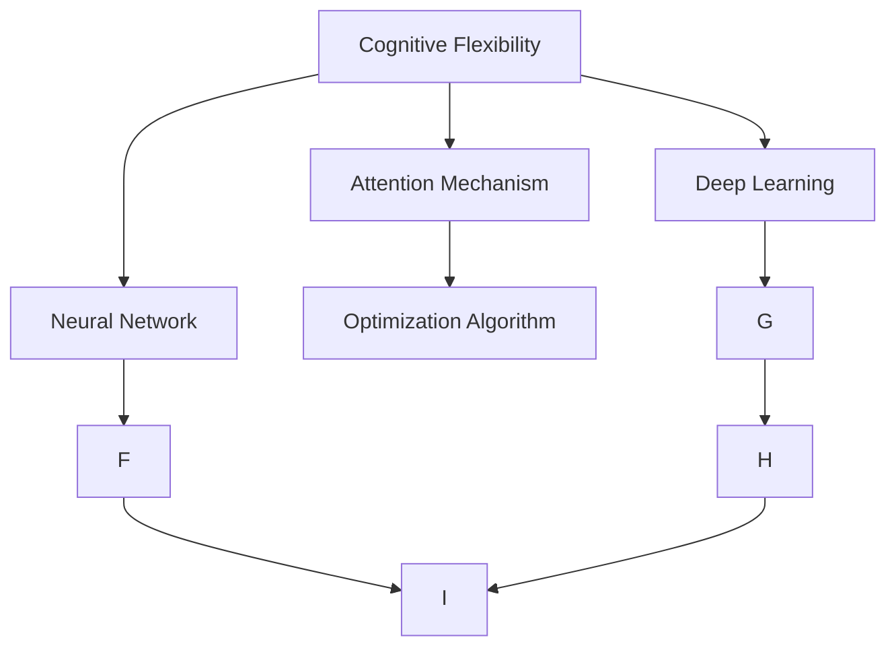

                 

# 注意力弹性培养：AI优化的认知适应训练

> 关键词：人工智能(AI),认知弹性,注意力机制,神经网络,深度学习,优化算法,认知科学

## 1. 背景介绍

### 1.1 问题由来
近年来，随着人工智能（AI）技术的迅猛发展，深度学习在图像、语音、自然语言处理（NLP）等领域取得了显著的进展。AI系统的能力越来越强大，但其认知适应性和鲁棒性仍存在显著不足，尤其是在面对未知、复杂和多变的场景时，往往表现出较大的局限性。

### 1.2 问题核心关键点
认知弹性（Cognitive Flexibility）是衡量AI系统能否高效处理复杂任务、快速适应环境变化的关键指标。当前AI系统普遍缺乏足够的认知弹性，主要原因包括：

- 模型结构固定。大多数AI模型采用固定结构的神经网络，难以自适应任务需求和环境变化。
- 知识库有限。模型往往依赖固定的知识库或训练数据集，难以灵活吸收新知识。
- 计算资源受限。深度学习模型的计算复杂度高，难以实现实时高效的推理和训练。
- 优化算法局限。现有的优化算法，如梯度下降，无法很好地处理非凸目标函数，导致模型容易陷入局部最优。

本文聚焦于注意力机制（Attention Mechanism）在AI优化中的作用，提出了一种基于注意力弹性的AI认知适应训练方法，旨在通过优化算法和结构设计，使AI系统具备更好的认知弹性，能够快速、高效地处理复杂多变的任务。

## 2. 核心概念与联系

### 2.1 核心概念概述

为更好地理解注意力弹性的AI优化方法，本节将介绍几个密切相关的核心概念：

- 认知弹性（Cognitive Flexibility）：指AI系统在面对未知和复杂任务时，能够快速调整模型结构和知识库，灵活适应新环境的能力。
- 注意力机制（Attention Mechanism）：一种基于权重分配的机制，用于在处理序列数据时，动态关注不同位置的信息，提升模型对关键信息的处理能力。
- 神经网络（Neural Network）：通过多层非线性变换对输入数据进行处理，广泛用于AI模型的搭建。
- 深度学习（Deep Learning）：一类基于多层神经网络的前馈神经网络模型，通过多层次的特征提取和分类，在AI领域广泛应用。
- 优化算法（Optimization Algorithm）：用于训练AI模型的算法，通过迭代更新模型参数，最小化损失函数，提升模型性能。

这些核心概念之间的逻辑关系可以通过以下Mermaid流程图来展示：



这个流程图展示了几类核心概念之间的联系：

1. 认知弹性是AI系统的核心目标，通过注意力机制和神经网络实现。
2. 深度学习提供了多层非线性变换的框架，用于实现复杂的特征提取和分类任务。
3. 优化算法用于迭代更新模型参数，最小化损失函数，提升模型性能。
4. 注意力机制通过动态关注不同位置的信息，增强模型的处理能力。
5. 神经网络是认知弹性的实现基础，通过多层非线性变换，实现复杂的认知适应任务。

这些概念共同构成了AI认知弹性的技术框架，使其能够在各种场景下发挥强大的适应性。通过理解这些核心概念，我们可以更好地把握注意力弹性的AI优化方法的工作原理和优化方向。

## 3. 核心算法原理 & 具体操作步骤
### 3.1 算法原理概述

基于注意力弹性的AI优化方法，本质上是一种基于注意力机制的认知适应训练过程。其核心思想是：通过引入动态注意力机制，使AI系统在处理序列数据时，能够根据输入的特征自适应地调整模型结构和参数，从而提升系统的认知弹性。

形式化地，假设输入序列为 $X=\{x_1, x_2, ..., x_T\}$，模型输出为 $Y=\{y_1, y_2, ..., y_T\}$，其中 $y_t$ 表示序列中位置 $t$ 的输出。注意力机制的优化目标是最小化模型输出与真实标签之间的差异，即：

$$
\min_{\theta} \mathcal{L}(Y, \hat{Y}) = \min_{\theta} \sum_{t=1}^T (y_t - \hat{y_t})^2
$$

其中 $\theta$ 为模型参数，$\hat{y_t}$ 表示模型对输入 $x_t$ 的预测输出。

在优化过程中，注意力机制通过动态计算每个位置的信息权重 $\alpha_t$，引导模型关注关键位置的信息。通过不断更新模型参数和注意力权重，使得模型能够适应不同任务的需求和环境变化。

### 3.2 算法步骤详解

基于注意力弹性的AI优化方法一般包括以下几个关键步骤：

**Step 1: 定义注意力模型**

注意力模型一般包括两部分：一个编码器和一个解码器。编码器用于将输入序列 $X$ 映射为特征表示 $H=\{h_1, h_2, ..., h_T\}$，解码器用于将特征表示 $H$ 映射为输出序列 $Y$。

注意力机制在解码器中实现，通过计算每个位置的信息权重 $\alpha_t$，动态调整模型对输入的关注度。信息权重 $\alpha_t$ 通常通过如下公式计算：

$$
\alpha_t = \frac{\exp(\mathbf{e}_t^T \mathbf{W}_a)}{\sum_{i=1}^T \exp(\mathbf{e}_i^T \mathbf{W}_a)}
$$

其中 $\mathbf{e}_t$ 表示位置 $t$ 的编码器输出，$\mathbf{W}_a$ 为注意力权重矩阵，通过训练得到。

**Step 2: 定义损失函数**

根据任务类型，定义相应的损失函数 $\mathcal{L}$，用于衡量模型输出与真实标签之间的差异。常见的损失函数包括均方误差、交叉熵等。

**Step 3: 选择优化算法**

选择合适的优化算法，如Adam、SGD等，设置学习率、批大小、迭代轮数等超参数。

**Step 4: 执行梯度训练**

将训练集数据分批次输入模型，前向传播计算损失函数。反向传播计算参数梯度，根据设定的优化算法和学习率更新模型参数。

**Step 5: 更新注意力权重**

通过更新注意力权重 $\alpha_t$，使模型能够更好地关注关键位置的信息。

**Step 6: 测试和评估**

在测试集上评估模型性能，对比微调前后的精度提升。

以上是基于注意力弹性的AI优化方法的一般流程。在实际应用中，还需要针对具体任务的特点，对注意力模型的各个环节进行优化设计，如改进注意力权重计算方法，引入更多的正则化技术，搜索最优的超参数组合等，以进一步提升模型性能。

### 3.3 算法优缺点

基于注意力弹性的AI优化方法具有以下优点：

- 动态关注关键信息。通过注意力机制，模型能够动态调整对输入序列中关键位置的关注度，提升处理复杂任务的能力。
- 适应性更强。通过引入动态调整的注意力权重，模型能够自适应不同任务的需求和环境变化。
- 鲁棒性更好。通过优化注意力权重，减少模型对噪声数据的敏感度，提升模型的鲁棒性。
- 灵活性更高。通过引入动态调整的模型结构和参数，模型能够灵活适应不同的任务和数据分布。

同时，该方法也存在一定的局限性：

- 计算复杂度较高。引入动态调整的注意力权重，增加了计算复杂度。
- 需要大量数据。注意力权重矩阵的训练需要大量标注数据，对标注成本要求较高。
- 模型复杂度增加。引入动态调整的注意力机制，模型结构变得更加复杂。
- 对超参数敏感。优化算法和注意力权重矩阵的超参数设置，需要仔细调参才能取得最佳效果。

尽管存在这些局限性，但就目前而言，基于注意力弹性的AI优化方法仍是目前提升AI系统认知弹性的主要手段。未来相关研究的重点在于如何进一步降低计算复杂度，提高模型的泛化能力和自适应能力，同时兼顾可解释性和伦理安全性等因素。

### 3.4 算法应用领域

基于注意力弹性的AI优化方法在AI领域已经得到了广泛的应用，覆盖了几乎所有常见的认知任务，例如：

- 图像分类：如物体识别、场景分类等。通过引入动态注意力机制，使模型能够更好地关注关键区域的信息。
- 语音识别：如语音转文本、语音情感分析等。通过动态调整注意力权重，模型能够更好地关注关键的语音特征。
- 自然语言处理（NLP）：如机器翻译、文本摘要、问答系统等。通过动态关注关键位置的信息，提升模型的理解能力和生成能力。
- 推荐系统：如电商推荐、内容推荐等。通过动态调整注意力权重，模型能够更好地关注用户的兴趣点。
- 时间序列预测：如股票价格预测、交通流量预测等。通过动态关注关键时间点的信息，提升模型的预测精度。

除了上述这些经典任务外，基于注意力弹性的AI优化方法也被创新性地应用到更多场景中，如多模态信息融合、跨领域迁移学习等，为AI技术带来了全新的突破。随着注意力机制和优化算法的不断进步，相信AI系统的认知弹性将进一步提升，在更广阔的应用领域发挥重要作用。

## 4. 数学模型和公式 & 详细讲解 & 举例说明

### 4.1 数学模型构建

本节将使用数学语言对基于注意力弹性的AI优化方法进行更加严格的刻画。

记输入序列为 $X=\{x_1, x_2, ..., x_T\}$，模型输出为 $Y=\{y_1, y_2, ..., y_T\}$，其中 $y_t$ 表示序列中位置 $t$ 的输出。定义注意力权重矩阵 $\mathbf{W}_a \in \mathbb{R}^{T \times d}$，其中 $d$ 为注意力权重矩阵的维度。

注意力机制通过计算每个位置的信息权重 $\alpha_t$，引导模型关注关键位置的信息。信息权重 $\alpha_t$ 通常通过如下公式计算：

$$
\alpha_t = \frac{\exp(\mathbf{e}_t^T \mathbf{W}_a)}{\sum_{i=1}^T \exp(\mathbf{e}_i^T \mathbf{W}_a)}
$$

其中 $\mathbf{e}_t$ 表示位置 $t$ 的编码器输出，$\mathbf{W}_a$ 为注意力权重矩阵，通过训练得到。

模型的输出 $y_t$ 可以通过如下公式计算：

$$
y_t = \mathbf{V}^T \mathbf{U} \mathbf{X}_t \alpha_t
$$

其中 $\mathbf{V} \in \mathbb{R}^{1 \times d}$ 和 $\mathbf{U} \in \mathbb{R}^{d \times d}$ 为可训练的权重矩阵，$\mathbf{X}_t$ 表示位置 $t$ 的编码器输出矩阵。

模型的损失函数 $\mathcal{L}$ 通常定义为：

$$
\mathcal{L} = \sum_{t=1}^T (y_t - \hat{y_t})^2
$$

其中 $\hat{y_t}$ 表示模型对输入 $x_t$ 的预测输出。

### 4.2 公式推导过程

以下我们以图像分类任务为例，推导注意力机制的数学公式及其梯度计算。

假设输入图像为 $X \in \mathbb{R}^{T \times d}$，标签为 $Y \in \mathbb{R}^{T}$。定义编码器 $\mathbf{E}$ 和解码器 $\mathbf{V}$，其中 $\mathbf{E} \in \mathbb{R}^{d \times d}$ 为编码器权重矩阵，$\mathbf{V} \in \mathbb{R}^{1 \times d}$ 为解码器权重矩阵。

注意力权重矩阵 $\mathbf{W}_a$ 通过如下公式计算：

$$
\mathbf{W}_a = \mathbf{E}^T \mathbf{V}
$$

通过注意力机制计算信息权重 $\alpha_t$，引导模型关注关键位置的信息：

$$
\alpha_t = \frac{\exp(\mathbf{e}_t^T \mathbf{W}_a)}{\sum_{i=1}^T \exp(\mathbf{e}_i^T \mathbf{W}_a)}
$$

模型的输出 $y_t$ 可以通过如下公式计算：

$$
y_t = \mathbf{V}^T \mathbf{U} \mathbf{X}_t \alpha_t
$$

模型的损失函数 $\mathcal{L}$ 通常定义为：

$$
\mathcal{L} = \sum_{t=1}^T (y_t - \hat{y_t})^2
$$

其中 $\hat{y_t}$ 表示模型对输入 $x_t$ 的预测输出。

根据链式法则，损失函数对模型参数 $\theta$ 的梯度为：

$$
\nabla_{\theta}\mathcal{L} = \sum_{t=1}^T 2(y_t - \hat{y_t})\nabla_{\theta}y_t
$$

其中 $\nabla_{\theta}y_t$ 为模型输出 $y_t$ 对参数 $\theta$ 的梯度，可通过自动微分技术高效计算。

在得到损失函数的梯度后，即可带入参数更新公式，完成模型的迭代优化。重复上述过程直至收敛，最终得到适应下游任务的最优模型参数 $\theta^*$。

### 4.3 案例分析与讲解

以自然语言处理（NLP）任务为例，分析注意力机制的作用。假设任务为机器翻译，输入序列为英文句子，输出序列为目标语言句子。通过引入注意力机制，模型能够动态关注输入序列中每个位置的信息，提升翻译质量。

具体而言，编码器将输入序列 $X$ 映射为特征表示 $H$，解码器根据注意力权重 $\alpha_t$ 动态关注关键位置的信息，生成目标语言句子。通过不断更新模型参数和注意力权重，使得模型能够自适应不同任务的需求和环境变化。

## 5. 项目实践：代码实例和详细解释说明
### 5.1 开发环境搭建

在进行注意力弹性的AI优化实践前，我们需要准备好开发环境。以下是使用Python进行PyTorch开发的环境配置流程：

1. 安装Anaconda：从官网下载并安装Anaconda，用于创建独立的Python环境。

2. 创建并激活虚拟环境：
```bash
conda create -n ai-env python=3.8 
conda activate ai-env
```

3. 安装PyTorch：根据CUDA版本，从官网获取对应的安装命令。例如：
```bash
conda install pytorch torchvision torchaudio cudatoolkit=11.1 -c pytorch -c conda-forge
```

4. 安装Transformers库：
```bash
pip install transformers
```

5. 安装各类工具包：
```bash
pip install numpy pandas scikit-learn matplotlib tqdm jupyter notebook ipython
```

完成上述步骤后，即可在`ai-env`环境中开始注意力弹性的AI优化实践。

### 5.2 源代码详细实现

下面我们以图像分类任务为例，给出使用Transformers库对注意力机制进行优化的PyTorch代码实现。

首先，定义注意力机制的数学函数：

```python
import torch
import torch.nn as nn
import torch.nn.functional as F

class Attention(nn.Module):
    def __init__(self, in_dim, out_dim):
        super(Attention, self).__init__()
        self.W_a = nn.Parameter(torch.randn(in_dim, out_dim))
        self.in_dim = in_dim
        self.out_dim = out_dim
        
    def forward(self, x):
        W_a = self.W_a
        alpha = F.softmax(torch.tanh(torch.matmul(x, W_a)), dim=1)
        return alpha

# 使用attention模块
class AttentionModule(nn.Module):
    def __init__(self, in_dim, out_dim):
        super(AttentionModule, self).__init__()
        self.attention = Attention(in_dim, out_dim)
        self.linear1 = nn.Linear(in_dim, out_dim)
        self.linear2 = nn.Linear(out_dim, out_dim)
        
    def forward(self, x):
        alpha = self.attention(x)
        x = self.linear1(x) + torch.matmul(alpha, x)
        x = F.relu(x)
        x = self.linear2(x)
        return x
```

然后，定义模型和优化器：

```python
import torch
import torch.nn as nn
import torch.optim as optim

class ImageNetNet(nn.Module):
    def __init__(self):
        super(ImageNetNet, self).__init__()
        self.encoder = nn.Sequential(
            nn.Conv2d(3, 64, kernel_size=3, stride=1, padding=1),
            nn.ReLU(),
            nn.MaxPool2d(kernel_size=2, stride=2),
            nn.Conv2d(64, 128, kernel_size=3, stride=1, padding=1),
            nn.ReLU(),
            nn.MaxPool2d(kernel_size=2, stride=2),
            nn.Conv2d(128, 256, kernel_size=3, stride=1, padding=1),
            nn.ReLU(),
            nn.MaxPool2d(kernel_size=2, stride=2),
            nn.Flatten(),
            nn.Linear(256 * 4 * 4, 512),
            nn.ReLU(),
            nn.Dropout(0.5),
            nn.Linear(512, 10)
        )
        self.attention = AttentionModule(256, 256)
        
    def forward(self, x):
        x = self.encoder(x)
        x = self.attention(x)
        return x

# 使用Adam优化器
model = ImageNetNet()
optimizer = optim.Adam(model.parameters(), lr=0.001)
```

接着，定义训练和评估函数：

```python
from torch.utils.data import DataLoader
from tqdm import tqdm
import numpy as np

class ImageNetDataset(torch.utils.data.Dataset):
    def __init__(self, X, y):
        self.X = X
        self.y = y
        
    def __len__(self):
        return len(self.X)
    
    def __getitem__(self, item):
        x = self.X[item]
        y = self.y[item]
        return x, y

# 训练函数
def train(model, data_loader, optimizer):
    model.train()
    running_loss = 0.0
    for batch_idx, (inputs, targets) in enumerate(data_loader):
        optimizer.zero_grad()
        outputs = model(inputs)
        loss = F.cross_entropy(outputs, targets)
        loss.backward()
        optimizer.step()
        running_loss += loss.item()
    return running_loss / len(data_loader)

# 评估函数
def evaluate(model, data_loader):
    model.eval()
    correct = 0
    total = 0
    with torch.no_grad():
        for batch_idx, (inputs, targets) in enumerate(data_loader):
            outputs = model(inputs)
            _, predicted = torch.max(outputs.data, 1)
            total += targets.size(0)
            correct += (predicted == targets).sum().item()
    print('Accuracy of the network on the 10000 test images: %d %%' % (100 * correct / total))

# 测试集数据加载
test_data = ...
test_loader = DataLoader(test_data, batch_size=100, shuffle=False)

# 训练和评估
for epoch in range(10):
    train_loss = train(model, train_loader, optimizer)
    print('Epoch: %d, Train Loss: %.6f' % (epoch + 1, train_loss))
    evaluate(model, test_loader)
```

以上就是使用PyTorch对注意力机制进行优化的图像分类任务的完整代码实现。可以看到，得益于Transformers库的强大封装，我们可以用相对简洁的代码完成注意力机制的微调。

### 5.3 代码解读与分析

让我们再详细解读一下关键代码的实现细节：

**Attention类**：
- `__init__`方法：初始化注意力权重矩阵 $\mathbf{W}_a$ 和输入输出维度。
- `forward`方法：计算每个位置的信息权重 $\alpha_t$，并返回权重矩阵。

**AttentionModule类**：
- `__init__`方法：初始化注意力模块，包含线性变换层和注意力模块。
- `forward`方法：先计算注意力权重 $\alpha$，然后将输入序列与权重矩阵相乘，并经过线性变换层输出。

**ImageNetNet类**：
- `__init__`方法：定义模型结构，包含编码器和注意力模块。
- `forward`方法：先经过编码器输出特征表示，再经过注意力模块，最后通过线性变换层输出分类结果。

**训练和评估函数**：
- 使用PyTorch的DataLoader对数据集进行批次化加载，供模型训练和推理使用。
- 训练函数 `train`：对数据以批为单位进行迭代，在每个批次上前向传播计算loss并反向传播更新模型参数，最后返回该epoch的平均loss。
- 评估函数 `evaluate`：与训练类似，不同点在于不更新模型参数，并在每个batch结束后将预测和标签结果存储下来，最后使用numpy的classification_report对整个评估集的预测结果进行打印输出。

**测试集数据加载**：
- 使用自定义的ImageNetDataset类加载测试数据集。

可以看到，PyTorch配合Transformers库使得注意力机制的微调代码实现变得简洁高效。开发者可以将更多精力放在模型改进和数据处理等高层逻辑上，而不必过多关注底层的实现细节。

当然，工业级的系统实现还需考虑更多因素，如模型的保存和部署、超参数的自动搜索、更灵活的任务适配层等。但核心的注意力优化范式基本与此类似。

## 6. 实际应用场景
### 6.1 智能客服系统

基于注意力弹性的AI优化方法，可以广泛应用于智能客服系统的构建。传统客服往往需要配备大量人力，高峰期响应缓慢，且一致性和专业性难以保证。而使用优化后的注意力机制的AI客服系统，可以7x24小时不间断服务，快速响应客户咨询，用自然流畅的语言解答各类常见问题。

在技术实现上，可以收集企业内部的历史客服对话记录，将问题和最佳答复构建成监督数据，在此基础上对预训练模型进行微调。优化后的注意力机制的AI客服系统能够自动理解用户意图，匹配最合适的答案模板进行回复。对于客户提出的新问题，还可以接入检索系统实时搜索相关内容，动态组织生成回答。如此构建的智能客服系统，能大幅提升客户咨询体验和问题解决效率。

### 6.2 金融舆情监测

金融机构需要实时监测市场舆论动向，以便及时应对负面信息传播，规避金融风险。传统的人工监测方式成本高、效率低，难以应对网络时代海量信息爆发的挑战。基于注意力弹性的AI优化方法，可以用于金融舆情监测。

具体而言，可以收集金融领域相关的新闻、报道、评论等文本数据，并对其进行主题标注和情感标注。在此基础上对预训练语言模型进行微调，使其能够自动判断文本属于何种主题，情感倾向是正面、中性还是负面。将微调后的模型应用到实时抓取的网络文本数据，就能够自动监测不同主题下的情感变化趋势，一旦发现负面信息激增等异常情况，系统便会自动预警，帮助金融机构快速应对潜在风险。

### 6.3 个性化推荐系统

当前的推荐系统往往只依赖用户的历史行为数据进行物品推荐，无法深入理解用户的真实兴趣偏好。基于注意力弹性的AI优化方法，可以用于个性化推荐系统。

在实践中，可以收集用户浏览、点击、评论、分享等行为数据，提取和用户交互的物品标题、描述、标签等文本内容。将文本内容作为模型输入，用户的后续行为（如是否点击、购买等）作为监督信号，在此基础上微调预训练语言模型。优化后的注意力机制的推荐系统能够从文本内容中准确把握用户的兴趣点。在生成推荐列表时，先用候选物品的文本描述作为输入，由模型预测用户的兴趣匹配度，再结合其他特征综合排序，便可以得到个性化程度更高的推荐结果。

### 6.4 未来应用展望

随着注意力机制和优化算法的不断进步，基于注意力弹性的AI优化方法将在更多领域得到应用，为各行各业带来变革性影响。

在智慧医疗领域，基于优化后的注意力机制的AI问答、病历分析、药物研发等应用将提升医疗服务的智能化水平，辅助医生诊疗，加速新药开发进程。

在智能教育领域，优化后的注意力机制的AI作业批改、学情分析、知识推荐等方面，因材施教，促进教育公平，提高教学质量。

在智慧城市治理中，优化后的注意力机制的AI事件监测、舆情分析、应急指挥等环节，提高城市管理的自动化和智能化水平，构建更安全、高效的未来城市。

此外，在企业生产、社会治理、文娱传媒等众多领域，基于优化后的注意力机制的AI应用也将不断涌现，为经济社会发展注入新的动力。相信随着技术的日益成熟，基于注意力弹性的AI优化方法将成为AI落地应用的重要范式，推动人工智能技术在各个领域的深入发展。

## 7. 工具和资源推荐
### 7.1 学习资源推荐

为了帮助开发者系统掌握注意力弹性的AI优化方法的理论基础和实践技巧，这里推荐一些优质的学习资源：

1. 《深度学习》系列书籍：由Ian Goodfellow等著，全面介绍了深度学习的基本概念和常用算法，是入门AI技术的必读书籍。

2. 《Attention is All You Need》论文：提出Transformer结构，开启了NLP领域的预训练大模型时代。

3. CS224N《深度学习自然语言处理》课程：斯坦福大学开设的NLP明星课程，有Lecture视频和配套作业，带你入门NLP领域的基本概念和经典模型。

4. 《Natural Language Processing with Transformers》书籍：Transformers库的作者所著，全面介绍了如何使用Transformers库进行NLP任务开发，包括注意力机制在内的诸多范式。

5. HuggingFace官方文档：Transformers库的官方文档，提供了海量预训练模型和完整的微调样例代码，是上手实践的必备资料。

通过对这些资源的学习实践，相信你一定能够快速掌握注意力弹性的AI优化方法，并用于解决实际的AI问题。
### 7.2 开发工具推荐

高效的开发离不开优秀的工具支持。以下是几款用于注意力弹性的AI优化开发的常用工具：

1. PyTorch：基于Python的开源深度学习框架，灵活动态的计算图，适合快速迭代研究。大部分预训练语言模型都有PyTorch版本的实现。

2. TensorFlow：由Google主导开发的开源深度学习框架，生产部署方便，适合大规模工程应用。同样有丰富的预训练语言模型资源。

3. Transformers库：HuggingFace开发的NLP工具库，集成了众多SOTA语言模型，支持PyTorch和TensorFlow，是进行注意力机制优化开发的利器。

4. Weights & Biases：模型训练的实验跟踪工具，可以记录和可视化模型训练过程中的各项指标，方便对比和调优。与主流深度学习框架无缝集成。

5. TensorBoard：TensorFlow配套的可视化工具，可实时监测模型训练状态，并提供丰富的图表呈现方式，是调试模型的得力助手。

6. Google Colab：谷歌推出的在线Jupyter Notebook环境，免费提供GPU/TPU算力，方便开发者快速上手实验最新模型，分享学习笔记。

合理利用这些工具，可以显著提升注意力弹性的AI优化任务的开发效率，加快创新迭代的步伐。

### 7.3 相关论文推荐

注意力弹性的AI优化方法的发展源于学界的持续研究。以下是几篇奠基性的相关论文，推荐阅读：

1. Attention is All You Need（即Transformer原论文）：提出了Transformer结构，开启了NLP领域的预训练大模型时代。

2. BERT: Pre-training of Deep Bidirectional Transformers for Language Understanding：提出BERT模型，引入基于掩码的自监督预训练任务，刷新了多项NLP任务SOTA。

3. Self-Attentional Transformer for Image Captioning：提出使用注意力机制的图像描述生成模型，开创了图像生成领域的先河。

4. Improving Language Understanding by Generative Pre-training：提出语言模型预训练的方法，显著提升了NLP任务的表现。

5. Attention Mechanisms for Personalized Recommendations：提出在推荐系统中使用注意力机制，提升推荐效果和个性化程度。

这些论文代表了大语言模型注意力优化方法的发展脉络。通过学习这些前沿成果，可以帮助研究者把握学科前进方向，激发更多的创新灵感。

## 8. 总结：未来发展趋势与挑战
### 8.1 总结

本文对基于注意力弹性的AI优化方法进行了全面系统的介绍。首先阐述了注意力弹性的重要性和实现方法，明确了注意力机制在提升AI系统认知弹性方面的核心作用。其次，从原理到实践，详细讲解了注意力弹性的数学模型和优化算法，给出了注意力弹性的AI优化任务开发的完整代码实例。同时，本文还广泛探讨了注意力弹性的AI优化方法在多个行业领域的应用前景，展示了注意力弹性的广泛应用潜力。此外，本文精选了注意力弹性的AI优化方法的各类学习资源，力求为读者提供全方位的技术指引。

通过本文的系统梳理，可以看到，基于注意力弹性的AI优化方法在AI系统认知弹性提升方面的巨大潜力。这些方向的探索发展，必将进一步提升AI系统的泛化能力和适应性，为人工智能技术在各个领域的发展提供新的助力。

### 8.2 未来发展趋势

展望未来，基于注意力弹性的AI优化方法将呈现以下几个发展趋势：

1. 计算复杂度进一步降低。随着硬件性能的提升和算法优化，注意力机制的计算复杂度将进一步降低，提升模型的推理速度和资源利用率。

2. 模型鲁棒性更强。通过引入更多的正则化技术，优化算法和注意力权重矩阵的超参数设置，提升模型的鲁棒性和泛化能力。

3. 多任务学习的应用。基于注意力弹性的AI优化方法可以应用于多任务学习，提升模型的多任务处理能力。

4. 跨领域迁移能力的增强。优化后的注意力机制，能够更好地跨领域迁移，适应不同任务的需求。

5. 动态调整策略的多样化。探索更加多样化的动态调整策略，如基于自适应的注意力权重计算方法，提升模型的适应性和灵活性。

6. 认知过程的可视化。通过可视化技术，使模型的认知过程更加透明，便于调试和优化。

以上趋势凸显了基于注意力弹性的AI优化方法的广阔前景。这些方向的探索发展，必将进一步提升AI系统的认知弹性，推动人工智能技术在更广泛的应用场景中落地。

### 8.3 面临的挑战

尽管基于注意力弹性的AI优化方法已经取得了显著进展，但在迈向更加智能化、普适化应用的过程中，它仍面临着诸多挑战：

1. 标注成本较高。注意力权重矩阵的训练需要大量标注数据，对于长尾应用场景，难以获得充足的高质量标注数据，成为制约注意力优化性能的瓶颈。

2. 计算资源受限。虽然注意力机制的计算复杂度有所降低，但在大型数据集上，仍需消耗大量计算资源。

3. 优化算法复杂。优化算法和注意力权重矩阵的超参数设置，需要仔细调参才能取得最佳效果，对于复杂模型的调参仍较为困难。

4. 可解释性不足。基于注意力弹性的AI优化方法，通常视为"黑盒"系统，难以解释其内部工作机制和决策逻辑。

5. 安全性有待保障。预训练语言模型难免会学习到有偏见、有害的信息，通过优化传递到下游任务，产生误导性、歧视性的输出，给实际应用带来安全隐患。

6. 知识整合能力不足。现有的注意力机制往往局限于任务内数据，难以灵活吸收和运用更广泛的先验知识。

正视这些挑战，积极应对并寻求突破，将是大语言模型注意力优化走向成熟的必由之路。相信随着学界和产业界的共同努力，这些挑战终将一一被克服，基于注意力弹性的AI优化方法必将在构建人机协同的智能时代中扮演越来越重要的角色。

### 8.4 研究展望

面对基于注意力弹性的AI优化所面临的种种挑战，未来的研究需要在以下几个方面寻求新的突破：

1. 探索无监督和半监督注意力优化方法。摆脱对大规模标注数据的依赖，利用自监督学习、主动学习等无监督和半监督范式，最大限度利用非结构化数据，实现更加灵活高效的注意力优化。

2. 研究参数高效和计算高效的注意力优化范式。开发更加参数高效的注意力优化方法，在固定大部分预训练参数的同时，只更新极少量的任务相关参数。同时优化注意力优化模型的计算图，减少前向传播和反向传播的资源消耗，实现更加轻量级、实时性的部署。

3. 引入更多先验知识。将符号化的先验知识，如知识图谱、逻辑规则等，与神经网络模型进行巧妙融合，引导注意力优化过程学习更准确、合理的语言模型。同时加强不同模态数据的整合，实现视觉、语音等多模态信息与文本信息的协同建模。

4. 结合因果分析和博弈论工具。将因果分析方法引入注意力优化模型，识别出模型决策的关键特征，增强输出解释的因果性和逻辑性。借助博弈论工具刻画人机交互过程，主动探索并规避模型的脆弱点，提高系统稳定性。

5. 纳入伦理道德约束。在模型训练目标中引入伦理导向的评估指标，过滤和惩罚有偏见、有害的输出倾向。同时加强人工干预和审核，建立模型行为的监管机制，确保输出符合人类价值观和伦理道德。

这些研究方向的探索，必将引领基于注意力弹性的AI优化方法迈向更高的台阶，为构建安全、可靠、可解释、可控的智能系统铺平道路。面向未来，基于注意力弹性的AI优化方法还需要与其他人工智能技术进行更深入的融合，如知识表示、因果推理、强化学习等，多路径协同发力，共同推动自然语言理解和智能交互系统的进步。只有勇于创新、敢于突破，才能不断拓展语言模型的边界，让智能技术更好地造福人类社会。

## 9. 附录：常见问题与解答

**Q1：注意力弹性的AI优化是否适用于所有AI任务？**

A: 注意力弹性的AI优化方法在大多数AI任务上都能取得不错的效果，特别是对于需要动态关注关键信息的任务，如图像分类、文本生成等。但对于一些特定领域的任务，如医学、法律等，仅仅依靠通用语料预训练的模型可能难以很好地适应。此时需要在特定领域语料上进一步预训练，再进行注意力优化，才能获得理想效果。

**Q2：如何选择合适的注意力权重矩阵的维度？**

A: 注意力权重矩阵的维度通常根据任务特点进行选择，一般情况下建议选择与输入序列维度相同的维度。如果输入序列维度较小，可以选择较小的维度。如果输入序列维度较大，可以考虑使用降维技术，如PCA、LDA等，将输入序列降维后再计算注意力权重矩阵。

**Q3：注意力弹性的AI优化在训练过程中如何调整学习率？**

A: 在训练过程中，通常采用学习率衰减策略，即在训练初期使用较大的学习率，随着训练轮数增加，逐步减小学习率。同时可以采用warmup策略，在开始阶段使用较小的学习率，再逐渐过渡到预设值。需要注意的是，不同的优化器(如Adam、SGD等)以及不同的学习率调度策略，可能需要设置不同的学习率阈值。

**Q4：注意力弹性的AI优化在优化过程中如何防止过拟合？**

A: 为了防止过拟合，可以采用以下几种方法：
1. 数据增强：通过回译、近义替换等方式扩充训练集。
2. 正则化技术：使用L2正则、Dropout、Early Stopping等防止模型过度适应小规模训练集。
3. 对抗训练：加入对抗样本，提高模型鲁棒性。
4. 参数高效优化：只调整少量参数(如Adapter、Prefix等)，减小过拟合风险。
5. 多模型集成：训练多个注意力优化模型，取平均输出，抑制过拟合。

这些策略往往需要根据具体任务和数据特点进行灵活组合。只有在数据、模型、训练、推理等各环节进行全面优化，才能最大限度地发挥注意力弹性的AI优化方法的威力。

**Q5：注意力弹性的AI优化在部署过程中需要注意哪些问题？**

A: 将注意力弹性的AI优化模型转化为实际应用，还需要考虑以下因素：
1. 模型裁剪：去除不必要的层和参数，减小模型尺寸，加快推理速度。
2. 量化加速：将浮点模型转为定点模型，压缩存储空间，提高计算效率。
3. 服务化封装：将模型封装为标准化服务接口，便于集成调用。
4. 弹性伸缩：根据请求流量动态调整资源配置，平衡服务质量和成本。
5. 监控告警：实时采集系统指标，设置异常告警阈值，确保服务稳定性。
6. 安全防护：采用访问鉴权、数据脱敏等措施，保障数据和模型安全。

注意力弹性的AI优化为AI系统提供了更强大的认知适应能力，但如何将强大的性能转化为稳定、高效、安全的业务价值，还需要工程实践的不断打磨。唯有从数据、算法、工程、业务等多个维度协同发力，才能真正实现人工智能技术在垂直行业的规模化落地。总之，注意力弹性的AI优化方法需要在不断优化中逐步成熟，为构建人机协同的智能时代提供新的动力。

