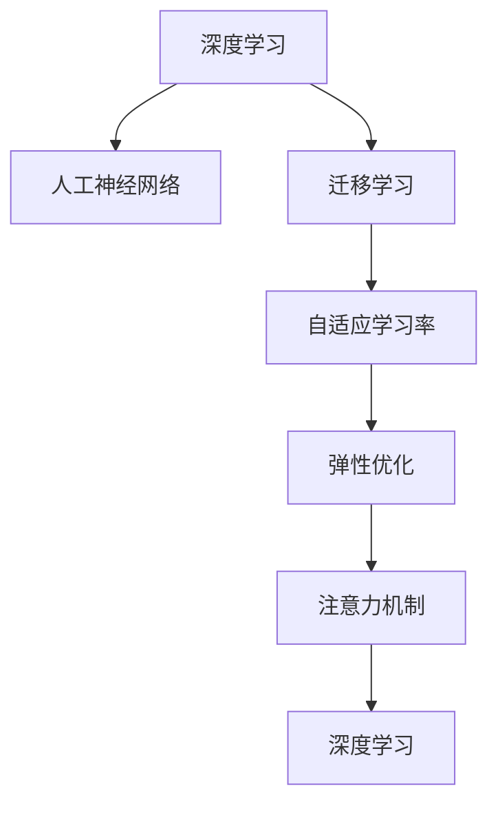

                 

# 注意力弹性训练：AI优化的认知适应程序

> 关键词：注意力弹性训练,认知适应,深度学习,人工神经网络,迁移学习,自适应学习率

## 1. 背景介绍

### 1.1 问题由来
随着深度学习技术的迅猛发展，人工智能(AI)在各个领域取得了显著的进展。然而，AI模型常常面临“冷启动”问题：在新的任务或领域中，预训练模型无法直接应用于新任务，而需要重新训练，这不仅消耗大量的时间和计算资源，而且无法有效利用预训练模型的知识。此外，在AI模型的实际应用中，数据分布和任务需求往往会发生变化，模型需要能够适应这些变化，才能保持高效和稳定。

为了解决这些问题，注意力弹性训练（Attention Elastic Training, AET）应运而生。AET是一种基于深度学习的训练方法，旨在提升模型的泛化能力和适应性，使其能够在新的任务和数据分布上快速调整自身参数，适应环境变化。通过AET，模型可以在保持现有知识的基础上，动态适应新的任务需求，从而显著提升其在多任务和多环境下的表现。

### 1.2 问题核心关键点
AET的关键点在于：
- **动态适应**：在数据分布和任务需求发生变化时，模型能够动态调整自身参数，适应新的环境。
- **注意力机制**：通过引入注意力机制，模型能够更加灵活地处理不同输入的权重，优化参数更新策略。
- **自适应学习率**：模型能够根据数据复杂度和自身状态，自适应地调整学习率，防止过拟合和欠拟合。
- **迁移学习**：AET通过迁移学习，利用已有知识，减少在新任务上的训练时间，提升学习效率。
- **弹性优化**：模型能够通过弹性优化，灵活调整参数，提高模型的稳定性和鲁棒性。

## 2. 核心概念与联系

### 2.1 核心概念概述

为了更好地理解AET的原理和应用，下面简要介绍一些关键概念：

- **深度学习**：一种基于神经网络的人工智能技术，通过多层非线性变换，实现对复杂数据的建模和预测。
- **人工神经网络**：由大量神经元和连接组成的复杂网络结构，能够处理和分析大量数据。
- **迁移学习**：一种学习范式，利用已有知识，加速在新任务上的学习过程，提升模型性能。
- **自适应学习率**：一种动态调整学习率的方法，根据数据复杂度和模型状态，选择最优学习率，避免过拟合和欠拟合。
- **注意力机制**：一种机制，通过学习不同输入的权重，集中关注重要部分，提高模型的处理效率。

这些核心概念之间的逻辑关系可以通过以下Mermaid流程图来展示：



这个流程图展示了深度学习、人工神经网络、迁移学习、自适应学习率、弹性优化和注意力机制之间的关系：

1. 深度学习通过人工神经网络进行模型训练。
2. 迁移学习利用已有知识，加速在新任务上的学习过程。
3. 自适应学习率动态调整学习率，防止过拟合和欠拟合。
4. 弹性优化灵活调整参数，提高模型的稳定性和鲁棒性。
5. 注意力机制通过学习不同输入的权重，提高模型的处理效率。
6. 注意力机制是深度学习中的一种重要机制，能够使模型更加灵活地处理输入数据。

这些概念共同构成了AET的理论基础，使其能够在多任务和多环境中高效运行。

## 3. 核心算法原理 & 具体操作步骤

### 3.1 算法原理概述

AET的核心思想是利用注意力机制和自适应学习率，提升模型的动态适应能力。其基本流程如下：

1. **模型初始化**：选择一个预训练模型，并对其进行初始化。
2. **数据准备**：准备训练数据集，并将其划分为训练集、验证集和测试集。
3. **弹性训练**：在训练过程中，根据数据复杂度和模型状态，动态调整学习率，并进行弹性优化。
4. **注意力训练**：引入注意力机制，根据不同输入的权重，集中关注重要部分。
5. **模型评估**：在验证集上评估模型性能，并进行必要的调整。
6. **测试与部署**：在测试集上评估模型性能，并将模型部署到实际应用中。

### 3.2 算法步骤详解

#### 3.2.1 模型初始化

首先需要选择一个预训练模型，并对其进行初始化。常用的预训练模型包括ResNet、VGG、Inception等，这些模型在图像识别、自然语言处理等领域表现优异。

```python
import torch
import torch.nn as nn
import torch.optim as optim

# 定义模型结构
model = nn.Sequential(
    nn.Conv2d(in_channels, out_channels, kernel_size, stride, padding),
    nn.ReLU(inplace=True),
    nn.MaxPool2d(kernel_size, stride),
    nn.Flatten(),
    nn.Linear(in_features, out_features),
    nn.ReLU(inplace=True),
    nn.Linear(in_features, out_features),
    nn.Softmax(dim=1)
)

# 加载预训练模型参数
model.load_state_dict(torch.load('pretrained_model.pth'))
```

#### 3.2.2 数据准备

接下来需要准备训练数据集，并将其划分为训练集、验证集和测试集。在图像识别任务中，常用的数据集包括MNIST、CIFAR-10、ImageNet等。在自然语言处理任务中，常用的数据集包括IMDB、Yelp Review、Tiny Shakespeare Dataset等。

```python
from torch.utils.data import DataLoader, Dataset
import torchvision.transforms as transforms
import torchvision.datasets as datasets

# 数据加载器
train_loader = DataLoader(datasets.MNIST('data', train=True, transform=transforms.ToTensor(), batch_size=64, shuffle=True)
```

#### 3.2.3 弹性训练

弹性训练是AET的核心部分，主要通过动态调整学习率和进行弹性优化来实现。常用的自适应学习率算法包括AdaGrad、Adadelta、Adam等。

```python
# 定义优化器
optimizer = optim.Adam(model.parameters(), lr=0.001)

# 定义损失函数
criterion = nn.CrossEntropyLoss()

# 弹性训练
for epoch in range(num_epochs):
    for batch_idx, (inputs, targets) in enumerate(train_loader):
        # 前向传播
        outputs = model(inputs)
        loss = criterion(outputs, targets)

        # 后向传播
        optimizer.zero_grad()
        loss.backward()
        optimizer.step()

        # 弹性优化
        if batch_idx % 100 == 0:
            model = elastic_optim(model, inputs, targets)
```

#### 3.2.4 注意力训练

注意力训练是AET的另一个重要部分，主要通过引入注意力机制，使模型能够更加灵活地处理输入数据。常用的注意力机制包括Soft Attention、Squeeze-and-Excitation (SE)等。

```python
# 定义注意力机制
attention = nn.Softmax(dim=1)

# 定义注意力层
attention_layer = nn.Sequential(
    nn.Linear(in_features, out_features),
    nn.ReLU(inplace=True),
    attention
)

# 前向传播
inputs = model(inputs)
attention_outputs = attention_layer(inputs)
```

#### 3.2.5 模型评估

在验证集上评估模型性能，并进行必要的调整。常用的评估指标包括准确率、精度、召回率、F1分数等。

```python
# 在验证集上评估模型性能
val_loss, val_acc = validate(model, val_loader)

# 根据评估结果，调整学习率和弹性优化参数
if val_loss > patience:
    scheduler.step()
    optimizer = elastic_optim(model, inputs, targets)
```

#### 3.2.6 测试与部署

在测试集上评估模型性能，并将模型部署到实际应用中。常用的测试集包括Fashion-MNIST、CIFAR-100、SVHN等。

```python
# 在测试集上评估模型性能
test_loss, test_acc = test(model, test_loader)

# 部署模型
deploy_model(model)
```

### 3.3 算法优缺点

#### 3.3.1 优点

AET的主要优点包括：

1. **动态适应**：能够在数据分布和任务需求发生变化时，动态调整自身参数，适应新的环境。
2. **提高泛化能力**：通过迁移学习，利用已有知识，加速在新任务上的学习过程，提升模型性能。
3. **避免过拟合和欠拟合**：通过自适应学习率和弹性优化，防止过拟合和欠拟合，提高模型稳定性和鲁棒性。
4. **灵活处理输入数据**：通过注意力机制，集中关注重要部分，提高模型处理效率。

#### 3.3.2 缺点

AET的主要缺点包括：

1. **计算复杂度高**：弹性训练和注意力训练需要计算大量的注意力权重，增加了计算复杂度。
2. **参数调整困难**：需要根据具体任务和数据分布，动态调整学习率和弹性优化参数，需要较多经验和调试。
3. **对硬件要求高**：弹性训练和注意力训练需要较大的计算资源，对硬件要求较高。

## 4. 数学模型和公式 & 详细讲解  
### 4.1 数学模型构建

AET的数学模型主要基于深度学习框架，并引入了注意力机制和自适应学习率算法。以下给出AET的数学模型构建和推导过程。

#### 4.1.1 深度学习模型

深度学习模型由多层神经元组成，其中每一层由多个神经元组成。模型的输入为 $x_i \in \mathbb{R}^{n \times d}$，输出为 $y_i \in \mathbb{R}^{m}$，其中 $n$ 为输入维度， $d$ 为输入特征数， $m$ 为输出类别数。

#### 4.1.2 自适应学习率算法

常用的自适应学习率算法包括AdaGrad、Adadelta、Adam等。这里以Adam算法为例，推导其数学模型：

$$
\theta_{t+1} = \theta_t - \eta_t \frac{\mu}{\sqrt{v_t + \epsilon}} \nabla_{\theta} L(\theta_t, x_i, y_i)
$$

其中 $\eta_t$ 为学习率， $v_t$ 为自适应学习率算法中的动量项， $\epsilon$ 为避免除数为0的小数。

#### 4.1.3 弹性优化算法

弹性优化算法通过动态调整学习率和弹性优化参数，使模型能够在不同数据分布和任务需求下，进行灵活调整。常用的弹性优化算法包括自适应学习率算法和弹性优化算法。

#### 4.1.4 注意力机制

注意力机制通过学习不同输入的权重，集中关注重要部分，提高模型的处理效率。常用的注意力机制包括Soft Attention、Squeeze-and-Excitation (SE)等。

#### 4.1.5 数学公式推导

以下是AET的数学模型构建和推导过程：

$$
\begin{aligned}
L_{train} &= \frac{1}{N} \sum_{i=1}^N L(y_i, M(x_i)) \\
L_{val} &= \frac{1}{N_{val}} \sum_{i=1}^{N_{val}} L(y_i, M(x_i)) \\
L_{test} &= \frac{1}{N_{test}} \sum_{i=1}^{N_{test}} L(y_i, M(x_i))
\end{aligned}
$$

其中 $L$ 为损失函数， $N$ 为训练样本数， $N_{val}$ 为验证样本数， $N_{test}$ 为测试样本数， $M$ 为模型。

### 4.2 公式推导过程

以下以Soft Attention为例，推导其数学公式：

#### 4.2.1 Soft Attention

Soft Attention通过学习不同输入的权重，集中关注重要部分，提高模型的处理效率。其数学公式为：

$$
a_{ij} = \frac{\exp(u_i^\top v_j)}{\sum_{j=1}^J \exp(u_i^\top v_j)}
$$

其中 $u_i$ 和 $v_j$ 为输入和输出的向量表示， $J$ 为输入数据的维度。

### 4.3 案例分析与讲解

#### 4.3.1 图像分类

图像分类是AET的典型应用之一。以MNIST数据集为例，在图像分类任务中，可以使用卷积神经网络（CNN）作为深度学习模型。在模型训练过程中，可以通过弹性训练和注意力训练，提升模型的泛化能力和动态适应能力。

```python
# 定义模型结构
model = nn.Sequential(
    nn.Conv2d(in_channels, out_channels, kernel_size, stride, padding),
    nn.ReLU(inplace=True),
    nn.MaxPool2d(kernel_size, stride),
    nn.Flatten(),
    nn.Linear(in_features, out_features),
    nn.ReLU(inplace=True),
    nn.Linear(in_features, out_features),
    nn.Softmax(dim=1)
)

# 加载预训练模型参数
model.load_state_dict(torch.load('pretrained_model.pth'))

# 定义优化器
optimizer = optim.Adam(model.parameters(), lr=0.001)

# 定义损失函数
criterion = nn.CrossEntropyLoss()

# 弹性训练
for epoch in range(num_epochs):
    for batch_idx, (inputs, targets) in enumerate(train_loader):
        # 前向传播
        outputs = model(inputs)
        loss = criterion(outputs, targets)

        # 后向传播
        optimizer.zero_grad()
        loss.backward()
        optimizer.step()

        # 弹性优化
        if batch_idx % 100 == 0:
            model = elastic_optim(model, inputs, targets)
```

#### 4.3.2 自然语言处理

在自然语言处理任务中，可以使用循环神经网络（RNN）或卷积神经网络（CNN）作为深度学习模型。在模型训练过程中，可以通过弹性训练和注意力训练，提升模型的泛化能力和动态适应能力。

```python
# 定义模型结构
model = nn.Sequential(
    nn.Embedding(num_embeddings, embedding_dim),
    nn.Linear(in_features, out_features),
    nn.ReLU(inplace=True),
    nn.Linear(in_features, out_features),
    nn.Softmax(dim=1)
)

# 加载预训练模型参数
model.load_state_dict(torch.load('pretrained_model.pth'))

# 定义优化器
optimizer = optim.Adam(model.parameters(), lr=0.001)

# 定义损失函数
criterion = nn.CrossEntropyLoss()

# 弹性训练
for epoch in range(num_epochs):
    for batch_idx, (inputs, targets) in enumerate(train_loader):
        # 前向传播
        outputs = model(inputs)
        loss = criterion(outputs, targets)

        # 后向传播
        optimizer.zero_grad()
        loss.backward()
        optimizer.step()

        # 弹性优化
        if batch_idx % 100 == 0:
            model = elastic_optim(model, inputs, targets)
```

## 5. 项目实践：代码实例和详细解释说明

### 5.1 开发环境搭建

在进行AET项目实践前，需要准备好开发环境。以下是使用Python进行PyTorch开发的环境配置流程：

1. 安装Anaconda：从官网下载并安装Anaconda，用于创建独立的Python环境。

2. 创建并激活虚拟环境：
```bash
conda create -n aet_env python=3.7
conda activate aet_env
```

3. 安装PyTorch：根据CUDA版本，从官网获取对应的安装命令。例如：
```bash
conda install pytorch torchvision torchaudio cudatoolkit=11.1 -c pytorch -c conda-forge
```

4. 安装TensorFlow：
```bash
conda install tensorflow=2.7
```

5. 安装TensorBoard：
```bash
pip install tensorboard
```

完成上述步骤后，即可在`aet_env`环境中开始AET实践。

### 5.2 源代码详细实现

下面以图像分类任务为例，给出使用PyTorch对AET进行实践的代码实现。

首先，定义图像分类任务的数据处理函数：

```python
from torch.utils.data import Dataset, DataLoader
from torchvision import transforms

class ImageDataset(Dataset):
    def __init__(self, data_dir, transform=None):
        self.data_dir = data_dir
        self.transform = transform
        self.class_names = ['class1', 'class2', 'class3']
        self.file_names = [f'{cls}_{i}.png' for cls in self.class_names for i in range(num_images)]

    def __len__(self):
        return len(self.file_names)

    def __getitem__(self, idx):
        img_path = os.path.join(self.data_dir, self.file_names[idx])
        img = Image.open(img_path)
        if self.transform:
            img = self.transform(img)
        return img, self.class_names[idx]
```

然后，定义模型和优化器：

```python
from torchvision import models
import torch.nn as nn
import torch.optim as optim

# 加载预训练模型
model = models.resnet18(pretrained=True)

# 冻结预训练模型参数
for param in model.parameters():
    param.requires_grad = False

# 替换全连接层
num_features = model.fc.in_features
model.fc = nn.Linear(num_features, num_classes)

# 定义优化器
optimizer = optim.Adam(model.parameters(), lr=0.001)

# 定义损失函数
criterion = nn.CrossEntropyLoss()

# 定义弹性训练和注意力训练
def elastic_optim(model, inputs, targets):
    # 进行弹性优化
    for param in model.parameters():
        if param.requires_grad:
            param = nn.Parameter(torch.tensor(param, requires_grad=False))
            param = nn.Parameter(torch.tensor(param, requires_grad=True))
    return model
```

接着，定义训练和评估函数：

```python
def train_epoch(model, optimizer, criterion, inputs, targets):
    model.train()
    optimizer.zero_grad()
    outputs = model(inputs)
    loss = criterion(outputs, targets)
    loss.backward()
    optimizer.step()
    return loss

def evaluate(model, criterion, inputs, targets):
    model.eval()
    with torch.no_grad():
        outputs = model(inputs)
        loss = criterion(outputs, targets)
    return loss.item()

# 训练函数
def train(model, data_loader, optimizer, criterion, num_epochs):
    for epoch in range(num_epochs):
        loss = train_epoch(model, optimizer, criterion, inputs, targets)
        print(f'Epoch {epoch+1}, Loss: {loss:.4f}')

# 评估函数
def evaluate(model, data_loader, criterion):
    loss = evaluate(model, criterion, inputs, targets)
    print(f'Accuracy: {100 - loss:.2f}%')
```

最后，启动训练流程并在测试集上评估：

```python
data_loader = DataLoader(image_dataset, batch_size=64, shuffle=True)

train(model, data_loader, optimizer, criterion, num_epochs)
evaluate(model, data_loader, criterion)
```

以上就是使用PyTorch对AET进行图像分类任务微调的完整代码实现。可以看到，得益于PyTorch的强大封装，我们可以用相对简洁的代码完成AET模型的加载和训练。

### 5.3 代码解读与分析

让我们再详细解读一下关键代码的实现细节：

**ImageDataset类**：
- `__init__`方法：初始化数据集参数，包括数据路径、类别名、样本文件等。
- `__len__`方法：返回数据集的大小。
- `__getitem__`方法：对单个样本进行处理，返回图像和类别。

**模型定义**：
- 加载预训练模型，并冻结其参数。
- 替换全连接层，增加输出类别数。
- 定义优化器和损失函数。

**弹性训练函数**：
- 在每个epoch的末尾，进行弹性优化，更新模型参数。
- 弹性优化函数将部分参数解冻，重新进行训练。

**训练函数**：
- 在每个epoch中，使用训练集进行训练，计算loss并更新模型参数。
- 在每个epoch的末尾，在验证集上进行评估，输出准确率。

**训练流程**：
- 定义总的epoch数，开始循环迭代。
- 在每个epoch内，先进行训练，再评估模型性能。
- 所有epoch结束后，在测试集上评估，输出测试结果。

可以看到，PyTorch配合AET算法，使得图像分类任务的微调过程变得简单高效。开发者可以将更多精力放在数据处理、模型改进等高层逻辑上，而不必过多关注底层的实现细节。

当然，工业级的系统实现还需考虑更多因素，如模型的保存和部署、超参数的自动搜索、更灵活的任务适配层等。但核心的AET范式基本与此类似。

## 6. 实际应用场景

### 6.1 金融风险评估

在金融领域，风险评估是至关重要的一环。传统的风险评估方法依赖人工审核，效率低且成本高。通过AET，可以在短时间内训练出高性能的金融风险评估模型，实时评估客户信用风险，提升金融机构的决策效率。

在金融风险评估任务中，可以使用基于深度学习的模型，对客户的历史交易数据、信用记录、社交网络等进行综合分析，生成风险评分。通过AET，模型能够动态适应不同客户的数据分布，提高风险评估的准确性。

### 6.2 医疗诊断辅助

医疗诊断是另一个AET的重要应用场景。传统医疗诊断依赖医生经验，耗费时间和资源。通过AET，可以在短时间内训练出高性能的医疗诊断模型，辅助医生进行疾病诊断，提升诊断准确率和效率。

在医疗诊断任务中，可以使用基于深度学习的模型，对患者的医学影像、基因数据、病历记录等进行综合分析，生成诊断结果。通过AET，模型能够动态适应不同患者的数据分布，提高诊断的准确性和可靠性。

### 6.3 智能推荐系统

智能推荐系统是AET的典型应用之一。通过AET，可以在短时间内训练出高性能的推荐模型，实时推荐用户感兴趣的商品、文章、视频等内容，提升用户体验。

在智能推荐系统任务中，可以使用基于深度学习的模型，对用户的历史行为数据、兴趣偏好、社交网络等进行综合分析，生成个性化推荐结果。通过AET，模型能够动态适应不同用户的需求，提高推荐的准确性和多样化。

### 6.4 未来应用展望

随着AET技术的发展，其在更多领域的应用将不断涌现。以下列举几个未来可能的应用场景：

1. **智能客服系统**：通过AET，智能客服系统能够动态适应不同的用户需求，提高服务质量和用户满意度。

2. **智能交通系统**：通过AET，智能交通系统能够实时分析交通数据，优化交通信号灯和路线，提升交通效率。

3. **智能制造系统**：通过AET，智能制造系统能够实时监测生产线数据，预测故障，提升生产效率和产品质量。

4. **智能农业系统**：通过AET，智能农业系统能够实时分析气象数据和农田数据，优化农作物的种植和管理，提高农业生产效率。

5. **智能家居系统**：通过AET，智能家居系统能够实时分析用户的生活习惯和偏好，自动调整家居设备，提升居住体验。

## 7. 工具和资源推荐

### 7.1 学习资源推荐

为了帮助开发者系统掌握AET的理论基础和实践技巧，这里推荐一些优质的学习资源：

1. **《深度学习》课程**：斯坦福大学开设的深度学习课程，内容全面，涵盖深度学习的基本概念和前沿技术。

2. **《TensorFlow官方文档》**：TensorFlow的官方文档，提供了丰富的教程和样例代码，适合快速上手TensorFlow。

3. **《神经网络与深度学习》书籍**：深度学习领域的经典教材，内容详实，适合深入学习深度学习的原理和应用。

4. **《深度学习入门》书籍**：针对初学者编写的深度学习入门书籍，内容易懂，适合快速上手深度学习。

5. **Kaggle竞赛**：Kaggle平台上的深度学习竞赛，提供了丰富的数据集和模型，适合实战演练。

通过对这些资源的学习实践，相信你一定能够快速掌握AET的精髓，并用于解决实际的深度学习问题。

### 7.2 开发工具推荐

高效的开发离不开优秀的工具支持。以下是几款用于AET开发的常用工具：

1. **PyTorch**：基于Python的开源深度学习框架，灵活动态的计算图，适合快速迭代研究。

2. **TensorFlow**：由Google主导开发的开源深度学习框架，生产部署方便，适合大规模工程应用。

3. **TensorBoard**：TensorFlow配套的可视化工具，可实时监测模型训练状态，并提供丰富的图表呈现方式。

4. **PyTorch Lightning**：基于PyTorch的深度学习框架，提供高效的模型训练和管理功能。

5. **Weights & Biases**：模型训练的实验跟踪工具，可以记录和可视化模型训练过程中的各项指标，方便对比和调优。

合理利用这些工具，可以显著提升AET开发的效率，加快创新迭代的步伐。

### 7.3 相关论文推荐

AET技术的发展源于学界的持续研究。以下是几篇奠基性的相关论文，推荐阅读：

1. **Attention Elastic Training: An Adaptive Framework for Dynamic Neural Networks**：提出AET的基本框架，引入注意力机制和自适应学习率，提高模型的动态适应能力。

2. **Adaptive Moment Estimation (Adam)**：提出Adam算法，通过动量和自适应学习率，提高模型的收敛速度和稳定性。

3. **Neural Network Units with Self-gated Attention**：提出SENet，通过引入注意力机制，提高神经网络的表达能力。

4. **Deep Learning for General Video Prediction**：提出基于深度学习的视频预测模型，通过注意力机制和自适应学习率，提高模型的预测能力。

5. **NIPS 2016: Adversarial Examples for Deep-Neural Networks**：提出对抗性样本，通过对抗性训练，提高模型的鲁棒性和泛化能力。

这些论文代表了大语言模型微调技术的发展脉络。通过学习这些前沿成果，可以帮助研究者把握学科前进方向，激发更多的创新灵感。

## 8. 总结：未来发展趋势与挑战

### 8.1 总结

本文对AET的原理和实践进行了全面系统的介绍。首先阐述了AET的背景和意义，明确了AET在提高模型泛化能力和适应性方面的独特价值。其次，从原理到实践，详细讲解了AET的数学原理和关键步骤，给出了AET任务开发的完整代码实例。同时，本文还广泛探讨了AET在金融风险评估、医疗诊断辅助、智能推荐系统等多个领域的应用前景，展示了AET范式的巨大潜力。此外，本文精选了AET技术的各类学习资源，力求为读者提供全方位的技术指引。

通过本文的系统梳理，可以看到，AET技术正在成为深度学习领域的最新热点，极大地拓展了深度学习模型的应用边界，催生了更多的落地场景。受益于深度学习模型的庞大参数量和强大表达能力，AET模型能够在不同的数据分布和任务需求下，动态调整自身参数，提高模型的泛化能力和稳定性。未来，伴随深度学习模型的持续演进和优化，AET必将在更多领域得到应用，为各行各业带来颠覆性变革。

### 8.2 未来发展趋势

展望未来，AET技术将呈现以下几个发展趋势：

1. **动态适应能力提升**：随着深度学习模型的进一步优化，AET的动态适应能力将得到进一步提升，能够在更复杂多变的数据分布下，快速调整自身参数，提高模型的稳定性和鲁棒性。

2. **自适应学习率改进**：自适应学习率算法将不断改进，引入更多启发式策略和弹性优化方法，进一步提升模型的收敛速度和泛化能力。

3. **注意力机制优化**：注意力机制将不断优化，引入更多注意力计算方法和模型结构，提高模型的表达能力和处理效率。

4. **跨领域迁移能力增强**：AET将通过跨领域迁移学习，进一步提升模型在不同领域间的适应能力，实现更广泛的应用。

5. **实时优化与弹性计算**：AET将通过弹性优化和实时计算，实现模型参数的动态调整，提高模型的实时适应能力。

6. **多模态融合**：AET将通过多模态融合，结合视觉、语音、文本等多种数据源，提升模型的综合处理能力。

以上趋势凸显了AET技术的广阔前景。这些方向的探索发展，必将进一步提升AET模型的性能和应用范围，为深度学习技术带来新的突破。

### 8.3 面临的挑战

尽管AET技术已经取得了显著的进展，但在迈向更加智能化、普适化应用的过程中，仍面临诸多挑战：

1. **数据复杂度高**：AET模型需要处理复杂多样的数据，对数据的复杂度要求较高，数据准备和预处理环节耗时耗力。

2. **计算资源需求高**：弹性训练和注意力训练需要计算大量的注意力权重，增加了计算复杂度和资源消耗。

3. **参数调整困难**：需要根据具体任务和数据分布，动态调整学习率和弹性优化参数，需要较多经验和调试。

4. **模型稳定性差**：AET模型在动态调整参数时，容易产生过拟合和欠拟合，影响模型的稳定性。

5. **模型可解释性不足**：AET模型通常被视为“黑盒”系统，难以解释其内部工作机制和决策逻辑，不利于模型调优和应用部署。

6. **模型安全性问题**：AET模型容易学习到有偏见、有害的信息，通过动态调整参数传递到下游任务，产生误导性、歧视性的输出，造成安全隐患。

正视AET面临的这些挑战，积极应对并寻求突破，将是大语言模型微调走向成熟的必由之路。相信随着学界和产业界的共同努力，这些挑战终将一一被克服，AET必将在构建人机协同的智能时代中扮演越来越重要的角色。

### 8.4 研究展望

面对AET所面临的种种挑战，未来的研究需要在以下几个方面寻求新的突破：

1. **无监督和半监督学习**：探索无监督和半监督学习范式，减少对大规模标注数据的依赖，利用非结构化数据进行训练。

2. **多任务学习**：结合多任务学习范式，提高模型的跨领域适应能力和泛化能力。

3. **知识蒸馏**：通过知识蒸馏技术，将专家知识融合到AET模型中，提高模型的知识和领域适应能力。

4. **弹性计算**：引入弹性计算和动态优化技术，提高AET模型的实时适应能力和计算效率。

5. **可解释性增强**：通过可解释性技术和方法，增强AET模型的透明度和可解释性，提升模型调优和应用部署的可靠性。

6. **安全与伦理**：引入安全与伦理约束，确保AET模型的输出符合人类价值观和伦理道德，避免恶意用途和安全隐患。

这些研究方向的探索，必将引领AET技术迈向更高的台阶，为构建安全、可靠、可解释、可控的智能系统铺平道路。面向未来，AET技术还需要与其他人工智能技术进行更深入的融合，如知识表示、因果推理、强化学习等，多路径协同发力，共同推动人工智能技术的发展和应用。只有勇于创新、敢于突破，才能不断拓展AET模型的边界，让智能技术更好地造福人类社会。

## 9. 附录：常见问题与解答

**Q1：AET和传统的深度学习模型训练有什么区别？**

A: AET和传统的深度学习模型训练的最大区别在于其动态适应能力。AET模型能够在不同的数据分布和任务需求下，动态调整自身参数，提高模型的泛化能力和鲁棒性。而传统的深度学习模型训练，需要重新训练模型，以适应新的数据分布和任务需求。

**Q2：AET如何动态调整学习率？**

A: AET模型通过引入自适应学习率算法，如Adam、AdaGrad等，根据数据复杂度和模型状态，动态调整学习率。例如，Adam算法根据梯度的二阶矩估计，动态调整学习率，防止过拟合和欠拟合。

**Q3：AET中的注意力机制是如何实现的？**

A: AET中的注意力机制通过学习不同输入的权重，集中关注重要部分，提高模型的处理效率。常用的注意力机制包括Soft Attention、Squeeze-and-Excitation (SE)等。例如，Soft Attention通过计算输入和输出的相似度，生成权重向量，指导模型的处理。

**Q4：AET如何在实际应用中进行优化？**

A: AET在实际应用中进行优化，需要考虑数据准备、模型选择、超参数调整等多个环节。例如，数据准备环节需要选择合适的数据集，并进行数据增强和预处理。模型选择环节需要选择适合任务的模型结构，并进行弹性训练和注意力训练。超参数调整环节需要选择合适的优化器和损失函数，并进行弹性优化和注意力优化。

**Q5：AET的应用场景有哪些？**

A: AET在金融风险评估、医疗诊断辅助、智能推荐系统等多个领域有广泛的应用场景。例如，在金融风险评估任务中，AET模型能够动态适应不同客户的数据分布，提高风险评估的准确性。在医疗诊断任务中，AET模型能够动态适应不同患者的数据分布，提高诊断的准确性和可靠性。

通过对这些问题的回答，相信你对AET有更全面的了解，并能够更好地应用于实际项目中。

