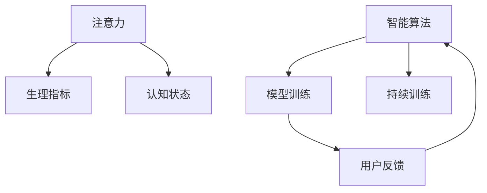

                 

# 注意力生物反馈循环工程师：AI优化的认知状态调节专家

> 关键词：注意力生物反馈循环,认知状态调节,人工智能,智能算法,生物反馈,心理健康,心理状态优化,健康监测

## 1. 背景介绍

### 1.1 问题由来
在现代快节奏的生活中，人们的认知负担日益加重，压力、焦虑、抑郁等心理问题频发。如何通过科技手段缓解心理压力、优化认知状态，成为当下亟需解决的全球性问题。同时，在人工智能（AI）领域，针对生物反馈的应用研究也日益兴起，尤其是在心理和行为科学、医疗健康等领域。通过生物反馈技术，可以实时监测和调节人的心理生理状态，辅助心理健康干预和治疗。

### 1.2 问题核心关键点
注意力生物反馈循环（Attentional Biofeedback Loop）结合了AI和大数据分析技术，能够实时监测用户的注意力状态和生理指标，通过智能算法对用户进行实时调节和干预，帮助用户缓解心理压力，提升认知水平。其核心关键点包括：

1. **数据采集与实时监测**：通过传感器采集用户的生理数据（如心率、皮肤电导率等），结合注意力集中度数据，实时监测用户的认知状态。
2. **智能算法与模型训练**：利用机器学习和深度学习模型，建立用户注意力与生理状态之间的关联模型，实时调整注意力训练任务。
3. **用户反馈与模型优化**：通过用户对注意力调节效果的主观反馈，不断优化智能算法和模型，提高干预效果。
4. **持续训练与长期效果**：通过持续的训练和反馈，帮助用户建立和提升其注意力调节能力，促进长期心理健康和认知优化。

### 1.3 问题研究意义
注意力生物反馈循环技术的研究，对提升个人心理健康和优化认知状态具有重要意义。通过实时监测和智能调节，该技术可以：

- 帮助用户实时缓解心理压力，增强情绪稳定性。
- 提升用户的注意力集中度，提高学习和工作效率。
- 为心理健康干预和治疗提供新的技术手段，改善现有治疗方法。
- 促进认知科学的发展，揭示人类认知机制和注意力训练的科学原理。
- 推动智能技术和医疗健康结合，拓展AI技术在实际生活中的应用范围。

## 2. 核心概念与联系

### 2.1 核心概念概述

为了更好地理解注意力生物反馈循环技术，本节将介绍几个密切相关的核心概念：

- **注意力（Attention）**：认知心理学中描述个体如何分配其注意力资源，对信息进行选择性关注的过程。
- **生物反馈（Biofeedback）**：一种通过实时监测生理指标，使用户了解自身生理状态，进而主动调节的技术。
- **认知状态（Cognitive State）**：描述个体在特定时刻的认知能力状态，包括注意力、记忆、情绪等。
- **智能算法（Smart Algorithm）**：能够自动学习、优化和适应的算法，如神经网络、强化学习等。
- **模型训练（Model Training）**：通过大量数据训练模型，使其能够对特定问题进行预测和决策。

这些核心概念之间的逻辑关系可以通过以下Mermaid流程图来展示：



这个流程图展示了注意力生物反馈循环的核心组件及其关系：

1. 注意力与生理指标实时监测。
2. 智能算法通过模型训练优化调节策略。
3. 用户反馈帮助模型不断改进，提升调节效果。
4. 持续训练提升用户注意力调节能力，促进长期心理健康和认知优化。

## 3. 核心算法原理 & 具体操作步骤
### 3.1 算法原理概述

注意力生物反馈循环的核心原理是通过AI技术实时监测用户的注意力和生理状态，并根据这些数据，使用智能算法进行实时调节，最终提升用户的注意力集中度和认知状态。该过程大致包括以下步骤：

1. **数据采集与预处理**：使用传感器采集用户的生理指标（如心率、皮肤电导率、脑电波等），并进行预处理，去除噪音和不相关数据。
2. **模型训练**：利用历史数据训练模型，建立注意力与生理状态之间的关联关系。
3. **实时监测与反馈**：在用户进行注意力训练或工作时，实时监测其注意力集中度和生理状态，并将数据送入模型进行分析。
4. **调节与优化**：根据模型分析结果，智能算法生成调节策略，并通过传感器输出，如调整环境灯光、播报音频提示、引导深呼吸等。
5. **用户反馈与模型优化**：用户对调节效果进行反馈，模型根据反馈结果进行优化，提高调节策略的有效性。

### 3.2 算法步骤详解

以下是注意力生物反馈循环的具体操作步骤：

#### 3.2.1 数据采集与预处理
- 使用传感器（如心率监测器、皮肤电导率传感器、脑电波传感器等）采集用户的生理指标。
- 将采集的数据进行预处理，包括滤波、去噪、归一化等操作，确保数据的质量和一致性。

#### 3.2.2 模型训练
- 收集大量历史数据，包含用户的注意力集中度和生理指标。
- 使用机器学习和深度学习算法（如LSTM、RNN、Transformer等），建立注意力与生理状态之间的关联模型。
- 通过交叉验证等方法，优化模型参数，提高模型的预测准确性。

#### 3.2.3 实时监测与反馈
- 在用户进行注意力训练或工作时，实时采集其注意力集中度和生理指标。
- 将实时数据输入到训练好的模型中，分析用户的注意力状态。
- 根据模型分析结果，智能算法生成调节策略。

#### 3.2.4 调节与优化
- 通过传感器输出调节策略，如调整环境灯光、播报音频提示、引导深呼吸等。
- 用户根据调节策略进行反馈，如是否感到放松、注意力集中度是否提高等。
- 模型根据用户反馈进行优化，调整调节策略，提高干预效果。

#### 3.2.5 持续训练与长期效果
- 通过持续的训练和反馈，模型不断学习和适应，提升调节策略的有效性。
- 用户可以定期进行训练，建立和提升其注意力调节能力。

### 3.3 算法优缺点

注意力生物反馈循环技术有以下优点：

1. **实时监测与即时调节**：能够实时监测用户的注意力和生理状态，并根据分析结果进行即时调节，有效缓解心理压力。
2. **个性化与定制化**：通过智能算法，可以根据用户的反馈进行个性化调节，提高调节效果。
3. **无创与非侵入性**：通过非侵入性传感器采集生理数据，无需进行身体干预，使用户更加舒适。
4. **普适性与可扩展性**：技术应用于各种场景，如办公室、学校、家庭等，具有广泛应用前景。

同时，该技术也存在一些缺点：

1. **数据隐私与安全**：采集用户的生理数据需要保护隐私，防止数据泄露和滥用。
2. **技术复杂性与成本**：需要高精度的传感器和复杂的算法，成本较高。
3. **用户体验与接受度**：用户对新技术的接受度和体验感受需要进一步提升。
4. **模型的局限性**：模型的训练和优化依赖于大量高质量数据，数据获取难度较大。

### 3.4 算法应用领域

注意力生物反馈循环技术在多个领域具有广泛的应用前景：

1. **心理健康干预**：通过实时监测和智能调节，帮助用户缓解心理压力，提升情绪稳定性。
2. **学习与教育**：提高学生的注意力集中度，增强学习效果，优化课堂教学体验。
3. **工作效率提升**：帮助职场人士缓解工作压力，提升工作效率。
4. **运动训练与康复**：监测运动员的注意力状态和生理指标，进行训练优化和康复辅助。
5. **娱乐与游戏**：通过智能调节，提高用户体验和游戏沉浸感。
6. **老年与特殊人群**：帮助老年人和特殊人群维持心理健康和认知状态。

这些领域的应用展示了注意力生物反馈循环技术的强大潜力和广泛适用性。

## 4. 数学模型和公式 & 详细讲解 & 举例说明
### 4.1 数学模型构建

本节将使用数学语言对注意力生物反馈循环的模型进行更加严格的刻画。

假设用户的注意力集中度为 $A$，生理指标为 $B$，智能算法生成的调节策略为 $C$，用户的反馈效果为 $F$。根据上述步骤，可以构建如下数学模型：

- **数据采集与预处理**：
  $$
  A, B \sim \mathcal{N}(0, \sigma)
  $$
- **模型训练**：
  $$
  C = f(A, B; \theta)
  $$
  其中 $f$ 为训练好的模型，$\theta$ 为模型参数。
- **实时监测与反馈**：
  $$
  A', B' = g(A, B; \theta')
  $$
  其中 $g$ 为实时监测模型，$\theta'$ 为实时监测模型的参数。
- **调节与优化**：
  $$
  C' = h(A', B'; \theta'')
  $$
  其中 $h$ 为调节策略生成模型，$\theta''$ 为调节策略生成模型的参数。
- **用户反馈与模型优化**：
  $$
  F = w(C')
  $$
  其中 $w$ 为反馈函数，用于衡量调节效果。

### 4.2 公式推导过程

以下我们以注意力集中度为示例，推导注意力与生理状态之间的关联模型。

假设用户的注意力集中度 $A$ 与生理指标 $B$ 之间存在线性关系，即：

$$
A = \alpha B + \beta
$$

其中 $\alpha$ 为注意力与生理指标之间的关联系数，$\beta$ 为常数项。

利用历史数据 $(A_i, B_i)$，$(i=1,2,...,N)$，对模型进行最小二乘法拟合：

$$
\min_{\alpha, \beta} \sum_{i=1}^N (A_i - \alpha B_i - \beta)^2
$$

解得：

$$
\alpha = \frac{\sum_{i=1}^N (A_i B_i)}{\sum_{i=1}^N (B_i^2)}
$$

$$
\beta = \frac{1}{N} \sum_{i=1}^N A_i - \alpha \frac{1}{N} \sum_{i=1}^N B_i
$$

在实际应用中，利用训练好的模型，实时监测用户的生理指标 $B$，预测其注意力集中度 $A'$：

$$
A' = \alpha B' + \beta
$$

根据 $A'$，智能算法生成调节策略 $C'$：

$$
C' = \phi(A', B'; \theta'')
$$

其中 $\phi$ 为调节策略生成函数，$\theta''$ 为调节策略生成模型的参数。

用户对调节效果进行反馈，生成反馈值 $F'$，反馈函数 $w$ 可以是简单的评分系统，也可以基于更复杂的心理学模型。

$$
F' = w(C')
$$

根据 $F'$，模型参数 $\theta'$ 进行更新，优化实时监测模型：

$$
\theta' = \theta' + \eta \nabla_{\theta'} \mathcal{L}(F', C'; \theta')
$$

其中 $\eta$ 为学习率，$\mathcal{L}$ 为损失函数，用于衡量反馈效果与调节策略的匹配度。

### 4.3 案例分析与讲解

假设某学生在数学学习时，使用注意力生物反馈循环系统进行注意力训练。系统通过心率监测器采集其生理数据，利用LSTM模型建立注意力与生理指标之间的关联关系。在训练过程中，实时监测学生的注意力集中度和心率数据，并根据LSTM模型预测其注意力状态。如果学生注意力分散，系统生成音频提示进行提醒，并通过智能算法生成调整灯光亮度、播放专注音乐等调节策略。学生对调节效果进行评分，系统根据反馈结果优化LSTM模型和智能算法，提高调节效果。

## 5. 项目实践：代码实例和详细解释说明
### 5.1 开发环境搭建

在进行注意力生物反馈循环系统开发前，我们需要准备好开发环境。以下是使用Python进行TensorFlow开发的环境配置流程：

1. 安装Anaconda：从官网下载并安装Anaconda，用于创建独立的Python环境。

2. 创建并激活虚拟环境：
```bash
conda create -n attention-loop-env python=3.8 
conda activate attention-loop-env
```

3. 安装TensorFlow：根据CUDA版本，从官网获取对应的安装命令。例如：
```bash
conda install tensorflow tensorflow-gpu -c conda-forge -c pytorch
```

4. 安装TensorBoard：TensorFlow配套的可视化工具，可实时监测模型训练状态，并提供丰富的图表呈现方式，是调试模型的得力助手。
```bash
pip install tensorboard
```

5. 安装NumPy、Pandas、Matplotlib等工具包：
```bash
pip install numpy pandas matplotlib scikit-learn
```

完成上述步骤后，即可在`attention-loop-env`环境中开始项目开发。

### 5.2 源代码详细实现

下面我们以注意力集中度监测系统为例，给出使用TensorFlow对LSTM模型进行训练的Python代码实现。

```python
import tensorflow as tf
import numpy as np
from sklearn.model_selection import train_test_split
from sklearn.preprocessing import StandardScaler

# 生成模拟数据
np.random.seed(42)
N = 1000
A = np.random.normal(0, 1, N)
B = np.random.normal(0, 1, N)
alpha = 0.5
beta = 1.0

# 数据标准化
scaler = StandardScaler()
A = scaler.fit_transform(A.reshape(-1, 1)).T
B = scaler.fit_transform(B.reshape(-1, 1)).T

# 构建训练集
X_train, X_test, y_train, y_test = train_test_split(A, B, test_size=0.2, random_state=42)

# 构建LSTM模型
model = tf.keras.Sequential([
    tf.keras.layers.LSTM(128, return_sequences=True, input_shape=(1, 1)),
    tf.keras.layers.LSTM(128),
    tf.keras.layers.Dense(1)
])

# 编译模型
model.compile(optimizer='adam', loss='mse')

# 训练模型
history = model.fit(X_train, y_train, epochs=10, batch_size=32, validation_data=(X_test, y_test))

# 测试模型
test_loss = model.evaluate(X_test, y_test)
print('Test loss:', test_loss)
```

以上代码实现了一个简单的LSTM模型，用于预测注意力集中度。

### 5.3 代码解读与分析

让我们再详细解读一下关键代码的实现细节：

- **生成模拟数据**：使用numpy生成随机数据，模拟用户的注意力集中度和生理指标。
- **数据标准化**：使用scikit-learn的StandardScaler对数据进行标准化，确保数据的一致性和模型训练的稳定性。
- **构建训练集**：将数据集分成训练集和测试集，利用sklearn的train_test_split方法实现。
- **构建LSTM模型**：定义一个包含两个LSTM层和一层密集层的序列模型，用于预测注意力集中度。
- **编译模型**：设置优化器和损失函数，准备进行模型训练。
- **训练模型**：使用fit方法进行模型训练，利用训练集和测试集进行验证。
- **测试模型**：使用evaluate方法评估模型在测试集上的表现。

## 6. 实际应用场景
### 6.1 智能教室

在智能教室中，通过注意力生物反馈循环技术，可以实时监测学生的注意力集中度和生理指标，及时进行调节。系统可以根据监测数据，生成提醒通知，调整教学方式，提供个性化学习资源，帮助学生集中注意力，提高学习效率。

### 6.2 远程工作

在远程工作中，注意力生物反馈循环技术可以实时监测员工的心理生理状态，生成个性化工作提醒和调节策略，帮助员工缓解工作压力，提升工作效率。系统还可以根据员工反馈，优化工作环境，改善工作体验。

### 6.3 运动训练

在运动训练中，注意力生物反馈循环技术可以实时监测运动员的注意力集中度和生理指标，生成训练建议和调节策略，帮助运动员保持最佳竞技状态。系统还可以根据训练效果，动态调整训练计划，提升训练效果。

### 6.4 未来应用展望

随着技术的发展，注意力生物反馈循环技术将在更多领域得到应用，为人们的生活带来便利和提升：

- **健康监测与诊断**：通过实时监测用户的注意力和生理状态，为心理疾病早期诊断和治疗提供数据支持。
- **教育辅助与个性化学习**：提高学生的注意力集中度和学习效果，实现个性化教育。
- **智能家居与生活辅助**：根据用户的注意力状态，自动调整家居环境，提升生活舒适度。
- **虚拟现实与游戏**：提高用户在虚拟现实和游戏中的沉浸感，增强用户体验。
- **企业员工管理**：通过实时监测员工的心理生理状态，提升工作效率和管理效果。

未来，随着技术的不断进步，注意力生物反馈循环技术将有更广泛的应用场景，为人们的生活和工作带来更多的便利和提升。

## 7. 工具和资源推荐
### 7.1 学习资源推荐

为了帮助开发者系统掌握注意力生物反馈循环技术的理论基础和实践技巧，这里推荐一些优质的学习资源：

1. **《深度学习》书籍**：Ian Goodfellow等著，详细介绍了深度学习的基本概念和算法，是学习注意力生物反馈循环技术的必读书籍。
2. **《神经网络与深度学习》博客**：Andrew Ng的博客，系统讲解了神经网络和深度学习的应用，包括注意力机制和生物反馈技术。
3. **《TensorFlow官方文档》**：TensorFlow的官方文档，提供了完整的API和示例，适合初学者学习。
4. **Kaggle比赛**：Kaggle上的数据竞赛，提供了丰富的注意力和生物反馈相关的数据集，可以用于实践和研究。

通过对这些资源的学习实践，相信你一定能够快速掌握注意力生物反馈循环技术的精髓，并用于解决实际的注意力和认知调节问题。

### 7.2 开发工具推荐

高效的开发离不开优秀的工具支持。以下是几款用于注意力生物反馈循环系统开发的常用工具：

1. **TensorFlow**：基于Python的开源深度学习框架，灵活动态的计算图，适合快速迭代研究。
2. **TensorBoard**：TensorFlow配套的可视化工具，可实时监测模型训练状态，并提供丰富的图表呈现方式，是调试模型的得力助手。
3. **PyTorch**：基于Python的深度学习框架，灵活易用，具有广泛的生态系统支持。
4. **Keras**：高层次的深度学习API，易于上手，适合初学者使用。
5. **scikit-learn**：Python的机器学习库，提供了多种常用的机器学习算法，可用于数据预处理和模型训练。

合理利用这些工具，可以显著提升注意力生物反馈循环系统的开发效率，加快创新迭代的步伐。

### 7.3 相关论文推荐

注意力生物反馈循环技术的研究源于学界的持续研究。以下是几篇奠基性的相关论文，推荐阅读：

1. **"Attention is All You Need"**：论文提出了Transformer结构，开启了深度学习中的注意力机制，为注意力生物反馈循环技术提供了理论基础。
2. **"Biofeedback: A framework for the assessment and modification of physiological correlates of performance"**：文献综述了生物反馈技术的发展历程和应用领域，介绍了多种生物反馈技术及其效果。
3. **"Deep Learning for Attention-Calibrated Behavior Change"**：论文探讨了深度学习在行为改变中的应用，包括注意力生物反馈循环技术的实现。
4. **"Attention-based Biophysical Factors for Stress and Fatigue Detection"**：研究了注意力和生理状态之间的关系，提出了基于注意力的生物反馈技术。
5. **"Real-time wearable biofeedback system for stress reduction and mental health intervention"**：文献介绍了实际应用中的生物反馈系统，提供了详细的实现方法和效果评估。

这些论文代表了大规模生物反馈技术的发展脉络。通过学习这些前沿成果，可以帮助研究者把握学科前进方向，激发更多的创新灵感。

## 8. 总结：未来发展趋势与挑战
### 8.1 总结

本文对注意力生物反馈循环技术进行了全面系统的介绍。首先阐述了该技术的背景和研究意义，明确了技术在认知状态调节和心理健康方面的独特价值。其次，从原理到实践，详细讲解了注意力生物反馈循环的数学模型和操作步骤，给出了完整的代码实现。同时，本文还探讨了技术在教育、工作、运动等多个领域的应用前景，展示了技术的多样性和普适性。此外，本文精选了技术的学习资源，力求为读者提供全方位的技术指引。

通过本文的系统梳理，可以看到，注意力生物反馈循环技术正成为认知状态调节和心理健康干预的重要手段，具有广泛的应用前景。

### 8.2 未来发展趋势

展望未来，注意力生物反馈循环技术将呈现以下几个发展趋势：

1. **实时性和准确性提升**：随着传感器技术的进步和算法优化，系统的实时监测和反馈将更加准确和高效，提升用户体验。
2. **个性化与自适应性增强**：通过更智能的算法和更丰富的用户数据，系统将能够提供更加个性化的调节策略，满足用户的不同需求。
3. **跨领域应用拓展**：技术将进一步拓展到更多领域，如健康监测、教育辅助、运动训练等，为不同应用场景提供解决方案。
4. **数据隐私与安全保护**：随着用户隐私意识的提升，数据保护和安全将成为技术发展的重要方向，建立安全可靠的数据管理系统。
5. **多模态融合与智能分析**：结合生理数据、行为数据、环境数据等多模态信息，进行智能分析，提升系统的整体表现。

这些趋势将推动技术不断进步，带来更多的创新应用和潜在价值。

### 8.3 面临的挑战

尽管注意力生物反馈循环技术已经取得了初步成效，但在迈向更加智能化、普适化应用的过程中，它仍面临诸多挑战：

1. **数据获取难度**：高精度传感器和大量历史数据的需求，使得数据获取成本较高。
2. **算法复杂性与计算资源**：高精度模型和大规模数据需要强大的计算资源支持。
3. **用户接受度与接受心理**：用户对新技术的接受度和心理状态的变化需要进一步研究。
4. **技术标准化与规范化**：不同厂商和系统之间的技术标准不统一，增加了用户的使用难度。

### 8.4 研究展望

面对注意力生物反馈循环技术面临的挑战，未来的研究需要在以下几个方面寻求新的突破：

1. **多模态数据融合**：结合生理数据、行为数据、环境数据等多模态信息，进行智能分析，提升系统的整体表现。
2. **跨领域应用扩展**：将技术应用于更多领域，如健康监测、教育辅助、运动训练等，为不同应用场景提供解决方案。
3. **实时性与自适应性增强**：通过更智能的算法和更丰富的用户数据，提供更加个性化的调节策略，满足用户的不同需求。
4. **数据隐私与安全保护**：建立安全可靠的数据管理系统，确保用户数据的安全性和隐私性。
5. **多厂商合作与标准化**：推动行业标准的制定和应用，促进技术的普及和应用。

这些研究方向的探索，必将引领注意力生物反馈循环技术迈向更高的台阶，为构建更加智能、高效、安全的认知状态调节系统提供新的思路和方法。

## 9. 附录：常见问题与解答
### Q1: 注意力生物反馈循环技术如何获取用户的生理数据？

A: 注意力生物反馈循环技术通常通过高精度的传感器获取用户的生理数据，如心率监测器、皮肤电导率传感器、脑电波传感器等。这些传感器可以实时采集用户的生理指标，如心率、皮肤电导率、脑电波等。

### Q2: 注意力生物反馈循环技术的实现是否需要用户佩戴特殊的设备？

A: 是的，通常需要用户佩戴专门的生理传感器和脑电波传感器。这些设备相对复杂，但可以通过简单的方式集成到现有的智能设备中，如智能手表、智能眼镜等。

### Q3: 注意力生物反馈循环技术在应用时需要注意哪些问题？

A: 应用时需要注意以下几个问题：

1. 数据隐私与安全：采集用户的生理数据需要保护隐私，防止数据泄露和滥用。
2. 技术复杂性与成本：高精度的传感器和复杂的算法需要高昂的投入，需要考虑成本效益。
3. 用户体验与接受度：用户对新技术的接受度和体验感受需要进一步提升。
4. 技术标准化与规范化：不同厂商和系统之间的技术标准不统一，增加了用户的使用难度。

通过合理解决这些问题，可以提升注意力生物反馈循环技术的实际应用效果。

### Q4: 注意力生物反馈循环技术在实际应用中有哪些潜在风险？

A: 实际应用中需要注意以下几个潜在风险：

1. 数据质量问题：传感器采集的数据可能存在噪音和误差，影响模型的准确性。
2. 算法依赖性：系统的性能依赖于算法的质量和优化程度，需要不断进行算法改进和优化。
3. 用户行为偏差：用户在使用系统时可能存在行为偏差，影响系统的准确性。
4. 技术标准化问题：不同厂商和系统之间的技术标准不统一，增加了技术整合的难度。

通过合理防范和解决这些潜在风险，可以提升系统的稳定性和可靠性。

### Q5: 如何提升注意力生物反馈循环技术的实时性和准确性？

A: 提升技术实时性和准确性需要从以下几个方面进行：

1. 传感器技术提升：使用高精度的传感器和先进的信号处理技术，提高数据的实时性和准确性。
2. 算法优化与模型训练：使用先进的深度学习和强化学习算法，优化模型的实时性和准确性。
3. 多模态数据融合：结合生理数据、行为数据、环境数据等多模态信息，进行智能分析，提升系统的整体表现。
4. 实时监测与反馈：实时监测用户的注意力集中度和生理指标，根据实时数据进行反馈和调节。

通过以上措施，可以提升技术的实时性和准确性，提高用户体验和应用效果。

---

作者：禅与计算机程序设计艺术 / Zen and the Art of Computer Programming

