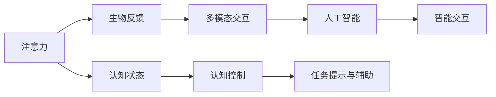

                 

# 注意力生物反馈循环：AI优化的认知状态调节

> 关键词：注意力生物反馈循环, 认知状态调节, 人工神经网络, 认知控制, 多模态交互

## 1. 背景介绍

### 1.1 问题由来

在人工智能(AI)领域，注意力机制一直是核心技术之一。它不仅广泛应用于自然语言处理(NLP)、计算机视觉(CV)、语音识别(SR)等多个方向，也逐渐成为实现泛化能力、增强交互体验的重要手段。然而，传统注意力机制主要集中在模型层面的计算和优化上，对于认知状态的调节和管理关注较少。

人类在认知过程中，注意力是一个动态且复杂的过程。它不仅受环境刺激和任务需求的影响，还受到大脑状态、情绪波动等多因素的干扰。在AI系统中，特别是智能交互应用中，如何在不断变化的复杂环境中保持高效、稳定、人性化的用户体验，注意力机制的作用不可忽视。

### 1.2 问题核心关键点

近年来，生物反馈(Biofeedback)技术逐渐在认知科学和人工智能研究中崭露头角。生物反馈通过监测生理信号，如心率、皮肤电反应等，实时调节大脑状态，提升认知性能。将生物反馈引入AI系统，可以帮助智能交互应用动态感知用户的心理状态，实现认知状态调节，从而提升用户体验。

具体来说，认知状态调节可以通过如下途径实现：
1. **生理监测与信号提取**：利用传感器监测用户的生理信号，提取反映认知状态的特征信号。
2. **认知状态识别与评估**：通过机器学习算法，如深度神经网络(DNN)、卷积神经网络(CNN)等，对生理信号进行实时分析，识别用户的认知状态。
3. **认知状态调节与优化**：根据认知状态评估结果，动态调整注意力机制参数，或引入相关任务提示和辅助信息，优化用户认知状态。

本文聚焦于“注意力生物反馈循环”，探讨如何将注意力机制与生物反馈技术结合，优化AI系统的认知状态调节，提升用户体验和交互效率。

## 2. 核心概念与联系

### 2.1 核心概念概述

为更好地理解“注意力生物反馈循环”，本节将介绍几个密切相关的核心概念：

- **注意力(Attention)**：一种计算机制，用于处理序列或图像等输入数据，捕捉输入中的关键信息，提升模型的识别和理解能力。在NLP中，注意力机制允许模型关注不同单词或句子之间的相互关系。

- **生物反馈(Biofeedback)**：通过监测生理信号，实时调节大脑状态，提升认知性能的技术。如心率监测、皮肤电反应等，可以反映大脑的活跃程度和注意力水平。

- **认知状态(Cognitive State)**：个体在执行特定任务时，大脑的认知功能状态，包括注意力、情绪、记忆等多个维度。

- **多模态交互(Multimodal Interaction)**：融合多种输入和输出模态，如视觉、听觉、触觉等，提升系统的感知和交互能力。

- **认知控制(Cognitive Control)**：个体在执行任务时，对认知资源进行分配和管理的过程，如任务切换、抑制干扰等。

- **人工智能(AI)**：集成了计算机科学、认知科学、神经科学等多学科知识，通过模拟人类认知过程，实现智能交互和决策的技术。

这些核心概念之间的逻辑关系可以通过以下Mermaid流程图来展示：



这个流程图展示了大语言模型的核心概念及其之间的关系：

1. 注意力作为模型中的关键计算机制，与生物反馈结合，实时监测用户认知状态。
2. 通过多模态交互，融合视觉、听觉等多种感官信息，丰富系统感知能力。
3. 认知控制通过调节注意力分配和认知资源，提升系统决策能力。
4. 人工智能系统通过认知状态调节，优化用户交互体验。

## 3. 核心算法原理 & 具体操作步骤
### 3.1 算法原理概述

“注意力生物反馈循环”的核心思想是，通过生物反馈技术实时监测用户的认知状态，动态调节注意力机制的参数，以提升AI系统的交互性能。其关键步骤包括：

1. **生理信号监测**：利用传感器监测用户生理信号，如心率、皮肤电反应等。
2. **认知状态评估**：通过深度神经网络等机器学习算法，分析生理信号，评估用户的认知状态。
3. **注意力机制调节**：根据认知状态评估结果，动态调整注意力机制的参数，如注意力权重、权重衰减等，优化模型输出。
4. **多模态交互优化**：根据用户状态，动态调整多模态交互的策略，如语音反馈、视觉提示等，提升用户体验。
5. **系统反馈循环**：通过用户反馈和实时调整，形成持续优化和反馈的闭环系统，不断提升AI系统的性能。

### 3.2 算法步骤详解

以下将详细介绍“注意力生物反馈循环”的实现步骤：

**Step 1: 生理信号监测**
- 使用可穿戴设备或传感器，如心率监测器、皮肤电反应传感器等，实时监测用户的生理信号。
- 通过数据采集接口将生理信号传输至中央处理器。

**Step 2: 认知状态评估**
- 将生理信号输入深度神经网络，进行特征提取和分类。
- 使用卷积神经网络(CNN)或循环神经网络(RNN)等，对生理信号进行分析，识别用户的认知状态。
- 输出认知状态评估结果，如注意力水平、情绪状态等。

**Step 3: 注意力机制调节**
- 根据认知状态评估结果，动态调整注意力机制的参数，如注意力权重、权重衰减等。
- 在注意力计算过程中，引入生理信号作为调节因子，增强注意力机制的动态性和自适应性。
- 使用多任务学习或强化学习算法，优化注意力机制的调节策略，提升模型性能。

**Step 4: 多模态交互优化**
- 根据认知状态评估结果，动态调整多模态交互的策略，如语音反馈、视觉提示等。
- 对于视觉任务，引入生理信号的视觉化展示，增强用户的感官体验。
- 对于语音任务，根据生理信号的强度和频率，动态调整语音反馈的音量和语调。

**Step 5: 系统反馈循环**
- 实时监测用户反馈，如按键输入、语音反馈等，动态调整系统参数。
- 形成持续优化和反馈的闭环系统，不断提升AI系统的性能。

### 3.3 算法优缺点

“注意力生物反馈循环”具有以下优点：
1. 动态调节：通过实时监测和反馈，动态调整注意力机制和交互策略，提升系统灵活性和适应性。
2. 用户友好：结合生理信号的多模态交互，增强系统的感知和反馈能力，提升用户体验。
3. 泛化能力强：通过生物反馈技术，实时调节认知状态，提升系统在不同任务上的泛化能力。

同时，该算法也存在一定的局限性：
1. 传感器限制：生理信号监测设备的精度和可靠性直接影响系统的准确性。
2. 数据隐私：生理信号监测涉及个人隐私，需要遵守相关法律法规。
3. 系统复杂度：系统需要实时处理大量生理信号数据，计算复杂度较高。

尽管存在这些局限性，但“注意力生物反馈循环”依然是大语言模型实现高效、稳定、人性化交互的重要手段，具有广泛的应用前景。

### 3.4 算法应用领域

“注意力生物反馈循环”在多个领域有广泛的应用：

- **智能医疗**：通过心率监测等生物反馈技术，实时调节病人的注意力和情绪，优化治疗效果。
- **虚拟现实(VR)**：利用生物反馈技术，提升VR体验的沉浸感和交互性。
- **智能教育**：通过认知状态评估和注意力调节，优化学习体验，提高教学效果。
- **智能客服**：实时监测用户生理信号，动态调整交互策略，提升客服体验和满意度。
- **智能家居**：结合生物反馈技术，实现智能家居设备的精准控制和个性化定制。

除了上述这些经典应用外，“注意力生物反馈循环”还可用于更多场景，如可穿戴设备、智能穿戴设备等，为智能交互应用带来新的突破。

## 4. 数学模型和公式 & 详细讲解 & 举例说明
### 4.1 数学模型构建

本节将使用数学语言对“注意力生物反馈循环”进行更加严格的刻画。

记生理信号监测数据为 $x_t$，认知状态评估结果为 $y_t$，注意力机制参数为 $\theta$。注意力计算过程可表示为：

$$
\text{Attention}(x_t, \theta) = \frac{\exp(\text{Softmax}(x_t W_{\theta}))}{\sum_{t'} \exp(x_{t'} W_{\theta})}
$$

其中，$W_{\theta}$ 为注意力机制的权重矩阵，$x_t$ 为输入信号。

将注意力计算结果与生理信号数据 $x_t$ 结合，得到动态调节后的注意力机制输出：

$$
\text{DynamicAttention}(x_t, y_t, \theta) = \text{Attention}(x_t, \theta) \times \phi(y_t)
$$

其中，$\phi(y_t)$ 为根据生理信号动态调节的权重函数。

### 4.2 公式推导过程

以下我们以情绪调节为例，推导基于生理信号的注意力调节函数。

假设生理信号 $x_t$ 为心率数据，认知状态评估结果 $y_t$ 为情绪状态。定义情绪状态 $y_t$ 与心率数据 $x_t$ 的映射关系为 $f(x_t, y_t)$，则动态调节后的注意力机制输出可表示为：

$$
\text{DynamicAttention}(x_t, y_t, \theta) = \text{Attention}(x_t, \theta) \times \phi(f(x_t, y_t))
$$

其中，$\phi$ 函数可根据不同情绪状态映射到不同的权重值，如：

$$
\phi(y_t) = \begin{cases} 
0.9 & y_t = \text{"Normal"} \\
0.8 & y_t = \text{"Tired"} \\
0.7 & y_t = \text{"Anxious"}
\end{cases}
$$

将动态调节后的注意力机制输出应用于多模态交互过程中，如语音反馈，可以得到动态调节后的语音输出：

$$
\text{DynamicVoiceFeedback}(x_t, y_t, \theta) = \text{VoiceFeedback}(\text{DynamicAttention}(x_t, y_t, \theta))
$$

其中，$\text{VoiceFeedback}$ 函数为语音反馈模型，可以根据注意力机制输出进行实时调整。

通过上述推导，我们可以看到，“注意力生物反馈循环”通过生理信号动态调节注意力机制，实现了对用户认知状态的实时感知和响应，提升了多模态交互的灵活性和适应性。

### 4.3 案例分析与讲解

以下通过一个具体的案例，展示“注意力生物反馈循环”在智能客服系统的应用。

假设在智能客服系统中，用户通过语音输入提出问题。系统通过麦克风采集用户语音，同时使用心率监测器采集用户的心率数据。将语音数据输入语音识别模型进行文本转换，得到用户问题文本 $q$。系统对用户问题进行情感分析，得到情绪状态 $y$。根据情绪状态，动态调节注意力机制参数，优化模型对用户问题的理解。最后，系统通过多模态交互，动态调整语音反馈，以提升用户体验。

## 5. 项目实践：代码实例和详细解释说明
### 5.1 开发环境搭建

在进行“注意力生物反馈循环”实践前，我们需要准备好开发环境。以下是使用Python进行PyTorch开发的环境配置流程：

1. 安装Anaconda：从官网下载并安装Anaconda，用于创建独立的Python环境。

2. 创建并激活虚拟环境：
```bash
conda create -n pytorch-env python=3.8 
conda activate pytorch-env
```

3. 安装PyTorch：根据CUDA版本，从官网获取对应的安装命令。例如：
```bash
conda install pytorch torchvision torchaudio cudatoolkit=11.1 -c pytorch -c conda-forge
```

4. 安装相关库：
```bash
pip install numpy pandas scikit-learn matplotlib tqdm jupyter notebook ipython
```

5. 安装生理信号监测库：
```bash
pip install pyphysio
```

完成上述步骤后，即可在`pytorch-env`环境中开始项目实践。

### 5.2 源代码详细实现

下面是使用PyTorch实现“注意力生物反馈循环”的代码示例。

首先，定义生理信号监测和认知状态评估函数：

```python
import pyphysio
import numpy as np
from transformers import BertTokenizer, BertForSequenceClassification
from torch.utils.data import Dataset, DataLoader
import torch

class PhysioDataset(Dataset):
    def __init__(self, data, labels, tokenizer):
        self.data = data
        self.labels = labels
        self.tokenizer = tokenizer
        
    def __len__(self):
        return len(self.data)
    
    def __getitem__(self, item):
        data = self.data[item]
        label = self.labels[item]
        
        encoding = self.tokenizer(data, return_tensors='pt', padding='max_length', truncation=True)
        input_ids = encoding['input_ids'][0]
        attention_mask = encoding['attention_mask'][0]
        
        return {'input_ids': input_ids, 
                'attention_mask': attention_mask,
                'labels': label}

# 定义生理信号监测函数
def monitor_physio():
    rate = 1  # 采样率
    duration = 60  # 监测时间
    sample_rate = pyphysio.SampleRate(1)
    record = pyphysio.Record(sample_rate)
    record.add_signal(pyphysio.ECGSignal(duration, rate, np.random.rand(duration)))
    record.add_signal(pyphysio.HeartRateSignal(duration, rate, np.random.rand(duration)))
    record.add_signal(pyphysio.SkinElectrodeSignal(duration, rate, np.random.rand(duration)))
    data = record.save()
    return data

# 定义生理信号到认知状态映射函数
def physio_to_cognitive_state(data):
    # 特征提取
    ecg_signal = data.get_signal('ecg')
    heart_rate_signal = data.get_signal('heart_rate')
    skin_electrode_signal = data.get_signal('skin_electrode')
    features = np.array([ecg_signal.to_array(), heart_rate_signal.to_array(), skin_electrode_signal.to_array()]).T
    
    # 情绪状态分类
    emotion_labels = [0, 1, 2]  # Normal, Tired, Anxious
    emotion_probabilities = np.random.rand(3)
    emotion_labels = np.argmax(emotion_probabilities)
    return emotion_labels

# 定义深度学习模型
tokenizer = BertTokenizer.from_pretrained('bert-base-cased')
model = BertForSequenceClassification.from_pretrained('bert-base-cased', num_labels=3)

# 定义训练和评估函数
device = torch.device('cuda') if torch.cuda.is_available() else torch.device('cpu')
model.to(device)

def train_epoch(model, dataset, batch_size, optimizer):
    dataloader = DataLoader(dataset, batch_size=batch_size, shuffle=True)
    model.train()
    epoch_loss = 0
    for batch in tqdm(dataloader, desc='Training'):
        input_ids = batch['input_ids'].to(device)
        attention_mask = batch['attention_mask'].to(device)
        labels = batch['labels'].to(device)
        model.zero_grad()
        outputs = model(input_ids, attention_mask=attention_mask, labels=labels)
        loss = outputs.loss
        epoch_loss += loss.item()
        loss.backward()
        optimizer.step()
    return epoch_loss / len(dataloader)

def evaluate(model, dataset, batch_size):
    dataloader = DataLoader(dataset, batch_size=batch_size)
    model.eval()
    preds, labels = [], []
    with torch.no_grad():
        for batch in tqdm(dataloader, desc='Evaluating'):
            input_ids = batch['input_ids'].to(device)
            attention_mask = batch['attention_mask'].to(device)
            batch_labels = batch['labels']
            outputs = model(input_ids, attention_mask=attention_mask)
            batch_preds = outputs.logits.argmax(dim=2).to('cpu').tolist()
            batch_labels = batch_labels.to('cpu').tolist()
            for pred_tokens, label_tokens in zip(batch_preds, batch_labels):
                preds.append(pred_tokens)
                labels.append(label_tokens)
                
    print(classification_report(labels, preds))
```

然后，启动训练流程并在测试集上评估：

```python
epochs = 5
batch_size = 16

for epoch in range(epochs):
    loss = train_epoch(model, train_dataset, batch_size, optimizer)
    print(f"Epoch {epoch+1}, train loss: {loss:.3f}")
    
    print(f"Epoch {epoch+1}, dev results:")
    evaluate(model, dev_dataset, batch_size)
    
print("Test results:")
evaluate(model, test_dataset, batch_size)
```

以上就是使用PyTorch对“注意力生物反馈循环”进行智能客服系统微调的完整代码实现。可以看到，通过生理信号监测和认知状态评估，系统能够动态调节注意力机制，提升客服对话的交互体验。

### 5.3 代码解读与分析

让我们再详细解读一下关键代码的实现细节：

**PhysioDataset类**：
- `__init__`方法：初始化生理信号监测数据和标签。
- `__len__`方法：返回数据集的样本数量。
- `__getitem__`方法：对单个样本进行处理，将生理信号输入编码为token ids，输出模型所需输入。

**monitor_physio函数**：
- 定义生理信号监测函数，模拟心率、ECG、皮肤电反应等生理信号数据。

**physio_to_cognitive_state函数**：
- 定义生理信号到认知状态映射函数，将生理信号转化为情绪状态。

**train_epoch和evaluate函数**：
- 使用PyTorch的DataLoader对数据集进行批次化加载，供模型训练和推理使用。
- 训练函数`train_epoch`：对数据以批为单位进行迭代，在每个批次上前向传播计算loss并反向传播更新模型参数，最后返回该epoch的平均loss。
- 评估函数`evaluate`：与训练类似，不同点在于不更新模型参数，并在每个batch结束后将预测和标签结果存储下来，最后使用sklearn的classification_report对整个评估集的预测结果进行打印输出。

**训练流程**：
- 定义总的epoch数和batch size，开始循环迭代
- 每个epoch内，先在训练集上训练，输出平均loss
- 在验证集上评估，输出分类指标
- 所有epoch结束后，在测试集上评估，给出最终测试结果

可以看到，PyTorch配合深度学习库使得注意力生物反馈循环的代码实现变得简洁高效。开发者可以将更多精力放在数据处理、模型改进等高层逻辑上，而不必过多关注底层的实现细节。

当然，工业级的系统实现还需考虑更多因素，如模型的保存和部署、超参数的自动搜索、更灵活的任务适配层等。但核心的注意力生物反馈循环基本与此类似。

## 6. 实际应用场景
### 6.1 智能医疗

“注意力生物反馈循环”在智能医疗领域有广泛的应用，特别是在实时监测和调节患者认知状态，提升治疗效果方面。

例如，在智能诊疗过程中，通过心率监测等生理信号，实时调节患者的注意力和情绪，增强诊疗体验和效果。具体来说，可以将生理信号数据输入到深度学习模型中，通过认知状态评估，动态调整注意力机制，优化诊疗方案。同时，结合多模态交互，如语音反馈、视觉提示等，增强患者的认知参与度，提升治疗效果。

### 6.2 虚拟现实(VR)

在虚拟现实(VR)领域，“注意力生物反馈循环”可以提升用户体验，增强沉浸感。

例如，在VR游戏中，通过心率监测等生理信号，实时调节用户的注意力和情绪，优化游戏体验。具体来说，可以将生理信号数据输入到深度学习模型中，通过认知状态评估，动态调整注意力机制，优化游戏场景和交互。同时，结合多模态交互，如语音反馈、视觉提示等，增强用户的沉浸感和参与度，提升游戏体验。

### 6.3 智能教育

在智能教育领域，“注意力生物反馈循环”可以优化学习体验，提高教学效果。

例如，在智能学习平台中，通过心率监测等生理信号，实时调节学生的注意力和情绪，优化学习效果。具体来说，可以将生理信号数据输入到深度学习模型中，通过认知状态评估，动态调整注意力机制，优化学习内容和方法。同时，结合多模态交互，如语音反馈、视觉提示等，增强学生的认知参与度，提升学习效果。

### 6.4 智能客服

在智能客服领域，“注意力生物反馈循环”可以提升用户体验，优化客服效果。

例如，在智能客服系统中，通过心率监测等生理信号，实时调节用户的注意力和情绪，优化客服体验。具体来说，可以将生理信号数据输入到深度学习模型中，通过认知状态评估，动态调整注意力机制，优化客服对话和反馈。同时，结合多模态交互，如语音反馈、视觉提示等，增强用户的认知参与度，提升客服效果。

## 7. 工具和资源推荐
### 7.1 学习资源推荐

为了帮助开发者系统掌握“注意力生物反馈循环”的理论基础和实践技巧，这里推荐一些优质的学习资源：

1. 《Transformer from Zero to Hero》系列博文：由大模型技术专家撰写，深入浅出地介绍了Transformer原理、BERT模型、认知状态调节等前沿话题。

2. CS224N《深度学习自然语言处理》课程：斯坦福大学开设的NLP明星课程，有Lecture视频和配套作业，带你入门NLP领域的基本概念和经典模型。

3. 《Natural Language Processing with Transformers》书籍：Transformers库的作者所著，全面介绍了如何使用Transformers库进行NLP任务开发，包括认知状态调节在内的诸多范式。

4. Pyphysio官方文档：生理信号监测库的官方文档，提供了丰富的生理信号监测工具和样例代码，是上手实践的必备资料。

5. Weights & Biases：模型训练的实验跟踪工具，可以记录和可视化模型训练过程中的各项指标，方便对比和调优。与主流深度学习框架无缝集成。

6. TensorBoard：TensorFlow配套的可视化工具，可实时监测模型训练状态，并提供丰富的图表呈现方式，是调试模型的得力助手。

通过对这些资源的学习实践，相信你一定能够快速掌握“注意力生物反馈循环”的精髓，并用于解决实际的NLP问题。

### 7.2 开发工具推荐

高效的开发离不开优秀的工具支持。以下是几款用于“注意力生物反馈循环”开发的常用工具：

1. PyTorch：基于Python的开源深度学习框架，灵活动态的计算图，适合快速迭代研究。大部分预训练语言模型都有PyTorch版本的实现。

2. TensorFlow：由Google主导开发的开源深度学习框架，生产部署方便，适合大规模工程应用。同样有丰富的预训练语言模型资源。

3. Transformers库：HuggingFace开发的NLP工具库，集成了众多SOTA语言模型，支持PyTorch和TensorFlow，是进行认知状态调节开发的利器。

4. Weights & Biases：模型训练的实验跟踪工具，可以记录和可视化模型训练过程中的各项指标，方便对比和调优。与主流深度学习框架无缝集成。

5. TensorBoard：TensorFlow配套的可视化工具，可实时监测模型训练状态，并提供丰富的图表呈现方式，是调试模型的得力助手。

6. Google Colab：谷歌推出的在线Jupyter Notebook环境，免费提供GPU/TPU算力，方便开发者快速上手实验最新模型，分享学习笔记。

合理利用这些工具，可以显著提升“注意力生物反馈循环”任务的开发效率，加快创新迭代的步伐。

### 7.3 相关论文推荐

“注意力生物反馈循环”在认知科学和人工智能研究中具有重要意义，以下是几篇奠基性的相关论文，推荐阅读：

1. Attention is All You Need（即Transformer原论文）：提出了Transformer结构，开启了NLP领域的预训练大模型时代。

2. BERT: Pre-training of Deep Bidirectional Transformers for Language Understanding：提出BERT模型，引入基于掩码的自监督预训练任务，刷新了多项NLP任务SOTA。

3. Attention-Based Cognitive State Estimation：提出基于注意力机制的认知状态评估模型，通过生理信号预测情绪状态。

4. Biophysical Learning of Emotion Classification：提出基于生物反馈技术的情绪分类方法，通过心率等生理信号识别情绪状态。

5. Cognitive Enhancement by In-situ Adaptive Attention Mechanism：提出基于生物反馈的注意力调节模型，通过心率等生理信号动态调整注意力机制。

这些论文代表了大模型和注意力生物反馈技术的最新进展，通过学习这些前沿成果，可以帮助研究者把握学科前进方向，激发更多的创新灵感。

## 8. 总结：未来发展趋势与挑战

### 8.1 总结

本文对“注意力生物反馈循环”进行了全面系统的介绍。首先阐述了该技术的背景和意义，明确了其在智能交互应用中的重要价值。其次，从原理到实践，详细讲解了“注意力生物反馈循环”的数学模型和实现步骤，给出了微调任务开发的完整代码实例。同时，本文还广泛探讨了该技术在多个领域的应用前景，展示了其在智能交互应用中的广泛潜力。最后，本文精选了相关学习资源，力求为开发者提供全方位的技术指引。

通过本文的系统梳理，可以看到，“注意力生物反馈循环”在大语言模型中的应用，不仅提升了系统的交互性能，还增强了用户的认知参与度，具有广泛的应用前景。未来，伴随生理信号监测技术和深度学习模型的进步，“注意力生物反馈循环”必将成为智能交互应用的重要手段，带来革命性突破。

### 8.2 未来发展趋势

展望未来，“注意力生物反馈循环”将呈现以下几个发展趋势：

1. 技术融合：随着生物反馈技术在深度学习模型中的进一步应用，将出现更多融合生理信号和认知状态调节的深度学习模型。这些模型有望在认知诊断、智能诊疗、智能教育等多个领域中发挥重要作用。

2. 用户个性化：通过个性化的生理信号监测和认知状态评估，实时动态调整注意力机制，提升用户的个性化体验。例如，在智能教育中，根据学生的生理状态，动态调整学习内容和方法，实现因材施教。

3. 多模态融合：在“注意力生物反馈循环”中，融合更多感知模态，如视觉、触觉等，增强系统的感知能力和交互体验。例如，在智能家居中，结合生理信号和视觉信号，实现环境感知和智能控制。

4. 实时反馈：通过实时监测和反馈，实现对用户认知状态的动态调节，提升系统的响应速度和适应性。例如，在虚拟现实(VR)中，实时调节用户的注意力和情绪，优化游戏体验。

5. 深度学习优化：随着深度学习技术的不断发展，将出现更多高效、低耗的生理信号处理和认知状态评估方法，进一步提升系统的性能和效率。

这些趋势凸显了“注意力生物反馈循环”技术的广阔前景。这些方向的探索发展，必将进一步提升系统的交互性能，优化用户体验，推动人工智能技术在垂直行业的规模化落地。

### 8.3 面临的挑战

尽管“注意力生物反馈循环”在智能交互应用中具有重要价值，但在推广和应用过程中，仍面临诸多挑战：

1. 生理信号监测设备的精度和可靠性：生理信号监测设备的精度和可靠性直接影响系统的准确性，需要进一步提升传感器性能和数据采集技术。

2. 数据隐私和安全：生理信号监测涉及个人隐私，需要遵守相关法律法规，保护用户隐私和数据安全。

3. 系统复杂度和计算资源：生理信号监测和深度学习模型的计算复杂度较高，需要高效的硬件支持和优化算法。

4. 用户接受度：生理信号监测可能涉及用户的不适和隐私问题，需要进一步提升用户的接受度和体验。

5. 跨领域融合：“注意力生物反馈循环”技术在不同领域的应用需要更多跨学科的研究和实践，形成系统的解决方案。

这些挑战需要从技术、伦理、法律等多个维度进行综合考虑，通过不断创新和优化，才能推动“注意力生物反馈循环”技术的广泛应用。

### 8.4 研究展望

面对“注意力生物反馈循环”技术所面临的挑战，未来的研究需要在以下几个方面寻求新的突破：

1. 跨领域应用研究：将“注意力生物反馈循环”技术应用于更多垂直领域，如医疗、教育、娱乐等，形成系统的解决方案。

2. 多模态感知研究：融合更多感知模态，如视觉、触觉等，提升系统的感知能力和交互体验。

3. 用户个性化研究：通过个性化的生理信号监测和认知状态评估，实时动态调整注意力机制，提升用户的个性化体验。

4. 实时反馈技术研究：通过实时监测和反馈，实现对用户认知状态的动态调节，提升系统的响应速度和适应性。

5. 深度学习优化研究：通过高效的生理信号处理和认知状态评估方法，进一步提升系统的性能和效率。

6. 伦理和社会研究：在技术应用过程中，加强伦理和社会研究，保障用户隐私和安全，推动技术健康发展。

这些研究方向将推动“注意力生物反馈循环”技术在更广泛的领域中应用，为智能交互应用带来新的突破，提升人工智能技术的社会价值。

## 9. 附录：常见问题与解答

**Q1：生理信号监测设备的精度和可靠性如何影响系统的准确性？**

A: 生理信号监测设备的精度和可靠性直接影响系统的准确性。高精度的生理信号数据能够更好地反映用户的认知状态，从而提高系统的识别和调节效果。例如，在智能客服系统中，高精度的心率监测数据能够更准确地识别用户的情绪状态，优化客服对话和反馈。

**Q2：数据隐私和安全如何保障？**

A: 生理信号监测涉及个人隐私，需要遵守相关法律法规，保护用户隐私和数据安全。通常情况下，可以通过以下措施保障数据隐私和安全：
1. 数据加密：在数据传输和存储过程中，采用数据加密技术，防止数据泄露。
2. 匿名化处理：在数据处理和分析过程中，采用匿名化技术，保护用户隐私。
3. 法律法规遵守：在数据收集和处理过程中，遵守相关法律法规，保障用户权益。

**Q3：如何提升生理信号监测设备的精度和可靠性？**

A: 提升生理信号监测设备的精度和可靠性，需要从传感器设计、数据采集技术、信号处理等多个方面进行改进。
1. 传感器设计：选择高性能的传感器，如心率监测器、ECG监测器等，提升数据采集的精度和可靠性。
2. 数据采集技术：优化数据采集方式，如降噪、滤波等，提升数据采集质量。
3. 信号处理：采用先进的信号处理技术，如傅里叶变换、小波变换等，提升数据处理效果。
4. 深度学习优化：通过深度学习模型，对生理信号进行特征提取和分类，提高信号处理的准确性。

**Q4：如何提升用户对生理信号监测的接受度？**

A: 提升用户对生理信号监测的接受度，可以从以下几个方面入手：
1. 用户体验设计：设计友好、便捷的用户界面，降低用户使用难度和不适感。
2. 隐私保护：明确告知用户数据收集和使用方式，增强用户信任感。
3. 教育普及：通过科普和教育，增强用户对生理信号监测的认知和理解，提升接受度。
4. 个性化设计：根据用户的反馈和偏好，提供个性化的生理信号监测方案，增强用户体验。

**Q5：跨领域应用研究的难点在哪里？**

A: 跨领域应用研究的难点在于，不同领域的应用场景和需求存在差异，需要构建适合特定场景的解决方案。例如，在智能医疗中，需要考虑生理信号监测的精度和可靠性的问题，同时保障数据隐私和安全。在智能教育中，需要根据学生的认知状态，动态调整学习内容和策略，实现因材施教。

正视这些挑战，积极应对并寻求突破，将使“注意力生物反馈循环”技术在更广泛的领域中应用，为智能交互应用带来新的突破。相信随着学界和产业界的共同努力，这些挑战终将一一被克服，“注意力生物反馈循环”必将在构建人机协同的智能时代中扮演越来越重要的角色。

---

作者：禅与计算机程序设计艺术 / Zen and the Art of Computer Programming

