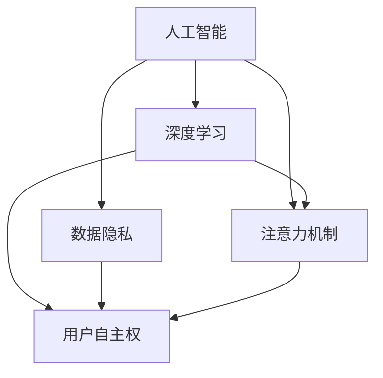

                 

# 注意力的自主权：AI时代的个人选择

## 1. 背景介绍

在人工智能(AI)日益渗透到我们生活的方方面面时，人们对于自主权的问题变得更加突显。特别是随着深度学习和大数据技术的发展，AI系统变得越来越智能，同时对个人数据和注意力的依赖也日益增强。如何在AI时代更好地掌控自己的注意力和隐私，成为现代人和企业都必须面对的重大挑战。

本文旨在探讨AI时代注意力的自主权问题，通过分析当前AI系统中对个人注意力的影响，提出相关的解决方案和策略，帮助个人和企业更好地应对这一挑战。

## 2. 核心概念与联系

### 2.1 核心概念概述

为了深入理解AI时代注意力的自主权问题，首先需要明确以下几个核心概念：

- **人工智能**：利用算法和大数据技术，使机器能够模仿人类的思维和行为。
- **深度学习**：一种基于神经网络技术的机器学习方法，通过大量数据训练模型，使其具备学习能力。
- **数据隐私**：个人和企业在使用AI系统时，保护个人信息不被未经授权的第三方获取和使用。
- **注意力机制**：AI系统在处理信息时，集中精力于最相关、最有价值的部分，忽略次要或不相关的信息。
- **用户自主权**：用户在使用AI系统时，能够自主决定哪些信息可以被收集和处理，以及如何被使用。

这些概念之间相互关联，共同构成了AI时代注意力的自主权问题的核心。

### 2.2 核心概念原理和架构的 Mermaid 流程图



这个流程图展示了人工智能、深度学习、数据隐私、注意力机制和用户自主权之间的关系。深度学习作为AI的核心技术，依赖于大量数据进行训练，而数据隐私是使用AI系统时必须考虑的问题。注意力机制帮助AI系统有效处理信息，而用户自主权则体现了个人和企业在使用AI系统时的选择权。

## 3. 核心算法原理 & 具体操作步骤

### 3.1 算法原理概述

AI系统的注意力机制是其处理信息的核心，通过集中精力于最相关的信息，忽略次要信息，从而提升系统的性能。然而，这也意味着AI系统在处理信息时，可能会对个人的注意力产生影响。

在深度学习中，注意力机制通常通过Softmax函数来实现，该函数根据输入数据的权重，决定哪些信息被选中，哪些被忽略。这种机制在自然语言处理、计算机视觉等领域广泛应用。

### 3.2 算法步骤详解

1. **数据预处理**：
   - 收集和处理相关的数据集。
   - 清洗数据，移除不相关或重复的信息。

2. **模型训练**：
   - 使用深度学习框架（如TensorFlow、PyTorch等）训练模型。
   - 根据注意力机制调整模型，使其能够有效处理信息。

3. **模型评估**：
   - 使用测试集评估模型的性能。
   - 根据评估结果调整模型参数，优化模型效果。

4. **实际应用**：
   - 将训练好的模型部署到实际应用中。
   - 监测模型的运行效果，根据实际反馈调整模型。

### 3.3 算法优缺点

注意力机制的优点包括：
- 提高系统处理信息的效率。
- 减少无关信息的干扰。

缺点包括：
- 对于复杂数据集，可能无法有效处理所有相关信息。
- 注意力机制的决策过程缺乏透明性，难以解释和调试。

### 3.4 算法应用领域

注意力机制在自然语言处理、计算机视觉、语音识别等多个领域有广泛应用，如机器翻译、图像分类、情感分析等。

## 4. 数学模型和公式 & 详细讲解 & 举例说明

### 4.1 数学模型构建

注意力机制的核心数学模型可以表示为：

$$
\text{Attention}(Q, K, V) = \frac{\exp(\text{softmax}(QK^T))}{\sum_j \exp(QK_j^T)}
$$

其中，$Q$ 表示查询向量，$K$ 表示键向量，$V$ 表示值向量。$\text{softmax}(QK^T)$ 表示注意力权重，用于选择最相关的值向量。

### 4.2 公式推导过程

注意力机制的推导过程如下：
1. 计算注意力权重：
   $$
   \alpha = \exp(QK^T)
   $$
2. 归一化权重：
   $$
   \alpha' = \frac{\alpha}{\sum_j \alpha}
   $$
3. 计算加权值向量：
   $$
   \text{Attention}(Q, K, V) = \sum_{j} \alpha'_j V_j
   $$

### 4.3 案例分析与讲解

以机器翻译为例，注意力机制可以帮助模型在翻译时更好地关注源语言和目标语言之间的对应关系。在训练过程中，模型会根据源语言句子中的单词，逐步关注到最相关的目标语言单词，并生成对应的翻译结果。

## 5. 项目实践：代码实例和详细解释说明

### 5.1 开发环境搭建

为了实现注意力机制的深度学习模型，需要搭建相应的开发环境。具体步骤如下：

1. 安装Python及其相关依赖，如TensorFlow、Keras等。
2. 配置好GPU环境，以便进行高效的模型训练。
3. 准备训练数据集，清洗并预处理数据。

### 5.2 源代码详细实现

以下是使用TensorFlow实现注意力机制的代码示例：

```python
import tensorflow as tf

# 定义模型
model = tf.keras.Sequential([
    tf.keras.layers.Embedding(input_dim=vocab_size, output_dim=embedding_dim),
    tf.keras.layers.Bidirectional(tf.keras.layers.LSTM(128)),
    tf.keras.layers.Dense(64, activation='relu'),
    tf.keras.layers.Dense(1, activation='sigmoid')
])

# 编译模型
model.compile(optimizer='adam', loss='binary_crossentropy', metrics=['accuracy'])

# 训练模型
model.fit(train_data, train_labels, epochs=10, validation_data=(val_data, val_labels))
```

### 5.3 代码解读与分析

- `tf.keras.Sequential` 用于构建序列模型，可以包含多个神经网络层。
- `tf.keras.layers.Embedding` 用于将输入的词汇向量嵌入到低维空间。
- `tf.keras.layers.Bidirectional` 用于处理双向LSTM，增强模型对输入序列的理解能力。
- `tf.keras.layers.Dense` 用于构建全连接层。
- `tf.keras.layers.Dense` 用于构建输出层，使用 sigmoid 函数进行二分类。
- `model.compile` 用于编译模型，指定优化器、损失函数和评估指标。
- `model.fit` 用于训练模型，指定训练数据、标签、训练轮数和验证数据。

### 5.4 运行结果展示

训练完成后，可以评估模型在验证集上的表现，并绘制损失和准确率的变化曲线：

```python
import matplotlib.pyplot as plt

plt.plot(history.history['loss'])
plt.plot(history.history['val_loss'])
plt.title('Model loss')
plt.xlabel('Epoch')
plt.ylabel('Loss')
plt.legend(['Train', 'Validation'], loc='upper left')
plt.show()

plt.plot(history.history['accuracy'])
plt.plot(history.history['val_accuracy'])
plt.title('Model accuracy')
plt.xlabel('Epoch')
plt.ylabel('Accuracy')
plt.legend(['Train', 'Validation'], loc='upper left')
plt.show()
```

## 6. 实际应用场景

### 6.1 广告推荐系统

在广告推荐系统中，注意力机制可以帮助模型更好地理解用户行为和偏好，从而推荐更加精准的广告内容。例如，在展示广告时，可以根据用户的历史浏览记录，选择最相关的广告进行展示。

### 6.2 医疗诊断系统

在医疗诊断系统中，注意力机制可以帮助模型更好地分析病人的症状和历史记录，从而做出更准确的诊断。例如，在处理病人的CT图像时，模型可以关注最相关的区域，提取最重要的特征进行诊断。

### 6.3 智能客服系统

在智能客服系统中，注意力机制可以帮助模型更好地理解客户的问题和上下文，从而提供更加精准的回答。例如，在处理客户的咨询时，模型可以根据前一回合的对话内容，选择最相关的回答进行回复。

### 6.4 未来应用展望

随着AI技术的不断发展，注意力机制将在更多领域得到应用，如自动驾驶、智能制造、智慧城市等。通过合理利用注意力机制，可以提升系统的性能和智能化水平，为用户提供更好的体验。

## 7. 工具和资源推荐

### 7.1 学习资源推荐

为了帮助开发者深入理解注意力机制，以下是一些优质的学习资源：

1. 《深度学习》（Ian Goodfellow）：全面介绍了深度学习的理论和实践，包括注意力机制的应用。
2. 《自然语言处理综述》（Richard Socher）：介绍了自然语言处理中的注意力机制，并提供了大量的案例分析。
3. TensorFlow官方文档：提供了详细的注意力机制实现方法和示例代码，适合初学者学习。
4. PyTorch官方文档：提供了丰富的深度学习模型和注意力机制的实现示例，适合进阶学习。
5. Coursera《深度学习专项课程》：由深度学习领域的专家讲授，涵盖了注意力机制等前沿话题。

### 7.2 开发工具推荐

以下是一些用于实现注意力机制的开发工具：

1. TensorFlow：谷歌开源的深度学习框架，支持多种注意力机制的实现。
2. PyTorch：Facebook开源的深度学习框架，提供了丰富的深度学习库和注意力机制的实现。
3. Keras：一个高层次的深度学习库，提供了简单易用的API，适合快速原型开发。
4. MXNet：一个高效的深度学习框架，支持分布式计算，适合大规模模型训练。

### 7.3 相关论文推荐

以下是一些关于注意力机制的经典论文：

1. "Attention is All You Need"（Vaswani et al.）：提出了Transformer模型，采用自注意力机制，提升了自然语言处理任务的效果。
2. "LSTM: A Search Space Odyssey"（Hochreiter et al.）：介绍了LSTM模型的实现原理，包括注意力机制的实现。
3. "Soft Attention Mechanism"（Bahdanau et al.）：介绍了注意力机制在机器翻译中的应用，并提出了基于注意力机制的序列到序列模型。
4. "Differentiable Attention Mechanisms for NeurIPS 2018"（Pearson et al.）：介绍了不同类型的注意力机制，包括自注意力、多头注意力等。

## 8. 总结：未来发展趋势与挑战

### 8.1 研究成果总结

本文对注意力机制的原理、实现方法和应用场景进行了详细介绍，并列举了一些相关的学习资源和开发工具。通过深入分析注意力机制的影响和解决方案，有助于更好地应对AI时代注意力的自主权问题。

### 8.2 未来发展趋势

未来，随着AI技术的进一步发展，注意力机制将在更多领域得到应用，如医疗、金融、教育等。同时，研究人员还将探索更多高效、灵活的注意力机制实现方法，提升系统的性能和智能化水平。

### 8.3 面临的挑战

尽管注意力机制在许多领域中已经取得了显著成果，但仍面临以下挑战：

1. 数据隐私问题：在处理大量用户数据时，如何保护用户的隐私，避免数据泄露。
2. 模型可解释性：注意力机制的决策过程缺乏透明性，难以解释和调试。
3. 计算资源消耗：注意力机制在大规模数据集上的计算资源消耗较大，如何优化模型结构，提高计算效率。

### 8.4 研究展望

未来的研究应从以下几个方向展开：

1. 数据隐私保护：采用差分隐私等技术，保护用户隐私，避免数据泄露。
2. 模型可解释性：引入可解释性框架，提高注意力机制的决策过程的透明性。
3. 计算资源优化：采用分布式计算、模型剪枝等技术，优化注意力机制的计算资源消耗。

## 9. 附录：常见问题与解答

**Q1: 注意力机制是如何影响个人注意力的？**

A: 注意力机制通过集中精力于最相关的信息，忽略次要或不相关的信息，从而影响个人对信息的处理和认知。例如，在浏览社交媒体时，系统会根据用户的历史行为推荐相关的信息，可能会影响用户对其他信息的关注。

**Q2: 如何保护用户的隐私数据？**

A: 可以采用差分隐私等技术，通过对数据进行扰动和加密，保护用户的隐私，同时确保模型性能不受影响。

**Q3: 注意力机制的决策过程是否透明？**

A: 注意力机制的决策过程相对复杂，缺乏透明性。研究人员正在探索可解释性框架，通过可视化、调试等手段，提高模型的可解释性。

**Q4: 注意力机制的计算资源消耗是否过大？**

A: 在大规模数据集上，注意力机制的计算资源消耗较大。可以通过优化模型结构、采用分布式计算等方法，降低计算资源消耗。

**Q5: 如何评估注意力机制的效果？**

A: 可以通过多种评估指标来衡量注意力机制的效果，如准确率、召回率、F1分数等。同时，可以结合实际应用场景，进行人工评估和用户反馈。

---

作者：禅与计算机程序设计艺术 / Zen and the Art of Computer Programming

