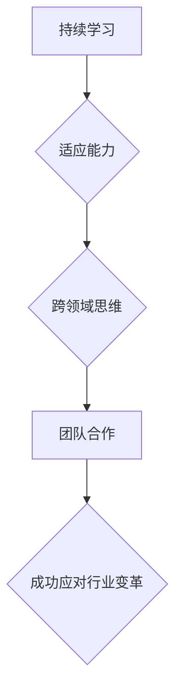

                 

## 程序员如何应对行业变革与转型

> 关键词：行业变革、转型、程序员、技术栈、学习能力、适应能力、未来趋势、职业发展

## 1. 背景介绍

科技发展日新月异，软件行业更是变化无常。新技术、新平台、新模式层出不穷，对程序员的技能要求也随之不断提升。面对如此激烈的行业变革，程序员需要具备敏锐的洞察力、强大的学习能力和灵活的适应能力，才能在竞争激烈的市场中立于不败之地。

### 1.1  行业变革的趋势

近年来，人工智能、云计算、大数据、区块链等新兴技术蓬勃发展，深刻地改变了软件开发的模式和方向。

* **人工智能 (AI):** AI 技术的应用正在各个领域加速，从自然语言处理、计算机视觉到机器学习，AI 正在改变着软件开发的流程和方式。程序员需要学习 AI 相关的知识和技能，例如机器学习算法、深度学习框架等，才能参与到 AI 驱动的软件开发中。
* **云计算:** 云计算平台的普及使得软件开发更加灵活、高效和可扩展。程序员需要掌握云计算平台的特性和服务，例如 AWS、Azure、GCP 等，才能开发和部署云原生应用。
* **大数据:** 大数据的产生和应用日益广泛，程序员需要学习大数据处理技术，例如 Hadoop、Spark 等，才能有效地分析和处理海量数据。
* **区块链:** 区块链技术为去中心化、安全和透明的应用提供了新的可能性。程序员需要了解区块链的原理和应用场景，例如加密货币、智能合约等，才能参与到区块链领域的开发。

### 1.2  程序员面临的挑战

行业变革带来的挑战也十分明显：

* **技术栈的快速迭代:** 新技术不断涌现，旧技术逐渐被淘汰，程序员需要不断学习新的技术和工具，才能保持竞争力。
* **技能的快速贬值:** 随着技术的进步，一些传统的编程技能可能会变得过时，程序员需要不断提升自己的技能，才能适应新的发展趋势。
* **竞争的加剧:** 随着行业变革，越来越多的程序员涌入软件开发领域，竞争更加激烈。程序员需要不断提升自己的能力，才能脱颖而出。

## 2. 核心概念与联系

面对行业变革，程序员需要具备以下核心概念和联系：

* **持续学习:**  程序员需要保持终身学习的意识，不断学习新的技术和知识，才能跟上行业的发展步伐。
* **适应能力:**  程序员需要具备灵活的适应能力，能够快速适应新的技术和工作环境。
* **跨领域思维:**  程序员需要具备跨领域的思维能力，能够将不同领域的知识和经验结合起来，解决复杂的问题。
* **团队合作:**  软件开发是一个团队协作的过程，程序员需要具备良好的团队合作能力，才能高效地完成项目。

**Mermaid 流程图:**



## 3. 核心算法原理 & 具体操作步骤

### 3.1  算法原理概述

面对快速变化的技术环境，程序员需要掌握一些核心算法原理，例如：

* **数据结构:**  掌握不同的数据结构，例如数组、链表、树、图等，能够提高代码的效率和可读性。
* **算法设计:**  了解常见的算法设计方法，例如分治法、动态规划等，能够解决复杂的问题。
* **复杂度分析:**  能够分析算法的时间复杂度和空间复杂度，选择最优的算法方案。

### 3.2  算法步骤详解

例如，学习排序算法，可以从以下步骤开始：

1. 了解常见的排序算法，例如冒泡排序、插入排序、快速排序、归并排序等。
2. 分析每个算法的原理和步骤，理解其时间复杂度和空间复杂度。
3. 选择合适的排序算法，根据实际应用场景和数据规模进行选择。
4. 编写代码实现排序算法，并进行测试和调试。

### 3.3  算法优缺点

每个算法都有其优缺点，程序员需要根据实际情况选择合适的算法。例如，冒泡排序简单易实现，但时间复杂度较高；快速排序效率较高，但可能存在最坏情况下的时间复杂度问题。

### 3.4  算法应用领域

算法广泛应用于各个领域，例如：

* **搜索引擎:**  使用排序算法和数据结构来提高搜索结果的准确性和效率。
* **推荐系统:**  使用机器学习算法和数据挖掘技术来推荐用户感兴趣的内容。
* **图像处理:**  使用图像处理算法和数据结构来识别、分类和处理图像。

## 4. 数学模型和公式 & 详细讲解 & 举例说明

### 4.1  数学模型构建

在软件开发中，数学模型可以用来描述系统行为、分析算法复杂度、优化代码性能等。例如，可以使用线性回归模型来预测用户行为，使用二叉树模型来实现数据结构，使用概率论来分析算法的正确性。

### 4.2  公式推导过程

例如，计算算法的时间复杂度，可以使用大 O 符号来表示。

$$T(n) = O(n^2)$$

这个公式表示算法的时间复杂度为 n^2，即随着输入数据规模 n 的增加，算法执行时间呈二次增长。

### 4.3  案例分析与讲解

例如，使用二分查找算法查找数据，其时间复杂度为 O(log n)。

假设数据集合大小为 n，二分查找算法每次将搜索范围缩小一半，因此需要 log n 次比较才能找到目标数据。

## 5. 项目实践：代码实例和详细解释说明

### 5.1  开发环境搭建

程序员需要根据项目需求选择合适的开发环境，例如：

* **操作系统:**  Windows、Linux、macOS 等。
* **编程语言:**  Java、Python、C++ 等。
* **开发工具:**  IDE、文本编辑器、版本控制系统等。

### 5.2  源代码详细实现

例如，使用 Python 实现一个简单的排序算法：

```python
def bubble_sort(arr):
  n = len(arr)
  for i in range(n):
    for j in range(0, n-i-1):
      if arr[j] > arr[j+1]:
        arr[j], arr[j+1] = arr[j+1], arr[j]
  return arr

# 测试代码
arr = [64, 34, 25, 12, 22, 11, 90]
sorted_arr = bubble_sort(arr)
print("排序后的数组:", sorted_arr)
```

### 5.3  代码解读与分析

这段代码实现了冒泡排序算法。

* 外循环 `for i in range(n)` 控制排序的轮数。
* 内循环 `for j in range(0, n-i-1)` 比较相邻元素，并将较大的元素向后移动。
* `if arr[j] > arr[j+1]` 判断两个元素的大小关系。
* `arr[j], arr[j+1] = arr[j+1], arr[j]` 交换两个元素的位置。

### 5.4  运行结果展示

运行这段代码，输出结果为：

```
排序后的数组: [11, 12, 22, 25, 34, 64, 90]
```

## 6. 实际应用场景

### 6.1  人工智能

* **自然语言处理:**  程序员可以使用 AI 算法来开发聊天机器人、机器翻译、文本摘要等应用。
* **计算机视觉:**  程序员可以使用 AI 算法来开发图像识别、物体检测、人脸识别等应用。

### 6.2  云计算

* **微服务架构:**  程序员可以使用云计算平台来部署和管理微服务，提高应用的可靠性和可扩展性。
* **容器化技术:**  程序员可以使用容器技术来打包和部署应用程序，简化开发和运维流程。

### 6.3  大数据

* **数据分析:**  程序员可以使用大数据处理技术来分析海量数据，发现隐藏的模式和趋势。
* **数据可视化:**  程序员可以使用数据可视化工具来展示数据分析结果，帮助用户更好地理解数据。

### 6.4  未来应用展望

随着技术的不断发展，程序员将面临更多新的挑战和机遇。例如：

* **量子计算:**  量子计算技术将颠覆传统的计算模式，为程序员提供新的开发思路和可能性。
* **边缘计算:**  边缘计算将将计算能力部署到靠近数据源的位置，降低数据传输延迟，提高应用的实时性。
* **区块链技术:**  区块链技术将为程序员提供新的开发平台和应用场景，例如去中心化应用、数字资产管理等。

## 7. 工具和资源推荐

### 7.1  学习资源推荐

* **在线课程:**  Coursera、edX、Udemy 等平台提供丰富的编程和软件开发课程。
* **书籍:**  《程序员的自我修养》、《代码大全》、《设计模式》等经典书籍可以帮助程序员提升技能。
* **博客和论坛:**  Stack Overflow、GitHub 等平台可以帮助程序员获取技术支持和交流经验。

### 7.2  开发工具推荐

* **IDE:**  IntelliJ IDEA、Eclipse、Visual Studio Code 等 IDE 提供强大的代码编辑、调试和测试功能。
* **版本控制系统:**  Git 是目前最流行的版本控制系统，可以帮助程序员管理代码版本和协同开发。
* **云平台:**  AWS、Azure、GCP 等云平台提供丰富的云计算服务，例如计算、存储、数据库等。

### 7.3  相关论文推荐

* **论文数据库:**  arXiv、IEEE Xplore、ACM Digital Library 等数据库提供大量的计算机科学论文。
* **学术会议:**  NeurIPS、ICML、SIGGRAPH 等学术会议发布最新的研究成果。

## 8. 总结：未来发展趋势与挑战

### 8.1  研究成果总结

近年来，人工智能、云计算、大数据等新兴技术取得了长足的进步，为程序员提供了新的发展机遇。程序员需要不断学习新的技术和知识，才能适应行业的变化。

### 8.2  未来发展趋势

未来，软件开发将更加注重以下趋势：

* **自动化:**  自动化测试、自动化部署等技术将进一步提高开发效率。
* **敏捷开发:**  敏捷开发方法将更加普及，提高软件开发的灵活性和响应能力。
* **云原生开发:**  云原生开发模式将成为主流，程序员需要掌握云计算平台和容器化技术。

### 8.3  面临的挑战

程序员将面临以下挑战：

* **技术迭代速度快:**  程序员需要不断学习新的技术，才能保持竞争力。
* **人才短缺:**  软件开发人才需求量大，但供给不足，程序员需要不断提升自己的技能和价值。
* **职业发展路径不清晰:**  随着技术的不断发展，程序员的职业发展路径变得更加多元化，程序员需要明确自己的职业目标和发展方向。

### 8.4  研究展望

未来，程序员需要更加注重以下方面的研究：

* **人工智能算法的优化:**  提高人工智能算法的效率和准确性。
* **云原生开发技术的创新:**  开发更加高效、可靠和可扩展的云原生应用。
* **软件开发流程的优化:**  提高软件开发的效率和质量。

## 9. 附录：常见问题与解答

### 9.1  如何应对技术迭代速度快？

* **保持终身学习:**  养成持续学习的习惯，关注行业动态，学习新的技术和工具。
* **关注核心技术:**  掌握一些核心技术，例如数据结构、算法设计、软件架构等，这些技术可以应用于不同的领域和技术栈。
* **积累实践经验:**  通过参与实际项目，积累实践经验，提升解决问题的能力。

### 9.2  如何提升自己的竞争力？

* **精通一门编程语言:**  选择一门主流的编程语言，精通其语法、特性和最佳实践。
* **掌握多个技术栈:**  学习不同的技术栈，例如前端开发、后端开发、移动开发等，提高自己的职业选择范围。
* **提升软技能:**  例如沟通能力、团队合作能力、问题解决能力等，这些软技能对于程序员的职业发展至关重要。

### 9.3  如何找到适合自己的职业发展方向？

* **了解自己的兴趣和能力:**  思考自己喜欢做什么，擅长什么，并结合行业发展趋势进行选择。
* **探索不同的职业路径:**  了解不同类型的软件开发职位，例如前端开发、后端开发、数据科学家、人工智能工程师等。
* **与行业人士交流:**  与行业人士交流，了解他们的工作经验和职业发展路径，获得更多启发。


作者：禅与计算机程序设计艺术 / Zen and the Art of Computer Programming 
<end_of_turn>

