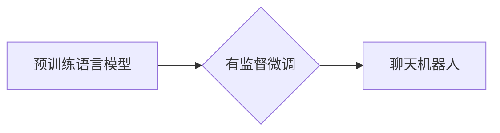

                 

## 第十四章：有监督微调 SFT 和聊天机器人

> 关键词：有监督微调、SFT、聊天机器人、自然语言处理、文本生成、预训练模型、fine-tuning

### 1. 背景介绍

近年来，深度学习在自然语言处理 (NLP) 领域取得了突破性进展，尤其是 Transformer 架构的出现，如 BERT、GPT 和 T5 等预训练语言模型 (PLM) 的问世，为 NLP 任务带来了革命性的提升。这些 PLM 在海量文本数据上进行预训练，学习了丰富的语言表示和语法规则，为下游任务提供了强大的基础。

然而，预训练模型的性能在特定任务上往往还达不到理想水平。因为预训练模型的知识是通用的，而特定任务可能需要更细化的知识和技能。因此，对预训练模型进行有监督微调 (Supervised Fine-Tuning，SFT) 成为提升模型性能的重要手段。

SFT 是一种针对特定任务进行模型微调的技术，通过在标记数据上训练模型，使其能够更好地理解和生成与特定任务相关的文本。例如，我们可以使用 SFT 将预训练的文本分类模型微调到特定领域的文本分类任务，如医疗文本分类、法律文本分类等。

聊天机器人作为一种典型的 NLP 应用，需要能够理解用户自然语言输入，并生成自然流畅的回复。传统的聊天机器人通常依赖于规则引擎或模板匹配，难以应对复杂的用户交互。而基于预训练模型的聊天机器人，通过 SFT 技术，能够学习更丰富的语言知识和对话策略，从而提供更自然、更智能的对话体验。

### 2. 核心概念与联系

**2.1 核心概念**

* **预训练语言模型 (PLM):** 在海量文本数据上进行预训练，学习语言表示和语法规则的模型。
* **有监督微调 (SFT):** 在标记数据上训练预训练模型，使其能够更好地完成特定任务。
* **聊天机器人:** 能够与用户进行自然语言交互的智能系统。

**2.2 架构关系**



### 3. 核心算法原理 & 具体操作步骤

**3.1 算法原理概述**

SFT 的核心原理是利用预训练模型已经学习到的语言表示和知识，在特定任务的标记数据上进行微调，从而提升模型在该任务上的性能。

SFT 的过程通常包括以下步骤：

1. 选择合适的预训练语言模型。
2. 准备特定任务的标记数据。
3. 将预训练模型的最后一层替换为与目标任务相匹配的输出层。
4. 使用标记数据训练微调后的模型。
5. 评估微调后的模型在目标任务上的性能。

**3.2 算法步骤详解**

1. **选择预训练模型:** 

   根据目标任务选择合适的预训练模型。例如，对于文本分类任务，可以选择 BERT 或 RoBERTa 等文本分类预训练模型；对于对话生成任务，可以选择 GPT 或 T5 等对话生成预训练模型。

2. **准备标记数据:** 

   收集和标记与目标任务相关的文本数据。标记数据需要包含输入文本和对应的输出标签或目标值。

3. **替换输出层:** 

   将预训练模型的最后一层替换为与目标任务相匹配的输出层。例如，对于文本分类任务，输出层需要包含与类别数量相匹配的节点；对于对话生成任务，输出层需要能够生成文本序列。

4. **微调模型:** 

   使用标记数据训练微调后的模型。训练过程中，可以使用预训练模型的参数作为初始值，并使用较小的学习率进行训练，以避免模型过拟合。

5. **评估模型:** 

   使用测试数据评估微调后的模型在目标任务上的性能。常用的评估指标包括准确率、F1 分数、BLEU 分数等。

**3.3 算法优缺点**

**优点:**

* **性能提升:** SFT 可以显著提升预训练模型在特定任务上的性能。
* **数据效率:** SFT 可以在相对较小的标记数据上训练模型，提高数据利用率。
* **易于实现:** SFT 的实现相对简单，可以使用现有的深度学习框架进行实现。

**缺点:**

* **过拟合风险:** 如果标记数据不足或存在偏差，SFT 模型容易过拟合。
* **计算资源消耗:** SFT 需要训练模型参数，可能需要较大的计算资源。
* **任务依赖性:** SFT 的效果取决于预训练模型和标记数据的质量，对于某些任务可能效果不佳。

**3.4 算法应用领域**

SFT 在许多 NLP 应用领域都有广泛的应用，例如：

* **文本分类:** 邮件分类、情感分析、主题分类等。
* **问答系统:** 自动回答问题、搜索引擎结果排序等。
* **机器翻译:** 将一种语言翻译成另一种语言。
* **对话生成:** 聊天机器人、虚拟助手等。
* **文本摘要:** 自动生成文本摘要。

### 4. 数学模型和公式 & 详细讲解 & 举例说明

**4.1 数学模型构建**

SFT 的数学模型通常基于预训练模型的输出层进行构建。例如，对于文本分类任务，预训练模型的输出层可以是一个全连接层，其输出维度等于类别数量。

**4.2 公式推导过程**

SFT 的训练目标是最小化模型预测结果与真实标签之间的损失函数。常用的损失函数包括交叉熵损失函数和均方误差损失函数。

**交叉熵损失函数:**

$$
L_{CE} = -\sum_{i=1}^{N} y_i \log(p_i)
$$

其中：

* $N$ 是样本数量。
* $y_i$ 是真实标签。
* $p_i$ 是模型预测的概率。

**均方误差损失函数:**

$$
L_{MSE} = \frac{1}{N} \sum_{i=1}^{N} (y_i - \hat{y}_i)^2
$$

其中：

* $y_i$ 是真实标签。
* $\hat{y}_i$ 是模型预测的值。

**4.3 案例分析与讲解**

假设我们使用 SFT 对一个预训练的文本分类模型进行微调，目标是将文本分类到三个类别：正面、负面和中性。

在训练过程中，我们使用交叉熵损失函数，并使用 Adam 优化器进行模型训练。训练完成后，我们可以使用测试数据评估模型的性能，例如计算准确率、F1 分数等。

### 5. 项目实践：代码实例和详细解释说明

**5.1 开发环境搭建**

* Python 3.6+
* PyTorch 或 TensorFlow
* CUDA (可选)

**5.2 源代码详细实现**

```python
import torch
from transformers import BertModel, BertForSequenceClassification

# 加载预训练模型
model = BertForSequenceClassification.from_pretrained('bert-base-uncased', num_labels=3)

# 定义优化器和损失函数
optimizer = torch.optim.Adam(model.parameters(), lr=2e-5)
loss_fn = torch.nn.CrossEntropyLoss()

# 训练循环
for epoch in range(3):
    for batch in train_dataloader:
        input_ids = batch['input_ids']
        attention_mask = batch['attention_mask']
        labels = batch['labels']

        # 前向传播
        outputs = model(input_ids=input_ids, attention_mask=attention_mask, labels=labels)
        loss = outputs.loss

        # 反向传播
        optimizer.zero_grad()
        loss.backward()
        optimizer.step()

# 保存模型
model.save_pretrained('fine_tuned_model')
```

**5.3 代码解读与分析**

* 代码首先加载预训练的 BERT 模型，并根据目标任务修改输出层，使其包含三个类别。
* 然后定义优化器和损失函数，并进行训练循环。
* 在训练循环中，模型对训练数据进行前向传播，计算损失，并使用反向传播更新模型参数。
* 最后，保存微调后的模型。

**5.4 运行结果展示**

训练完成后，可以使用测试数据评估模型的性能。例如，可以使用准确率、F1 分数等指标来衡量模型的性能。

### 6. 实际应用场景

**6.1 聊天机器人应用**

SFT 可以用于训练更智能的聊天机器人，使其能够更好地理解用户意图，并生成更自然、更符合语境的回复。例如，可以使用 SFT 将预训练的对话生成模型微调到特定领域的聊天机器人，如医疗、教育、客服等。

**6.2 文本分类应用**

SFT 可以用于训练更准确的文本分类模型，例如邮件分类、情感分析、主题分类等。

**6.3 其他应用场景**

SFT 还可以应用于其他 NLP 任务，例如问答系统、机器翻译、文本摘要等。

**6.4 未来应用展望**

随着预训练模型的不断发展和标记数据的积累，SFT 技术将在未来发挥更重要的作用，推动 NLP 应用的进一步发展。

### 7. 工具和资源推荐

**7.1 学习资源推荐**

* **论文:**

    * Devlin, J., Chang, M. W., Lee, K., & Toutanova, K. (2018). Bert: Pre-training of deep bidirectional transformers for language understanding. arXiv preprint arXiv:1810.04805.
    * Radford, A., Wu, J., Child, R., Luan, D., Amodei, D., & Sutskever, I. (2019). Language models are unsupervised multitask learners. OpenAI blog.

* **博客:**

    * Hugging Face Blog: https://huggingface.co/blog
    * TensorFlow Blog: https://blog.tensorflow.org/

**7.2 开发工具推荐**

* **PyTorch:** https://pytorch.org/
* **TensorFlow:** https://www.tensorflow.org/
* **Hugging Face Transformers:** https://huggingface.co/docs/transformers/index

**7.3 相关论文推荐**

* Liu, Y., Ott, M., Goyal, N., Du, J., Joshi, M., Chen, D., ... & Stoyanov, V. (2019). Roberta: A robustly optimized bert pretraining approach. arXiv preprint arXiv:1907.11692.
* T5: https://arxiv.org/abs/1910.10683

### 8. 总结：未来发展趋势与挑战

**8.1 研究成果总结**

SFT 技术在 NLP 领域取得了显著的成果，显著提升了预训练模型在特定任务上的性能。

**8.2 未来发展趋势**

* **更强大的预训练模型:** 预训练模型的规模和能力将不断提升，为 SFT 提供更强大的基础。
* **更有效的微调方法:** 将探索更有效的微调方法，例如参数共享、知识蒸馏等，提高数据效率和模型性能。
* **跨模态微调:** 将 SFT 应用于跨模态任务，例如文本-图像、文本-音频等，构建更智能的 AI 系统。

**8.3 面临的挑战**

* **数据标注成本:** 高质量的标记数据是 SFT 的关键，但数据标注成本仍然较高。
* **模型可解释性:** SFT 模型的决策过程往往难以解释，这限制了模型的应用场景。
* **公平性和偏见:** SFT 模型可能继承预训练模型中的公平性和偏见问题，需要进行更深入的研究和解决。

**8.4 研究展望**

未来，SFT 技术将继续发展，推动 NLP 应用的创新和发展。我们需要关注数据标注成本的降低、模型可解释性的提升、公平性和偏见问题的解决等关键问题，才能真正发挥 SFT 的巨大潜力。

### 9. 附录：常见问题与解答

**9.1 如何选择合适的预训练模型？**

选择预训练模型需要根据目标任务和数据特点进行选择。例如，对于文本分类任务，可以选择 BERT 或 RoBERTa 等文本分类预训练模型；对于对话生成任务，可以选择 GPT 或 T5 等对话生成预训练模型。

**9.2 如何评估 SFT 模型的性能？**

常用的评估指标包括准确率、F1 分数、BLEU 分数等。具体的评估指标选择需要根据目标任务进行选择。

**9.3 如何解决 SFT 模型过拟合问题？**

过拟合问题可以通过以下方法解决：

* 使用更大的数据集。
* 使用正则化技术，例如 dropout 和 weight decay。
* 使用早停策略，在模型性能不再提升时停止训练。


作者：禅与计算机程序设计艺术 / Zen and the Art of Computer Programming 
<end_of_turn>

