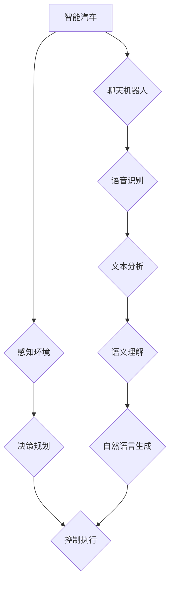

                 

## 聊天机器人汽车行业：智能汽车和驾驶体验

> 关键词：聊天机器人、智能汽车、驾驶体验、自然语言处理、语音交互、人机交互、自动驾驶、汽车行业

## 1. 背景介绍

汽车行业正经历着前所未有的变革，智能汽车和自动驾驶技术正在迅速发展，改变着人们出行的方式和体验。在这个背景下，聊天机器人技术也开始在汽车领域崭露头角，为智能汽车的驾驶体验注入新的活力。

传统的汽车驾驶体验主要依赖于物理按钮和仪表盘，操作方式相对单一，缺乏灵活性。而聊天机器人则可以利用自然语言处理（NLP）技术，理解和响应驾驶员的语音指令，提供更加便捷、人性化的交互方式。

## 2. 核心概念与联系

### 2.1 智能汽车

智能汽车是指搭载了先进传感器、计算平台和软件算法的汽车，具备感知环境、决策规划和控制执行等智能能力。

### 2.2 聊天机器人

聊天机器人是一种能够通过自然语言与人类进行对话的软件程序。它利用NLP技术，包括语音识别、文本分析、语义理解和自然语言生成等，模拟人类的对话方式，提供信息、完成任务或进行娱乐互动。

### 2.3 驾驶体验

驾驶体验是指驾驶员在驾驶汽车过程中所感受到的整体感受，包括舒适度、安全性、便捷性、愉悦度等方面。

**核心概念与联系流程图**



## 3. 核心算法原理 & 具体操作步骤

### 3.1 算法原理概述

聊天机器人汽车的核心算法原理主要包括：

* **语音识别:** 将驾驶员的语音指令转换为文本数据。
* **自然语言理解:** 分析文本数据，识别驾驶员的意图和需求。
* **对话管理:** 根据驾驶员的意图，选择合适的回复并进行对话引导。
* **自然语言生成:** 将回复转换为自然流畅的语音或文本。

### 3.2 算法步骤详解

1. **语音采集:** 驾驶员通过车载麦克风发出语音指令。
2. **语音识别:** 使用语音识别引擎将语音信号转换为文本数据。
3. **文本预处理:** 对文本数据进行清洗、分词、词性标注等预处理操作。
4. **语义理解:** 使用自然语言理解模型分析文本数据，识别驾驶员的意图和实体信息。
5. **对话管理:** 根据驾驶员的意图，从知识库或对话模板中选择合适的回复，并进行对话引导。
6. **自然语言生成:** 使用自然语言生成模型将回复转换为自然流畅的语音或文本。
7. **语音合成:** 将文本回复转换为语音信号，通过车载扬声器播放给驾驶员。

### 3.3 算法优缺点

**优点:**

* **人性化交互:** 聊天机器人可以理解和响应驾驶员的自然语言指令，提供更加人性化的交互体验。
* **便捷操作:** 驾驶员可以通过语音指令控制车辆的功能，无需繁琐的操作步骤。
* **个性化定制:** 聊天机器人可以根据驾驶员的喜好和习惯进行个性化定制，提供更加贴心的服务。

**缺点:**

* **理解误差:** 聊天机器人在理解驾驶员的意图时可能存在误差，导致无法准确执行指令。
* **对话流畅度:** 聊天机器人的对话可能缺乏自然流畅度，难以与人类进行自然对话。
* **安全风险:** 聊天机器人可能会被恶意攻击，导致车辆安全问题。

### 3.4 算法应用领域

* **语音控制:** 控制车辆的空调、导航、音乐等功能。
* **信息查询:** 查询天气、交通、新闻等信息。
* **娱乐互动:** 与驾驶员进行聊天、讲故事、播放音乐等娱乐互动。
* **安全辅助:** 提醒驾驶员注意安全、提供紧急救援等安全辅助功能。

## 4. 数学模型和公式 & 详细讲解 & 举例说明

### 4.1 数学模型构建

聊天机器人汽车的核心算法基于概率统计模型和机器学习算法。

* **语音识别:** 使用隐马尔可夫模型（HMM）或深度神经网络（DNN）进行语音识别。
* **自然语言理解:** 使用词嵌入模型（Word2Vec、GloVe）和循环神经网络（RNN）进行语义理解。
* **对话管理:** 使用状态机或强化学习算法进行对话管理。

### 4.2 公式推导过程

* **HMM语音识别:** 

$$
P(O|Q) = \prod_{t=1}^{T} P(O_t|Q_t)
$$

其中：

* $O$ 是观测序列（语音信号）。
* $Q$ 是隐藏状态序列（语音特征）。
* $O_t$ 是观测序列的第 $t$ 个元素。
* $Q_t$ 是隐藏状态序列的第 $t$ 个元素。

* **RNN语义理解:**

$$
h_t = f(W_xh_t-1 + W_xO_t + b_x)
$$

其中：

* $h_t$ 是隐藏状态的第 $t$ 个元素。
* $f$ 是激活函数。
* $W_x$ 和 $W_y$ 是权重矩阵。
* $b_x$ 和 $b_y$ 是偏置项。
* $O_t$ 是输入序列的第 $t$ 个元素。

### 4.3 案例分析与讲解

**语音识别案例:**

假设驾驶员说“打开空调”。语音识别引擎会将语音信号转换为文本数据“打开空调”。

**语义理解案例:**

自然语言理解模型会识别出驾驶员的意图是“打开空调”，并提取出实体信息“空调”。

## 5. 项目实践：代码实例和详细解释说明

### 5.1 开发环境搭建

* 操作系统：Ubuntu 18.04
* Python 版本：3.7
* 依赖库：

```
pip install tensorflow numpy scipy matplotlib
```

### 5.2 源代码详细实现

```python
# 语音识别
import speech_recognition as sr

r = sr.Recognizer()
with sr.Microphone() as source:
    print("请说话:")
    audio = r.listen(source)

try:
    text = r.recognize_google(audio)
    print("您说的是:", text)
except sr.UnknownValueError:
    print("无法识别语音")
except sr.RequestError as e:
    print("无法连接到语音识别服务; {0}".format(e))

# 自然语言理解
import nltk

nltk.download('punkt')
nltk.download('averaged_perceptron_tagger')

def analyze_text(text):
    tokens = nltk.word_tokenize(text)
    pos_tags = nltk.pos_tag(tokens)
    # ... 进一步分析语义 ...

# 对话管理
# ... 使用状态机或强化学习算法进行对话管理 ...

# 自然语言生成
# ... 使用文本生成模型进行自然语言生成 ...
```

### 5.3 代码解读与分析

* 语音识别部分使用 `speech_recognition` 库，将语音信号转换为文本数据。
* 自然语言理解部分使用 `nltk` 库，对文本数据进行分词和词性标注等预处理操作。
* 对话管理部分需要使用状态机或强化学习算法，根据驾驶员的意图进行对话引导。
* 自然语言生成部分需要使用文本生成模型，将回复转换为自然流畅的文本。

### 5.4 运行结果展示

当驾驶员说“打开空调”时，聊天机器人汽车会识别出驾驶员的意图，并控制车辆的空调系统打开。

## 6. 实际应用场景

* **智能座舱:** 聊天机器人可以作为智能座舱的核心交互方式，提供更加便捷、人性化的驾驶体验。
* **自动驾驶:** 聊天机器人可以与自动驾驶系统协同工作，帮助驾驶员了解车辆状态、规划路线、提供安全提示等。
* **车辆服务:** 聊天机器人可以提供车辆保养、维修、导航等服务，帮助驾驶员解决出行难题。

### 6.4 未来应用展望

* **更智能的对话体验:** 未来聊天机器人汽车将能够理解更加复杂的对话，提供更加自然、流畅的交互体验。
* **个性化定制:** 聊天机器人将能够根据驾驶员的喜好和习惯进行个性化定制，提供更加贴心的服务。
* **多模态交互:** 聊天机器人汽车将支持多种交互方式，例如语音、文本、图像、视频等，提供更加丰富的交互体验。

## 7. 工具和资源推荐

### 7.1 学习资源推荐

* **自然语言处理课程:** Coursera、edX、Udacity 等平台提供丰富的自然语言处理课程。
* **机器学习库文档:** TensorFlow、PyTorch 等机器学习库的官方文档提供了详细的算法原理和使用教程。
* **开源项目:** HuggingFace、GitHub 等平台上有许多开源的聊天机器人项目，可以供学习和参考。

### 7.2 开发工具推荐

* **Python:** Python 是机器学习和自然语言处理领域最常用的编程语言。
* **TensorFlow:** TensorFlow 是 Google 开发的开源机器学习框架，支持多种深度学习算法。
* **PyTorch:** PyTorch 是 Facebook 开发的开源机器学习框架，以其灵活性和易用性而闻名。

### 7.3 相关论文推荐

* **BERT: Pre-training of Deep Bidirectional Transformers for Language Understanding**
* **GPT-3: Language Models are Few-Shot Learners**
* **Attention Is All You Need**

## 8. 总结：未来发展趋势与挑战

### 8.1 研究成果总结

聊天机器人汽车技术在语音识别、自然语言理解、对话管理和自然语言生成等方面取得了显著进展，为智能汽车的驾驶体验带来了新的可能性。

### 8.2 未来发展趋势

* **更智能的对话体验:** 聊天机器人汽车将更加智能，能够理解更加复杂的对话，提供更加自然、流畅的交互体验。
* **个性化定制:** 聊天机器人将能够根据驾驶员的喜好和习惯进行个性化定制，提供更加贴心的服务。
* **多模态交互:** 聊天机器人汽车将支持多种交互方式，例如语音、文本、图像、视频等，提供更加丰富的交互体验。

### 8.3 面临的挑战

* **安全风险:** 聊天机器人可能会被恶意攻击，导致车辆安全问题。
* **数据隐私:** 聊天机器人需要收集和处理驾驶员的个人数据，需要确保数据隐私安全。
* **伦理问题:** 聊天机器人汽车的决策可能会涉及伦理问题，需要进行深入的伦理研究和规范。

### 8.4 研究展望

未来，聊天机器人汽车技术将继续发展，为智能汽车带来更加智能、便捷、人性化的驾驶体验。


## 9. 附录：常见问题与解答

* **Q: 聊天机器人汽车是否会取代人类驾驶员？**

A: 目前，聊天机器人汽车主要用于辅助驾驶，而不是完全取代人类驾驶员。未来，自动驾驶技术可能会更加成熟，但人类驾驶员仍然会在许多情况下发挥重要作用。

* **Q: 聊天机器人汽车的安全性能如何？**

A: 聊天机器人汽车的安全性能取决于其算法的可靠性和硬件系统的安全性。开发人员需要不断改进算法，并采取措施确保硬件系统的安全性，以降低安全风险。

* **Q: 聊天机器人汽车的成本如何？**

A: 聊天机器人汽车的成本取决于其功能和配置。目前，聊天机器人汽车的成本相对较高，但随着技术的进步和规模化生产，成本将会逐渐降低。


作者：禅与计算机程序设计艺术 / Zen and the Art of Computer Programming 
<end_of_turn>

