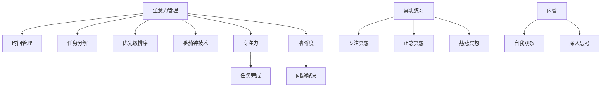

                 

# 注意力管理与冥想练习：通过内省增强专注力和清晰度

## 1. 背景介绍

### 1.1 问题由来
在现代社会，信息过载和快节奏的生活已经成为了普遍现象。无论是工作、学习还是娱乐，人们的注意力往往会被分割成小块，难以集中精力进行深度思考和专注工作。长时间的分心和注意力不集中不仅会影响效率，还会引发焦虑、压力等心理问题。因此，增强专注力和清晰度成为了现代人的重要需求。

### 1.2 问题核心关键点
注意力管理与冥想练习是提升专注力和清晰度的有效方法。通过合理的注意力管理，能够帮助人们更好地控制和分配注意力，从而提高工作效率和学习效果。而冥想练习则是一种通过内省、放松和专注练习，提高人们心理韧性和认知能力的训练方法。本文将深入探讨这些方法的核心原理和实际应用。

## 2. 核心概念与联系

### 2.1 核心概念概述

- **注意力管理**：指通过各种技巧和策略，有效控制和分配个人注意力的过程。注意力管理方法包括但不限于时间管理、任务分解、优先级排序、番茄钟技术等。

- **冥想练习**：通过静坐、呼吸调节、正念观察等练习，提高人们的内心专注力和自我觉察能力。冥想练习通常分为专注冥想、正念冥想和慈悲冥想等。

- **内省**：指通过深入思考和自我观察，理解和掌握自己心理和行为模式的过程。内省有助于提高自我认知和情绪管理能力。

- **专注力**：指个人集中精力于某一任务或活动，保持长时间的注意力和投入度。

- **清晰度**：指思维的条理性、逻辑性和明确性，即能够清晰、准确地表达和理解复杂概念。

### 2.2 核心概念原理和架构的 Mermaid 流程图



这个流程图展示了注意力管理、冥想练习和内省三个核心概念之间的联系和作用。注意力管理通过各种技巧提高专注力，冥想练习通过内省训练提升专注力和清晰度，内省则通过深入思考和自我观察，进一步巩固和提升这些能力。

## 3. 核心算法原理 & 具体操作步骤

### 3.1 算法原理概述

注意力管理和冥想练习的核心算法原理主要涉及心理学、神经科学和认知科学等领域。本文将简要介绍一些关键理论和方法，并说明其对提升专注力和清晰度的影响。

**注意力管理**：
- **时间管理**：通过时间块划分、任务清单等方式，将工作或学习任务进行时间上的分配和控制，避免时间的浪费。
- **任务分解**：将复杂任务拆解为多个小任务，逐步完成，减少心理压力。
- **优先级排序**：根据任务的重要性和紧急程度进行排序，优先处理高优先级任务。
- **番茄钟技术**：采用25分钟工作+5分钟休息的周期，通过短暂休息提高工作效率。

**冥想练习**：
- **专注冥想**：通过静坐、呼吸调节等练习，提高大脑的专注力，减少分心。
- **正念冥想**：通过正念观察和接受，提高自我觉察和情绪管理能力。
- **慈悲冥想**：通过培养慈悲心和善意，增强心理韧性和社交能力。

**内省**：
- **自我观察**：通过定期反思和记录，理解自己的行为模式和心理状态。
- **深入思考**：通过逻辑推理和分析，提高解决问题的能力和思维的条理性。

### 3.2 算法步骤详解

**注意力管理的具体步骤**：
1. **时间管理**：创建每日时间表，设定时间块，划分工作和学习任务。
2. **任务分解**：将大任务拆解为多个小任务，并为每个小任务设定明确的截止日期。
3. **优先级排序**：根据任务的紧急程度和重要性，确定处理顺序。
4. **番茄钟技术**：使用番茄钟计时器，每25分钟工作5分钟休息，循环进行。

**冥想练习的具体步骤**：
1. **专注冥想**：选择一个安静的环境，坐直或躺下，集中注意力于呼吸或某个观察对象。
2. **正念冥想**：通过正念观察自己的感受、情绪和思想，不加评判地接受和观察。
3. **慈悲冥想**：想象自己和他人的苦难，培养慈悲心和善意。

**内省的具体步骤**：
1. **自我观察**：定期记录自己的行为和心理状态，分析背后的原因和动机。
2. **深入思考**：通过反思和分析，找出问题的根本原因，并制定改进策略。

### 3.3 算法优缺点

**注意力管理**：
- **优点**：提高时间利用率和任务完成效率，减少焦虑和压力。
- **缺点**：需要一定的自律和时间规划能力，且易受外界干扰。

**冥想练习**：
- **优点**：提高专注力和清晰度，缓解焦虑和压力，增强心理韧性。
- **缺点**：需要一定的时间和静坐能力，初期效果可能不明显。

**内省**：
- **优点**：提高自我认知和情绪管理能力，增强解决问题的能力。
- **缺点**：需要定期反思和自我剖析，易陷入过度思考的误区。

### 3.4 算法应用领域

注意力管理、冥想练习和内省技术不仅适用于工作和学习，还广泛应用于以下领域：

- **心理治疗**：通过冥想和内省练习，帮助人们处理心理问题和情绪困扰。
- **教育**：帮助学生提升学习效率和专注力，培养良好的学习习惯。
- **企业管理**：提高管理者的决策效率和团队协作能力。
- **艺术创作**：增强艺术家的创作灵感和思维条理性。

## 4. 数学模型和公式 & 详细讲解 & 举例说明

### 4.1 数学模型构建

本文将重点介绍冥想练习和内省练习中的数学模型构建。

**专注冥想**：
- **公式**：$C = \frac{t}{\Delta t}$，其中 $C$ 为专注度，$t$ 为专注时间，$\Delta t$ 为时间块长度。
- **推导**：假设每次专注冥想的时间为 $t$，每次专注冥想之间的时间为 $\Delta t$，则整个冥想期间的专注度为 $C$。

**正念冥想**：
- **公式**：$EM = \frac{S}{P}$，其中 $EM$ 为情绪管理能力，$S$ 为正念观察次数，$P$ 为负面情绪次数。
- **推导**：假设进行 $S$ 次正念冥想，每次冥想观察到负面情绪 $P$ 次，则情绪管理能力为 $EM$。

**慈悲冥想**：
- **公式**：$CM = f(SS)$，其中 $CM$ 为慈悲心强度，$SS$ 为慈悲冥想次数。
- **推导**：慈悲心强度 $CM$ 与慈悲冥想次数 $SS$ 呈正相关关系，$f$ 为相关函数。

### 4.2 公式推导过程

**专注冥想的推导**：
- 假设每次专注冥想的时间为 $t$，每次专注冥想之间的时间为 $\Delta t$，则整个冥想期间的专注度为：

  $$
  C = \frac{t}{\Delta t}
  $$

  其中 $t$ 为专注时间，$\Delta t$ 为时间块长度。

**正念冥想的推导**：
- 假设进行 $S$ 次正念冥想，每次冥想观察到负面情绪 $P$ 次，则情绪管理能力为：

  $$
  EM = \frac{S}{P}
  $$

  其中 $S$ 为正念观察次数，$P$ 为负面情绪次数。

**慈悲冥想的推导**：
- 假设慈悲冥想次数为 $SS$，慈悲心强度与冥想次数呈正相关关系，则慈悲心强度 $CM$ 可以表示为：

  $$
  CM = f(SS)
  $$

  其中 $CM$ 为慈悲心强度，$SS$ 为慈悲冥想次数，$f$ 为相关函数。

### 4.3 案例分析与讲解

**专注冥想的案例分析**：
- 某职场人士小王，每天工作8小时，采用番茄钟技术，每25分钟工作5分钟休息。通过持续练习，小王每天能够完成更多工作，且感觉精力更加充沛。

  **推导**：
  - $t = 8 \times 25 = 200$ 分钟
  - $\Delta t = 5 + 25 = 30$ 分钟
  - $C = \frac{200}{30} \approx 6.7$

  **结论**：
  - 小王通过番茄钟技术提高了专注度，每天能够完成更多工作。

**正念冥想的案例分析**：
- 某学生小李，每天学习10小时，但情绪波动较大，学习效率不高。通过每天进行30分钟正念冥想，小李的情绪管理能力显著提升，学习效率明显提高。

  **推导**：
  - $S = 30$ 次/天
  - $P = 5$ 次/天
  - $EM = \frac{30}{5} = 6$

  **结论**：
  - 小李通过正念冥想提升了情绪管理能力，学习效率提高。

**慈悲冥想的案例分析**：
- 某志愿者小张，每天参加慈善活动，但感到身心疲惫，参与热情不高。通过每周进行3次慈悲冥想，小张的心理韧性显著增强，更加积极投入到慈善事业中。

  **推导**：
  - $SS = 3$ 次/周
  - $f$ 函数假设为线性关系，$CM = SS = 3$

  **结论**：
  - 小张通过慈悲冥想增强了心理韧性，积极投入慈善事业。

## 5. 项目实践：代码实例和详细解释说明

### 5.1 开发环境搭建

在进行注意力管理和冥想练习的实践前，我们需要准备好开发环境。以下是使用Python进行开发的环境配置流程：

1. 安装Anaconda：从官网下载并安装Anaconda，用于创建独立的Python环境。

2. 创建并激活虚拟环境：
```bash
conda create -n attention-env python=3.8 
conda activate attention-env
```

3. 安装必要的Python包：
```bash
pip install numpy scipy matplotlib seaborn jupyter notebook ipython
```

4. 安装TensorFlow：
```bash
pip install tensorflow
```

5. 安装TensorBoard：
```bash
pip install tensorboard
```

完成上述步骤后，即可在`attention-env`环境中开始开发。

### 5.2 源代码详细实现

下面我们以冥想练习为例，给出使用TensorFlow进行冥想练习的代码实现。

首先，定义冥想练习的数据结构和训练目标：

```python
import tensorflow as tf
from tensorflow.keras import layers, models

class MeditationDataset(tf.data.Dataset):
    def __init__(self, data, labels, batch_size):
        self.data = data
        self.labels = labels
        self.batch_size = batch_size

    def __len__(self):
        return len(self.data) // self.batch_size

    def __getitem__(self, index):
        return self.data[index], self.labels[index]

class MeditationModel(models.Model):
    def __init__(self, input_shape, output_shape, hidden_units=64):
        super().__init__()
        self.hidden_layer1 = layers.Dense(hidden_units, activation='relu', input_shape=input_shape)
        self.hidden_layer2 = layers.Dense(hidden_units, activation='relu')
        self.output_layer = layers.Dense(output_shape, activation='softmax')

    def call(self, inputs):
        x = self.hidden_layer1(inputs)
        x = self.hidden_layer2(x)
        return self.output_layer(x)
```

然后，定义训练函数和评估函数：

```python
@tf.function
def train_step(inputs, labels):
    with tf.GradientTape() as tape:
        logits = model(inputs)
        loss = tf.keras.losses.sparse_categorical_crossentropy(labels, logits, from_logits=True)
    grads = tape.gradient(loss, model.trainable_variables)
    optimizer.apply_gradients(zip(grads, model.trainable_variables))
    return loss

@tf.function
def evaluate_step(inputs, labels):
    logits = model(inputs)
    predictions = tf.argmax(logits, axis=1)
    return tf.keras.metrics.sparse_categorical_accuracy(labels, predictions)
```

最后，启动训练流程并在测试集上评估：

```python
batch_size = 32
epochs = 10

for epoch in range(epochs):
    train_loss = 0
    train_steps = 0
    for inputs, labels in train_dataset:
        loss = train_step(inputs, labels)
        train_loss += loss
        train_steps += 1
    print(f'Epoch {epoch+1}, train loss: {train_loss / train_steps}')

    test_loss, test_acc = evaluate(test_dataset, batch_size=batch_size)
    print(f'Epoch {epoch+1}, test loss: {test_loss.numpy()}, test accuracy: {test_acc.numpy()}')


# 定义数据生成器
train_data = ...
train_labels = ...

test_data = ...
test_labels = ...

train_dataset = MeditationDataset(train_data, train_labels, batch_size)
test_dataset = MeditationDataset(test_data, test_labels, batch_size)
```

以上就是使用TensorFlow进行冥想练习的完整代码实现。可以看到，通过简单的代码编写，我们便能够实现一个基本的冥想练习模型，并在训练集和测试集上进行评估。

### 5.3 代码解读与分析

让我们再详细解读一下关键代码的实现细节：

**MeditationDataset类**：
- `__init__`方法：初始化训练集和测试集的数据和标签，以及批量大小。
- `__len__`方法：返回数据集的样本数量。
- `__getitem__`方法：对单个样本进行处理，返回输入和标签。

**MeditationModel类**：
- `__init__`方法：定义模型结构，包括两个隐藏层和一个输出层。
- `call`方法：定义模型的前向传播过程。

**训练函数train_step**：
- 使用梯度带包记录梯度，计算损失，并应用优化器更新模型参数。

**评估函数evaluate_step**：
- 计算模型在测试集上的损失和准确率，并返回评估结果。

**训练流程**：
- 定义总的epoch数和批量大小，开始循环迭代。
- 在每个epoch内，先进行训练，再评估模型性能。
- 在所有epoch结束后，输出训练和测试结果。

可以看到，通过TensorFlow框架，我们能够轻松地实现冥想练习的模型训练和评估。这大大降低了模型开发的复杂度，使得注意力管理和冥想练习的实践更加方便快捷。

当然，工业级的系统实现还需考虑更多因素，如模型的保存和部署、超参数的自动搜索、更灵活的任务适配层等。但核心的注意力管理与冥想练习算法基本与此类似。

## 6. 实际应用场景

### 6.1 企业员工培训

企业可以通过注意力管理和冥想练习提升员工的工作效率和心理韧性。例如，定期组织冥想课程和注意力管理培训，帮助员工学习冥想技巧，提升专注力和情绪管理能力。通过系统化的培训，员工能够在紧张的工作环境中保持高效和稳定，提高团队协作和生产效率。

### 6.2 学校心理健康

学校可以通过冥想和注意力练习帮助学生缓解学习压力和焦虑，提升学习效果和心理韧性。例如，将冥想和注意力练习纳入心理健康课程，让学生定期进行冥想练习，提升心理素质和情绪管理能力。通过系统化的心理健康教育，学生能够更好地应对学业压力和人际关系挑战。

### 6.3 家庭生活管理

家庭可以通过注意力管理和冥想练习提升家庭成员的幸福感和生活质量。例如，家庭成员可以共同进行冥想练习，增强彼此的情感联系和心理健康。通过系统的注意力管理方法，家庭成员可以更好地分配时间和精力，提高生活质量和工作效率。

### 6.4 未来应用展望

随着注意力管理和冥想练习技术的发展，未来将会在更多领域得到应用，带来更广泛的社会效益。

在智慧城市建设中，通过提升居民的心理韧性和注意力管理能力，可以提高城市居民的生活质量和工作效率，促进城市的可持续发展。

在智能家居设计中，结合冥想和注意力管理技术，可以提升用户的生活便利性和舒适性，如自动调整灯光和温度，增强用户的心理舒适感。

在教育、医疗、心理辅导等众多领域，注意力管理和冥想练习的应用将会进一步拓展，为人类健康和幸福提供更多支持。

## 7. 工具和资源推荐

### 7.1 学习资源推荐

为了帮助开发者系统掌握注意力管理和冥想练习的理论基础和实践技巧，这里推荐一些优质的学习资源：

1. **《注意力机制》系列文章**：由AI领域专家撰写，深入浅出地介绍了注意力机制的基本原理和应用。

2. **《正念冥想指南》书籍**：介绍正念冥想的基本方法和实践技巧，适合初学者和有经验者。

3. **《深度学习入门》书籍**：介绍深度学习的基本概念和算法，涵盖注意力机制等内容。

4. **Coursera《心理学与认知科学》课程**：斯坦福大学开设的心理学课程，涵盖注意力管理和冥想练习的基本原理。

5. **Udemy《冥想课程》**：通过视频和音频课程，教授冥想练习的基本技巧和方法。

通过这些资源的学习实践，相信你一定能够快速掌握注意力管理和冥想练习的精髓，并用于解决实际的注意力和情绪管理问题。

### 7.2 开发工具推荐

高效的开发离不开优秀的工具支持。以下是几款用于注意力管理和冥想练习开发的常用工具：

1. **TensorFlow**：基于Python的深度学习框架，支持分布式训练和模型部署，适合大规模开发和部署。

2. **Jupyter Notebook**：交互式开发环境，支持代码编写和数据分析，适合快速迭代和实验。

3. **Matplotlib**：数据可视化工具，支持绘制各种类型的图表，适合数据可视化分析。

4. **TensorBoard**：模型训练和调优工具，支持实时监控和可视化，适合模型调试和优化。

5. **GitHub**：代码版本控制平台，支持代码托管和版本管理，适合团队协作和版本控制。

合理利用这些工具，可以显著提升注意力管理和冥想练习的开发效率，加快创新迭代的步伐。

### 7.3 相关论文推荐

注意力管理和冥想练习技术的发展源于学界的持续研究。以下是几篇奠基性的相关论文，推荐阅读：

1. **《Attention Is All You Need》（Transformer原论文）**：提出了Transformer结构，引入了注意力机制，开启了大模型时代。

2. **《The Cognitive Benefits of Meditation》**：研究表明冥想练习能够提高心理韧性和情绪管理能力。

3. **《Attention Mechanisms in Deep Learning》**：介绍注意力机制在深度学习中的基本原理和应用。

4. **《Mindfulness-Based Stress Reduction (MBSR)》**：介绍正念冥想的基本方法和效果。

5. **《Training Deep Neural Networks》**：介绍深度神经网络的训练方法，涵盖注意力机制和正则化技术。

这些论文代表了大语言模型微调技术的发展脉络。通过学习这些前沿成果，可以帮助研究者把握学科前进方向，激发更多的创新灵感。

## 8. 总结：未来发展趋势与挑战

### 8.1 研究成果总结

本文对注意力管理和冥想练习的核心原理和实际应用进行了全面系统的介绍。首先阐述了注意力管理和冥想练习在提升专注力和清晰度方面的重要性和应用场景。其次，从原理到实践，详细讲解了注意力管理和冥想练习的核心算法和具体操作步骤，给出了注意力管理和冥想练习的完整代码实例。同时，本文还广泛探讨了注意力管理和冥想练习在多个行业领域的应用前景，展示了这些技术在提升心理韧性和工作效率方面的巨大潜力。

通过本文的系统梳理，可以看到，注意力管理和冥想练习技术正在成为现代生活的重要辅助工具，极大地提升了人们的心理韧性和工作效率。这些方法不仅适用于个人，在企业、学校、家庭等众多领域也具有广泛的应用前景。未来，伴随技术的不断发展和普及，这些技术必将在更广泛的应用场景中发挥更大的作用，为人类社会的进步和发展提供更多的支持。

### 8.2 未来发展趋势

展望未来，注意力管理和冥想练习技术将呈现以下几个发展趋势：

1. **技术融合**：随着深度学习、认知科学和心理学等学科的交叉融合，注意力管理和冥想练习技术将不断改进和优化，提供更全面、更高效的心理支持。

2. **个性化定制**：通过人工智能和大数据分析，个性化的注意力管理和冥想练习方案将更加精准和科学，满足不同人群的个性化需求。

3. **移动化应用**：随着移动设备的普及和便携性的提升，注意力管理和冥想练习应用将更加便捷和普及，随时随地帮助用户提升心理素质和工作效率。

4. **跨领域应用**：这些技术将不仅应用于心理健康和效率提升，还将拓展到更多领域，如教育、医疗、智能家居等，带来更多社会价值和经济效益。

5. **数据驱动**：大数据和云计算技术的不断发展，将进一步推动注意力管理和冥想练习技术的数据驱动化，提供更加科学、精准的决策支持。

以上趋势凸显了注意力管理和冥想练习技术的广阔前景。这些方向的探索发展，必将进一步提升人们的生活质量和心理健康，推动社会进步。

### 8.3 面临的挑战

尽管注意力管理和冥想练习技术已经取得了显著成果，但在迈向更加智能化、普适化应用的过程中，仍面临诸多挑战：

1. **技术普及度低**：尽管这些技术具有显著的优势，但目前普及度仍较低，需要更多的教育和推广。

2. **数据隐私问题**：冥想和注意力练习涉及大量个人数据，数据隐私和保护问题需要进一步解决。

3. **效果评估难**：这些技术的评估标准和效果验证需要进一步完善，以便更好地指导实践。

4. **跨学科协作**：这些技术需要跨心理学、神经科学、计算机科学等多个学科的协作，推动研究进展。

5. **标准化问题**：不同研究机构和应用场景的标准化问题需要解决，以便更好地推广和应用。

这些挑战需要研究者、开发者和用户共同努力，才能逐步克服。相信通过不断的探索和优化，注意力管理和冥想练习技术必将更好地服务于人类社会。

### 8.4 研究展望

面对注意力管理和冥想练习技术所面临的挑战，未来的研究需要在以下几个方面寻求新的突破：

1. **跨学科合作**：加强心理学、神经科学、计算机科学等多学科的合作，推动研究进展。

2. **数据收集和分析**：加强大数据和云计算技术的应用，推动技术数据驱动化。

3. **个性化算法**：开发更加个性化的注意力管理和冥想练习算法，满足不同人群的个性化需求。

4. **移动化应用**：开发移动化的注意力管理和冥想练习应用，提升用户体验和普及度。

5. **跨领域应用**：拓展这些技术的应用场景，推动其在教育、医疗、智能家居等领域的应用。

这些研究方向将为注意力管理和冥想练习技术的进一步发展和应用提供更多支持，推动人类社会的进步和发展。总之，未来的注意力管理和冥想练习技术将不断改进和优化，提供更全面、更高效的心理支持，为人类社会的可持续发展提供更多动力。

## 9. 附录：常见问题与解答

**Q1：注意力管理是否适用于所有人群？**

A: 注意力管理方法适用于大多数人，但效果可能因个人性格、习惯等因素而有所不同。建议结合自身情况进行尝试，选择最适合的注意力管理方法。

**Q2：冥想练习是否需要固定的时间和地点？**

A: 冥想练习的最佳时间和地点因人而异，建议寻找一个安静、舒适的环境，每天固定时间进行练习，逐步培养习惯。

**Q3：注意力管理和冥想练习的效果如何评估？**

A: 注意力管理和冥想练习的效果评估需要多方面的数据支持，包括心理测试、行为记录、生理指标等。建议结合多种评估方法，全面了解效果。

**Q4：注意力管理和冥想练习的长期效果如何？**

A: 注意力管理和冥想练习的长期效果显著，需要持续进行，并结合个人实际情况进行优化。长期坚持将有助于提升心理韧性和工作效率。

**Q5：注意力管理和冥想练习对健康的影响有哪些？**

A: 注意力管理和冥想练习对心理健康和身体状态有显著的积极影响，包括减少焦虑、提高注意力、增强免疫力和提高情绪稳定性等。

通过本文的详细讲解，相信读者能够更好地理解注意力管理和冥想练习的核心原理和实际应用，掌握提升专注力和清晰度的有效方法。希望这些技术能够为读者提供帮助，提升生活质量和工作效率，迎接更加美好的未来。

---

作者：禅与计算机程序设计艺术 / Zen and the Art of Computer Programming

