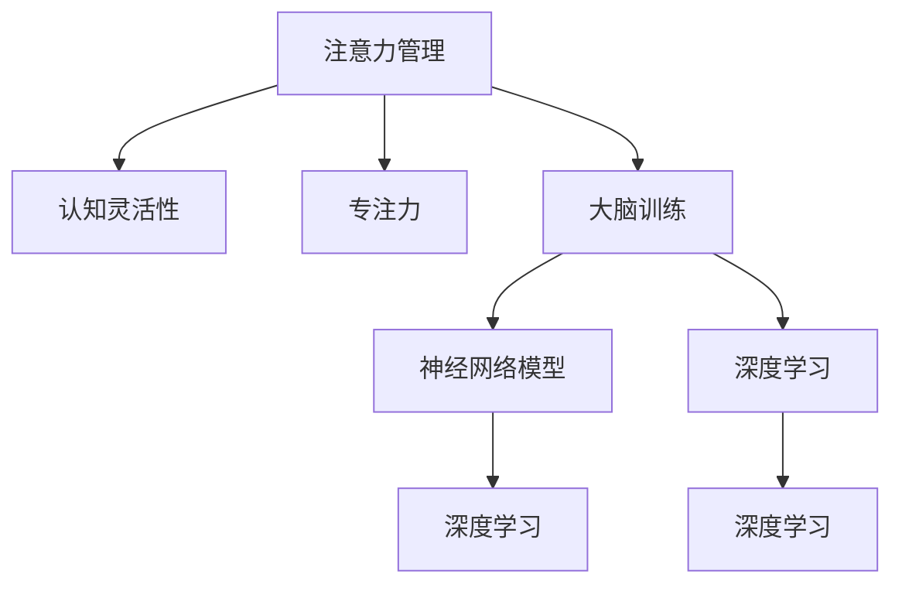

                 

# 注意力管理与大脑训练：提高认知灵活性和专注力的练习

> 关键词：注意力管理,认知灵活性,专注力,大脑训练,神经网络模型,深度学习,认知科学,心理学,实践练习

## 1. 背景介绍

### 1.1 问题由来

现代社会的高压生活和工作节奏，使得人们的注意力分散问题日益严重，认知能力受到挑战。尤其是在信息爆炸的时代，如何有效管理注意力，提高专注力和认知灵活性，已经成为人们普遍关注的问题。传统认知行为训练方式，如冥想、读书、记忆游戏等，虽然有一定的效果，但普遍缺乏科学依据和系统训练方法，难以满足现代人对认知提升的迫切需求。

神经网络模型和大数据技术的兴起，为解决这些问题带来了新的可能性。通过研究大脑的神经活动模式，开发针对注意力和认知能力的训练算法，可以科学地引导人们进行高效的大脑训练，提高注意力管理能力，从而增强专注力和认知灵活性。本文将系统介绍基于神经网络的注意力管理与大脑训练方法，通过理论和实践相结合的方式，展示如何在现代信息时代科学地提升认知能力。

## 2. 核心概念与联系

### 2.1 核心概念概述

为更好地理解本文介绍的注意力管理与大脑训练方法，本节将介绍几个密切相关的核心概念：

- **注意力管理(Attention Management)**：指通过认知行为干预，提高个体对重要信息源的关注度和处理能力，降低分心的频率和强度。
- **认知灵活性(Cognitive Flexibility)**：指个体在面对新信息时，能够迅速调整和切换思维模式的能力，即“灵活应变”。
- **专注力(Concentration)**：指个体在特定任务上的持续注意力和精力投入，表现为对任务的高水平投入和较长时间的持久力。
- **大脑训练(Brain Training)**：指通过科学设计的训练方法，增强大脑的认知功能，提升注意力、记忆、决策等方面的能力。
- **神经网络模型(Neural Network Model)**：指利用深度学习技术，模拟大脑神经元的连接和信息处理机制，用于研究大脑认知功能的计算模型。
- **深度学习(Deep Learning)**：指通过多层神经网络，利用大量数据进行模型训练，实现对复杂问题的深度表示和高效计算。

这些核心概念之间的逻辑关系可以通过以下Mermaid流程图来展示：



这个流程图展示了大脑训练的核心概念及其之间的关系：

1. 注意力管理通过提升个体对重要信息的关注度，降低分心，从而提高专注力和认知灵活性。
2. 大脑训练通过科学设计的训练方法，增强大脑的认知功能。
3. 神经网络模型和大规模深度学习技术，模拟大脑信息处理机制，用于研究注意力和认知能力。
4. 深度学习在大规模数据上进行模型训练，实现对注意力和认知能力的计算模拟和优化。

## 3. 核心算法原理 & 具体操作步骤
### 3.1 算法原理概述

本文介绍的注意力管理与大脑训练方法，基于深度学习和神经网络模型。其核心思想是通过训练神经网络模型，模拟人类大脑的认知活动，从而提升个体的注意力管理能力，增强专注力和认知灵活性。

具体而言，通过构建一个包含多层神经元的深度神经网络，将输入信息与大脑的神经活动模式进行映射，训练出能够模拟注意力和认知功能的模型。在训练过程中，通过特定的训练任务和训练策略，优化模型的参数，从而实现对注意力和认知能力的计算模拟和优化。最终训练好的模型，可以通过多次练习和使用，逐渐提升个体的注意力管理能力和认知功能。

### 3.2 算法步骤详解

基于深度学习和神经网络模型的注意力管理与大脑训练方法，通常包括以下几个关键步骤：

**Step 1: 数据收集与预处理**
- 收集大量的注意力和认知任务数据，如文字阅读任务、视觉注意力任务等。
- 对数据进行预处理，包括数据清洗、归一化、编码等，以便于神经网络的输入。

**Step 2: 构建神经网络模型**
- 设计并构建一个包含多层神经元的深度神经网络模型，用于模拟大脑的注意力和认知功能。
- 确定神经网络的架构和参数设置，选择合适的激活函数、损失函数等。

**Step 3: 模型训练**
- 使用预处理后的数据对神经网络模型进行训练，通过反向传播算法不断调整模型参数。
- 设定训练轮数、学习率、批次大小等训练参数，确保模型能够收敛并泛化良好。

**Step 4: 模型评估与优化**
- 使用独立于训练集的验证集对模型进行评估，检查其泛化能力和效果。
- 根据评估结果，调整模型参数，优化模型性能，进一步提升注意力和认知功能。

**Step 5: 训练与实践**
- 使用训练好的模型进行多次注意力和认知任务练习，如文字阅读、视觉注意力等。
- 通过实践，逐渐提升个体的注意力管理能力和认知灵活性。

### 3.3 算法优缺点

基于深度学习和神经网络模型的注意力管理与大脑训练方法，具有以下优点：

1. **科学依据**：通过深度学习模型对人类大脑的认知活动进行模拟和优化，能够提供科学依据和理论支持。
2. **系统训练**：与传统的训练方式相比，神经网络模型提供了系统化的训练方法，能够更有效地提升认知能力。
3. **可定制化**：可以根据不同的注意力和认知任务，定制化设计神经网络模型和训练策略，满足个性化需求。

同时，该方法也存在一定的局限性：

1. **数据依赖**：训练效果很大程度上依赖于高质量的数据集，数据收集和预处理较为繁琐。
2. **计算资源需求高**：神经网络模型的训练需要大量的计算资源，对硬件要求较高。
3. **模型复杂度**：神经网络模型较为复杂，训练和优化过程较难控制。

尽管存在这些局限性，但神经网络模型和大数据技术的发展，使得该方法在认知科学和心理学领域具有广泛的应用前景。未来相关研究将进一步降低数据需求和计算复杂度，提升模型的可解释性和可操作性。

### 3.4 算法应用领域

基于神经网络的注意力管理与大脑训练方法，已经应用于多个领域，具体包括：

1. **教育领域**：用于提高学生的注意力管理能力和认知灵活性，提升学习效率和成绩。
2. **心理学研究**：用于研究注意力和认知功能的神经机制，为心理学理论提供新的数据支持。
3. **医疗领域**：用于帮助患者进行注意力和认知训练，缓解注意力缺陷、多动症等神经功能障碍。
4. **工作和生活**：用于提升职场人士的注意力管理能力和工作效率，改善生活质量。
5. **脑机接口**：用于开发新的脑机接口技术，实现大脑信号与计算机的互动和控制。

这些应用领域展示了神经网络模型在注意力管理与大脑训练中的广泛应用潜力。随着研究的深入和技术的进步，未来该方法将能够应用于更多的实际场景，为人类认知功能的提升提供新的途径。

## 4. 数学模型和公式 & 详细讲解 & 举例说明

### 4.1 数学模型构建

本节将使用数学语言对神经网络模型的构建进行详细的讲解。

假设输入数据为 $\mathbf{x} \in \mathbb{R}^d$，神经网络模型包含 $L$ 层神经元，每层神经元的数量为 $n_1, n_2, \ldots, n_L$。模型的输出为 $\mathbf{y} \in \mathbb{R}^k$，其中 $k$ 为任务的目标维度。模型的参数矩阵为 $\mathbf{W} \in \mathbb{R}^{d \times (n_1+n_2+\ldots+n_L)}$，偏置向量为 $\mathbf{b} \in \mathbb{R}^{n_1+n_2+\ldots+n_L}$。

定义神经元之间的非线性映射为 $g(\mathbf{x}) = \sigma(\mathbf{W}\mathbf{x} + \mathbf{b})$，其中 $\sigma$ 为激活函数。模型的输出可以表示为：

$$
\mathbf{y} = g_L(g_{L-1}(\ldots(g_1(\mathbf{x} + \mathbf{b}_1)\ldots + \mathbf{b}_L))
$$

其中 $\mathbf{b}_i$ 为第 $i$ 层神经元的偏置向量。

### 4.2 公式推导过程

以二分类任务为例，推导神经网络模型的计算过程。

假设输入数据为 $\mathbf{x} \in \mathbb{R}^d$，输出层神经元的数量 $n = 1$，激活函数 $\sigma$ 为 sigmoid 函数，模型的输出为 $y \in [0, 1]$。神经网络的计算过程如下：

1. 输入层到隐层：
   $$
   \mathbf{h}_1 = \sigma(\mathbf{W}_1 \mathbf{x} + \mathbf{b}_1)
   $$
2. 隐层到输出层：
   $$
   y = \sigma(\mathbf{W}_2 \mathbf{h}_1 + \mathbf{b}_2)
   $$

其中 $\mathbf{W}_1$ 和 $\mathbf{W}_2$ 为神经网络的两个权重矩阵，$\mathbf{b}_1$ 和 $\mathbf{b}_2$ 为对应的偏置向量。

二分类任务的损失函数为交叉熵损失函数：
$$
\mathcal{L}(\mathbf{W}, \mathbf{b}) = -\frac{1}{N} \sum_{i=1}^N (y_i \log y_i + (1-y_i) \log (1-y_i))
$$

其中 $y_i$ 为第 $i$ 个样本的真实标签，$\log$ 为自然对数。

### 4.3 案例分析与讲解

假设我们要训练一个用于提高注意力和认知灵活性的神经网络模型。我们可以设计一个包含两个隐层和一个输出层的神经网络，输入为注意力任务中的视觉刺激图像，输出为注意力区域的位置。模型的计算过程如下：

1. 输入层到第一隐层：
   $$
   \mathbf{h}_1 = \sigma(\mathbf{W}_1 \mathbf{x} + \mathbf{b}_1)
   $$
2. 第一隐层到第二隐层：
   $$
   \mathbf{h}_2 = \sigma(\mathbf{W}_2 \mathbf{h}_1 + \mathbf{b}_2)
   $$
3. 第二隐层到输出层：
   $$
   y = \sigma(\mathbf{W}_3 \mathbf{h}_2 + \mathbf{b}_3)
   $$

其中 $\mathbf{W}_1, \mathbf{W}_2, \mathbf{W}_3$ 为三个权重矩阵，$\mathbf{b}_1, \mathbf{b}_2, \mathbf{b}_3$ 为对应的偏置向量。

训练过程中，我们选取大量注意力任务数据作为训练集，使用交叉熵损失函数进行优化，迭代训练模型。训练完成后，我们让参与者通过多次视觉注意力任务的练习，使用训练好的模型进行注意力区域定位，从而提升个体的注意力管理能力和认知灵活性。

## 5. 项目实践：代码实例和详细解释说明

### 5.1 开发环境搭建

在进行注意力管理与大脑训练实践前，我们需要准备好开发环境。以下是使用Python进行TensorFlow开发的环境配置流程：

1. 安装Anaconda：从官网下载并安装Anaconda，用于创建独立的Python环境。

2. 创建并激活虚拟环境：
```bash
conda create -n tf-env python=3.8 
conda activate tf-env
```

3. 安装TensorFlow：根据CUDA版本，从官网获取对应的安装命令。例如：
```bash
conda install tensorflow -c pytorch -c conda-forge
```

4. 安装必要的Python库：
```bash
pip install numpy pandas matplotlib tensorflow
```

完成上述步骤后，即可在`tf-env`环境中开始训练练习。

### 5.2 源代码详细实现

下面以一个简单的注意力任务为例，给出使用TensorFlow构建神经网络模型的Python代码实现。

首先，定义注意力任务的数据处理函数：

```python
import tensorflow as tf
import numpy as np

def load_data():
    # 加载注意力任务数据
    # 假设数据集为图像和标签的组合，返回 (图像, 标签)
    pass
```

然后，定义神经网络模型：

```python
def build_model(input_dim):
    # 定义输入层和输出层
    input_layer = tf.keras.layers.Input(shape=(input_dim,))
    output_layer = tf.keras.layers.Dense(units=1, activation='sigmoid')(input_layer)
    model = tf.keras.Model(inputs=input_layer, outputs=output_layer)
    return model

# 定义神经网络模型的参数
num_layers = 3
hidden_size = 128
learning_rate = 0.001

# 构建神经网络模型
model = build_model(input_dim)
```

接着，定义损失函数和优化器：

```python
# 定义损失函数
def loss_function(y_true, y_pred):
    return tf.reduce_mean(tf.keras.losses.binary_crossentropy(y_true, y_pred))

# 定义优化器
optimizer = tf.keras.optimizers.Adam(learning_rate=learning_rate)
```

最后，定义训练和评估函数：

```python
# 定义训练函数
@tf.function
def train_step(input_data, labels):
    with tf.GradientTape() as tape:
        predictions = model(input_data)
        loss = loss_function(labels, predictions)
    gradients = tape.gradient(loss, model.trainable_variables)
    optimizer.apply_gradients(zip(gradients, model.trainable_variables))

# 定义评估函数
def evaluate_model(input_data, labels):
    predictions = model(input_data)
    accuracy = tf.reduce_mean(tf.cast(tf.equal(tf.round(predictions), labels), tf.float32))
    return accuracy
```

最后，启动训练流程并在测试集上评估：

```python
# 准备训练数据
train_data, train_labels = load_data()
test_data, test_labels = load_data()

# 训练模型
for epoch in range(num_epochs):
    for batch in train_data:
        train_step(batch[0], batch[1])

    # 在测试集上评估模型
    accuracy = evaluate_model(test_data, test_labels)
    print(f"Epoch {epoch+1}, accuracy: {accuracy:.3f}")
```

以上就是使用TensorFlow进行注意力任务训练的完整代码实现。可以看到，TensorFlow提供了强大的深度学习框架，使得神经网络模型的构建和训练变得简洁高效。

### 5.3 代码解读与分析

让我们再详细解读一下关键代码的实现细节：

**load_data函数**：
- 定义了加载注意力任务数据的过程，包括图像和标签的加载和预处理。

**build_model函数**：
- 定义了神经网络模型的输入层和输出层，使用Dense层进行连接。
- 模型由Input层和Dense层构成，其中激活函数为sigmoid，适用于二分类任务。

**loss_function函数**：
- 定义了二分类任务的损失函数，使用binary_crossentropy计算预测值与真实值之间的交叉熵。

**train_step函数**：
- 定义了训练步骤，使用GradientTape记录梯度，通过Adam优化器更新模型参数。

**evaluate_model函数**：
- 定义了模型评估步骤，计算预测值与真实值之间的准确率。

**训练流程**：
- 设置训练轮数num_epochs，启动循环迭代
- 每个epoch内，对训练集数据进行批次化处理
- 在每个batch上进行前向传播和反向传播
- 在测试集上评估模型，输出准确率

可以看到，TensorFlow的高级API和函数式编程特点，使得神经网络模型的训练变得简洁高效。开发者可以将更多精力放在数据处理、模型设计等高层逻辑上，而不必过多关注底层的实现细节。

当然，工业级的系统实现还需考虑更多因素，如模型的保存和部署、超参数的自动搜索、更灵活的任务适配层等。但核心的注意力管理与大脑训练逻辑基本与此类似。

## 6. 实际应用场景

### 6.1 提升学生学习能力

注意力管理与大脑训练方法在教育领域具有广阔的应用前景。通过训练神经网络模型，学生可以在视觉注意力、阅读理解等方面获得显著提升，从而提高学习效率和成绩。

在实践中，可以开发一个包含视觉注意力训练的神经网络模型，让学生通过视觉刺激图像进行注意力区域定位练习。通过多次训练，学生能够逐渐掌握视觉注意力的技巧，提高注意力管理能力和认知灵活性，从而在阅读、写作、数学等方面取得更好的成绩。

### 6.2 辅助医疗康复

注意力缺陷多动障碍(ADHD)等神经功能障碍的患者，往往在注意力管理方面存在困难。通过训练神经网络模型，可以辅助医疗康复，提升患者注意力管理能力和认知灵活性。

在实践中，可以开发一个包含注意力任务训练的神经网络模型，让患者进行多次注意力任务的练习。通过系统的训练，患者能够在日常生活中更好地控制注意力，减少分心的频率和强度，从而改善生活质量。

### 6.3 优化工作绩效

现代职场人士普遍面临高强度的工作压力，注意力管理与大脑训练方法可以用于提升工作效率和生活质量。通过训练神经网络模型，职场人士可以在视觉注意力、任务切换等方面获得提升，从而提高工作绩效和整体满意度。

在实践中，可以开发一个包含视觉注意力和任务切换训练的神经网络模型，让职场人士通过多次练习，逐步提升注意力管理能力和认知灵活性。通过系统的训练，职场人士能够更高效地完成任务，减少分心的干扰，提高工作满意度和幸福感。

### 6.4 未来应用展望

随着注意力管理与大脑训练技术的不断发展，其应用场景将进一步拓展，带来更深远的影响：

1. **教育智能化**：通过神经网络模型和大数据技术，开发智能化的教育平台，实现个性化学习路径的推荐，提升学生的学习效果。
2. **心理干预**：在心理学和心理健康领域，开发神经网络模型进行注意力和认知障碍的辅助干预，提升患者的心理素质和生活质量。
3. **医疗辅助**：在医疗领域，开发神经网络模型进行注意力和认知障碍的辅助治疗，提升患者的康复效果和生活质量。
4. **脑机接口**：开发新的脑机接口技术，实现大脑信号与计算机的互动和控制，提升人类对自身认知功能的掌控能力。

未来，随着认知科学和神经网络技术的不断发展，注意力管理与大脑训练方法将会在更多领域得到应用，为人类认知功能的提升带来新的突破。

## 7. 工具和资源推荐

### 7.1 学习资源推荐

为了帮助开发者系统掌握注意力管理与大脑训练的理论基础和实践技巧，这里推荐一些优质的学习资源：

1. **《深度学习》书籍**：Ian Goodfellow等所著的深度学习经典教材，详细介绍了深度学习的基本概念和算法。
2. **《神经网络与深度学习》课程**：吴恩达开设的深度学习在线课程，通过视频和编程作业，带你进入深度学习的世界。
3. **Kaggle竞赛**：Kaggle上大量的认知行为科学竞赛项目，提供了丰富的实践机会，让你在实战中提升认知能力。
4. **NIPS会议论文**：Neural Information Processing Systems（NIPS）会议上发表的最新研究论文，涵盖神经网络模型的前沿进展。
5. **JMLR期刊**：Journal of Machine Learning Research（JMLR）上最新的认知行为科学研究论文，提供了丰富的理论支持和数据资源。

通过对这些资源的学习实践，相信你一定能够快速掌握注意力管理与大脑训练的精髓，并用于解决实际的认知问题。

### 7.2 开发工具推荐

高效的开发离不开优秀的工具支持。以下是几款用于注意力管理与大脑训练开发的常用工具：

1. **TensorFlow**：Google开发的深度学习框架，灵活高效，适用于神经网络模型的构建和训练。
2. **PyTorch**：Facebook开发的深度学习框架，易于使用，适用于科学研究和大规模实验。
3. **Keras**：Python的高层深度学习API，简单易用，适用于快速原型设计和原型开发。
4. **Jupyter Notebook**：开源的交互式编程环境，支持Python和R等多种编程语言，适用于科学研究和数据可视化。
5. **Caffe**：Berkeley开发的深度学习框架，适用于视觉任务和大规模数据集处理。

合理利用这些工具，可以显著提升注意力管理与大脑训练任务的开发效率，加快创新迭代的步伐。

### 7.3 相关论文推荐

注意力管理与大脑训练方法的研究源于学界的持续研究。以下是几篇奠基性的相关论文，推荐阅读：

1. **Attention is All You Need**：Google的Transformer模型，提出自注意力机制，为深度学习模型提供了新的研究方向。
2. **Deep Learning for Neuroimaging Data Analysis**：机器学习在神经影像学中的应用，提供了认知行为科学的最新进展。
3. **Attention and General Intelligence**：Ian Goodfellow等的研究，探讨了注意力机制与通用智能的关系，为认知行为科学研究提供了新的视角。
4. **Cognitive Modeling of Attention and Memory**：心理学和认知科学领域的经典论文，提供了注意力机制的理论基础和研究方法。
5. **Neural Models of Cognitive Control**：认知心理学和神经科学领域的最新研究，提供了注意力和认知控制的计算模型。

这些论文代表了大语言模型微调技术的发展脉络。通过学习这些前沿成果，可以帮助研究者把握学科前进方向，激发更多的创新灵感。

## 8. 总结：未来发展趋势与挑战

### 8.1 总结

本文对注意力管理与大脑训练方法进行了全面系统的介绍。首先阐述了注意力管理与大脑训练的研究背景和意义，明确了其在大数据和深度学习技术支撑下的科学依据和实际应用。其次，从原理到实践，详细讲解了注意力管理与大脑训练的数学模型和关键步骤，给出了神经网络模型的完整代码实现。同时，本文还广泛探讨了注意力管理与大脑训练方法在教育、医疗、职场等多个领域的应用前景，展示了其巨大的应用潜力。此外，本文精选了注意力管理与大脑训练的各类学习资源，力求为读者提供全方位的技术指引。

通过本文的系统梳理，可以看到，注意力管理与大脑训练方法在大数据和深度学习技术的支持下，为认知能力提升提供了科学、系统的训练方式。这一方法的广泛应用，将显著提升个体注意力管理能力和认知灵活性，改善人类工作和生活质量。

### 8.2 未来发展趋势

展望未来，注意力管理与大脑训练技术将呈现以下几个发展趋势：

1. **个性化训练**：通过深度学习和大数据技术，提供个性化的注意力和认知训练方案，适应不同的个体需求。
2. **多模态融合**：结合视觉、听觉、触觉等多模态信息，提升认知功能的全面性，增强训练效果。
3. **实时反馈**：通过智能设备和物联网技术，实时监测个体的注意力和认知状态，提供及时的反馈和调整。
4. **虚拟现实**：结合虚拟现实技术，提供沉浸式的注意力和认知训练环境，提升训练体验和效果。
5. **元认知训练**：结合元认知理论，训练个体对自身认知过程的监控和调节能力，提升认知控制能力。

这些趋势展示了注意力管理与大脑训练技术的广阔前景，将为人类认知功能的提升带来新的突破。未来相关研究将进一步降低训练成本，提高训练效果，增强训练的可解释性和可操作性，使得这一技术能够更好地服务于实际应用。

### 8.3 面临的挑战

尽管注意力管理与大脑训练技术已经取得了一定的进展，但在迈向更加智能化、普适化应用的过程中，它仍面临着诸多挑战：

1. **数据获取难度**：高质量的注意力和认知数据获取难度较大，尤其是在教育、医疗等特殊领域，数据收集和标注成本较高。
2. **算法复杂性**：深度学习模型和优化算法较为复杂，训练过程较难控制，需要具备一定的理论和实践基础。
3. **模型泛化能力**：神经网络模型在实际应用中的泛化能力较弱，容易受到训练数据和模型结构的限制。
4. **伦理和安全性**：认知训练涉及大量个人数据和隐私信息，如何保护隐私和数据安全，确保训练过程的伦理合法，是一大挑战。
5. **可解释性**：神经网络模型的决策过程难以解释，如何增强模型输出的可解释性和透明性，是亟待解决的问题。

尽管存在这些挑战，但随着技术的不断发展和成熟，注意力管理与大脑训练方法将逐渐克服这些问题，实现更加科学、高效、安全的认知能力提升。

### 8.4 研究展望

面对注意力管理与大脑训练面临的挑战，未来的研究需要在以下几个方面寻求新的突破：

1. **数据增强与合成**：开发数据增强和合成技术，提高训练数据的丰富性和多样性，降低数据获取难度。
2. **迁移学习**：结合迁移学习技术，将注意力管理与大脑训练方法应用于不同领域和任务，提升模型的泛化能力。
3. **算法优化**：开发更高效的训练算法和优化策略，提高模型的训练速度和效果，降低计算成本。
4. **伦理保障**：建立严格的伦理规范和监管机制，保护个人隐私和数据安全，确保训练过程的合法性和公正性。
5. **模型可解释性**：开发可解释的神经网络模型，提高模型的透明性和可解释性，增强用户的信任感。

这些研究方向的探索，将引领注意力管理与大脑训练技术迈向更高的台阶，为构建更加智能、安全、可解释的认知系统铺平道路。面向未来，这一技术将在认知科学、教育、医疗等多个领域得到更广泛的应用，为人类认知功能的提升带来新的突破。

## 9. 附录：常见问题与解答

**Q1：注意力管理与大脑训练是否适用于所有个体？**

A: 注意力管理与大脑训练方法适用于大多数个体，特别是对于注意力分散和认知功能需要提升的人群。然而，对于某些特定的认知障碍，如严重的精神疾病、遗传性疾病等，这一方法可能无法完全解决。因此，在应用中需要根据个体具体情况，结合其他治疗手段，进行综合干预。

**Q2：注意力管理与大脑训练是否需要专业的指导？**

A: 虽然注意力管理与大脑训练方法具有一定的科学依据，但在实际应用中，仍需要专业指导。特别是在开始训练时，需要根据个体的认知水平和任务难度，制定合理的训练方案。训练过程中，也需要专业人员的监控和评估，确保训练效果和安全性。

**Q3：注意力管理与大脑训练是否可以与现有的心理治疗结合使用？**

A: 可以。注意力管理与大脑训练方法可以与现有的心理治疗手段相结合，进行综合干预。特别是在儿童注意力障碍的治疗中，可以结合认知行为疗法、行为训练等方法，进行多层次、多维度的治疗。

**Q4：注意力管理与大脑训练是否可以长期使用？**

A: 可以。注意力管理与大脑训练方法是一种持续的训练过程，可以长期使用，逐步提升个体的认知能力。但需要注意的是，在训练过程中，需要定期评估个体的认知状态，根据训练效果进行调整，避免训练过度或不足。

**Q5：注意力管理与大脑训练是否可以与其他训练方法结合使用？**

A: 可以。注意力管理与大脑训练方法可以与其他训练方法（如冥想、读书、记忆游戏等）结合使用，进行综合训练。在实际应用中，可以根据个体的认知特点和需求，设计多层次、多维度的训练方案，最大化训练效果。

通过以上问题的解答，可以看到，注意力管理与大脑训练方法在实际应用中，需要综合考虑个体差异、专业指导、综合治疗等多个因素。只有在科学依据和专业指导的基础上，才能实现有效的认知能力提升。总之，注意力管理与大脑训练方法将为认知科学和心理学研究提供新的方向，为人类认知功能的提升带来新的突破。面向未来，这一技术将会在更多领域得到广泛应用，为人类认知智能的进化提供新的动力。

