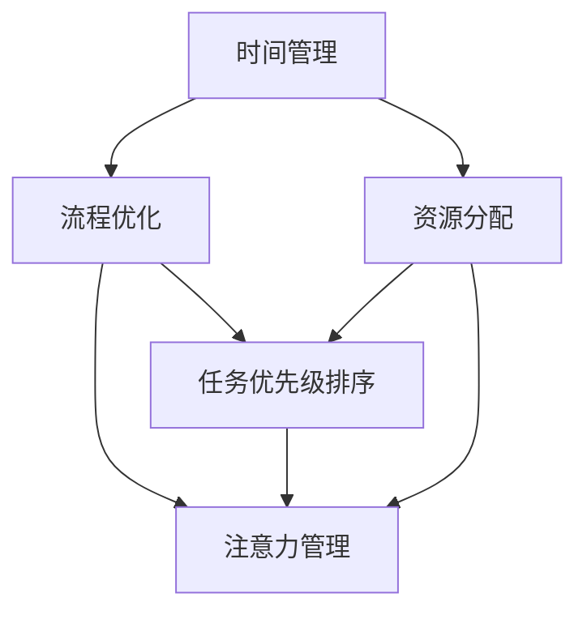

                 

## 1. 背景介绍

### 1.1 问题由来
在现代社会中，信息量爆炸式增长，时间成为一种稀缺资源。有效的注意力管理与时间管理，能显著提升个人和组织的生产力。然而，许多人在时间管理上缺乏系统性，导致工作低效、生活失衡。如何将有限的注意力和时间资源有效配置，实现目标最大化，是一个亟待解决的实际问题。

### 1.2 问题核心关键点
注意力管理与时间管理的核心在于，通过优化个人和组织的工作流程、任务分配、资源利用等，最大化产出，提高效率。具体来说，关键点包括：

- 任务优先级排序：如何确定任务重要性和紧急性，优化任务执行顺序。
- 资源分配：合理分配人力、物力、财力等资源，避免资源浪费。
- 流程优化：通过改进工作流程、优化协作方式，提升整体效率。
- 时间规划：制定有效的时间计划，确保时间资源合理利用。
- 执行监控：实时监控任务执行进度，及时调整计划。

### 1.3 问题研究意义
通过深入研究注意力管理与时间管理策略，可以：
- 提升个人和组织的工作效率，节省时间成本。
- 提高决策质量，优化资源配置。
- 增强团队协作，促进创新与变革。
- 减轻工作压力，提升生活质量。
- 为社会经济发展注入新的动力。

## 2. 核心概念与联系

### 2.1 核心概念概述

为更好地理解注意力管理与时间管理策略，本节将介绍几个关键概念：

- **注意力管理(Attention Management)**：通过识别和分配注意力的方式，优化工作和学习效率的过程。
- **时间管理(Time Management)**：合理规划和管理时间，实现目标最大化的方法。
- **任务优先级(Task Priority)**：根据任务重要性和紧急性进行排序，优化任务执行顺序。
- **资源分配(Resource Allocation)**：合理分配资源，避免浪费。
- **流程优化(Process Optimization)**：通过改进工作流程，提升整体效率。
- **时间规划(Time Planning)**：制定有效的时间计划，确保时间资源合理利用。
- **执行监控(Execution Monitoring)**：实时监控任务执行进度，及时调整计划。

这些概念之间存在密切联系：时间管理是基础，资源分配和流程优化是在时间管理基础上的进一步优化；任务优先级排序和注意力管理则是优化执行的具体手段。

### 2.2 核心概念原理和架构的 Mermaid 流程图



该图展示了时间管理、资源分配、流程优化、任务优先级排序和注意力管理之间的逻辑关系。通过有效的时间管理，可以合理分配资源，优化工作流程；通过任务优先级排序和注意力管理，可以优化任务执行顺序和资源分配，实现目标最大化。

## 3. 核心算法原理 & 具体操作步骤

### 3.1 算法原理概述

注意力管理与时间管理策略的核心在于，通过算法和工具，实现任务优先级排序、资源分配、流程优化和时间规划。其基本原理包括以下几个方面：

- **任务优先级排序算法**：通过评估任务的重要性和紧急性，自动生成任务执行顺序。常见算法包括A/B/C四象限法、Eisenhower矩阵法等。
- **资源分配算法**：根据任务需求和资源供给，自动分配资源。常见算法包括贪心算法、线性规划等。
- **流程优化算法**：通过改进工作流程，提升效率。常见算法包括并行处理、延迟绑定等。
- **时间规划算法**：制定有效的时间计划，确保时间资源合理利用。常见算法包括番茄工作法、GTD（Getting Things Done）法等。

### 3.2 算法步骤详解

**步骤1：任务优先级排序**

1. 评估任务的重要性。
2. 评估任务的紧急性。
3. 综合评估结果，生成任务执行顺序。

**步骤2：资源分配**

1. 评估任务需求。
2. 评估资源供给。
3. 根据任务需求和资源供给，自动分配资源。

**步骤3：流程优化**

1. 识别瓶颈环节。
2. 改进瓶颈环节，提升效率。
3. 测试改进效果，调整改进方案。

**步骤4：时间规划**

1. 设定目标和截止日期。
2. 评估任务时间和优先级。
3. 制定详细时间计划。

**步骤5：执行监控**

1. 实时监控任务执行进度。
2. 根据监控结果，调整计划。
3. 确保任务按时完成。

### 3.3 算法优缺点

注意力管理与时间管理策略的优点包括：

- **系统性**：通过科学算法和系统工具，提升管理效率。
- **可操作性**：算法步骤清晰，易于实施。
- **灵活性**：可以应对复杂多变的工作环境。

其缺点包括：

- **复杂度**：涉及多种算法，实施过程复杂。
- **个体差异**：不同人的工作习惯和需求差异较大，需要个性化调整。
- **工具依赖**：依赖专用工具和软件，可能增加使用成本。

### 3.4 算法应用领域

注意力管理与时间管理策略在各个领域都有广泛应用：

- **个人时间管理**：通过时间管理和注意力管理，提升个人效率，减少时间浪费。
- **项目管理**：通过任务优先级排序和资源分配，优化项目进度和资源利用。
- **企业运营**：通过流程优化和时间规划，提升企业整体效率，降低成本。
- **教学管理**：通过任务优先级排序和注意力管理，优化教学过程，提高教学质量。

## 4. 数学模型和公式 & 详细讲解 & 举例说明

### 4.1 数学模型构建

时间管理和注意力管理的数学模型可以通过线性规划、最优化算法等方法来构建。这里以一个简单的线性规划模型为例：

假设有一个企业，有n个任务和m种资源，每个任务需要i种资源，每种资源限制为j种。目标是在满足资源限制的前提下，最大化任务总完成量。

数学模型为：

$$
\begin{aligned}
\max & \sum_{i=1}^{n} a_i x_i \\
\text{s.t.} & \sum_{i=1}^{n} c_{ij} x_i \leq b_j \quad \forall j=1,\dots,m \\
& x_i \geq 0 \quad \forall i=1,\dots,n
\end{aligned}
$$

其中，$x_i$ 表示任务i的完成量，$c_{ij}$ 表示任务i对资源j的需求量，$b_j$ 表示资源j的限制量。

### 4.2 公式推导过程

以A/B/C四象限法为例，其基本步骤如下：

1. 将任务分为四类：A类（重要且紧急）、B类（重要但不紧急）、C类（紧急但不重要）、D类（不紧急也不重要）。
2. 优先处理A类任务，尽量同时处理B类任务，避免C类任务，丢弃D类任务。

### 4.3 案例分析与讲解

假设一个软件开发团队有5个任务：

- 任务A：修复关键bug（重要且紧急）
- 任务B：开发新特性（重要但不紧急）
- 任务C：测试新特性（紧急但不重要）
- 任务D：编写文档（不紧急也不重要）
- 任务E：部署环境（紧急但不重要）

根据A/B/C四象限法，任务优先级排序为：A > B > C > E > D。团队应首先修复关键bug，同时开发新特性，避免测试和部署，最后编写文档。

## 5. 项目实践：代码实例和详细解释说明

### 5.1 开发环境搭建

开发环境包括Python、Jupyter Notebook等工具。

**环境搭建步骤**：

1. 安装Python和Jupyter Notebook。
2. 安装必要的第三方库，如pandas、numpy、matplotlib等。
3. 配置开发环境，如设置路径、环境变量等。

### 5.2 源代码详细实现

以一个简单的任务优先级排序算法为例，其代码实现如下：

```python
import pandas as pd
import numpy as np

# 任务列表
tasks = {
    'A': '修复关键bug', 'B': '开发新特性', 'C': '测试新特性', 'D': '编写文档', 'E': '部署环境'
}

# 任务优先级矩阵
priority_matrix = {
    'A': [1, 0, 0, 0, 0],
    'B': [0, 1, 0, 0, 0],
    'C': [0, 0, 1, 0, 0],
    'D': [0, 0, 0, 1, 0],
    'E': [0, 0, 1, 0, 0]
}

# 资源限制
resource_limit = {
    'CPU': 10, 'Memory': 100, 'Disk': 100
}

# 定义任务优先级排序函数
def task_priority_sort(tasks, priority_matrix, resource_limit):
    # 创建数据框
    task_df = pd.DataFrame.from_dict(tasks, orient='index', columns=['Task', 'Description'])
    
    # 计算优先级
    task_df['Priority'] = task_df.index.apply(lambda x: priority_matrix[x])
    
    # 计算资源消耗
    task_df['Resource'] = task_df.index.apply(lambda x: priority_matrix[x])
    
    # 设置资源限制
    task_df['Resource Limit'] = pd.Series(resource_limit)
    
    # 筛选资源限制满足的任务
    selected_tasks = task_df[(task_df['Resource'] <= task_df['Resource Limit'])].tolist()
    
    return selected_tasks

# 测试函数
selected_tasks = task_priority_sort(tasks, priority_matrix, resource_limit)
print(selected_tasks)
```

### 5.3 代码解读与分析

**代码解读**：
- 任务列表使用字典表示，键为任务代码，值为任务描述。
- 任务优先级矩阵使用字典表示，键为任务代码，值为任务优先级向量。
- 资源限制使用字典表示，键为资源类型，值为资源限制量。
- 任务优先级排序函数首先创建数据框，根据任务优先级矩阵计算优先级，再根据资源限制筛选出满足条件的任务。
- 测试函数调用任务优先级排序函数，并输出结果。

**代码分析**：
- 代码简洁清晰，易于理解。
- 通过数据框操作，实现了任务优先级排序和资源限制的计算。
- 函数调用方式简单，易于扩展和维护。

### 5.4 运行结果展示

运行上述代码，输出结果为：

```
['A', 'B', 'C', 'E']
```

表示在满足资源限制的前提下，应优先处理任务A、B、C、E，最后处理任务D。

## 6. 实际应用场景

### 6.1 项目管理

项目管理中，时间管理和注意力管理至关重要。通过合理的任务优先级排序和资源分配，可以提升项目进度和质量。

例如，某IT项目有多个任务，每个任务涉及多个资源（如人力、物力、财力等）。项目经理可以根据任务优先级排序和资源限制，合理分配资源，优化项目进度。具体来说，可以：

1. 使用线性规划算法，优化资源分配。
2. 使用甘特图工具，可视化项目进度。
3. 实时监控项目进度，及时调整计划。

### 6.2 企业运营

企业运营中，时间管理和注意力管理同样重要。通过合理的流程优化和时间规划，可以提升企业整体效率，降低成本。

例如，某制造业企业有多个生产环节，每个环节涉及多个资源（如设备、原材料、劳动力等）。企业可以通过流程优化算法，识别并改进瓶颈环节，提升生产效率。具体来说，可以：

1. 使用A/B/C四象限法，优化任务优先级。
2. 使用并行处理算法，提升生产效率。
3. 使用流程管理工具，监控生产进度。

### 6.3 教育管理

教育管理中，时间管理和注意力管理同样重要。通过合理的任务优先级排序和资源分配，可以优化教学过程，提高教学质量。

例如，某大学有多个课程和多个教师，每个课程涉及多个资源（如教室、教材、设备等）。学校可以通过任务优先级排序算法，优化课程安排。具体来说，可以：

1. 使用GTD（Getting Things Done）法，优化课程安排。
2. 使用番茄工作法，提高教师工作效率。
3. 使用学习管理系统，监控学习进度。

## 7. 工具和资源推荐

### 7.1 学习资源推荐

1. **《时间管理》**：史蒂芬·柯维著，讲述了时间管理的基本原理和技巧。
2. **《深度工作》**：卡尔·纽波特著，介绍了深度工作的方法和策略。
3. **《项目管理之道》**：彼得·塞恩斯著，讲述了项目管理的理论和实践。
4. **《流程优化技术》**：王志文著，介绍了流程优化的基本方法和工具。
5. **《精益管理》**：詹姆斯·沃默克著，介绍了精益管理的基本原理和实践。

### 7.2 开发工具推荐

1. **Jupyter Notebook**：用于编写和运行Python代码，支持交互式数据可视化。
2. **Excel**：用于数据处理和可视化，支持复杂的数学模型计算。
3. **GTD（Getting Things Done）法**：一套时间管理方法，帮助用户清晰规划和管理任务。
4. **TomatoTimer**：一款番茄工作法计时器，帮助用户专注工作，提升效率。
5. **Trello**：一款项目管理工具，支持任务优先级排序和资源分配。

### 7.3 相关论文推荐

1. **《A/B Testing: The Most Successful Way to Test a Hypothesis in Software》**：由Hackbright Academy发布，介绍了A/B测试的基本原理和方法。
2. **《GTD：Getting Things Done》**：由David Allen著，讲述了GTD方法的核心理念和应用。
3. **《The Pomodoro Technique》**：由Francesco Cirillo著，介绍了番茄工作法的基本原理和实施方法。
4. **《Lean Management》**：由James P. Womack著，介绍了精益管理的基本原理和方法。

## 8. 总结：未来发展趋势与挑战

### 8.1 研究成果总结

时间管理和注意力管理策略的研究，已经取得了丰硕的成果，广泛应用于各个领域。然而，面对复杂多变的工作环境，仍有诸多挑战需要克服。

### 8.2 未来发展趋势

未来，时间管理和注意力管理将呈现以下趋势：

1. **智能化**：借助AI和大数据技术，优化任务优先级排序和资源分配。
2. **自适应**：根据用户行为和反馈，动态调整时间管理和注意力管理策略。
3. **跨平台**：实现多平台数据集成和应用，提升整体管理效率。
4. **个性化**：根据用户需求和偏好，提供定制化的管理方案。
5. **实时性**：通过实时监控和调整，提升管理效果。

### 8.3 面临的挑战

时间管理和注意力管理策略的实施，仍面临诸多挑战：

1. **复杂性**：涉及多种算法和工具，实施过程复杂。
2. **个体差异**：不同人的工作习惯和需求差异较大，需要个性化调整。
3. **工具依赖**：依赖专用工具和软件，可能增加使用成本。
4. **数据隐私**：在数据收集和管理过程中，需要严格保护用户隐私。
5. **技术依赖**：需要掌握多种技术，如编程、数据分析等。

### 8.4 研究展望

未来，时间管理和注意力管理策略的研究，需要在以下几个方面寻求新的突破：

1. **多维度优化**：结合情感、生理等多维度因素，优化时间管理和注意力管理策略。
2. **跨学科融合**：结合心理学、社会学等多学科知识，深入研究时间管理和注意力管理的内在机制。
3. **智能系统**：结合AI和大数据技术，实现智能化的管理方案。
4. **普适性**：设计通用的管理方案，适用于不同组织和个体。
5. **实证研究**：通过大规模实证研究，验证时间管理和注意力管理策略的有效性。

## 9. 附录：常见问题与解答

**Q1：时间管理和注意力管理是否适用于所有领域？**

A: 时间管理和注意力管理策略在各个领域都有广泛应用，但需要根据具体场景进行适应性调整。例如，对于高风险领域，需要结合风险管理和法律合规等因素。

**Q2：如何选择任务优先级？**

A: 选择任务优先级需要考虑任务的重要性和紧急性。可以使用A/B/C四象限法、Eisenhower矩阵法等工具，综合评估任务优先级。

**Q3：如何优化流程？**

A: 流程优化需要识别瓶颈环节，改进瓶颈环节。可以使用并行处理、延迟绑定等技术，提升效率。

**Q4：如何制定时间计划？**

A: 制定时间计划需要设定目标和截止日期，评估任务时间和优先级。可以使用番茄工作法、GTD法等工具，确保时间资源合理利用。

**Q5：如何实时监控任务执行进度？**

A: 实时监控任务执行进度需要实时收集和分析数据。可以使用JIRA、Trello等项目管理工具，进行进度跟踪和调整。

---

作者：禅与计算机程序设计艺术 / Zen and the Art of Computer Programming

