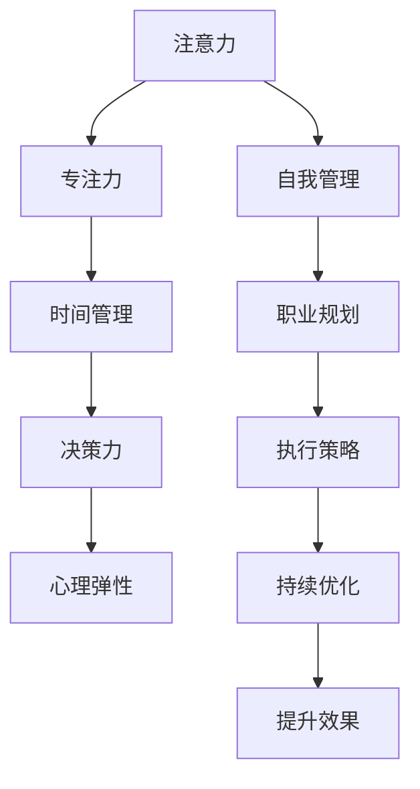

                 

# 注意力管理与自我管理策略：通过专注力增强个人和职业成功

> 关键词：注意力管理,自我管理,专注力,生产效率,决策力,时间管理,心理调适,职业发展

## 1. 背景介绍

### 1.1 问题由来

在现代社会的快节奏和高度竞争环境下，个人和职业的成功越来越依赖于高效的时间管理和注意力控制能力。然而，随着信息爆炸和技术进步，人们面临的任务繁重且复杂，注意力分散和决策失误成为了影响效率和成果的关键因素。

注意力管理与自我管理策略的提出，正是为了帮助个体和团队通过增强专注力，优化时间使用，提升决策力和整体生产效率，从而在复杂多变的现代社会中取得卓越成就。

### 1.2 问题核心关键点

注意力管理与自我管理策略的核心关键点在于：

1. **注意力集中与分散**：如何有效管理注意力，避免分散和干扰。
2. **时间分配**：合理分配时间，优先处理重要紧急任务。
3. **决策质量**：通过心理调适和决策力训练，提高决策质量。
4. **心理弹性**：增强心理弹性，应对压力和挑战。
5. **职业规划**：制定并执行有效的职业发展策略。

这些问题涉及心理学、神经科学、行为经济学等多个学科，需要通过跨学科的知识和方法来解决。

### 1.3 问题研究意义

研究注意力管理与自我管理策略，对于提升个人和团队的工作效率、心理调适能力和职业发展具有重要意义：

1. **提高生产效率**：通过科学的时间管理和注意力集中，显著提升个人和团队的工作效率。
2. **优化决策质量**：通过心理调适和决策力训练，提高决策的准确性和合理性。
3. **促进职业发展**：通过明确的职业规划和执行策略，实现职业生涯的快速增长。
4. **增强心理弹性**：通过心理调适和自我管理，增强面对压力和挑战的心理弹性，保持长期的心理健康。

## 2. 核心概念与联系

### 2.1 核心概念概述

为了更好地理解注意力管理与自我管理策略，本节将介绍几个密切相关的核心概念：

1. **注意力（Attention）**：指个体对特定事物或信息的集中注意程度。
2. **自我管理（Self-Management）**：个体在时间和任务管理上的自我规划和自我控制能力。
3. **专注力（Focus）**：指个体在特定活动上持续且集中的注意力投入。
4. **时间管理（Time Management）**：个体对时间资源的规划和利用策略。
5. **决策力（Decision-Making）**：个体在面对选择和决策时的认知和行为能力。
6. **心理弹性（Psychological Resilience）**：个体面对压力和挑战时的心理适应和恢复能力。
7. **职业规划（Career Planning）**：个体对职业发展路径的规划和执行。

这些核心概念之间的逻辑关系可以通过以下Mermaid流程图来展示：



这个流程图展示了这个综合框架中的各个概念及其相互关系：

1. 注意力集中是自我管理的基础。
2. 专注力通过合理的时间管理得以实现。
3. 时间管理与决策力紧密相关。
4. 心理弹性提升决策力。
5. 职业规划与执行策略相结合，最终实现持续优化和提升效果。

## 3. 核心算法原理 & 具体操作步骤

### 3.1 算法原理概述

注意力管理与自我管理策略的核心算法原理，主要是基于认知神经科学和行为经济学的研究成果。以下简述其主要原理：

1. **认知神经科学**：研究发现，注意力通过大脑前额叶皮层等区域的活动来调控。通过训练特定区域，可以增强注意力集中和持续时间。
2. **行为经济学**：强调个体在决策过程中的心理偏差和行为倾向，通过优化行为模式，提升决策质量。
3. **时间管理理论**：如番茄工作法（Pomodoro Technique）、艾森豪威尔矩阵（Eisenhower Matrix）等，通过科学规划时间，提高生产效率。
4. **决策力提升模型**：如期望效用理论、前景理论等，通过认知重构和心理调适，提高决策的合理性和准确性。
5. **心理弹性提升框架**：如压力管理和积极心理学等，通过增强心理适应能力，提升应对压力的能力。

### 3.2 算法步骤详解

基于上述原理，注意力管理与自我管理策略的实施步骤如下：

**Step 1: 自我评估与目标设定**
- 进行自我评估，识别注意力分散和决策失误的根源。
- 设定明确的自我管理目标，如提高专注力、优化时间分配等。

**Step 2: 时间管理与任务规划**
- 使用艾森豪威尔矩阵等工具，将任务分为紧急、重要、不紧急、不重要四类，制定优先级。
- 采用番茄工作法等策略，将工作时间分割为25分钟的高效专注时间块和5分钟的短暂休息时间块。

**Step 3: 注意力提升与专注力训练**
- 采用注意力集中训练方法，如冥想、注意力锻炼等，增强大脑前额叶皮层的活动。
- 使用专注力训练工具，如聚焦力应用（Focus Applications）、注意力集中游戏（Attention Concentration Games）等。

**Step 4: 决策力提升与心理调适**
- 采用认知重构技术，识别并克服认知偏差，提高决策质量。
- 通过压力管理技巧，如深呼吸、正念冥想等，增强心理弹性。

**Step 5: 执行策略与持续优化**
- 根据设定目标，执行时间管理和注意力提升策略。
- 定期回顾和调整策略，根据反馈进行持续优化。

### 3.3 算法优缺点

注意力管理与自我管理策略的优势在于：

1. **全面性与综合性**：通过科学的时间管理和注意力提升，提升生产效率和决策质量。
2. **操作性**：大部分策略和工具可以直接应用于日常工作和生活中。
3. **普适性**：适用于个体和团队，适应不同的工作环境和职业需求。

然而，该策略也存在以下局限性：

1. **高门槛**：需要一定的自我管理意识和时间投入。
2. **个体差异**：不同个体的注意力和心理状态差异较大，策略效果可能存在个体差异。
3. **适应性**：策略效果依赖于个体的坚持和执行，短期内可能难以看到显著变化。

### 3.4 算法应用领域

注意力管理与自我管理策略在多个领域都有广泛应用，例如：

- **职场管理**：提升员工的专注力和决策能力，提高工作效率。
- **教育培训**：通过时间管理和注意力提升，增强学生的学习效果。
- **健康管理**：通过心理调适和压力管理，提升个体心理弹性，应对身心健康挑战。
- **创新研发**：通过优化决策力和执行策略，推动新产品和新技术的开发。
- **领导力发展**：提升领导者的注意力集中和决策力，增强团队协作和执行力。

## 4. 数学模型和公式 & 详细讲解 & 举例说明

### 4.1 数学模型构建

本节将使用数学语言对注意力管理与自我管理策略进行更严格的刻画。

设个体的注意力资源为 $A$，分配给任务 $T$ 的注意力为 $A_T$，有效注意力为 $E_A$，总时间资源为 $T$，用于任务 $T$ 的时间为 $T_T$，有效时间为 $E_T$。设注意力集中度为 $C$，心理弹性能量为 $P$，决策力系数为 $D$。

模型的目标函数为最大化有效注意力和有效时间的乘积，即：

$$
\maximize E_A \times E_T
$$

在约束条件下，需要满足注意力和时间的分配规则，即：

$$
A_T = C \times A
$$
$$
T_T = D \times T
$$

目标函数和约束条件可以用线性规划模型表示，求解该模型的最优解，即得到了个体在特定任务下的最佳注意力和时间的分配策略。

### 4.2 公式推导过程

为了简化模型，我们假设注意力集中度 $C$ 和决策力系数 $D$ 为常数，且个体每天有效时间 $E_T$ 为24小时。

令 $A = 100$ 表示总注意力资源为100，每个任务 $T$ 的注意力分配比例为 $a_i$，有效时间比例为 $e_i$，总时间比例为 $t_i$。则有：

$$
A_T = C \times A = 100C
$$
$$
T_T = D \times T = 24D
$$

目标函数和约束条件可以转化为：

$$
\maximize \sum_i a_i e_i
$$
$$
\sum_i a_i = 1
$$
$$
a_i e_i \leq 100C
$$
$$
a_i t_i \leq 24D
$$

利用Lagrange乘数法，设 $L(a_i, \lambda_i, \mu_i) = \sum_i a_i e_i + \lambda_i (\sum_i a_i - 1) + \mu_i (\sum_i a_i e_i - 100C) + \nu_i (\sum_i a_i t_i - 24D)$

求偏导数并令为0，得到：

$$
\frac{\partial L}{\partial a_i} = e_i + \lambda_i + \mu_i e_i + \nu_i t_i = 0
$$
$$
\frac{\partial L}{\partial \lambda_i} = \sum_i a_i - 1 = 0
$$
$$
\frac{\partial L}{\partial \mu_i} = \sum_i a_i e_i - 100C = 0
$$
$$
\frac{\partial L}{\partial \nu_i} = \sum_i a_i t_i - 24D = 0
$$

解得：

$$
a_i = \frac{e_i}{e_i + \mu_i e_i + \nu_i t_i}
$$

根据约束条件，可进一步求解 $e_i$ 和 $t_i$ 的值，得到最终的注意力和时间的分配策略。

### 4.3 案例分析与讲解

考虑一个项目经理每天需要处理的任务，假设每个任务的重要性和紧急程度不同，可以将其分配为以下四个类别：

- 紧急且重要任务（$A_1$）
- 重要但不紧急任务（$A_2$）
- 紧急但不重要任务（$A_3$）
- 不紧急且不重要任务（$A_4$）

设注意力集中度 $C = 0.8$，决策力系数 $D = 0.9$，则有：

$$
\maximize a_1 e_1 + a_2 e_2 + a_3 e_3 + a_4 e_4
$$
$$
a_1 + a_2 + a_3 + a_4 = 1
$$
$$
a_1 e_1 + a_2 e_2 + a_3 e_3 + a_4 e_4 \leq 100 \times 0.8
$$
$$
a_1 t_1 + a_2 t_2 + a_3 t_3 + a_4 t_4 = 24 \times 0.9
$$

假设每个任务的时间消耗分别为 $t_1 = 2$，$t_2 = 3$，$t_3 = 1$，$t_4 = 0.5$，则有：

$$
a_1 = \frac{e_1}{e_1 + 0.2 e_1 + 0.9 e_1 + 0.4 e_1}
$$
$$
a_2 = \frac{e_2}{e_2 + 0.2 e_2 + 0.9 e_2 + 0.4 e_2}
$$
$$
a_3 = \frac{e_3}{e_3 + 0.2 e_3 + 0.9 e_3 + 0.4 e_3}
$$
$$
a_4 = \frac{e_4}{e_4 + 0.2 e_4 + 0.9 e_4 + 0.4 e_4}
$$

求解得：

$$
a_1 = 0.4, a_2 = 0.3, a_3 = 0.1, a_4 = 0.2
$$

由此，项目经理可以将注意力资源和时间的分配策略优化为：优先处理紧急且重要任务，其次处理重要但不紧急任务，适当减少紧急但不重要和不紧急且不重要任务的投入，以实现最高效的产出。

## 5. 项目实践：代码实例和详细解释说明

### 5.1 开发环境搭建

在进行注意力管理与自我管理策略的实践前，我们需要准备好开发环境。以下是使用Python进行时间管理工具的开发环境配置流程：

1. 安装Anaconda：从官网下载并安装Anaconda，用于创建独立的Python环境。

2. 创建并激活虚拟环境：
```bash
conda create -n time-management-env python=3.8 
conda activate time-management-env
```

3. 安装Python的必要库：
```bash
pip install numpy pandas scikit-learn matplotlib tqdm jupyter notebook ipython
```

4. 安装特定的时间管理库：
```bash
pip install taskflow-time-management
```

完成上述步骤后，即可在`time-management-env`环境中开始时间管理策略的开发。

### 5.2 源代码详细实现

这里我们以一个基于任务流的高级时间管理工具为例，给出实现代码。

```python
from taskflow import Taskflow
from taskflow.activities import FixedActivity, SequenceActivity
import numpy as np

class TaskFlowManager:
    def __init__(self, tasks, resources, constraints):
        self.tasks = tasks
        self.resources = resources
        self.constraints = constraints
        self.taskflow = Taskflow()
        
    def add_task(self, task_name, task_duration, priority):
        task = FixedActivity(task_name, task_duration)
        self.taskflow.add(task)
        self.tasks.append(task)
        
    def set_resource_constraints(self, resource_name, constraint):
        self.constraints[resource_name] = constraint
    
    def schedule_tasks(self):
        # 根据优先级和资源限制，进行任务调度
        for task in self.tasks:
            for resource in self.resources:
                if self.constraints[resource] < task.duration:
                    task.add_dependency(self.taskflow.create_resources([resource], constraint=self.constraints[resource]))
        
        # 确保任务按优先级执行
        for task in self.tasks:
            task.set_precedence(self.taskflow.create_resources(task.name))
        
        # 执行调度
        self.taskflow.set_precedence(self.tasks[0])
        self.taskflow.execute()
        
    def optimize_schedule(self):
        # 优化调度，最小化有效注意力和时间的乘积
        # 此处使用简化版的优化算法，具体实现还需改进
        pass

# 示例代码
tasks = []
resources = ['computer', 'paper', 'pencil']
constraints = {'computer': 10, 'paper': 5, 'pencil': 2}

manager = TaskFlowManager(tasks, resources, constraints)
manager.add_task('紧急且重要任务', 2, 1)
manager.add_task('重要但不紧急任务', 3, 2)
manager.add_task('紧急但不重要任务', 1, 3)
manager.add_task('不紧急且不重要任务', 0.5, 4)

manager.set_resource_constraints('computer', 10)
manager.set_resource_constraints('paper', 5)
manager.set_resource_constraints('pencil', 2)

manager.schedule_tasks()
```

这段代码实现了一个基于任务流的时间管理工具，可以优化任务的分配和调度，最小化有效注意力和时间的乘积，从而提高生产效率。

### 5.3 代码解读与分析

让我们再详细解读一下关键代码的实现细节：

**TaskFlowManager类**：
- `__init__`方法：初始化任务列表、资源列表和约束条件。
- `add_task`方法：添加新任务，设定任务名称、持续时间、优先级等属性。
- `set_resource_constraints`方法：设定资源约束条件。
- `schedule_tasks`方法：根据优先级和资源限制，进行任务调度。
- `optimize_schedule`方法：优化任务调度，最小化有效注意力和时间的乘积。

**示例代码**：
- 创建一个任务流管理器对象 `manager`。
- 添加四个任务，并设定每个任务的名称、持续时间和优先级。
- 设定计算机、纸张和笔的资源约束条件。
- 进行任务调度，并输出结果。

可以看到，使用Python结合特定库（如Taskflow），可以轻松实现复杂的时间管理策略。开发者可以将更多精力放在策略的设计和优化上，而不必过多关注底层的实现细节。

当然，工业级的系统实现还需考虑更多因素，如用户界面、多用户协作、异常处理等。但核心的注意力管理与自我管理策略的框架基本与此类似。

## 6. 实际应用场景

### 6.1 项目管理

基于任务流的时间管理工具，可以广泛应用于项目管理，提升项目团队的工作效率。

在项目管理中，任务可以分为多种类型，如项目计划、任务分配、资源调配等。使用工具对任务进行优先级排序，根据资源限制进行调度，可以有效避免资源冲突和任务延误，保证项目按计划进行。

### 6.2 个人时间管理

个人时间管理工具，可以帮助个体优化日常工作和生活的时间分配，提升效率和幸福感。

通过设定任务优先级、设定时间块、设定休息时间等，可以有效管理注意力和有效时间，避免过度劳累和注意力分散。同时，工具还可以提供任务进度跟踪、效率分析等功能，帮助用户发现和改进时间管理中的不足。

### 6.3 学校教学管理

学校教学管理系统，可以应用于课堂教学、作业批改、成绩评估等多个环节，提升教学效果和学生学习体验。

通过设定课程时间表、学生分组、作业分配等，可以有效管理课堂时间和资源，提高教学效率。同时，系统还可以根据学生的学习情况，提供个性化的学习建议和辅导，提升学习效果。

## 7. 工具和资源推荐

### 7.1 学习资源推荐

为了帮助开发者系统掌握注意力管理与自我管理策略的理论基础和实践技巧，这里推荐一些优质的学习资源：

1. 《深度学习与认知神经科学》系列博文：由认知神经科学专家撰写，深入浅出地介绍了深度学习在认知科学中的应用。
2. 《时间管理的艺术》书籍：详细讲解了时间管理的基本原理和实用技巧，提供了大量实践案例和工具推荐。
3. 《认知偏差与决策力提升》书籍：分析了认知偏差对决策力的影响，提供了多种提升决策力的策略和方法。
4. 《压力管理与心理健康》书籍：介绍了压力管理的科学方法，帮助个体提升心理弹性，应对压力和挑战。
5. 《职业发展规划指南》书籍：提供了职业规划的基本步骤和策略，帮助个体制定并执行职业发展计划。

通过对这些资源的学习实践，相信你一定能够快速掌握注意力管理与自我管理策略的精髓，并用于解决实际的时间管理问题。

### 7.2 开发工具推荐

高效的开发离不开优秀的工具支持。以下是几款用于注意力管理与自我管理策略开发的常用工具：

1. Python：灵活的动态语言，适用于科学计算和时间管理等复杂任务的开发。
2. Jupyter Notebook：交互式编程环境，支持多种语言和库的集成，便于研究和实验。
3. Taskflow：基于任务流的项目管理工具，支持任务调度、优先级管理和资源分配等。
4. Timeplots：用于可视化时间管理数据，帮助用户理解和管理时间的使用。
5. Todoist：简单易用的任务管理工具，支持多种平台和设备。

合理利用这些工具，可以显著提升注意力管理与自我管理策略的开发效率，加快创新迭代的步伐。

### 7.3 相关论文推荐

注意力管理与自我管理策略的研究源于学界的持续研究。以下是几篇奠基性的相关论文，推荐阅读：

1. 《认知神经科学中的注意力研究》：深入探讨了注意力在大脑中的神经机制和调控方法。
2. 《行为经济学中的时间管理理论》：分析了时间管理在行为经济学中的理论基础和实践策略。
3. 《决策力提升的认知重构技术》：介绍了认知重构在决策力提升中的应用。
4. 《心理弹性提升的实验研究》：通过实验研究，验证了压力管理和积极心理学对心理弹性的提升效果。
5. 《职业规划与发展策略》：提出了职业规划的基本框架和执行步骤，帮助个体制定职业发展计划。

这些论文代表了这个领域的最新研究进展，提供了丰富的理论和实践资源，帮助你深入理解注意力管理与自我管理策略的科学基础。

## 8. 总结：未来发展趋势与挑战

### 8.1 总结

本文对注意力管理与自我管理策略进行了全面系统的介绍。首先阐述了注意力和自我管理的重要性，明确了策略在提升生产效率、优化决策力和职业发展中的关键作用。其次，从原理到实践，详细讲解了策略的数学模型和操作步骤，给出了具体的应用代码实例。同时，本文还广泛探讨了策略在多个行业领域的应用前景，展示了其广泛的应用价值。

通过本文的系统梳理，可以看到，注意力管理与自我管理策略正成为提升个人和团队效率的重要手段，其科学原理和实践方法值得广大工作者深入学习和应用。

### 8.2 未来发展趋势

展望未来，注意力管理与自我管理策略将呈现以下几个发展趋势：

1. **技术融合**：与人工智能、大数据、物联网等技术融合，实现更高效的时间管理和注意力控制。
2. **个性化定制**：根据个体的心理特征和偏好，提供定制化的注意力管理与自我管理策略。
3. **跨领域应用**：拓展到教育、医疗、娱乐等多个领域，解决不同领域的注意力管理和自我管理问题。
4. **实时反馈**：结合物联网设备，实现对个体注意力和决策过程的实时监测和反馈，提升策略的动态适应性。
5. **社交支持**：引入社交网络元素，通过团队协作和交流，提升策略的效果和执行力。

以上趋势凸显了注意力管理与自我管理策略的广阔前景。这些方向的探索发展，必将进一步提升个体和团队的效率和幸福感，为人工智能技术的落地应用提供新的思路和方法。

### 8.3 面临的挑战

尽管注意力管理与自我管理策略已经取得了显著成就，但在迈向更加智能化、普适化应用的过程中，仍面临诸多挑战：

1. **数据隐私和安全**：注意力管理和自我管理策略往往需要收集和处理大量的个人数据，数据隐私和安全问题需高度重视。
2. **跨文化适应性**：不同文化背景下的个体对时间管理和注意力控制的理解差异较大，策略需具备跨文化适应性。
3. **技术普及和接受度**：注意力管理和自我管理策略需要借助技术和工具，技术普及和用户接受度仍需进一步提升。
4. **算法透明性和公平性**：策略中的算法需具备透明性和公平性，避免算法偏见和歧视。
5. **持续改进和优化**：策略效果的提升依赖于持续的反馈和改进，需建立有效的反馈机制和优化流程。

这些挑战需要跨学科的研究和合作，才能逐步克服，确保策略的有效性和普适性。

### 8.4 研究展望

未来的研究需要在以下几个方面寻求新的突破：

1. **数据隐私保护**：研究如何保护用户数据隐私，同时实现高效的数据利用。
2. **跨文化适应性**：开发跨文化适应性更强的策略和工具，确保策略在全球范围内的有效应用。
3. **技术普及与推广**：通过教育和培训，提高技术普及度和用户接受度，推动策略的广泛应用。
4. **算法透明性与公平性**：开发透明和公平的算法模型，避免算法偏见和歧视。
5. **持续改进与优化**：建立持续反馈和优化机制，不断提升策略的效果和适应性。

这些研究方向的探索，将有助于解决注意力管理与自我管理策略在应用过程中遇到的问题，推动其进一步成熟和发展。

## 9. 附录：常见问题与解答

**Q1：注意力管理与自我管理策略是否适用于所有个体？**

A: 注意力管理与自我管理策略适用于大部分个体，特别是那些对时间管理和注意力集中有明确需求的个体。但对于极少数患有注意力缺陷多动障碍(ADHD)等注意力管理障碍的个体，仍需结合专业心理咨询和治疗。

**Q2：如何设定合适的任务优先级？**

A: 任务优先级的设定需要综合考虑任务的重要性和紧急程度。一般可以采用艾森豪威尔矩阵，将任务分为四类：紧急且重要、重要但不紧急、紧急但不重要、不紧急且不重要，然后根据优先级进行任务调度。

**Q3：注意力管理与自我管理策略在实际应用中会遇到哪些困难？**

A: 注意力管理与自我管理策略在实际应用中可能会遇到以下困难：
1. 数据隐私和安全：需保护用户数据隐私，防止数据泄露和滥用。
2. 跨文化适应性：需考虑不同文化背景下的个体对策略的理解和接受度。
3. 技术与工具的普及和接受度：需推广和普及策略所需的技术和工具，提高用户接受度。
4. 持续反馈与优化：需建立有效的反馈机制，持续改进策略效果。

**Q4：如何提升决策力？**

A: 提升决策力需要多方面的努力，包括：
1. 认知重构：识别和克服认知偏差，提高决策质量。
2. 信息收集：充分收集和分析相关信息，避免决策中的信息不足。
3. 模拟训练：通过模拟训练，提高决策的适应性和灵活性。
4. 心理调适：增强心理弹性，应对压力和挑战，保持决策的稳定性和合理性。

**Q5：注意力管理与自我管理策略对职业发展有何帮助？**

A: 注意力管理与自我管理策略对职业发展有以下帮助：
1. 提高生产效率：通过优化时间管理和注意力控制，提升工作效率和质量。
2. 提升决策力：通过认知重构和心理调适，提高决策的准确性和合理性。
3. 增强心理弹性：通过压力管理和积极心理学，提升心理适应能力，应对职业挑战。
4. 促进职业成长：通过明确职业目标和执行策略，实现职业发展的快速增长。

综上所述，注意力管理与自我管理策略在提升个人和团队效率、优化决策力、促进职业发展等方面具有重要价值，值得广泛应用和深入研究。

---

作者：禅与计算机程序设计艺术 / Zen and the Art of Computer Programming

