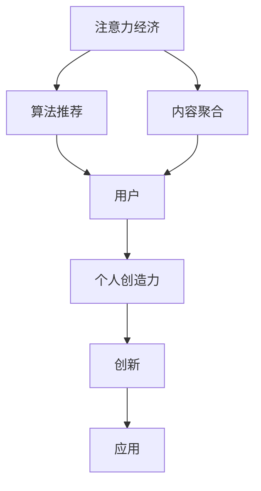

                 

# 注意力经济与个人创造力的关系

## 1. 背景介绍

### 1.1 问题由来

随着互联网和数字技术的普及，信息传播的方式发生了根本性的变革。信息不再仅限于文本和音频，而是扩展到了视频、图片、直播等多种形式。这种信息爆炸的现象，使得人们面临着前所未有的信息过载问题。在这样一个环境中，个体如何有效地获取、处理和利用信息，成为了一个新的热门话题。

### 1.2 问题核心关键点

注意力经济（Attention Economy），作为与信息过载相对应的一个概念，指的是在信息过载时代，个体或组织需要通过各种手段（如算法推荐、内容聚合等）来吸引、保持和转移人们的注意力，以实现商业价值或信息传播效果。而个人创造力，则是指个体在信息处理和整合过程中，结合自身知识、经验和灵感，进行创新和创造的能力。在注意力经济的背景下，如何平衡个人创造力和注意力获取的关系，成为了一个亟待解决的问题。

### 1.3 问题研究意义

在注意力经济时代，个人创造力面临着前所未有的机遇和挑战。一方面，互联网和数字技术的普及，为个体提供了前所未有的工具和平台，使得个人创造力得以在更广阔的范围内发挥和传播。另一方面，信息过载和注意力分散的问题，也使得个体在创造过程中面临更多干扰和噪音，难以专注于创造性工作。研究注意力经济与个人创造力的关系，对于理解现代信息社会的运作机制，提升个人和组织的创新能力，具有重要的理论和实践意义。

## 2. 核心概念与联系

### 2.1 核心概念概述

- **注意力经济（Attention Economy）**：在信息过载时代，个体或组织通过各种手段吸引、保持和转移人们的注意力，实现商业价值或信息传播效果。
- **个人创造力（Individual Creativity）**：个体在信息处理和整合过程中，结合自身知识、经验和灵感，进行创新和创造的能力。
- **算法推荐（Algorithm Recommendation）**：通过数据分析和机器学习算法，自动为用户推荐相关信息，吸引其注意力。
- **内容聚合（Content Aggregation）**：将分散在不同来源的信息聚合到一起，提供给用户，以提升信息获取的效率和效果。
- **信息过载（Information Overload）**：个体面临的信息量超过其处理能力的现象，导致注意力分散，难以专注于重要信息。

这些核心概念通过数据、技术和市场机制相互关联，共同塑造了现代信息社会中个体创造力的发挥机制。以下通过Mermaid流程图展示这些概念之间的关系：



### 2.2 核心概念原理和架构

注意力经济的实现依赖于以下几个关键技术：

- **推荐算法**：通过分析用户的浏览历史、搜索习惯等数据，预测用户可能感兴趣的内容，实现个性化推荐。
- **搜索引擎**：通过爬取和索引网络上的信息，为用户提供快速搜索和浏览的入口。
- **信息聚合工具**：将分散在不同平台的信息聚合到一起，为用户提供一站式信息服务。
- **个性化展示**：通过广告、动态新闻推送等方式，吸引用户注意力，保持其对平台或内容的持续关注。

这些技术通过市场机制（如广告收入、订阅费等）得以运转和盈利，形成了一个完整的注意力经济生态。而个人创造力的发挥则依赖于个体对于信息的高效处理和整合，以及对于新知识的吸收和创新。在注意力经济的背景下，如何通过技术手段提升个体创造力，是一个重要研究课题。

## 3. 核心算法原理 & 具体操作步骤

### 3.1 算法原理概述

注意力经济与个人创造力的关系，可以通过以下几个层面进行分析：

- **注意力获取**：通过推荐算法等手段，吸引用户注意力，使其专注在特定内容上。
- **信息处理**：用户对接收到的信息进行过滤、筛选和整合，形成新的见解和知识。
- **创新过程**：在信息处理的基础上，用户结合自身知识和经验，进行创新和创造。
- **成果应用**：将创新成果应用于实际工作、研究或其他领域，实现知识传播和价值转化。

### 3.2 算法步骤详解

以下以推荐算法为例，介绍如何在注意力经济中提升个人创造力：

1. **数据收集**：收集用户的历史行为数据，如浏览记录、搜索关键词、点击率等。
2. **模型训练**：使用机器学习算法（如协同过滤、内容推荐算法等）训练推荐模型，预测用户可能感兴趣的内容。
3. **个性化推荐**：将推荐结果展示给用户，吸引其注意力，并指导其信息获取行为。
4. **信息整合**：用户结合推荐信息，进行深入阅读和分析，形成新的知识和见解。
5. **创新实践**：在信息整合的基础上，用户结合自身专业知识和经验，进行创新实践，产生新成果。
6. **成果传播**：通过社交媒体、学术论文等途径，将创新成果传播出去，实现知识共享和价值转化。

### 3.3 算法优缺点

#### 3.3.1 优点

1. **提升信息获取效率**：通过个性化推荐，用户可以快速获取对其有用的信息，节省时间。
2. **增强知识获取深度**：推荐算法可以过滤无关信息，帮助用户集中精力学习关键知识。
3. **激发创新潜力**：通过持续的信息刺激和引导，用户有更多机会接触新思想和新技术，激发创造力。

#### 3.3.2 缺点

1. **信息过载风险**：推荐算法可能过度推荐相似信息，导致用户信息过载。
2. **注意力分散**：推荐算法可能引导用户关注不重要或低价值内容，分散注意力。
3. **信息偏见**：推荐算法可能受到数据偏见的影响，导致推荐结果不公平或偏颇。

### 3.4 算法应用领域

注意力经济和推荐算法已经在多个领域得到了广泛应用，例如：

- **电商推荐**：电商平台通过推荐算法，向用户展示可能感兴趣的商品，提升转化率和销售额。
- **新闻推送**：新闻应用通过个性化推荐，为用户提供感兴趣的新闻资讯，增加用户粘性。
- **音乐推荐**：音乐平台通过推荐算法，根据用户听歌历史推荐新歌，提升用户满意度。
- **视频推荐**：视频平台通过推荐算法，向用户展示可能感兴趣的视频内容，提升观看时长和互动率。
- **学习平台**：在线学习平台通过推荐算法，为用户推荐适合其学习进度和兴趣的课程，提升学习效果。

## 4. 数学模型和公式 & 详细讲解 & 举例说明

### 4.1 数学模型构建

推荐算法的核心在于为用户推荐最相关的物品，其数学模型可以表示为：

$$
f_{\theta}(x_i, y_i) = \theta^T \phi(x_i) + \sum_{j \in J} y_j \cdot (\theta_j \cdot \phi_j(x_i))
$$

其中，$f_{\theta}(x_i, y_i)$表示物品$x_i$对用户$y_i$的相关度，$\theta$为模型参数，$\phi(x_i)$为物品$x_i$的特征向量表示，$J$为用户集合。

### 4.2 公式推导过程

推荐算法的核心在于利用用户行为数据和物品特征数据，训练一个预测模型，预测用户对每个物品的相关度。其推导过程如下：

1. **特征提取**：将物品和用户数据转换为特征向量，使用$\phi(x_i)$和$\phi_j(x_i)$表示。
2. **模型训练**：使用历史行为数据和物品特征数据，训练一个线性回归模型$f_{\theta}(x_i, y_i)$，其中$\theta$为模型参数。
3. **预测相关度**：对于新的物品$x_i$，使用已训练的模型$f_{\theta}(x_i, y_i)$计算其对用户的相关度。

### 4.3 案例分析与讲解

以电商推荐为例，用户历史行为数据（如浏览、点击、购买记录）和物品特征数据（如商品类别、价格、评价等），被用来训练推荐模型。训练好的模型可以预测用户对新商品的潜在兴趣，从而实现个性化推荐。

例如，假设用户A最近浏览并购买了运动鞋，推荐系统根据用户A的浏览历史，预测其对其他运动相关商品（如运动服、运动配件）的兴趣，并推荐这些商品给用户A。用户A在看到推荐结果后，可能进一步浏览和购买推荐的商品，从而提升电商平台的销售效果。

## 5. 项目实践：代码实例和详细解释说明

### 5.1 开发环境搭建

在项目实践过程中，需要搭建Python开发环境，使用Scikit-learn和TensorFlow等库进行推荐算法开发。以下是搭建环境的步骤：

1. **安装Python**：在Linux或Mac上安装Python 3.x，建议使用Anaconda发行版。
2. **安装Anaconda**：从官网下载并安装Anaconda，并激活虚拟环境。
3. **安装Scikit-learn和TensorFlow**：使用pip安装Scikit-learn和TensorFlow库，并进行依赖管理。

### 5.2 源代码详细实现

以下是使用TensorFlow进行电商推荐算法的代码实现：

```python
import tensorflow as tf
import pandas as pd
import numpy as np

# 读取数据
data = pd.read_csv('data.csv')

# 数据预处理
features = data[['features']]
labels = data['labels']

# 特征向量化
feature_vectors = tf.feature_column.categorical_column_with_identity(
    'features', num_buckets=len(data['features'].unique()))

# 构建模型
model = tf.keras.Sequential([
    tf.keras.layers.Dense(128, activation='relu'),
    tf.keras.layers.Dense(64, activation='relu'),
    tf.keras.layers.Dense(1, activation='sigmoid')])

# 编译模型
model.compile(optimizer='adam',
              loss='binary_crossentropy',
              metrics=['accuracy'])

# 训练模型
model.fit(feature_vectors, labels, epochs=10)

# 预测新数据
new_data = pd.read_csv('new_data.csv')
new_features = new_data['features'].values
new_labels = model.predict(new_features)
```

### 5.3 代码解读与分析

**数据读取**：使用pandas库读取电商推荐数据集，包含用户行为记录和物品特征信息。

**数据预处理**：将用户行为数据和物品特征数据进行向量化处理，使用Scikit-learn的`categorical_column_with_identity`函数将类别型特征转换为数值型特征。

**模型构建**：使用TensorFlow构建一个简单的全连接神经网络模型，包含三个全连接层。

**模型编译**：使用Adam优化器和二元交叉熵损失函数编译模型，并进行准确率监控。

**模型训练**：使用训练数据训练模型，进行10个epoch的迭代训练。

**模型预测**：使用训练好的模型对新数据进行预测，并输出预测结果。

### 5.4 运行结果展示

在训练过程中，可以使用TensorBoard工具可视化模型的损失曲线和准确率变化情况，以便调整模型参数和优化策略。

## 6. 实际应用场景

### 6.1 社交媒体推荐

社交媒体平台通过推荐算法，向用户展示其关注的好友、文章和视频等内容，提升用户粘性和平台活跃度。用户可以在推荐结果中选择感兴趣的内容进行互动，实现信息获取和社交交流的双重目的。

### 6.2 学术资源推荐

学术资源平台通过推荐算法，向用户推荐相关的学术论文、报告和书籍，提升学术研究的效率和效果。用户可以在推荐结果中进行进一步阅读和引用，扩展自身的知识体系。

### 6.3 金融投资建议

金融投资平台通过推荐算法，向用户提供个性化的投资建议和市场分析，提升投资决策的准确性和成功率。用户可以结合推荐信息进行投资组合优化，实现资产增值。

### 6.4 未来应用展望

未来，随着AI技术的进一步发展，推荐算法将更加智能化和个性化，能够更好地满足用户需求，提升信息获取效率和创造力。同时，用户注意力管理和个人隐私保护也将成为新的研究热点，需要更多技术手段和伦理规范来保障用户权益。

## 7. 工具和资源推荐

### 7.1 学习资源推荐

1. **《推荐系统原理与算法》**：介绍了推荐系统的基本原理和多种算法，适合初学者入门。
2. **《深度学习基础》**：讲解了深度学习的基本原理和常用技术，适合对机器学习有一定基础的学习者。
3. **《TensorFlow实战》**：介绍了TensorFlow的使用方法和实践案例，适合TensorFlow新手。

### 7.2 开发工具推荐

1. **Anaconda**：Python发行版，提供了强大的虚拟环境和依赖管理功能。
2. **Jupyter Notebook**：开源的交互式编程工具，适合数据科学和机器学习项目开发。
3. **TensorBoard**：可视化工具，用于监控和调试深度学习模型的训练过程。

### 7.3 相关论文推荐

1. **《基于协同过滤的推荐系统》**：介绍了协同过滤算法的基本原理和应用。
2. **《深度学习在推荐系统中的应用》**：讲解了深度学习在推荐系统中的各种应用。
3. **《用户注意力建模与推荐算法》**：探讨了注意力机制在推荐算法中的应用。

## 8. 总结：未来发展趋势与挑战

### 8.1 研究成果总结

本文详细介绍了注意力经济和推荐算法的基本原理和实践方法，通过分析注意力获取、信息处理、创新过程和成果应用等环节，探讨了个人创造力与注意力经济之间的关系。在实际应用中，推荐算法已经被广泛应用于多个领域，显著提升了信息获取效率和用户满意度。

### 8.2 未来发展趋势

未来，推荐算法将更加智能化和个性化，通过更多的深度学习和跨领域技术融合，提升信息获取和用户创造力的效率和效果。同时，用户注意力管理和隐私保护也将成为新的研究方向，需要在技术手段和伦理规范上做出更多探索。

### 8.3 面临的挑战

尽管推荐算法在信息获取和用户创造力提升方面已经取得了显著成果，但仍面临以下挑战：

1. **信息过载问题**：推荐算法可能过度推荐相似内容，导致用户信息过载。
2. **算法偏见问题**：推荐算法可能受到数据偏见的影响，导致推荐结果不公平或偏颇。
3. **用户隐私保护**：推荐系统需要保护用户隐私，防止数据泄露和滥用。
4. **模型可解释性**：推荐算法需要具备更好的可解释性，让用户理解其决策过程。
5. **系统鲁棒性**：推荐系统需要在面对不同数据分布和异常情况时保持稳定性和鲁棒性。

### 8.4 研究展望

为了应对以上挑战，未来推荐算法的研究需要关注以下几个方向：

1. **个性化推荐技术**：开发更加智能化和个性化的推荐算法，提升推荐效果和用户满意度。
2. **跨领域推荐技术**：将推荐算法与跨领域知识和技术结合，提升信息获取和创造力的跨领域融合能力。
3. **用户注意力管理**：研究用户注意力管理和控制方法，提升信息获取效率和用户专注力。
4. **隐私保护技术**：开发隐私保护技术，保护用户数据隐私和安全。
5. **可解释性研究**：提升推荐算法的可解释性，让用户理解和信任其决策过程。

总之，注意力经济和推荐算法的研究已经取得了重要进展，未来仍需要更多的技术创新和伦理规范来推动其健康发展，更好地服务于用户和社会的创造力提升。

## 9. 附录：常见问题与解答

**Q1: 推荐算法对信息过载问题有什么影响？**

A: 推荐算法在吸引用户注意力的同时，也增加了信息过载的风险。当用户接收到的推荐信息过多时，可能导致其注意力分散，难以专注于重要信息。为解决这一问题，可以采用多轮推荐、动态调整推荐策略等方法，减少推荐信息的数量和频率。

**Q2: 如何保证推荐算法的公平性？**

A: 推荐算法可能会受到数据偏见的影响，导致推荐结果不公平或偏颇。为保证推荐算法的公平性，可以采用多样性约束、用户反馈机制等方法，对推荐结果进行矫正和优化。

**Q3: 推荐算法如何保护用户隐私？**

A: 推荐算法需要保护用户数据隐私，防止数据泄露和滥用。可以通过匿名化处理、差分隐私等技术手段，保护用户数据隐私。同时，需要建立透明的数据使用规则，让用户了解其数据如何被使用。

**Q4: 推荐算法如何提升用户注意力管理？**

A: 推荐算法可以通过个性化推荐、时间动态调整等方式，提升用户注意力管理。例如，在用户专注工作的时间段内，减少推荐信息的频率，避免干扰。同时，可以结合用户反馈和行为数据，优化推荐策略，提升用户专注力和满意度。

**Q5: 推荐算法如何提升用户创造力？**

A: 推荐算法可以通过个性化推荐，帮助用户获取更多有价值的信息，提升其知识储备和创新能力。例如，向用户推荐最新的科研论文、创新案例等，激发其创新灵感。同时，可以结合用户兴趣和行为数据，提供针对性的信息推荐，提升其创造力的实现效果。

总之，推荐算法在信息获取和用户创造力提升方面具有重要的作用，但仍需要更多的技术创新和伦理规范来保障其健康发展。只有在技术手段和用户需求的双重驱动下，推荐算法才能更好地服务于用户和社会的创新和发展。

