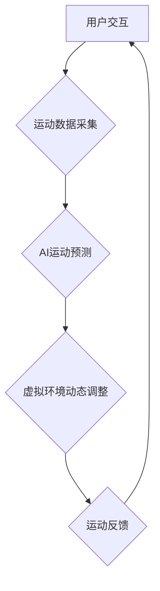

                 

## 虚拟运动现实：AI模拟的极限体验

> 关键词：虚拟现实、增强现实、人工智能、运动模拟、游戏开发、机器学习、神经网络

### 1. 背景介绍

虚拟现实（VR）和增强现实（AR）技术近年来发展迅速，为我们提供了沉浸式体验和交互式环境。而人工智能（AI）的不断进步，特别是深度学习和机器学习领域的突破，为虚拟运动现实（VMR）的实现提供了强大的技术支撑。VMR旨在通过AI模拟逼真的运动体验，让用户在虚拟环境中进行各种运动活动，例如跑步、游泳、攀岩、打球等。

传统的运动模拟技术往往局限于物理模型和图形渲染，难以完全捕捉运动的复杂性和真实感。而AI技术的加入，可以实现更精准的运动预测、更自然的运动反馈和更个性化的运动体验。例如，AI可以根据用户的运动轨迹、身体特征和运动目标，动态调整虚拟环境的物理属性，提供更逼真的运动阻力、平衡感和反馈。

### 2. 核心概念与联系

VMR的核心概念包括虚拟环境、运动模拟、AI驱动和用户交互。

* **虚拟环境：** VMR需要构建逼真的虚拟环境，包括场景、物体、光照、音效等。这可以利用3D建模、纹理贴图、物理引擎等技术实现。
* **运动模拟：** VMR需要模拟用户的运动行为，包括运动轨迹、姿态、速度、力量等。这可以利用物理引擎、运动捕捉技术和AI算法实现。
* **AI驱动：** AI算法可以根据用户的运动数据，预测用户的运动意图，动态调整虚拟环境的属性，提供更逼真的运动体验。
* **用户交互：** 用户可以通过VR头显、手柄、传感器等设备与虚拟环境进行交互，控制虚拟角色的运动和动作。

**Mermaid 流程图**



### 3. 核心算法原理 & 具体操作步骤

#### 3.1 算法原理概述

VMR的核心算法主要包括运动捕捉、运动预测和运动反馈。

* **运动捕捉：** 用于记录用户的真实运动数据，例如关节角度、速度、加速度等。常用的运动捕捉技术包括光学运动捕捉、惯性运动捕捉和深度学习运动捕捉。
* **运动预测：** 基于用户的运动数据，利用机器学习算法预测用户的未来运动轨迹和动作。常用的算法包括递归神经网络（RNN）、长短期记忆网络（LSTM）和卷积神经网络（CNN）。
* **运动反馈：** 根据运动预测结果，动态调整虚拟环境的属性，例如阻力、重力、碰撞等，提供逼真的运动反馈。

#### 3.2 算法步骤详解

**运动捕捉步骤：**

1. 选择合适的运动捕捉技术，根据应用场景和预算选择光学、惯性或深度学习运动捕捉。
2. 安装和配置运动捕捉设备，确保设备能够准确捕捉用户的运动数据。
3. 使用运动捕捉软件采集用户的运动数据，并进行数据预处理，例如去除噪声、校正偏差等。

**运动预测步骤：**

1. 选择合适的机器学习算法，根据运动数据的特点和预测精度要求选择RNN、LSTM或CNN等算法。
2. 训练机器学习模型，使用采集到的运动数据训练模型，使其能够准确预测用户的未来运动轨迹和动作。
3. 对模型进行评估，使用测试数据评估模型的预测精度，并根据评估结果调整模型参数。

**运动反馈步骤：**

1. 根据运动预测结果，动态调整虚拟环境的属性，例如阻力、重力、碰撞等。
2. 使用物理引擎或其他技术实现虚拟环境的动态调整，确保运动反馈逼真自然。
3. 收集用户反馈，根据用户的反馈调整运动反馈算法，提高用户体验。

#### 3.3 算法优缺点

**运动捕捉算法：**

* **优点：** 能够准确捕捉用户的真实运动数据，提供高精度运动反馈。
* **缺点：** 硬件成本较高，操作复杂，易受环境干扰。

**运动预测算法：**

* **优点：** 可以预测用户的未来运动轨迹，实现更自然的运动体验。
* **缺点：** 算法复杂度高，需要大量训练数据，预测精度受限于算法和数据质量。

**运动反馈算法：**

* **优点：** 可以根据运动预测结果动态调整虚拟环境，提供逼真的运动体验。
* **缺点：** 需要考虑虚拟环境的物理特性和用户反馈，算法设计较为复杂。

#### 3.4 算法应用领域

VMR算法在以下领域具有广泛的应用前景：

* **游戏开发：** 为游戏玩家提供更沉浸式和交互式的运动体验。
* **体育训练：** 模拟各种运动场景，帮助运动员进行训练和评估。
* **医疗康复：** 为患者提供个性化的康复训练方案，帮助他们恢复运动能力。
* **教育培训：** 通过虚拟环境模拟真实场景，提高学习效果。

### 4. 数学模型和公式 & 详细讲解 & 举例说明

#### 4.1 数学模型构建

VMR的数学模型主要包括运动动力学模型、运动预测模型和运动反馈模型。

* **运动动力学模型：** 描述虚拟角色在虚拟环境中的运动状态，包括位置、速度、加速度等。常用的运动动力学模型包括牛顿第二定律和欧拉积分法。
* **运动预测模型：** 利用机器学习算法预测用户的未来运动轨迹和动作。常用的模型包括RNN、LSTM和CNN。
* **运动反馈模型：** 根据运动预测结果，动态调整虚拟环境的属性，例如阻力、重力、碰撞等。常用的模型包括物理引擎和反馈控制算法。

#### 4.2 公式推导过程

**牛顿第二定律：**

$$F = ma$$

其中：

* $F$ 是力
* $m$ 是质量
* $a$ 是加速度

**欧拉积分法：**

$$v_{n+1} = v_n + at$$

$$x_{n+1} = x_n + v_{n+1}t$$

其中：

* $v_n$ 是第 $n$ 时刻的速度
* $x_n$ 是第 $n$ 时刻的位置
* $a$ 是加速度
* $t$ 是时间步长

#### 4.3 案例分析与讲解

**举例说明：**

假设一个虚拟角色在虚拟环境中跑步，其质量为 $m$，速度为 $v$，加速度为 $a$。根据牛顿第二定律，我们可以计算出跑步所需的力：

$$F = ma$$

如果虚拟角色遇到阻力，则阻力会影响其加速度，从而影响其运动轨迹。我们可以利用欧拉积分法计算出虚拟角色在不同时间点的速度和位置。

**运动预测模型：**

我们可以利用RNN、LSTM或CNN等机器学习算法，训练一个模型来预测用户的未来运动轨迹。例如，我们可以使用用户的过去运动数据，预测其未来跑步的速度和方向。

**运动反馈模型：**

我们可以根据运动预测结果，动态调整虚拟环境的属性，例如增加阻力，模拟用户的疲劳感。

### 5. 项目实践：代码实例和详细解释说明

#### 5.1 开发环境搭建

VMR项目的开发环境需要包括以下软件：

* **操作系统：** Windows、macOS或Linux
* **编程语言：** Python、C++或Java
* **游戏引擎：** Unity、Unreal Engine或Godot
* **运动捕捉软件：** Vicon、OptiTrack或OpenPose
* **机器学习库：** TensorFlow、PyTorch或Keras

#### 5.2 源代码详细实现

以下是一个简单的VMR代码示例，使用Python和OpenCV库实现运动捕捉和运动反馈：

```python
import cv2
import numpy as np

# 初始化摄像头
cap = cv2.VideoCapture(0)

# 运动捕捉
while True:
    ret, frame = cap.read()
    # 使用OpenCV检测人体关键点
    # ...
    # 获取人体关键点坐标
    # ...
    # ...

    # 运动反馈
    # 根据人体关键点坐标，调整虚拟角色的运动状态
    # ...

    # 显示视频帧
    cv2.imshow('VMR', frame)

    # 按键退出
    if cv2.waitKey(1) & 0xFF == ord('q'):
        break

cap.release()
cv2.destroyAllWindows()
```

#### 5.3 代码解读与分析

这段代码首先初始化摄像头，然后使用OpenCV库检测人体关键点。获取人体关键点坐标后，可以根据这些坐标调整虚拟角色的运动状态，例如改变其位置、姿态和速度。

#### 5.4 运行结果展示

运行这段代码后，可以实时捕捉用户的运动数据，并将其应用于虚拟角色的运动控制。

### 6. 实际应用场景

#### 6.1 体育训练

VMR可以模拟各种体育运动场景，例如篮球、足球、游泳等，帮助运动员进行训练和评估。例如，运动员可以使用VR头显体验虚拟篮球赛场，进行投篮练习，并根据虚拟环境的反馈调整自己的投篮姿势和力度。

#### 6.2 医疗康复

VMR可以为患者提供个性化的康复训练方案，帮助他们恢复运动能力。例如，患者可以使用VR头显进行虚拟步行训练，根据虚拟环境的反馈调整自己的步态和平衡感。

#### 6.3 教育培训

VMR可以利用虚拟环境模拟真实场景，提高学习效果。例如，学生可以使用VR头显体验虚拟博物馆，进行历史文化学习，并与虚拟导游进行互动。

#### 6.4 未来应用展望

VMR技术在未来将有更广泛的应用场景，例如：

* **虚拟体育比赛：** 虚拟运动现实可以为用户提供沉浸式的虚拟体育比赛体验，例如虚拟马拉松、虚拟足球赛等。
* **虚拟健身房：** 用户可以在虚拟健身房中进行各种运动训练，并获得个性化的运动指导。
* **虚拟旅游：** 用户可以利用VMR技术体验虚拟旅游，例如虚拟攀登珠穆朗玛峰、虚拟游览大堡礁等。

### 7. 工具和资源推荐

#### 7.1 学习资源推荐

* **书籍：**
    * 《Reinforcement Learning: An Introduction》
    * 《Deep Learning》
    * 《Computer Vision: Algorithms and Applications》
* **在线课程：**
    * Coursera：机器学习、深度学习、计算机视觉
    * Udacity：无人驾驶汽车、人工智能工程师
    * edX：人工智能、数据科学

#### 7.2 开发工具推荐

* **游戏引擎：** Unity、Unreal Engine、Godot
* **运动捕捉软件：** Vicon、OptiTrack、OpenPose
* **机器学习库：** TensorFlow、PyTorch、Keras

#### 7.3 相关论文推荐

* **运动捕捉：**
    * "Real-Time Human Pose Estimation Using Part Affinity Fields"
    * "DeepLabCut: markerless pose estimation of humans, animals and plants with deep learning"
* **运动预测：**
    * "Recurrent Neural Networks for Human Activity Recognition"
    * "Long Short-Term Memory Networks for Human Motion Prediction"
* **运动反馈：**
    * "A Survey of Haptic Feedback Techniques for Virtual Reality"
    * "Virtual Reality and Haptic Feedback for Rehabilitation"

### 8. 总结：未来发展趋势与挑战

#### 8.1 研究成果总结

VMR技术近年来取得了显著进展，特别是AI算法的进步为VMR的实现提供了强大的技术支撑。VMR技术已经应用于体育训练、医疗康复、教育培训等领域，并展现出巨大的应用潜力。

#### 8.2 未来发展趋势

VMR技术未来将朝着以下方向发展：

* **更逼真的虚拟环境：** 利用更先进的图形渲染技术和物理引擎，构建更逼真的虚拟环境，提供更沉浸式的体验。
* **更精准的运动捕捉：** 利用更先进的传感器技术和机器学习算法，实现更精准的运动捕捉，提供更精确的运动反馈。
* **更个性化的运动体验：** 利用用户数据和AI算法，提供更个性化的运动体验，例如根据用户的运动目标和身体特征，定制运动方案。
* **更广泛的应用场景：** VMR技术将应用于更多领域，例如虚拟体育比赛、虚拟健身房、虚拟旅游等。

#### 8.3 面临的挑战

VMR技术还面临一些挑战：

* **硬件成本：** 高精度运动捕捉设备和高性能VR头显的成本较高，限制了VMR技术的普及。
* **算法复杂度：** VMR算法的复杂度较高，需要大量的训练数据和计算资源。
* **用户体验：** 虚拟运动体验与现实运动体验存在差异，需要不断改进算法和技术，提高用户体验。

#### 8.4 研究展望

未来，VMR技术将继续发展，并与其他新兴技术融合，例如增强现实、云计算和5G网络，为用户提供更丰富、更沉浸式的虚拟运动体验。


### 9. 附录：常见问题与解答

**常见问题：**

* **VMR和VR有什么区别？**

VMR是基于VR技术的，但VMR更注重运动体验的模拟和反馈。VR主要关注沉浸式的视觉和音频体验，而VMR则更注重运动的真实感和交互性。

* **VMR技术有哪些应用场景？**

VMR技术可以应用于体育训练、医疗康复、教育培训、娱乐休闲等领域。

* **VMR技术有哪些发展趋势？**

VMR技术未来将朝着更逼真的虚拟环境、更精准的运动捕捉、更个性化的运动体验和更广泛的应用场景发展。

**解答：**

* **VMR和VR的区别：** VMR是基于VR技术的，但VMR更注重运动体验的模拟和反馈。VR主要关注沉浸式的视觉和音频体验，而VMR则更注重运动的真实感和交互性。
* **VMR技术的应用场景：** VMR技术可以应用于体育训练、医疗康复、教育培训、娱乐休闲等领域。
* **VMR技术的未来发展趋势：** VMR技术未来将朝着更逼真的虚拟环境、更精准的运动捕捉、更个性化的运动体验和更广泛的应用场景发展。


作者：禅与计算机程序设计艺术 / Zen and the Art of Computer Programming<end_of_turn>

