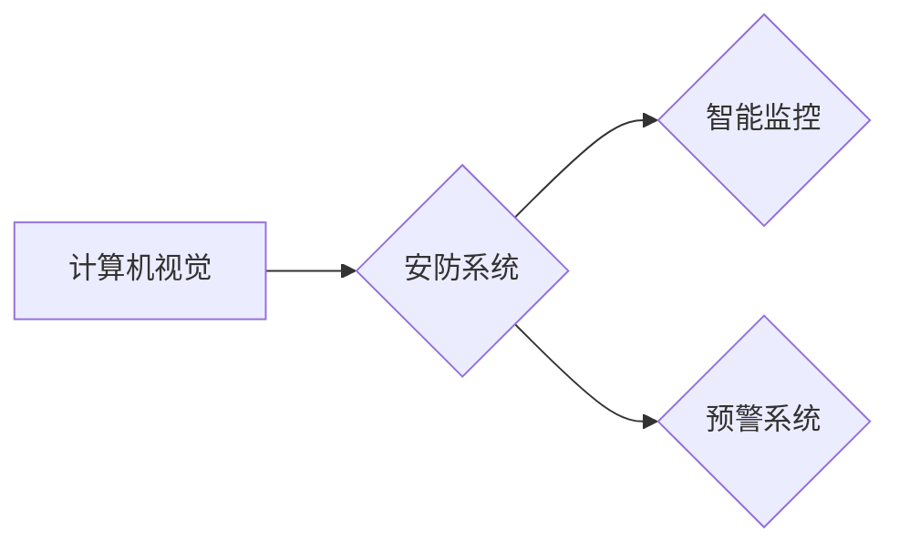

                 

## 计算机视觉在安防系统中的应用：智能监控与预警

> 关键词：计算机视觉、安防系统、智能监控、预警、目标检测、图像识别、深度学习、机器学习

## 1. 背景介绍

随着社会发展和科技进步，安防需求日益增长。传统安防系统主要依靠人工监控，存在着效率低、成本高、易疲劳等问题。计算机视觉技术作为人工智能的重要分支，以其强大的图像识别、分析和处理能力，为安防领域带来了革命性的变革。

计算机视觉技术在安防系统中的应用，主要体现在以下几个方面：

* **智能监控：** 利用摄像头采集的图像数据，通过计算机视觉算法实现对场景的实时监控，例如人脸识别、行为识别、异常检测等。
* **预警系统：** 基于对图像数据的分析，识别潜在的威胁和危险，并及时发出预警，例如入侵检测、火灾预警、交通事故预警等。
* **事件追溯：** 当事件发生时，利用计算机视觉技术对视频进行分析，提取关键信息，例如嫌疑人特征、事件时间、事件地点等，帮助警方快速定位和追溯事件。

## 2. 核心概念与联系

### 2.1 计算机视觉

计算机视觉是指赋予计算机“看”的能力，使其能够理解和解释图像和视频信息。它涉及到图像处理、模式识别、机器学习等多个领域。

### 2.2 安防系统

安防系统是指用于保护人员、财产和信息安全的系统，包括物理安防和信息安全两大类。

### 2.3 智能监控与预警

智能监控是指利用计算机视觉技术对场景进行实时监控，并根据预设规则或算法进行分析和判断，例如识别目标、跟踪目标、报警等。预警系统是指利用计算机视觉技术对图像数据进行分析，识别潜在的威胁和危险，并及时发出预警，例如入侵检测、火灾预警、交通事故预警等。

**核心概念与联系流程图**



## 3. 核心算法原理 & 具体操作步骤

### 3.1 算法原理概述

计算机视觉在安防系统中的应用主要依赖于以下核心算法：

* **目标检测：** 识别图像或视频中的人、车、物等目标，并对其进行定位和分类。
* **图像识别：** 识别图像或视频中的特定物体、场景或事件，例如人脸识别、车牌识别、场景分类等。
* **行为识别：** 分析目标的行为模式，识别目标的活动类型，例如行走、奔跑、爬行、打架等。
* **异常检测：** 识别图像或视频中与正常情况不符的异常行为或事件，例如入侵、火灾、爆炸等。

### 3.2 算法步骤详解

以目标检测为例，其具体操作步骤如下：

1. **图像预处理：** 对原始图像进行预处理，例如调整亮度、对比度、去除噪声等，以提高算法的性能。
2. **特征提取：** 从预处理后的图像中提取特征，例如颜色特征、纹理特征、形状特征等。
3. **目标候选框生成：** 利用特征提取结果，生成候选目标框，即可能包含目标的区域。
4. **目标分类和回归：** 对每个候选目标框进行分类和回归，判断其是否包含目标，并预测目标的边界框。
5. **后处理：** 对检测结果进行后处理，例如去除重复检测、合并相邻目标等，以提高检测的准确率和效率。

### 3.3 算法优缺点

**优点：**

* **自动化程度高：** 可以自动识别和分析图像数据，减少人工干预。
* **效率高：** 可以实时处理大量图像数据，提高监控效率。
* **准确率高：** 随着算法的不断改进，目标检测、图像识别等算法的准确率不断提高。

**缺点：**

* **计算资源需求高：** 某些算法需要大量的计算资源，例如深度学习算法。
* **环境依赖性强：** 算法的性能受光照、角度、分辨率等环境因素的影响。
* **数据依赖性强：** 算法的训练需要大量的标注数据，数据质量直接影响算法的性能。

### 3.4 算法应用领域

目标检测、图像识别、行为识别等算法广泛应用于安防领域，例如：

* **人脸识别：** 用于身份验证、人员管理、嫌疑人追踪等。
* **车牌识别：** 用于车辆管理、违章记录、交通监控等。
* **入侵检测：** 用于识别非法进入、越界等行为。
* **火灾预警：** 用于识别火灾初期特征，及时发出预警。
* **交通事故预警：** 用于识别交通事故发生的可能性，及时发出预警。

## 4. 数学模型和公式 & 详细讲解 & 举例说明

### 4.1 数学模型构建

目标检测算法通常采用基于深度学习的模型，例如YOLO、SSD、Faster R-CNN等。这些模型的数学基础是神经网络，其结构由多个层组成，每一层都包含多个神经元。神经元之间通过权重连接，并进行加权求和和激活函数处理，最终输出目标检测结果。

### 4.2 公式推导过程

神经网络的训练过程是通过优化模型参数来最小化损失函数的过程。损失函数通常定义为预测结果与真实结果之间的差异。常用的损失函数包括均方误差（MSE）、交叉熵损失（Cross-Entropy Loss）等。

**均方误差（MSE）公式：**

$$MSE = \frac{1}{N} \sum_{i=1}^{N} (y_i - \hat{y}_i)^2$$

其中：

* $N$ 是样本数量
* $y_i$ 是真实值
* $\hat{y}_i$ 是预测值

**交叉熵损失（Cross-Entropy Loss）公式：**

$$CE = -\frac{1}{N} \sum_{i=1}^{N} \sum_{j=1}^{C} y_{ij} \log(\hat{y}_{ij})$$

其中：

* $N$ 是样本数量
* $C$ 是类别数量
* $y_{ij}$ 是真实标签，如果第 $i$ 个样本属于第 $j$ 个类别，则 $y_{ij} = 1$，否则 $y_{ij} = 0$
* $\hat{y}_{ij}$ 是预测概率，表示第 $i$ 个样本属于第 $j$ 个类别的概率

### 4.3 案例分析与讲解

以YOLO目标检测算法为例，其训练过程需要大量的标注数据，例如图像和目标的边界框坐标。通过训练，YOLO模型能够学习到目标的特征和位置关系，并能够对新的图像进行目标检测。

## 5. 项目实践：代码实例和详细解释说明

### 5.1 开发环境搭建

* **操作系统：** Ubuntu 18.04 或更高版本
* **编程语言：** Python 3.6 或更高版本
* **深度学习框架：** TensorFlow 或 PyTorch
* **其他依赖库：** OpenCV、NumPy、Matplotlib等

### 5.2 源代码详细实现

以下是一个使用TensorFlow实现YOLO目标检测的简单代码示例：

```python
import tensorflow as tf

# 定义模型结构
model = tf.keras.models.Sequential([
    # ...
])

# 加载预训练模型权重
model.load_weights('yolov3.h5')

# 预处理图像
image = tf.keras.preprocessing.image.load_img('image.jpg', target_size=(416, 416))
image = tf.keras.preprocessing.image.img_to_array(image)
image = tf.expand_dims(image, axis=0)

# 进行目标检测
predictions = model.predict(image)

# 后处理结果
# ...
```

### 5.3 代码解读与分析

* 代码首先定义了YOLO目标检测模型的结构，可以使用预定义的模型结构或自定义模型结构。
* 然后加载预训练模型权重，可以加速模型训练和部署。
* 预处理图像，将图像调整为模型输入的尺寸，并转换为NumPy数组。
* 进行目标检测，将预处理后的图像输入模型进行预测。
* 后处理结果，例如提取目标边界框、置信度和类别信息等。

### 5.4 运行结果展示

运行代码后，将输出目标检测的结果，例如目标边界框、置信度和类别信息等。

## 6. 实际应用场景

### 6.1 智能监控

* **公共场所监控：** 在车站、机场、商场等公共场所部署摄像头，利用计算机视觉技术对人员流动进行监控，识别异常行为，例如聚集、追逐、斗殴等，提高公共安全。
* **校园安全监控：** 在校园内部署摄像头，利用计算机视觉技术对学生和教师进行身份识别，监控校园环境，预防校园暴力和安全事故。
* **家庭安全监控：** 利用智能摄像头，对家庭环境进行监控，识别陌生人进入、物品丢失等异常情况，提高家庭安全。

### 6.2 预警系统

* **入侵检测：** 利用计算机视觉技术对边界区域进行监控，识别非法进入、越界等行为，及时发出预警，提高安全防范能力。
* **火灾预警：** 利用计算机视觉技术识别火灾初期特征，例如浓烟、火焰、高温等，及时发出预警，减少火灾损失。
* **交通事故预警：** 利用计算机视觉技术识别交通事故发生的可能性，例如车辆突然变道、超速行驶、疲劳驾驶等，及时发出预警，预防交通事故发生。

### 6.3 其他应用场景

* **智慧城市建设：** 利用计算机视觉技术对城市环境进行监控，例如交通流量、环境污染、公共设施使用情况等，为城市管理提供数据支持。
* **医疗诊断辅助：** 利用计算机视觉技术辅助医生进行疾病诊断，例如识别肿瘤、骨折等，提高诊断准确率。
* **工业自动化：** 利用计算机视觉技术进行产品质量检测、缺陷识别、机器人视觉引导等，提高生产效率和产品质量。

### 6.4 未来应用展望

随着计算机视觉技术的不断发展，其在安防领域的应用将更加广泛和深入。未来，计算机视觉技术将与其他人工智能技术融合，例如自然语言处理、机器学习等，形成更加智能、高效的安防系统。

## 7. 工具和资源推荐

### 7.1 学习资源推荐

* **书籍：**
    * 《深度学习》 - Ian Goodfellow, Yoshua Bengio, Aaron Courville
    * 《计算机视觉：算法与应用》 - Richard Szeliski
* **在线课程：**
    * Coursera: Deep Learning Specialization
    * Udacity: Computer Vision Nanodegree
* **博客和论坛：**
    * OpenCV官方博客
    * TensorFlow官方博客
    * PyTorch官方博客

### 7.2 开发工具推荐

* **深度学习框架：** TensorFlow, PyTorch
* **图像处理库：** OpenCV
* **数据标注工具：** LabelImg, VGG Image Annotator

### 7.3 相关论文推荐

* **YOLO目标检测算法论文：**
    * You Only Look Once: Unified, Real-Time Object Detection
* **SSD目标检测算法论文：**
    * SSD: Single Shot MultiBox Detector
* **Faster R-CNN目标检测算法论文：**
    * Faster R-CNN: Towards Real-Time Object Detection with Region Proposal Networks

## 8. 总结：未来发展趋势与挑战

### 8.1 研究成果总结

计算机视觉技术在安防领域的应用取得了显著成果，例如目标检测、图像识别、行为识别等算法的准确率不断提高，应用场景也越来越广泛。

### 8.2 未来发展趋势

* **更准确、更鲁棒的算法：** 研究更先进的算法，提高目标检测、图像识别等算法的准确率和鲁棒性，能够应对更复杂的环境和场景。
* **边缘计算和云计算的融合：** 将目标检测、图像识别等算法部署到边缘设备，实现实时处理和决策，并与云端进行数据共享和协同分析。
* **多模态融合：** 将计算机视觉技术与其他传感器数据融合，例如音频、传感器数据等，实现更全面的信息感知和分析。
* **隐私保护和伦理问题：** 研究如何保护个人隐私和数据安全，并解决计算机视觉技术在安防领域的伦理问题。

### 8.3 面临的挑战

* **数据标注成本高：** 训练深度学习模型需要大量的标注数据，数据标注成本高昂，是制约计算机视觉技术发展的瓶颈之一。
* **算法解释性和可信度低：** 深度学习模型的决策过程难以解释，其可信度和可靠性需要进一步提高。
* **硬件资源需求高：** 某些算法需要大量的计算资源，部署成本较高。

### 8.4 研究展望

未来，计算机视觉技术将继续在安防领域发挥重要作用，为构建更加安全、智能的社会贡献力量。


## 9. 附录：常见问题与解答

**1. 计算机视觉技术在安防领域的应用有哪些？**

计算机视觉技术在安防领域的应用包括智能监控、预警系统、事件追溯等。

**2. 目标检测算法有哪些？**

常见的目标检测算法包括YOLO、SSD、Faster R-CNN等。

**3. 如何搭建计算机视觉项目开发环境？**

需要安装操作系统、编程语言、深度学习框架、图像处理库等。

**4. 如何进行目标检测算法的训练？**

需要准备标注数据，选择合适的模型结构，并使用深度学习框架进行训练。

**5. 计算机视觉技术在安防领域的应用有哪些挑战？**

数据标注成本高、算法解释性和可信度低、硬件资源需求高是计算机视觉技术在安防领域的应用面临的挑战。


作者：禅与计算机程序设计艺术 / Zen and the Art of Computer Programming 
<end_of_turn>

