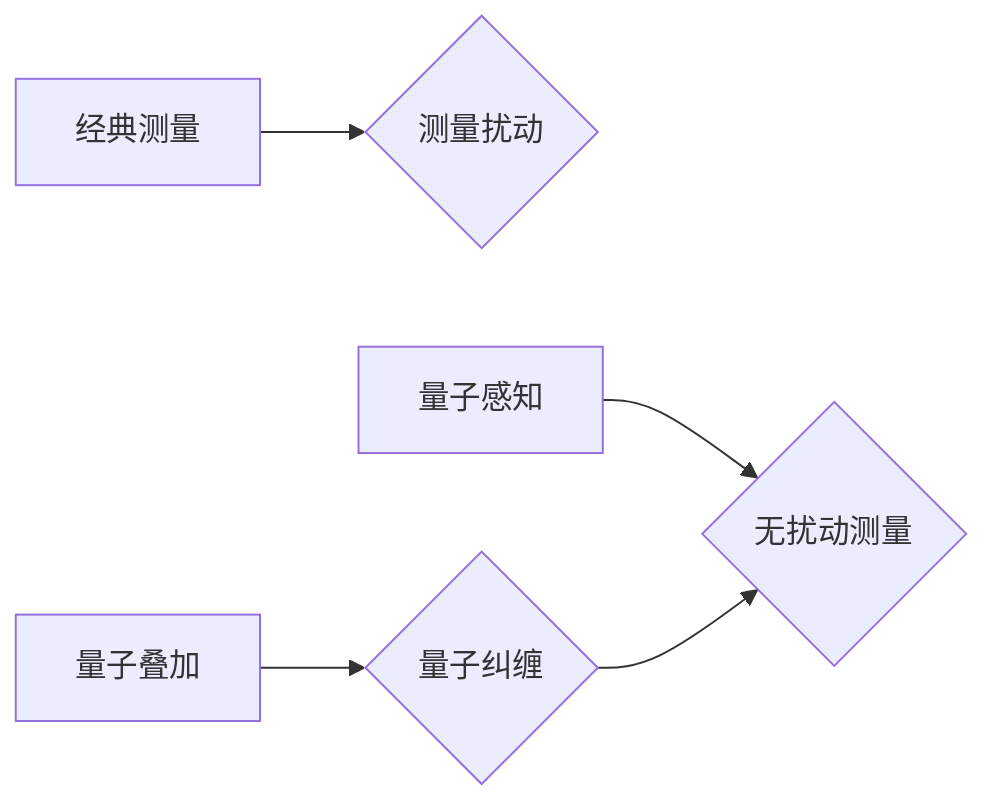

                 

## 量子感知：突破经典测量极限

> 关键词：量子感知、量子测量、量子叠加、量子纠缠、量子算法、量子计算、超光速通信

## 1. 背景介绍

在经典物理学的世界里，我们对物体进行测量时，会不可避免地对其产生扰动。这被称为“测量问题”，它限制了我们对微观世界的精细探测。然而，量子力学揭示了微观世界存在着一种全新的测量方式，即“量子感知”。

量子感知的核心思想是利用量子叠加和量子纠缠等量子力学现象，实现对微观系统进行无扰动测量。这种测量方式能够突破经典物理学的测量极限，让我们更深入地了解微观世界的奥秘。

## 2. 核心概念与联系

### 2.1 量子叠加

量子叠加是指量子系统可以同时处于多个状态的叠加态。例如，一个电子可以同时处于自旋向上和自旋向下的状态，直到被测量时才会坍缩到其中一个状态。

### 2.2 量子纠缠

量子纠缠是指两个或多个量子系统之间存在着一种特殊的关联关系，即使它们相隔很远，测量一个系统的状态也会瞬间影响另一个系统的状态。这种关联关系超越了经典物理学的局限性，被称为“非局部关联”。

### 2.3 量子感知原理

量子感知利用量子叠加和量子纠缠的特性，实现对微观系统进行无扰动测量。

**流程图：**



## 3. 核心算法原理 & 具体操作步骤

### 3.1 算法原理概述

量子感知算法的核心是利用量子叠加和量子纠缠的特性，将待测量的微观系统与一个量子态关联起来。通过对关联的量子态进行测量，可以间接地获取待测量的微观系统的信息，而不会对该系统产生扰动。

### 3.2 算法步骤详解

1. **准备量子态：** 创建一个处于量子叠加态的量子系统，例如一个光子处于偏振叠加态。

2. **关联量子系统：** 将待测量的微观系统与准备好的量子态关联起来。例如，可以通过光子与原子相互作用的方式实现关联。

3. **测量关联量子态：** 对关联的量子态进行测量，例如测量光子的偏振方向。

4. **提取信息：** 根据测量结果，可以间接地获取待测量的微观系统的信息。例如，光子的偏振方向与原子的自旋方向相关，因此可以通过测量光子的偏振方向来推断原子的自旋状态。

### 3.3 算法优缺点

**优点：**

* 无扰动测量：量子感知算法能够实现对微观系统进行无扰动测量，避免了经典测量带来的扰动。
* 超越经典极限：量子感知算法能够突破经典物理学的测量极限，实现对微观系统更精细的探测。

**缺点：**

* 实验复杂度高：量子感知算法的实验操作较为复杂，需要精确控制量子系统的状态。
* 测量精度有限：量子感知算法的测量精度受到量子噪声的影响，存在一定的局限性。

### 3.4 算法应用领域

量子感知算法在以下领域具有广泛的应用前景：

* **量子通信：** 实现安全可靠的量子通信，突破经典通信的安全性限制。
* **量子计算：** 作为量子计算的组成部分，实现对量子比特的无扰动测量，提高量子计算的精度和效率。
* **精密测量：** 实现对微观系统的更精细的测量，例如原子钟、激光干涉仪等。
* **生物医学：** 用于生物医学成像、疾病诊断等领域，实现对生物体的无创探测。

## 4. 数学模型和公式 & 详细讲解 & 举例说明

### 4.1 数学模型构建

量子感知算法的数学模型基于量子叠加和量子纠缠的理论。

假设一个待测量的微观系统处于状态 $|ψ⟩$, 并且与一个量子态 $|φ⟩$ 纠缠在一起，形成一个纠缠态 $|ψ⟩|φ⟩$. 

其中，$|ψ⟩$ 代表待测量的微观系统状态，$|φ⟩$ 代表关联的量子态。

### 4.2 公式推导过程

根据量子力学的叠加原理，我们可以将纠缠态 $|ψ⟩|φ⟩$ 表示为：

$$|ψ⟩|φ⟩ = \sum_i c_i |ψ_i⟩|φ_i⟩$$

其中，$|ψ_i⟩$ 和 $|φ_i⟩$ 分别代表待测量的微观系统和关联量子态的基态，$c_i$ 是相应的叠加系数。

当对关联量子态 $|φ⟩$ 进行测量时，测量结果会坍缩到其中一个基态 $|φ_i⟩$. 

根据量子力学的测量原理，测量结果 $|φ_i⟩$ 会影响纠缠态 $|ψ⟩|φ⟩$ 的状态，导致待测量的微观系统状态坍缩到 $|ψ_i⟩$.

因此，我们可以通过测量关联量子态 $|φ⟩$ 的结果，间接地获取待测量的微观系统状态 $|ψ⟩$ 的信息。

### 4.3 案例分析与讲解

例如，我们可以利用量子感知算法来测量一个原子的自旋状态。

1. 准备一个处于偏振叠加态的光子作为关联量子态。

2. 将原子与光子进行相互作用，实现它们的纠缠。

3. 对光子进行偏振测量，得到测量结果。

4. 根据测量结果，可以推断出原子的自旋状态。

## 5. 项目实践：代码实例和详细解释说明

### 5.1 开发环境搭建

量子感知算法的实现需要使用量子计算平台和编程语言。

例如，我们可以使用 IBM Quantum Experience 平台和 Python 语言来实现量子感知算法。

### 5.2 源代码详细实现

```python
from qiskit import QuantumCircuit, Aer, execute

# 创建量子电路
qc = QuantumCircuit(2, 2)

# 初始化量子比特
qc.h(0)  # 将第一个量子比特置于叠加态

# 实现纠缠操作
qc.cx(0, 1)  # 将第一个量子比特与第二个量子比特进行纠缠

# 测量量子比特
qc.measure(0, 0)
qc.measure(1, 1)

# 运行量子电路
simulator = Aer.get_backend('qasm_simulator')
job = execute(qc, simulator, shots=1024)
result = job.result()
counts = result.get_counts(qc)

# 打印测量结果
print(counts)
```

### 5.3 代码解读与分析

这段代码实现了简单的量子感知算法。

首先，我们创建了一个量子电路，并初始化第一个量子比特为叠加态。然后，我们使用 CNOT 门实现第一个量子比特与第二个量子比特的纠缠。最后，我们测量两个量子比特，并打印测量结果。

### 5.4 运行结果展示

运行这段代码后，我们会得到一个包含测量结果的字典。

例如，如果测量结果为 `{'00': 512, '11': 512}`, 则表明两个量子比特都处于对应基态。

## 6. 实际应用场景

### 6.1 量子通信

量子感知算法可以用于实现安全可靠的量子通信。

例如，我们可以利用量子纠缠来传输信息，即使信息被窃听者截获，也不会泄露信息内容。

### 6.2 量子计算

量子感知算法可以作为量子计算的组成部分，实现对量子比特的无扰动测量，提高量子计算的精度和效率。

例如，我们可以利用量子感知算法来实现量子算法的纠错和优化。

### 6.3 精密测量

量子感知算法可以用于实现对微观系统的更精细的测量，例如原子钟、激光干涉仪等。

例如，我们可以利用量子感知算法来实现更精确的原子钟，从而提高时间测量精度。

### 6.4 未来应用展望

量子感知算法在未来具有广阔的应用前景，例如：

* **量子传感器：** 实现对各种物理量的高精度测量，例如温度、压力、磁场等。
* **量子材料研究：** 用于研究和开发新型量子材料，例如拓扑绝缘体、超导材料等。
* **量子人工智能：** 用于构建新型量子人工智能算法，实现更强大的机器学习和人工智能能力。

## 7. 工具和资源推荐

### 7.1 学习资源推荐

* **IBM Quantum Experience:** https://quantum-computing.ibm.com/
* **Qiskit:** https://qiskit.org/
* **Cirq:** https://quantumai.google/cirq
* **PennyLane:** https://pennylane.ai/

### 7.2 开发工具推荐

* **Jupyter Notebook:** https://jupyter.org/
* **VS Code:** https://code.visualstudio.com/

### 7.3 相关论文推荐

* **Quantum Sensing with Superconducting Qubits:** https://arxiv.org/abs/1803.05626
* **Quantum Sensing and Metrology:** https://arxiv.org/abs/1909.05416

## 8. 总结：未来发展趋势与挑战

### 8.1 研究成果总结

量子感知算法突破了经典物理学的测量极限，为我们探索微观世界提供了全新的视角。

该算法在量子通信、量子计算、精密测量等领域具有广泛的应用前景。

### 8.2 未来发展趋势

未来，量子感知算法的研究将朝着以下方向发展：

* **提高测量精度：** 降低量子噪声的影响，提高量子感知算法的测量精度。
* **拓展应用场景：** 将量子感知算法应用于更多领域，例如量子材料研究、量子人工智能等。
* **实现实用化：** 将量子感知算法从实验室走向实际应用，开发出基于量子感知技术的实用产品。

### 8.3 面临的挑战

量子感知算法的实现面临着以下挑战：

* **实验操作复杂：** 量子系统非常脆弱，需要精确控制其状态，实验操作较为复杂。
* **量子噪声：** 量子噪声会影响测量精度，需要开发有效的噪声抑制方法。
* **技术成本高：** 量子计算平台和设备成本较高，限制了量子感知算法的普及。

### 8.4 研究展望

尽管面临着挑战，但量子感知算法的研究前景依然广阔。

随着量子计算技术的不断发展，相信量子感知算法将在未来发挥越来越重要的作用，为我们揭开微观世界的奥秘，推动科技进步。

## 9. 附录：常见问题与解答

**Q1：量子感知算法与经典测量有什么区别？**

**A1：** 经典测量会对被测系统产生扰动，而量子感知算法能够实现对微观系统的无扰动测量。

**Q2：量子感知算法的测量精度有多高？**

**A2：** 量子感知算法的测量精度受到量子噪声的影响，目前尚无法达到完美的精度，但已经超越了经典物理学的测量极限。

**Q3：量子感知算法有哪些应用场景？**

**A3：** 量子感知算法在量子通信、量子计算、精密测量等领域具有广泛的应用前景。

**Q4：如何学习量子感知算法？**

**A4：** 可以参考 IBM Quantum Experience、Qiskit、Cirq 等平台和工具，学习量子计算基础知识和量子感知算法的实现方法。

**Q5：量子感知算法的未来发展趋势是什么？**

**A5：** 未来，量子感知算法的研究将朝着提高测量精度、拓展应用场景、实现实用化等方向发展。


作者：禅与计算机程序设计艺术 / Zen and the Art of Computer Programming 
<end_of_turn>

