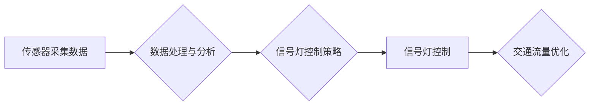

                 

## AI在智能交通信号控制中的应用：减少拥堵

> 关键词：人工智能、智能交通、信号控制、拥堵缓解、机器学习、深度学习、交通流量预测

## 1. 背景介绍

城市交通拥堵已成为全球性难题，给人们的生活、工作和经济发展带来了巨大负担。传统的交通信号控制系统通常采用固定时序或人机交互的方式，难以适应实时变化的交通流量，导致信号灯红绿灯的切换不合理，加剧了交通拥堵。

近年来，人工智能（AI）技术发展迅速，为解决交通拥堵问题提供了新的思路。AI算法能够学习和分析海量交通数据，预测交通流量变化趋势，并根据实时情况动态调整信号灯的切换时间，从而实现智能交通信号控制。

## 2. 核心概念与联系

### 2.1 智能交通信号控制

智能交通信号控制是指利用传感器、通信技术和人工智能算法，实现交通信号灯的智能化控制，以优化交通流量，减少拥堵。

### 2.2 核心概念

* **传感器:** 用于采集交通流量、车辆速度、行人流量等实时数据。常见的传感器包括摄像头、雷达、激光雷达、红外传感器等。
* **通信网络:** 用于传输传感器采集的数据，以及控制信号灯的指令。常见的通信网络包括无线网络、有线网络等。
* **人工智能算法:** 用于分析交通数据，预测交通流量变化趋势，并根据实时情况动态调整信号灯的切换时间。常见的算法包括机器学习、深度学习等。

**核心架构流程图**



## 3. 核心算法原理 & 具体操作步骤

### 3.1 算法原理概述

智能交通信号控制的核心算法通常基于机器学习或深度学习技术。这些算法能够从历史交通数据中学习交通流量变化的规律，并根据实时数据预测未来交通流量。

常见的算法包括：

* **回归算法:** 用于预测交通流量的总量。
* **分类算法:** 用于预测交通流量的类别，例如高峰期、非高峰期等。
* **强化学习算法:** 用于优化信号灯的切换策略，以最大化交通流量。

### 3.2 算法步骤详解

1. **数据采集:** 收集交通流量、车辆速度、行人流量等实时数据。
2. **数据预处理:** 对采集到的数据进行清洗、转换和特征提取。
3. **模型训练:** 使用机器学习或深度学习算法对预处理后的数据进行训练，建立交通流量预测模型。
4. **模型评估:** 使用测试数据评估模型的预测精度。
5. **模型部署:** 将训练好的模型部署到实际的交通信号控制系统中。
6. **实时预测:** 根据实时数据，模型预测未来交通流量变化趋势。
7. **信号灯控制:** 根据预测结果，动态调整信号灯的切换时间，以优化交通流量。

### 3.3 算法优缺点

**优点:**

* 能够适应实时变化的交通流量。
* 能够提高交通流量效率。
* 能够减少交通拥堵。

**缺点:**

* 需要大量的训练数据。
* 模型训练需要较高的计算资源。
* 模型的预测精度受数据质量影响。

### 3.4 算法应用领域

* 智能交通信号控制
* 交通流量预测
* 路网规划
* 自动驾驶

## 4. 数学模型和公式 & 详细讲解 & 举例说明

### 4.1 数学模型构建

智能交通信号控制的数学模型通常基于交通流量预测模型。常见的模型包括线性回归模型、非线性回归模型、ARIMA模型等。

**线性回归模型:**

$$y = mx + c$$

其中：

* $y$ 是预测的交通流量。
* $x$ 是时间变量。
* $m$ 是斜率。
* $c$ 是截距。

**非线性回归模型:**

$$y = f(x)$$

其中：

* $y$ 是预测的交通流量。
* $x$ 是时间变量。
* $f(x)$ 是非线性函数。

**ARIMA模型:**

$$y_t = c + \sum_{i=1}^p \phi_i y_{t-i} + \sum_{j=1}^q \theta_j \epsilon_{t-j} + \epsilon_t$$

其中：

* $y_t$ 是时间 $t$ 的交通流量。
* $c$ 是常数项。
* $\phi_i$ 是自回归系数。
* $\theta_j$ 是移动平均系数。
* $\epsilon_t$ 是随机误差项。

### 4.2 公式推导过程

具体的公式推导过程取决于选择的模型类型。例如，线性回归模型的推导过程涉及最小二乘法，非线性回归模型的推导过程涉及梯度下降法，ARIMA模型的推导过程涉及时间序列分析。

### 4.3 案例分析与讲解

假设我们使用线性回归模型预测某路段的交通流量。我们收集了该路段过去一周的交通流量数据，并将其作为训练数据。通过最小二乘法，我们得到了模型的斜率和截距。

然后，我们使用模型预测未来一周的交通流量。预测结果表明，未来一周的交通流量将持续增长。

## 5. 项目实践：代码实例和详细解释说明

### 5.1 开发环境搭建

* 操作系统：Ubuntu 20.04
* Python 版本：3.8
* 必要的库：NumPy、Pandas、Scikit-learn

### 5.2 源代码详细实现

```python
import pandas as pd
from sklearn.linear_model import LinearRegression

# 1. 数据加载
data = pd.read_csv('traffic_data.csv')

# 2. 数据预处理
X = data[['time']]  # 特征
y = data['traffic']  # 目标变量

# 3. 模型训练
model = LinearRegression()
model.fit(X, y)

# 4. 模型预测
future_time = pd.DataFrame({'time': [10, 11, 12]})  # 未来时间
future_traffic = model.predict(future_time)

# 5. 结果展示
print(future_traffic)
```

### 5.3 代码解读与分析

* 代码首先加载交通数据，并将其转换为Pandas DataFrame格式。
* 然后，代码将时间作为特征，交通流量作为目标变量。
* 使用Scikit-learn库中的LinearRegression模型进行训练。
* 训练完成后，使用模型预测未来时间段的交通流量。
* 最后，代码打印预测结果。

### 5.4 运行结果展示

运行代码后，将输出未来时间段的交通流量预测值。

## 6. 实际应用场景

智能交通信号控制已在全球多个城市得到应用，例如：

* **美国洛杉矶:** 利用AI算法优化信号灯控制，减少拥堵时间。
* **中国上海:** 在部分路段部署智能交通信号控制系统，提高交通流量效率。
* **新加坡:** 利用AI算法预测交通流量，动态调整信号灯切换时间。

### 6.4 未来应用展望

未来，智能交通信号控制将更加智能化、个性化和协同化。例如：

* **基于大数据的智能控制:** 利用更丰富的交通数据，例如天气、事件、道路状况等，进行更精准的预测和控制。
* **个性化信号控制:** 根据用户的出行需求，例如目的地、时间、交通方式等，提供个性化的信号控制方案。
* **车辆与信号灯协同控制:** 利用V2X通信技术，使车辆与信号灯进行实时交互，实现更加高效的交通流管理。

## 7. 工具和资源推荐

### 7.1 学习资源推荐

* **书籍:**
    * 《人工智能：一种现代方法》
    * 《深度学习》
* **在线课程:**
    * Coursera: 深度学习
    * edX: 人工智能
* **博客:**
    * Towards Data Science
    * Machine Learning Mastery

### 7.2 开发工具推荐

* **Python:** 广泛应用于机器学习和深度学习开发。
* **TensorFlow:** 开源深度学习框架。
* **PyTorch:** 开源深度学习框架。
* **Scikit-learn:** 机器学习库。

### 7.3 相关论文推荐

* **Traffic Light Control Using Deep Reinforcement Learning**
* **A Deep Learning Approach for Traffic Flow Prediction**
* **Intelligent Traffic Signal Control Using Machine Learning**

## 8. 总结：未来发展趋势与挑战

### 8.1 研究成果总结

智能交通信号控制利用AI技术，能够有效缓解交通拥堵，提高交通流量效率。

### 8.2 未来发展趋势

未来，智能交通信号控制将更加智能化、个性化和协同化，并与其他智能交通系统融合，形成更加高效的交通管理体系。

### 8.3 面临的挑战

* 数据质量问题：模型的预测精度依赖于数据质量，需要不断完善数据采集和处理方法。
* 计算资源需求：训练复杂的AI模型需要大量的计算资源，需要探索更加高效的计算方法。
* 安全性和隐私问题：智能交通系统需要保证数据安全和用户隐私，需要制定相应的安全策略和隐私保护机制。

### 8.4 研究展望

未来，需要继续探索更加高效、精准、安全的智能交通信号控制算法和技术，并将其应用于更广泛的场景，为构建更加智能、便捷、安全的交通系统做出贡献。

## 9. 附录：常见问题与解答

* **Q1: 智能交通信号控制的成本如何？**

A1: 智能交通信号控制的成本取决于系统的规模、复杂度和应用场景。总体而言，智能交通信号控制的成本在短期内可能较高，但长期来看，它可以带来显著的经济效益，例如减少拥堵时间、提高交通效率、降低燃油消耗等。

* **Q2: 智能交通信号控制是否会影响行人通行？**

A2: 智能交通信号控制系统通常会考虑行人通行需求，并根据行人流量调整信号灯的切换时间，以确保行人安全和便捷。

* **Q3: 智能交通信号控制的安全性如何？**

A3: 智能交通信号控制系统需要采用安全可靠的硬件和软件，并进行严格的测试和验证，以确保系统的安全性。


作者：禅与计算机程序设计艺术 / Zen and the Art of Computer Programming 
<end_of_turn>

