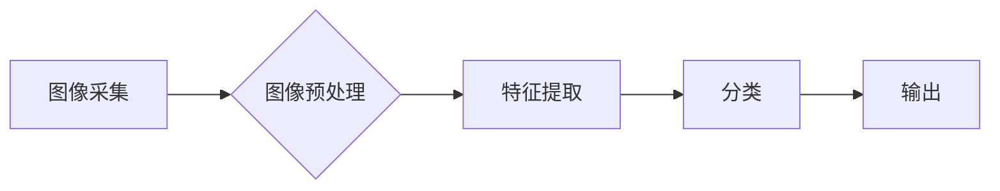

                 

## AI在智能废物分类中的应用：提高回收效率

> 关键词：人工智能、废物分类、计算机视觉、深度学习、卷积神经网络、图像识别、可持续发展、资源回收

## 1. 背景介绍

随着全球人口增长和消费水平提升，固体废物产生量呈指数级增长，给环境和资源造成巨大压力。传统的废物分类方式主要依靠人工分拣，效率低下、成本高昂，且容易出现误分类现象。智能废物分类技术作为一种新兴的废物管理解决方案，利用人工智能（AI）技术，能够自动识别和分类不同类型的废物，提高回收效率，降低环境污染。

**1.1  废物分类现状与挑战**

现有的废物分类方法主要包括：

* **人工分拣:** 依赖人工操作，效率低、成本高、易出错。
* **机械分拣:** 利用机器对废物进行物理分离，但对不同材质的识别能力有限。
* **生物分类:** 利用微生物分解废物，但效率低、时间长。

这些传统方法都存在着效率低、成本高、分类精度低等问题。

**1.2  智能废物分类的优势**

智能废物分类技术利用计算机视觉、深度学习等人工智能技术，能够实现以下优势：

* **提高分类精度:** 通过训练模型识别不同类型的废物，实现更准确的分类。
* **提高分类效率:** 自动化分类过程，大幅提高分类速度和效率。
* **降低人工成本:** 减少对人工分拣的需求，降低劳动力成本。
* **促进资源回收:** 提高回收率，促进资源循环利用。

## 2. 核心概念与联系

智能废物分类的核心概念包括：

* **计算机视觉:** 利用计算机模拟人类视觉系统，对图像进行识别、分析和理解。
* **深度学习:** 一种机器学习方法，利用多层神经网络模拟人类大脑的学习过程。
* **卷积神经网络 (CNN):** 一种专门用于图像识别的深度学习模型，能够自动提取图像特征。

**2.1  智能废物分类架构**

智能废物分类系统通常由以下几个模块组成：

* **图像采集模块:** 利用摄像头或其他传感器采集废物图像。
* **图像预处理模块:** 对采集到的图像进行预处理，例如调整亮度、对比度、去除噪声等。
* **特征提取模块:** 利用CNN等模型提取图像特征，例如颜色、纹理、形状等。
* **分类模块:** 利用机器学习算法对提取的特征进行分类，识别不同类型的废物。
* **输出模块:** 将分类结果输出到控制系统，例如控制分拣机械臂或显示分类结果。



## 3. 核心算法原理 & 具体操作步骤

**3.1  算法原理概述**

智能废物分类的核心算法是深度学习，特别是卷积神经网络 (CNN)。CNN 能够自动学习图像特征，并根据这些特征对图像进行分类。

**3.2  算法步骤详解**

1. **数据收集和预处理:** 收集大量不同类型废物的图像数据，并进行预处理，例如裁剪、缩放、归一化等。
2. **模型构建:** 使用深度学习框架 (例如 TensorFlow 或 PyTorch) 构建 CNN 模型。
3. **模型训练:** 利用训练数据训练 CNN 模型，调整模型参数，使其能够准确识别不同类型的废物。
4. **模型评估:** 使用测试数据评估模型的性能，例如准确率、召回率、F1-score 等。
5. **模型部署:** 将训练好的模型部署到实际应用场景中，例如废物分类系统。

**3.3  算法优缺点**

**优点:**

* **高准确率:** CNN 能够自动学习图像特征，识别精度高。
* **自动化程度高:** 自动化分类过程，减少人工干预。
* **可扩展性强:** 可以根据需要增加模型层数和参数，提高识别能力。

**缺点:**

* **数据依赖性强:** 需要大量高质量的训练数据。
* **计算资源需求高:** 训练 CNN 模型需要大量的计算资源。
* **模型解释性差:** CNN 的决策过程较为复杂，难以解释模型的分类结果。

**3.4  算法应用领域**

智能废物分类算法广泛应用于以下领域:

* **城市垃圾分类:** 自动识别和分类城市垃圾，提高垃圾处理效率。
* **工业废物分类:** 自动识别和分类工业废物，促进资源回收利用。
* **电子垃圾分类:** 自动识别和分类电子垃圾，减少环境污染。
* **家庭垃圾分类:** 智能垃圾桶，自动识别和分类家庭垃圾。

## 4. 数学模型和公式 & 详细讲解 & 举例说明

**4.1  数学模型构建**

智能废物分类的数学模型主要基于深度学习框架，例如 TensorFlow 或 PyTorch。这些框架提供了一系列预定义的层类型，例如卷积层、池化层、全连接层等。通过组合这些层类型，可以构建出不同的 CNN 模型。

**4.2  公式推导过程**

CNN 模型的训练过程基于反向传播算法，通过调整模型参数，最小化预测结果与真实结果之间的误差。反向传播算法的核心公式包括：

* **损失函数:** 用于衡量预测结果与真实结果之间的误差。常用的损失函数包括交叉熵损失函数、均方误差损失函数等。
* **梯度下降算法:** 用于更新模型参数，使其朝着最小化损失函数的方向调整。常用的梯度下降算法包括随机梯度下降、动量梯度下降等。

**4.3  案例分析与讲解**

假设我们训练一个 CNN 模型用于识别三种类型的废物：塑料、纸张和玻璃。

* **损失函数:** 我们可以使用交叉熵损失函数，其公式如下：

$$
L = -\sum_{i=1}^{N} y_i \log(\hat{y}_i)
$$

其中：

* $L$ 是损失函数值。
* $N$ 是样本数量。
* $y_i$ 是真实标签，取值为 0 或 1。
* $\hat{y}_i$ 是预测标签，取值为 0 或 1。

* **梯度下降算法:** 我们可以使用随机梯度下降算法更新模型参数，其公式如下：

$$
\theta = \theta - \alpha \nabla L(\theta)
$$

其中：

* $\theta$ 是模型参数。
* $\alpha$ 是学习率。
* $\nabla L(\theta)$ 是损失函数关于模型参数的梯度。

通过训练过程，模型会不断调整参数，使得预测结果与真实标签之间的误差最小化。

## 5. 项目实践：代码实例和详细解释说明

**5.1  开发环境搭建**

* **操作系统:** Ubuntu 20.04 LTS
* **编程语言:** Python 3.8
* **深度学习框架:** TensorFlow 2.0
* **其他依赖库:** OpenCV, NumPy, Matplotlib

**5.2  源代码详细实现**

```python
import tensorflow as tf
from tensorflow.keras.models import Sequential
from tensorflow.keras.layers import Conv2D, MaxPooling2D, Flatten, Dense

# 定义 CNN 模型
model = Sequential()
model.add(Conv2D(32, (3, 3), activation='relu', input_shape=(128, 128, 3)))
model.add(MaxPooling2D((2, 2)))
model.add(Conv2D(64, (3, 3), activation='relu'))
model.add(MaxPooling2D((2, 2)))
model.add(Flatten())
model.add(Dense(10, activation='softmax'))

# 编译模型
model.compile(optimizer='adam',
              loss='categorical_crossentropy',
              metrics=['accuracy'])

# 训练模型
model.fit(x_train, y_train, epochs=10, batch_size=32)

# 评估模型
loss, accuracy = model.evaluate(x_test, y_test)
print('Loss:', loss)
print('Accuracy:', accuracy)
```

**5.3  代码解读与分析**

* **模型定义:** 使用 `Sequential` 类定义一个顺序模型，并添加卷积层、池化层、扁平化层和全连接层。
* **模型编译:** 使用 `compile` 方法编译模型，指定优化器、损失函数和评估指标。
* **模型训练:** 使用 `fit` 方法训练模型，传入训练数据和超参数。
* **模型评估:** 使用 `evaluate` 方法评估模型性能，输出损失值和准确率。

**5.4  运行结果展示**

训练完成后，可以将模型应用于实际场景中，例如对废物图像进行分类。

## 6. 实际应用场景

**6.1  城市垃圾分类**

智能废物分类系统可以安装在城市垃圾分类站或垃圾桶旁，自动识别和分类不同类型的垃圾，例如塑料、纸张、玻璃、金属等。

**6.2  工业废物分类**

工业生产过程中会产生大量的废物，例如金属废料、塑料废料、纸张废料等。智能废物分类系统可以帮助企业自动识别和分类这些废物，提高资源回收利用率。

**6.3  电子垃圾分类**

电子垃圾含有大量的有害物质，需要进行专门的处理。智能废物分类系统可以帮助识别不同类型的电子垃圾，例如手机、电脑、电视等，并将其分类到不同的处理流程中。

**6.4  未来应用展望**

随着人工智能技术的不断发展，智能废物分类技术将有更广泛的应用场景，例如：

* **家庭垃圾分类:** 智能垃圾桶可以自动识别和分类家庭垃圾，方便居民进行垃圾分类。
* **可穿戴设备:** 智能手表或眼镜可以识别用户的垃圾分类行为，并提供反馈和建议。
* **无人驾驶车辆:** 无人驾驶车辆可以识别路边垃圾桶，并自动将垃圾分类到不同的垃圾箱中。

## 7. 工具和资源推荐

**7.1  学习资源推荐**

* **书籍:**
    * 深度学习 (Deep Learning) - Ian Goodfellow, Yoshua Bengio, Aaron Courville
    * 计算机视觉 (Computer Vision: Algorithms and Applications) - Richard Szeliski
* **在线课程:**
    * TensorFlow 官方教程: https://www.tensorflow.org/tutorials
    * Coursera 深度学习课程: https://www.coursera.org/specializations/deep-learning

**7.2  开发工具推荐**

* **深度学习框架:** TensorFlow, PyTorch, Keras
* **图像处理库:** OpenCV
* **数据可视化库:** Matplotlib, Seaborn

**7.3  相关论文推荐**

* **Waste Classification Using Deep Learning:** https://arxiv.org/abs/1909.03997
* **A Convolutional Neural Network for Waste Sorting:** https://ieeexplore.ieee.org/document/8807807

## 8. 总结：未来发展趋势与挑战

**8.1  研究成果总结**

智能废物分类技术取得了显著的进展，能够实现高准确率的废物识别和分类。

**8.2  未来发展趋势**

* **模型精度提升:** 研究更深层次、更复杂的 CNN 模型，提高识别精度。
* **场景适应性增强:** 开发能够适应不同环境和条件的智能废物分类系统。
* **多模态融合:** 将图像识别与其他传感器数据融合，例如声音、气味等，提高分类准确率。
* **边缘计算:** 将模型部署到边缘设备上，实现实时分类和决策。

**8.3  面临的挑战**

* **数据标注成本高:** 需要大量高质量的标注数据，标注成本较高。
* **模型解释性差:** CNN 的决策过程较为复杂，难以解释模型的分类结果。
* **硬件资源限制:** 训练和部署大型 CNN 模型需要大量的计算资源。

**8.4  研究展望**

未来研究方向包括：

* **探索新的深度学习算法:** 研究更有效的深度学习算法，提高模型精度和效率。
* **开发自动化数据标注方法:** 降低数据标注成本，提高数据标注效率。
* **研究模型可解释性:** 开发能够解释模型决策过程的方法，提高模型可信度。
* **探索边缘计算应用:** 将模型部署到边缘设备上，实现实时分类和决策。


## 9. 附录：常见问题与解答

**9.1  Q: 如何收集废物图像数据？**

**A:** 可以通过以下方式收集废物图像数据：

* **公开数据集:** 许多公开数据集包含废物图像数据，例如 Kaggle, ImageNet 等。
* **自行拍摄:** 使用相机或手机拍摄不同类型的废物图像。
* **网络爬虫:** 使用网络爬虫从互联网上爬取废物图像数据。

**9.2  Q: 如何评估智能废物分类模型的性能？**

**A:** 可以使用以下指标评估模型性能：

* **准确率:** 分类正确的样本数量占总样本数量的比例。
* **召回率:** 识别出所有真实样本的数量占所有真实样本数量的比例。
* **F1-score:** 准确率和召回率的调和平均值。

**9.3  Q: 如何部署智能废物分类模型？**

**A:** 可以使用以下方式部署模型：

* **云端部署:** 将模型部署到云服务器上，通过 API 接口提供服务。
* **边缘部署:** 将模型部署到边缘设备上，例如智能垃圾桶、无人驾驶车辆等。


作者：禅与计算机程序设计艺术 / Zen and the Art of Computer Programming<end_of_turn>

