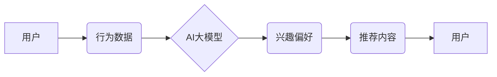

                 

## AI大模型驱动的个性化首页推荐

> 关键词：AI大模型、个性化推荐、首页推荐、深度学习、自然语言处理、用户行为分析、推荐系统

## 1. 背景介绍

随着互联网的蓬勃发展，信息爆炸式增长，用户每天面临着海量信息的选择和筛选。个性化推荐系统应运而生，旨在根据用户的兴趣、偏好和行为，精准推荐符合其需求的内容，提升用户体验和信息获取效率。传统推荐系统主要依赖于协同过滤、内容过滤等方法，但这些方法在数据稀疏、冷启动等问题上存在局限性。近年来，随着深度学习技术的快速发展，基于AI大模型的个性化推荐系统逐渐成为研究热点。

AI大模型，例如BERT、GPT-3等，拥有强大的语义理解和文本生成能力，能够从海量文本数据中学习用户兴趣和偏好，并生成更精准、更个性化的推荐内容。

## 2. 核心概念与联系

### 2.1  个性化推荐

个性化推荐是指根据用户的个人特征、行为模式和偏好，提供定制化的产品、服务或内容推荐。其目标是提升用户体验，提高用户满意度和留存率。

### 2.2  AI大模型

AI大模型是指训练规模庞大、参数数量众多的深度学习模型。它们通过学习海量数据，能够掌握复杂的语义关系和模式，并应用于各种自然语言处理任务，例如文本分类、机器翻译、问答系统等。

### 2.3  推荐系统

推荐系统是根据用户的历史行为、偏好和上下文信息，预测用户可能感兴趣的内容或产品的系统。其核心是构建用户-物品交互的评分模型，并根据模型预测结果，推荐最合适的物品给用户。

**核心概念与架构流程图**



## 3. 核心算法原理 & 具体操作步骤

### 3.1  算法原理概述

基于AI大模型的个性化首页推荐系统通常采用以下核心算法：

* **用户嵌入:** 将用户转化为低维向量，捕捉用户的兴趣和偏好。
* **物品嵌入:** 将物品转化为低维向量，表示物品的特征和属性。
* **相似度计算:** 计算用户嵌入向量和物品嵌入向量之间的相似度，预测用户对物品的兴趣。
* **推荐排序:** 根据相似度排序推荐结果，并根据用户历史行为、上下文信息等进行进一步优化。

### 3.2  算法步骤详解

1. **数据预处理:** 收集用户行为数据、物品信息等数据，并进行清洗、转换、特征提取等预处理操作。
2. **用户嵌入构建:** 使用深度学习模型，例如Transformer，对用户行为数据进行训练，学习用户兴趣和偏好的嵌入向量。
3. **物品嵌入构建:** 使用深度学习模型，例如Word2Vec，对物品信息进行训练，学习物品特征和属性的嵌入向量。
4. **相似度计算:** 使用余弦相似度、点积等方法计算用户嵌入向量和物品嵌入向量之间的相似度。
5. **推荐排序:** 根据相似度排序推荐结果，并根据用户历史行为、上下文信息等进行进一步优化，例如使用基于梯度的排序算法。
6. **结果展示:** 将排序后的推荐结果展示给用户，并根据用户反馈进行模型更新和优化。

### 3.3  算法优缺点

**优点:**

* 能够学习用户复杂的兴趣偏好，提供更精准的推荐。
* 能够处理海量数据，并不断学习和优化推荐结果。
* 能够融合多源数据，例如文本、图片、视频等，提供更丰富的推荐内容。

**缺点:**

* 需要大量的训练数据，训练成本较高。
* 模型训练时间较长，部署和维护成本较高。
* 存在数据隐私和安全问题。

### 3.4  算法应用领域

* **电商推荐:** 推荐商品、优惠券、促销活动等。
* **内容推荐:** 推荐新闻、视频、音乐、书籍等。
* **社交推荐:** 推荐好友、群组、活动等。
* **个性化教育:** 推荐学习资源、课程、辅导等。

## 4. 数学模型和公式 & 详细讲解 & 举例说明

### 4.1  数学模型构建

基于AI大模型的个性化首页推荐系统通常采用以下数学模型：

* **用户-物品交互矩阵:** 用来表示用户对物品的评分或交互行为，例如点击、收藏、购买等。

* **嵌入模型:** 将用户和物品转化为低维向量，捕捉用户的兴趣和物品的特征。

* **相似度计算公式:** 用于计算用户嵌入向量和物品嵌入向量之间的相似度，例如余弦相似度:

$$
\text{相似度} = \frac{\mathbf{u} \cdot \mathbf{v}}{\|\mathbf{u}\| \|\mathbf{v}\|}
$$

其中，$\mathbf{u}$ 是用户嵌入向量，$\mathbf{v}$ 是物品嵌入向量。

### 4.2  公式推导过程

余弦相似度的推导过程如下：

1. 计算用户嵌入向量和物品嵌入向量的点积。
2. 计算用户嵌入向量和物品嵌入向量的模长。
3. 将点积除以两个向量的模长乘积，得到余弦相似度。

### 4.3  案例分析与讲解

假设有两个用户和两个物品，用户嵌入向量和物品嵌入向量如下：

* 用户1: $\mathbf{u}_1 = [0.2, 0.5, 0.8]$
* 用户2: $\mathbf{u}_2 = [0.4, 0.3, 0.6]$
* 物品1: $\mathbf{v}_1 = [0.1, 0.6, 0.7]$
* 物品2: $\mathbf{v}_2 = [0.8, 0.2, 0.3]$

计算用户1和物品1之间的余弦相似度:

$$
\text{相似度}(\mathbf{u}_1, \mathbf{v}_1) = \frac{[0.2, 0.5, 0.8] \cdot [0.1, 0.6, 0.7]}{ \sqrt{0.2^2 + 0.5^2 + 0.8^2} \sqrt{0.1^2 + 0.6^2 + 0.7^2}} \approx 0.75
$$

计算用户1和物品2之间的余弦相似度:

$$
\text{相似度}(\mathbf{u}_1, \mathbf{v}_2) = \frac{[0.2, 0.5, 0.8] \cdot [0.8, 0.2, 0.3]}{ \sqrt{0.2^2 + 0.5^2 + 0.8^2} \sqrt{0.8^2 + 0.2^2 + 0.3^2}} \approx 0.25
$$

结果表明，用户1对物品1的兴趣度更高。

## 5. 项目实践：代码实例和详细解释说明

### 5.1  开发环境搭建

* Python 3.7+
* TensorFlow/PyTorch
* Jupyter Notebook

### 5.2  源代码详细实现

```python
import tensorflow as tf

# 定义用户嵌入模型
class UserEmbeddingModel(tf.keras.Model):
    def __init__(self, embedding_dim):
        super(UserEmbeddingModel, self).__init__()
        self.embedding = tf.keras.layers.Embedding(input_dim=num_users, output_dim=embedding_dim)

    def call(self, inputs):
        return self.embedding(inputs)

# 定义物品嵌入模型
class ItemEmbeddingModel(tf.keras.Model):
    def __init__(self, embedding_dim):
        super(ItemEmbeddingModel, self).__init__()
        self.embedding = tf.keras.layers.Embedding(input_dim=num_items, output_dim=embedding_dim)

    def call(self, inputs):
        return self.embedding(inputs)

# 计算用户和物品之间的余弦相似度
def cosine_similarity(user_embedding, item_embedding):
    return tf.reduce_sum(user_embedding * item_embedding, axis=-1) / (tf.norm(user_embedding, axis=-1) * tf.norm(item_embedding, axis=-1))

# 构建推荐模型
class RecommendationModel(tf.keras.Model):
    def __init__(self, embedding_dim):
        super(RecommendationModel, self).__init__()
        self.user_embedding_model = UserEmbeddingModel(embedding_dim)
        self.item_embedding_model = ItemEmbeddingModel(embedding_dim)

    def call(self, user_ids, item_ids):
        user_embeddings = self.user_embedding_model(user_ids)
        item_embeddings = self.item_embedding_model(item_ids)
        similarities = cosine_similarity(user_embeddings, item_embeddings)
        return similarities
```

### 5.3  代码解读与分析

* **用户嵌入模型和物品嵌入模型:** 使用Embedding层将用户ID和物品ID转化为低维向量，捕捉用户的兴趣和物品的特征。
* **余弦相似度计算:** 使用余弦相似度公式计算用户嵌入向量和物品嵌入向量之间的相似度。
* **推荐模型:** 将用户嵌入模型和物品嵌入模型组合起来，构建推荐模型，预测用户对物品的兴趣。

### 5.4  运行结果展示

运行代码后，可以得到用户对每个物品的相似度分数，并根据分数进行排序，推荐用户可能感兴趣的物品。

## 6. 实际应用场景

### 6.1  电商推荐

基于AI大模型的个性化首页推荐系统可以帮助电商平台推荐更符合用户需求的商品，提高用户转化率和销售额。例如，可以根据用户的浏览历史、购买记录、购物车内容等信息，推荐用户可能感兴趣的商品、优惠券、促销活动等。

### 6.2  内容推荐

新闻、视频、音乐、书籍等内容平台可以利用AI大模型构建个性化首页推荐系统，推荐用户可能感兴趣的内容，提升用户粘性和活跃度。例如，可以根据用户的阅读历史、观看记录、点赞行为等信息，推荐用户可能感兴趣的新闻、视频、音乐、书籍等。

### 6.3  社交推荐

社交平台可以利用AI大模型构建个性化首页推荐系统，推荐用户可能感兴趣的朋友、群组、活动等。例如，可以根据用户的社交关系、兴趣爱好、行为模式等信息，推荐用户可能感兴趣的朋友、群组、活动等。

### 6.4  未来应用展望

随着AI技术的不断发展，基于AI大模型的个性化首页推荐系统将应用于更多领域，例如教育、医疗、金融等。未来，个性化推荐系统将更加智能化、精准化，能够更好地满足用户的个性化需求。

## 7. 工具和资源推荐

### 7.1  学习资源推荐

* **书籍:**
    * Deep Learning by Ian Goodfellow
    * Natural Language Processing with Python by Steven Bird
* **在线课程:**
    * TensorFlow Tutorials
    * PyTorch Tutorials
* **博客:**
    * Towards Data Science
    * Machine Learning Mastery

### 7.2  开发工具推荐

* **深度学习框架:** TensorFlow, PyTorch
* **数据处理工具:** Pandas, NumPy
* **可视化工具:** Matplotlib, Seaborn

### 7.3  相关论文推荐

* BERT: Pre-training of Deep Bidirectional Transformers for Language Understanding
* GPT-3: Language Models are Few-Shot Learners
* Collaborative Filtering for the Netflix Prize

## 8. 总结：未来发展趋势与挑战

### 8.1  研究成果总结

基于AI大模型的个性化首页推荐系统取得了显著的成果，能够提供更精准、更个性化的推荐结果，提升用户体验和信息获取效率。

### 8.2  未来发展趋势

* **模型更加复杂:** 未来，推荐模型将更加复杂，例如使用Transformer、Graph Neural Networks等更先进的模型架构。
* **数据更加丰富:** 未来，推荐系统将融合更多数据源，例如用户画像、行为轨迹、上下文信息等，提供更全面的用户理解。
* **个性化程度更高:** 未来，推荐系统将更加注重用户个性化需求，提供更加定制化的推荐结果。

### 8.3  面临的挑战

* **数据隐私和安全:** 个性化推荐系统需要收集和处理大量用户数据，如何保护用户隐私和数据安全是一个重要的挑战。
* **模型解释性和可解释性:** AI大模型的决策过程往往难以理解，如何提高模型的解释性和可解释性是一个重要的研究方向。
* **公平性和偏见:** 个性化推荐系统可能存在公平性和偏见问题，例如推荐结果可能受到用户性别、种族、年龄等因素的影响，需要进行公平性评估和改进。

### 8.4  研究展望

未来，基于AI大模型的个性化首页推荐系统将继续朝着更加智能化、精准化、个性化方向发展，为用户提供更加便捷、高效、个性化的信息服务。


## 9. 附录：常见问题与解答

**Q1: 如何评估个性化首页推荐系统的效果？**

**A1:** 可以使用以下指标评估个性化首页推荐系统的效果：

* 点击率 (CTR): 用户点击推荐结果的比例。
* 点击次数 (CVR): 用户点击推荐结果后进行购买或其他操作的比例。
* 用户满意度: 通过用户反馈调查等方式评估用户对推荐结果的满意度。

**Q2: 如何解决数据稀疏问题？**

**A2:** 可以使用以下方法解决数据稀疏问题：

* **协同过滤:** 利用用户对其他物品的评分信息，预测用户对目标物品的评分。
* **内容过滤:** 利用物品的特征信息，预测用户对目标物品的兴趣。
* **混合推荐:** 将协同过滤和内容过滤相结合，提高推荐效果。

**Q3: 如何处理冷启动问题？**

**A3:** 可以使用以下方法处理冷启动问题:

* **利用用户画像信息:** 根据用户的基本信息，例如年龄、性别、兴趣爱好等，进行推荐。
* **利用物品的特征信息:** 根据物品的类别、属性等信息，进行推荐。
* **使用基于内容的推荐算法:** 利用物品的文本描述、图片等信息，进行推荐。


作者：禅与计算机程序设计艺术 / Zen and the Art of Computer Programming<end_of_turn>

