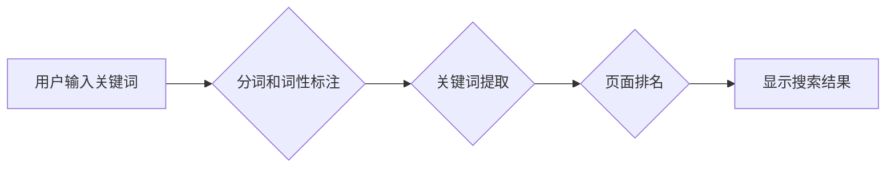
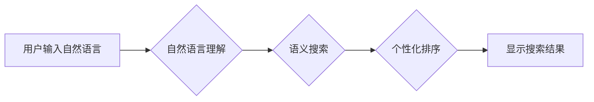

                 

## AI搜索引擎与传统搜索引擎的效率对比

> 关键词：AI搜索引擎,传统搜索引擎,自然语言处理,深度学习,BERT,效率对比,信息检索,搜索算法

## 1. 背景介绍

随着互联网信息量的爆炸式增长，传统的基于关键词匹配的搜索引擎逐渐难以满足用户日益复杂的搜索需求。用户不再仅仅依赖简单的关键词查询，而是倾向于使用更自然、更接近人类语言的表达方式进行搜索。同时，用户对搜索结果的个性化、准确性和相关性要求也越来越高。

为了解决这些问题，人工智能（AI）技术逐渐被引入搜索引擎领域，催生了新的搜索引擎模式——AI搜索引擎。AI搜索引擎利用自然语言处理（NLP）、深度学习等先进技术，能够更深入地理解用户搜索意图，并提供更精准、更相关的搜索结果。

## 2. 核心概念与联系

### 2.1  传统搜索引擎

传统搜索引擎主要基于关键词匹配算法，其核心流程如下：

1. **爬虫采集**: 爬虫程序自动抓取互联网上的网页内容，并将其存储在搜索引擎的索引库中。
2. **分词和词性标注**: 将网页内容进行分词，识别每个词语的词性，以便更好地理解网页内容的语义。
3. **关键词提取**: 从网页内容中提取关键词，并计算其重要性。
4. **页面排名**: 根据关键词匹配度、网页权重等因素，对搜索结果进行排序，并显示给用户。

**传统搜索引擎架构流程图**



### 2.2  AI搜索引擎

AI搜索引擎则利用深度学习等人工智能技术，能够更深入地理解用户搜索意图，并提供更精准、更相关的搜索结果。其核心流程如下：

1. **自然语言理解**: 利用NLP技术，对用户输入的自然语言进行理解，识别其意图、实体和关系。
2. **语义搜索**: 基于用户搜索意图，对索引库中的网页内容进行语义匹配，而非简单的关键词匹配。
3. **个性化推荐**: 根据用户的搜索历史、偏好等信息，对搜索结果进行个性化排序和推荐。
4. **多模态搜索**: 支持多种数据类型的搜索，例如文本、图像、音频等。

**AI搜索引擎架构流程图**



## 3. 核心算法原理 & 具体操作步骤

### 3.1  算法原理概述

AI搜索引擎的核心算法主要包括：

* **BERT（Bidirectional Encoder Representations from Transformers）**:  一种基于Transformer架构的预训练语言模型，能够捕捉文本中的上下文信息，提升语义理解能力。
* **深度神经网络**: 用于学习用户搜索意图和网页内容之间的关系，实现语义搜索。
* **推荐算法**:  例如协同过滤、内容过滤等，用于个性化排序和推荐搜索结果。

### 3.2  算法步骤详解

1. **预训练**: BERT模型在海量文本数据上进行预训练，学习语言的语法和语义知识。
2. **微调**: 将预训练的BERT模型微调到特定搜索任务上，例如搜索意图分类、关键词提取等。
3. **语义匹配**: 利用微调后的BERT模型，对用户输入的自然语言和索引库中的网页内容进行语义匹配，计算其相似度。
4. **排序**: 根据语义相似度、网页权重等因素，对搜索结果进行排序，并显示给用户。

### 3.3  算法优缺点

**优点**:

* **更精准的搜索结果**:  能够理解用户搜索的真实意图，提供更相关的搜索结果。
* **更自然的搜索体验**:  支持自然语言输入，更接近人类的搜索方式。
* **个性化推荐**:  根据用户的搜索历史和偏好，提供个性化的搜索结果推荐。

**缺点**:

* **计算资源消耗大**:  深度学习模型训练和推理需要大量的计算资源。
* **数据依赖性强**:  需要海量高质量的训练数据才能训练出有效的模型。
* **解释性较差**:  深度学习模型的决策过程较为复杂，难以解释其搜索结果的生成机制。

### 3.4  算法应用领域

AI搜索引擎的应用领域非常广泛，包括：

* **电商搜索**:  提供更精准的商品推荐，提升用户购物体验。
* **新闻搜索**:  根据用户的兴趣爱好，推荐相关新闻资讯。
* **学术搜索**:  帮助用户快速找到相关学术论文和研究成果。
* **医疗搜索**:  提供专业的医疗信息查询和诊断辅助。

## 4. 数学模型和公式 & 详细讲解 & 举例说明

### 4.1  数学模型构建

BERT模型的核心是Transformer架构，其利用注意力机制来捕捉文本中的上下文信息。注意力机制可以理解为一种加权机制，它赋予每个词语不同的权重，根据其与其他词语之间的关系来计算其重要性。

### 4.2  公式推导过程

BERT模型的注意力机制使用以下公式计算每个词语的注意力权重：

$$
\text{Attention}(Q, K, V) = \text{softmax}\left(\frac{QK^T}{\sqrt{d_k}}\right)V
$$

其中：

* $Q$：查询矩阵，表示当前词语的表示向量。
* $K$：键矩阵，表示所有词语的表示向量。
* $V$：值矩阵，表示所有词语的语义向量。
* $d_k$：键向量的维度。
* $\text{softmax}$：softmax函数，将注意力权重归一化到0到1之间。

### 4.3  案例分析与讲解

假设我们有一个句子“我爱吃苹果”，我们要计算“吃”这个词语的注意力权重。

1. 将句子中的每个词语转换为其对应的表示向量，形成$Q$, $K$和$V$矩阵。
2. 计算$QK^T$，得到一个矩阵，每个元素代表两个词语之间的相似度。
3. 对$QK^T$进行归一化，得到注意力权重矩阵。
4. 将注意力权重矩阵与$V$矩阵相乘，得到“吃”这个词语的最终注意力权重向量。

通过分析注意力权重向量，我们可以了解“吃”这个词语与其他词语之间的关系，例如“我”和“苹果”与“吃”的关系最为密切。

## 5. 项目实践：代码实例和详细解释说明

### 5.1  开发环境搭建

* Python 3.6+
* TensorFlow 2.0+
* PyTorch 1.0+
* CUDA Toolkit (可选)

### 5.2  源代码详细实现

```python
# 使用BERT模型进行文本分类
from transformers import BertTokenizer, BertForSequenceClassification

# 加载预训练的BERT模型和分词器
tokenizer = BertTokenizer.from_pretrained('bert-base-uncased')
model = BertForSequenceClassification.from_pretrained('bert-base-uncased', num_labels=2)

# 输入文本
text = "我爱吃苹果"

# 将文本转换为BERT模型输入格式
inputs = tokenizer(text, return_tensors='pt')

# 进行模型推理
outputs = model(**inputs)

# 获取预测结果
predicted_class = outputs.logits.argmax().item()

# 打印预测结果
print(predicted_class)
```

### 5.3  代码解读与分析

* 首先，我们使用`transformers`库加载预训练的BERT模型和分词器。
* 然后，我们将输入文本转换为BERT模型输入格式，包括将文本进行分词和转换为词嵌入向量。
* 接着，我们使用模型进行推理，得到预测结果。
* 最后，我们打印预测结果，例如0表示负面情感，1表示正面情感。

### 5.4  运行结果展示

运行上述代码，输出结果为1，表示文本“我爱吃苹果”表达了正面情感。

## 6. 实际应用场景

AI搜索引擎已经在许多领域得到应用，例如：

* **Google搜索**:  Google已经将BERT等AI技术应用于其搜索引擎，提升搜索结果的精准度和相关性。
* **亚马逊搜索**:  亚马逊利用AI技术为用户提供个性化的商品推荐，提升购物体验。
* **百度搜索**:  百度也积极探索AI搜索技术，例如其提出的ERNIE模型，能够更好地理解用户搜索意图。

### 6.4  未来应用展望

未来，AI搜索引擎将朝着以下方向发展：

* **更深入的语义理解**:  利用更先进的深度学习模型，例如Transformer-XL、XLNet等，进一步提升语义理解能力。
* **多模态搜索**:  支持多种数据类型的搜索，例如文本、图像、音频等，提供更丰富的搜索体验。
* **个性化定制**:  根据用户的搜索习惯和偏好，提供个性化的搜索结果和推荐。
* **实时搜索**:  能够实时更新搜索结果，提供最新的信息。

## 7. 工具和资源推荐

### 7.1  学习资源推荐

* **Stanford NLP Group**: https://nlp.stanford.edu/
* **Hugging Face**: https://huggingface.co/
* **DeepLearning.AI**: https://www.deeplearning.ai/

### 7.2  开发工具推荐

* **TensorFlow**: https://www.tensorflow.org/
* **PyTorch**: https://pytorch.org/
* **SpaCy**: https://spacy.io/

### 7.3  相关论文推荐

* **BERT: Pre-training of Deep Bidirectional Transformers for Language Understanding**: https://arxiv.org/abs/1810.04805
* **XLNet: Generalized Autoregressive Pretraining for Language Understanding**: https://arxiv.org/abs/1906.08237
* **Transformer-XL: Attentive Language Models Beyond a Fixed-Length Context**: https://arxiv.org/abs/1901.02860

## 8. 总结：未来发展趋势与挑战

### 8.1  研究成果总结

AI搜索引擎技术取得了显著进展，能够更精准地理解用户搜索意图，提供更相关的搜索结果。

### 8.2  未来发展趋势

未来，AI搜索引擎将朝着更深入的语义理解、多模态搜索、个性化定制和实时搜索的方向发展。

### 8.3  面临的挑战

AI搜索引擎技术还面临着一些挑战，例如：

* **数据依赖性强**:  需要海量高质量的训练数据才能训练出有效的模型。
* **计算资源消耗大**:  深度学习模型训练和推理需要大量的计算资源。
* **解释性较差**:  深度学习模型的决策过程较为复杂，难以解释其搜索结果的生成机制。

### 8.4  研究展望

未来，需要进一步研究如何解决这些挑战，例如：

* 开发更有效的训练方法，减少对训练数据的依赖。
* 研究更轻量级的深度学习模型，降低计算资源消耗。
* 探索如何提高深度学习模型的解释性，使其决策过程更加透明。

## 9. 附录：常见问题与解答

**Q1: AI搜索引擎比传统搜索引擎好吗？**

A1: AI搜索引擎在语义理解、个性化推荐等方面具有优势，能够提供更精准、更相关的搜索结果。但传统搜索引擎仍然在一些场景下具有优势，例如对结构化数据的搜索。

**Q2: 如何训练一个AI搜索引擎？**

A2: 训练一个AI搜索引擎需要大量的计算资源和高质量的训练数据。通常需要使用深度学习框架，例如TensorFlow或PyTorch，并训练预训练的语言模型，例如BERT。

**Q3: AI搜索引擎的未来发展方向是什么？**

A3: 未来，AI搜索引擎将朝着更深入的语义理解、多模态搜索、个性化定制和实时搜索的方向发展。


作者：禅与计算机程序设计艺术 / Zen and the Art of Computer Programming 
<end_of_turn>

