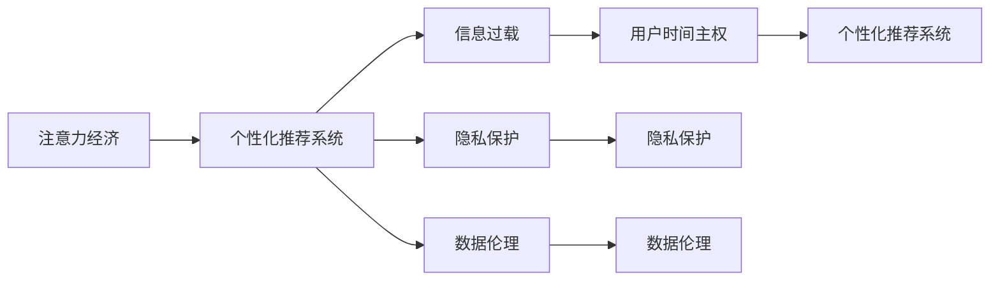

                 

# 注意力经济与个人时间主权的博弈

> 关键词：注意力经济, 个人时间主权, 用户行为分析, 信息过载, 隐私保护, 个性化推荐, 数据伦理

## 1. 背景介绍

### 1.1 问题由来
随着互联网和移动技术的迅猛发展，数字时代的信息传播效率达到了前所未有的高度，人们每天都会接触到海量的信息。然而，这些信息并非全部与个人相关，甚至是一些无价值甚至有害的内容，比如虚假信息、广告噪音等。这些信息对个人的时间和注意力造成了严重的浪费，甚至干扰到人们正常的生活和判断，这种现象被称为“信息过载”（Information Overload）。

与此同时，各大平台和媒体机构为了获取和维持用户关注度，不断通过算法推荐系统推送个性化内容，这进一步加剧了信息过载的问题。用户的时间被大量的无效信息和广告占据，而个人时间主权被忽视，无法自主选择信息来源和内容，这对用户产生了严重的负面影响。

### 1.2 问题核心关键点
在这个信息过载和用户时间主权缺失的背景下，如何重新思考和设计信息传播和用户交互模式，成为当下亟需解决的重要课题。

- **信息过载的根源**：海量无筛选的信息流导致了用户注意力被分散，降低了对重要信息的处理能力。
- **个人时间主权**：用户有权决定自己的注意力流向和内容接收，不应受到外部强制干扰。
- **算法推荐问题**：个性化推荐系统虽能提高用户满意度，但若未充分考虑用户隐私和信息多样性，可能导致信息过载加剧。
- **隐私保护**：在个性化推荐过程中，如何保护用户隐私和数据安全，防止数据滥用。
- **个性化与多样性平衡**：推荐系统如何实现个性化推荐与信息多样性之间的平衡。

这些关键点引发了人们对注意力经济和个性化推荐系统背后的伦理道德、隐私保护、信息安全等问题进行深入的探讨。

## 2. 核心概念与联系

### 2.1 核心概念概述

为了更好地理解注意力经济与个人时间主权博弈的问题，本节将介绍几个关键概念：

- **注意力经济（Attention Economy）**：指在数字化时代，通过吸引和维持用户注意力而创造的经济价值。注意力经济主要依赖于算法推荐系统，通过个性化推荐来最大化用户互动和停留时间。

- **用户时间主权（User Time Sovereignty）**：指用户自主决定其注意力流向和信息消费的控制权。用户应有权选择信息源、内容类型和接收方式，避免受到外界的强制干扰。

- **个性化推荐系统（Personalized Recommendation System）**：根据用户的历史行为和偏好，通过算法推荐系统向用户推荐内容。虽然能提升用户满意度，但可能导致信息过载和隐私泄露问题。

- **信息过载（Information Overload）**：用户接触到的信息远远超出其处理能力，导致注意力分散，重要信息被忽略。

- **隐私保护（Privacy Protection）**：在推荐系统中，保护用户数据和隐私安全，防止数据滥用。

- **数据伦理（Data Ethics）**：在数据处理和推荐系统中，遵循道德规范，保护用户权益，确保技术公平、透明。

这些核心概念之间存在紧密的联系，共同构成了当下注意力经济和个性化推荐系统所面临的伦理和道德挑战。

### 2.2 核心概念原理和架构的 Mermaid 流程图



这个流程图展示了注意力经济和个性化推荐系统、信息过载、隐私保护和数据伦理之间的关系：

1. 注意力经济主要依赖于个性化推荐系统吸引和维持用户注意力。
2. 个性化推荐系统可能引发信息过载，进而影响用户时间主权。
3. 个性化推荐系统需要保护用户隐私，防止数据滥用。
4. 个性化推荐系统需要遵循数据伦理规范，保护用户权益。
5. 用户时间主权被侵犯后，用户将对个性化推荐系统产生不满。
6. 隐私保护和数据伦理的缺失，可能使个性化推荐系统受到社会质疑。
7. 实现个性化推荐与信息多样性平衡，需解决上述问题。

## 3. 核心算法原理 & 具体操作步骤
### 3.1 算法原理概述

个性化推荐系统的核心在于利用用户的历史行为和偏好数据，通过机器学习算法构建用户画像，进而推荐个性化内容。算法原理主要包括以下几个步骤：

1. **数据收集与处理**：收集用户的行为数据，如浏览记录、点击记录、评价记录等，并对数据进行清洗和处理。

2. **用户画像构建**：使用机器学习算法（如协同过滤、深度学习等）构建用户画像，捕捉用户的兴趣和偏好。

3. **个性化推荐模型训练**：基于用户画像，训练推荐模型，预测用户对未来内容的兴趣程度。

4. **推荐结果生成**：根据推荐模型预测结果，生成个性化的推荐列表，反馈给用户。

5. **用户反馈与模型优化**：收集用户反馈（如点击、评价、收藏等），通过在线学习（Online Learning）或增量学习（Incremental Learning）优化推荐模型。

### 3.2 算法步骤详解

#### 3.2.1 数据收集与处理

**数据类型**：包括用户行为数据（点击、浏览、评价等）、物品属性数据（如标题、描述、标签等）、用户属性数据（如年龄、性别、地域等）。

**数据清洗**：去除噪声数据、重复数据，处理缺失值和异常值。

**数据标注**：对用户行为数据进行标签标注，如点击、收藏、评价等。

**特征提取**：将用户行为数据、物品属性数据、用户属性数据等转换为模型可用的特征向量。

#### 3.2.2 用户画像构建

**协同过滤（Collaborative Filtering）**：
- 用户-物品协同矩阵：将用户行为数据转化为矩阵形式，捕捉用户对物品的兴趣。
- 协同矩阵分解：使用SVD（奇异值分解）等算法，将协同矩阵分解为三个矩阵，提取用户画像和物品画像。
- 用户画像更新：不断更新用户画像，反映用户兴趣的变化。

**深度学习模型（Deep Learning）**：
- 用户嵌入向量：使用神经网络模型（如自编码器、循环神经网络等）学习用户嵌入向量。
- 物品嵌入向量：同样使用神经网络模型学习物品嵌入向量。
- 相似度计算：使用向量相似度（如余弦相似度）计算用户与物品之间的相似度，生成用户画像。

#### 3.2.3 个性化推荐模型训练

**训练数据**：用户行为数据、物品属性数据、用户画像等。

**模型选择**：多种模型可选，包括基于矩阵分解的方法（如ALS）、基于深度学习的方法（如CTR）、基于图神经网络的方法（如Graph Convolution Network）等。

**损失函数**：选择合适的损失函数，如交叉熵损失、均方误差损失等，用于优化模型参数。

**模型优化**：使用梯度下降等优化算法，更新模型参数，最小化损失函数。

**模型评估**：在验证集上评估推荐模型性能，常用的指标包括准确率、召回率、F1分数等。

#### 3.2.4 推荐结果生成

**推荐列表生成**：根据用户画像和物品嵌入向量，使用推荐算法生成个性化推荐列表。

**排序算法**：选择合适的排序算法，如基于学习的排序算法（如Logistic Regression）、基于规则的排序算法（如TF-IDF）等。

**推荐策略**：包括多样性推荐、覆盖率推荐、新颖性推荐等，提升推荐列表的质量。

#### 3.2.5 用户反馈与模型优化

**在线学习（Online Learning）**：在推荐系统中实时收集用户反馈，利用增量学习算法（如在线梯度下降）更新模型参数。

**增量学习（Incremental Learning）**：利用历史数据和新数据，定期更新模型，避免过拟合。

**模型融合**：通过模型融合技术（如Stacking），将多个模型的预测结果组合起来，提升推荐精度。

### 3.3 算法优缺点

**优点**：
- **个性化推荐**：能够根据用户历史行为和偏好，推荐个性化内容，提升用户体验。
- **高效率**：算法通过自动化推荐，节省了用户筛选内容的时间，提高了效率。
- **动态适应**：能够根据用户行为实时调整推荐策略，适应不同时间段和场景。

**缺点**：
- **信息过载**：个性化推荐可能导致用户信息过载，分散注意力，降低信息处理能力。
- **隐私问题**：用户行为数据和偏好数据可能被滥用，导致隐私泄露和数据安全问题。
- **公平性问题**：算法可能存在偏见，导致推荐结果不公平，损害某些用户的权益。
- **算法透明度**：推荐算法复杂，用户难以理解和信任推荐结果。

### 3.4 算法应用领域

个性化推荐系统已经在多个领域得到了广泛应用，例如：

- **电商推荐**：根据用户浏览和购买记录，推荐商品。
- **视频推荐**：根据用户观看历史和评分，推荐视频。
- **音乐推荐**：根据用户听歌记录和评价，推荐歌曲。
- **新闻推荐**：根据用户阅读历史和点击记录，推荐新闻。
- **社交推荐**：根据用户互动行为，推荐朋友和内容。

除了上述这些经典应用外，个性化推荐系统还被创新性地应用到更多场景中，如游戏推荐、知识推荐、内容创作等，为各行各业带来新的增长点。

## 4. 数学模型和公式 & 详细讲解 & 举例说明

### 4.1 数学模型构建

个性化推荐系统的数学模型主要涉及以下几个方面：

- **用户画像**：表示为向量形式，捕捉用户兴趣和偏好。
- **物品画像**：同样表示为向量形式，捕捉物品属性和特征。
- **相似度计算**：用于计算用户和物品之间的相似度，生成推荐列表。

设用户画像为 $\vec{u}$，物品画像为 $\vec{v}$，相似度为 $s(\vec{u},\vec{v})$，推荐结果为 $\hat{y}$。推荐模型 $f$ 的损失函数为 $L(f)$。

### 4.2 公式推导过程

#### 4.2.1 用户画像与物品画像表示

用户画像和物品画像可以通过多种方式表示，这里以向量形式为例：

$$
\vec{u} = (u_1, u_2, \dots, u_n)
$$

$$
\vec{v} = (v_1, v_2, \dots, v_n)
$$

其中 $u_i$ 和 $v_i$ 分别表示用户画像和物品画像的第 $i$ 个特征。

#### 4.2.2 相似度计算

常用的相似度计算方法包括余弦相似度、欧式距离等，这里以余弦相似度为例：

$$
s(\vec{u},\vec{v}) = \cos(\theta) = \frac{\vec{u} \cdot \vec{v}}{|\vec{u}| |\vec{v}|}
$$

其中 $\vec{u} \cdot \vec{v}$ 表示向量内积，$|\vec{u}|$ 和 $|\vec{v}|$ 表示向量模长。

#### 4.2.3 推荐结果生成

推荐结果 $\hat{y}$ 可以表示为：

$$
\hat{y} = f(\vec{u},\vec{v}) = \text{softmax}(s(\vec{u},\vec{v}))
$$

其中 softmax 函数用于将相似度 $s(\vec{u},\vec{v})$ 映射到 [0, 1] 区间，表示推荐列表中每个物品的概率。

### 4.3 案例分析与讲解

**案例一：电商推荐**

在电商推荐中，用户画像可以包括浏览记录、点击记录、购买记录等，物品画像可以包括商品标题、描述、分类等。使用协同过滤或深度学习模型，构建用户画像和物品画像，计算相似度，生成推荐列表。例如，某用户浏览了若干商品，可以通过协同过滤方法找到相似用户，推荐其购买过的商品。

**案例二：视频推荐**

在视频推荐中，用户画像可以包括观看历史、评分记录等，物品画像可以包括视频标题、描述、时长等。使用深度学习模型，学习用户和视频嵌入向量，计算相似度，生成推荐列表。例如，某用户观看了一部电影，通过深度学习模型推荐类似的电影。

## 5. 项目实践：代码实例和详细解释说明
### 5.1 开发环境搭建

在进行个性化推荐系统开发前，需要准备好开发环境。以下是使用Python进行TensorFlow开发的环境配置流程：

1. 安装Anaconda：从官网下载并安装Anaconda，用于创建独立的Python环境。

2. 创建并激活虚拟环境：
```bash
conda create -n tf-env python=3.8 
conda activate tf-env
```

3. 安装TensorFlow：根据CUDA版本，从官网获取对应的安装命令。例如：
```bash
conda install tensorflow
```

4. 安装各类工具包：
```bash
pip install numpy pandas scikit-learn matplotlib tqdm jupyter notebook ipython
```

完成上述步骤后，即可在`tf-env`环境中开始推荐系统开发。

### 5.2 源代码详细实现

这里我们以电商推荐为例，给出使用TensorFlow实现推荐系统的PyTorch代码实现。

首先，定义推荐系统的数据处理函数：

```python
from tensorflow.keras.layers import Input, Embedding, Dot, Dense, Flatten
from tensorflow.keras.models import Model

def build_model(input_dim, output_dim):
    user_input = Input(shape=(input_dim,))
    item_input = Input(shape=(input_dim,))
    
    user_embed = Embedding(input_dim, 128)(user_input)
    item_embed = Embedding(input_dim, 128)(item_input)
    
    dot_product = Dot(axes=1)([user_embed, item_embed])
    dot_product = Flatten()(dot_product)
    
    dot_product = Dense(64, activation='relu')(dot_product)
    dot_product = Dense(output_dim, activation='softmax')(dot_product)
    
    model = Model(inputs=[user_input, item_input], outputs=dot_product)
    model.compile(optimizer='adam', loss='categorical_crossentropy', metrics=['accuracy'])
    
    return model
```

然后，定义推荐系统的数据集：

```python
import pandas as pd
from tensorflow.keras.preprocessing.text import Tokenizer
from tensorflow.keras.preprocessing.sequence import pad_sequences

data = pd.read_csv('user_item_data.csv', header=None, sep='\t')
user_ids = data.iloc[:, 0].values
item_ids = data.iloc[:, 1].values
user_signals = data.iloc[:, 2].values
item_signals = data.iloc[:, 3].values

max_seq_length = 100
tokenizer = Tokenizer()
tokenizer.fit_on_texts(user_signals)
item_signals = tokenizer.texts_to_sequences(item_signals)
user_signals = tokenizer.texts_to_sequences(user_signals)
user_signals = pad_sequences(user_signals, maxlen=max_seq_length)
item_signals = pad_sequences(item_signals, maxlen=max_seq_length)
```

接着，构建推荐模型并进行训练：

```python
model = build_model(input_dim=len(tokenizer.word_index) + 1, output_dim=len(item_signals[0]))
model.fit([user_signals, item_signals], item_signals, epochs=10, batch_size=32)
```

最后，使用模型进行推荐：

```python
new_user_signals = tokenizer.texts_to_sequences(['This is a new user'])
new_user_signals = pad_sequences(new_user_signals, maxlen=max_seq_length)
predicted_item_signals = model.predict([new_user_signals, item_signals])
predicted_item_ids = tokenizer.sequences_to_texts(predicted_item_signals)
```

以上就是使用TensorFlow实现电商推荐系统的完整代码实现。可以看到，TensorFlow提供了强大的框架支持，使得推荐系统模型的搭建和训练变得相对简单。

### 5.3 代码解读与分析

让我们再详细解读一下关键代码的实现细节：

**推荐系统模型定义**：
- 使用 `Input` 层定义用户输入和物品输入。
- 使用 `Embedding` 层将用户输入和物品输入转化为嵌入向量。
- 使用 `Dot` 层计算用户和物品嵌入向量的点积，得到相似度。
- 使用 `Flatten` 层将点积结果展开为向量。
- 使用 `Dense` 层进行特征映射和输出计算。
- 使用 `Model` 类封装模型，编译模型，定义优化器和损失函数。

**数据集定义**：
- 使用 `pandas` 库读取数据集。
- 使用 `Tokenizer` 类将文本数据转化为序列数据。
- 使用 `pad_sequences` 函数对序列数据进行补齐，保证数据格式一致。

**模型训练**：
- 使用 `build_model` 函数定义推荐模型。
- 使用 `fit` 方法对模型进行训练，设定迭代次数和批大小。

**推荐结果生成**：
- 使用模型对新用户输入进行预测。
- 使用 `sequences_to_texts` 方法将预测结果转化为文本形式。

可以看出，TensorFlow提供了便捷的接口和强大的功能，使得推荐系统开发变得相对容易。在工业级的推荐系统开发中，还需要考虑模型压缩、超参数调优、在线学习等高级技术，以提高推荐系统的性能和稳定性。

## 6. 实际应用场景
### 6.1 智能客服

基于推荐系统的智能客服系统可以实时根据用户的历史行为和偏好，推荐相关知识库文章或FAQ解答，提升客户满意度。在技术实现上，可以收集历史客服对话记录，将问题和最佳答复构建成监督数据，在此基础上对推荐模型进行微调。微调后的推荐模型能够自动理解用户意图，匹配最合适的回答。对于客户提出的新问题，还可以接入检索系统实时搜索相关内容，动态组织生成回答。

### 6.2 金融舆情监测

金融机构需要实时监测市场舆论动向，以便及时应对负面信息传播，规避金融风险。传统的人工监测方式成本高、效率低，难以应对网络时代海量信息爆发的挑战。基于推荐系统的文本分类和情感分析技术，为金融舆情监测提供了新的解决方案。

具体而言，可以收集金融领域相关的新闻、报道、评论等文本数据，并对其进行主题标注和情感标注。在此基础上对推荐模型进行微调，使其能够自动判断文本属于何种主题，情感倾向是正面、中性还是负面。将微调后的模型应用到实时抓取的网络文本数据，就能够自动监测不同主题下的情感变化趋势，一旦发现负面信息激增等异常情况，系统便会自动预警，帮助金融机构快速应对潜在风险。

### 6.3 个性化推荐系统

推荐系统在电商、视频、音乐等多个领域得到了广泛应用，提升了用户体验和业务转化率。在实践中，可以通过收集用户的历史行为和偏好数据，使用推荐算法生成个性化推荐列表。推荐系统还能通过实时收集用户反馈，动态调整推荐策略，确保推荐结果的个性化和多样性。

### 6.4 未来应用展望

随着推荐系统的不断演进，未来的推荐系统将更加智能和个性化。推荐系统将不仅能根据用户历史行为进行推荐，还能结合用户的当前行为、环境、时间等情境因素，生成更加精准和多样化的推荐结果。推荐系统还将进一步集成上下文理解、情感分析、自然语言生成等技术，提升推荐系统的智能化水平。

## 7. 工具和资源推荐
### 7.1 学习资源推荐

为了帮助开发者系统掌握推荐系统的理论基础和实践技巧，这里推荐一些优质的学习资源：

1. 《推荐系统基础》系列博文：由大模型技术专家撰写，深入浅出地介绍了推荐系统原理、算法、应用等前沿话题。

2. Coursera《推荐系统》课程：斯坦福大学开设的推荐系统课程，内容全面，包含推荐算法、模型评估、用户行为分析等关键知识点。

3. 《Recommender Systems》书籍：书籍详细介绍了推荐系统的各种算法和技术，适合系统学习。

4. KDD、SIGIR等会议论文：顶级推荐系统论文集中展示了当前推荐系统的最新进展和研究成果。

5. TensorFlow官方文档：TensorFlow提供了丰富的推荐系统样例和API，方便开发者快速上手实验。

通过对这些资源的学习实践，相信你一定能够快速掌握推荐系统的精髓，并用于解决实际的推荐问题。

### 7.2 开发工具推荐

高效的开发离不开优秀的工具支持。以下是几款用于推荐系统开发的常用工具：

1. TensorFlow：基于Python的开源深度学习框架，灵活动态的计算图，适合快速迭代研究。推荐系统中的各种模型和算法均有TensorFlow版本实现。

2. PyTorch：同样基于Python的开源深度学习框架，支持动态计算图和静态计算图，灵活高效。

3. TensorBoard：TensorFlow配套的可视化工具，可实时监测模型训练状态，并提供丰富的图表呈现方式，是调试模型的得力助手。

4. Weights & Biases：模型训练的实验跟踪工具，可以记录和可视化模型训练过程中的各项指标，方便对比和调优。

5. TensorFlow Dataset：提供各种数据预处理和数据增强工具，方便开发者快速处理和扩充数据集。

6. Scikit-learn：用于数据预处理、特征工程、模型评估等，是推荐系统开发的常用工具包。

合理利用这些工具，可以显著提升推荐系统的开发效率，加快创新迭代的步伐。

### 7.3 相关论文推荐

推荐系统的发展源于学界的持续研究。以下是几篇奠基性的相关论文，推荐阅读：

1. Steinbach et al., "A Survey of Collaborative Filtering Techniques"（协作过滤综述）：介绍了多种协作过滤算法和应用场景。

2. Koren et al., "Factorization Meets the Neighborhood: A Multifaceted Collaborative Filtering Model"（因子化与邻域：多维协作过滤模型）：提出了基于矩阵分解的推荐算法。

3. He et al., "Neural Collaborative Filtering"（神经协作过滤）：提出神经网络模型应用于推荐系统。

4. Liu et al., "Deep Neural Networks for YouTube Recommendations: A Unified Approach"（深度神经网络用于YouTube推荐：统一方法）：介绍了深度神经网络在推荐系统中的应用。

5. BERT: Pre-training of Deep Bidirectional Transformers for Language Understanding（BERT：深度双向变换器的预训练）：提出了BERT预训练模型，为推荐系统提供了新的数据源和特征表示方法。

这些论文代表了大规模推荐系统的最新进展，通过学习这些前沿成果，可以帮助研究者把握学科前进方向，激发更多的创新灵感。

## 8. 总结：未来发展趋势与挑战
### 8.1 总结

本文对基于推荐系统的个性化推荐问题进行了全面系统的介绍。首先阐述了个性化推荐系统的背景和意义，明确了推荐系统对用户时间和信息过载的深远影响。其次，从原理到实践，详细讲解了推荐系统的数学模型和关键步骤，给出了推荐系统开发的完整代码实例。同时，本文还广泛探讨了推荐系统在智能客服、金融舆情、电商推荐等多个行业领域的应用前景，展示了推荐系统的巨大潜力。此外，本文精选了推荐系统的各类学习资源，力求为读者提供全方位的技术指引。

通过本文的系统梳理，可以看到，基于推荐系统的个性化推荐方法在提高用户体验、优化资源分配等方面具有重要价值。推荐系统能够根据用户历史行为和偏好，生成个性化推荐内容，但同时也面临着隐私保护、信息过载、算法公平性等问题。

### 8.2 未来发展趋势

展望未来，推荐系统将呈现以下几个发展趋势：

1. **智能化推荐**：结合上下文理解、情感分析、自然语言生成等技术，生成更加个性化和多样化的推荐结果。

2. **实时化推荐**：利用实时数据和在线学习算法，动态调整推荐策略，提升推荐系统的时效性。

3. **跨域推荐**：将推荐系统从单领域扩展到多领域，实现多模态数据的融合和协同推荐。

4. **可解释性**：通过引入因果分析、博弈论等工具，增强推荐系统的可解释性和透明性。

5. **伦理与安全**：在推荐算法中引入伦理导向的评估指标，确保数据公平、透明，防止数据滥用和隐私泄露。

6. **自动化推荐**：结合自动化技术，如深度强化学习，优化推荐系统，提升其智能化水平。

以上趋势凸显了推荐系统在未来的广泛应用前景，并指明了推荐系统的发展方向。这些方向的探索发展，必将进一步提升推荐系统的性能和应用范围，为经济社会发展注入新的动力。

### 8.3 面临的挑战

尽管推荐系统已经取得了瞩目成就，但在迈向更加智能化、普适化应用的过程中，它仍面临着诸多挑战：

1. **隐私保护**：在推荐系统中，如何保护用户数据和隐私安全，防止数据滥用。

2. **信息过载**：推荐系统如何在生成个性化推荐的同时，避免过度个性化，防止用户信息过载。

3. **算法透明**：推荐算法复杂，用户难以理解和信任推荐结果，如何增强推荐系统的可解释性。

4. **公平性问题**：推荐系统可能存在偏见，导致推荐结果不公平，损害某些用户的权益。

5. **计算效率**：推荐系统在处理大规模数据和实时数据时，计算效率和资源消耗问题需要进一步优化。

6. **用户参与度**：如何提高用户对推荐系统的参与度和满意度，增强用户粘性。

### 8.4 研究展望

面对推荐系统面临的种种挑战，未来的研究需要在以下几个方面寻求新的突破：

1. **隐私保护技术**：结合区块链、加密技术，保护用户隐私，确保数据安全。

2. **数据治理机制**：建立完善的数据治理机制，规范数据采集、处理和应用，确保数据公平、透明。

3. **个性化与多样性平衡**：探索个性化推荐和信息多样性之间的平衡，提升推荐系统的普适性。

4. **推荐系统的公平性**：开发公平性评估指标，优化推荐算法，消除算法偏见。

5. **推荐系统的可解释性**：结合因果分析、博弈论等工具，增强推荐系统的可解释性和透明性。

6. **推荐系统的自动化**：结合自动化技术，优化推荐算法，提升推荐系统的智能化水平。

这些研究方向的探索，必将引领推荐系统迈向更高的台阶，为构建安全、可靠、可解释、可控的智能系统铺平道路。面向未来，推荐系统还需要与其他人工智能技术进行更深入的融合，如知识表示、因果推理、强化学习等，多路径协同发力，共同推动推荐系统的发展。

## 9. 附录：常见问题与解答

**Q1：推荐系统是否适用于所有业务场景？**

A: 推荐系统在电商、视频、音乐等多个领域得到了广泛应用，提升了用户体验和业务转化率。但对于一些特定领域的业务场景，如医疗、法律等，仅依靠推荐系统可能难以取得理想效果。此时需要在推荐系统基础上，结合专家知识库、规则库等，进行多层次、多维度的推荐。

**Q2：推荐系统如何处理新用户的数据？**

A: 推荐系统可以通过收集用户的基本信息和行为数据，构建用户画像，进行冷启动推荐。例如，对于新用户，可以推荐热门商品或热门视频，并随着用户行为的积累，逐步转向个性化推荐。

**Q3：推荐系统如何保护用户隐私？**

A: 推荐系统可以通过数据匿名化、差分隐私等技术，保护用户隐私。例如，在用户行为数据中去除个人标识信息，使用差分隐私算法，确保用户数据不被滥用。

**Q4：推荐系统如何处理长尾数据？**

A: 推荐系统可以通过多层次推荐模型、协同过滤等方法，处理长尾数据。例如，对于长尾数据，可以推荐相似物品，扩大用户兴趣范围，提升推荐效果。

**Q5：推荐系统如何平衡个性化与多样性？**

A: 推荐系统可以通过多种方法平衡个性化与多样性，例如：
- 使用多臂老虎机算法（Multi-Armed Bandit），同时推荐多个候选物品，平衡个性化和多样性。
- 使用上下文感知模型，结合用户当前行为、环境、时间等情境因素，生成个性化推荐。

这些方法可以帮助推荐系统在个性化推荐的同时，兼顾信息多样性和用户体验。

**Q6：推荐系统如何处理数据冷启动问题？**

A: 推荐系统可以通过以下方法处理数据冷启动问题：
- 使用用户行为数据，构建用户画像，进行冷启动推荐。
- 引入专家知识库、规则库等，提供推荐基础。
- 利用协同过滤等方法，推荐热门商品或热门视频。

这些方法可以帮助推荐系统在处理冷启动问题时，快速给出初步推荐结果，逐步转向个性化推荐。

---

作者：禅与计算机程序设计艺术 / Zen and the Art of Computer Programming

