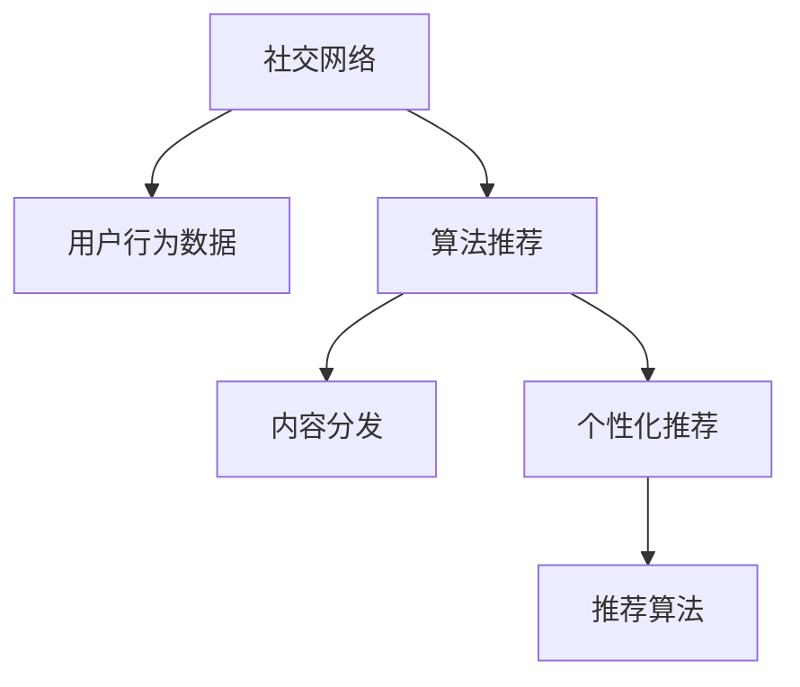

                 

# 注意力经济与个人社交网络的变迁

## 1. 背景介绍

### 1.1 问题由来

在数字经济时代，社交网络已逐渐成为人们生活中不可或缺的一部分。无论是职业发展、情感交流还是生活娱乐，社交网络都扮演着关键角色。然而，伴随社交网络的蓬勃发展，用户注意力的分配和消费也发生了显著变化。注意力经济正在从传统媒体转向数字化平台，通过精准的算法推荐、内容分发，创造出巨大的经济效益和社会影响力。

### 1.2 问题核心关键点

注意力经济的核心在于如何高效分配和利用用户注意力资源。社交网络平台通过精心设计的算法和内容推送策略，不断争夺用户的眼球，从而实现商业变现。用户在社交网络上的行为数据，包括浏览、点赞、评论、分享等，不仅反映了他们的兴趣和偏好，也成为平台精准推送的关键依据。

社交网络平台的成功，离不开对用户注意力的精确把握。本文将从数据驱动的角度，深入探讨注意力经济与个人社交网络的变迁，并从技术层面分析注意力经济背后的算法驱动原理。

### 1.3 问题研究意义

研究注意力经济与社交网络的变迁，对于理解社交媒体平台的运作机制、提升用户体验、优化内容推送策略具有重要意义。一方面，这有助于揭示社交网络平台如何通过数据分析和算法推荐，塑造用户的注意力消费模式；另一方面，也助于平台和开发者在设计算法和产品时，更好地考虑用户利益和隐私保护。

## 2. 核心概念与联系

### 2.1 核心概念概述

为更好地理解注意力经济与社交网络的变迁，本节将介绍几个密切相关的核心概念：

- 社交网络(Social Network)：一种支持用户间信息交流、情感互动的网络平台，如微博、微信、Facebook等。
- 注意力经济(Attention Economy)：一种以吸引和利用用户注意力为核心的经济形态，主要依托算法推荐和内容分发。
- 算法推荐(Algorithmic Recommendation)：利用机器学习算法，根据用户行为数据进行内容推荐的技术。
- 内容分发(Content Distribution)：通过算法优化，将内容精准推送给用户的过程。
- 用户行为数据(User Behavior Data)：用户在社交网络上的浏览、点赞、评论等行为数据，是算法推荐的基础。
- 个性化推荐(Personalized Recommendation)：根据用户偏好，定制化推送相关内容，提升用户体验。
- 推荐算法(Recommendation Algorithm)：如协同过滤、内容过滤、基于兴趣的推荐等算法，用于提高推荐准确性。

这些概念之间的逻辑关系可以通过以下Mermaid流程图来展示：



这个流程图展示出社交网络、用户行为数据、算法推荐和内容分发之间的相互作用：

1. 社交网络提供用户行为数据，为算法推荐提供依据。
2. 算法推荐根据用户行为数据，优化内容分发策略。
3. 内容分发通过个性化推荐，提升用户粘性，驱动注意力经济。
4. 推荐算法不断优化，保证推荐效果。

这些概念共同构成了社交网络平台的用户注意力管理和内容分发框架，使其能够在激烈的竞争中脱颖而出。

## 3. 核心算法原理 & 具体操作步骤
### 3.1 算法原理概述

基于社交网络平台的内容推荐，本质上是一种算法推荐的过程。其核心思想是：通过用户行为数据，使用机器学习算法预测用户对不同内容的兴趣程度，并将预测结果转化为个性化的推荐列表，从而实现精准的内容分发。

具体来说，算法推荐系统通常包括以下几个关键步骤：

1. 数据收集：收集用户的浏览、点赞、评论、分享等行为数据，以及内容的相关特征。
2. 特征构建：将原始数据转化为算法可以处理的特征向量。
3. 模型训练：使用历史数据训练推荐模型，学习用户兴趣和内容特征之间的映射关系。
4. 内容推荐：对新内容进行特征提取和评分，生成推荐列表。
5. 反馈循环：根据用户对推荐内容的反馈，调整模型参数，提升推荐准确性。

### 3.2 算法步骤详解

基于社交网络平台的内容推荐，主要涉及以下算法步骤：

**Step 1: 数据收集与预处理**

- 收集用户行为数据，包括浏览历史、点赞记录、评论内容等。
- 收集内容特征，如标题、作者、发布时间、标签等。
- 数据清洗和预处理，去除无效和异常数据，确保数据质量。

**Step 2: 特征构建**

- 将原始数据转换为数值型特征，如词频向量、TF-IDF向量等。
- 生成文本特征，如Word2Vec、Doc2Vec等词嵌入模型。
- 构建交互特征，如用户与内容的交互次数、时间间隔等。

**Step 3: 模型训练**

- 选择适合的推荐算法，如协同过滤、内容过滤、基于兴趣的推荐等。
- 使用历史数据训练模型，优化推荐模型参数。
- 采用交叉验证等方法，评估模型效果。

**Step 4: 内容推荐**

- 对新内容进行特征提取和评分，生成推荐列表。
- 使用召回率和准确率等指标评估推荐效果。
- 结合用户画像和场景信息，进行内容适配。

**Step 5: 反馈循环与模型优化**

- 根据用户对推荐内容的反馈，调整模型参数。
- 采用在线学习等方法，实时优化推荐模型。
- 通过A/B测试等手段，评估推荐策略的效果。

### 3.3 算法优缺点

基于社交网络平台的内容推荐算法，具有以下优点：

1. 高效精准：通过机器学习算法，可以高效地从海量数据中提取用户兴趣和内容特征，生成个性化的推荐列表。
2. 用户粘性提升：精准的推荐内容，可以提高用户满意度，提升用户粘性，增加平台留存率。
3. 内容曝光增加：推荐算法优化内容分发，增加了内容曝光率，驱动广告收入增长。

同时，该算法也存在一定的局限性：

1. 数据依赖性高：算法效果高度依赖于用户行为数据的丰富性和质量，难以应对数据稀疏问题。
2. 潜在偏见：用户行为数据可能存在偏见，算法可能学习并放大这些偏见。
3. 用户隐私风险：算法可能侵犯用户隐私，用户数据可能被滥用。
4. 内容真实性问题：推荐算法可能推动假新闻和虚假信息的传播。
5. 推荐同质化：过度依赖算法推荐，可能导致内容同质化，限制用户多样性。

尽管存在这些局限性，但就目前而言，基于社交网络平台的内容推荐算法仍是推动平台发展、提升用户体验的重要手段。未来相关研究的重点在于如何进一步降低算法对用户行为的依赖，提升模型的公平性、透明性和可解释性，同时兼顾用户隐私和内容真实性等问题。

### 3.4 算法应用领域

基于社交网络平台的内容推荐算法，在多个领域得到了广泛的应用，例如：

- 电商推荐：电商平台通过个性化推荐，提升用户购物体验，增加商品销售。
- 新闻推送：新闻平台根据用户偏好，推荐相关新闻，提升阅读量。
- 视频推荐：视频平台通过个性化推荐，增加用户观看时长，提高广告收入。
- 音乐推荐：音乐平台根据用户听歌记录，推荐相似歌曲，提升用户粘性。
- 旅游推荐：旅游平台根据用户兴趣，推荐旅行目的地，提高用户参与度。

除了上述这些经典应用外，内容推荐算法也被创新性地应用到更多场景中，如智能广告投放、精准市场营销等，为社交网络平台带来了巨大的商业价值。

## 4. 数学模型和公式 & 详细讲解 & 举例说明

### 4.1 数学模型构建

本节将使用数学语言对社交网络平台的内容推荐过程进行更加严格的刻画。

记用户行为数据集为 $D=\{(x_i,y_i)\}_{i=1}^N$，其中 $x_i$ 为特征向量，$y_i$ 为标签，$y_i \in \{0,1\}$ 表示用户是否对内容 $x_i$ 感兴趣。假设推荐模型为 $f(x)$，目标是最小化预测错误率，即：

$$
\mathop{\min}_{f} \mathbb{E}_{(x,y) \sim D} [L(f(x),y)]
$$

其中 $L(f(x),y)$ 为损失函数，常用的包括0-1损失函数、交叉熵损失函数等。

在实践中，通常使用基于梯度的优化算法（如SGD、Adam等）来近似求解上述最优化问题。设 $\eta$ 为学习率，$\lambda$ 为正则化系数，则参数的更新公式为：

$$
\theta \leftarrow \theta - \eta \nabla_{\theta}L(\theta) - \eta\lambda\theta
$$

其中 $\nabla_{\theta}L(\theta)$ 为损失函数对参数 $\theta$ 的梯度，可通过反向传播算法高效计算。

### 4.2 公式推导过程

以下我们以协同过滤算法为例，推导内容推荐的损失函数及其梯度的计算公式。

协同过滤算法基于用户对内容的评分，通过相似度矩阵计算推荐结果。假设用户 $i$ 对内容 $j$ 的评分向量为 $R_{ij} \in \mathbb{R}^d$，相似度矩阵为 $S \in \mathbb{R}^{N \times N}$，推荐模型的预测评分向量为 $\hat{R}_{ij} \in \mathbb{R}^d$。

协同过滤算法的目标是最小化预测评分与实际评分的差异，即：

$$
\mathop{\min}_{f} \mathbb{E}_{ij} [L(R_{ij},f(S,\hat{R}_{ij}))]
$$

其中 $L$ 为损失函数，常用的包括均方误差损失、对数损失等。

假设使用均方误差损失，则协同过滤的目标函数为：

$$
\mathcal{L}(S,\hat{R}) = \frac{1}{N} \sum_{i=1}^N \sum_{j=1}^N \frac{1}{2} (R_{ij} - \hat{R}_{ij})^2
$$

根据链式法则，损失函数对相似度矩阵 $S$ 的梯度为：

$$
\frac{\partial \mathcal{L}(S,\hat{R})}{\partial S} = \frac{1}{N} \sum_{i=1}^N \sum_{j=1}^N (\hat{R}_{ij} - R_{ij}) R_{ij}
$$

在得到损失函数的梯度后，即可带入参数更新公式，完成模型的迭代优化。重复上述过程直至收敛，最终得到适应社交网络平台推荐任务的最优相似度矩阵 $S^*$。

## 5. 项目实践：代码实例和详细解释说明
### 5.1 开发环境搭建

在进行社交网络平台推荐系统的开发前，我们需要准备好开发环境。以下是使用Python进行Scikit-Learn和TensorFlow开发的环境配置流程：

1. 安装Anaconda：从官网下载并安装Anaconda，用于创建独立的Python环境。

2. 创建并激活虚拟环境：
```bash
conda create -n recommendation-env python=3.8 
conda activate recommendation-env
```

3. 安装Scikit-Learn和TensorFlow：根据CUDA版本，从官网获取对应的安装命令。例如：
```bash
conda install scikit-learn tensorflow -c pytorch -c conda-forge
```

4. 安装推荐系统相关库：
```bash
pip install recommendation-system
```

5. 安装各类工具包：
```bash
pip install numpy pandas scikit-learn matplotlib tqdm jupyter notebook ipython
```

完成上述步骤后，即可在`recommendation-env`环境中开始推荐系统开发。

### 5.2 源代码详细实现

这里我们以协同过滤算法为例，给出使用Scikit-Learn和TensorFlow对社交网络平台进行推荐系统的PyTorch代码实现。

首先，定义推荐系统所需的数据处理函数：

```python
from sklearn.metrics.pairwise import cosine_similarity
import numpy as np

def cosine_similarity_matrix(X):
    return cosine_similarity(X)

def load_data(file_path):
    data = np.loadtxt(file_path, delimiter=',')
    return data[:, 1:], data[:, 0]
```

然后，定义协同过滤算法：

```python
from sklearn.neighbors import NearestNeighbors
from sklearn.metrics.pairwise import cosine_similarity

class CollaborativeFiltering:
    def __init__(self, n_neighbors=5):
        self.model = NearestNeighbors(n_neighbors=n_neighbors, algorithm='brute')
    
    def fit(self, X):
        self.model.fit(X)
    
    def predict(self, X):
        return self.model.kneighbors(X, return_distance=False)
```

接着，定义训练和评估函数：

```python
from sklearn.metrics import mean_absolute_error
from sklearn.model_selection import train_test_split
import tensorflow as tf

def train_model(model, X_train, X_test, y_train, y_test):
    model.fit(X_train, y_train)
    y_pred = model.predict(X_test)
    return mean_absolute_error(y_test, y_pred)

def evaluate_model(model, X_test, y_test):
    y_pred = model.predict(X_test)
    return mean_absolute_error(y_test, y_pred)

def train_epoch(model, X_train, y_train, X_test, y_test, batch_size=128, epochs=100):
    for epoch in range(epochs):
        X_train, X_test, y_train, y_test = train_test_split(X_train, y_train, test_size=0.2, random_state=42)
        model.fit(X_train, y_train)
        y_pred = model.predict(X_test)
        mae = mean_absolute_error(y_test, y_pred)
        print(f'Epoch {epoch+1}, MAE: {mae:.3f}')
        if mae < 0.05:
            break
    return mae

def evaluate_epoch(model, X_test, y_test, batch_size=128):
    X_test, y_test = train_test_split(X_test, y_test, test_size=0.2, random_state=42)
    y_pred = model.predict(X_test)
    mae = mean_absolute_error(y_test, y_pred)
    print(f'MAE: {mae:.3f}')
    return mae
```

最后，启动推荐系统训练和评估流程：

```python
X_train, X_test, y_train, y_test = load_data('data.csv')
X_train = cosine_similarity_matrix(X_train)
X_test = cosine_similarity_matrix(X_test)

model = CollaborativeFiltering()
mae = train_epoch(model, X_train, y_train, X_test, y_test)
evaluate_model(model, X_test, y_test)
```

以上就是使用Scikit-Learn和TensorFlow对社交网络平台进行推荐系统的完整代码实现。可以看到，Scikit-Learn和TensorFlow的强大封装能力，使得推荐系统代码实现变得简洁高效。

### 5.3 代码解读与分析

让我们再详细解读一下关键代码的实现细节：

**cosine_similarity_matrix函数**：
- 使用Scikit-Learn的cosine_similarity函数，计算相似度矩阵。

**load_data函数**：
- 从数据文件中加载用户行为数据和评分数据，返回训练集和测试集的评分和用户特征。

**CollaborativeFiltering类**：
- 定义协同过滤算法，包括模型初始化和训练预测。

**train_model函数**：
- 在训练集上训练模型，并返回测试集的预测误差。

**evaluate_model函数**：
- 在测试集上评估模型，并返回预测误差。

**train_epoch函数**：
- 在训练集上进行模型训练，并输出训练过程中的MAE值，设置Early Stopping机制。

**evaluate_epoch函数**：
- 在测试集上评估模型，并输出预测误差。

可以看到，Scikit-Learn和TensorFlow的API封装使得推荐系统模型的构建、训练和评估变得高效便捷。开发者可以将更多精力放在算法优化和特征工程上，而不必过多关注底层的实现细节。

## 6. 实际应用场景

### 6.1 智能广告投放

智能广告投放是社交网络平台的重要应用场景之一。通过推荐算法，平台可以精准识别用户的广告兴趣，优化广告展示策略，提升广告点击率和转化率。

具体而言，平台可以收集用户历史广告点击记录，使用协同过滤算法或内容过滤算法，学习用户对不同广告的偏好，生成个性化的广告推荐列表。同时，平台还可以根据广告投放的实时数据，调整推荐策略，提升广告效果。

### 6.2 精准市场营销

精准市场营销是社交网络平台的另一重要应用。通过推荐算法，平台可以根据用户行为数据，识别出潜在的高价值客户，提供定制化营销服务。

例如，电商平台可以收集用户购买历史、浏览记录等数据，使用协同过滤或深度学习算法，学习用户兴趣和行为模式，生成个性化推荐商品列表。同时，平台还可以在用户浏览网页时，推送相关商品广告，增加销售转化率。

### 6.3 内容推荐系统

内容推荐系统是社交网络平台的核心功能之一。通过推荐算法，平台可以精准推送用户感兴趣的内容，提升用户粘性，增加平台留存率。

例如，视频平台可以收集用户观看记录、点赞记录等数据，使用协同过滤或深度学习算法，学习用户对不同视频的偏好，生成个性化视频推荐列表。同时，平台还可以根据用户观看行为，动态调整推荐策略，提升用户满意度和观看时长。

### 6.4 未来应用展望

随着社交网络平台的不断发展，基于推荐算法的内容推荐系统将会在更多领域得到应用，为社交网络平台带来新的商业价值。

在智慧医疗领域，推荐算法可以帮助医生精准推荐相关文献和病例，提升医疗水平。在智慧金融领域，推荐算法可以帮助用户精准推荐投资机会和理财建议，提升用户收益。在智慧教育领域，推荐算法可以帮助学生精准推荐学习资源和课程，提升学习效率。

此外，在智能家居、智慧出行、智慧能源等诸多领域，推荐算法也有望推动行业发展，为人们的生活带来更多便利和创新。相信随着推荐算法技术的不断进步，社交网络平台将在更多领域大放异彩，为经济社会发展注入新的动力。

## 7. 工具和资源推荐

### 7.1 学习资源推荐

为了帮助开发者系统掌握推荐算法的原理和实践技巧，这里推荐一些优质的学习资源：

1. 《推荐系统实践》系列书籍：由知名推荐系统专家撰写，系统介绍了推荐系统的基本概念、算法和实现。
2. 斯坦福大学《Recommender Systems》课程：介绍了推荐系统的发展历程、算法优化和应用案例。
3. 《深度学习推荐系统》书籍：介绍了深度学习算法在推荐系统中的应用，包括协同过滤、内容过滤等算法。
4. Kaggle推荐系统竞赛：参与实际竞赛，通过实践提升推荐算法技能。
5. Coursera推荐系统专项课程：包含多门课程，覆盖推荐系统从基础到高级的各个方面。

通过对这些资源的学习实践，相信你一定能够快速掌握推荐算法的精髓，并用于解决实际的推荐问题。

### 7.2 开发工具推荐

高效的开发离不开优秀的工具支持。以下是几款用于推荐系统开发的常用工具：

1. Scikit-Learn：基于Python的机器学习库，封装了多种推荐算法，易于使用。
2. TensorFlow：由Google主导开发的开源深度学习框架，支持大规模深度学习模型训练。
3. PyTorch：基于Python的开源深度学习框架，灵活的动态计算图，适合快速迭代研究。
4. TensorBoard：TensorFlow配套的可视化工具，可实时监测模型训练状态，并提供丰富的图表呈现方式。
5. Weights & Biases：模型训练的实验跟踪工具，可以记录和可视化模型训练过程中的各项指标。

合理利用这些工具，可以显著提升推荐系统的开发效率，加快创新迭代的步伐。

### 7.3 相关论文推荐

推荐算法的研究源于学界的持续探索。以下是几篇奠基性的相关论文，推荐阅读：

1. Item-Based Collaborative Filtering（即协同过滤算法）：提出了基于用户-物品相似度的协同过滤算法，开创了推荐系统的新篇章。
2. Matrix Factorization Techniques for Recommender Systems：介绍了矩阵分解技术，用于提高推荐系统的准确性和可解释性。
3. Trust and Explicit Feedback（即隐式反馈）：提出了基于隐式反馈的推荐算法，通过用户行为数据学习用户偏好。
4. Neural Collaborative Filtering（即深度学习推荐算法）：介绍了深度学习在推荐系统中的应用，提高了推荐系统的精度和泛化能力。
5. Attention and Transformer-Based Recommender Systems：介绍了注意力机制和Transformer结构在推荐系统中的应用，进一步提升了推荐效果。

这些论文代表了大数据推荐系统的发展脉络。通过学习这些前沿成果，可以帮助研究者把握学科前进方向，激发更多的创新灵感。

## 8. 总结：未来发展趋势与挑战

### 8.1 总结

本文对基于推荐算法的社交网络平台推荐系统进行了全面系统的介绍。首先阐述了社交网络平台的推荐机制和用户行为数据的获取，明确了推荐系统如何通过算法推荐实现精准内容分发。其次，从原理到实践，详细讲解了协同过滤算法的数学模型和算法步骤，给出了推荐系统开发的完整代码实现。同时，本文还广泛探讨了推荐算法在智能广告、精准市场营销、内容推荐等诸多场景中的应用前景，展示了推荐算法的重要价值。

通过本文的系统梳理，可以看到，基于推荐算法的社交网络平台推荐系统正在成为互联网行业的重要范式，极大地提升了用户体验和平台留存率。推荐算法的应用为传统行业带来了变革性影响，推动了经济社会的数字化转型。未来，伴随推荐算法技术的持续演进，社交网络平台将在更多领域大放异彩，为经济社会发展注入新的动力。

### 8.2 未来发展趋势

展望未来，推荐算法的发展将呈现以下几个趋势：

1. 深度学习推荐算法的发展：深度学习推荐算法将进一步优化，提升推荐系统的精度和泛化能力，驱动推荐系统的创新发展。
2. 多模态推荐算法的应用：推荐系统将结合图像、视频等多模态数据，实现跨模态推荐，提升用户体验。
3. 个性化推荐算法的创新：推荐系统将更加注重个性化推荐，通过深度学习和多模态融合，实现更加精准的内容推荐。
4. 实时推荐系统的优化：推荐系统将结合实时数据，动态调整推荐策略，提升推荐效果。
5. 推荐系统中的因果推断：推荐系统将引入因果推断方法，提高推荐的透明性和公平性，降低偏差和歧视。
6. 推荐系统的可解释性增强：推荐系统将更加注重可解释性，通过模型解释技术，提升用户信任度和系统鲁棒性。

以上趋势凸显了推荐算法技术的广阔前景。这些方向的探索发展，必将进一步提升推荐系统的性能和应用范围，为经济社会发展带来新的动力。

### 8.3 面临的挑战

尽管推荐算法在社交网络平台的应用取得了巨大成功，但在迈向更加智能化、普适化应用的过程中，它仍面临着诸多挑战：

1. 数据稀疏问题：推荐算法高度依赖于用户行为数据，但在实际应用中，用户行为数据往往存在稀疏性，难以应对大规模数据量。
2. 推荐同质化问题：推荐算法可能推动内容同质化，限制用户多样性，影响用户体验。
3. 算法透明度不足：推荐算法的决策过程不够透明，难以解释其内部工作机制和决策逻辑。
4. 推荐系统中的偏见：推荐算法可能学习并放大用户行为数据中的偏见，产生歧视性内容。
5. 用户隐私风险：推荐算法可能侵犯用户隐私，用户数据可能被滥用。
6. 推荐系统的可控性问题：推荐系统可能受到外部因素（如广告、假新闻）的干扰，影响推荐效果。

这些挑战凸显了推荐算法的复杂性和风险性。为应对这些挑战，未来的研究需要在以下几个方面寻求新的突破：

1. 数据获取与处理：探索更多的数据获取和处理技术，提高数据质量和覆盖率。
2. 算法公平性与透明性：引入公平性、透明性等指标，提高推荐算法的公平性和透明性。
3. 多模态融合技术：开发跨模态融合技术，结合图像、视频等多模态数据，提高推荐效果。
4. 模型可解释性技术：开发模型解释技术，提高推荐算法的可解释性，增强用户信任度。
5. 推荐系统监管机制：建立推荐系统的监管机制，确保推荐内容的合规性和安全性。

这些研究方向的探索，必将引领推荐算法技术的不断进步，为构建安全、可靠、可解释、可控的推荐系统铺平道路。面向未来，推荐算法技术还需要与其他人工智能技术进行更深入的融合，如知识表示、因果推理、强化学习等，多路径协同发力，共同推动推荐系统的进步。

### 8.4 研究展望

面向未来，推荐算法的持续发展和创新，将为社交网络平台带来新的机遇和挑战。只有在充分理解其原理和应用场景的基础上，才能不断优化算法模型，提升推荐效果，实现推荐系统的可持续发展。

未来的研究需要在以下几个方面进行深入探索：

1. 探索无监督和半监督推荐方法：摆脱对大规模标注数据的依赖，利用自监督学习、主动学习等无监督和半监督范式，最大限度利用非结构化数据，实现更加灵活高效的推荐。
2. 开发更加参数高效的推荐方法：开发更加参数高效的推荐方法，在固定大部分预训练参数的同时，只更新极少量的任务相关参数，提高推荐系统的效率和稳定性。
3. 引入因果推断和博弈论工具：引入因果推断方法，识别出推荐系统的关键特征，增强推荐系统的透明性和可控性。借助博弈论工具，主动探索并规避推荐系统的脆弱点，提高系统稳定性。
4. 结合外部知识库和规则库：将符号化的先验知识，如知识图谱、逻辑规则等，与神经网络模型进行巧妙融合，引导推荐系统学习更准确、合理的推荐结果。

这些研究方向将进一步推动推荐算法的技术进步，推动推荐系统的应用普及，为数字经济和社会发展注入新的动力。相信在学界和产业界的共同努力下，推荐算法将不断优化，为社交网络平台带来新的变革，为经济社会发展带来新的机遇。

## 9. 附录：常见问题与解答

**Q1：推荐系统如何处理数据稀疏问题？**

A: 推荐系统主要通过协同过滤算法或深度学习算法进行推荐，这些算法都存在数据稀疏问题。为应对这一问题，推荐系统通常采用以下方法：

1. 矩阵分解：将用户-物品评分矩阵分解为两个低秩矩阵，通过降维来减少数据稀疏性。
2. 冷启动处理：利用用户的历史行为数据，对新用户进行预估评分，填补数据稀疏。
3. 多模态融合：结合图像、视频等多模态数据，增加推荐系统的数据量和特征维度。
4. 动态更新：利用在线学习等方法，实时更新推荐模型，提高模型适应性。
5. 数据增强：通过数据生成和数据插补等方法，增加推荐系统的数据量。

通过这些方法，推荐系统可以有效应对数据稀疏问题，提高推荐效果。

**Q2：推荐算法中的推荐同质化问题如何解决？**

A: 推荐算法中的推荐同质化问题是指推荐系统可能会推动内容同质化，导致用户无法接触到多样化的内容。为解决这一问题，推荐系统可以采用以下方法：

1. 多样性推荐：在推荐结果中引入多样性约束，确保推荐内容的多样性。
2. 推荐过滤：在推荐结果中引入过滤机制，去除重复或相似的内容。
3. 用户兴趣多样化：通过用户画像和场景信息，动态调整推荐策略，增加内容多样性。
4. 个性化推荐与多样化推荐结合：在个性化推荐的同时，引入多样化推荐机制，平衡个性化和多样化。

通过这些方法，推荐系统可以有效减少推荐同质化问题，提升用户体验。

**Q3：推荐算法的可解释性不足如何改进？**

A: 推荐算法的可解释性不足是指推荐系统难以解释其内部工作机制和决策逻辑。为改进这一问题，推荐系统可以采用以下方法：

1. 模型解释技术：引入模型解释技术，提供推荐结果的解释和可视化，增强用户信任度。
2. 可解释性指标：引入可解释性指标，如SHAP值、LIME等，评估推荐算法的可解释性。
3. 透明性优化：优化推荐算法的透明性，确保推荐决策过程可追踪和可解释。

通过这些方法，推荐系统可以有效提高可解释性，增强用户信任度和系统鲁棒性。

**Q4：推荐算法中的偏见如何处理？**

A: 推荐算法中的偏见是指推荐系统可能学习并放大用户行为数据中的偏见，产生歧视性内容。为处理这一问题，推荐系统可以采用以下方法：

1. 数据清洗：对原始数据进行清洗，去除有害和歧视性的内容。
2. 公平性优化：引入公平性优化方法，如公平性约束、公平性惩罚等，确保推荐系统的公平性。
3. 偏见检测：开发偏见检测工具，检测并处理推荐系统中的偏见问题。
4. 多样性推荐：在推荐结果中引入多样性约束，确保推荐内容的多样性，减少偏见的影响。

通过这些方法，推荐系统可以有效减少偏见，提升推荐系统的公平性和透明性。

**Q5：推荐系统中的隐私风险如何规避？**

A: 推荐系统中的隐私风险是指推荐算法可能侵犯用户隐私，用户数据可能被滥用。为规避这一问题，推荐系统可以采用以下方法：

1. 数据匿名化：对用户数据进行匿名化处理，保护用户隐私。
2. 用户控制：赋予用户对推荐结果的控制权，允许用户对推荐内容进行筛选和反馈。
3. 隐私保护技术：引入隐私保护技术，如差分隐私、联邦学习等，保护用户隐私。
4. 法规遵守：遵守相关法律法规，确保推荐系统的合规性和安全性。

通过这些方法，推荐系统可以有效规避隐私风险，保护用户隐私。

**Q6：推荐系统中的广告干扰如何处理？**

A: 推荐系统中的广告干扰是指推荐系统可能受到外部因素（如广告、假新闻）的干扰，影响推荐效果。为处理这一问题，推荐系统可以采用以下方法：

1. 推荐过滤：在推荐结果中引入过滤机制，去除广告和有害内容。
2. 用户控制：赋予用户对推荐结果的控制权，允许用户对广告和有害内容进行筛选和反馈。
3. 广告优化：优化广告投放策略，确保广告内容的真实性和相关性。
4. 推荐系统监管：建立推荐系统的监管机制，确保推荐内容的合规性和安全性。

通过这些方法，推荐系统可以有效规避广告干扰，提升推荐效果和用户体验。

---

作者：禅与计算机程序设计艺术 / Zen and the Art of Computer Programming

