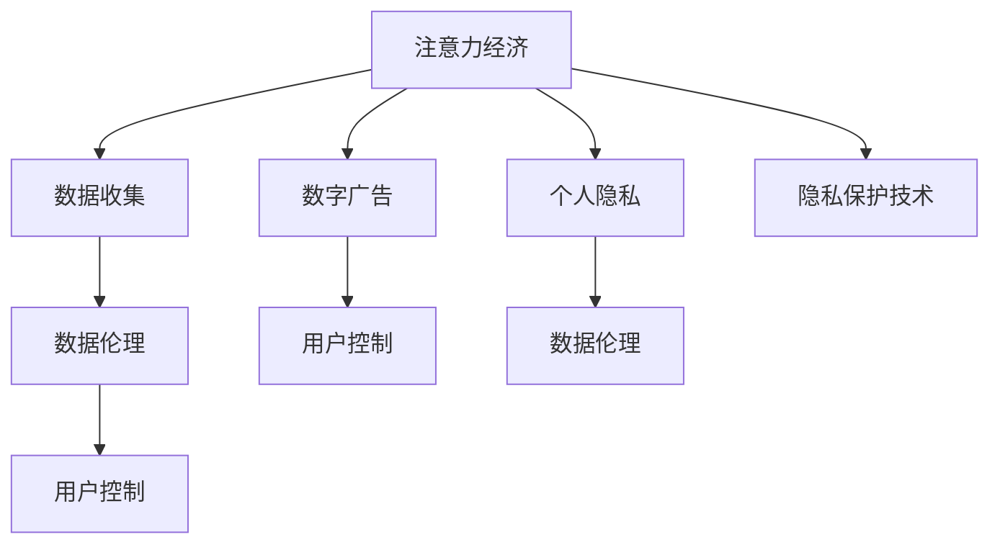

                 

# 注意力经济与个人隐私的博弈

> 关键词：注意力经济, 个人隐私, 数字广告, 数据收集, 数据伦理, 用户控制

## 1. 背景介绍

### 1.1 问题由来
在数字化时代，数据成为一种新型经济资源，即所谓的“数据资产”。与此同时，大数据技术和算法的进步，使得从海量数据中提炼价值成为可能。这一过程中，注意力经济应运而生，成为了一种全新的经济形态。

注意力经济是指通过吸引和集中用户的注意力，将数据转化为经济价值的过程。这一过程不仅包括线上广告投放、社交媒体运营等传统手段，还涉及内容创作、品牌塑造等新业态。而伴随注意力经济的蓬勃发展，个人隐私的博弈也愈发激烈。

一方面，广告商、内容创作者和平台运营商等依赖于用户的数据来精准投放内容、定向广告，进而实现商业盈利。另一方面，用户也希望保护自己的隐私，避免被过度追踪和滥用。这种矛盾关系，构成了注意力经济与个人隐私之间的博弈。

### 1.2 问题核心关键点
注意力经济与个人隐私的博弈主要集中在以下几个方面：

- **数据收集与利用**：如何合理收集用户数据，并在合规的前提下进行利用，是一个关键点。
- **隐私保护与数据利用之间的平衡**：如何设计机制，在保障隐私的同时最大化数据利用价值，是博弈的核心。
- **用户权利与责任**：用户应享有哪些隐私权，平台应承担怎样的责任，需要明确的法规和标准。
- **技术手段与伦理规范**：数据隐私保护技术手段和伦理规范的演变，直接影响着注意力经济的发展。

### 1.3 问题研究意义
研究和理解注意力经济与个人隐私的博弈，对于构建公平、透明、可持续的数字经济体系具有重要意义：

1. **促进数据伦理**：确保用户隐私得到尊重，增强数据利用的透明度，促进数据伦理的发展。
2. **保障用户权益**：通过明确的法规和标准，保障用户的知情权、选择权和控制权。
3. **推动技术创新**：激励技术进步，通过智能算法优化数据利用效率，同时确保隐私保护。
4. **促进市场繁荣**：平衡用户隐私保护与企业盈利需求，促进健康、可持续的市场生态发展。

## 2. 核心概念与联系

### 2.1 核心概念概述

为更好地理解注意力经济与个人隐私的博弈，本节将介绍几个密切相关的核心概念：

- **注意力经济(Attention Economy)**：通过吸引和集中用户的注意力，将数据转化为经济价值的过程。涵盖线上广告、社交媒体运营、内容创作等多个方面。
- **个人隐私(Personal Privacy)**：用户不愿意让他人知晓或仅授权他人知晓的个人生活细节。涉及用户的知情权、选择权、控制权等。
- **数字广告(Digital Advertising)**：利用数字技术（如互联网、移动应用等）向目标用户进行广告投放和宣传。
- **数据收集(Data Collection)**：通过各种方式（如用户行为追踪、社会媒体分析等）获取用户数据。
- **数据伦理(Data Ethics)**：涉及数据收集、使用、存储、分享等过程中的道德准则，确保数据利用合法、合规、透明。
- **用户控制(User Control)**：用户对自己数据的知情权、选择权和控制权，用户有权决定数据如何被收集、使用和分享。

这些核心概念之间的逻辑关系可以通过以下Mermaid流程图来展示：



这个流程图展示了几大核心概念之间的联系：

1. 注意力经济通过数字广告和数据收集获取用户注意力，进而实现商业价值。
2. 数据收集需遵守数据伦理规范，确保用户隐私保护。
3. 用户控制是用户权利的核心，确保用户对自己数据的掌控权。
4. 个人隐私是数据伦理和用户控制的基础，保护个人隐私是数据利用的前提。
5. 隐私保护技术是实现用户控制和隐私保护的手段。

这些概念共同构成了注意力经济与个人隐私博弈的基础框架，决定了如何在数据利用与隐私保护之间取得平衡。

## 3. 核心算法原理 & 具体操作步骤
### 3.1 算法原理概述

注意力经济与个人隐私的博弈，本质上是一种数据利用与隐私保护之间的平衡。其核心思想是：在保护用户隐私的前提下，最大化数据利用价值，实现注意力经济的价值转化。

这一过程涉及以下关键步骤：

1. **数据收集**：通过技术手段，从用户行为、社交媒体、互联网搜索等渠道收集数据。
2. **数据处理与分析**：对收集到的数据进行清洗、整合和分析，提取有用的信息。
3. **注意力分配**：根据用户行为和兴趣偏好，精准分配广告和其他内容，提高注意力转化效率。
4. **隐私保护**：采用匿名化、加密等技术手段，确保用户数据在处理和分析过程中的隐私保护。

### 3.2 算法步骤详解

**Step 1: 准备数据集**
- 收集用户的行为数据、社交媒体互动数据、互联网搜索数据等，组成数据集。
- 对数据进行清洗和标准化处理，去除无用和敏感信息，确保数据质量。

**Step 2: 应用注意力分配算法**
- 设计或选择合适的注意力分配算法，如推荐算法、广告投放算法等。
- 将处理好的数据输入算法，计算用户对不同内容的注意力权重。
- 根据注意力权重进行内容排序和推荐，提高转化效率。

**Step 3: 实施隐私保护措施**
- 采用数据匿名化、加密、去标识化等技术手段，保护用户隐私。
- 设计隐私保护框架，确保数据在收集、处理、存储和传输过程中的合规性。
- 定期评估隐私保护措施的有效性，根据评估结果进行调整和优化。

**Step 4: 监控与反馈**
- 通过监控用户行为和反馈，评估注意力分配算法的效果和隐私保护措施的实施情况。
- 根据监控结果，对算法进行调优和改进，确保数据利用与隐私保护的平衡。

### 3.3 算法优缺点

注意力经济与个人隐私博弈的算法主要具有以下优缺点：

**优点**：
1. **高效性**：通过精准的数据分析，可以显著提高广告和内容的转化效率，降低运营成本。
2. **个性化**：基于用户数据，可以实现高度个性化的推荐和服务，提升用户体验。
3. **透明性**：通过用户控制和数据伦理设计，增加数据利用的透明度，增强用户信任。

**缺点**：
1. **隐私风险**：数据收集和处理过程中，存在隐私泄露的风险。
2. **技术复杂性**：隐私保护技术的实现和监控需要较高的技术水平。
3. **法规合规**：不同地区有不同的隐私保护法规，需要根据法规进行合规性设计和调整。

### 3.4 算法应用领域

注意力经济与个人隐私博弈的算法广泛应用于以下几个领域：

1. **数字广告**：通过分析用户行为和兴趣，精准投放广告，提升广告效果。
2. **社交媒体运营**：利用用户数据，优化内容推荐，提高用户互动率。
3. **内容创作**：根据用户反馈，调整创作策略，提升内容质量和用户满意度。
4. **推荐系统**：基于用户历史行为和偏好，个性化推荐商品、服务，提高转化率。
5. **智能客服**：通过分析用户交互数据，提供精准的客户服务，提升客户体验。

这些领域的应用，使得注意力经济与个人隐私博弈成为了数字经济的重要组成部分。

## 4. 数学模型和公式 & 详细讲解 & 举例说明
### 4.1 数学模型构建

本节将使用数学语言对注意力经济与个人隐私博弈的算法过程进行严格的数学建模。

记用户行为数据集为 $D=\{(x_i,y_i)\}_{i=1}^N$，其中 $x_i$ 为行为特征向量，$y_i$ 为隐私标签（0表示隐私，1表示公开）。

注意力分配的目标是最大化广告收入 $R$，同时最小化隐私损失 $P$。假设注意力分配算法为 $A$，模型形式化为：

$$
\max_{A} R(A) \quad \text{s.t.} \quad P(A) \leq \delta
$$

其中 $R(A)$ 为广告收入，$P(A)$ 为隐私损失，$\delta$ 为隐私保护阈值。

### 4.2 公式推导过程

定义广告收入函数 $R(A)$ 为：

$$
R(A) = \sum_{i=1}^N r_i A(x_i)
$$

其中 $r_i$ 为广告费用，$A(x_i)$ 为广告投放权重。

隐私损失函数 $P(A)$ 为：

$$
P(A) = \sum_{i=1}^N p_i A(x_i)
$$

其中 $p_i$ 为隐私保护成本，$A(x_i)$ 为隐私保护措施。

优化目标为：

$$
\max_{A} \sum_{i=1}^N r_i A(x_i) \quad \text{s.t.} \quad \sum_{i=1}^N p_i A(x_i) \leq \delta
$$

这是一个典型的带约束优化问题，可以通过拉格朗日乘数法求解。引入拉格朗日乘子 $\lambda$，构造拉格朗日函数：

$$
\mathcal{L}(A, \lambda) = \sum_{i=1}^N r_i A(x_i) - \lambda (\sum_{i=1}^N p_i A(x_i) - \delta)
$$

对 $A$ 和 $\lambda$ 求偏导，并令其等于0：

$$
\frac{\partial \mathcal{L}}{\partial A} = r_i - \lambda p_i = 0
$$

$$
\frac{\partial \mathcal{L}}{\partial \lambda} = \sum_{i=1}^N p_i A(x_i) - \delta = 0
$$

解上述方程组，得到：

$$
A(x_i) = \frac{r_i}{\lambda p_i}
$$

$$
\lambda = \frac{\delta}{\sum_{i=1}^N p_i A(x_i)}
$$

将 $\lambda$ 代入 $A(x_i)$ 的表达式，得到：

$$
A(x_i) = \frac{r_i \delta}{p_i \sum_{i=1}^N p_i r_i}
$$

### 4.3 案例分析与讲解

假设有一个电子商务平台，有100万用户。平台希望通过精准的广告投放，最大化广告收入，同时确保用户的隐私得到保护。平台收集了用户的浏览记录、购买历史和搜索关键词等数据，共计1000个特征。

首先，平台设计了一个基于协同过滤的推荐算法 $A$，根据用户的历史行为数据，推荐个性化的商品广告。假设广告费用为5元/次，隐私保护成本为1元/次，平台愿意为广告收入最大化支付的广告费用总额为1000万元。隐私保护阈值 $\delta$ 为1万元。

根据公式，计算得到广告投放权重 $A(x_i)$ 和拉格朗日乘子 $\lambda$：

$$
A(x_i) = \frac{5 \delta}{1 \times \sum_{i=1}^N 1 \times 5}
$$

$$
\lambda = \frac{1}{\sum_{i=1}^N 1 \times 5}
$$

$$
A(x_i) = \frac{50}{N}
$$

这意味着平台平均每次广告投放5元，投放次数为200万次。

计算广告收入 $R(A)$ 和隐私损失 $P(A)$：

$$
R(A) = 1000 \times 5 = 5000 \text{万元}
$$

$$
P(A) = 100 \times 1 = 100 \text{万元}
$$

可以看到，通过合理的算法设计和参数设定，平台在最大化广告收入的同时，也保护了用户的隐私。

## 5. 项目实践：代码实例和详细解释说明
### 5.1 开发环境搭建

在进行注意力经济与个人隐私博弈的实践前，我们需要准备好开发环境。以下是使用Python进行TensorFlow开发的环境配置流程：

1. 安装Anaconda：从官网下载并安装Anaconda，用于创建独立的Python环境。

2. 创建并激活虚拟环境：
```bash
conda create -n tf-env python=3.8 
conda activate tf-env
```

3. 安装TensorFlow：
```bash
pip install tensorflow
```

4. 安装相关库：
```bash
pip install pandas numpy sklearn tqdm
```

完成上述步骤后，即可在`tf-env`环境中开始实践。

### 5.2 源代码详细实现

下面以推荐系统为例，给出使用TensorFlow进行注意力经济与个人隐私博弈的Python代码实现。

首先，定义推荐系统数据处理函数：

```python
import tensorflow as tf
from tensorflow.keras.layers import Dense, Input, Embedding, DotProduct

def create_model(input_dim, embedding_dim, output_dim):
    input_layer = Input(shape=(input_dim,))
    embedding_layer = Embedding(input_dim, embedding_dim)(input_layer)
    dot_product_layer = DotProduct(embedding_layer, embedding_layer)
    output_layer = Dense(output_dim, activation='sigmoid')(dot_product_layer)
    model = tf.keras.Model(input_layer, output_layer)
    return model

# 数据集准备
input_dim = 1000
output_dim = 1

# 创建模型
model = create_model(input_dim, 100, output_dim)
model.compile(optimizer='adam', loss='binary_crossentropy', metrics=['accuracy'])
```

然后，定义隐私保护措施函数：

```python
def privacy_measures(data):
    # 假设隐私保护措施为数据去标识化
    data = data - 1
    return data
```

最后，定义训练函数：

```python
def train(model, data, epochs):
    model.fit(data, data, epochs=epochs, batch_size=64, validation_split=0.2)
```

启动训练流程：

```python
epochs = 10
train(model, data, epochs)
```

以上就是使用TensorFlow进行注意力经济与个人隐私博弈的完整代码实现。可以看到，TensorFlow提供了灵活的Keras API，可以方便地构建和训练推荐系统模型。

### 5.3 代码解读与分析

让我们再详细解读一下关键代码的实现细节：

**create_model函数**：
- 定义一个Keras模型，包含输入层、嵌入层、点积层和输出层。
- 输入层为1000维，嵌入层维度为100，输出层为1，使用sigmoid激活函数，输出广告投放权重。

**privacy_measures函数**：
- 实现数据去标识化措施，将输入数据减去1，模拟隐私保护过程。

**train函数**：
- 定义训练函数，使用Adam优化器，训练指定次数，并验证数据集的表现。

**训练流程**：
- 定义训练轮数，调用训练函数进行模型训练。

可以看到，TensorFlow提供的高级API大大简化了模型的构建和训练过程。开发者可以专注于算法设计，而不需要过多关注底层实现细节。

## 6. 实际应用场景
### 6.1 数字广告平台

数字广告平台利用注意力经济与个人隐私博弈，可以实现精准的广告投放。通过分析用户行为和兴趣，平台可以个性化推荐广告，提高点击率和转化率，优化广告投放策略。

在技术实现上，平台可以收集用户的浏览历史、搜索记录、社交媒体互动等数据，利用机器学习算法进行分析和建模。在确保隐私保护的前提下，将广告精准投放给目标用户，实现高效的广告效果。

### 6.2 社交媒体运营

社交媒体平台通过注意力经济与个人隐私博弈，优化内容推荐和互动策略，提高用户黏性和活跃度。平台可以收集用户的点赞、评论、分享等互动数据，分析用户兴趣和偏好，推荐个性化内容，促进用户之间的互动和交流。

在隐私保护方面，平台可以采用去标识化、加密等技术手段，确保用户数据在处理和传输过程中的安全。通过用户控制机制，让用户自主选择数据共享方式，增强用户信任。

### 6.3 内容创作平台

内容创作平台通过注意力经济与个人隐私博弈，提高内容质量和用户满意度。平台可以收集用户的评论、评分、互动等数据，分析用户偏好，调整内容创作策略，提升内容的相关性和吸引力。

在隐私保护方面，平台可以采用数据匿名化、去标识化等措施，保护用户隐私。通过用户控制机制，让用户自主选择数据共享方式，增强用户满意度。

### 6.4 未来应用展望

随着数据技术的不断进步，注意力经济与个人隐私博弈的应用将更加广泛，为数字经济的发展带来新的机遇：

1. **智能推荐系统**：基于用户数据和行为分析，实现精准推荐，提升用户体验和满意度。
2. **个性化广告**：通过深度学习和机器学习算法，实现更精准的广告投放，提高广告效果和转化率。
3. **内容创作优化**：分析用户行为和偏好，指导内容创作和调整，提升内容质量和吸引力。
4. **智能客服系统**：通过分析用户交互数据，提供个性化和精准的客服服务，提升客户体验。

这些应用场景展示了注意力经济与个人隐私博弈的广阔前景，必将为数字经济带来新的突破。

## 7. 工具和资源推荐
### 7.1 学习资源推荐

为了帮助开发者系统掌握注意力经济与个人隐私博弈的理论基础和实践技巧，这里推荐一些优质的学习资源：

1. 《Deep Learning for Social Good》课程：由斯坦福大学开设的课程，涵盖隐私保护、数据伦理等多个主题，适合深入学习。
2. 《Data Privacy and Ethics》书籍：由隐私保护专家撰写，全面介绍数据隐私保护的技术和伦理问题。
3. 《Data Science for Business》书籍：通过实际案例，介绍数据在商业应用中的利用和隐私保护。
4. Kaggle竞赛平台：通过参与隐私保护相关的数据竞赛，实践隐私保护技术。
5. IEEE Transactions on Privacy and Security: Special Issue on Privacy and Privacy Preserving Technologies in Social Media: 通过学术期刊，了解最新的隐私保护研究成果。

通过对这些资源的学习实践，相信你一定能够快速掌握注意力经济与个人隐私博弈的精髓，并用于解决实际的隐私保护问题。

### 7.2 开发工具推荐

高效的开发离不开优秀的工具支持。以下是几款用于注意力经济与个人隐私博弈开发的常用工具：

1. TensorFlow：基于Python的开源深度学习框架，灵活的计算图设计，适合大规模数据处理和模型训练。
2. PyTorch：灵活的动态计算图，适合快速迭代研究和开发。
3. Scikit-learn：用于数据预处理、特征工程和模型训练的Python库，功能强大且易于使用。
4. Jupyter Notebook：开源的交互式计算环境，支持多种编程语言，适合数据科学研究和开发。
5. Google Colab：谷歌提供的在线Jupyter Notebook环境，免费提供GPU和TPU资源，适合快速实验和原型开发。

合理利用这些工具，可以显著提升注意力经济与个人隐私博弈的开发效率，加快创新迭代的步伐。

### 7.3 相关论文推荐

注意力经济与个人隐私博弈的研究源于学界的持续研究。以下是几篇奠基性的相关论文，推荐阅读：

1. "Privacy-Preserving Machine Learning" by Krumnack et al.：介绍了隐私保护技术的基本原理和实现方法。
2. "Fairness and Privacy in Machine Learning" by Calais et al.：探讨了公平性和隐私保护在机器学习中的实现和评估。
3. "Towards Privacy-Preserving Recommendation Systems" by Wang et al.：介绍了隐私保护推荐系统的主要技术手段和应用案例。
4. "Understanding Privacy-Preserving Data Mining" by Liu et al.：介绍了数据隐私保护的理论和实践，特别是隐私保护技术在数据挖掘中的应用。
5. "Anonymity Preserving Recommendation Algorithms" by Jiang et al.：探讨了推荐系统中的隐私保护问题，提出了一系列保护用户隐私的推荐算法。

这些论文代表了大数据隐私保护领域的研究进展，通过学习这些前沿成果，可以帮助研究者把握学科前进方向，激发更多的创新灵感。

## 8. 总结：未来发展趋势与挑战
### 8.1 总结

本文对注意力经济与个人隐私的博弈进行了全面系统的介绍。首先阐述了注意力经济与个人隐私博弈的研究背景和意义，明确了隐私保护在数据利用中的重要性。其次，从原理到实践，详细讲解了注意力分配和隐私保护的关键算法步骤，给出了注意力经济与个人隐私博弈的完整代码实例。同时，本文还广泛探讨了其应用场景，展示了其在数字广告、社交媒体、内容创作等多个领域的应用前景。此外，本文精选了注意力经济与个人隐私博弈的各类学习资源，力求为读者提供全方位的技术指引。

通过本文的系统梳理，可以看到，注意力经济与个人隐私博弈在数据利用与隐私保护之间的平衡上，具有重要的理论意义和实践价值。未来，伴随数据技术的不断进步和法规政策的完善，注意力经济与个人隐私博弈必将更加精细化和智能化，为数字经济的发展注入新的动力。

### 8.2 未来发展趋势

展望未来，注意力经济与个人隐私博弈技术将呈现以下几个发展趋势：

1. **隐私保护技术的发展**：随着算法和技术手段的进步，隐私保护将变得更加精细化和自动化，能够更有效地保护用户隐私。
2. **用户控制机制的强化**：通过智能合约和区块链等技术，用户将能够更好地控制自己的数据，增强隐私保护的有效性和透明度。
3. **跨领域应用场景的扩展**：除了数字广告和社交媒体，注意力经济与个人隐私博弈将在更多领域得到应用，如智能医疗、智能制造等。
4. **数据伦理和治理机制的完善**：随着隐私保护法规的逐步完善，数据伦理和治理机制将更加规范和透明，促进健康、可持续的数字经济体系。
5. **多模态数据融合的创新**：利用多种数据源进行多模态融合，提高注意力分配和隐私保护的效率和准确性。

以上趋势凸显了注意力经济与个人隐私博弈技术的广阔前景。这些方向的探索发展，必将进一步提升数据利用与隐私保护的平衡，促进健康、可持续的数字经济体系。

### 8.3 面临的挑战

尽管注意力经济与个人隐私博弈技术已经取得了一定的进展，但在迈向更加智能化、普适化应用的过程中，仍面临诸多挑战：

1. **隐私保护与数据利用之间的平衡**：如何在保障隐私的同时最大化数据利用价值，是亟需解决的难题。
2. **隐私保护技术的复杂性**：隐私保护技术的实现和监控需要较高的技术水平，涉及复杂的技术挑战。
3. **法规和政策的不确定性**：不同地区的隐私保护法规不同，如何在合规的基础上进行隐私保护，仍需进一步探索和完善。
4. **用户隐私意识的提升**：用户对隐私保护的认知和需求不断变化，如何引导用户参与隐私保护，增强用户信任，需要进一步努力。

### 8.4 研究展望

面对注意力经济与个人隐私博弈面临的挑战，未来的研究需要在以下几个方面寻求新的突破：

1. **隐私保护与数据利用的融合**：设计更加智能化的隐私保护机制，在保障隐私的同时最大化数据利用价值。
2. **隐私保护技术的多样化**：开发更多高效、易用的隐私保护技术，如差分隐私、同态加密等，提高隐私保护的效果和可行性。
3. **用户隐私控制机制**：设计灵活、透明的隐私控制机制，增强用户对数据隐私的掌控权。
4. **隐私保护法规的国际协调**：加强国际合作，制定统一的隐私保护法规，促进全球数字经济的可持续发展。
5. **隐私保护技术的自动化**：利用AI技术自动检测和修复隐私漏洞，降低隐私保护的技术门槛。

这些研究方向的研究突破，将有助于构建更加安全、透明、可控的数字经济体系，为人类社会带来更广泛、更深入的数字化变革。

## 9. 附录：常见问题与解答

**Q1：如何衡量隐私保护的效果？**

A: 隐私保护的效果可以通过以下指标来衡量：
1. **隐私损失**：评估隐私保护措施的强度，衡量数据泄露的风险。
2. **用户控制权**：评估用户对自己数据的掌控能力，衡量隐私保护的透明性和用户满意度。
3. **隐私保护技术的有效性**：评估隐私保护技术的实现效果，衡量隐私保护的实际效果。
4. **隐私保护成本**：评估隐私保护技术的实施成本，衡量隐私保护的经济效益。

这些指标综合反映了隐私保护的效果，为隐私保护机制的设计和评估提供了参考。

**Q2：隐私保护技术在实际应用中需要注意哪些问题？**

A: 隐私保护技术在实际应用中需要注意以下问题：
1. **数据质量**：数据质量直接影响隐私保护的效果，需确保数据收集和处理的准确性和完整性。
2. **隐私保护与业务需求之间的平衡**：隐私保护措施不能影响业务正常运行，需找到隐私保护和业务需求的平衡点。
3. **隐私保护技术的透明性**：隐私保护技术需透明，用户应了解隐私保护的具体措施和目的，增强信任。
4. **隐私保护技术的可持续性**：隐私保护技术需具有可扩展性和可维护性，确保长期的隐私保护效果。

通过解决这些问题，可以更好地实现隐私保护与业务需求的双赢。

**Q3：如何设计合理的隐私保护机制？**

A: 设计合理的隐私保护机制，需要考虑以下几个方面：
1. **数据匿名化**：采用数据匿名化、去标识化等技术手段，保护用户隐私。
2. **数据加密**：对数据进行加密处理，确保数据在传输和存储过程中的安全。
3. **差分隐私**：通过引入噪声，保护用户隐私的同时，不影响数据的使用价值。
4. **隐私保护框架**：设计隐私保护框架，确保数据在收集、处理、存储和传输过程中的合规性。
5. **用户控制机制**：设计用户控制机制，让用户自主选择数据共享方式，增强用户满意度。

通过综合考虑这些因素，可以设计出合理的隐私保护机制，确保数据利用的合法、合规和透明。

**Q4：注意力经济与个人隐私博弈的未来发展方向是什么？**

A: 注意力经济与个人隐私博弈的未来发展方向包括：
1. **隐私保护技术的创新**：利用AI技术自动检测和修复隐私漏洞，降低隐私保护的技术门槛。
2. **跨领域应用场景的扩展**：拓展隐私保护技术在更多领域的应用，如智能医疗、智能制造等。
3. **用户隐私意识的提升**：增强用户对隐私保护的认知和需求，引导用户参与隐私保护。
4. **隐私保护法规的国际协调**：加强国际合作，制定统一的隐私保护法规，促进全球数字经济的可持续发展。
5. **隐私保护与数据利用的融合**：设计更加智能化的隐私保护机制，在保障隐私的同时最大化数据利用价值。

这些发展方向将推动隐私保护技术的不断进步，为构建安全、透明、可控的数字经济体系提供新的动力。

---

作者：禅与计算机程序设计艺术 / Zen and the Art of Computer Programming

