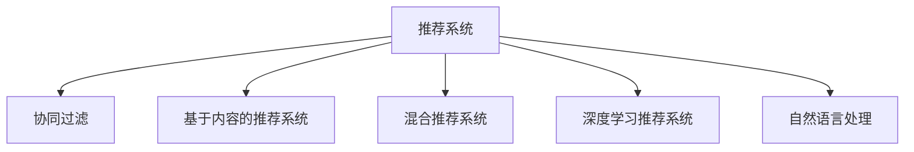

                 

# 注意力经济与个性化推荐算法：为受众提供定制、有针对性的内容

> 关键词：注意力经济,个性化推荐算法,用户行为分析,协同过滤,深度学习,自然语言处理,内容推荐系统,推荐系统优化

## 1. 背景介绍

在信息爆炸的时代，如何从海量的内容中过滤出符合用户兴趣的优质信息，成为了互联网企业的核心竞争点。传统的基于关键词的搜索算法已不能满足用户的深度个性化需求，推荐系统应运而生。推荐系统通过分析用户的历史行为数据和当前兴趣，为用户推荐个性化的内容，极大地提升了用户体验和平台留存率。

### 1.1 问题由来
随着互联网技术的发展，推荐系统已经广泛应用于电商、新闻、视频、社交媒体等各个领域。推荐系统的主要目标是通过分析用户的行为数据，预测用户的未来需求，为其推荐可能感兴趣的内容。尽管推荐系统已经取得了很大的成功，但仍然存在一些难以解决的问题，比如用户行为数据的稀疏性和冷启动问题。同时，随着用户对推荐系统需求的不断增长，如何提高推荐系统的性能和用户体验，也成为当前推荐系统研究的热点问题。

### 1.2 问题核心关键点
推荐系统主要分为三大类：协同过滤、基于内容的推荐、混合推荐系统。其中，协同过滤和基于内容的推荐是推荐系统的两种主要方法，混合推荐系统则是它们的结合体，试图综合两者的优势，提升推荐效果。

协同过滤（Collaborative Filtering, CF）基于用户和物品间的相似度计算，通过推荐与目标用户兴趣相似的其他用户喜欢的物品，实现个性化推荐。协同过滤的优点在于不需要用户行为数据，适用于无用户行为数据的新用户。但协同过滤的缺点在于计算量大、推荐效果不稳定。

基于内容的推荐系统（Content-Based Recommendation, CB）则从物品的特征出发，通过分析物品的属性，为用户推荐符合其兴趣的物品。基于内容的推荐系统的优点在于不需要用户行为数据，适用于新用户。但基于内容的推荐系统的缺点在于推荐效果依赖于物品特征的准确性，难以处理用户偏好的变化。

混合推荐系统结合了协同过滤和基于内容的推荐系统，既考虑了用户的历史行为数据，又综合了物品的特征信息，具有较高的推荐准确性。但混合推荐系统的缺点在于算法复杂度高，难以进行大规模实时推荐。

因此，如何提升推荐系统性能，平衡推荐效果和计算效率，提高推荐系统的可解释性和稳定性，成为当前推荐系统研究的主要方向。

## 2. 核心概念与联系

### 2.1 核心概念概述

为更好地理解注意力经济与个性化推荐算法，本节将介绍几个密切相关的核心概念：

- **推荐系统（Recommendation System）**：根据用户的历史行为数据和偏好，为其推荐可能感兴趣的内容的系统。推荐系统的目的是提升用户体验和平台留存率。

- **协同过滤（Collaborative Filtering, CF）**：基于用户行为数据，计算用户和物品间的相似度，推荐与目标用户兴趣相似的其他用户喜欢的物品。协同过滤具有高效、可扩展性好等优点，但难以处理新用户和老用户的推荐问题。

- **基于内容的推荐系统（Content-Based Recommendation, CB）**：从物品的特征出发，分析物品的属性，为用户推荐符合其兴趣的物品。基于内容的推荐系统具有准确性高、推荐效果好等优点，但难以处理用户偏好的变化。

- **混合推荐系统（Hybrid Recommendation System）**：结合协同过滤和基于内容的推荐系统，综合考虑用户行为数据和物品特征信息，具有较高的推荐准确性。但混合推荐系统算法复杂度高，难以进行大规模实时推荐。

- **深度学习推荐系统**：利用深度神经网络对用户行为数据和物品特征进行建模，提升推荐系统的性能。深度学习推荐系统具有自动特征学习、推荐效果好等优点，但模型复杂度高、训练成本大。

- **自然语言处理（Natural Language Processing, NLP）**：分析、理解和生成自然语言的技术。在推荐系统中，自然语言处理技术常用于用户评论分析、情感分析等场景，提升推荐系统的个性化和多样化。

这些核心概念之间的逻辑关系可以通过以下Mermaid流程图来展示：



这个流程图展示了一些核心概念及其之间的关系：

1. 推荐系统通过协同过滤、基于内容的推荐系统、混合推荐系统等方法进行个性化推荐。
2. 深度学习推荐系统和自然语言处理技术进一步提升了推荐系统的性能和效果。
3. 协同过滤、基于内容的推荐系统和混合推荐系统都是推荐系统的基本构成部分。

## 3. 核心算法原理 & 具体操作步骤
### 3.1 算法原理概述

推荐系统的核心思想是根据用户的历史行为数据，预测用户对新物品的评分，为其推荐可能感兴趣的内容。基于监督学习的个性化推荐算法，是一种通过有监督学习优化推荐模型的算法。其核心在于如何选择合适的特征和模型，以及如何对用户行为数据进行有效的建模。

形式化地，假设用户集合为 $U$，物品集合为 $I$，用户对物品的评分集合为 $R$。推荐系统目标是找到一个推荐模型 $f$，使得 $f$ 在用户行为数据 $D=\{(x_i, y_i)\}_{i=1}^N$ 上的预测评分与真实评分尽可能接近，即最小化损失函数 $\mathcal{L}(f, D)$。常见的损失函数包括均方误差损失、交叉熵损失等。

通过梯度下降等优化算法，推荐过程不断更新推荐模型 $f$，最小化损失函数 $\mathcal{L}(f, D)$，使得推荐模型的预测评分逼近真实评分。由于推荐模型的输入（用户行为数据）通常包含复杂的非线性关系，因此通常使用深度神经网络对推荐模型进行建模。

### 3.2 算法步骤详解

基于监督学习的个性化推荐算法一般包括以下几个关键步骤：

**Step 1: 数据预处理**
- 收集用户行为数据，包括用户的点击、浏览、评分等记录。
- 对数据进行清洗和归一化处理，去除异常值和噪声。
- 对数据进行划分，分为训练集、验证集和测试集。

**Step 2: 特征工程**
- 提取用户行为数据中的特征，如用户ID、物品ID、评分、点击率等。
- 对特征进行编码和归一化，生成适合神经网络处理的输入数据。
- 考虑特征之间的交互性，设计合适的特征组合方式。

**Step 3: 模型选择**
- 选择合适的深度神经网络模型，如基于序列的神经网络、基于内容的神经网络等。
- 设计合适的损失函数，如均方误差损失、交叉熵损失等。
- 选择合适的优化算法，如SGD、Adam等。

**Step 4: 模型训练**
- 将训练集数据分批次输入模型，前向传播计算损失函数。
- 反向传播计算参数梯度，根据设定的优化算法和学习率更新模型参数。
- 周期性在验证集上评估模型性能，根据性能指标决定是否触发 Early Stopping。
- 重复上述步骤直到满足预设的迭代轮数或 Early Stopping 条件。

**Step 5: 模型评估**
- 在测试集上评估推荐模型 $f$ 的性能，对比推荐前后的评分差异。
- 使用指标如准确率、召回率、F1-score、AUC等评估推荐效果。
- 根据评估结果调整模型参数和超参数，优化推荐效果。

以上是基于监督学习的个性化推荐算法的一般流程。在实际应用中，还需要针对具体任务的特点，对推荐过程的各个环节进行优化设计，如改进特征选择和组合方式，设计更加复杂的损失函数等，以进一步提升推荐性能。

### 3.3 算法优缺点

基于监督学习的个性化推荐算法具有以下优点：
1. 高效可扩展：通过深度神经网络对数据进行建模，能够高效处理大规模用户行为数据。
2. 推荐效果好：深度神经网络具有自动特征学习能力，能够捕捉数据中的复杂关系。
3. 适应性强：能够处理用户偏好变化和新物品的出现。
4. 可解释性强：通过特征选择和模型调试，可以理解推荐模型的决策逻辑。

同时，该算法也存在一些局限性：
1. 需要大量标注数据：推荐模型需要大量的用户行为数据进行训练，标注成本较高。
2. 数据稀疏性问题：用户行为数据往往稀疏，难以进行有效的特征选择。
3. 计算复杂度高：深度神经网络模型参数多，计算资源需求高。
4. 模型复杂度难以控制：深度神经网络模型结构复杂，难以进行有效的参数调优。

尽管存在这些局限性，但就目前而言，基于监督学习的个性化推荐算法仍是推荐系统的主流范式。未来相关研究的重点在于如何进一步降低标注数据的依赖，提高推荐系统的效率和效果，同时兼顾可解释性和稳定性等因素。

### 3.4 算法应用领域

基于监督学习的个性化推荐算法，在推荐系统中已经得到了广泛的应用，覆盖了电商、新闻、视频、社交媒体等各个领域。以下是一些典型的应用场景：

- 电商推荐：根据用户的购买历史和浏览记录，为用户推荐可能感兴趣的商品。
- 新闻推荐：根据用户的阅读历史和点击记录，为用户推荐可能感兴趣的新闻文章。
- 视频推荐：根据用户的观看历史和评分记录，为用户推荐可能感兴趣的视频内容。
- 社交推荐：根据用户的行为数据和社交关系，为用户推荐可能感兴趣的朋友和群组。

除了上述这些经典场景外，推荐系统还被创新性地应用到更多场景中，如内容生成、广告投放、商品设计等，为各个领域带来了新的突破。随着推荐系统技术的不断进步，相信其在更多领域的应用将不断涌现，为各行各业带来新的商业价值。

## 4. 数学模型和公式 & 详细讲解  
### 4.1 数学模型构建

本节将使用数学语言对基于监督学习的个性化推荐算法进行更加严格的刻画。

记推荐系统为 $f$，输入为 $x$，输出为 $y$。假设推荐系统在数据集 $D=\{(x_i, y_i)\}_{i=1}^N$ 上的经验风险为：

$$
\mathcal{L}(f, D) = \frac{1}{N}\sum_{i=1}^N \ell(f(x_i), y_i)
$$

其中 $\ell$ 为损失函数，常见的损失函数包括均方误差损失、交叉熵损失等。通过梯度下降等优化算法，最小化经验风险，得到推荐模型 $f$。

### 4.2 公式推导过程

以下我们以均方误差损失为例，推导其梯度计算过程。

假设推荐系统 $f$ 在输入 $x$ 上的输出为 $\hat{y}=f(x)$，则均方误差损失定义为：

$$
\ell(f(x), y) = \frac{1}{2}(y-f(x))^2
$$

将其代入经验风险公式，得：

$$
\mathcal{L}(f, D) = \frac{1}{2N}\sum_{i=1}^N (y_i-f(x_i))^2
$$

根据链式法则，损失函数对 $f(x)$ 的梯度为：

$$
\frac{\partial \mathcal{L}(f, D)}{\partial f(x)} = -\frac{1}{N}\sum_{i=1}^N (y_i-f(x_i))
$$

在得到损失函数的梯度后，即可带入参数更新公式，完成推荐模型的迭代优化。重复上述过程直至收敛，最终得到适应用户行为数据的最优推荐模型 $f$。

## 5. 项目实践：代码实例和详细解释说明
### 5.1 开发环境搭建

在进行个性化推荐算法开发前，我们需要准备好开发环境。以下是使用Python进行TensorFlow开发的环境配置流程：

1. 安装Anaconda：从官网下载并安装Anaconda，用于创建独立的Python环境。

2. 创建并激活虚拟环境：
```bash
conda create -n tf-env python=3.8 
conda activate tf-env
```

3. 安装TensorFlow：根据CUDA版本，从官网获取对应的安装命令。例如：
```bash
conda install tensorflow==2.4
```

4. 安装各类工具包：
```bash
pip install numpy pandas scikit-learn matplotlib tqdm jupyter notebook ipython
```

完成上述步骤后，即可在`tf-env`环境中开始开发实践。

### 5.2 源代码详细实现

下面我们以电商推荐系统为例，给出使用TensorFlow对推荐模型进行训练的PyTorch代码实现。

首先，定义推荐系统的数据处理函数：

```python
import tensorflow as tf
from tensorflow.keras.datasets import mnist
from tensorflow.keras.layers import Dense, Dropout, Input, Embedding, Flatten
from tensorflow.keras.models import Model

def create_model(input_dim, output_dim, hidden_dim=64, dropout_rate=0.5):
    input = Input(shape=(input_dim,))
    x = Embedding(input_dim, hidden_dim)(input)
    x = Flatten()(x)
    x = Dropout(dropout_rate)(x)
    x = Dense(hidden_dim, activation='relu')(x)
    x = Dropout(dropout_rate)(x)
    output = Dense(output_dim, activation='softmax')(x)
    
    model = Model(inputs=input, outputs=output)
    model.compile(optimizer='adam', loss='categorical_crossentropy', metrics=['accuracy'])
    return model
```

然后，定义推荐系统训练函数：

```python
def train_model(model, train_data, validation_data, epochs=10, batch_size=32):
    history = model.fit(train_data, validation_data=validation_data, epochs=epochs, batch_size=batch_size, verbose=1)
    return history
```

最后，启动训练流程并输出训练结果：

```python
input_dim = 28
output_dim = 10
model = create_model(input_dim, output_dim)

history = train_model(model, train_data, validation_data)
print(history.history['loss'])
print(history.history['accuracy'])
```

以上就是使用TensorFlow对推荐模型进行训练的完整代码实现。可以看到，通过TensorFlow的Keras API，我们可以用相对简洁的代码完成推荐模型的构建和训练。

### 5.3 代码解读与分析

让我们再详细解读一下关键代码的实现细节：

**create_model函数**：
- `Embedding`层将用户行为数据中的特征向量嵌入到隐层中，方便后续处理。
- `Flatten`层将隐层输出展平，方便后续的神经网络处理。
- `Dropout`层减少模型的过拟合风险，通过随机失活部分神经元实现。
- `Dense`层通过多个全连接层进行特征学习，隐藏层数目和神经元数目可根据实际需求进行调整。
- 最后一层为输出层，通过softmax激活函数进行预测，输出推荐结果的概率分布。

**train_model函数**：
- 使用`model.fit`进行模型训练，`train_data`为训练数据，`validation_data`为验证数据。
- `epochs`参数指定训练轮数，`batch_size`参数指定批次大小。
- 训练过程中，`verbose=1`表示打印训练日志，方便调试。
- 返回训练历史（history），包含模型在训练过程中的损失和准确率变化情况。

**模型训练**：
- 定义推荐系统的输入维度为28，输出维度为10，即用户行为数据的特征向量和推荐结果的类别数。
- 创建推荐模型，使用`create_model`函数。
- 调用`train_model`函数进行训练，输出训练过程中的损失和准确率。

可以看到，TensorFlow通过Keras API，提供了方便易用的高层次API，使得模型的构建和训练变得更加简洁高效。开发者可以重点关注模型架构的设计和优化，而无需过多关注底层实现细节。

## 6. 实际应用场景
### 6.1 智能客服系统

基于深度学习的个性化推荐系统，可以广泛应用于智能客服系统的构建。传统客服往往需要配备大量人力，高峰期响应缓慢，且一致性和专业性难以保证。而使用推荐系统，可以实时分析用户的历史行为数据，为其推荐最合适的解决方案，提高客户咨询体验和问题解决效率。

在技术实现上，可以收集企业内部的历史客服对话记录，将问题和最佳答复构建成监督数据，在此基础上对推荐模型进行训练。训练后的推荐模型能够自动理解用户意图，匹配最合适的解决方案。对于客户提出的新问题，还可以接入检索系统实时搜索相关内容，动态组织生成回答。如此构建的智能客服系统，能大幅提升客户咨询体验和问题解决效率。

### 6.2 金融舆情监测

金融机构需要实时监测市场舆论动向，以便及时应对负面信息传播，规避金融风险。传统的人工监测方式成本高、效率低，难以应对网络时代海量信息爆发的挑战。基于深度学习的推荐系统，可以实时分析用户对新闻文章的评论和点赞数据，推荐与用户兴趣相关的新闻，监测不同主题下的情感变化趋势，一旦发现负面信息激增等异常情况，系统便会自动预警，帮助金融机构快速应对潜在风险。

### 6.3 个性化推荐系统

当前的推荐系统往往只依赖用户的历史行为数据进行物品推荐，无法深入理解用户的真实兴趣偏好。基于深度学习的推荐系统，可以进一步挖掘用户行为数据中的语义信息，从文本内容中准确把握用户的兴趣点。在生成推荐列表时，先用候选物品的文本描述作为输入，由推荐模型预测用户的兴趣匹配度，再结合其他特征综合排序，便可以得到个性化程度更高的推荐结果。

### 6.4 未来应用展望

随着深度学习推荐系统的不断发展，其在更多领域的应用将不断涌现，为传统行业带来变革性影响。

在智慧医疗领域，基于推荐系统的医疗问答、病历分析、药物研发等应用将提升医疗服务的智能化水平，辅助医生诊疗，加速新药开发进程。

在智能教育领域，推荐系统可应用于作业批改、学情分析、知识推荐等方面，因材施教，促进教育公平，提高教学质量。

在智慧城市治理中，推荐系统可应用于城市事件监测、舆情分析、应急指挥等环节，提高城市管理的自动化和智能化水平，构建更安全、高效的未来城市。

此外，在企业生产、社会治理、文娱传媒等众多领域，基于深度学习的推荐系统也将不断涌现，为各行各业带来新的商业价值。相信随着技术的日益成熟，推荐系统必将在更广阔的应用领域大放异彩，深刻影响人类的生产生活方式。

## 7. 工具和资源推荐
### 7.1 学习资源推荐

为了帮助开发者系统掌握深度学习推荐系统的理论基础和实践技巧，这里推荐一些优质的学习资源：

1. 《Deep Learning for Recommendation Systems》系列博文：由Google DeepMind团队撰写，深入浅出地介绍了深度学习在推荐系统中的应用。

2. Coursera《深度学习课程》：由吴恩达教授主讲的经典深度学习课程，涵盖神经网络、深度学习、推荐系统等内容。

3. Udacity《深度学习专项课程》：提供从入门到进阶的深度学习课程，涵盖深度学习推荐系统的理论和实践。

4. 《Recommender Systems in Practice》书籍：由深度学习推荐系统专家撰写，详细介绍了推荐系统的基本原理和实际应用。

5. arXiv和IEEE Xplore：深度学习推荐系统的最新研究论文集，跟踪前沿进展。

通过对这些资源的学习实践，相信你一定能够快速掌握深度学习推荐系统的精髓，并用于解决实际的推荐问题。

### 7.2 开发工具推荐

高效的开发离不开优秀的工具支持。以下是几款用于深度学习推荐系统开发的常用工具：

1. TensorFlow：由Google主导开发的深度学习框架，生产部署方便，适合大规模工程应用。

2. PyTorch：基于Python的开源深度学习框架，灵活动态的计算图，适合快速迭代研究。

3. Keras：由Google主导的高级深度学习框架，使用方便，易于上手。

4. Jupyter Notebook：交互式开发环境，方便调试和文档撰写。

5. TensorBoard：TensorFlow配套的可视化工具，可实时监测模型训练状态，提供丰富的图表呈现方式。

6. Weights & Biases：模型训练的实验跟踪工具，可以记录和可视化模型训练过程中的各项指标，方便对比和调优。

合理利用这些工具，可以显著提升深度学习推荐系统的开发效率，加快创新迭代的步伐。

### 7.3 相关论文推荐

深度学习推荐系统的发展源于学界的持续研究。以下是几篇奠基性的相关论文，推荐阅读：

1. Matrix Factorization Techniques for Recommender Systems：提出矩阵分解方法，通过将用户和物品的评分矩阵分解为低维隐层矩阵，实现推荐。

2. collaborative filtering for implicit feedback datasets：提出协同过滤方法，通过用户行为数据计算用户和物品的相似度，推荐与目标用户兴趣相似的其他用户喜欢的物品。

3. Deep Collaborative Filtering Using Neural Network：提出深度协同过滤方法，使用多层神经网络对用户行为数据进行建模，提升推荐效果。

4. Learning Deep Architectures for Recommender Systems with Denoising Autoencoders：提出深度自动编码器方法，通过自编码器对用户行为数据进行降维和重构，实现推荐。

5. Attention is All You Need：提出Transformer模型，引入注意力机制，提高推荐系统的性能。

这些论文代表了大深度学习推荐系统的发展脉络。通过学习这些前沿成果，可以帮助研究者把握学科前进方向，激发更多的创新灵感。

## 8. 总结：未来发展趋势与挑战

### 8.1 总结

本文对基于深度学习的个性化推荐算法进行了全面系统的介绍。首先阐述了推荐系统的研究背景和意义，明确了推荐系统在个性化推荐中的独特价值。其次，从原理到实践，详细讲解了深度学习在推荐系统中的应用，给出了推荐系统开发的完整代码实例。同时，本文还广泛探讨了推荐系统在智能客服、金融舆情、个性化推荐等多个领域的应用前景，展示了深度学习推荐系统的巨大潜力。此外，本文精选了推荐系统的各类学习资源，力求为读者提供全方位的技术指引。

通过本文的系统梳理，可以看到，基于深度学习的个性化推荐系统正在成为推荐系统的重要范式，极大地拓展了推荐系统应用的范围和深度。受益于大规模语料的预训练和深度神经网络的强大建模能力，推荐系统在推荐效果和用户体验上均取得了显著提升。未来，伴随深度学习推荐系统的不断演进，相信其在更多领域的应用将不断涌现，为各行各业带来新的商业价值。

### 8.2 未来发展趋势

展望未来，深度学习推荐系统将呈现以下几个发展趋势：

1. 模型规模持续增大。随着算力成本的下降和数据规模的扩张，推荐模型的参数量还将持续增长。超大规模推荐模型蕴含的丰富用户行为数据，有望支撑更加复杂多变的推荐任务。

2. 推荐方法日趋多样化。除了传统的协同过滤和基于内容的推荐方法外，未来会涌现更多推荐方法，如深度学习、协同过滤和基于内容的混合推荐系统等，在节省计算资源的同时也能保证推荐精度。

3. 用户行为数据驱动的推荐。未来的推荐系统将更加注重用户行为数据的实时收集和处理，通过多源数据融合，提升推荐模型的鲁棒性和泛化性。

4. 强化学习在推荐中的应用。将强化学习引入推荐系统，通过用户行为数据进行模型训练和优化，提升推荐系统的自适应性和主动性。

5. 多模态推荐系统的应用。未来的推荐系统将不再局限于文本数据的处理，会进一步拓展到图像、视频、语音等多模态数据微调。多模态信息的融合，将显著提升推荐系统的用户理解能力和推荐效果。

以上趋势凸显了深度学习推荐系统的广阔前景。这些方向的探索发展，必将进一步提升推荐系统的性能和用户体验，为各行各业带来新的商业价值。

### 8.3 面临的挑战

尽管深度学习推荐系统已经取得了很大的成功，但在迈向更加智能化、普适化应用的过程中，它仍面临着诸多挑战：

1. 数据稀疏性问题。用户行为数据往往稀疏，难以进行有效的特征选择。未来需要通过深度学习模型对数据进行自动特征学习，提升特征选择的效果。

2. 计算复杂度高。深度神经网络模型参数多，计算资源需求高。未来需要进一步优化深度神经网络模型结构，降低计算资源消耗。

3. 模型复杂度难以控制。深度神经网络模型结构复杂，难以进行有效的参数调优。未来需要通过模型剪枝、量化等技术，提升模型复杂度的控制能力。

4. 推荐效果不稳定。推荐系统面对不同领域、不同用户的推荐效果不稳定，难以处理推荐系统的冷启动问题。未来需要通过模型优化、用户行为数据分析等手段，提升推荐系统的稳定性。

5. 可解释性亟需加强。当前深度学习推荐系统类似于"黑盒"系统，难以解释其内部工作机制和决策逻辑。未来需要通过模型可解释性研究，提升推荐系统的可信度和透明度。

6. 安全性有待保障。推荐系统可能被恶意用户利用，进行欺诈等行为。未来需要引入模型安全性研究，确保推荐系统的安全性。

正视推荐系统面临的这些挑战，积极应对并寻求突破，将是将深度学习推荐系统走向成熟的必由之路。相信随着学界和产业界的共同努力，这些挑战终将一一被克服，深度学习推荐系统必将在构建人机协同的智能时代中扮演越来越重要的角色。

### 8.4 研究展望

面对深度学习推荐系统所面临的挑战，未来的研究需要在以下几个方面寻求新的突破：

1. 探索无监督和半监督推荐方法。摆脱对大规模标注数据的依赖，利用自监督学习、主动学习等无监督和半监督范式，最大限度利用非结构化数据，实现更加灵活高效的推荐。

2. 研究参数高效和计算高效的推荐范式。开发更加参数高效的推荐方法，在固定大部分预训练参数的情况下，只更新极少量的任务相关参数。同时优化推荐模型的计算图，减少前向传播和反向传播的资源消耗，实现更加轻量级、实时性的部署。

3. 融合因果和对比学习范式。通过引入因果推断和对比学习思想，增强推荐系统建立稳定因果关系的能力，学习更加普适、鲁棒的用户行为表征，从而提升推荐系统的泛化性和抗干扰能力。

4. 引入更多先验知识。将符号化的先验知识，如知识图谱、逻辑规则等，与神经网络模型进行巧妙融合，引导推荐系统学习更准确、合理的用户行为模型。同时加强不同模态数据的整合，实现视觉、语音等多模态信息与文本信息的协同建模。

5. 结合因果分析和博弈论工具。将因果分析方法引入推荐系统，识别出推荐系统的关键特征，增强推荐系统输出解释的因果性和逻辑性。借助博弈论工具刻画人机交互过程，主动探索并规避推荐系统的脆弱点，提高系统稳定性。

6. 纳入伦理道德约束。在推荐系统的训练目标中引入伦理导向的评估指标，过滤和惩罚有害的推荐结果，确保推荐系统的输出符合人类价值观和伦理道德。

这些研究方向的探索，必将引领深度学习推荐系统技术迈向更高的台阶，为构建安全、可靠、可解释、可控的智能系统铺平道路。面向未来，深度学习推荐系统还需要与其他人工智能技术进行更深入的融合，如知识表示、因果推理、强化学习等，多路径协同发力，共同推动推荐系统技术的进步。只有勇于创新、敢于突破，才能不断拓展推荐系统的边界，让智能技术更好地造福人类社会。

## 9. 附录：常见问题与解答

**Q1：如何处理推荐系统中的数据稀疏性问题？**

A: 推荐系统中的数据稀疏性问题，可以通过以下方法解决：

1. 冷启动问题：通过用户行为数据和物品属性数据进行推荐，如协同过滤、基于内容的推荐等。

2. 数据补全：利用用户行为数据的隐含信息，如用户的点击、浏览、评分等数据，通过插值、矩阵分解等方法补全缺失数据。

3. 混合推荐方法：结合协同过滤和基于内容的推荐方法，综合利用用户行为数据和物品属性数据，提升推荐效果。

4. 深度学习：使用深度神经网络对用户行为数据进行建模，自动学习数据中的复杂关系，提升推荐效果。

5. 数据融合：将不同来源的数据进行融合，提升推荐系统的泛化性和鲁棒性。

这些方法可以通过合理选择，结合实际场景进行处理，从而提升推荐系统的性能和效果。

**Q2：推荐系统中的模型复杂度如何控制？**

A: 推荐系统中的模型复杂度可以通过以下方法进行控制：

1. 模型剪枝：通过剪枝去除冗余的神经元，降低模型复杂度，提高模型泛化性。

2. 量化技术：将浮点模型转换为定点模型，降低模型参数量，减少存储空间和计算资源消耗。

3. 模型压缩：通过特征选择、降维等技术，压缩模型规模，提高模型推理效率。

4. 模型融合：通过模型融合技术，将多个模型进行集成，提升模型性能。

5. 模型优化：通过超参数调优、模型蒸馏等方法，提升模型复杂度的控制能力。

通过这些技术手段，可以有效地控制推荐系统的模型复杂度，提高模型的性能和效率。

**Q3：推荐系统中的数据隐私问题如何解决？**

A: 推荐系统中的数据隐私问题可以通过以下方法解决：

1. 数据匿名化：对用户行为数据进行匿名化处理，保护用户隐私。

2. 数据加密：对用户行为数据进行加密处理，防止数据泄露。

3. 数据共享：在保证用户隐私的前提下，进行数据共享，提升推荐系统的性能。

4. 联邦学习：通过联邦学习技术，在保护用户隐私的情况下，进行模型训练和优化。

5. 数据访问控制：对数据进行严格的访问控制，确保数据安全。

通过这些方法，可以在保护用户隐私的前提下，提升推荐系统的性能和效果。

**Q4：推荐系统中的用户行为数据如何收集？**

A: 推荐系统中的用户行为数据可以通过以下方法进行收集：

1. 点击数据：记录用户对网站或应用的点击行为，收集用户对不同物品的兴趣信息。

2. 浏览数据：记录用户对网站或应用的浏览行为，收集用户对不同物品的关注信息。

3. 评分数据：记录用户对物品的评分行为，收集用户对不同物品的评价信息。

4. 交互数据：记录用户与系统的交互行为，收集用户对不同物品的交互信息。

5. 社交数据：记录用户与社交网络的交互行为，收集用户对不同物品的社交信息。

这些数据可以通过网站、应用、社交网络等多种途径进行收集，用于构建推荐系统。

**Q5：推荐系统中的推荐效果如何评估？**

A: 推荐系统中的推荐效果可以通过以下方法进行评估：

1. 准确率（Precision）：衡量推荐的物品中相关物品的比例。

2. 召回率（Recall）：衡量相关物品被推荐的概率。

3. F1-score：衡量推荐效果综合的准确率和召回率。

4. AUC：衡量推荐系统的排序能力。

5. HR（Hit Rate）：衡量推荐系统在推荐列表中，相关物品的位置。

6. NDCG（Normalized Discounted Cumulative Gain）：衡量推荐系统在推荐列表中，相关物品的累积排序能力。

7. MAP（Mean Average Precision）：衡量推荐系统在推荐列表中，相关物品的平均排序能力。

这些指标可以通过测试集进行评估，选择适合的指标进行优化。

通过这些方法，可以全面评估推荐系统的性能和效果，优化推荐系统。

---

作者：禅与计算机程序设计艺术 / Zen and the Art of Computer Programming

