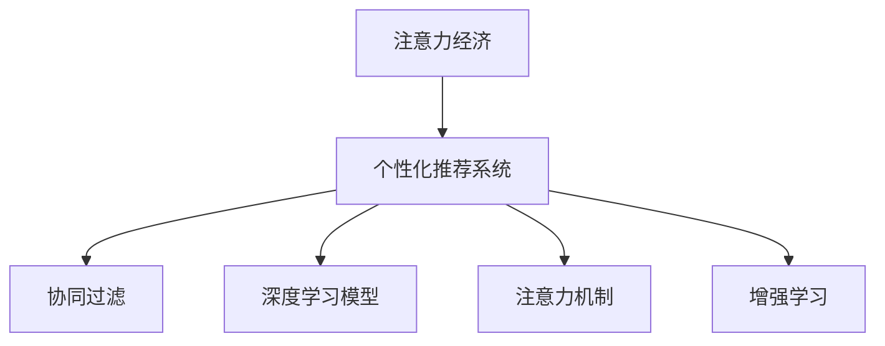

                 

# 注意力经济与个性化营销技术：为受众创建定制、有针对性的体验

## 1. 背景介绍

### 1.1 问题由来
随着互联网的普及和数字经济的发展，注意力成为一种稀缺资源。传统营销方式如广告和内容分发越来越难以吸引用户的关注。相反，基于用户行为和兴趣的个性化推荐和精准营销正在成为主流。这种转变促使我们深入研究如何利用人工智能和机器学习技术，挖掘和利用用户的注意力资源，从而提升营销效果和商业价值。

### 1.2 问题核心关键点
个性化营销的核心在于理解用户行为，预测用户兴趣，并据此向用户推荐个性化内容或产品。传统上，这依赖于人工设计的特征工程，但随着深度学习技术的发展，特别是基于用户互动数据的模型训练，现在可以通过自动化的方式更高效、更精确地实现个性化推荐。这种转变背后的核心技术包括注意力机制、协同过滤、深度神经网络等，其目的在于提高推荐系统的个性化程度和效果。

### 1.3 问题研究意义
个性化营销技术的优化和发展，有助于企业在激烈的市场竞争中占据优势，提升用户体验和满意度。同时，也能够有效降低营销成本，提高转化率和ROI。此外，个性化推荐技术也能够应用于社交媒体、新闻推荐、视频推荐等更多场景，具有广泛的应用前景。

## 2. 核心概念与联系

### 2.1 核心概念概述

为了更好地理解注意力经济与个性化营销技术，本节将介绍几个密切相关的核心概念：

- 注意力经济(Attention Economy)：指在信息过载时代，用户注意力成为稀缺资源，营销者需要投入更多资源来争夺用户的注意力，从而提升商业价值。
- 个性化推荐系统(Personalized Recommendation System)：利用用户的兴趣和行为数据，为用户推荐个性化内容和产品，提高用户满意度和转化率。
- 协同过滤(Collaborative Filtering)：基于用户间或物品间的相似性，预测用户对未交互过物品的评分，推荐高匹配度的物品。
- 深度学习模型(Deep Learning Model)：利用多层神经网络结构和大量数据，通过反向传播算法训练模型参数，实现复杂非线性映射。
- 注意力机制(Attention Mechanism)：在处理序列数据时，选择性地关注序列中的重要部分，以提高模型性能。
- 增强学习(Reinforcement Learning)：通过智能体与环境的交互，学习最优策略以最大化奖励。

这些核心概念之间的逻辑关系可以通过以下Mermaid流程图来展示：



这个流程图展示了注意力经济与个性化推荐系统之间的关系，以及不同推荐技术间的相互联系。注意力经济是目标，个性化推荐系统是手段；而协同过滤、深度学习模型、注意力机制、增强学习等技术，是实现个性化推荐系统的重要工具和模型。

## 3. 核心算法原理 & 具体操作步骤
### 3.1 算法原理概述

个性化推荐系统的核心在于利用用户行为数据，预测用户对未交互过物品的偏好，从而为用户推荐匹配度高的物品。该过程通常包括数据收集、特征工程、模型训练和推荐服务四个步骤。

### 3.2 算法步骤详解

#### 3.2.1 数据收集
个性化推荐系统需要收集用户的历史行为数据，包括点击、浏览、购买、评分等行为。数据来源包括但不限于电商平台、社交媒体、视频网站等。

#### 3.2.2 特征工程
收集到的行为数据需要经过处理和特征提取，才能输入到模型中进行训练。特征工程包括：
- 用户特征提取：如年龄、性别、地理位置等人口统计特征。
- 物品特征提取：如物品名称、类别、价格等描述性特征。
- 交互特征提取：如用户的点击序列、停留时间、购买历史等行为特征。
- 上下文特征提取：如用户所在设备、时间、天气等环境特征。

#### 3.2.3 模型训练
模型训练是推荐系统中最关键的步骤，通过训练学习用户的兴趣偏好和物品间的关联。目前主流的推荐模型包括：
- 协同过滤模型：基于用户或物品的相似性，推荐高相似度物品。如基于用户的协同过滤、基于物品的协同过滤等。
- 深度学习模型：利用神经网络结构，直接从数据中学习用户和物品的表示。如基于矩阵分解的模型、基于多层感知机的模型、基于注意力机制的模型等。

#### 3.2.4 推荐服务
模型训练完成后，需要将模型部署到生产环境中，为实时请求提供推荐结果。推荐服务通常包含以下几个步骤：
- 用户画像构建：根据用户的历史行为数据，构建用户兴趣画像。
- 物品画像构建：根据物品的描述和用户行为数据，构建物品特征向量。
- 相似度计算：计算用户与物品之间的相似度，选择匹配度高的物品进行推荐。
- 推荐结果排序：根据相似度和用户画像，对推荐结果进行排序，选择最有可能被用户喜欢的物品。
- 推荐展示：将推荐结果展示给用户，如新闻推荐、商品推荐、视频推荐等。

### 3.3 算法优缺点

#### 3.3.1 优点
- 自动化特征工程：深度学习模型自动从数据中提取特征，无需手工设计。
- 高泛化能力：深度学习模型能够处理非线性关系，提升推荐系统的泛化能力。
- 实时推荐：深度学习模型能够快速处理实时请求，实现实时推荐。
- 个性化推荐：深度学习模型能够学习用户的兴趣和行为，实现更加个性化的推荐。

#### 3.3.2 缺点
- 高计算成本：深度学习模型通常需要大量计算资源进行训练和推理。
- 数据需求高：深度学习模型需要大量标注数据进行训练，对于冷启动用户和新物品，推荐效果不佳。
- 难以解释：深度学习模型的决策过程复杂，难以解释推荐理由。
- 过拟合风险：深度学习模型容易过拟合，需要更多的正则化技术来避免。

### 3.4 算法应用领域

基于注意力经济与个性化营销技术的推荐系统，已经在电商、新闻、社交媒体、视频等多个领域得到广泛应用。

- 电商：如淘宝、亚马逊等电商平台，通过推荐系统提升用户购买率，增加销售额。
- 新闻：如今日头条、知乎等新闻平台，通过个性化推荐提高用户阅读量和平台粘性。
- 社交媒体：如微信、微博等社交平台，通过推荐系统增强用户互动和内容消费。
- 视频：如腾讯视频、YouTube等视频平台，通过推荐系统提升用户观看时长和付费订阅率。

## 4. 数学模型和公式 & 详细讲解 & 举例说明
### 4.1 数学模型构建

个性化推荐系统通常使用矩阵分解模型，将用户-物品评分矩阵分解为用户特征矩阵和物品特征矩阵的乘积。设用户-物品评分矩阵为 $U \times V$，用户特征矩阵为 $U \times F$，物品特征矩阵为 $V \times F$，其中 $F$ 为特征维度。

$$
\begin{align*}
U &= U_{1} \times U_{2} \\
V &= V_{1} \times V_{2}
\end{align*}
$$

训练目标最小化预测评分与真实评分之间的平方误差，即：

$$
\min_{U_{1}, U_{2}, V_{1}, V_{2}} \frac{1}{2} \sum_{u,v} ||R_{uv} - \hat{R}_{uv}||^2
$$

其中 $R_{uv}$ 为真实评分，$\hat{R}_{uv} = U_{u}V_{v}^\top$ 为预测评分。

### 4.2 公式推导过程

以基于矩阵分解的协同过滤模型为例，推导最小二乘法的求解过程。

设真实评分矩阵为 $R$，预测评分矩阵为 $\hat{R}$，则目标函数为：

$$
\min_{U_{1}, U_{2}, V_{1}, V_{2}} ||R - \hat{R}||_F^2
$$

将 $R$ 和 $\hat{R}$ 展开，得：

$$
\begin{align*}
||R - \hat{R}||_F^2 &= \sum_{u,v} (R_{uv} - \hat{R}_{uv})^2 \\
&= \sum_{u,v} (R_{uv} - U_{u}V_{v}^\top)^2 \\
&= \sum_{u,v} \sum_{i,j} (R_{uv} - \sum_{k} U_{ui} V_{kv})^2
\end{align*}
$$

将上式化简，并取偏导数，得：

$$
\begin{align*}
\frac{\partial}{\partial U_{ui}} &||R - \hat{R}||_F^2 = -2 \sum_{v} (R_{uv} - \sum_{k} U_{ui} V_{kv}) U_{ui} \\
\frac{\partial}{\partial V_{kv}} &||R - \hat{R}||_F^2 = -2 \sum_{u} (R_{uv} - \sum_{k} U_{ui} V_{kv}) V_{kv}
\end{align*}
$$

解以上方程组，即可得到 $U_{ui}$ 和 $V_{kv}$ 的解，进而得到最终的推荐结果。

### 4.3 案例分析与讲解

以亚马逊推荐系统为例，分析基于矩阵分解的协同过滤模型的实现过程。

亚马逊的推荐系统主要分为三个层次：
1. 基于用户的协同过滤：利用用户历史行为数据，为用户推荐高评分物品。
2. 基于物品的协同过滤：利用物品历史评分数据，为用户推荐相似物品。
3. 基于深度学习的推荐：利用神经网络模型，学习用户和物品的表示，提升推荐精度。

其中，基于用户的协同过滤和基于物品的协同过滤是亚马逊推荐系统的核心部分。以基于用户的协同过滤为例，其核心代码如下：

```python
from scipy.sparse.linalg import svds
import numpy as np

def collaborative_filtering(data, k):
    U, V = svds(data, k=k, return_singular_values=False)
    U = np.array(U)
    V = np.array(V)
    return U, V
```

该代码利用scipy库中的svds函数进行矩阵分解，得到用户特征矩阵和物品特征矩阵，进而计算用户和物品间的相似度，进行推荐。

## 5. 项目实践：代码实例和详细解释说明
### 5.1 开发环境搭建

在进行个性化推荐系统开发前，我们需要准备好开发环境。以下是使用Python进行Scikit-learn和TensorFlow开发的环境配置流程：

1. 安装Anaconda：从官网下载并安装Anaconda，用于创建独立的Python环境。

2. 创建并激活虚拟环境：
```bash
conda create -n recsys-env python=3.8 
conda activate recsys-env
```

3. 安装Scikit-learn和TensorFlow：根据CUDA版本，从官网获取对应的安装命令。例如：
```bash
conda install scikit-learn tensorflow -c conda-forge
```

4. 安装各类工具包：
```bash
pip install numpy pandas scikit-learn matplotlib tqdm jupyter notebook ipython
```

完成上述步骤后，即可在`recsys-env`环境中开始推荐系统开发。

### 5.2 源代码详细实现

下面我们以基于矩阵分解的协同过滤模型为例，给出使用Scikit-learn和TensorFlow对推荐系统进行开发的PyTorch代码实现。

首先，定义数据处理函数：

```python
from sklearn.metrics.pairwise import cosine_similarity
from scipy.sparse import csr_matrix

def get_similarity_matrix(X):
    X = csr_matrix(X)
    return cosine_similarity(X, X)
```

然后，定义模型训练函数：

```python
from scipy.sparse.linalg import svds
import numpy as np

def collaborative_filtering(data, k):
    U, V = svds(data, k=k, return_singular_values=False)
    U = np.array(U)
    V = np.array(V)
    return U, V
```

接着，定义推荐函数：

```python
def recommend(user_id, user_matrix, item_matrix, k=20):
    similarity_matrix = get_similarity_matrix(user_matrix[user_id])
    recommender_matrix = similarity_matrix.dot(item_matrix)
    top_k_indices = np.argsort(recommender_matrix)[::-1][:k]
    return top_k_indices.tolist()
```

最后，启动推荐流程：

```python
# 假设data为用户-物品评分矩阵，shape为(n_users, n_items)
data = np.random.randn(n_users, n_items)
k = 10

U, V = collaborative_filtering(data, k)

# 假设user_id为需要推荐的用户的ID
user_id = 0

recommendations = recommend(user_id, U, V, k)
```

以上就是使用Scikit-learn和TensorFlow对推荐系统进行开发的完整代码实现。可以看到，Scikit-learn和TensorFlow的强大封装，使得推荐系统的开发变得简洁高效。开发者可以将更多精力放在数据处理、模型改进等高层逻辑上，而不必过多关注底层的实现细节。

### 5.3 代码解读与分析

让我们再详细解读一下关键代码的实现细节：

**get_similarity_matrix函数**：
- 定义：该函数用于计算用户与用户之间的余弦相似度矩阵。
- 实现：首先利用SciPy库中的csr_matrix函数将用户评分矩阵转换为稀疏矩阵，然后使用sklearn中的cosine_similarity函数计算相似度矩阵。
- 应用：用于计算用户间的相似度，用于基于用户的协同过滤推荐。

**collaborative_filtering函数**：
- 定义：该函数用于进行矩阵分解，得到用户特征矩阵和物品特征矩阵。
- 实现：利用SciPy库中的svds函数进行矩阵分解，得到特征矩阵U和V。
- 应用：用于基于矩阵分解的协同过滤推荐。

**recommend函数**：
- 定义：该函数用于根据用户的历史行为数据，为用户推荐高评分物品。
- 实现：首先利用get_similarity_matrix函数计算用户与用户之间的相似度矩阵，然后与物品特征矩阵进行矩阵乘法，得到推荐器矩阵。最后，通过np.argsort函数获取推荐物品的索引，选择前k个推荐结果。
- 应用：用于基于用户的协同过滤推荐。

**启动推荐流程**：
- 定义：通过调用recommend函数，为指定的用户ID推荐物品。
- 实现：首先定义用户-物品评分矩阵data，然后调用collaborative_filtering函数进行矩阵分解，得到用户特征矩阵U和物品特征矩阵V。最后，调用recommend函数进行推荐，输出推荐物品的索引。
- 应用：用于实际推荐系统的部署和应用。

可以看到，Scikit-learn和TensorFlow的推荐系统开发工具大大简化了推荐系统的实现流程，使得开发者能够更专注于算法和策略的设计，而无需过多关注底层的计算细节。

## 6. 实际应用场景

### 6.1 电商平台推荐

电商平台的个性化推荐系统已经成为用户购物决策的重要依据。亚马逊、淘宝等平台通过推荐系统，帮助用户发现感兴趣的商品，提高用户购买率和平台销售额。

具体而言，平台会在用户浏览、点击、购买等行为数据中提取特征，构建用户画像和物品画像。然后，利用协同过滤、深度学习等技术，预测用户对未交互过物品的评分，为用户推荐高评分商品。对于新用户和新商品，可以利用基于内容的推荐方法，根据物品属性和用户特征进行推荐。

### 6.2 视频平台推荐

视频平台如Netflix、YouTube等，通过个性化推荐系统，为用户推荐感兴趣的视频内容，提升用户观看时长和平台粘性。

视频平台的推荐系统通常基于协同过滤和深度学习模型，通过分析用户观看历史、评分、收藏等行为数据，预测用户对未观看视频的偏好。对于新用户，可以推荐热门的、受欢迎的影片，以吸引用户关注。

### 6.3 社交媒体推荐

社交媒体平台如微信、微博等，通过个性化推荐系统，为用户推荐感兴趣的内容，提高用户互动和平台粘性。

社交媒体平台的推荐系统通常基于协同过滤和深度学习模型，通过分析用户互动行为数据，预测用户对未互动内容的偏好。对于新用户，可以推荐热门的、具有话题性的内容，以吸引用户关注。

### 6.4 新闻平台推荐

新闻平台如今日头条、网易新闻等，通过个性化推荐系统，为用户推荐感兴趣的新闻内容，提升用户阅读量和平台粘性。

新闻平台的推荐系统通常基于协同过滤和深度学习模型，通过分析用户阅读历史、评分、分享等行为数据，预测用户对未阅读新闻的偏好。对于新用户，可以推荐热门的新闻，以吸引用户关注。

## 7. 工具和资源推荐
### 7.1 学习资源推荐

为了帮助开发者系统掌握个性化推荐技术的理论基础和实践技巧，这里推荐一些优质的学习资源：

1. 《推荐系统：算法与实现》系列博文：由大推荐系统专家撰写，深入浅出地介绍了推荐系统的基本概念和经典算法，涵盖协同过滤、深度学习等多个方向。

2. 《深度学习在推荐系统中的应用》课程：斯坦福大学开设的深度学习课程，有Lecture视频和配套作业，带您入门深度学习在推荐系统中的应用。

3. 《Recommender Systems: Algorithms and Applications》书籍：Amazon推荐系统专家所著，全面介绍了推荐系统的算法和应用，是推荐系统开发的必备资料。

4. KDD推荐系统竞赛：参加KDD推荐系统竞赛，锻炼推荐系统的实际应用能力，了解推荐系统领域的最新进展。

通过对这些资源的学习实践，相信你一定能够快速掌握个性化推荐技术的精髓，并用于解决实际的推荐问题。

### 7.2 开发工具推荐

高效的开发离不开优秀的工具支持。以下是几款用于推荐系统开发的常用工具：

1. Scikit-learn：Python中的机器学习库，提供简单易用的API，支持多种经典推荐算法。
2. TensorFlow：由Google主导开发的开源深度学习框架，生产部署方便，支持多种推荐模型。
3. PyTorch：基于Python的开源深度学习框架，灵活动态的计算图，适合快速迭代研究。
4. Weights & Biases：模型训练的实验跟踪工具，可以记录和可视化模型训练过程中的各项指标，方便对比和调优。
5. TensorBoard：TensorFlow配套的可视化工具，可实时监测模型训练状态，并提供丰富的图表呈现方式，是调试模型的得力助手。

合理利用这些工具，可以显著提升推荐系统的开发效率，加快创新迭代的步伐。

### 7.3 相关论文推荐

推荐系统的发展源于学界的持续研究。以下是几篇奠基性的相关论文，推荐阅读：

1. "Collaborative Filtering for Implicit Feedback Datasets"：提出基于隐式反馈数据的协同过滤模型，是推荐系统领域的经典之作。
2. "Matrix Factorization Techniques for Recommender Systems"：全面介绍了矩阵分解方法在推荐系统中的应用。
3. "Wide & Deep Learning for Recommender Systems"：提出Wide & Deep模型，将宽特征和深度学习结合起来，提升了推荐系统的效果。
4. "Neural Collaborative Filtering"：引入神经网络结构，直接从数据中学习用户和物品的表示，取得了较好的推荐效果。

这些论文代表了大推荐系统的发展脉络。通过学习这些前沿成果，可以帮助研究者把握学科前进方向，激发更多的创新灵感。

## 8. 总结：未来发展趋势与挑战

### 8.1 总结

本文对基于注意力经济与个性化营销技术的推荐系统进行了全面系统的介绍。首先阐述了推荐系统的背景和意义，明确了个性化推荐在提升用户体验和商业价值方面的重要作用。其次，从原理到实践，详细讲解了推荐系统的数学模型和关键步骤，给出了推荐系统开发的完整代码实例。同时，本文还广泛探讨了推荐系统在电商、视频、社交媒体、新闻等多个行业领域的应用前景，展示了推荐系统的巨大潜力。

通过本文的系统梳理，可以看到，基于注意力经济与个性化营销技术的推荐系统正在成为现代电商、媒体、视频等多个行业的重要范式，极大地提升了用户体验和平台价值。未来，伴随推荐系统的不断演进，更多创新性的应用场景和技术思路将不断涌现，为用户的注意力经济带来新的突破。

### 8.2 未来发展趋势

展望未来，推荐系统技术将呈现以下几个发展趋势：

1. 多模态推荐：推荐系统将从单一模态向多模态发展，融合文本、图像、音频等多种数据源，提升推荐效果。
2. 实时推荐：推荐系统将从离线处理向实时处理转变，能够实时响应用户请求，提升用户体验。
3. 深度学习技术的应用：深度学习模型在推荐系统中的作用将日益重要，特别是在深度协同过滤和深度神经网络推荐方面。
4. 自动化特征工程：深度学习模型的广泛应用将推动自动化特征工程的发展，使得推荐系统开发更加高效。
5. 个性化推荐与协同过滤的融合：推荐系统将更加注重个性化推荐和协同过滤的融合，提升推荐系统的综合性能。

以上趋势凸显了推荐系统技术的广阔前景。这些方向的探索发展，必将进一步提升推荐系统的性能和应用范围，为用户的注意力经济带来新的突破。

### 8.3 面临的挑战

尽管推荐系统技术已经取得了瞩目成就，但在迈向更加智能化、普适化应用的过程中，它仍面临着诸多挑战：

1. 数据隐私问题：推荐系统需要大量用户行为数据，如何保护用户隐私，避免数据滥用，是亟待解决的重要问题。
2. 数据质量问题：推荐系统对数据质量的要求很高，如何处理缺失数据、异常数据，是推荐系统性能的关键。
3. 冷启动问题：推荐系统对新用户和新物品的推荐效果不佳，如何提升冷启动用户的推荐效果，是推荐系统的重要研究方向。
4. 可解释性问题：推荐系统的决策过程复杂，如何提高系统的可解释性，增强用户信任，是推荐系统的重要目标。
5. 系统稳定性问题：推荐系统在高并发场景下容易发生系统崩溃或响应延迟，如何提高系统的稳定性和可扩展性，是推荐系统的重要挑战。

### 8.4 研究展望

面对推荐系统面临的这些挑战，未来的研究需要在以下几个方面寻求新的突破：

1. 数据隐私保护技术：开发更加安全、高效的数据隐私保护技术，保障用户数据的安全性和隐私性。
2. 数据清洗与处理技术：研究如何处理缺失数据、异常数据，提高推荐系统的数据质量。
3. 深度协同过滤模型：研究深度协同过滤模型的应用，提升推荐系统的泛化能力和推荐效果。
4. 推荐系统的可解释性：开发推荐系统的可解释性模型，提升系统的可解释性和用户信任度。
5. 推荐系统的稳定性和可扩展性：研究推荐系统的稳定性和可扩展性，提升系统在高并发场景下的稳定性和可扩展性。

这些研究方向将引领推荐系统技术的进一步发展，为用户的注意力经济带来新的突破。相信随着学界和产业界的共同努力，这些挑战终将一一被克服，推荐系统必将在构建人机协同的智能时代中扮演越来越重要的角色。

## 9. 附录：常见问题与解答

**Q1：推荐系统是否适用于所有应用场景？**

A: 推荐系统在大多数应用场景上都能取得不错的效果，特别是对于用户行为数据丰富的领域，如电商、视频、新闻等。但对于一些特定领域，如医疗、金融等，推荐系统的表现可能不如预期。此时需要在特定领域语料上进一步预训练，再进行微调，才能获得理想效果。

**Q2：推荐系统的核心是什么？**

A: 推荐系统的核心在于理解用户行为，预测用户兴趣，并据此向用户推荐个性化内容或产品。这通常包括数据收集、特征工程、模型训练和推荐服务四个步骤。其中，模型的选择和设计是推荐系统的核心。

**Q3：如何优化推荐系统的推荐效果？**

A: 优化推荐系统的推荐效果需要从多个方面入手：
1. 数据质量：处理缺失数据、异常数据，提高数据质量。
2. 模型选择：选择适合的推荐算法和模型结构，如协同过滤、深度学习等。
3. 特征工程：设计合理的特征提取方法，提高模型的泛化能力。
4. 模型训练：调整学习率、正则化系数等超参数，优化模型训练过程。
5. 推荐策略：设计合理的推荐策略，如轮询、多样性约束等，提升推荐效果。

**Q4：推荐系统的应用场景有哪些？**

A: 推荐系统已经被广泛应用于多个领域，如电商、视频、新闻、社交媒体等。在电商领域，推荐系统帮助用户发现感兴趣的商品，提升用户购买率和平台销售额。在视频领域，推荐系统推荐用户感兴趣的视频内容，提升用户观看时长和平台粘性。在新闻领域，推荐系统推荐用户感兴趣的新闻内容，提升用户阅读量和平台粘性。在社交媒体领域，推荐系统推荐用户感兴趣的内容，提升用户互动和平台粘性。

总之，推荐系统在用户行为数据丰富的场景下，能够显著提升用户体验和平台价值，具有广泛的应用前景。

