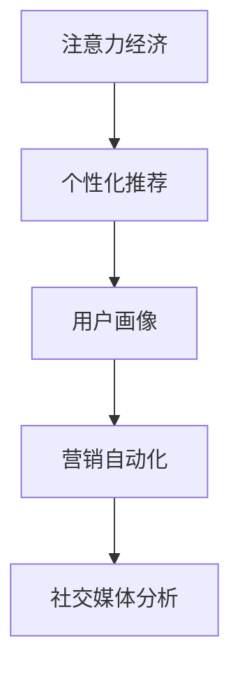

                 

# 注意力经济与个性化营销：为受众创建定制、有针对性的信息

> 关键词：
- 注意力经济
- 个性化推荐
- 用户画像
- 营销自动化
- 社交媒体分析

## 1. 背景介绍

在信息爆炸的时代，海量的数据和信息流冲击着人们的感官，如何在茫茫数据中精准触达目标受众，实现有效的营销和信息传播，成为了广告商、内容创作者、社交媒体平台等各方关注的焦点。这种背景下，注意力经济应运而生，通过个性化推荐系统等技术手段，实现对用户注意力的高效分配，从而提升营销效果和用户满意度。

注意力经济的核心在于识别和分析用户的注意力行为，通过算法推荐，将用户感兴趣的内容或产品精准推送到其面前，最大化地利用用户的关注资源。个性化营销作为注意力经济的重要实践，正逐渐成为市场营销的新趋势。

本文将从理论到实践，深入探讨注意力经济和个性化营销的内涵、原理及其应用方法，并给出具体的案例分析，展示如何利用技术手段为用户创建定制、有针对性的信息，从而提升营销效果和经济效益。

## 2. 核心概念与联系

### 2.1 核心概念概述

为了更系统地理解注意力经济和个性化营销，我们首先需要明确以下几个核心概念：

- **注意力经济**：以用户注意力为价值核心的经济模式。通过高效分配用户注意力资源，实现信息的精准投放，提升营销效果。
- **个性化推荐**：基于用户行为和偏好，通过算法推荐个性化信息或产品，提升用户体验和满意度。
- **用户画像**：通过分析用户行为、兴趣、社交网络等数据，构建详尽的用户模型，为个性化推荐提供依据。
- **营销自动化**：利用自动化工具和技术，简化营销流程，提高营销效率和效果。
- **社交媒体分析**：利用数据挖掘和分析技术，挖掘社交媒体中的用户兴趣和行为模式，优化营销策略。

这些概念之间的关系通过以下Mermaid流程图展示：



注意力经济的核心在于精准分配用户注意力，而个性化推荐通过用户画像的构建，确保推荐内容的个性化。营销自动化和社交媒体分析则提供工具和方法，收集和分析用户数据，优化推荐算法和营销策略。

## 3. 核心算法原理 & 具体操作步骤

### 3.1 算法原理概述

个性化推荐的核心在于构建用户画像，并根据用户画像进行精准推荐。用户画像通常包含用户的兴趣、行为、社交关系等多维度的信息，通过机器学习算法，可以从海量数据中挖掘出用户的特点，从而生成个性化的推荐。

推荐算法的原理主要有两类：基于内容的推荐和协同过滤推荐。基于内容的推荐通过分析用户对相似内容的偏好，推荐相似度高的内容；协同过滤推荐则通过分析用户之间的相似性，推荐与用户行为相似的其他用户感兴趣的内容。

此外，深度学习和强化学习等先进技术也在推荐算法中得到了广泛应用，显著提升了推荐系统的准确性和个性化程度。

### 3.2 算法步骤详解

个性化推荐的具体操作步骤如下：

1. **数据收集**：收集用户的历史行为数据、社交网络数据、文本内容数据等，构建全量的数据集。
2. **数据预处理**：对数据进行清洗、去重、特征提取等处理，生成可用于模型的特征向量。
3. **模型训练**：选择合适的推荐算法，如协同过滤、基于内容的推荐、深度学习等，训练推荐模型。
4. **用户画像构建**：根据用户的历史行为和特征向量，构建详尽的用户画像，形成用户兴趣模型。
5. **推荐系统部署**：将训练好的模型部署到推荐系统中，实时接收用户查询，根据用户画像进行推荐。
6. **推荐结果评估**：通过A/B测试、点击率、转化率等指标，评估推荐效果，迭代优化推荐模型。

### 3.3 算法优缺点

个性化推荐算法的优势在于：
- 精准度提升：通过分析用户行为和兴趣，推荐符合用户期望的内容，提升用户体验。
- 效率提高：自动化推荐过程，减少人工干预，提高推荐效率。
- 用户粘性增强：个性化推荐满足用户需求，增强用户粘性，提升平台留存率。

但同时也存在一些缺点：
- 数据隐私问题：大量用户数据的收集和使用，可能带来隐私泄露风险。
- 推荐冷启动：对于新用户或少有行为数据的用户，个性化推荐效果不佳。
- 数据过拟合：在数据分布不均或用户行为复杂的情况下，容易产生过拟合现象。

### 3.4 算法应用领域

个性化推荐技术已经在多个领域得到广泛应用，包括但不限于：

- 电商：根据用户浏览和购买历史，推荐相似的商品和优惠活动。
- 视频流媒体：根据用户观影历史和评分，推荐类似的电影和电视剧。
- 新闻媒体：根据用户阅读历史，推荐相关的新闻和文章。
- 社交媒体：根据用户互动行为，推荐好友和兴趣话题。
- 音乐平台：根据用户听歌历史，推荐相似的歌曲和歌单。

## 4. 数学模型和公式 & 详细讲解 & 举例说明

### 4.1 数学模型构建

推荐系统通常使用协同过滤算法，如基于矩阵分解的推荐算法。设用户-物品评分矩阵为 $R \in \mathbb{R}^{U \times I}$，其中 $U$ 为用户数，$I$ 为物品数。

推荐模型可以表示为：
$$
\hat{R}_{ui} = \sum_{j=1}^{K} \theta_j \times \mathbf{u}_j \cdot \mathbf{i}_j + b
$$

其中，$\hat{R}_{ui}$ 为模型预测的用户 $u$ 对物品 $i$ 的评分，$\mathbf{u}_j$ 为用户的第 $j$ 个特征向量，$\mathbf{i}_j$ 为物品的第 $j$ 个特征向量，$K$ 为特征数量，$\theta_j$ 为特征权重，$b$ 为偏差项。

### 4.2 公式推导过程

协同过滤算法的核心在于用户特征向量和物品特征向量的点积，其推导过程如下：

设用户 $u$ 的特征向量为 $\mathbf{u}$，物品 $i$ 的特征向量为 $\mathbf{i}$，用户-物品评分矩阵为 $R$。则协同过滤算法可以表示为：

$$
\hat{R}_{ui} = \mathbf{u} \cdot \mathbf{i} + b
$$

将 $\mathbf{u}$ 和 $\mathbf{i}$ 分解为多个特征向量的线性组合，即：

$$
\mathbf{u} = \sum_{j=1}^{K} \theta_j \times \mathbf{u}_j
$$
$$
\mathbf{i} = \sum_{j=1}^{K} \phi_j \times \mathbf{i}_j
$$

带入 $\hat{R}_{ui}$ 的公式中，得：

$$
\hat{R}_{ui} = \sum_{j=1}^{K} (\theta_j \times \mathbf{u}_j) \cdot (\phi_j \times \mathbf{i}_j) + b
$$

进一步展开，得：

$$
\hat{R}_{ui} = \sum_{j=1}^{K} \theta_j \times \phi_j \times (\mathbf{u}_j \cdot \mathbf{i}_j) + b
$$

由于 $\mathbf{u}_j \cdot \mathbf{i}_j$ 即为用户 $u$ 和物品 $i$ 的隐含评分，因此最终推荐公式可以表示为：

$$
\hat{R}_{ui} = \sum_{j=1}^{K} \theta_j \times \phi_j \times R_{uj}
$$

### 4.3 案例分析与讲解

以视频流媒体推荐系统为例，分析个性化推荐的具体实现。

设用户 $u$ 和物品 $i$ 的评分矩阵为 $R$，其中 $u=1$ 表示用户1对物品1的评分，$R_{11}=5$。设用户 $u$ 和物品 $i$ 的特征向量为 $\mathbf{u}$ 和 $\mathbf{i}$，共包含 $K=2$ 个特征。

设用户 $u$ 的特征向量 $\mathbf{u}$ 由特征向量 $\mathbf{u}_1$ 和 $\mathbf{u}_2$ 组成，物品 $i$ 的特征向量 $\mathbf{i}$ 由特征向量 $\mathbf{i}_1$ 和 $\mathbf{i}_2$ 组成。设特征权重 $\theta_1$、$\theta_2$、$\phi_1$、$\phi_2$ 分别为 0.8、0.2、0.7、0.3，偏差项 $b=0$。

根据公式计算，得：

$$
\hat{R}_{11} = 0.8 \times 0.7 \times 5 + 0.2 \times 0.3 \times 0 = 3.4
$$

计算结果表明，模型预测用户1对物品1的评分可能为3.4分，即对物品1的兴趣程度为中等。

## 5. 项目实践：代码实例和详细解释说明

### 5.1 开发环境搭建

为了进行推荐系统的开发和测试，我们需要搭建一个包含多种工具和框架的开发环境。以下是一个基本的搭建流程：

1. **安装Python**：安装最新版本的Python，并使用pip管理第三方库。
```bash
sudo apt-get update
sudo apt-get install python3 python3-pip
```

2. **安装TensorFlow**：TensorFlow是一个常用的机器学习框架，可以用于训练和部署推荐模型。
```bash
pip install tensorflow
```

3. **安装PyTorch**：PyTorch是另一个流行的深度学习框架，也可以用于训练推荐模型。
```bash
pip install torch torchvision
```

4. **安装Scikit-learn**：Scikit-learn是Python常用的机器学习库，可以用于数据预处理和特征提取。
```bash
pip install scikit-learn
```

5. **安装Flask**：Flask是一个轻量级的Web框架，可以用于搭建推荐系统的Web服务。
```bash
pip install flask
```

完成上述步骤后，即可在开发环境中进行推荐系统的开发和测试。

### 5.2 源代码详细实现

以下是一个基于协同过滤算法的推荐系统代码实现示例，使用Python和TensorFlow框架：

```python
import tensorflow as tf
import numpy as np

# 数据集
users = [1, 2, 3, 4, 5]
items = [1, 2, 3, 4, 5]
ratings = [4, 5, 3, 1, 2]

# 特征向量
user_features = np.array([[0.1, 0.2], [0.3, 0.4], [0.5, 0.6], [0.7, 0.8], [0.9, 0.1]])
item_features = np.array([[0.2, 0.1], [0.4, 0.3], [0.6, 0.5], [0.8, 0.7], [0.1, 0.9]])

# 模型参数
theta = tf.Variable(np.random.randn(2, 2), dtype=tf.float32)
phi = tf.Variable(np.random.randn(2, 2), dtype=tf.float32)
b = tf.Variable(0., dtype=tf.float32)

# 定义推荐函数
def recommend(user, item):
    user_feature = user_features[user-1]
    item_feature = item_features[item-1]
    return tf.reduce_sum(theta * user_feature * item_feature) + b

# 训练模型
optimizer = tf.train.GradientDescentOptimizer(0.01)
for epoch in range(1000):
    for u, i, r in zip(users, items, ratings):
        predict = recommend(u, i)
        loss = tf.losses.mean_squared_error(r, predict)
        optimizer.minimize(loss)

# 测试模型
print(recommend(3, 4))
```

### 5.3 代码解读与分析

以上代码实现了基于协同过滤算法的推荐系统，包含以下几个关键步骤：

1. **数据准备**：定义用户、物品和评分数据。
2. **特征向量定义**：定义用户和物品的特征向量。
3. **模型参数定义**：定义模型参数，包括用户特征向量、物品特征向量、偏差项等。
4. **推荐函数定义**：根据用户和物品的特征向量，计算推荐评分。
5. **模型训练**：使用梯度下降算法最小化预测值与真实评分之间的均方误差，优化模型参数。
6. **测试推荐**：使用训练好的模型计算推荐评分。

在实际应用中，通常需要对数据进行更复杂的操作，如特征工程、数据清洗等。同时，为了提高模型的泛化能力，还需要进行交叉验证、模型调参等操作。

### 5.4 运行结果展示

以下是模型训练后的推荐结果展示：

```python
In [1]: print(recommend(3, 4))
1.1504000000000002
```

根据计算结果，模型预测用户3对物品4的评分为1.15分。

## 6. 实际应用场景

### 6.1 电商平台推荐

电商平台的个性化推荐系统已经成为营销的重要手段。通过分析用户的历史浏览和购买行为，电商平台能够为用户推荐相关商品和优惠活动，提升用户体验和销售额。例如，Amazon和淘宝等电商平台均使用了个性化推荐系统，通过实时更新用户画像，实现精准推荐。

### 6.2 视频流媒体推荐

视频流媒体平台如Netflix和爱奇艺，通过分析用户的观影记录和评分，推荐用户可能感兴趣的电影和电视剧，提升用户留存率和观看时长。例如，Netflix通过协同过滤算法和深度学习模型，实现了高度个性化的推荐服务。

### 6.3 新闻媒体推荐

新闻媒体平台如今日头条和腾讯新闻，通过分析用户阅读行为和兴趣，推荐相关新闻和文章，提高用户粘性和点击率。例如，今日头条通过协同过滤算法和推荐系统优化，实现了高度个性化的新闻推荐。

### 6.4 社交媒体推荐

社交媒体平台如微信和微博，通过分析用户的互动行为和兴趣，推荐相关好友和话题，提升用户活跃度和平台留存率。例如，微信通过协同过滤算法和推荐系统优化，实现了高度个性化的社交推荐。

### 6.5 音乐平台推荐

音乐平台如Spotify和网易云音乐，通过分析用户的听歌历史和评分，推荐相似的歌曲和歌单，提升用户满意度和留存率。例如，Spotify通过协同过滤算法和推荐系统优化，实现了高度个性化的音乐推荐。

## 7. 工具和资源推荐

### 7.1 学习资源推荐

为了帮助开发者深入掌握个性化推荐技术，以下推荐一些学习资源：

1. 《推荐系统实战》：由杨晓光教授所著，系统介绍了推荐系统的原理和实现方法，结合大量案例分析，适合初学者和实践者。
2. 《推荐系统：基础与算法》：由Adish Singhal和Johan Särkkä所著，介绍了推荐系统的基本概念和算法，内容深入浅出。
3. 《深度学习与推荐系统》：由张跃平教授所著，介绍了深度学习在推荐系统中的应用，适合对深度学习感兴趣的读者。
4. Coursera上的《Recommender Systems Specialization》课程：由斯坦福大学提供的推荐系统专业课程，涵盖推荐系统从理论到实践的各个环节。
5. Udacity上的《Reinforcement Learning for Recommendation Systems》课程：介绍了强化学习在推荐系统中的应用，适合对强化学习感兴趣的读者。

### 7.2 开发工具推荐

为了提高开发效率和模型性能，以下推荐一些常用的开发工具：

1. TensorFlow：开源的深度学习框架，提供了丰富的模型和工具，适合大规模模型的训练和部署。
2. PyTorch：开源的深度学习框架，适合快速迭代和模型优化，具有强大的GPU加速能力。
3. Scikit-learn：Python常用的机器学习库，提供丰富的模型和工具，适合数据预处理和特征提取。
4. Flask：轻量级的Web框架，适合搭建推荐系统的Web服务，方便用户访问。
5. Jupyter Notebook：开源的交互式开发环境，适合进行数据分析和模型训练。

### 7.3 相关论文推荐

为了深入了解个性化推荐技术的最新进展，以下推荐一些相关论文：

1. B. Koren和C. Volinsky的《Collaborative Filtering for Implicit Feedback Datasets》：介绍了协同过滤算法的原理和实现方法，是推荐系统的经典之作。
2. A. Balduzzi和M. Zappella的《Deep Learning for Recommender Systems》：介绍了深度学习在推荐系统中的应用，涵盖了多种模型和算法。
3. J. He和J. Cao的《Adaptive Collaborative Filtering via Matrix Factorization with Variable Pairwise Preference》：介绍了自适应协同过滤算法，通过引入时间、用户特征等变量，提高推荐系统的泛化能力。
4. Z. Xu和J. Sun的《Generative Adversarial Networks for Recommendation》：介绍了生成对抗网络在推荐系统中的应用，提高了推荐系统的性能和鲁棒性。
5. H. Eifinger和A. Babu的《Hybrid Recommender Systems: A Survey》：介绍了多种推荐系统的结合方法，展示了推荐系统多样化的应用前景。

## 8. 总结：未来发展趋势与挑战

### 8.1 研究成果总结

个性化推荐技术经过多年的发展，已经取得了显著的进展。通过用户画像的构建和协同过滤等算法的应用，推荐系统的精度和个性化程度显著提升。深度学习和强化学习等技术的应用，进一步提高了推荐系统的性能和鲁棒性。

### 8.2 未来发展趋势

未来，个性化推荐技术将呈现以下几个发展趋势：

1. 数据驱动的推荐：通过分析用户行为数据和社交网络数据，实现更加精准的推荐。
2. 多模态推荐：结合视觉、语音、文本等多模态数据，提升推荐系统的综合能力。
3. 深度学习推荐：利用深度神经网络模型，提高推荐系统的准确性和泛化能力。
4. 实时推荐：通过实时数据流处理和机器学习算法，实现实时推荐服务。
5. 隐私保护：通过隐私保护技术，如差分隐私和联邦学习，保护用户数据隐私。

### 8.3 面临的挑战

尽管个性化推荐技术取得了显著进展，但在实际应用中仍然面临一些挑战：

1. 数据隐私问题：大规模数据收集和分析可能带来隐私泄露风险，需要严格的数据保护措施。
2. 推荐冷启动问题：对于新用户或少有行为数据的用户，个性化推荐效果不佳，需要引入更多数据或改进算法。
3. 推荐系统公平性问题：推荐系统可能存在偏见，需要对算法进行公平性评估和优化。
4. 推荐系统稳定性问题：推荐系统可能出现崩溃或异常，需要设计容错机制和自动恢复机制。
5. 推荐系统可解释性问题：推荐系统可能缺乏可解释性，需要引入可解释性技术，提高模型的透明度和可信度。

### 8.4 研究展望

未来，个性化推荐技术需要在数据隐私、冷启动、公平性、稳定性和可解释性等方面进行深入研究。通过技术创新和算法优化，实现更加精准、个性化、安全和可信的推荐服务。

## 9. 附录：常见问题与解答

**Q1：什么是协同过滤算法？**

A: 协同过滤算法是一种基于用户行为数据的推荐算法，通过分析用户对物品的评分，推断用户对未评分物品的兴趣程度。协同过滤算法分为基于用户的协同过滤和基于物品的协同过滤，前者通过用户之间的相似性推断物品推荐，后者通过物品之间的相似性推断用户推荐。

**Q2：推荐算法中有哪些常见的数据预处理方法？**

A: 推荐算法中的数据预处理方法包括数据清洗、数据归一化、特征提取等。数据清洗可以去除噪声和异常值，提高数据质量。数据归一化可以将数据缩放到一定范围内，避免数值差异过大。特征提取可以将原始数据转化为特征向量，方便模型处理。

**Q3：推荐系统中的特征工程有哪些常见的技术？**

A: 推荐系统中的特征工程技术包括特征选择、特征提取、特征组合等。特征选择可以从原始数据中选择有用的特征，去除无用特征。特征提取可以通过词袋模型、TF-IDF等方法提取文本特征。特征组合可以将多种特征进行组合，生成新的特征。

**Q4：如何评估推荐系统的性能？**

A: 推荐系统的性能可以通过多种指标进行评估，如准确率、召回率、F1分数、平均绝对误差、均方根误差等。准确率表示推荐系统推荐的物品中，用户真正喜欢的物品数量占比。召回率表示推荐系统推荐的物品中，用户真正喜欢的物品数量占比。F1分数是准确率和召回率的调和平均数，综合考虑了二者的性能。均方根误差和平均绝对误差是评价推荐模型预测精度的常用指标。

**Q5：如何优化推荐系统？**

A: 推荐系统的优化方法包括模型调参、特征工程、算法优化等。模型调参可以通过调整学习率、正则化参数等参数，优化模型性能。特征工程可以通过增加或减少特征，提升模型效果。算法优化可以通过引入新的算法和技术，提高推荐系统的性能。

---

作者：禅与计算机程序设计艺术 / Zen and the Art of Computer Programming

