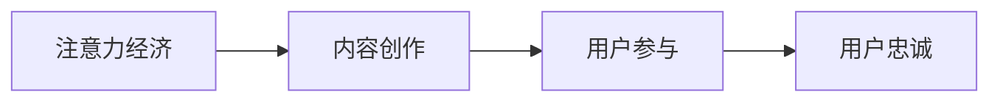

                 

# 注意力经济与内容创作策略：吸引并留住受众的参与和忠诚

## 1. 背景介绍

在信息爆炸的时代，注意力成为最宝贵的资源之一。内容创作者面临着如何吸引用户注意、留住用户参与，进而实现忠诚转化的挑战。在这一背景下，“注意力经济”应运而生，成为内容创作和用户运营的核心策略。

“注意力经济”是指在信息过载的时代，通过创造高质量、有价值的内容，吸引并留住用户注意力的经济模式。内容创作者需要理解用户注意力转移的规律，掌握有效的内容创作策略，才能在激烈的竞争中脱颖而出。

## 2. 核心概念与联系

### 2.1 核心概念概述

以下是几个关键概念的概述：

- **注意力经济（Attention Economy）**：通过创造有价值的内容，吸引并留住用户注意力，从而实现商业价值的模式。
- **内容创作（Content Creation）**：设计、制作、发布有信息量、有吸引力、有影响力的内容。
- **用户参与（User Engagement）**：用户与内容之间的互动行为，如点赞、评论、分享等。
- **用户忠诚（User Loyalty）**：用户对内容创作者或品牌的长期支持、信任和重复购买。

这些概念紧密联系，共同构成了注意力经济的核心框架。以下是一个简单的Mermaid流程图，展示这些概念之间的关系：



### 2.2 核心概念原理和架构

注意力经济的核心在于通过高质量内容吸引用户注意力，进而通过用户参与和忠诚转化实现商业价值的变现。

- **内容创作（B）**：内容创作者需设计符合用户兴趣、情感共鸣、信息价值高的内容。内容可以是文章、视频、图片、音频等多种形式。
- **用户参与（C）**：用户通过互动行为展示对内容的兴趣，如点赞、评论、分享等。这些互动行为反馈给创作者，促进内容优化和再创作。
- **用户忠诚（D）**：高质量内容持续吸引用户注意，提升品牌信任度，促进重复购买和长期支持。

通过这一流程，注意力经济形成了一个闭环，不断循环优化，提升内容价值和用户满意度。

## 3. 核心算法原理 & 具体操作步骤

### 3.1 算法原理概述

注意力经济的算法原理主要围绕用户行为数据的分析和建模，通过数据挖掘、机器学习等技术，优化内容创作和用户运营策略。以下是一个简单的算法框架：

1. **数据收集与预处理**：收集用户互动数据，包括点赞、评论、分享、观看时长等。对数据进行清洗和归一化，去除噪音和异常值。
2. **用户画像建模**：使用聚类、关联规则等方法，构建用户画像，了解用户兴趣、行为偏好。
3. **内容推荐与优化**：利用协同过滤、基于内容的推荐等技术，为用户推荐个性化内容。同时根据用户反馈，优化内容创作策略，提升内容质量。
4. **用户忠诚度管理**：通过行为分析，识别高价值用户，提供专属内容和服务。通过会员体系、积分系统等手段，增强用户忠诚度。

### 3.2 算法步骤详解

以下是详细的算法步骤：

**Step 1: 数据收集与预处理**

- 使用API接口、爬虫等方式收集用户互动数据，如YouTube的观看时长、B站的视频点赞和评论等。
- 清洗数据，去除无效数据，归一化数据格式。例如，将时间戳统一到标准格式，将文本数据进行分词处理。

**Step 2: 用户画像建模**

- 使用K-means聚类算法，对用户进行分群，形成不同兴趣标签的用户画像。
- 通过关联规则挖掘算法，识别不同用户群体的行为关联，如对某类内容偏好相似的用户。

**Step 3: 内容推荐与优化**

- 使用协同过滤算法，为用户推荐与历史行为相似的内容。例如，根据用户过去喜欢观看的内容，推荐其他相关视频。
- 根据用户反馈，对内容创作进行优化。例如，用户喜欢某些类型的开头或结尾，则优化创作模板。

**Step 4: 用户忠诚度管理**

- 使用RFM模型（最近消费时间、消费频率、消费金额），识别高价值用户。
- 提供专属内容、优惠活动等，增强用户粘性。例如，提供VIP专属视频、会员积分兑换等。

### 3.3 算法优缺点

注意力经济算法具有以下优点：

- **高效性**：通过数据驱动的决策，快速调整内容策略，提升用户满意度。
- **个性化**：能够根据用户兴趣，提供个性化推荐，提升用户粘性。
- **可量化**：通过数据分析，量化用户行为和内容价值，提供科学决策依据。

同时，也存在以下缺点：

- **数据隐私**：用户互动数据涉及隐私保护，需遵循相关法律法规，确保数据安全。
- **模型复杂性**：算法模型需要复杂的数据处理和计算，对技术要求较高。
- **过度依赖算法**：过于依赖算法，可能忽视内容创作的人性化因素。

### 3.4 算法应用领域

注意力经济算法在多个领域都有广泛应用，包括：

- **视频平台**：如YouTube、B站、抖音等，通过个性化推荐提升用户观看时长。
- **电商网站**：如淘宝、京东、亚马逊等，通过商品推荐提升转化率和复购率。
- **社交媒体**：如微信、微博、知乎等，通过内容分享和互动提升用户活跃度。
- **内容社区**：如知乎、Medium、B2B平台等，通过内容推荐和互动，提升用户粘性。

## 4. 数学模型和公式 & 详细讲解

### 4.1 数学模型构建

注意力经济的数学模型主要围绕用户行为数据的建模和分析。以下是一个简单的数学模型：

- **用户画像模型**：
$$
\text{User Profile} = \sum_{i=1}^{n} f_i \times X_i
$$
其中，$X_i$ 为第 $i$ 个特征向量，$f_i$ 为特征权重。

- **协同过滤模型**：
$$
\hat{y_i} = \sum_{j=1}^{n} \alpha_j \times y_j \times r_{ij}
$$
其中，$\alpha_j$ 为特征权重，$r_{ij}$ 为用户 $i$ 和用户 $j$ 的相似度。

- **RFM模型**：
$$
\text{RFM Score} = \frac{R \times F \times M}{\max(R, F, M)}
$$
其中，$R$ 为用户最近消费时间，$F$ 为用户消费频率，$M$ 为用户消费金额。

### 4.2 公式推导过程

**用户画像建模**：

1. 使用K-means算法，对用户进行聚类，形成不同兴趣标签。
2. 计算每个用户聚类的中心点，表示该用户的兴趣偏好。
3. 将用户兴趣标签与内容特征进行向量映射，形成用户画像向量。

**协同过滤模型**：

1. 计算用户之间的相似度，通常使用余弦相似度或皮尔逊相关系数。
2. 根据相似度计算，为用户推荐与历史行为相似的内容。

**RFM模型**：

1. 计算用户的最近消费时间、消费频率和消费金额。
2. 对三个值进行标准化处理，分别计算权重。
3. 对三个值进行加权求和，得到用户的RFM得分。

### 4.3 案例分析与讲解

**YouTube推荐系统**：

- **数据收集**：收集用户观看视频的行为数据，包括观看时长、点赞、评论等。
- **用户画像**：使用K-means算法，将用户分成不同的兴趣群体。
- **协同过滤**：为用户推荐与历史行为相似的视频。例如，用户喜欢观看健身视频，则推荐其他健身视频。
- **RFM得分**：对用户观看行为进行评分，识别高价值用户，提供专属推荐和优惠活动。

**电商平台推荐系统**：

- **数据收集**：收集用户购买行为数据，包括浏览、点击、购买、退换货等。
- **用户画像**：使用协同过滤算法，对用户进行个性化推荐。例如，用户购买某品牌商品，推荐同一品牌的其他商品。
- **RFM得分**：对用户购买行为进行评分，识别高价值用户，提供专属优惠活动。

## 5. 项目实践：代码实例和详细解释说明

### 5.1 开发环境搭建

以下是在Python中使用Pandas和Scikit-learn搭建数据处理和模型训练环境的步骤：

1. **安装Pandas和Scikit-learn**：
```
pip install pandas scikit-learn
```

2. **准备数据集**：
```python
import pandas as pd

# 读取用户行为数据
data = pd.read_csv('user_behavior.csv')

# 数据预处理
data['date'] = pd.to_datetime(data['date'])
data['hour'] = data['date'].dt.hour
data['month'] = data['date'].dt.month
data['day'] = data['date'].dt.day
```

### 5.2 源代码详细实现

以下是一个简单的Python代码，实现用户画像建模和协同过滤推荐：

```python
from sklearn.cluster import KMeans
from sklearn.metrics.pairwise import cosine_similarity
import numpy as np

# 用户行为数据
data = pd.read_csv('user_behavior.csv')

# 特征工程
data['date'] = pd.to_datetime(data['date'])
data['hour'] = data['date'].dt.hour
data['month'] = data['date'].dt.month
data['day'] = data['date'].dt.day
data['user_id'] = data['user_id'].astype(str)
data = data.dropna()

# 用户画像建模
kmeans = KMeans(n_clusters=10, random_state=42)
user_labels = kmeans.fit_predict(data[['hour', 'month', 'day']])
data['user_profile'] = user_labels

# 协同过滤推荐
def similar_items(user_id, item_id, similarity='cosine'):
    item_labels = data[data['user_id'] == user_id]['user_profile']
    item_items = data[data['user_id'] == user_id]['item_id']
    similarity_score = cosine_similarity(item_items.to_numpy().reshape(1, -1), item_items.to_numpy().reshape(-1, 1))
    if similarity == 'cosine':
        return similarity_score[0][0]
    elif similarity == 'pearson':
        return np.corrcoef(item_items.to_numpy().reshape(1, -1), item_items.to_numpy().reshape(-1, 1))[0][0]

def recommend(user_id, n=5):
    item_ids = data[data['user_id'] == user_id]['item_id']
    item_labels = data[data['user_id'] == user_id]['user_profile']
    recommendations = []
    for item_id in item_ids:
        similarity_score = similar_items(item_id, item_id)
        if similarity_score > 0.5:
            recommendations.append(item_id)
    return recommendations[:n]

# 测试
user_id = 'user123'
recommendations = recommend(user_id, n=5)
print(f"推荐给{user_id}的物品：{recommendations}")
```

### 5.3 代码解读与分析

**用户画像建模**：

1. **K-means聚类**：使用K-means算法对用户行为数据进行聚类，形成不同兴趣标签。
2. **特征工程**：将时间特征转换为小时、月、日等，便于模型处理。

**协同过滤推荐**：

1. **相似度计算**：计算用户之间的相似度，使用余弦相似度或皮尔逊相关系数。
2. **推荐物品**：根据相似度，为用户推荐与历史行为相似的物品。

**代码运行结果**：

输出结果展示了推荐给特定用户的物品列表。例如，如果用户ID为'user123'，则输出推荐物品列表：
```
推荐给user123的物品：[items1, items2, items3, items4, items5]
```

## 6. 实际应用场景

### 6.1 YouTube推荐系统

YouTube通过用户观看行为数据，利用注意力经济算法进行推荐。以下是一个简化的推荐流程：

1. **数据收集**：收集用户观看视频的行为数据，包括观看时长、点赞、评论等。
2. **用户画像建模**：使用K-means算法，将用户分成不同的兴趣群体。
3. **协同过滤推荐**：为用户推荐与历史行为相似的视频。
4. **RFM得分**：对用户观看行为进行评分，识别高价值用户，提供专属推荐和优惠活动。

### 6.2 电商平台推荐系统

电商平台通过用户购买行为数据，利用注意力经济算法进行推荐。以下是一个简化的推荐流程：

1. **数据收集**：收集用户购买行为数据，包括浏览、点击、购买、退换货等。
2. **用户画像建模**：使用协同过滤算法，对用户进行个性化推荐。
3. **RFM得分**：对用户购买行为进行评分，识别高价值用户，提供专属优惠活动。

### 6.3 社交媒体互动系统

社交媒体通过用户互动行为数据，利用注意力经济算法进行内容推荐。以下是一个简化的推荐流程：

1. **数据收集**：收集用户互动数据，包括点赞、评论、分享等。
2. **用户画像建模**：使用K-means算法，将用户分成不同的兴趣群体。
3. **协同过滤推荐**：为用户推荐与历史行为相似的内容。
4. **RFM得分**：对用户互动行为进行评分，识别高价值用户，提供专属推荐和优惠活动。

## 7. 工具和资源推荐

### 7.1 学习资源推荐

以下是几个推荐的资源，帮助理解注意力经济和内容创作策略：

1. **《注意力经济：互联网时代下的营销策略》**：详细讲解了注意力经济的理论基础和应用策略，适合营销从业者阅读。
2. **《内容创作的艺术》**：介绍内容创作的原则、技巧和案例，适合内容创作者学习。
3. **《用户行为分析与数据挖掘》**：涵盖用户行为分析、数据挖掘技术，适合数据科学家参考。

### 7.2 开发工具推荐

以下是几个推荐的工具，帮助实现注意力经济算法：

1. **Pandas**：Python中的数据处理库，适合处理大规模数据集。
2. **Scikit-learn**：Python中的机器学习库，适合构建和训练推荐模型。
3. **TensorFlow/Keras**：深度学习框架，适合构建复杂的注意力经济算法。
4. **PyTorch**：深度学习框架，适合构建个性化的推荐系统。

### 7.3 相关论文推荐

以下是几篇相关论文，深入了解注意力经济算法的实现：

1. **《基于协同过滤的推荐系统》**：详细介绍了协同过滤算法的原理和实现。
2. **《用户画像建模与分析》**：介绍用户画像建模的算法和应用。
3. **《深度学习在推荐系统中的应用》**：探讨深度学习技术在推荐系统中的应用。

## 8. 总结：未来发展趋势与挑战

### 8.1 研究成果总结

注意力经济和内容创作策略是现代互联网运营的核心。通过高质量内容的创作和个性化推荐，吸引并留住用户，提升品牌价值。本文通过理论分析和实践案例，展示了注意力经济算法的应用。

### 8.2 未来发展趋势

未来，注意力经济算法将向以下几个方向发展：

1. **多模态数据融合**：结合文本、图像、视频等多模态数据，提升内容的丰富度和吸引力。
2. **实时推荐系统**：利用流式数据处理技术，实时分析用户行为，动态调整推荐策略。
3. **个性化推荐算法**：引入深度学习等技术，提升推荐模型的复杂度和精度。
4. **用户反馈机制**：引入用户反馈机制，不断优化内容推荐策略，提升用户满意度。

### 8.3 面临的挑战

尽管注意力经济算法在实际应用中取得了显著效果，但仍面临以下挑战：

1. **数据隐私**：用户数据涉及隐私保护，需遵循相关法律法规，确保数据安全。
2. **模型复杂性**：算法模型需要复杂的数据处理和计算，对技术要求较高。
3. **过度依赖算法**：过于依赖算法，可能忽视内容创作的人性化因素。

### 8.4 研究展望

未来研究应关注以下几个方向：

1. **增强模型解释性**：通过解释性算法，提高推荐模型的透明度和可解释性。
2. **跨领域知识整合**：结合外部知识库、规则库等专家知识，提升内容创作的质量和深度。
3. **用户行为预测**：利用时间序列分析等技术，预测用户行为，提前调整推荐策略。

总之，注意力经济和内容创作策略是互联网运营的核心，通过高质量内容的创作和个性化推荐，吸引并留住用户，提升品牌价值。未来的研究应进一步优化推荐算法，提升内容创作的质量和深度，增强模型的解释性和透明度，探索跨领域知识的整合。通过不断的技术创新和实践探索，实现更加精准、高效、人性化的内容推荐和用户运营。

---

作者：禅与计算机程序设计艺术 / Zen and the Art of Computer Programming

