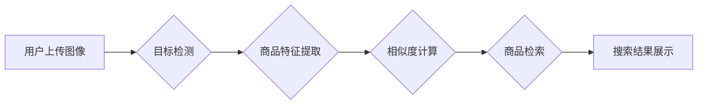

                 

## AI驱动的商品图像搜索系统设计

> 关键词：图像搜索、深度学习、卷积神经网络、目标检测、商品推荐、计算机视觉

### 1. 背景介绍

随着电子商务的蓬勃发展，商品图像搜索已成为消费者在线购物的重要方式之一。传统的文本搜索方式难以满足用户对商品的视觉化需求，而基于图像的搜索能够更直观、更精准地帮助用户找到心仪的商品。

AI驱动的商品图像搜索系统利用深度学习技术，能够自动识别图像中的商品特征，并将其与商品数据库进行匹配，从而实现高效、准确的商品搜索。这种技术不仅能够提升用户购物体验，还能为电商平台带来更多商业价值。

### 2. 核心概念与联系

#### 2.1 核心概念

* **图像识别:**  是指计算机能够识别图像中物体、场景、文本等内容的能力。
* **目标检测:**  是指在图像中定位和识别特定目标的能力，例如识别商品、人物、车辆等。
* **商品特征提取:**  是指从商品图像中提取关键特征，例如颜色、形状、纹理等，用于商品识别和匹配。
* **商品数据库:**  包含商品信息和图像数据的数据库，用于存储和检索商品信息。
* **相似度计算:**  用于衡量图像之间的相似度，例如使用欧氏距离、余弦相似度等算法。

#### 2.2 架构图



### 3. 核心算法原理 & 具体操作步骤

#### 3.1 算法原理概述

AI驱动的商品图像搜索系统主要基于深度学习技术，特别是卷积神经网络 (CNN) 算法。CNN 能够自动学习图像特征，并将其用于商品识别和匹配。

#### 3.2 算法步骤详解

1. **图像预处理:** 对上传的图像进行预处理，例如调整大小、归一化等，以提高算法的性能。
2. **目标检测:** 使用目标检测算法，例如 YOLO、Faster R-CNN 等，从图像中识别出商品目标。
3. **商品特征提取:** 对检测到的商品目标进行特征提取，例如使用 ResNet、VGG 等 CNN 模型提取商品的视觉特征。
4. **相似度计算:** 使用相似度计算算法，例如欧氏距离、余弦相似度等，计算提取的商品特征与商品数据库中商品特征之间的相似度。
5. **商品检索:** 根据相似度排序，从商品数据库中检索出与上传图像最相似的商品。
6. **搜索结果展示:** 将检索到的商品信息和图像展示给用户。

#### 3.3 算法优缺点

**优点:**

* **高精度:** 深度学习算法能够学习到复杂的图像特征，实现高精度的商品识别和匹配。
* **自动化:** 系统能够自动完成图像识别、特征提取、相似度计算等步骤，无需人工干预。
* **扩展性:** 系统能够轻松扩展到新的商品类别和图像数据集。

**缺点:**

* **计算资源需求高:** 深度学习算法训练和推理需要大量的计算资源。
* **数据依赖性强:** 算法性能依赖于训练数据的质量和数量。
* **解释性差:** 深度学习模型的决策过程难以解释。

#### 3.4 算法应用领域

* **电子商务:** 商品图像搜索、视觉推荐、商品分类等。
* **零售业:** 库存管理、商品定位、顾客行为分析等。
* **医疗保健:** 病例诊断、医学图像分析等。
* **制造业:** 产品缺陷检测、质量控制等。

### 4. 数学模型和公式 & 详细讲解 & 举例说明

#### 4.1 数学模型构建

商品图像搜索系统中，常用的数学模型包括：

* **卷积神经网络 (CNN):** 用于提取商品图像的特征。
* **相似度计算模型:** 用于衡量图像之间的相似度。

#### 4.2 公式推导过程

**CNN 模型:**

CNN 模型的训练目标是最小化预测结果与真实标签之间的损失函数。常用的损失函数包括交叉熵损失函数和均方误差损失函数。

**相似度计算模型:**

常用的相似度计算模型包括欧氏距离、余弦相似度等。

**欧氏距离:**

$$
d(x, y) = \sqrt{\sum_{i=1}^{n}(x_i - y_i)^2}
$$

其中，$x$ 和 $y$ 是两个图像的特征向量，$n$ 是特征向量的维度。

**余弦相似度:**

$$
sim(x, y) = \frac{x \cdot y}{||x|| ||y||}
$$

其中，$x \cdot y$ 是两个特征向量的点积，$||x||$ 和 $||y||$ 是两个特征向量的模长。

#### 4.3 案例分析与讲解

假设我们有一个商品图像数据库，包含了不同种类的商品图像和对应的商品信息。

当用户上传一张商品图像时，系统首先会使用目标检测算法识别出商品目标。然后，系统会使用 CNN 模型提取商品目标的特征向量。

接下来，系统会使用相似度计算模型计算提取的特征向量与商品数据库中商品特征向量的相似度。

根据相似度排序，系统会从商品数据库中检索出与上传图像最相似的商品，并将其展示给用户。

### 5. 项目实践：代码实例和详细解释说明

#### 5.1 开发环境搭建

* **操作系统:** Ubuntu 18.04
* **编程语言:** Python 3.6
* **深度学习框架:** TensorFlow 2.0
* **图像处理库:** OpenCV

#### 5.2 源代码详细实现

```python
# 导入必要的库
import tensorflow as tf
from tensorflow.keras.applications import ResNet50
from tensorflow.keras.preprocessing import image
from tensorflow.keras.applications.resnet50 import preprocess_input, decode_predictions

# 加载预训练的 ResNet50 模型
model = ResNet50(weights='imagenet')

# 定义图像预处理函数
def preprocess_image(image_path):
    img = image.load_img(image_path, target_size=(224, 224))
    x = image.img_to_array(img)
    x = np.expand_dims(x, axis=0)
    x = preprocess_input(x)
    return x

# 定义商品特征提取函数
def extract_features(image_path):
    x = preprocess_image(image_path)
    features = model.predict(x)
    return features

# 定义相似度计算函数
def calculate_similarity(features1, features2):
    similarity = np.dot(features1, features2) / (np.linalg.norm(features1) * np.linalg.norm(features2))
    return similarity

# 示例代码
image_path = 'path/to/image.jpg'
features = extract_features(image_path)

# 从数据库中检索商品特征
database_features = []
# ...

# 计算相似度
similarities = []
for feature in database_features:
    similarity = calculate_similarity(features, feature)
    similarities.append(similarity)

# 根据相似度排序
sorted_indices = np.argsort(similarities)[::-1]

# 展示搜索结果
for index in sorted_indices:
    # ...
```

#### 5.3 代码解读与分析

* 代码首先导入必要的库，包括 TensorFlow、OpenCV 等。
* 然后，代码加载预训练的 ResNet50 模型，并定义图像预处理函数、商品特征提取函数和相似度计算函数。
* 示例代码演示了如何使用这些函数提取商品图像的特征，并与数据库中的商品特征进行比较，从而实现商品搜索。

#### 5.4 运行结果展示

运行代码后，系统会从数据库中检索出与上传图像最相似的商品，并将其展示给用户。

### 6. 实际应用场景

#### 6.1 电商平台

* **商品搜索:** 用户可以通过上传商品图像进行搜索，快速找到心仪的商品。
* **视觉推荐:** 系统可以根据用户的浏览历史和购买记录，推荐与用户画像相符的商品。
* **商品分类:** 系统可以自动识别商品类别，并将其分类到相应的目录下。

#### 6.2 零售业

* **库存管理:** 系统可以帮助零售商实时监控商品库存，并及时补货。
* **商品定位:** 系统可以帮助顾客在商场内快速找到商品位置。
* **顾客行为分析:** 系统可以分析顾客的购物行为，例如浏览商品、添加购物车等，为零售商提供数据支持。

#### 6.3 其他领域

* **医疗保健:** 病例诊断、医学图像分析等。
* **制造业:** 产品缺陷检测、质量控制等。

#### 6.4 未来应用展望

随着人工智能技术的不断发展，AI驱动的商品图像搜索系统将拥有更强大的功能和更广泛的应用场景。

* **多模态搜索:** 将图像搜索与文本搜索、语音搜索等多模态搜索技术结合，实现更精准、更全面的商品搜索。
* **个性化推荐:** 基于用户的个人喜好和购物习惯，提供更个性化的商品推荐。
* **增强现实 (AR) 应用:** 将商品图像搜索与 AR 技术结合，实现虚拟试衣、虚拟家居等应用场景。

### 7. 工具和资源推荐

#### 7.1 学习资源推荐

* **书籍:**
    * 《深度学习》 - Ian Goodfellow, Yoshua Bengio, Aaron Courville
    * 《计算机视觉:算法与应用》 - Richard Szeliski
* **在线课程:**
    * Coursera: 深度学习 Specialization
    * Udacity: 计算机视觉 Nanodegree
* **博客和论坛:**
    * TensorFlow Blog
    * PyTorch Blog
    * Kaggle

#### 7.2 开发工具推荐

* **深度学习框架:** TensorFlow, PyTorch, Keras
* **图像处理库:** OpenCV, Pillow
* **数据库:** MySQL, PostgreSQL, MongoDB

#### 7.3 相关论文推荐

* **目标检测:**
    * You Only Look Once: Unified, Real-Time Object Detection
    * Faster R-CNN: Towards Real-Time Object Detection with Region Proposal Networks
* **商品特征提取:**
    * Deep Residual Learning for Image Recognition
    * Very Deep Convolutional Networks for Large-Scale Image Recognition

### 8. 总结：未来发展趋势与挑战

#### 8.1 研究成果总结

AI驱动的商品图像搜索系统已经取得了显著的成果，能够实现高效、准确的商品识别和匹配。

#### 8.2 未来发展趋势

* **模型精度提升:** 研究更深、更复杂的 CNN 模型，提高商品识别和匹配的精度。
* **跨模态搜索:** 将图像搜索与文本搜索、语音搜索等多模态搜索技术结合，实现更精准、更全面的商品搜索。
* **个性化推荐:** 基于用户的个人喜好和购物习惯，提供更个性化的商品推荐。
* **AR 应用:** 将商品图像搜索与 AR 技术结合，实现虚拟试衣、虚拟家居等应用场景。

#### 8.3 面临的挑战

* **数据标注:** 深度学习模型的训练需要大量的标注数据，数据标注成本高昂。
* **计算资源:** 深度学习模型训练和推理需要大量的计算资源，成本较高。
* **解释性:** 深度学习模型的决策过程难以解释，难以获得用户的信任。

#### 8.4 研究展望

未来，AI驱动的商品图像搜索系统将朝着更智能、更精准、更个性化的方向发展。

### 9. 附录：常见问题与解答

* **Q1: 如何选择合适的深度学习模型？**

    A1: 选择合适的深度学习模型取决于具体的应用场景和数据特点。

* **Q2: 如何解决数据标注问题？**

    A2: 可以采用数据增强技术、迁移学习等方法来减少数据标注成本。

* **Q3: 如何提高模型的解释性？**

    A3: 可以采用可解释机器学习 (XAI) 技术，例如 LIME、SHAP 等，来解释模型的决策过程。


作者：禅与计算机程序设计艺术 / Zen and the Art of Computer Programming 
<end_of_turn>

