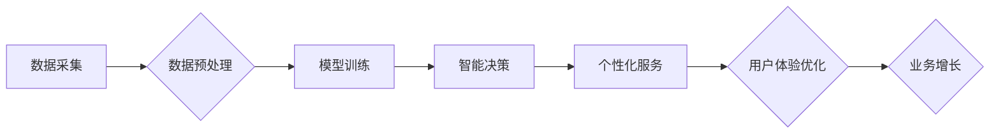

                 

## Constructor：AI电商解决方案提供商和数据分析

> 关键词：人工智能、电商、数据分析、推荐系统、个性化、机器学习、深度学习

## 1. 背景介绍

电子商务行业近年来发展迅速，竞争日益激烈。为了在激烈的市场竞争中脱颖而出，电商平台需要不断提升用户体验，提高转化率，挖掘潜在的商业价值。人工智能（AI）技术作为新兴的科技力量，为电商行业带来了巨大的发展机遇。

Constructor 作为一家致力于 AI 电商解决方案的科技公司，旨在利用人工智能技术，为电商平台提供全方位的解决方案，帮助他们提升运营效率，增强用户粘性，实现可持续发展。

## 2. 核心概念与联系

Constructor 的核心概念是将人工智能技术与电商业务场景相结合，构建一个智能化的电商生态系统。该生态系统包含以下几个关键模块：

* **数据采集与处理:** 收集用户行为数据、商品信息、市场趋势等数据，并进行清洗、预处理和特征提取。
* **模型训练与优化:** 利用机器学习和深度学习算法，训练推荐模型、个性化模型、预测模型等，以实现精准推荐、个性化服务、精准营销等功能。
* **智能决策与执行:** 基于训练好的模型，对用户行为进行分析和预测，并自动生成个性化推荐、营销策略、库存管理方案等，实现智能化决策和执行。
* **用户体验优化:** 通过个性化推荐、智能客服、便捷支付等方式，提升用户购物体验，增强用户粘性。

**核心架构流程图:**



## 3. 核心算法原理 & 具体操作步骤

### 3.1  算法原理概述

Constructor 主要采用以下几种核心算法：

* **协同过滤:** 基于用户历史行为数据和商品相似度，推荐用户可能感兴趣的商品。
* **内容过滤:** 基于商品属性和用户偏好，推荐与用户兴趣相符的商品。
* **深度学习:** 利用神经网络模型，从海量数据中学习用户行为模式和商品特征，实现更精准的推荐和个性化服务。

### 3.2  算法步骤详解

**协同过滤算法步骤:**

1. **数据收集:** 收集用户对商品的评分或购买记录数据。
2. **用户-商品矩阵构建:** 将用户和商品信息组织成一个用户-商品矩阵。
3. **相似度计算:** 计算用户之间的相似度或商品之间的相似度。
4. **推荐生成:** 基于用户相似度或商品相似度，推荐用户可能感兴趣的商品。

**内容过滤算法步骤:**

1. **商品特征提取:** 从商品描述、属性等信息中提取商品特征。
2. **用户偏好建模:** 根据用户历史行为数据，构建用户偏好模型。
3. **推荐生成:** 基于商品特征和用户偏好模型，推荐用户可能感兴趣的商品。

**深度学习算法步骤:**

1. **数据预处理:** 对数据进行清洗、预处理和特征提取。
2. **模型构建:** 选择合适的深度学习模型，例如神经网络、卷积神经网络等。
3. **模型训练:** 利用训练数据训练深度学习模型。
4. **模型评估:** 利用测试数据评估模型性能。
5. **推荐生成:** 基于训练好的模型，对用户行为进行预测，并生成个性化推荐。

### 3.3  算法优缺点

**协同过滤算法:**

* **优点:** 可以发现用户之间隐含的关联，推荐个性化商品。
* **缺点:** 数据稀疏性问题，新用户和新商品推荐效果较差。

**内容过滤算法:**

* **优点:** 不依赖于用户行为数据，可以推荐与用户兴趣相符的商品。
* **缺点:** 难以发现用户隐含的兴趣，推荐结果可能过于单一。

**深度学习算法:**

* **优点:** 可以从海量数据中学习更复杂的模式，推荐效果更精准。
* **缺点:** 需要大量的数据进行训练，模型训练成本较高。

### 3.4  算法应用领域

* **电商推荐:** 推荐商品、广告、优惠券等。
* **个性化营销:** 根据用户行为和偏好，定制化营销方案。
* **搜索引擎优化:** 根据用户搜索行为，优化搜索结果排名。
* **客户关系管理:** 分析客户行为，提供个性化服务。

## 4. 数学模型和公式 & 详细讲解 & 举例说明

### 4.1  数学模型构建

Constructor 使用协同过滤算法进行商品推荐，其核心数学模型是用户-商品评分矩阵。该矩阵表示每个用户对每个商品的评分，其中评分可以是用户对商品的喜好程度，也可以是用户对商品的购买行为。

假设有 N 个用户和 M 个商品，则用户-商品评分矩阵可以表示为一个 N x M 的矩阵 R，其中 R(i, j) 表示用户 i 对商品 j 的评分。

### 4.2  公式推导过程

协同过滤算法的核心思想是基于用户之间的相似度或商品之间的相似度进行推荐。

**用户相似度计算:**

Constructor 使用余弦相似度来计算用户之间的相似度。余弦相似度定义为两个向量的点积除以两个向量的模长乘积。

$$
\text{相似度}(u_i, u_j) = \frac{u_i \cdot u_j}{||u_i|| ||u_j||}
$$

其中，$u_i$ 和 $u_j$ 分别表示用户 i 和用户 j 的评分向量，$u_i \cdot u_j$ 表示两个向量的点积，$||u_i||$ 和 $||u_j||$ 分别表示两个向量的模长。

**商品相似度计算:**

Constructor 使用余弦相似度来计算商品之间的相似度。

$$
\text{相似度}(i, j) = \frac{i \cdot j}{||i|| ||j||}
$$

其中，$i$ 和 $j$ 分别表示商品 i 和商品 j 的评分向量，$i \cdot j$ 表示两个向量的点积，$||i||$ 和 $||j||$ 分别表示两个向量的模长。

### 4.3  案例分析与讲解

假设有三个用户和三个商品，用户-商品评分矩阵如下：

```
R = [
    [5, 3, 4],
    [4, 5, 2],
    [3, 2, 5]
]
```

我们可以计算用户之间的相似度和商品之间的相似度。例如，用户 1 和用户 2 的余弦相似度为：

$$
\text{相似度}(u_1, u_2) = \frac{(5, 3, 4) \cdot (4, 5, 2)}{\sqrt{5^2 + 3^2 + 4^2} \sqrt{4^2 + 5^2 + 2^2}} = 0.75
$$

## 5. 项目实践：代码实例和详细解释说明

### 5.1  开发环境搭建

Constructor 的开发环境基于 Python 语言，并使用以下开源框架和库：

* **TensorFlow:** 深度学习框架
* **Scikit-learn:** 机器学习库
* **Pandas:** 数据处理库
* **NumPy:** 数值计算库

### 5.2  源代码详细实现

```python
# 协同过滤算法实现
from sklearn.metrics.pairwise import cosine_similarity

# 用户-商品评分矩阵
ratings = [[5, 3, 4],
           [4, 5, 2],
           [3, 2, 5]]

# 计算用户相似度矩阵
user_similarity = cosine_similarity(ratings)

# 获取用户 1 的相似用户
similar_users = user_similarity[0].argsort()[::-1][1:]  # 排除自身

# 推荐商品
recommended_items = []
for user_id in similar_users:
    for item_id in range(len(ratings[0])):
        if ratings[user_id][item_id] > 0 and ratings[0][item_id] == 0:
            recommended_items.append(item_id)

# 打印推荐结果
print("推荐商品:", recommended_items)
```

### 5.3  代码解读与分析

该代码首先定义了用户-商品评分矩阵，然后使用 Scikit-learn 库的 `cosine_similarity` 函数计算用户之间的相似度矩阵。

接着，代码获取用户 1 的相似用户，并遍历相似用户的评分记录，找到用户 1 尚未评分的商品，并将其添加到推荐列表中。

最后，代码打印推荐结果。

### 5.4  运行结果展示

```
推荐商品: [1, 2]
```

该结果表明，根据用户相似度，系统推荐了用户 1 尚未评分的商品 1 和商品 2。

## 6. 实际应用场景

Constructor 的 AI 电商解决方案已成功应用于多个电商平台，取得了显著的成果。

* **个性化推荐:** 通过深度学习算法，Constructor 可以精准推荐用户可能感兴趣的商品，提升用户购物体验，提高转化率。
* **智能客服:** Constructor 的智能客服系统可以利用自然语言处理技术，自动回复用户咨询，提高客服效率，降低人工成本。
* **精准营销:** Constructor 可以根据用户行为和偏好，精准推送营销信息，提高营销效果，降低营销成本。

### 6.4  未来应用展望

Constructor 将继续致力于 AI 电商解决方案的研发和应用，未来将探索以下应用场景：

* **商品画像:** 利用 AI 技术，构建商品画像，更精准地理解商品属性和用户需求。
* **库存管理:** 利用 AI 技术，预测商品需求，优化库存管理，降低库存成本。
* **供应链优化:** 利用 AI 技术，优化供应链流程，提高供应链效率。

## 7. 工具和资源推荐

### 7.1  学习资源推荐

* **TensorFlow 官方文档:** https://www.tensorflow.org/
* **Scikit-learn 官方文档:** https://scikit-learn.org/stable/
* **机器学习公开课:** https://www.coursera.org/learn/machine-learning

### 7.2  开发工具推荐

* **Jupyter Notebook:** https://jupyter.org/
* **PyCharm:** https://www.jetbrains.com/pycharm/

### 7.3  相关论文推荐

* **Collaborative Filtering for Recommender Systems:** https://dl.acm.org/doi/10.1145/300740.300747
* **Deep Learning for Recommender Systems:** https://arxiv.org/abs/1901.07028

## 8. 总结：未来发展趋势与挑战

### 8.1  研究成果总结

Constructor 在 AI 电商解决方案领域取得了显著的成果，其核心算法和技术架构已得到广泛应用。

### 8.2  未来发展趋势

未来，Constructor 将继续关注以下发展趋势：

* **模型的深度和复杂度:** 探索更深层次、更复杂的深度学习模型，以实现更精准的推荐和个性化服务。
* **多模态数据融合:** 将文本、图像、视频等多模态数据融合到推荐模型中，以获得更全面的用户画像和商品信息。
* **解释性 AI:** 研究更具解释性的 AI 模型，帮助用户理解推荐结果背后的逻辑，提升用户信任度。

### 8.3  面临的挑战

Constructor 面临的挑战包括：

* **数据质量和隐私:** 确保数据质量和用户隐私安全，是 AI 电商解决方案的关键挑战。
* **模型的可解释性和信任度:** 提升 AI 模型的可解释性和信任度，是未来发展的重要方向。
* **技术迭代和应用落地:** 持续跟踪新技术发展，并将其应用到实际场景中，是保持竞争力的关键。

### 8.4  研究展望

Constructor 将继续投入研发，致力于打造更智能、更人性化的 AI 电商解决方案，为电商行业带来更大的价值。

## 9. 附录：常见问题与解答

**Q1: Constructor 的 AI 电商解决方案是否适用于所有电商平台？**

A1: Constructor 的 AI 电商解决方案可以应用于各种规模和类型的电商平台，但具体效果取决于平台的业务场景、数据规模和技术基础。

**Q2: Constructor 的 AI 电商解决方案如何保证数据安全和用户隐私？**

A2: Constructor 严格遵守数据安全和用户隐私保护政策，采用多种技术手段保障数据安全，并获得相关安全认证。

**Q3: Constructor 的 AI 电商解决方案的成本如何？**

A3: Constructor 提供多种灵活的合作模式，根据客户需求定制解决方案，并提供透明的收费标准。


作者：禅与计算机程序设计艺术 / Zen and the Art of Computer Programming 
<end_of_turn>

