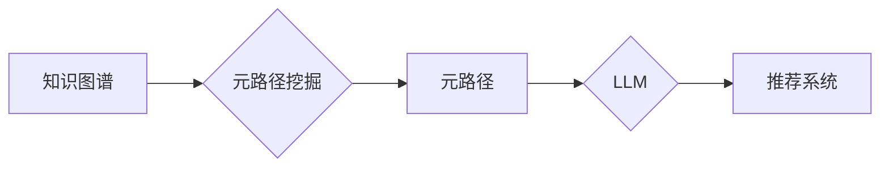

                 

## LLM在推荐系统中的元路径挖掘应用

> 关键词：LLM, 元路径, 推荐系统, 路径挖掘, 知识图谱, 自然语言处理, 协同过滤

## 1. 背景介绍

推荐系统是信息时代的重要技术，旨在根据用户的历史行为、偏好和上下文信息，预测用户可能感兴趣的内容并提供个性化的推荐。传统的推荐系统主要依赖于协同过滤和内容过滤等方法，但这些方法存在一定的局限性，例如数据稀疏性、冷启动问题和推荐结果单一性。

近年来，知识图谱（Knowledge Graph，KG）和深度学习技术的发展为推荐系统带来了新的机遇。知识图谱能够捕捉用户和物品之间的复杂关系，而深度学习模型能够学习用户行为和物品特征的非线性关系。将知识图谱和深度学习技术结合起来，可以构建更智能、更精准的推荐系统。

元路径挖掘（Meta Path Mining）是知识图谱分析领域的重要研究方向，它旨在从知识图谱中挖掘出用户和物品之间的潜在关系路径，这些路径可以揭示用户和物品之间的隐性关联，为推荐系统提供更丰富的特征信息。

大型语言模型（Large Language Model，LLM）作为一种强大的自然语言处理（Natural Language Processing，NLP）技术，能够理解和生成人类语言，并具备强大的文本表示能力。将LLM与元路径挖掘相结合，可以进一步提升推荐系统的性能。

## 2. 核心概念与联系

### 2.1 知识图谱

知识图谱是一种结构化的知识表示形式，它由实体和关系组成。实体代表现实世界中的事物，关系代表实体之间的连接。知识图谱可以用于存储和组织大量结构化知识，并支持各种知识推理和查询任务。

### 2.2 元路径

元路径是指知识图谱中实体之间的关系路径，它由多个关系串联而成。例如，在社交网络知识图谱中，"用户-关注-用户"可以看作是一个元路径，它表示用户A关注用户B，用户B关注用户C，则用户A和用户C之间存在一个间接关系。

### 2.3 LLM

大型语言模型是一种基于深度学习的强大自然语言处理模型，它能够理解和生成人类语言，并具备强大的文本表示能力。LLM可以用于各种NLP任务，例如文本分类、机器翻译、问答系统等。

### 2.4 元路径挖掘与LLM的结合

将LLM与元路径挖掘相结合，可以利用LLM的强大的文本表示能力，对元路径进行更深入的理解和分析。例如，LLM可以用于：

* **元路径的提取:** 利用LLM对文本数据进行分析，识别出潜在的元路径。
* **元路径的解释:** 利用LLM对元路径进行解释，理解元路径所代表的含义。
* **元路径的扩展:** 利用LLM对元路径进行扩展，挖掘出更丰富的知识关系。

**核心概念与联系流程图**



## 3. 核心算法原理 & 具体操作步骤

### 3.1 算法原理概述

LLM在元路径挖掘中的应用主要基于以下原理：

* **文本表示:** LLM可以将实体和关系转换为向量表示，使得它们能够在语义空间中进行比较和分析。
* **路径编码:** LLM可以将元路径编码为一个向量表示，该向量表示包含了元路径中实体和关系的信息。
* **路径相似度计算:** 利用向量相似度度量，计算不同元路径之间的相似度。
* **推荐策略:** 基于元路径的相似度，构建推荐策略，推荐与用户兴趣相关的物品。

### 3.2 算法步骤详解

1. **知识图谱预处理:** 将知识图谱转换为LLM可处理的格式，例如实体和关系的文本表示。
2. **LLM训练:** 使用预训练的LLM模型，对实体和关系进行文本表示训练。
3. **元路径编码:** 利用训练好的LLM模型，将元路径编码为向量表示。
4. **路径相似度计算:** 利用向量相似度度量，计算不同元路径之间的相似度。
5. **推荐策略构建:** 根据元路径的相似度，构建推荐策略，例如基于路径相似度的协同过滤算法。
6. **推荐结果输出:** 输出推荐结果，并进行评估。

### 3.3 算法优缺点

**优点:**

* 能够挖掘出用户和物品之间的隐性关联。
* 能够利用LLM的强大的文本表示能力，提升推荐系统的性能。
* 能够处理复杂的关系路径。

**缺点:**

* 需要大量的训练数据。
* 计算复杂度较高。
* 需要对LLM模型进行调优。

### 3.4 算法应用领域

* **电商推荐:** 推荐用户可能感兴趣的商品。
* **新闻推荐:** 推荐用户可能感兴趣的新闻文章。
* **社交推荐:** 推荐用户可能想关注的用户。
* **医疗推荐:** 推荐用户可能需要的医疗服务。

## 4. 数学模型和公式 & 详细讲解 & 举例说明

### 4.1 数学模型构建

假设我们有一个知识图谱G=(E,R)，其中E是实体集合，R是关系集合。元路径P是一个由关系串联的实体序列，例如P = (e1, r1, e2, r2, e3)。

我们可以将元路径P表示为一个向量：

$$
P = [e1_v, r1_v, e2_v, r2_v, e3_v]
$$

其中，$e1_v$, $r1_v$, $e2_v$, $r2_v$, $e3_v$分别为实体e1,关系r1,实体e2,关系r2,实体e3的向量表示。

### 4.2 公式推导过程

我们可以利用余弦相似度来计算两个元路径之间的相似度：

$$
sim(P1, P2) = \frac{P1 \cdot P2}{||P1|| ||P2||}
$$

其中，$P1 \cdot P2$是两个向量P1和P2的点积，$||P1||$和$||P2||$分别是两个向量的模长。

### 4.3 案例分析与讲解

假设我们有一个电商知识图谱，其中实体包括用户、商品和品牌，关系包括“购买”、“喜欢”和“属于”。

我们想要挖掘出用户可能感兴趣的商品的元路径。例如，我们可以挖掘出以下元路径：

* 用户 - 购买 - 商品
* 用户 - 喜欢 - 商品
* 用户 - 关注 - 品牌 - 属于 - 商品

我们可以利用LLM将这些元路径编码为向量表示，并计算它们之间的相似度。然后，我们可以根据元路径的相似度，构建推荐策略，推荐与用户兴趣相关的商品。

## 5. 项目实践：代码实例和详细解释说明

### 5.1 开发环境搭建

* Python 3.7+
* PyTorch 1.7+
* Transformers 4.10+
* NetworkX 2.6+

### 5.2 源代码详细实现

```python
import torch
from transformers import AutoModel, AutoTokenizer
from networkx import Graph

# 加载预训练的LLM模型和词典
model_name = "bert-base-uncased"
tokenizer = AutoTokenizer.from_pretrained(model_name)
model = AutoModel.from_pretrained(model_name)

# 创建知识图谱
graph = Graph()
graph.add_edge("用户1", "购买", "商品1")
graph.add_edge("用户1", "喜欢", "商品2")
graph.add_edge("用户1", "关注", "品牌A")
graph.add_edge("品牌A", "属于", "商品3")

# 元路径挖掘
def mine_meta_paths(graph):
    meta_paths = []
    for node in graph.nodes():
        for path in nx.all_simple_paths(graph, source=node, target=node):
            meta_paths.append(path)
    return meta_paths

# 元路径编码
def encode_meta_path(meta_path):
    tokens = [tokenizer.encode(str(entity)) for entity in meta_path]
    input_ids = torch.tensor([token for sublist in tokens for token in sublist])
    outputs = model(input_ids=input_ids)
    return outputs.last_hidden_state

# 路径相似度计算
def calculate_similarity(meta_path1, meta_path2):
    embedding1 = encode_meta_path(meta_path1)
    embedding2 = encode_meta_path(meta_path2)
    similarity = torch.cosine_similarity(embedding1, embedding2)
    return similarity

# 推荐策略
def recommend(user, meta_paths):
    user_meta_paths = [meta_path for meta_path in meta_paths if user in meta_path]
    similarity_scores = [calculate_similarity(user_meta_path, meta_path) for meta_path in meta_paths]
    recommended_items = [item for item, score in sorted(zip(meta_paths, similarity_scores), key=lambda x: x[1], reverse=True)]
    return recommended_items

# 示例使用
user = "用户1"
meta_paths = mine_meta_paths(graph)
recommendations = recommend(user, meta_paths)
print(f"推荐给 {user} 的商品：{recommendations}")
```

### 5.3 代码解读与分析

* **加载预训练模型:** 代码首先加载预训练的LLM模型和词典。
* **创建知识图谱:** 代码创建一个简单的知识图谱，其中包含用户、商品和品牌之间的关系。
* **元路径挖掘:** 代码使用NetworkX库对知识图谱进行元路径挖掘。
* **元路径编码:** 代码使用LLM模型将元路径编码为向量表示。
* **路径相似度计算:** 代码使用余弦相似度计算两个元路径之间的相似度。
* **推荐策略:** 代码构建了一个基于元路径相似度的推荐策略。
* **示例使用:** 代码演示了如何使用该推荐策略推荐商品。

### 5.4 运行结果展示

运行代码后，会输出推荐给用户1的商品列表。

## 6. 实际应用场景

### 6.1 电商推荐

LLM在元路径挖掘应用于电商推荐，可以挖掘出用户和商品之间的隐性关联，例如用户购买过类似商品的用户也可能喜欢该商品。

### 6.2 新闻推荐

LLM可以帮助新闻推荐系统挖掘出用户感兴趣的新闻主题和作者，并推荐相关新闻。

### 6.3 社交推荐

LLM可以帮助社交推荐系统挖掘出用户可能想关注的用户，例如用户关注的用户的朋友也可能值得关注。

### 6.4 未来应用展望

LLM在元路径挖掘的应用前景广阔，未来可以应用于更多领域，例如医疗推荐、教育推荐、金融推荐等。

## 7. 工具和资源推荐

### 7.1 学习资源推荐

* **论文:**

    * Meta Path Mining: A Survey
    * Large Language Models for Knowledge Graph Reasoning

* **博客:**

    * Towards Data Science
    * Analytics Vidhya

### 7.2 开发工具推荐

* **NetworkX:** Python 图论库
* **PyTorch:** 深度学习框架
* **Transformers:** 预训练语言模型库

### 7.3 相关论文推荐

* Meta Path Mining: A Survey
* Large Language Models for Knowledge Graph Reasoning
* Meta Path Mining with Deep Learning

## 8. 总结：未来发展趋势与挑战

### 8.1 研究成果总结

LLM在元路径挖掘中的应用取得了显著的成果，能够挖掘出用户和物品之间的隐性关联，提升推荐系统的性能。

### 8.2 未来发展趋势

* **更强大的LLM模型:** 未来将会有更强大的LLM模型，能够更好地理解和表示知识关系。
* **更有效的元路径挖掘算法:** 未来将会有更有效的元路径挖掘算法，能够挖掘出更丰富的知识关系。
* **更个性化的推荐策略:** 未来将会有更个性化的推荐策略，能够根据用户的不同需求和偏好提供更精准的推荐。

### 8.3 面临的挑战

* **数据稀疏性:** 知识图谱数据往往是稀疏的，这会影响LLM模型的训练效果。
* **计算复杂度:** 元路径挖掘和LLM模型训练的计算复杂度较高，需要强大的计算资源。
* **解释性:** LLM模型的决策过程往往是不可解释的，这会影响推荐系统的可信度。

### 8.4 研究展望

未来研究将重点关注解决上述挑战，例如开发新的数据增强方法、设计更有效的算法和模型，以及提高LLM模型的解释性。


## 9. 附录：常见问题与解答

**Q1: LLM在元路径挖掘中有什么优势？**

**A1:** LLM能够利用其强大的文本表示能力，对元路径进行更深入的理解和分析，挖掘出用户和物品之间的隐性关联。

**Q2: 如何评估LLM在元路径挖掘中的性能？**

**A2:** 可以使用推荐系统的指标，例如准确率、召回率和NDCG，来评估LLM在元路径挖掘中的性能。

**Q3: LLM在元路径挖掘中的应用有哪些局限性？**

**A3:** LLM在元路径挖掘中的应用存在一些局限性，例如数据稀疏性、计算复杂度和解释性问题。


作者：禅与计算机程序设计艺术 / Zen and the Art of Computer Programming 
<end_of_turn>

