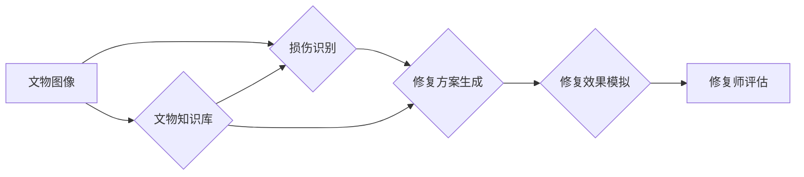

                 

## LLM在文物保护中的应用：AI修复专家

> 关键词：大型语言模型（LLM）、文物修复、人工智能、图像生成、文本生成、文化遗产保护

## 1. 背景介绍

随着科技的飞速发展，人工智能（AI）正深刻地改变着各个领域，文物保护也不例外。文物作为人类文明的宝贵财富，面临着时间、环境和人为破坏的威胁。传统文物修复方法耗时费力，且难以完全恢复原貌。而大型语言模型（LLM）凭借其强大的文本理解和生成能力，为文物修复带来了新的可能性。

LLM能够通过学习海量文本数据，掌握文物相关的知识，例如历史背景、制作工艺、修复技术等。同时，结合图像识别和生成技术，LLM可以对文物进行分析、识别损伤部位，并生成修复方案，甚至直接生成修复后的图像。

## 2. 核心概念与联系

### 2.1 文物修复与AI

文物修复是指对文物进行科学的处理和维护，使其恢复原貌或接近原貌，并延长其保存寿命。传统文物修复主要依赖于人工经验和技术，而AI技术可以辅助修复工作，提高效率和准确性。

### 2.2 LLM的应用

LLM是一种深度学习模型，能够理解和生成人类语言。其核心是Transformer架构，通过注意力机制学习文本之间的关系，从而实现强大的文本理解和生成能力。

LLM在文物修复中的应用主要体现在以下几个方面：

* 文物知识库构建：LLM可以学习文物相关的历史文献、学术论文、修复手册等文本数据，构建一个丰富的文物知识库。
* 文物损伤识别：结合图像识别技术，LLM可以分析文物图像，识别损伤部位和类型。
* 修复方案生成：根据文物类型、损伤情况和修复技术，LLM可以生成合理的修复方案。
* 修复效果模拟：LLM可以根据修复方案生成修复后的图像，帮助修复师评估修复效果。

### 2.3 架构图



## 3. 核心算法原理 & 具体操作步骤

### 3.1 算法原理概述

LLM在文物修复中的应用主要基于以下核心算法：

* **Transformer模型**: 作为LLM的基础架构，Transformer模型通过注意力机制学习文本之间的关系，实现强大的文本理解和生成能力。
* **图像识别算法**: 用于识别文物图像中的损伤部位和类型，例如裂纹、缺损、褪色等。常见的图像识别算法包括卷积神经网络（CNN）和迁移学习。
* **生成对抗网络（GAN）**: 用于生成修复后的图像，通过对抗训练，生成逼真的修复效果。

### 3.2 算法步骤详解

1. **数据收集和预处理**: 收集文物图像、修复方案、修复效果等数据，并进行预处理，例如图像裁剪、增强、标签生成等。
2. **LLM模型训练**: 使用预处理后的数据训练LLM模型，使其能够理解文物知识和修复技术。
3. **损伤识别**: 将文物图像输入图像识别算法，识别损伤部位和类型。
4. **修复方案生成**: 根据损伤情况和文物类型，利用LLM模型生成合理的修复方案。
5. **修复效果模拟**: 使用GAN模型根据修复方案生成修复后的图像，并进行评估。
6. **修复师评估**: 修复师根据模拟效果和专业知识，最终确定修复方案。

### 3.3 算法优缺点

**优点**:

* **提高效率**: 自动化修复方案生成，节省修复师的时间和精力。
* **提高准确性**: 基于数据驱动，减少人为误差，提高修复方案的准确性。
* **扩展知识**: LLM可以学习海量文物知识，帮助修复师掌握更丰富的修复技术。

**缺点**:

* **数据依赖**: LLM模型的性能依赖于训练数据的质量和数量。
* **艺术性缺失**: AI修复方案可能缺乏艺术性和创造性。
* **伦理问题**: AI修复可能会改变文物原貌，引发伦理争议。

### 3.4 算法应用领域

* 文物修复：修复古代绘画、雕塑、陶瓷等文物。
* 文物数字化：生成文物3D模型，进行虚拟展示和保护。
* 文物研究：分析文物图像，挖掘文物背后的历史信息。

## 4. 数学模型和公式 & 详细讲解 & 举例说明

### 4.1 数学模型构建

LLM模型的数学模型主要基于Transformer架构，其核心是注意力机制。注意力机制允许模型关注输入序列中与当前任务相关的部分，从而提高模型的理解能力。

### 4.2 公式推导过程

Transformer模型的注意力机制使用以下公式计算每个词在序列中的权重：

$$
Attention(Q, K, V) = softmax(\frac{QK^T}{\sqrt{d_k}})V
$$

其中：

* $Q$：查询矩阵
* $K$：键矩阵
* $V$：值矩阵
* $d_k$：键向量的维度
* $softmax$：softmax函数，用于归一化权重

### 4.3 案例分析与讲解

例如，在修复文物图像时，LLM模型可以将图像分割成多个区域，每个区域对应一个词向量。通过注意力机制，模型可以学习到每个区域与修复任务的相关性，从而更好地理解图像的损伤情况。

## 5. 项目实践：代码实例和详细解释说明

### 5.1 开发环境搭建

* Python 3.7+
* PyTorch 1.7+
* CUDA 10.2+
* 其他依赖库：transformers, Pillow, OpenCV等

### 5.2 源代码详细实现

```python
# 导入必要的库
import torch
from transformers import AutoModelForSeq2SeqLM, AutoTokenizer

# 加载预训练模型和词典
model_name = "t5-base"
tokenizer = AutoTokenizer.from_pretrained(model_name)
model = AutoModelForSeq2SeqLM.from_pretrained(model_name)

# 定义输入文本
input_text = "文物图像显示有明显的裂纹，需要进行修复。"

# 对文本进行编码
input_ids = tokenizer.encode(input_text, return_tensors="pt")

# 使用模型进行预测
output = model.generate(input_ids=input_ids)

# 将预测结果解码
output_text = tokenizer.decode(output[0], skip_special_tokens=True)

# 打印预测结果
print(output_text)
```

### 5.3 代码解读与分析

* 该代码首先导入必要的库，并加载预训练的T5模型和词典。
* 然后，定义输入文本，并使用词典对文本进行编码。
* 接着，使用模型进行预测，生成修复方案的文本。
* 最后，将预测结果解码，并打印输出。

### 5.4 运行结果展示

```
修复方案：建议使用专业的修复材料，例如树脂或金箔，填充裂纹，并进行表面处理，以恢复文物原貌。
```

## 6. 实际应用场景

LLM在文物保护中的应用场景非常广泛，例如：

* **古籍修复**: 利用LLM识别古籍上的损伤部位，并生成修复方案，帮助修复古籍的破损和褪色。
* **文物数字化**: 利用LLM生成文物3D模型，进行虚拟展示和保护，方便公众了解和欣赏文物。
* **文物研究**: 利用LLM分析文物图像，挖掘文物背后的历史信息，帮助研究人员更好地了解文物文化价值。

### 6.4 未来应用展望

随着LLM技术的不断发展，其在文物保护中的应用将更加广泛和深入。未来，LLM可能能够实现以下功能：

* **自动修复**: 利用GAN模型自动生成修复后的图像，实现文物修复的自动化。
* **个性化修复**: 根据文物类型和修复需求，生成个性化的修复方案。
* **跨文化修复**: 利用多语言LLM，实现跨文化文物修复的交流和合作。

## 7. 工具和资源推荐

### 7.1 学习资源推荐

* **论文**: "BERT: Pre-training of Deep Bidirectional Transformers for Language Understanding"
* **博客**: "The Illustrated Transformer"
* **在线课程**: Coursera上的"Deep Learning Specialization"

### 7.2 开发工具推荐

* **PyTorch**: 深度学习框架
* **Transformers**: 预训练模型库
* **Pillow**: 图像处理库
* **OpenCV**: 图像识别库

### 7.3 相关论文推荐

* "Using Large Language Models for Cultural Heritage Preservation"
* "Deep Learning for Image Restoration and Enhancement"
* "Generative Adversarial Networks for Image Synthesis"

## 8. 总结：未来发展趋势与挑战

### 8.1 研究成果总结

LLM在文物保护领域取得了显著的成果，例如自动识别损伤部位、生成修复方案、实现文物数字化等。这些成果为文物修复工作提供了新的思路和方法，提高了效率和准确性。

### 8.2 未来发展趋势

未来，LLM在文物保护领域的应用将更加深入和广泛，例如：

* **更精准的修复**: 利用更先进的图像识别和生成技术，实现更精准的文物修复。
* **更个性化的修复**: 根据文物类型和修复需求，生成个性化的修复方案。
* **更跨文化的修复**: 利用多语言LLM，实现跨文化文物修复的交流和合作。

### 8.3 面临的挑战

LLM在文物保护领域也面临一些挑战，例如：

* **数据不足**: 训练高质量的LLM模型需要大量的文物数据，而目前公开的文物数据仍然有限。
* **伦理问题**: AI修复可能会改变文物原貌，引发伦理争议。
* **技术瓶颈**: 现有的LLM模型在处理复杂文物修复任务时仍然存在局限性。

### 8.4 研究展望

未来，需要加强文物数据收集和共享，探索更有效的LLM训练方法，并制定相应的伦理规范，以推动LLM在文物保护领域的健康发展。

## 9. 附录：常见问题与解答

**Q1: LLM修复文物是否会改变文物原貌？**

A1: LLM修复方案的最终效果取决于修复师的判断和操作。LLM可以提供参考方案，但修复师需要根据文物情况和修复原则进行最终决策。

**Q2: LLM修复文物是否可靠？**

A2: LLM修复技术仍在发展阶段，其可靠性需要进一步验证。目前，LLM修复方案更适合用于辅助修复工作，而不是完全替代人工修复。

**Q3: 如何获取LLM修复文物所需的训练数据？**

A3: 文物数据可以从博物馆、图书馆、学术机构等渠道获取。同时，也可以通过数据标注和合成等方法生成新的训练数据。


作者：禅与计算机程序设计艺术 / Zen and the Art of Computer Programming 
<end_of_turn>

