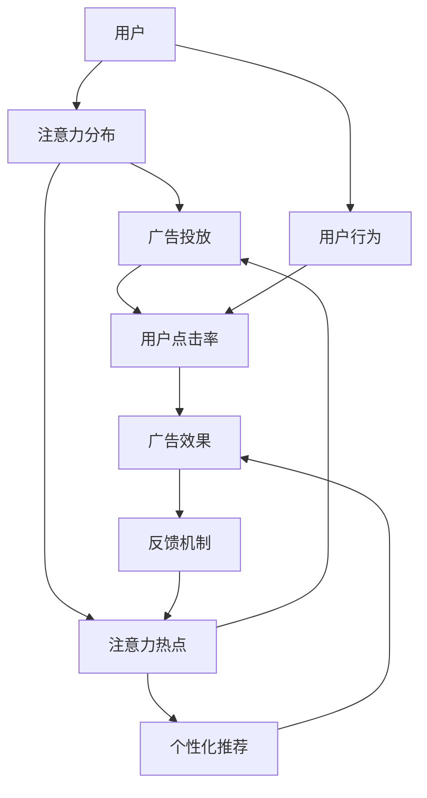

                 

# 注意力经济与在线广告目标设定：在不牺牲用户体验的情况下有效吸引受众

## 1. 背景介绍

在数字化时代，注意力成为一种稀缺资源。随着互联网用户的爆炸性增长，用户在海量信息中如何筛选和获取有用的内容，成为一个亟待解决的问题。在这样的背景下，在线广告市场也迎来了新的机遇和挑战。如何吸引受众的注意力，并确保广告投放不破坏用户体验，成为业界研究的热点。

### 1.1 问题由来

传统的在线广告往往通过展示大量文本、图像、视频等形式的信息流来吸引用户的注意力。然而，这种“炸药营销”策略常常导致用户体验的下降，甚至引发用户反感，进而影响广告投放效果。此外，随着用户对个性化内容需求的增加，传统的广告形式已经无法满足多样化、精准化的需求。

为了应对这些问题，注意力经济应运而生。通过理解用户注意力分布的特征，在线广告商能够更精准地投放广告，提升广告效果，同时减少对用户体验的负面影响。本文将详细探讨注意力经济的核心概念，以及如何在在线广告中实现高效的目标设定，并结合实际案例分析进行具体讲解。

## 2. 核心概念与联系

### 2.1 核心概念概述

注意力经济（Attention Economy）是一种以吸引和保持用户注意力为核心的经济模式。它强调通过高性价比的内容和精准的信息推送，吸引用户的注意力，并在用户注意力的分配中获得商业价值。在线广告的目标设定与优化，需要基于对用户注意力分布的深入理解，以及高效的目标函数设计。

### 2.2 核心概念原理和架构的 Mermaid 流程图



该流程图展示了注意力经济中的核心要素：

1. **用户**：广告的最终接收者和评价者。
2. **注意力分布**：用户对不同内容的注意力分配情况。
3. **广告投放**：根据用户注意力分布，精准投放广告。
4. **用户点击率**：广告投放效果的关键指标。
5. **广告效果**：通过点击率等指标衡量广告实际效果。
6. **个性化推荐**：根据用户注意力热点，进行个性化内容推荐。
7. **反馈机制**：通过用户行为反馈，不断优化广告投放策略。

## 3. 核心算法原理 & 具体操作步骤

### 3.1 算法原理概述

在线广告的目标设定需要解决以下几个关键问题：

1. **用户注意力模型**：如何建模用户的注意力分布，识别出用户对不同内容的关注程度。
2. **广告优化目标**：如何设计目标函数，最大化广告效果，同时不损害用户体验。
3. **推荐算法**：如何根据用户注意力热点，进行个性化推荐。
4. **反馈与优化**：如何基于用户行为反馈，不断优化广告投放策略。

本文将重点讨论用户注意力模型和广告优化目标函数的构建，并结合实际案例进行详细讲解。

### 3.2 算法步骤详解

#### 3.2.1 用户注意力模型构建

用户注意力模型旨在量化用户对不同内容的关注程度，通常通过用户行为数据进行建模。以Google AdWords为例，其用户注意力模型构建分为以下几个步骤：

1. **数据采集**：收集用户的浏览记录、点击记录、广告曝光记录等行为数据。
2. **特征提取**：提取用户的兴趣特征，如用户浏览的历史页面、点击的广告关键词等。
3. **注意力计算**：计算用户对不同广告关键词的关注程度，通常使用点击率、展示次数等指标。

#### 3.2.2 广告优化目标函数设计

广告优化目标函数旨在最大化广告效果，同时确保广告投放不损害用户体验。以展示广告为例，目标函数可以表示为：

$$
\maximize_{\theta} \sum_{i=1}^{N} C_i \cdot W_i \cdot \alpha(x_i, \theta)
$$

其中，$C_i$ 表示第 $i$ 次广告点击带来的点击成本，$W_i$ 表示第 $i$ 次广告的权重，$\alpha(x_i, \theta)$ 表示用户对第 $i$ 次广告的注意力评分，$\theta$ 为模型参数。

### 3.3 算法优缺点

#### 3.3.1 优点

1. **个性化推荐**：基于用户注意力模型，可以实现个性化的广告推荐，提升广告效果。
2. **高效优化**：通过目标函数设计，可以高效地优化广告投放策略，提升广告收益。
3. **用户体验提升**：通过合理的广告推荐，减少用户的不必要点击，提升用户体验。

#### 3.3.2 缺点

1. **数据依赖**：用户注意力模型依赖于大量的用户行为数据，数据获取难度大。
2. **计算复杂**：注意力模型和目标函数计算复杂，需要高效的算法和计算资源。
3. **模型泛化性**：模型需要经过大规模训练，泛化到新用户和新场景的效果难以保证。

### 3.4 算法应用领域

在线广告的目标设定和优化，适用于各类在线业务，包括但不限于：

1. **搜索引擎广告**：如Google AdWords、Bing Ads等，通过关键词匹配进行广告投放。
2. **社交媒体广告**：如Facebook Ads、Instagram Ads等，通过用户兴趣标签进行广告推荐。
3. **视频广告**：如YouTube Ads、Bilibili Ads等，通过视频内容特征进行广告投放。
4. **电商广告**：如淘宝直通车、京东推广等，通过用户购买历史进行个性化推荐。

## 4. 数学模型和公式 & 详细讲解 & 举例说明

### 4.1 数学模型构建

在线广告的目标设定可以建模为优化问题，通常包括以下几个变量：

- $C_i$：第 $i$ 次广告的点击成本。
- $W_i$：第 $i$ 次广告的权重。
- $x_i$：广告特征向量，如关键词、视频片段等。
- $\theta$：模型参数。

目标函数可表示为：

$$
\maximize_{\theta} \sum_{i=1}^{N} C_i \cdot W_i \cdot \alpha(x_i, \theta)
$$

其中，$\alpha(x_i, \theta)$ 为注意力评分函数，通常通过机器学习模型进行预测。

### 4.2 公式推导过程

以Google AdWords为例，其注意力评分函数 $\alpha(x_i, \theta)$ 可以表示为：

$$
\alpha(x_i, \theta) = \frac{P(x_i)}{\sum_{j=1}^{M} P(x_j)}
$$

其中，$P(x_i)$ 表示广告 $i$ 的预测点击概率，$M$ 表示所有广告的数量。

点击概率 $P(x_i)$ 可以进一步分解为两个部分：

$$
P(x_i) = f_{CV}(x_i) \cdot f_{CL}(x_i, \theta)
$$

其中，$f_{CV}(x_i)$ 为上下文相关部分，$CV$ 表示点击意向；$f_{CL}(x_i, \theta)$ 为用户相关部分，$CL$ 表示点击能力。

### 4.3 案例分析与讲解

以YouTube广告推荐为例，用户对视频的注意力评分可以通过以下步骤计算：

1. **视频特征提取**：从视频标题、描述、标签等提取特征。
2. **用户特征提取**：从用户观看历史、点击记录等提取特征。
3. **注意力评分计算**：通过点击率、展示次数等指标，计算用户对每个视频的注意力评分。

## 5. 项目实践：代码实例和详细解释说明

### 5.1 开发环境搭建

在实际项目中，可以使用Python和TensorFlow等工具进行广告优化模型的开发。以下是一个简单的广告优化模型搭建步骤：

1. **环境准备**：安装Python 3.7及以上版本，TensorFlow >= 2.0，Pandas等工具。
2. **数据集准备**：收集用户行为数据，如点击记录、广告曝光记录等。
3. **特征工程**：对数据进行特征提取和处理，构建特征向量。

### 5.2 源代码详细实现

以Google AdWords为例，广告优化模型的代码实现如下：

```python
import tensorflow as tf
from tensorflow.keras.layers import Input, Dense, Dropout
from tensorflow.keras.models import Model
from sklearn.preprocessing import StandardScaler
import pandas as pd

# 数据集准备
data = pd.read_csv('ad_data.csv')

# 特征提取
features = data[['keyword', 'ad_id', 'user_id']]
labels = data['click_cost']

# 标准化处理
scaler = StandardScaler()
features = scaler.fit_transform(features)

# 构建模型
input_layer = Input(shape=(features.shape[1],))
x = Dense(64, activation='relu')(input_layer)
x = Dropout(0.2)(x)
x = Dense(32, activation='relu')(x)
x = Dropout(0.2)(x)
output_layer = Dense(1, activation='sigmoid')(x)

model = Model(inputs=input_layer, outputs=output_layer)

# 编译模型
model.compile(optimizer='adam', loss='binary_crossentropy', metrics=['accuracy'])

# 训练模型
model.fit(features, labels, epochs=10, batch_size=32, validation_split=0.2)
```

### 5.3 代码解读与分析

在上述代码中，我们首先对数据进行标准化处理，构建了一个简单的神经网络模型，用于预测广告点击成本。模型包括两个全连接层和两个Dropout层，以避免过拟合。编译模型时，选择Adam优化器和二元交叉熵损失函数，用于二分类问题。最后，使用训练集进行模型训练，同时保留20%的数据进行验证。

### 5.4 运行结果展示

训练完成后，我们可以使用测试集对模型进行评估：

```python
# 加载测试集数据
test_features = pd.read_csv('test_ad_data.csv')
test_features = scaler.transform(test_features)

# 模型评估
test_labels = test_features['click_cost']
predictions = model.predict(test_features)
```

评估结果包括模型的准确率和预测误差，可以帮助我们进一步优化模型。

## 6. 实际应用场景

### 6.1 智能推荐系统

智能推荐系统是注意力经济的核心应用场景之一。通过用户行为数据建模，智能推荐系统能够根据用户的注意力热点，推荐个性化内容，提升用户体验和广告效果。

### 6.2 搜索广告

搜索广告是广告主通过关键词进行广告投放的经典场景。通过注意力模型，搜索广告系统能够识别用户的点击意向，优化广告关键词的竞价策略，提升广告效果。

### 6.3 社交媒体广告

社交媒体广告通过用户兴趣标签进行投放，能够高效地触达目标用户。通过注意力模型，社交媒体广告系统能够精准地推荐广告内容，提升广告效果。

## 7. 工具和资源推荐

### 7.1 学习资源推荐

- **《注意力经济与在线广告优化》**：详细介绍了注意力经济的核心概念和在线广告优化方法，适合学习理解注意力模型的基本原理。
- **《深度学习理论与实践》**：涵盖了深度学习的基本理论，包括神经网络、优化算法等内容，为理解广告优化模型提供了理论基础。
- **《机器学习实战》**：通过实际案例讲解机器学习模型的开发和应用，适合实践动手操作。

### 7.2 开发工具推荐

- **TensorFlow**：深度学习框架，支持高效的模型构建和训练。
- **PyTorch**：深度学习框架，具有易用性和灵活性，支持高效的模型构建和训练。
- **Keras**：高级API，简化模型构建和训练过程。

### 7.3 相关论文推荐

- **Attention Is All You Need**：介绍Transformer模型的原理，为广告优化模型的构建提供了参考。
- **Deep Ad Ranking with Ad-click Model**：介绍Google AdWords的排名算法，展示了广告优化模型的实际应用。

## 8. 总结：未来发展趋势与挑战

### 8.1 研究成果总结

在线广告的目标设定和优化，是注意力经济中的重要研究方向。通过理解用户注意力分布，优化广告投放策略，可以提升广告效果，同时确保用户良好体验。本文详细探讨了用户注意力模型和广告优化目标函数的构建，并通过实际案例进行了详细讲解。

### 8.2 未来发展趋势

未来，在线广告的目标设定和优化将继续朝着以下几个方向发展：

1. **多模态广告推荐**：结合图像、视频、音频等多模态信息，提升广告推荐的精准度。
2. **用户行为动态建模**：实时更新用户行为模型，动态调整广告投放策略。
3. **跨领域广告投放**：通过用户跨平台行为数据，实现跨领域广告投放，提升广告效果。

### 8.3 面临的挑战

尽管在线广告的目标设定和优化已经取得了显著进展，但仍面临以下挑战：

1. **数据隐私**：如何保护用户隐私，避免数据泄露。
2. **模型泛化性**：模型在新场景和新用户上的泛化能力不足。
3. **计算资源**：模型训练和广告投放需要大量计算资源，成本较高。

### 8.4 研究展望

未来的研究可以从以下几个方向进行：

1. **隐私保护技术**：研究数据隐私保护技术，保护用户隐私，同时保证广告效果。
2. **多模态广告推荐**：结合多种数据类型，提升广告推荐的效果。
3. **动态广告优化**：实时更新用户行为模型，动态调整广告投放策略。

## 9. 附录：常见问题与解答

**Q1：如何评估广告投放的效果？**

A: 广告投放的效果可以通过多种指标进行评估，包括点击率、转化率、广告花费等。具体评估指标需要根据广告主的目标设定进行选取。

**Q2：如何保护用户隐私？**

A: 保护用户隐私可以通过匿名化处理、数据加密等方式进行。在广告投放过程中，避免直接使用个人隐私信息，使用脱敏处理后的数据进行广告优化。

**Q3：如何优化广告投放的计算效率？**

A: 优化广告投放的计算效率可以通过以下方式实现：
1. **分布式计算**：使用分布式计算框架，提高计算速度。
2. **模型压缩**：通过模型压缩技术，减少计算资源的消耗。
3. **增量学习**：实时更新模型参数，减少计算资源的浪费。

---

作者：禅与计算机程序设计艺术 / Zen and the Art of Computer Programming

