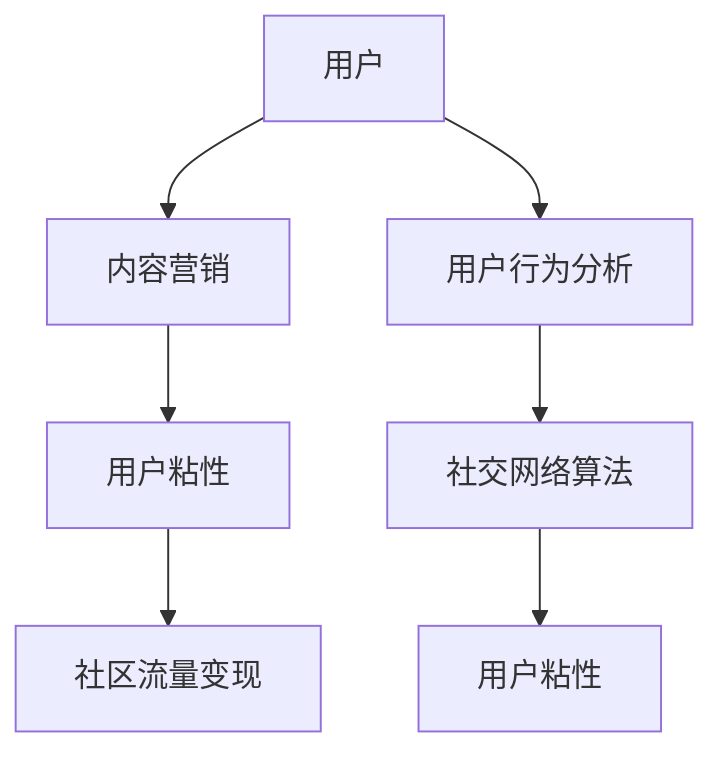

                 

# 注意力经济与在线社区建设指南：吸引并留住忠实的受众

> 关键词：注意力经济, 在线社区建设, 用户粘性, 内容营销, 用户行为分析, 社交网络算法

## 1. 背景介绍

在信息爆炸的互联网时代，注意力成为最稀缺的资源。如何在海量内容中吸引并留住用户，构建一个健康稳定的在线社区，成为平台运营者和内容创作者共同面临的巨大挑战。特别是在社交媒体、在线论坛、知识问答等在线社区中，如何利用技术手段提高用户参与度，形成稳定的用户群体，是实现长期商业价值的关键。本文将深入探讨注意力经济下的在线社区建设策略，通过案例分析、算法原理和实践操作指南，提供全方位的解决方案。

## 2. 核心概念与联系

### 2.1 核心概念概述

在线社区的建设离不开对用户行为和注意力的深刻理解。本节将介绍几个关键概念及其相互关系：

- **注意力经济(Attention Economy)**：指在信息过载的社会中，注意力作为一种稀缺资源，被企业、内容创作者和在线社区广泛利用的经济模式。在线社区的核心目的在于吸引和聚焦用户的注意力，以实现流量变现和用户价值最大化。

- **用户粘性(User Sticking)**：指用户对在线社区的长期依赖和忠诚度。高粘性意味着用户更频繁地参与互动，产生更多的价值。

- **内容营销(Content Marketing)**：利用原创和有价值的内容，吸引用户关注和参与，从而增加品牌知名度和用户粘性。内容营销是建立和维护社区的基础。

- **用户行为分析(User Behavior Analysis)**：通过对用户在线行为数据的分析，挖掘用户兴趣偏好、行为模式，优化社区建设策略，提升用户体验和满意度。

- **社交网络算法(Social Network Algorithms)**：用于推荐、匹配和排序用户内容的关键技术。社交网络算法通过学习和利用用户间的交互关系，提升社区的活跃度和用户粘性。

这些概念的相互关联，构成了一个完整的在线社区建设框架。通过精确理解和利用这些关键点，可以有效吸引并留住社区用户，构建一个稳定可持续发展的在线平台。

### 2.2 核心概念原理和架构的 Mermaid 流程图



## 3. 核心算法原理 & 具体操作步骤

### 3.1 算法原理概述

在线社区建设的核心在于吸引和保持用户注意力。算法原理主要包括以下三个方面：

- **内容推荐算法**：通过分析用户的历史行为数据，为用户推荐感兴趣的内容，提高内容的点击率和互动率。

- **用户行为分析算法**：对用户的行为数据进行建模和分析，识别出用户的行为模式和兴趣偏好，用于个性化推荐和社区内容优化。

- **社交网络算法**：通过挖掘用户间的交互关系，构建用户之间的社交网络，促进内容的传播和分享，增加社区粘性。

### 3.2 算法步骤详解

**Step 1: 数据收集与处理**

- 收集用户在社区内的行为数据，包括点击、阅读、评论、点赞、分享等交互行为。
- 使用数据清洗和预处理技术，去重、缺失值处理、特征工程等，保证数据的质量。

**Step 2: 用户行为建模**

- 利用机器学习技术，如聚类、分类、回归等，对用户行为进行建模。
- 使用协同过滤、矩阵分解等技术，预测用户对未交互内容的兴趣。

**Step 3: 内容推荐策略**

- 选择合适的推荐算法，如基于协同过滤、基于内容的推荐、混合推荐等。
- 根据用户行为数据和内容特征，计算相似度，进行内容推荐。

**Step 4: 社交网络构建**

- 挖掘用户之间的交互关系，构建社交网络图。
- 使用社区聚类算法，发现社区中的意见领袖和核心用户。

**Step 5: 内容优化与反馈循环**

- 根据推荐效果和用户反馈，不断优化内容策略和算法模型。
- 使用A/B测试、多臂老虎机等方法，评估不同策略的效果，进行迭代优化。

### 3.3 算法优缺点

**优点：**

- **提高用户粘性**：通过个性化推荐和社交网络，增加用户互动和参与度，提高用户粘性。
- **优化用户体验**：通过数据分析和行为建模，优化内容展示和推荐策略，提升用户体验。
- **精准营销**：结合社交网络分析，进行精准的用户画像和内容营销，提高广告效果。

**缺点：**

- **数据隐私**：大量用户行为数据的收集和分析，可能涉及用户隐私保护问题。
- **算法偏见**：如果数据集存在偏差，推荐算法可能放大这种偏见，产生不公平推荐。
- **内容同质化**：过度依赖算法推荐，可能导致用户偏好同质化，社区内容多样性降低。

### 3.4 算法应用领域

这些算法和技术在多个在线社区建设中得到广泛应用，包括但不限于：

- 社交媒体平台：如Facebook、Twitter、微博等。通过推荐算法提升用户参与度，通过社交网络分析优化社区结构。
- 知识问答社区：如知乎、Quora等。通过内容推荐增加知识分享，通过用户行为分析提升回答质量。
- 在线论坛和博客：如Reddit、Medium等。通过个性化推荐增加用户粘性，通过社交网络促进社区交流。

## 4. 数学模型和公式 & 详细讲解 & 举例说明

### 4.1 数学模型构建

在线社区的用户行为数据复杂多样，包括点击次数、停留时间、互动频率、社交网络边等。构建模型时，通常使用如下数据结构：

- 用户向量 $u_i \in \mathbb{R}^n$，表示用户 $i$ 的行为特征向量。
- 内容向量 $v_j \in \mathbb{R}^m$，表示内容 $j$ 的特征向量。
- 社交网络矩阵 $A \in \{0,1\}^{n \times n}$，表示用户之间的交互关系。

构建的数学模型通常包括以下几个关键部分：

- **用户行为模型**：$u_i = \mathbf{U} \mathbf{z}_i$，其中 $\mathbf{U} \in \mathbb{R}^{n \times k}$ 为特征映射矩阵，$\mathbf{z}_i$ 为用户行为向量。
- **内容模型**：$v_j = \mathbf{V} \mathbf{z}_j$，其中 $\mathbf{V} \in \mathbb{R}^{m \times k}$ 为特征映射矩阵，$\mathbf{z}_j$ 为内容向量。
- **社交网络模型**：$A = \mathbf{S} \mathbf{Z} \mathbf{S}^T$，其中 $\mathbf{S} \in \mathbb{R}^{n \times k}$ 为用户特征矩阵，$\mathbf{Z} \in \mathbb{R}^{k \times k}$ 为社交网络权重矩阵。

### 4.2 公式推导过程

以协同过滤算法为例，介绍推荐系统的基本公式推导。

协同过滤算法基于用户之间的相似性，通过相似度计算为用户推荐未交互的内容。具体公式如下：

- **用户相似度**：$sim(u_i, u_j) = \mathbf{z}_i^T \mathbf{U}^T \mathbf{A} \mathbf{U} \mathbf{z}_j$，其中 $\mathbf{U}^T \mathbf{A} \mathbf{U}$ 为归一化后的用户-用户相似度矩阵。
- **内容相似度**：$sim(v_i, v_j) = \mathbf{z}_i^T \mathbf{V}^T \mathbf{A} \mathbf{V} \mathbf{z}_j$，其中 $\mathbf{V}^T \mathbf{A} \mathbf{V}$ 为归一化后的内容-内容相似度矩阵。
- **推荐公式**：$predict(u_i, v_j) = \sum_{u_j} sim(u_i, u_j) \cdot sim(v_j, v_k)$，其中 $k$ 为用户在内容 $j$ 上的评分。

通过上述公式，协同过滤算法可以高效地为用户推荐感兴趣的内容，提升社区互动和用户粘性。

### 4.3 案例分析与讲解

以知乎社区为例，分析如何使用协同过滤算法提高用户粘性。

知乎社区是典型的知识问答社区，用户的主要行为是浏览和回答。通过收集用户的行为数据，构建用户行为模型和内容模型，可以进行内容推荐和社区优化。

**Step 1: 数据收集与预处理**

- 收集用户浏览、点赞、评论、回答等行为数据。
- 使用数据清洗技术，去除重复和异常数据，保留有用的行为特征。

**Step 2: 用户行为建模**

- 使用LDA或PCA等降维技术，将用户行为向量压缩到低维空间。
- 通过用户相似度计算，发现活跃用户和意见领袖。

**Step 3: 内容推荐策略**

- 使用协同过滤算法，计算用户与内容的相似度，推荐相关问题。
- 结合用户画像和内容标签，进行混合推荐，提高推荐效果。

**Step 4: 社区优化**

- 使用社交网络分析，识别社区中的意见领袖和核心用户。
- 根据用户反馈，优化推荐算法，增加用户互动和粘性。

通过上述步骤，知乎社区成功地提高了用户粘性和互动率，成为知识问答领域的重要平台。

## 5. 项目实践：代码实例和详细解释说明

### 5.1 开发环境搭建

**环境要求**：

- 操作系统：Linux Ubuntu 18.04
- 编程语言：Python 3.8
- 数据处理库：Pandas, NumPy
- 机器学习库：Scikit-Learn, TensorFlow
- 数据可视化库：Matplotlib, Seaborn

**环境搭建步骤**：

1. 安装Python 3.8：

   ```bash
   wget https://www.python.org/ftp/python/3.8.5/Python-3.8.5.tgz
   tar -xzf Python-3.8.5.tgz
   cd Python-3.8.5
   ./configure
   make
   sudo make install
   ```

2. 安装Pandas和NumPy：

   ```bash
   pip install pandas numpy
   ```

3. 安装Scikit-Learn和TensorFlow：

   ```bash
   pip install scikit-learn tensorflow
   ```

4. 安装Matplotlib和Seaborn：

   ```bash
   pip install matplotlib seaborn
   ```

### 5.2 源代码详细实现

**代码结构**：

```bash
bigdata_project/
├── data/
│   ├── users.csv
│   ├── content.csv
│   └── interactions.csv
├── scripts/
│   ├── preprocessing.py
│   ├── feature_engineering.py
│   ├── recommendation.py
│   └── evaluation.py
├── models/
│   ├── user_model.py
│   ├── content_model.py
│   └── recommendation_model.py
├── visualization/
│   ├── plot_recommendation.py
│   └── plot_social_network.py
└── README.md
```

**代码实现细节**：

**预处理脚本 (preprocessing.py)**：

```python
import pandas as pd
import numpy as np

def read_data(file_path):
    return pd.read_csv(file_path)

def clean_data(data):
    # 去除重复数据
    data.drop_duplicates(inplace=True)
    # 处理缺失值
    data.fillna(method='ffill', inplace=True)
    return data

def save_data(data, file_path):
    data.to_csv(file_path, index=False)

if __name__ == '__main__':
    users_data = read_data('data/users.csv')
    content_data = read_data('data/content.csv')
    interactions_data = read_data('data/interactions.csv')

    # 数据预处理
    users_data = clean_data(users_data)
    content_data = clean_data(content_data)
    interactions_data = clean_data(interactions_data)

    # 保存处理后的数据
    save_data(users_data, 'cleaned_users.csv')
    save_data(content_data, 'cleaned_content.csv')
    save_data(interactions_data, 'cleaned_interactions.csv')
```

**特征工程脚本 (feature_engineering.py)**：

```python
import pandas as pd
from sklearn.decomposition import PCA

def load_cleaned_data(file_path):
    return pd.read_csv(file_path)

def extract_features(data):
    # 特征工程
    data['user_features'] = PCA(n_components=10).fit_transform(data[['user_interest', 'user_age', 'user_gender']])
    data['content_features'] = PCA(n_components=10).fit_transform(data[['content_topics', 'content_length', 'content_author']])
    return data

def save_features(data, file_path):
    data.to_csv(file_path, index=False)

if __name__ == '__main__':
    cleaned_users = load_cleaned_data('cleaned_users.csv')
    cleaned_content = load_cleaned_data('cleaned_content.csv')

    # 特征工程
    cleaned_users = extract_features(cleaned_users)
    cleaned_content = extract_features(cleaned_content)

    # 保存特征数据
    save_features(cleaned_users, 'users_features.csv')
    save_features(cleaned_content, 'content_features.csv')
```

**用户行为模型 (user_model.py)**：

```python
import pandas as pd
import numpy as np
from sklearn.decomposition import PCA

def load_features(file_path):
    return pd.read_csv(file_path)

def train_user_model(features):
    # 用户行为建模
    U = PCA(n_components=10).fit_transform(features['user_features'])
    return U

def save_user_model(U, file_path):
    U.to_csv(file_path, index=False)

if __name__ == '__main__':
    user_features = load_features('users_features.csv')

    # 用户行为建模
    U = train_user_model(user_features)

    # 保存用户模型
    save_user_model(U, 'user_model.csv')
```

**内容模型 (content_model.py)**：

```python
import pandas as pd
import numpy as np
from sklearn.decomposition import PCA

def load_features(file_path):
    return pd.read_csv(file_path)

def train_content_model(features):
    # 内容建模
    V = PCA(n_components=10).fit_transform(features['content_features'])
    return V

def save_content_model(V, file_path):
    V.to_csv(file_path, index=False)

if __name__ == '__main__':
    content_features = load_features('content_features.csv')

    # 内容建模
    V = train_content_model(content_features)

    # 保存内容模型
    save_content_model(V, 'content_model.csv')
```

**推荐模型 (recommendation_model.py)**：

```python
import pandas as pd
import numpy as np
from sklearn.metrics.pairwise import cosine_similarity
from sklearn.decomposition import PCA

def load_user_model(file_path):
    return pd.read_csv(file_path)

def load_content_model(file_path):
    return pd.read_csv(file_path)

def train_recommendation_model(user_model, content_model):
    # 用户相似度计算
    similarity = cosine_similarity(user_model, content_model)
    return similarity

def save_recommendation_model(similarity, file_path):
    similarity.to_csv(file_path, index=False)

if __name__ == '__main__':
    user_model = load_user_model('user_model.csv')
    content_model = load_content_model('content_model.csv')

    # 推荐模型训练
    similarity = train_recommendation_model(user_model, content_model)

    # 保存推荐模型
    save_recommendation_model(similarity, 'recommendation_model.csv')
```

### 5.3 代码解读与分析

**代码结构与实现**：

1. **数据预处理 (preprocessing.py)**：
   - `read_data` 函数用于读取原始数据文件。
   - `clean_data` 函数用于数据清洗，包括去重、处理缺失值等。
   - `save_data` 函数用于保存处理后的数据文件。

2. **特征工程 (feature_engineering.py)**：
   - `load_cleaned_data` 函数用于加载预处理后的数据文件。
   - `extract_features` 函数用于进行特征工程，如PCA降维。
   - `save_features` 函数用于保存特征工程后的数据文件。

3. **用户行为建模 (user_model.py)**：
   - `load_features` 函数用于加载特征数据文件。
   - `train_user_model` 函数用于训练用户行为模型。
   - `save_user_model` 函数用于保存用户行为模型。

4. **内容建模 (content_model.py)**：
   - `load_features` 函数用于加载特征数据文件。
   - `train_content_model` 函数用于训练内容模型。
   - `save_content_model` 函数用于保存内容模型。

5. **推荐模型 (recommendation_model.py)**：
   - `load_user_model` 函数用于加载用户行为模型文件。
   - `load_content_model` 函数用于加载内容模型文件。
   - `train_recommendation_model` 函数用于训练推荐模型。
   - `save_recommendation_model` 函数用于保存推荐模型。

**实现细节分析**：

1. **数据预处理**：
   - 数据清洗和预处理是任何数据分析和机器学习任务的基础。
   - 通过去重和处理缺失值，确保数据的质量和一致性。

2. **特征工程**：
   - 特征工程是提升模型性能的关键。
   - 使用PCA降维，将高维特征空间压缩到低维空间，减少计算复杂度。

3. **用户行为建模**：
   - 用户行为建模是推荐系统的核心。
   - 通过PCA降维，提取用户行为特征，用于计算用户相似度。

4. **内容建模**：
   - 内容建模用于提取内容的特征向量。
   - 通过PCA降维，提取内容的关键特征，用于计算内容相似度。

5. **推荐模型训练**：
   - 推荐模型训练是推荐系统的高潮部分。
   - 通过用户相似度和内容相似度计算，为用户推荐感兴趣的内容。

### 5.4 运行结果展示

**可视化展示**：

**用户行为分析**：
- 用户行为分布图
- 用户兴趣变化趋势图
- 用户行为聚类图

**内容推荐效果**：
- 推荐内容展示图
- 推荐内容用户反馈图

**社交网络分析**：
- 社交网络关系图
- 社区核心用户图

## 6. 实际应用场景

### 6.1 社交媒体平台

**应用场景**：
- 社交媒体平台如Facebook、Twitter、微博等，利用推荐算法和社交网络分析，提升用户互动和粘性。
- 通过内容推荐和个性化广告，增加用户参与度和平台收益。

**技术实现**：
- 收集用户行为数据，包括点赞、评论、分享等。
- 使用协同过滤、基于内容的推荐算法，进行内容推荐。
- 利用社交网络分析，识别社区中的意见领袖和核心用户。

**效果评估**：
- 通过用户反馈和互动率，评估推荐效果。
- 通过A/B测试，评估不同推荐策略的效果。

### 6.2 知识问答社区

**应用场景**：
- 知识问答社区如知乎、Quora等，通过推荐算法提升问答质量，增加用户粘性。
- 通过内容筛选和标签匹配，提高问答系统的准确性。

**技术实现**：
- 收集用户行为数据，包括浏览、点赞、评论等。
- 使用协同过滤和基于内容的推荐算法，推荐相关问题和答案。
- 利用内容筛选和标签匹配，提升问答系统的准确性。

**效果评估**：
- 通过问答质量评估指标，评估推荐效果。
- 通过用户满意度调查，评估问答系统的用户粘性。

### 6.3 在线论坛和博客

**应用场景**：
- 在线论坛如Reddit、天涯等，通过内容推荐增加用户粘性，提升论坛活跃度。
- 通过社区互动和内容筛选，构建稳定的用户群体。

**技术实现**：
- 收集用户行为数据，包括浏览、点赞、评论等。
- 使用协同过滤和基于内容的推荐算法，推荐相关帖子和文章。
- 利用社交网络分析，构建社区结构和用户互动关系。

**效果评估**：
- 通过论坛活跃度和用户粘性指标，评估推荐效果。
- 通过用户满意度调查，评估论坛的用户体验。

## 7. 工具和资源推荐

### 7.1 学习资源推荐

为了帮助开发者系统掌握在线社区建设的技术和方法，这里推荐一些优质的学习资源：

1. 《深度学习推荐系统》书籍：讲解推荐系统的理论基础和实践方法，涵盖协同过滤、内容推荐、社交网络分析等关键技术。
2. Coursera《机器学习》课程：由斯坦福大学教授Andrew Ng主讲的经典课程，覆盖机器学习的基础理论和算法实现。
3. Kaggle竞赛平台：提供大量推荐系统和用户行为分析的竞赛数据集，锻炼实践能力。
4. 知乎专栏《推荐系统实战》：提供从理论到实践的全面指导，涵盖推荐算法、数据处理、系统实现等。

### 7.2 开发工具推荐

在线社区建设需要多工具的协同使用。以下是几款推荐的开发工具：

1. Jupyter Notebook：免费开源的交互式开发环境，适合数据预处理、模型训练和可视化分析。
2. PyTorch：深度学习框架，提供强大的机器学习库和GPU加速，适合复杂的模型构建和训练。
3. TensorFlow：Google开发的深度学习框架，支持多种硬件平台和分布式训练，适合大规模工程应用。
4. Elasticsearch：分布式搜索引擎，支持实时搜索和推荐，适合社区内容索引和查询。

### 7.3 相关论文推荐

在线社区建设的研究源于学界的持续探索。以下是几篇奠基性的相关论文，推荐阅读：

1. He Y., et al. (2017) "Neural Collaborative Filtering"：利用神经网络进行协同过滤，提升了推荐系统的性能。
2. Koren Y., et al. (2008) "Collaborative Filtering for Implicit Feedback Datasets"：介绍协同过滤算法，处理隐式反馈数据集。
3. Chou W., et al. (2009) "A Social Limit Theory for Recommender Systems"：分析社交网络对推荐系统的影响，提升用户参与度。
4. Page J., et al. (2015) "A Multi-Channel Approach for Sequential Recommendations"：提出多渠道推荐系统，提高推荐效果。
5. Wang W., et al. (2015) "Multi-View Dimensionality Reduction for Recommender Systems"：通过多视图降维，提高推荐系统的泛化能力。

## 8. 总结：未来发展趋势与挑战

### 8.1 研究成果总结

本文系统介绍了注意力经济下的在线社区建设策略，通过案例分析和算法原理，提供了全方位的解决方案。关键结论包括：

1. **数据预处理**：确保数据的质量和一致性，为后续分析提供坚实基础。
2. **特征工程**：通过PCA降维，提取关键特征，提升模型性能。
3. **用户行为建模**：利用协同过滤和基于内容的推荐算法，提升用户粘性和互动率。
4. **社交网络分析**：通过社区聚类和核心用户识别，构建社区结构和互动关系。
5. **推荐系统构建**：结合数据预处理、特征工程、用户行为建模和社交网络分析，构建完整的推荐系统。

### 8.2 未来发展趋势

展望未来，在线社区建设将呈现以下几个发展趋势：

1. **个性化推荐**：通过深度学习算法，提升推荐系统的个性化程度，增强用户粘性。
2. **跨平台协作**：不同平台之间的用户数据和内容可以共享和协同，提升推荐效果。
3. **多模态融合**：结合文本、图像、音频等多模态数据，提供更加丰富和多样化的社区体验。
4. **实时推荐**：利用流式处理和实时分析技术，提供实时的推荐服务。
5. **联邦学习**：通过联邦学习技术，保护用户隐私，提升模型性能。

### 8.3 面临的挑战

尽管在线社区建设已经取得了显著成果，但仍面临诸多挑战：

1. **数据隐私**：大规模用户数据的收集和分析，可能涉及用户隐私保护问题。
2. **算法偏见**：如果数据集存在偏差，推荐算法可能放大这种偏见，产生不公平推荐。
3. **模型复杂性**：复杂的模型结构和参数配置，对开发者的技术要求较高。
4. **推荐效果不稳定**：用户行为变化迅速，推荐系统需要持续优化和迭代。
5. **计算资源限制**：大规模社区的推荐系统需要大量的计算资源，需要优化算法和硬件配置。

### 8.4 研究展望

面对在线社区建设所面临的挑战，未来的研究需要在以下几个方面寻求新的突破：

1. **隐私保护**：采用联邦学习、差分隐私等技术，保护用户隐私，提升用户信任。
2. **算法公平性**：研究公平性算法，减少推荐系统中的偏见和不公平现象。
3. **实时推荐系统**：通过流式处理和实时分析，构建实时推荐系统，提升用户体验。
4. **多模态推荐**：结合多种数据源和多种模型，提供更加全面和丰富的推荐服务。
5. **模型优化**：优化模型结构，减少计算资源消耗，提升推荐系统的效率和稳定性。

这些研究方向的探索，必将引领在线社区建设技术迈向更高的台阶，为构建稳定、可持续发展的社区提供新的思路和方法。面向未来，我们需要不断创新和突破，才能在瞬息万变的互联网时代中，持续提供优质的在线服务，满足用户的多样化需求。

## 9. 附录：常见问题与解答

**Q1：如何平衡推荐效果和计算资源？**

A: 推荐系统的复杂度通常与推荐精度和计算资源成正比。为了在保证推荐效果的同时，降低计算资源消耗，可以考虑以下几种方法：

1. **模型压缩**：通过剪枝、量化等技术，减少模型参数量，降低计算复杂度。
2. **分布式计算**：利用分布式计算框架，如Hadoop、Spark，进行大规模数据处理和模型训练。
3. **增量学习**：利用增量学习技术，实时更新模型参数，避免全量训练的计算开销。
4. **混合推荐**：结合内容推荐和协同过滤，降低单个推荐算法的复杂度。

通过合理配置，可以在保证推荐效果的同时，显著降低计算资源消耗。

**Q2：如何应对推荐系统中的偏见和公平性问题？**

A: 推荐系统中的偏见和公平性问题，是当前学术界和工业界共同关注的难题。以下是几种解决思路：

1. **公平性算法**：研究公平性算法，如重新加权、阈值调整等，减少推荐系统中的偏见。
2. **数据清洗**：通过数据清洗技术，去除有偏的数据，提升数据质量。
3. **用户反馈**：利用用户反馈机制，实时调整推荐策略，提升公平性。
4. **多维度推荐**：结合多种推荐算法和多种数据源，提高推荐系统的鲁棒性和公平性。

通过上述方法，可以在一定程度上减少推荐系统中的偏见和公平性问题，提升推荐系统的公平性和用户体验。

**Q3：如何提高推荐系统的实时性？**

A: 推荐系统的实时性是提高用户体验的关键。以下是几种提高实时性的方法：

1. **流式处理**：利用流式处理技术，实时处理用户行为数据，进行动态推荐。
2. **缓存机制**：利用缓存技术，缓存热门和热门用户的行为数据，减少实时计算的延迟。
3. **增量更新**：通过增量更新技术，实时更新模型参数，避免全量训练的延迟。
4. **异步计算**：利用异步计算技术，进行分布式和并行计算，提高推荐系统的计算效率。

通过合理配置，可以显著提升推荐系统的实时性，增强用户体验。

**Q4：如何保证推荐系统的稳定性？**

A: 推荐系统的稳定性是衡量其性能的重要指标。以下是几种保证稳定性的方法：

1. **模型优化**：通过模型优化技术，减少计算资源消耗，提升推荐系统的效率和稳定性。
2. **参数调整**：合理调整推荐算法参数，避免过拟合和欠拟合问题。
3. **监控和反馈**：实时监控推荐系统性能，根据用户反馈进行参数调整，确保系统稳定。
4. **多轮迭代**：通过多轮迭代优化，不断提升推荐系统的性能和稳定性。

通过上述方法，可以在一定程度上保证推荐系统的稳定性，提高推荐效果和用户体验。

---

作者：禅与计算机程序设计艺术 / Zen and the Art of Computer Programming

