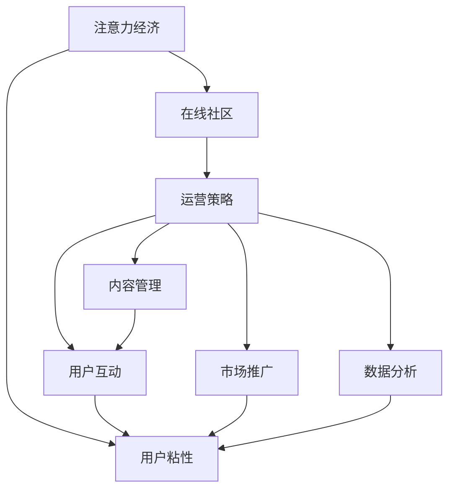

                 

# 注意力经济与在线社区建设策略与实践：吸引并留住受众

## 1. 背景介绍

在互联网时代，信息过载已经成为了常态，如何在这个注意力稀缺的时代吸引并留住受众，成为了在线社区建设的头等大事。由于用户注意力是有限的，在线社区若要在这场注意力争夺战中脱颖而出，必须提供有价值、有吸引力的内容，并通过有效的运营策略，将用户引来并留存。

本文章旨在探讨注意力经济，通过剖析注意力资源的特点和在线社区的运营策略，向读者展示如何利用注意力经济学原理，设计出引人入胜且用户粘性强的在线社区。

## 2. 核心概念与联系

### 2.1 核心概念概述

为了更深入理解注意力经济与在线社区建设，首先介绍几个核心概念：

#### a. 注意力经济
注意力经济是一种新兴的经济模式，它强调在信息过载的背景下，获取并保持用户的注意力成为企业的核心资源和竞争手段。简单来说，注意力经济即通过吸引和保持用户注意力的方式，来实现商业价值的变现。

#### b. 在线社区
在线社区是一个通过互联网连接起来的，具有共同兴趣和目标的群体。它提供了一个互动、分享、交流的平台，是人们获取信息和建立社交关系的重要场所。

#### c. 用户粘性
用户粘性是指用户对社区平台的依赖程度和持续使用频率，它是衡量社区活跃度的重要指标。一个用户粘性高的社区意味着用户能够在该平台上持续获得价值，并有动力继续使用。

#### d. 运营策略
运营策略是指为实现特定目标（如吸引新用户、提高用户粘性、增加用户活跃度等）而制定的一系列计划和方法。这些策略通常包括内容管理、用户互动、市场推广、数据分析等方面。

这些概念之间的关系可以通过以下Mermaid流程图来展示：

这个流程图展示了注意力经济如何通过运营策略，借助内容管理、用户互动、市场推广和数据分析，最终提升用户粘性，进而构建活跃的在线社区。

## 3. 核心算法原理 & 具体操作步骤

### 3.1 算法原理概述

注意力经济与在线社区建设的核心算法原理主要围绕着如何通过优化用户体验，提高用户满意度，从而吸引并留住受众。这种优化通常涉及到以下方面：

1. **个性化推荐**：通过算法推荐系统，为每位用户推荐其感兴趣的内容，从而增加其停留时间和使用频率。
2. **互动激励**：设计各种互动机制，如评论、点赞、分享等，鼓励用户参与互动，提高用户粘性。
3. **数据分析**：通过大数据分析，洞察用户行为，优化社区内容和运营策略，实现精细化运营。

### 3.2 算法步骤详解

#### 步骤一：数据收集与用户画像构建
- 通过用户行为数据（如浏览记录、互动行为等），构建用户画像，理解用户的兴趣和需求。
- 利用机器学习算法，如聚类、分类等，对用户进行细分，形成不同的用户群体。

#### 步骤二：内容生成与推荐
- 根据用户画像，生成个性化的内容。内容可以是原创文章、视频、图片等，具体形式可根据社区类型和用户偏好决定。
- 使用推荐算法，如协同过滤、基于内容的推荐、深度学习推荐等，为每位用户推荐其感兴趣的内容。

#### 步骤三：互动机制设计
- 设计互动机制，如评论、点赞、分享等，鼓励用户积极参与社区互动。
- 通过数据分析，优化互动机制，增强用户粘性。

#### 步骤四：市场推广与数据分析
- 通过市场推广手段，如SEO优化、社交媒体广告等，吸引新用户加入社区。
- 利用数据分析工具，如Google Analytics、Mixpanel等，监控社区运营指标，评估运营策略的效果，持续优化运营策略。

### 3.3 算法优缺点

#### a. 优点
- **个性化推荐**：通过算法推荐系统，能够提供个性化内容，提升用户体验。
- **互动激励**：通过互动机制，增强用户参与感和社区粘性。
- **数据驱动**：通过数据分析，优化社区运营，提高运营效率。

#### b. 缺点
- **数据隐私**：大量收集用户行为数据，可能涉及隐私问题，需严格遵守数据保护法规。
- **算法偏见**：推荐算法可能存在算法偏见，导致内容推荐失衡。
- **过度商业化**：过于强调商业价值，可能忽视用户体验和社区氛围。

### 3.4 算法应用领域

#### a. 社交媒体平台
如Facebook、Twitter等社交媒体平台，通过个性化推荐、互动机制设计、市场推广与数据分析，实现用户增长和活跃度的提升。

#### b. 在线教育平台
如Coursera、Udemy等在线教育平台，通过个性化课程推荐、互动学习机制、市场推广与数据分析，吸引并留住用户，提高用户学习效果和满意度。

#### c. 在线论坛
如Reddit、知乎等在线论坛，通过个性化内容推荐、互动讨论机制、市场推广与数据分析，提升用户粘性，增加社区活跃度。

## 4. 数学模型和公式 & 详细讲解 & 举例说明

### 4.1 数学模型构建

在线社区的运营可以抽象为一个动态的系统，其中用户行为数据和运营策略共同作用，影响用户粘性和社区活跃度。因此，可以通过以下数学模型来描述这一系统：

$$
\begin{aligned}
U_i^{(t+1)} &= U_i^{(t)} + F(U_i^{(t)}, A_i^{(t)}) \\
A_i^{(t+1)} &= A_i^{(t)} + G(A_i^{(t)}, P_i^{(t)}) \\
P_i^{(t+1)} &= P_i^{(t)} + H(P_i^{(t)}, D_i^{(t)})
\end{aligned}
$$

其中：
- $U_i$ 代表用户 $i$ 在时间 $t$ 的粘性得分。
- $A_i$ 代表用户 $i$ 在时间 $t$ 的活跃度得分。
- $P_i$ 代表用户 $i$ 在时间 $t$ 的参与度得分。
- $F$ 代表基于用户行为和内容推荐的粘性更新函数。
- $G$ 代表基于互动机制的活跃度更新函数。
- $H$ 代表基于数据分析的参与度更新函数。
- $D$ 代表数据驱动策略的优化函数。

### 4.2 公式推导过程

#### a. 粘性更新函数 $F$
根据用户行为数据，可以推导出粘性更新函数 $F$ 的形式。例如，对于某篇文章 $j$，如果用户 $i$ 阅读了该文章，则其粘性得分 $U_i$ 会增加，具体增加量取决于文章的吸引力 $A_j$ 和用户对文章的感受 $E_i$。

$$
\Delta U_i = \alpha_i \cdot A_j \cdot E_i
$$

其中 $\alpha_i$ 是用户 $i$ 的粘性系数，$A_j$ 是文章 $j$ 的吸引力评分，$E_i$ 是用户 $i$ 对文章 $j$ 的感受得分。

#### b. 活跃度更新函数 $G$
活跃度更新函数 $G$ 可以基于用户互动数据推导。例如，用户 $i$ 在时间 $t$ 的活跃度得分 $A_i$ 取决于其在社区内的互动次数 $I_i^{(t)}$ 和互动质量 $Q_i^{(t)}$。

$$
A_i^{(t+1)} = A_i^{(t)} + \beta_i \cdot I_i^{(t)} \cdot Q_i^{(t)}
$$

其中 $\beta_i$ 是用户 $i$ 的活跃度系数，$I_i^{(t)}$ 是用户 $i$ 在时间 $t$ 的互动次数，$Q_i^{(t)}$ 是用户 $i$ 在时间 $t$ 的互动质量得分。

#### c. 参与度更新函数 $H$
参与度更新函数 $H$ 可以基于用户参与行为数据推导。例如，用户 $i$ 在时间 $t$ 的参与度得分 $P_i$ 取决于其参与社区内容的次数 $C_i^{(t)}$ 和参与质量 $R_i^{(t)}$。

$$
P_i^{(t+1)} = P_i^{(t)} + \gamma_i \cdot C_i^{(t)} \cdot R_i^{(t)}
$$

其中 $\gamma_i$ 是用户 $i$ 的参与度系数，$C_i^{(t)}$ 是用户 $i$ 在时间 $t$ 的参与次数，$R_i^{(t)}$ 是用户 $i$ 在时间 $t$ 的参与质量得分。

### 4.3 案例分析与讲解

#### a. 案例一：个性化推荐系统
Facebook使用协同过滤算法，为用户推荐其可能感兴趣的朋友和帖子。其推荐系统基于用户的浏览记录和互动行为，通过数据分析生成个性化推荐列表。

#### b. 案例二：互动激励机制
Reddit 的点赞系统鼓励用户参与讨论，通过算法分析用户的行为数据，优化互动激励机制，提升用户粘性。

#### c. 案例三：数据分析与优化
Coursera 利用机器学习算法，对用户行为数据进行分析，优化课程推荐算法，提高课程完成率和用户满意度。

## 5. 项目实践：代码实例和详细解释说明

### 5.1 开发环境搭建

#### a. 选择开发环境
- 使用Python作为开发语言。
- 搭建虚拟环境，以避免依赖冲突。
- 使用Git版本控制，方便版本管理。

#### b. 配置开发环境
- 安装必要的Python包，如Pandas、NumPy、Scikit-learn等。
- 安装数据分析和机器学习库，如TensorFlow、PyTorch、Scikit-learn等。
- 配置开发环境，使其与生产环境一致。

### 5.2 源代码详细实现

#### a. 数据预处理
- 收集用户行为数据，包括浏览记录、互动行为等。
- 清洗数据，去除无效和重复记录。
- 进行数据分割，划分训练集、验证集和测试集。

#### b. 模型训练
- 使用机器学习算法，对用户进行细分，生成用户画像。
- 训练推荐算法模型，如协同过滤、基于内容的推荐、深度学习推荐等。
- 设计互动机制，如评论、点赞、分享等，并通过数据分析进行优化。

#### c. 系统集成
- 将推荐系统和互动机制集成到在线社区平台。
- 实现数据监控和分析，提供实时运营指标报告。

### 5.3 代码解读与分析

#### a. 数据预处理代码
- 数据收集：使用API接口收集用户行为数据，存储在本地数据仓库中。
- 数据清洗：使用Pandas库，去除无效和重复记录。
- 数据分割：使用Scikit-learn库，将数据分割成训练集、验证集和测试集。

#### b. 模型训练代码
- 用户细分：使用聚类算法，如K-means、GMM等，对用户进行细分，生成用户画像。
- 推荐算法训练：使用协同过滤、基于内容的推荐等算法，训练推荐模型。
- 互动机制设计：使用机器学习算法，如回归、分类等，设计互动机制，并根据用户反馈进行优化。

#### c. 系统集成代码
- 推荐系统集成：将推荐算法集成到社区平台，实现个性化推荐功能。
- 互动机制集成：将互动机制集成到社区平台，实现用户参与激励。
- 数据分析集成：使用数据分析工具，如TensorBoard、Mixpanel等，监控社区运营指标，提供实时运营报告。

### 5.4 运行结果展示

#### a. 个性化推荐效果
- 通过数据分析，评估推荐系统的个性化程度。
- 使用A/B测试，对比推荐前后的用户粘性和活跃度。

#### b. 互动机制效果
- 通过数据分析，评估互动机制的参与度。
- 使用A/B测试，对比互动前后的用户参与度和粘性。

#### c. 系统性能优化
- 通过数据分析，评估系统的性能指标。
- 使用优化算法，持续提升系统性能。

## 6. 实际应用场景

#### a. 社交媒体平台
Facebook 利用个性化推荐和互动机制，吸引了全球数十亿用户，并保持其用户的活跃度和粘性。

#### b. 在线教育平台
Coursera 通过个性化课程推荐和互动学习机制，实现了课程的广泛传播和高完成率。

#### c. 在线论坛
Reddit 通过点赞系统和互动机制，成为了全球最大的讨论平台之一。

## 7. 工具和资源推荐

### 7.1 学习资源推荐

#### a. 书籍推荐
- 《注意力经济》
- 《数据科学基础》
- 《Python机器学习》

#### b. 在线课程推荐
- Coursera的《数据科学专项课程》
- edX的《机器学习基础》
- Udacity的《深度学习专项课程》

#### c. 研究论文推荐
- 《注意力经济学：在线社区用户粘性研究》
- 《社交媒体互动与用户参与度分析》
- 《在线教育平台的个性化推荐系统》

### 7.2 开发工具推荐

#### a. 开发工具
- Python：作为开发语言，具有丰富的开源库和工具支持。
- Pandas：数据处理和分析库，适合处理结构化数据。
- NumPy：数学计算库，适合处理数值计算。
- TensorFlow：深度学习框架，适合构建推荐系统。
- PyTorch：深度学习框架，适合构建互动机制和数据分析。

#### b. 数据分析工具
- Google Analytics：网站和应用数据分析工具，适合监控用户行为。
- Mixpanel：用户行为分析工具，适合监控用户参与度。
- Tableau：数据可视化工具，适合数据分析和报告生成。

#### c. 机器学习工具
- Scikit-learn：机器学习库，适合构建推荐系统、聚类等算法。
- TensorFlow：深度学习库，适合构建推荐系统、互动机制等算法。

### 7.3 相关论文推荐

#### a. 推荐系统
- 《基于协同过滤的推荐系统研究》
- 《基于内容的推荐系统研究》
- 《深度学习推荐系统》

#### b. 社交媒体分析
- 《社交媒体用户粘性研究》
- 《社交媒体互动机制设计》
- 《社交媒体用户参与度分析》

#### c. 数据分析与优化
- 《数据驱动的社区运营优化》
- 《大数据分析在在线教育中的应用》
- 《机器学习在推荐系统中的应用》

## 8. 总结：未来发展趋势与挑战

### 8.1 研究成果总结

本文章通过剖析注意力经济与在线社区建设，提出了一套基于用户粘性提升的运营策略和实践方法。通过对个性化推荐、互动激励和数据分析等策略的讨论，提供了详细的项目实践和实际应用场景。

### 8.2 未来发展趋势

#### a. 个性化推荐技术
随着推荐算法的发展，未来的在线社区将能够提供更加精准和个性化的内容推荐，提升用户体验和满意度。

#### b. 互动激励机制
未来的互动激励机制将更加智能和多样化，通过游戏化设计、社交网络等手段，增强用户参与感和社区粘性。

#### c. 数据驱动运营
大数据和人工智能技术的发展，将使得在线社区的运营更加智能化和数据驱动化，能够实时监测和优化运营策略。

### 8.3 面临的挑战

#### a. 数据隐私问题
大量收集用户数据可能涉及隐私问题，需严格遵守数据保护法规，并加强用户隐私保护措施。

#### b. 算法偏见问题
推荐算法可能存在算法偏见，导致内容推荐失衡，需加强算法公平性和透明性。

#### c. 过度商业化问题
过于强调商业价值，可能忽视用户体验和社区氛围，需平衡商业目标和用户需求。

### 8.4 研究展望

未来的研究应着重于解决数据隐私、算法偏见和过度商业化等挑战，通过技术创新和算法改进，提升在线社区的用户粘性和运营效率。同时，还需关注社区生态的构建，实现社区内容的持续更新和优化，保持社区的活力和健康发展。

## 9. 附录：常见问题与解答

**Q1: 如何衡量用户粘性和活跃度？**

A: 用户粘性可以通过用户日活跃度（DAU）、月活跃度（MAU）、用户留存率等指标来衡量。用户活跃度可以通过用户点击次数、评论数、分享数等指标来衡量。

**Q2: 推荐算法有哪些类型？**

A: 推荐算法主要分为以下几类：
- 基于协同过滤的推荐
- 基于内容的推荐
- 深度学习推荐
- 混合推荐系统

**Q3: 互动激励机制有哪些设计思路？**

A: 互动激励机制的设计思路主要有以下几种：
- 积分奖励
- 徽章和排行榜
- 游戏化设计
- 社交网络互动

**Q4: 数据分析工具有哪些推荐？**

A: 数据分析工具推荐如下：
- Google Analytics
- Mixpanel
- Tableau

---

作者：禅与计算机程序设计艺术 / Zen and the Art of Computer Programming

