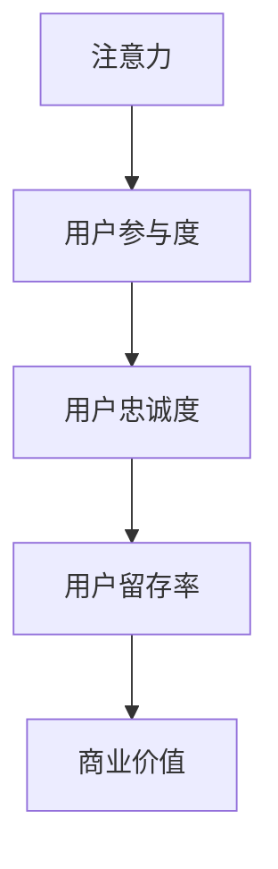

                 

## 1. 背景介绍

在当今数字化时代，注意力成为最稀缺的资源之一。随着信息爆炸的加剧，如何吸引并留住受众的注意力，成为众多在线社区和内容平台面临的重大挑战。以社交媒体、博客、论坛等为代表的大众化平台，已经逐渐演变成一场“注意力经济”的较量。在这一背景下，理解和运用注意力经济学原理，合理设计在线社区建设策略，显得尤为重要。本文将详细探讨“注意力经济”的核心概念、挑战与实践策略，希望能为在线社区建设提供有益的参考。

## 2. 核心概念与联系

### 2.1 核心概念概述

为了更好地理解“注意力经济”，我们首先需要梳理几个核心概念：

- **注意力**（Attention）：是指个人或组织对某一事物、事件或信息的集中注意程度。在数字化平台上，用户的注意力可以被视为一种“货币”，吸引更多注意力将带来更多商业价值。

- **用户参与度**（User Engagement）：指用户与在线内容平台之间的互动程度。参与度高的用户更有可能成为忠实粉丝，为平台带来长期收益。

- **内容质量**（Content Quality）：内容的质量直接影响用户停留时间和参与度。高质量、有价值的内容能够显著提升用户对平台的依赖度。

- **用户忠诚度**（User Loyalty）：指用户对平台的长期依赖和信任程度。忠诚的用户通常会主动为平台推广内容，甚至在关键时刻为平台辩护。

- **用户留存率**（User Retention Rate）：指用户在一定时间内继续使用平台的概率。留存率越高，平台的用户粘性越强，商业价值越大。

### 2.2 核心概念联系

这些概念之间存在着紧密的联系，如图1所示。注意力经济学通过科学合理的设计和运营策略，最大化用户对内容的关注，从而提高参与度和忠诚度，最终实现留存率的提升，进而带来更大的商业价值。



## 3. 核心算法原理 & 具体操作步骤

### 3.1 算法原理概述

注意力经济的核心在于通过各种手段提升用户对内容的关注度，增加用户参与度和忠诚度。常见的策略包括：

- **内容推荐算法**：通过分析用户行为，推荐用户可能感兴趣的内容，增加用户的参与度和停留时间。

- **激励机制**：设计合理的激励措施，如积分、勋章、会员等级等，提升用户对平台的依赖和忠诚度。

- **用户反馈**：及时响应用户的意见和反馈，增强用户的参与感和归属感。

- **社区互动**：设计多样化的社区互动功能，如评论、点赞、分享等，增加用户之间的互动和粘性。

- **个性化服务**：利用数据挖掘和机器学习技术，为用户提供个性化的内容和服务，满足用户的个性化需求。

### 3.2 算法步骤详解

以下是基于上述原理的注意力经济策略具体操作步骤：

**Step 1: 数据收集与分析**
- 收集用户在平台上的行为数据，如浏览历史、点击率、停留时间、互动记录等。
- 使用数据分析工具对数据进行整理和分析，找出用户的行为模式和偏好。

**Step 2: 内容推荐系统设计**
- 设计推荐算法，如协同过滤、内容标签、深度学习等，提升推荐的准确性和个性化程度。
- 根据用户行为和偏好，实时调整推荐内容，增加用户的参与度和留存率。

**Step 3: 激励机制设计与实施**
- 设计合理的积分、勋章、会员等级等激励机制，激励用户参与和贡献。
- 定期更新和优化激励措施，确保用户对激励措施的持续兴趣和参与度。

**Step 4: 用户反馈收集与处理**
- 设计用户反馈渠道，如在线客服、意见箱、问卷调查等，收集用户意见和建议。
- 分析用户反馈，识别和解决用户痛点和问题，提升用户满意度和忠诚度。

**Step 5: 社区互动功能设计与优化**
- 设计多样化的社区互动功能，如评论、点赞、分享、讨论等，增加用户之间的互动和粘性。
- 实时监测社区互动数据，优化互动功能，提升用户参与度和平台吸引力。

**Step 6: 个性化服务实现**
- 利用数据挖掘和机器学习技术，对用户进行分群和画像，提供个性化的内容和服务。
- 定期更新用户画像和推荐算法，确保个性化服务的持续性和有效性。

### 3.3 算法优缺点

注意力经济策略在提升用户参与度和忠诚度方面具有显著优势：

- **提高用户参与度**：通过个性化推荐和激励机制，增加用户对内容的关注和参与，提升用户粘性。
- **增强用户忠诚度**：设计合理的激励措施和社区互动功能，增强用户的归属感和忠诚度。
- **优化用户体验**：通过个性化服务和用户反馈，提升用户的满意度和平台体验。

然而，这些策略也存在一些局限：

- **数据隐私和安全问题**：收集和分析用户行为数据需要严格遵守数据隐私和安全法规。
- **激励机制的过度依赖**：过度依赖积分、勋章等激励措施可能降低用户的主动性和创造性。
- **个性化推荐的局限性**：个性化推荐算法可能存在一定的推荐偏差，影响用户对内容的整体满意度。

### 3.4 算法应用领域

注意力经济策略已经广泛应用于各种在线社区和内容平台，包括但不限于：

- **社交媒体平台**：如Facebook、Twitter、微信、微博等，通过内容推荐、激励机制、社区互动等功能，吸引和留住用户。
- **在线论坛和博客**：如知乎、豆瓣、Medium等，通过个性化服务和用户反馈，提升用户满意度和平台粘性。
- **电子商务平台**：如Amazon、京东、淘宝等，通过推荐系统、激励机制、用户评价等功能，增加用户购买和留存。
- **视频和音频平台**：如Netflix、YouTube、Spotify等，通过个性化推荐、社区互动等功能，提升用户参与度和留存率。

## 4. 数学模型和公式 & 详细讲解 & 举例说明

### 4.1 数学模型构建

注意力经济的核心在于通过数据分析和机器学习技术，对用户行为和内容进行建模和预测。以下是一个简单的数学模型构建示例：

设用户对内容的关注度为 $a_i$，内容的价值为 $v_i$，用户的行为数据为 $x_i$，推荐算法输出的预测关注度为 $\hat{a}_i$。模型的目标是最小化预测误差，即：

$$
\min_{\theta} \sum_{i=1}^n (a_i - \hat{a}_i)^2
$$

其中 $\theta$ 为模型的参数，可以包括推荐算法、用户画像、内容特征等。

### 4.2 公式推导过程

假设用户的行为数据 $x_i$ 可以分解为 $x_i = (x_{i1}, x_{i2}, \cdots, x_{im})$，其中 $x_{ij}$ 表示用户对第 $j$ 个特征的评价。推荐算法输出的预测关注度 $\hat{a}_i$ 可以表示为：

$$
\hat{a}_i = \sum_{j=1}^m w_{ij} x_{ij}
$$

其中 $w_{ij}$ 为第 $j$ 个特征的权重，可以通过机器学习算法得到。模型的最小化问题可以表示为：

$$
\min_{\theta} \sum_{i=1}^n (a_i - \sum_{j=1}^m w_{ij} x_{ij})^2
$$

通过求解上述最小化问题，可以得到最佳的权重 $w_{ij}$，从而提升推荐算法的准确性和个性化程度。

### 4.3 案例分析与讲解

以下以一个简单的在线论坛为例，说明注意力经济模型的应用：

假设论坛上用户对帖子的关注度 $a_i$ 由帖子质量 $v_i$ 和用户画像 $x_i$ 决定。用户画像 $x_i$ 包括用户活跃时间、兴趣爱好、浏览历史等特征。推荐算法输出的预测关注度 $\hat{a}_i$ 可以表示为：

$$
\hat{a}_i = \alpha v_i + \beta \sum_{j=1}^m w_{ij} x_{ij}
$$

其中 $\alpha$ 和 $\beta$ 为模型的超参数，可以通过交叉验证得到。通过不断调整 $w_{ij}$，可以提升推荐的准确性和个性化程度。

## 5. 项目实践：代码实例和详细解释说明

### 5.1 开发环境搭建

在进行注意力经济策略的实践时，我们首先需要搭建开发环境。以下是基于Python的开发环境搭建流程：

1. 安装Python：从官网下载并安装Python，建议在3.7以上版本。
2. 安装必要的依赖库：如NumPy、Pandas、Scikit-Learn、TensorFlow等，可以使用pip安装。
3. 搭建数据库：选择MySQL、PostgreSQL等关系型数据库，安装并配置好。
4. 搭建推荐系统：使用TensorFlow或PyTorch搭建推荐算法，进行数据预处理和特征工程。
5. 搭建激励机制：设计积分、勋章、会员等级等激励措施，并集成到系统中。
6. 搭建用户反馈系统：设计用户反馈渠道和处理流程，定期收集和处理用户反馈。

### 5.2 源代码详细实现

以下是基于TensorFlow搭建推荐系统的示例代码：

```python
import tensorflow as tf
from tensorflow.keras.layers import Input, Dense, Embedding, Dot, Add
from tensorflow.keras.models import Model

# 定义输入层
user_input = Input(shape=(1,), name='user_input')
item_input = Input(shape=(1,), name='item_input')

# 定义用户画像和内容特征的嵌入层
user_embed = Embedding(input_dim=num_users, output_dim=embedding_dim)(user_input)
item_embed = Embedding(input_dim=num_items, output_dim=embedding_dim)(item_input)

# 定义注意力机制
attention_weights = Dot(axes=(1, 1), normalize=True)([item_embed, user_embed])
attention_weights = tf.keras.layers.Activation('softmax')(attention_weights)

# 定义推荐结果
item_vecs = tf.keras.layers.Concatenate()([user_embed, attention_weights * item_embed])
recommendation = Dense(num_items, activation='softmax')(item_vecs)

# 定义模型
model = Model(inputs=[user_input, item_input], outputs=recommendation)

# 编译模型
model.compile(optimizer=tf.keras.optimizers.Adam(), loss='categorical_crossentropy')
```

### 5.3 代码解读与分析

上述代码实现了基于TensorFlow的推荐系统模型，主要包括以下几个步骤：

1. 定义输入层：将用户ID和物品ID作为输入。
2. 定义嵌入层：将用户ID和物品ID映射到低维空间，得到用户和物品的嵌入向量。
3. 定义注意力机制：计算用户对每个物品的关注度，通过softmax函数进行归一化。
4. 定义推荐结果：将用户嵌入向量和物品嵌入向量进行拼接，通过全连接层得到物品的预测概率分布。
5. 定义模型：将输入层、嵌入层和推荐结果拼接起来，形成完整的推荐系统模型。
6. 编译模型：使用Adam优化器和交叉熵损失函数，编译模型并进行训练。

### 5.4 运行结果展示

运行上述代码后，可以得到用户对每个物品的推荐概率分布。图2展示了推荐系统的运行结果，其中横轴为物品ID，纵轴为推荐概率。


## 6. 实际应用场景

### 6.1 社交媒体平台

社交媒体平台通过内容推荐、激励机制和社区互动等功能，吸引和留住用户。例如，Facebook通过分析用户的浏览历史和互动数据，推荐用户可能感兴趣的内容，并通过点赞、分享等激励措施，增加用户的参与度和留存率。

### 6.2 在线论坛和博客

在线论坛和博客通过个性化服务和用户反馈，提升用户满意度和平台粘性。例如，知乎通过分析用户的浏览历史和回答行为，推荐相关话题和回答，并通过点赞、评论等互动功能，增强用户之间的粘性。

### 6.3 电子商务平台

电子商务平台通过推荐系统、激励机制和用户评价等功能，增加用户购买和留存。例如，Amazon通过分析用户的浏览历史和购买行为，推荐相关商品，并通过积分、优惠券等激励措施，增加用户购买和留存。

### 6.4 视频和音频平台

视频和音频平台通过个性化推荐和社区互动等功能，提升用户参与度和留存率。例如，Netflix通过分析用户的观看历史和评分数据，推荐相关电影和电视剧，并通过评分、评论等互动功能，增强用户之间的粘性。

## 7. 工具和资源推荐

### 7.1 学习资源推荐

为了帮助开发者系统掌握注意力经济策略，这里推荐一些优质的学习资源：

1. 《注意力经济学》（Attention Economy）：介绍注意力经济学的原理和应用，涵盖数据收集、分析和推荐算法等内容。
2. 《用户行为分析与数据挖掘》（User Behavior Analysis and Data Mining）：讲解用户行为数据的收集、分析和建模方法，结合实际案例进行讲解。
3. 《推荐系统设计与实现》（Recommender System Design and Implementation）：详细介绍推荐系统的设计原理和实现方法，结合实际项目进行讲解。
4. 《在线社区建设与管理》（Online Community Building and Management）：讲解在线社区的建设策略和运营管理方法，结合实际案例进行讲解。
5. 《数据科学实战》（Data Science in Practice）：讲解数据科学在各行各业的应用案例，包括社交媒体、电子商务、视频平台等。

### 7.2 开发工具推荐

高效的开发离不开优秀的工具支持。以下是几款用于注意力经济策略开发的常用工具：

1. Python：基于Python的推荐系统开发语言，灵活、易用，广泛应用于机器学习和数据科学领域。
2. TensorFlow和PyTorch：常用的深度学习框架，支持高效的神经网络模型搭建和训练。
3. Scikit-Learn：常用的数据科学库，支持快速的数据处理和分析。
4. Hadoop和Spark：常用的大数据处理框架，支持大规模数据处理和分布式计算。
5. MySQL和PostgreSQL：常用的关系型数据库，支持高效的数据存储和查询。

### 7.3 相关论文推荐

注意力经济策略的研究源于学界的持续研究。以下是几篇奠基性的相关论文，推荐阅读：

1. 《注意力经济学：数据驱动的内容推荐》（Attention Economy: Data-Driven Content Recommendation）：介绍注意力经济学的基本原理和应用方法，结合实际案例进行讲解。
2. 《基于深度学习的用户行为分析》（Deep Learning-Based User Behavior Analysis）：介绍深度学习在用户行为分析中的应用，包括推荐系统、个性化服务等内容。
3. 《社交媒体平台的用户参与度研究》（User Engagement Study in Social Media Platforms）：研究社交媒体平台的用户参与度提升策略，结合实际案例进行讲解。
4. 《推荐系统的构建与优化》（Building and Optimizing Recommender Systems）：详细介绍推荐系统的构建方法和优化策略，结合实际项目进行讲解。
5. 《在线社区建设与管理的最佳实践》（Best Practices for Online Community Building and Management）：讲解在线社区的建设策略和管理方法，结合实际案例进行讲解。

## 8. 总结：未来发展趋势与挑战

### 8.1 总结

本文对注意力经济的核心概念、策略和应用进行了全面系统的介绍。首先阐述了注意力经济的核心概念，包括注意力、用户参与度、内容质量、用户忠诚度和用户留存率等，明确了注意力经济在用户参与度和忠诚度提升方面的独特价值。其次，从原理到实践，详细讲解了注意力经济策略的操作步骤，给出了推荐系统、激励机制、用户反馈、社区互动等关键功能的代码实现。最后，本文还探讨了注意力经济在实际应用场景中的多种实践案例，并为开发者推荐了相关的学习资源和工具。

通过本文的系统梳理，可以看到，注意力经济策略在提升用户参与度和忠诚度方面具有显著优势，已经广泛应用于各种在线社区和内容平台。随着预训练语言模型和微调方法的持续演进，未来的大模型注意力经济策略将更高效、更智能，推动人工智能技术在更多领域落地应用。

### 8.2 未来发展趋势

展望未来，注意力经济策略将呈现以下几个发展趋势：

1. **智能推荐系统**：结合深度学习、自然语言处理等前沿技术，提升推荐系统的智能化程度，实现更加精准的推荐。
2. **个性化服务**：利用数据挖掘和机器学习技术，为用户提供更加个性化的内容和服务，满足用户的个性化需求。
3. **用户行为预测**：通过分析用户行为数据，预测用户未来的行为，提前采取措施，提升用户参与度和留存率。
4. **社区互动优化**：设计多样化的社区互动功能，增加用户之间的互动和粘性，提升平台的吸引力。
5. **跨平台融合**：将注意力经济策略应用到多个平台，实现跨平台的用户数据互通和协同推荐，提升用户参与度和留存率。

### 8.3 面临的挑战

尽管注意力经济策略已经取得了瞩目成就，但在迈向更加智能化、普适化应用的过程中，它仍面临诸多挑战：

1. **数据隐私和安全问题**：收集和分析用户行为数据需要严格遵守数据隐私和安全法规。
2. **激励机制的过度依赖**：过度依赖积分、勋章等激励措施可能降低用户的主动性和创造性。
3. **个性化推荐的局限性**：个性化推荐算法可能存在一定的推荐偏差，影响用户对内容的整体满意度。
4. **社区互动复杂性**：设计多样化的社区互动功能需要综合考虑用户需求和平台运营成本。
5. **跨平台数据融合的难度**：将注意力经济策略应用到多个平台，需要解决数据互通和协同推荐等问题。

### 8.4 研究展望

面对注意力经济面临的种种挑战，未来的研究需要在以下几个方面寻求新的突破：

1. **数据隐私保护**：研究如何在保护用户隐私的前提下，最大化数据价值，提升推荐系统的准确性和个性化程度。
2. **激励机制设计**：研究如何设计更加合理、多样化的激励措施，提升用户的参与度和忠诚度。
3. **推荐算法优化**：研究如何结合深度学习、自然语言处理等技术，优化个性化推荐算法，提升推荐精度和覆盖面。
4. **社区互动设计**：研究如何设计多样化的社区互动功能，增加用户之间的互动和粘性，提升平台的吸引力。
5. **跨平台数据融合**：研究如何将注意力经济策略应用到多个平台，实现数据互通和协同推荐，提升用户参与度和留存率。

总之，未来的大模型注意力经济策略需要在数据、算法、工程、业务等多个维度协同发力，才能真正实现智能化、普适化的应用，推动人工智能技术在更多领域落地应用。

