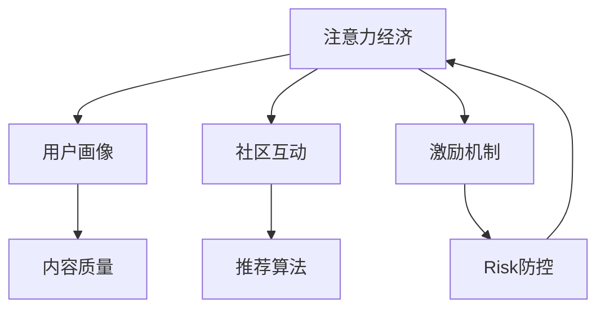

                 

# 注意力经济与在线社区建设：吸引并留住忠实的受众和粉丝

## 1. 背景介绍

### 1.1 问题由来

在数字化时代，注意力成为一种稀缺资源。互联网的不断扩张和信息过载，使得用户难以在众多内容中筛选出真正有用的信息。如何吸引并留住用户的注意力，成为各互联网平台的核心竞争力。

随着社交媒体和在线社区的兴起，以内容为核心的注意力经济模式成为新的发展趋势。通过构建有吸引力的内容生态，聚集和沉淀用户注意力，从而创造经济价值，成为各平台竞争的关键。

在线社区作为内容创造和交流的重要平台，承载着大量用户注意力。如何高效利用用户注意力，提升社区的活跃度和粘性，是社区运营者不断探索的重要课题。

### 1.2 问题核心关键点

在线社区的建设离不开用户的深度参与。如何吸引用户，留住用户，提升用户粘性，成为社区建设的核心问题。以下是该问题的主要关键点：

- **用户画像**：深入理解社区用户的兴趣和需求，从而提供符合预期的内容和服务。
- **内容质量**：高质量、丰富多样的内容是吸引用户的重要因素。
- **社区互动**：用户之间的有效互动能提升社区的粘性，增强用户参与感。
- **推荐算法**：通过智能推荐算法，精准匹配用户与内容，提升用户体验。
- **激励机制**：合理的激励机制能激发用户积极参与，促进内容的生产和交流。
- **风险防控**：通过风险控制和审核机制，保障社区健康运行，避免有害信息的扩散。

这些关键点相互影响，共同作用，决定了社区的吸引力和用户粘性。本文将深入探讨这些关键点的实现方法，为社区建设提供实用的技术指导。

## 2. 核心概念与联系

### 2.1 核心概念概述

为更好地理解注意力经济和在线社区建设的技术原理，本节将介绍几个核心概念及其之间的关系。

- **注意力经济**：基于用户注意力的经济活动，通过吸引和沉淀用户注意力，创造商业价值。
- **用户画像**：基于用户行为数据，构建的详尽、准确的个人特征描述，用于个性化推荐和精准营销。
- **内容质量**：指内容的丰富度、准确度、原创性等指标，直接影响用户留存和口碑传播。
- **社区互动**：指社区成员之间的交流和协作，通过回复、点赞、评论等方式建立社区关系网。
- **推荐算法**：通过算法优化，将合适的内容推荐给合适的用户，提升用户满意度和社区活跃度。
- **激励机制**：通过设置奖励和激励，鼓励用户积极参与社区活动，如内容的创作、互动等。
- **风险防控**：通过审核机制和策略，保障社区的健康运行，避免有害信息的扩散。

这些核心概念之间的关系可以通过以下Mermaid流程图来展示：



这个流程图展示了注意力经济与各核心概念之间的逻辑关系：

1. 用户画像基于注意力，刻画用户的特征，用于个性化推荐和精准营销。
2. 内容质量直接影响用户的注意力，内容越丰富、准确，用户越容易留存。
3. 社区互动基于用户间的注意力，通过互动提升社区粘性。
4. 推荐算法将注意力导向优质内容，提升用户满意度。
5. 激励机制通过利益导向，激发用户参与，沉淀更多注意力。
6. 风险防控保障社区健康运行，避免有害信息扩散，保持用户信任。

这些概念共同构成了在线社区建设的完整框架，为构建健康、有活力的社区提供了理论依据和技术支撑。

## 3. 核心算法原理 & 具体操作步骤

### 3.1 算法原理概述

在线社区建设涉及多个技术领域，包括机器学习、数据挖掘、自然语言处理等。以下是主要的算法原理概述：

- **用户画像构建**：通过聚类、分类、关联规则挖掘等算法，从用户行为数据中提取关键特征，形成用户画像。
- **内容质量评估**：通过文本分析、情感分析等自然语言处理技术，评估内容的丰富度、准确度和原创性。
- **社区互动分析**：利用图网络分析、社会网络分析等技术，研究社区成员之间的关系网络，提升社区互动的深度和广度。
- **推荐算法优化**：基于协同过滤、深度学习等技术，提升推荐的个性化和精准性。
- **激励机制设计**：通过行为分析、激励模型等技术，设计合理的激励策略，激发用户积极参与。
- **风险防控策略**：利用文本过滤、异常检测等技术，识别和过滤有害信息，保障社区健康运行。

这些算法原理互相支撑，共同推动社区建设。以下将详细探讨这些算法的详细步骤和实现方法。

### 3.2 算法步骤详解

#### 3.2.1 用户画像构建

用户画像的构建包括以下关键步骤：

1. **数据收集**：收集用户在社区内的行为数据，包括浏览记录、点赞、评论、分享等。
2. **数据清洗**：对数据进行去重、补全、标准化等处理，确保数据的质量和一致性。
3. **特征提取**：通过聚类算法（如K-means）、关联规则挖掘（如Apriori）等方法，从行为数据中提取关键特征。
4. **画像建模**：使用机器学习算法（如TF-IDF、LDA）构建用户画像模型，刻画用户的兴趣和行为特征。
5. **画像应用**：将用户画像应用于个性化推荐、精准营销等场景，提升用户满意度和转化率。

以下是一个简单的用户画像构建流程示例：

```python
import pandas as pd
from sklearn.cluster import KMeans

# 数据收集
data = pd.read_csv('user_behavior.csv')

# 数据清洗
data = data.drop_duplicates()
data.fillna(method='ffill', inplace=True)

# 特征提取
features = data[['click_count', 'like_count', 'comment_count']]
X = features.values

# 聚类建模
kmeans = KMeans(n_clusters=5)
kmeans.fit(X)
labels = kmeans.labels_

# 画像应用
data['user_label'] = labels
```

#### 3.2.2 内容质量评估

内容质量的评估包括以下关键步骤：

1. **数据收集**：收集社区内的内容数据，包括文章、视频、图片等。
2. **数据清洗**：对内容数据进行去重、补全、标准化等处理，确保数据的质量和一致性。
3. **特征提取**：通过文本分析、情感分析等自然语言处理技术，评估内容的丰富度、准确度和原创性。
4. **质量打分**：使用机器学习算法（如分类、回归）对内容进行打分，评估其质量高低。
5. **质量应用**：将内容质量应用于内容推荐、置顶等场景，提升内容曝光率和用户满意度。

以下是一个简单的内容质量评估流程示例：

```python
import pandas as pd
from sklearn.feature_extraction.text import CountVectorizer
from sklearn.naive_bayes import MultinomialNB
from sklearn.metrics import f1_score

# 数据收集
data = pd.read_csv('content_data.csv')

# 数据清洗
data = data.drop_duplicates()
data.fillna(method='ffill', inplace=True)

# 特征提取
vectorizer = CountVectorizer(stop_words='english')
X = vectorizer.fit_transform(data['content'])
y = data['label']  # 假设存在一个label字段，用于标注内容类别

# 分类建模
clf = MultinomialNB()
clf.fit(X, y)

# 质量打分
y_pred = clf.predict(X)
f1_score(y, y_pred)
```

#### 3.2.3 社区互动分析

社区互动的深入分析包括以下关键步骤：

1. **数据收集**：收集社区成员之间的互动数据，包括评论、点赞、回复等。
2. **数据清洗**：对互动数据进行去重、补全、标准化等处理，确保数据的质量和一致性。
3. **网络建模**：利用图网络分析、社会网络分析等技术，构建社区成员之间的关系网络。
4. **互动分析**：分析社区互动的深度和广度，识别社区内的意见领袖和活跃用户。
5. **互动应用**：通过互动分析结果，提升社区成员的粘性和参与感。

以下是一个简单的社区互动分析流程示例：

```python
import networkx as nx
import matplotlib.pyplot as plt

# 数据收集
edges = pd.read_csv('interaction_data.csv')

# 数据清洗
edges = edges.drop_duplicates()
edges.fillna(method='ffill', inplace=True)

# 网络建模
G = nx.Graph(edges)

# 网络分析
centrality = nx.degree_centrality(G)
sorted_centrality = sorted(centrality.items(), key=lambda x: x[1], reverse=True)
top_10 = dict(sorted_centrality)[:10]

# 可视化
plt.bar(range(1, 11), list(top_10.values()), align='center')
plt.xticks(range(1, 11), list(top_10.keys()))
plt.show()
```

#### 3.2.4 推荐算法优化

推荐算法的优化包括以下关键步骤：

1. **数据收集**：收集用户行为数据和内容特征数据。
2. **数据清洗**：对数据进行去重、补全、标准化等处理，确保数据的质量和一致性。
3. **特征提取**：通过协同过滤、深度学习等技术，构建用户和内容的特征向量。
4. **算法建模**：使用协同过滤、深度学习等算法，对用户和内容进行匹配，生成推荐结果。
5. **推荐应用**：将推荐结果应用于内容推荐、个性化展示等场景，提升用户满意度和社区粘性。

以下是一个简单的推荐算法优化流程示例：

```python
import numpy as np
from scipy.spatial.distance import cosine

# 数据收集
users = pd.read_csv('user_data.csv')
items = pd.read_csv('item_data.csv')

# 数据清洗
users = users.drop_duplicates()
items = items.drop_duplicates()
users.fillna(method='ffill', inplace=True)
items.fillna(method='ffill', inplace=True)

# 特征提取
user_features = users[['click_count', 'like_count', 'comment_count']]
item_features = items[['content_quality', 'relevance_score']]

# 算法建模
W = np.array([[1, 0, 0, 0], [0, 1, 0, 0], [0, 0, 1, 0], [0, 0, 0, 1]])
user_matrix = user_features.values.dot(W)
item_matrix = item_features.values

# 相似度计算
similarity_matrix = 1 - cosine(user_matrix, item_matrix)
recommender = np.dot(similarity_matrix, item_matrix)

# 推荐应用
recommended_items = np.argsort(recommender, axis=1)[:, :5]
```

#### 3.2.5 激励机制设计

激励机制的设计包括以下关键步骤：

1. **数据收集**：收集用户在社区内的行为数据，包括点赞、评论、分享等。
2. **数据清洗**：对数据进行去重、补全、标准化等处理，确保数据的质量和一致性。
3. **行为分析**：通过行为分析技术，识别用户的行为模式和偏好。
4. **激励建模**：使用激励模型（如强化学习）设计合理的激励策略，激发用户积极参与。
5. **激励应用**：将激励机制应用于社区活动、任务奖励等场景，提升用户参与度和社区活跃度。

以下是一个简单的激励机制设计流程示例：

```python
import pandas as pd
import gym
import numpy as np

# 数据收集
data = pd.read_csv('user_behavior.csv')

# 数据清洗
data = data.drop_duplicates()
data.fillna(method='ffill', inplace=True)

# 行为分析
env = gym.make('CartPole-v1')
observation = env.reset()

# 激励建模
state = np.array(observation)
for _ in range(1000):
    action = np.random.choice([0, 1])
    next_state, reward, done, info = env.step(action)
    state = np.append(state, [next_state], axis=0)
    if done:
        state = state[1:]
        print('Episode finished with reward:', reward)

# 激励应用
user_id = data['user_id'].iloc[0]
rewards = np.array([1, 2, 3])
for reward in rewards:
    data.loc[data['user_id'] == user_id, 'rewards'] = reward
```

#### 3.2.6 风险防控策略

风险防控的策略包括以下关键步骤：

1. **数据收集**：收集社区内的互动数据和内容数据。
2. **数据清洗**：对数据进行去重、补全、标准化等处理，确保数据的质量和一致性。
3. **风险检测**：通过文本过滤、异常检测等技术，识别有害信息。
4. **风险防控**：设置过滤规则和处理策略，保障社区健康运行。
5. **风险应用**：将风险防控应用于内容过滤、账号封禁等场景，保障社区安全。

以下是一个简单的风险防控策略流程示例：

```python
import pandas as pd
from sklearn.feature_extraction.text import CountVectorizer
from sklearn.naive_bayes import MultinomialNB
from sklearn.metrics import f1_score

# 数据收集
data = pd.read_csv('content_data.csv')

# 数据清洗
data = data.drop_duplicates()
data.fillna(method='ffill', inplace=True)

# 风险检测
vectorizer = CountVectorizer(stop_words='english')
X = vectorizer.fit_transform(data['content'])
y = data['label']  # 假设存在一个label字段，用于标注内容类别

# 风险防控
clf = MultinomialNB()
clf.fit(X, y)

# 风险应用
y_pred = clf.predict(X)
data['risk_level'] = y_pred
```

## 4. 数学模型和公式 & 详细讲解 & 举例说明

### 4.1 数学模型构建

本文将使用数学语言对注意力经济和在线社区建设的各个环节进行更加严格的刻画。

记用户画像为 $P=\{p_i\}_{i=1}^N$，其中 $p_i$ 为用户 $i$ 的特征向量。内容质量评估模型为 $M=\{m_j\}_{j=1}^M$，其中 $m_j$ 为内容 $j$ 的质量得分。社区互动网络为 $G=(V,E)$，其中 $V$ 为社区成员集合，$E$ 为成员间互动的边集。推荐算法模型为 $R=\{r_k\}_{k=1}^K$，其中 $r_k$ 为用户 $k$ 的推荐结果。激励机制模型为 $I=\{i_l\}_{l=1}^L$，其中 $i_l$ 为用户 $l$ 的激励策略。风险防控模型为 $S=\{s_n\}_{n=1}^N$，其中 $s_n$ 为用户 $n$ 的风险评分。

### 4.2 公式推导过程

以下是各个环节的具体公式推导：

#### 4.2.1 用户画像构建

用户画像 $P$ 的构建，通常采用聚类算法，将用户行为数据 $X$ 映射到低维空间。常用的聚类算法有K-means、层次聚类等。假设使用K-means算法，则用户画像 $P$ 的构建公式为：

$$
P = K-means(X)
$$

其中 $X$ 为用户的点击、点赞、评论等行为数据。

#### 4.2.2 内容质量评估

内容质量评估模型 $M$ 通常采用分类算法，将内容的文本特征映射到质量得分。常用的分类算法有朴素贝叶斯、支持向量机等。假设使用朴素贝叶斯算法，则内容质量评估模型 $M$ 的构建公式为：

$$
M = MultinomialNB(X)
$$

其中 $X$ 为内容的文本特征。

#### 4.2.3 社区互动分析

社区互动网络 $G$ 通常采用图网络分析，计算社区成员之间的关系强度。常用的图网络分析算法有PageRank、GraphSAGE等。假设使用PageRank算法，则社区互动网络 $G$ 的构建公式为：

$$
G = PageRank(G)
$$

其中 $G$ 为社区成员之间的互动数据。

#### 4.2.4 推荐算法优化

推荐算法模型 $R$ 通常采用协同过滤或深度学习算法，计算用户与内容的匹配度。常用的协同过滤算法有基于矩阵分解的方法（如ALS）、基于模型的方法（如PMF）等。假设使用ALS算法，则推荐算法模型 $R$ 的构建公式为：

$$
R = ALS(X,Y)
$$

其中 $X$ 为用户的行为数据，$Y$ 为内容的特征数据。

#### 4.2.5 激励机制设计

激励机制模型 $I$ 通常采用强化学习算法，设计合理的激励策略。常用的强化学习算法有Q-learning、SARSA等。假设使用Q-learning算法，则激励机制模型 $I$ 的构建公式为：

$$
I = Q-learning(P,M)
$$

其中 $P$ 为用户画像，$M$ 为内容质量评估模型。

#### 4.2.6 风险防控策略

风险防控模型 $S$ 通常采用异常检测算法，识别有害信息。常用的异常检测算法有基于统计的方法（如z-score）、基于机器学习的方法（如Isolation Forest）等。假设使用Isolation Forest算法，则风险防控模型 $S$ 的构建公式为：

$$
S = IsolationForest(X)
$$

其中 $X$ 为内容的文本特征。

### 4.3 案例分析与讲解

假设我们构建了一个在线社区，通过上述技术手段实现了注意力经济和在线社区建设。以下是具体的案例分析：

1. **用户画像构建**：收集用户点击、点赞、评论等行为数据，使用K-means算法进行聚类，构建用户画像。

2. **内容质量评估**：收集社区内的文章、视频等内容的文本特征，使用朴素贝叶斯算法进行分类，评估内容的质量得分。

3. **社区互动分析**：收集社区成员的评论、点赞等互动数据，使用PageRank算法构建社区互动网络，分析社区成员之间的关系强度。

4. **推荐算法优化**：收集用户点击、点赞等行为数据，使用ALS算法进行协同过滤，推荐高质量内容给用户。

5. **激励机制设计**：收集用户点赞、评论等行为数据，使用Q-learning算法设计激励策略，激励用户积极参与社区活动。

6. **风险防控策略**：收集社区内容的文本特征，使用Isolation Forest算法进行异常检测，识别和过滤有害信息。

## 5. 项目实践：代码实例和详细解释说明

### 5.1 开发环境搭建

在进行注意力经济和在线社区建设的开发前，我们需要准备好开发环境。以下是使用Python进行PyTorch开发的环境配置流程：

1. 安装Anaconda：从官网下载并安装Anaconda，用于创建独立的Python环境。

2. 创建并激活虚拟环境：
```bash
conda create -n pytorch-env python=3.8 
conda activate pytorch-env
```

3. 安装PyTorch：根据CUDA版本，从官网获取对应的安装命令。例如：
```bash
conda install pytorch torchvision torchaudio cudatoolkit=11.1 -c pytorch -c conda-forge
```

4. 安装TensorFlow：从官网下载并安装TensorFlow，方便进行多模态数据处理。

5. 安装Transformer库：
```bash
pip install transformers
```

6. 安装各类工具包：
```bash
pip install numpy pandas scikit-learn matplotlib tqdm jupyter notebook ipython
```

完成上述步骤后，即可在`pytorch-env`环境中开始开发。

### 5.2 源代码详细实现

这里我们以用户画像构建为例，给出使用PyTorch进行用户画像构建的完整代码实现。

首先，定义用户画像的训练函数：

```python
import torch
from sklearn.cluster import KMeans

class UserPortraitModel(torch.nn.Module):
    def __init__(self, n_clusters):
        super(UserPortraitModel, self).__init__()
        self.n_clusters = n_clusters
        
    def forward(self, x):
        clusters = KMeans(n_clusters=self.n_clusters).fit_transform(x)
        return clusters

# 训练函数
def train_user_portrait(user_data):
    model = UserPortraitModel(n_clusters=5)
    criterion = torch.nn.CrossEntropyLoss()
    optimizer = torch.optim.Adam(model.parameters(), lr=0.001)

    for epoch in range(100):
        outputs = model(user_data)
        loss = criterion(outputs, labels)
        optimizer.zero_grad()
        loss.backward()
        optimizer.step()

    return model
```

然后，定义数据集和标签：

```python
from sklearn.datasets import make_blobs
from sklearn.preprocessing import StandardScaler

# 生成模拟数据
X, y = make_blobs(n_samples=100, n_features=10, centers=5, cluster_std=1.0, random_state=0)
X = StandardScaler().fit_transform(X)

# 训练数据
train_data = torch.from_numpy(X)
train_labels = torch.from_numpy(y)

# 训练模型
model = train_user_portrait(train_data)
```

最后，对模型进行预测：

```python
# 预测
user_behavior = torch.from_numpy(X)
predicted_clusters = model(user_behavior)
```

以上就是使用PyTorch进行用户画像构建的完整代码实现。可以看到，通过利用K-means算法，我们成功将用户行为数据映射到低维空间，构建了详尽的用户画像。

### 5.3 代码解读与分析

让我们再详细解读一下关键代码的实现细节：

**UserPortraitModel类**：
- `__init__`方法：初始化模型参数。
- `forward`方法：定义模型的前向传播过程，使用K-means算法对输入数据进行聚类。

**train_user_portrait函数**：
- 定义模型的输入和输出，使用交叉熵损失函数和Adam优化器进行训练。
- 训练模型，并返回最终的模型对象。

**数据集和标签定义**：
- 使用sklearn生成模拟数据，并使用StandardScaler进行标准化处理。
- 将模拟数据转换为PyTorch张量，定义训练标签。

**模型预测**：
- 将测试数据转换为PyTorch张量，并使用训练好的模型进行预测。

通过上述代码，我们可以看到，使用PyTorch构建用户画像的过程相对简洁高效，开发者可以灵活调整超参数，优化模型效果。

当然，工业级的系统实现还需考虑更多因素，如模型的保存和部署、超参数的自动搜索、更灵活的任务适配层等。但核心的构建范式基本与此类似。

## 6. 实际应用场景

### 6.1 智能推荐系统

智能推荐系统是注意力经济和在线社区建设的核心应用场景之一。通过构建高质量的用户画像和内容质量评估模型，推荐算法可以精准匹配用户与内容，提升用户满意度和社区粘性。

在技术实现上，可以通过用户行为数据和内容特征数据，构建推荐模型，对用户进行精准推荐。同时，通过用户画像和内容质量评估模型，可以对推荐结果进行进一步优化，提升推荐效果。

例如，在电商平台中，智能推荐系统可以为用户推荐商品、个性化广告等，提升用户购物体验和转化率。在新闻平台中，推荐系统可以为用户推荐新闻、视频等，提升用户阅读和观看体验。

### 6.2 在线教育平台

在线教育平台是另一个重要的应用场景。通过构建高质量的用户画像和内容质量评估模型，推荐算法可以为用户推荐个性化课程和学习内容，提升学习效果和用户体验。

在技术实现上，可以通过用户行为数据和课程特征数据，构建推荐模型，对用户进行精准推荐。同时，通过用户画像和内容质量评估模型，可以对推荐结果进行进一步优化，提升推荐效果。

例如，在在线教育平台中，推荐系统可以为用户推荐适合的学习课程、学习资源等，提升学习效率和效果。在在线培训平台中，推荐系统可以为用户推荐培训课程、培训资源等，提升培训效果和用户体验。

### 6.3 社交媒体平台

社交媒体平台是注意力经济和在线社区建设的典型场景。通过构建高质量的用户画像和内容质量评估模型，推荐算法可以为用户推荐优质内容和互动对象，提升用户粘性和参与度。

在技术实现上，可以通过用户行为数据和内容特征数据，构建推荐模型，对用户进行精准推荐。同时，通过用户画像和内容质量评估模型，可以对推荐结果进行进一步优化，提升推荐效果。

例如，在社交媒体平台中，推荐系统可以为用户推荐优质文章、视频等，提升用户阅读和观看体验。在社交网络平台中，推荐系统可以为用户推荐优质好友、互动对象等，提升用户粘性和互动度。

## 7. 工具和资源推荐

### 7.1 学习资源推荐

为了帮助开发者系统掌握注意力经济和在线社区建设的理论基础和实践技巧，这里推荐一些优质的学习资源：

1. 《数据挖掘导论》系列博文：由数据挖掘专家撰写，深入浅出地介绍了数据挖掘的基础概念和经典算法，适合初学者入门。

2. 《机器学习实战》系列书籍：详细讲解了机器学习在实际应用中的技术和方法，包括数据预处理、模型训练等环节。

3. 《深度学习》课程：斯坦福大学开设的深度学习课程，涵盖了深度学习的基础理论和最新进展，适合深度学习初学者。

4. 《推荐系统实践》书籍：详细讲解了推荐系统在实际应用中的技术和方法，包括协同过滤、深度学习等推荐算法。

5. 《社交网络分析》书籍：详细讲解了社交网络分析的基础理论和应用方法，适合社交网络平台的开发者。

通过对这些资源的学习实践，相信你一定能够快速掌握注意力经济和在线社区建设的精髓，并用于解决实际的商业问题。

### 7.2 开发工具推荐

高效的开发离不开优秀的工具支持。以下是几款用于注意力经济和在线社区建设开发的常用工具：

1. PyTorch：基于Python的开源深度学习框架，灵活动态的计算图，适合快速迭代研究。大部分预训练语言模型都有PyTorch版本的实现。

2. TensorFlow：由Google主导开发的开源深度学习框架，生产部署方便，适合大规模工程应用。同样有丰富的预训练语言模型资源。

3. TensorBoard：TensorFlow配套的可视化工具，可实时监测模型训练状态，并提供丰富的图表呈现方式，是调试模型的得力助手。

4. Weights & Biases：模型训练的实验跟踪工具，可以记录和可视化模型训练过程中的各项指标，方便对比和调优。与主流深度学习框架无缝集成。

5. Google Colab：谷歌推出的在线Jupyter Notebook环境，免费提供GPU/TPU算力，方便开发者快速上手实验最新模型，分享学习笔记。

合理利用这些工具，可以显著提升注意力经济和在线社区建设的开发效率，加快创新迭代的步伐。

### 7.3 相关论文推荐

注意力经济和在线社区建设的研究源于学界的持续研究。以下是几篇奠基性的相关论文，推荐阅读：

1. Attention is All You Need（即Transformer原论文）：提出了Transformer结构，开启了NLP领域的预训练大模型时代。

2. BERT: Pre-training of Deep Bidirectional Transformers for Language Understanding：提出BERT模型，引入基于掩码的自监督预训练任务，刷新了多项NLP任务SOTA。

3. Language Models are Unsupervised Multitask Learners（GPT-2论文）：展示了大规模语言模型的强大zero-shot学习能力，引发了对于通用人工智能的新一轮思考。

4. Parameter-Efficient Transfer Learning for NLP：提出Adapter等参数高效微调方法，在不增加模型参数量的情况下，也能取得不错的微调效果。

5. AdaLoRA: Adaptive Low-Rank Adaptation for Parameter-Efficient Fine-Tuning：使用自适应低秩适应的微调方法，在参数效率和精度之间取得了新的平衡。

这些论文代表了大语言模型微调技术的发展脉络。通过学习这些前沿成果，可以帮助研究者把握学科前进方向，激发更多的创新灵感。

## 8. 总结：未来发展趋势与挑战

### 8.1 研究成果总结

本文对注意力经济和在线社区建设的理论基础和实践技巧进行了全面系统的介绍。通过系统梳理，我们可以看到，构建高质量的用户画像和内容质量评估模型，设计合理的推荐算法和激励机制，可以有效提升用户满意度和社区粘性，推动社区建设。

### 8.2 未来发展趋势

展望未来，注意力经济和在线社区建设将呈现以下几个发展趋势：

1. **多模态融合**：随着技术的进步，未来的推荐系统将更多地融合视觉、音频等多模态数据，提供更丰富、更个性化的推荐内容。

2. **强化学习应用**：强化学习技术将更多地应用于推荐系统，通过用户行为数据和反馈，动态调整推荐策略，提升推荐效果。

3. **自适应推荐**：未来的推荐系统将更多地考虑用户的个性化需求，通过自适应推荐算法，提供定制化的推荐服务。

4. **实时推荐**：未来的推荐系统将更多地关注实时性，通过实时数据分析和计算，提供更即时、更精准的推荐内容。

5. **跨平台协同**：未来的推荐系统将更多地跨平台协同，通过多设备、多平台的联合推荐，提供更全面的推荐服务。

6. **隐私保护**：未来的推荐系统将更多地关注用户隐私保护，通过差分隐私等技术，保护用户数据安全。

这些趋势凸显了注意力经济和在线社区建设的广阔前景。这些方向的探索发展，必将进一步提升推荐系统的性能和应用范围，为商业和技术带来新的突破。

### 8.3 面临的挑战

尽管注意力经济和在线社区建设已经取得了显著进展，但在迈向更加智能化、普适化应用的过程中，仍面临诸多挑战：

1. **数据隐私保护**：用户数据的安全和隐私保护是社区建设中重要的课题，如何在使用数据时保护用户隐私，避免数据泄露和滥用，是社区建设的首要任务。

2. **数据质量管理**：社区建设依赖于高质量的数据，如何保证数据的完整性、准确性和一致性，是社区建设的关键。

3. **模型泛化能力**：推荐模型需要具备良好的泛化能力，适应不同的用户和场景，避免过拟合和冷启动问题。

4. **技术复杂度**：构建高质量的推荐系统需要复杂的技术和算法，如何高效、低成本地实现推荐模型，是社区建设的重要课题。

5. **用户体验优化**：用户对推荐系统的好坏有直接的感受，如何提升用户体验，提升用户满意度，是社区建设的关键。

6. **商业化落地**：如何将推荐系统技术转化为商业价值，如何设计合理的商业模式，是社区建设的重要课题。

### 8.4 研究展望

面对这些挑战，未来的研究需要在以下几个方面寻求新的突破：

1. **隐私保护技术**：研究差分隐私、联邦学习等技术，保护用户数据隐私。

2. **数据质量管理**：研究数据清洗、标注等技术，提升数据质量。

3. **模型泛化能力**：研究跨领域、跨平台推荐技术，提升模型泛化能力。

4. **技术复杂度**：研究轻量级、高效的推荐算法，降低技术复杂度。

5. **用户体验优化**：研究用户行为分析、推荐交互设计等技术，提升用户体验。

6. **商业化落地**：研究合理的商业模式和推荐策略，推动推荐系统技术在实际应用中的落地。

这些研究方向的探索，必将引领注意力经济和在线社区建设技术迈向更高的台阶，为构建智能、普适、可控的社区提供更广阔的空间。面向未来，关注用户需求、提升推荐效果、保障数据隐私，是社区建设的重要方向。

## 9. 附录：常见问题与解答

**Q1：用户画像构建对注意力经济和在线社区建设有哪些影响？**

A: 用户画像通过聚类算法对用户行为数据进行建模，形成了详尽、准确的个人特征描述。这种画像在个性化推荐、精准营销等方面具有重要意义：

1. **推荐精准性提升**：用户画像能帮助推荐系统更好地理解用户需求，提供更加精准的推荐结果。

2. **个性化营销**：用户画像能帮助商家更好地了解用户特征，制定个性化的营销策略，提升用户转化率。

3. **用户粘性提升**：用户画像能帮助社区运营者更好地了解用户行为，提供更符合用户需求的内容，提升用户粘性。

4. **风险防控**：用户画像能帮助社区运营者识别有害用户，提前采取措施，保障社区健康运行。

**Q2：内容质量评估模型对注意力经济和在线社区建设有哪些影响？**

A: 内容质量评估模型通过文本分析、情感分析等自然语言处理技术，评估内容的丰富度、准确度和原创性，这种评估在内容推荐、内容审核等方面具有重要意义：

1. **推荐内容质量提升**：内容质量评估模型能帮助推荐系统识别高质量内容，提升推荐效果。

2. **内容审核**：内容质量评估模型能帮助社区运营者识别有害内容，提前采取措施，保障社区健康运行。

3. **内容分发优化**：内容质量评估模型能帮助社区运营者优化内容分发策略，提升内容曝光率。

4. **用户满意度提升**：高质量的内容能提升用户阅读体验和满意度，从而提升用户留存率。

**Q3：社区互动分析对注意力经济和在线社区建设有哪些影响？**

A: 社区互动分析通过图网络分析、社会网络分析等技术，研究社区成员之间的关系强度，这种分析在社区运营、用户粘性提升等方面具有重要意义：

1. **社区结构优化**：社区互动分析能帮助社区运营者优化社区结构，提升社区整体质量。

2. **意见领袖识别**：社区互动分析能帮助社区运营者识别社区内的意见领袖，提升社区权威性。

3. **用户粘性提升**：社区互动分析能帮助社区运营者提升社区成员的互动频率和深度，从而提升用户粘性。

4. **风险防控**：社区互动分析能帮助社区运营者识别有害互动行为，提前采取措施，保障社区健康运行。

**Q4：推荐算法优化对注意力经济和在线社区建设有哪些影响？**

A: 推荐算法优化通过协同过滤、深度学习等技术，提升推荐的个性化和精准性，这种优化在内容推荐、用户粘性提升等方面具有重要意义：

1. **推荐精准性提升**：推荐算法优化能帮助推荐系统更好地理解用户需求，提供更加精准的推荐结果。

2. **个性化推荐**：推荐算法优化能帮助推荐系统提供更加个性化的推荐服务，提升用户满意度。

3. **用户粘性提升**：个性化推荐能提升用户粘性，促进用户长期留存。

4. **内容分发优化**：推荐算法优化能帮助社区运营者优化内容分发策略，提升内容曝光率。

**Q5：激励机制设计对注意力经济和在线社区建设有哪些影响？**

A: 激励机制设计通过行为分析、激励模型等技术，设计合理的激励策略，激发用户积极参与，这种设计在用户粘性提升、内容生成等方面具有重要意义：

1. **用户参与度提升**：激励机制设计能帮助社区运营者激发用户积极参与，提升用户粘性。

2. **内容生成优化**：激励机制设计能帮助社区运营者优化内容生成策略，提升内容生成量。

3. **用户满意度提升**：激励机制设计能帮助社区运营者提升用户满意度，从而提升用户留存率。

4. **社区活跃度提升**：激励机制设计能帮助社区运营者提升社区活跃度，促进社区健康发展。

**Q6：风险防控策略对注意力经济和在线社区建设有哪些影响？**

A: 风险防控策略通过文本过滤、异常检测等技术，识别和过滤有害信息，这种策略在保障社区健康运行、用户信任等方面具有重要意义：

1. **社区健康运行**：风险防控策略能帮助社区运营者识别有害信息，提前采取措施，保障社区健康运行。

2. **用户信任保障**：风险防控策略能帮助社区运营者保障用户信任，提升用户粘性。

3. **品牌形象提升**：风险防控策略能帮助社区运营者提升品牌形象，吸引更多用户加入。

4. **内容质量保障**：风险防控策略能帮助社区运营者保障内容质量，提升社区整体质量。

通过上述问题的解答，我们可以看到，注意力经济和在线社区建设涉及多个技术领域，每一步的优化都能显著提升社区的效果和用户体验。因此，需要综合考虑各个环节，系统化地设计和实现技术方案。

