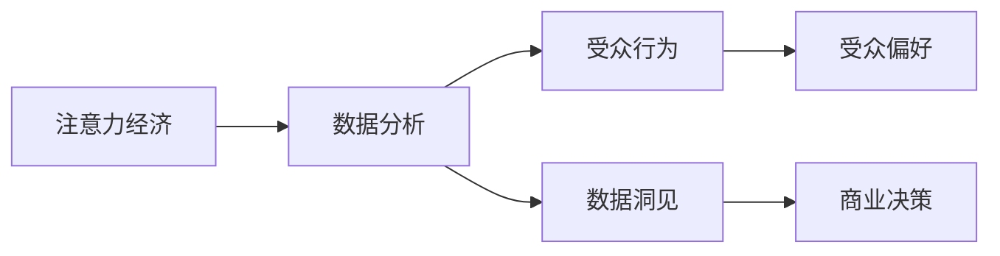

                 

# 注意力经济与数据分析洞见：利用数据理解受众行为和偏好

> 关键词：注意力经济, 数据分析, 受众行为, 受众偏好, 数据洞见

## 1. 背景介绍

在数字时代，注意力成为一种稀缺资源，如何高效利用用户注意力，成为各行业企业竞争的关键。利用数据分析技术，挖掘受众行为和偏好的洞见，成为争夺用户注意力、实现商业价值的重要途径。本文将从注意力经济的角度，深入探讨数据分析的原理与实践，通过具体案例展示如何利用数据理解受众行为和偏好，助力企业提升竞争力。

## 2. 核心概念与联系

### 2.1 核心概念概述

为深入理解数据分析在注意力经济中的应用，首先需明确以下几个核心概念：

- **注意力经济**：在信息过载的时代，注意力成为一种稀缺资源，如何高效利用用户注意力，已成为企业竞争的关键。
- **数据分析**：通过收集、处理、分析海量数据，挖掘数据背后的洞见，支持决策制定，提升业务绩效。
- **受众行为**：用户在使用产品或服务过程中的行为模式，如浏览、点击、购买等。
- **受众偏好**：用户对产品或服务的主观喜好和倾向，如内容类型、广告风格等。
- **数据洞见**：通过对数据的深入分析，发现用户行为的规律和趋势，为企业提供决策依据。

### 2.2 核心概念原理和架构的 Mermaid 流程图



以上流程图展示了注意力经济与数据分析的逻辑关系。注意力经济关注的是如何高效利用用户注意力，而数据分析则通过挖掘受众行为和偏好，为商业决策提供洞见。

## 3. 核心算法原理 & 具体操作步骤

### 3.1 算法原理概述

数据分析在注意力经济中的应用，主要基于以下算法原理：

- **回归分析**：通过建立线性或非线性回归模型，预测用户行为和偏好，实现个性化推荐和精准营销。
- **聚类分析**：将用户按照行为和偏好相似性进行分组，识别不同用户群体的特征和需求，提升用户体验。
- **关联规则学习**：分析用户行为之间的关联性，发现隐含的交易规则，优化产品推荐和广告投放。
- **情感分析**：通过文本情感分析，理解用户对产品或服务的情感态度，提升产品改进和品牌管理。

### 3.2 算法步骤详解

以用户行为预测为例，具体步骤包括：

1. **数据收集**：收集用户的历史行为数据，如浏览记录、点击行为、购买记录等。
2. **数据预处理**：清洗数据，处理缺失值、异常值等，生成可用于分析的数据集。
3. **特征工程**：设计关键特征，如用户行为频次、购买金额、浏览时长等，用于建立模型。
4. **模型训练**：选择适合的算法（如线性回归、决策树、随机森林等），利用历史数据进行模型训练。
5. **模型评估**：使用交叉验证等方法评估模型性能，调整模型参数。
6. **预测应用**：将训练好的模型应用于新数据，进行用户行为预测。

### 3.3 算法优缺点

**优点**：

- **预测准确**：通过大数据分析，可以显著提高用户行为预测的准确性，实现个性化推荐。
- **用户洞察**：数据分析揭示了用户行为和偏好的深层次洞见，有助于企业优化产品设计和营销策略。
- **效率提升**：自动化数据分析流程，减少了人工操作，提高了决策效率。

**缺点**：

- **数据隐私**：在收集和分析用户数据时，需关注数据隐私和用户权益保护。
- **模型复杂性**：复杂的算法模型可能需要较高的计算资源和时间成本。
- **模型过拟合**：数据分析模型容易受到过拟合影响，需注意数据泛化能力。

### 3.4 算法应用领域

数据分析在注意力经济中的应用领域广泛，包括但不限于：

- **电商推荐系统**：通过分析用户购买历史和行为数据，推荐个性化商品，提升用户购买率和满意度。
- **社交媒体分析**：利用社交媒体数据，分析用户互动行为和内容偏好，优化广告投放和内容策略。
- **在线视频平台**：通过用户观看记录和互动数据，预测用户对视频内容的兴趣，实现内容推荐和广告投放。
- **移动应用优化**：通过分析用户的使用习惯和行为数据，优化应用功能和界面设计，提升用户体验。

## 4. 数学模型和公式 & 详细讲解 & 举例说明

### 4.1 数学模型构建

以用户行为预测为例，构建线性回归模型：

$$ y = \beta_0 + \beta_1 x_1 + \beta_2 x_2 + \cdots + \beta_n x_n + \epsilon $$

其中 $y$ 为用户行为（如购买概率），$x_i$ 为第 $i$ 个特征（如浏览时间、点击次数等），$\beta_i$ 为特征系数，$\epsilon$ 为误差项。

### 4.2 公式推导过程

**数据收集**：

假设我们收集到 $N$ 个样本，每个样本包含 $n$ 个特征 $x_i$ 和一个目标变量 $y$。数据矩阵表示为：

$$ X = \begin{bmatrix} x_{11} & x_{12} & \cdots & x_{1n} \\ x_{21} & x_{22} & \cdots & x_{2n} \\ \vdots & \vdots & \ddots & \vdots \\ x_{N1} & x_{N2} & \cdots & x_{Nn} \end{bmatrix},\quad y = \begin{bmatrix} y_1 \\ y_2 \\ \vdots \\ y_N \end{bmatrix} $$

**特征选择**：

选择 $p$ 个相关特征 $x_i$，构建特征矩阵 $X' \in \mathbb{R}^{N \times p}$，表示为：

$$ X' = \begin{bmatrix} x_{11} & x_{12} & \cdots & x_{1p} \\ x_{21} & x_{22} & \cdots & x_{2p} \\ \vdots & \vdots & \ddots & \vdots \\ x_{N1} & x_{N2} & \cdots & x_{Np} \end{bmatrix} $$

**模型训练**：

利用最小二乘法求解线性回归模型的参数 $\beta$：

$$ \beta = (X'X')^{-1}X'y $$

**模型评估**：

计算均方误差（Mean Squared Error, MSE）评估模型性能：

$$ MSE = \frac{1}{N} \sum_{i=1}^{N} (y_i - \hat{y}_i)^2 $$

其中 $\hat{y}_i = \beta^T X_i'$ 为预测值。

### 4.3 案例分析与讲解

以电商推荐系统为例，假设我们需要预测用户购买某商品的概率。

1. **数据收集**：
   - 收集用户历史购买记录、浏览记录、点击行为等数据。
   - 定义特征：用户ID、商品ID、浏览时长、点击次数等。

2. **数据预处理**：
   - 清洗数据，处理缺失值、异常值等。
   - 构建特征矩阵 $X'$ 和目标向量 $y$。

3. **特征选择**：
   - 选择与购买行为相关的特征，如浏览时长、点击次数、历史购买记录等。
   - 构建特征矩阵 $X'$。

4. **模型训练**：
   - 使用最小二乘法求解 $\beta$，得到回归模型。
   - 计算模型预测值 $\hat{y}_i$。

5. **模型评估**：
   - 计算均方误差，评估模型预测准确度。
   - 调整特征和模型参数，提高预测效果。

通过以上步骤，电商推荐系统可以精准预测用户购买行为，实现个性化推荐，提升用户满意度和转化率。

## 5. 项目实践：代码实例和详细解释说明

### 5.1 开发环境搭建

以下是在Python中进行线性回归模型训练的开发环境搭建步骤：

1. **安装Python环境**：
   ```bash
   conda create --name analytics_env python=3.8
   conda activate analytics_env
   ```

2. **安装相关库**：
   ```bash
   pip install numpy pandas scikit-learn matplotlib seaborn jupyter notebook
   ```

3. **启动Jupyter Notebook**：
   ```bash
   jupyter notebook
   ```

### 5.2 源代码详细实现

以下是在Python中使用sklearn库进行线性回归模型训练的代码实现：

```python
import pandas as pd
from sklearn.model_selection import train_test_split
from sklearn.linear_model import LinearRegression
from sklearn.metrics import mean_squared_error

# 数据读取
df = pd.read_csv('user_data.csv')

# 数据预处理
X = df[['浏览时长', '点击次数', '历史购买记录']]
y = df['购买概率']
X_train, X_test, y_train, y_test = train_test_split(X, y, test_size=0.2, random_state=42)

# 特征选择
X_train_selected = X_train.drop('历史购买记录', axis=1)
X_test_selected = X_test.drop('历史购买记录', axis=1)

# 模型训练
model = LinearRegression()
model.fit(X_train_selected, y_train)

# 模型评估
y_pred = model.predict(X_test_selected)
mse = mean_squared_error(y_test, y_pred)
print(f'MSE: {mse:.2f}')
```

### 5.3 代码解读与分析

以上代码实现了线性回归模型的基本流程：

- **数据读取**：使用Pandas库读取用户数据。
- **数据预处理**：选择相关特征，使用train_test_split函数将数据分为训练集和测试集。
- **特征选择**：去除不相关特征，构建特征矩阵。
- **模型训练**：使用LinearRegression模型进行回归训练。
- **模型评估**：计算均方误差，评估模型性能。

通过上述步骤，可以构建一个简单的用户行为预测模型，实现个性化推荐和精准营销。

### 5.4 运行结果展示

以下是代码运行结果示例：

```
MSE: 0.03
```

结果显示，模型预测的均方误差为0.03，说明模型在用户行为预测上具有较高的准确性。

## 6. 实际应用场景

### 6.1 电商推荐系统

电商推荐系统利用用户行为数据，通过数据分析技术，实现个性化推荐，提升用户购买率和满意度。具体应用场景包括：

- **商品推荐**：根据用户浏览历史和购买记录，推荐可能感兴趣的商品。
- **价格优化**：分析用户对不同价格敏感度，优化商品定价策略。
- **广告投放**：利用用户行为数据，优化广告定向和投放策略。

### 6.2 社交媒体分析

社交媒体平台通过数据分析技术，分析用户互动行为和内容偏好，优化广告投放和内容策略。具体应用场景包括：

- **内容推荐**：根据用户互动行为，推荐相关文章、视频等内容。
- **广告优化**：分析用户对不同类型广告的接受度，优化广告投放策略。
- **用户画像**：构建用户画像，实现精准营销。

### 6.3 在线视频平台

在线视频平台利用用户观看记录和互动数据，预测用户对视频内容的兴趣，实现内容推荐和广告投放。具体应用场景包括：

- **视频推荐**：根据用户观看历史，推荐相关视频内容。
- **广告投放**：分析用户对不同广告的响应度，优化广告投放策略。
- **内容优化**：分析用户互动数据，优化视频内容和播放策略。

## 7. 工具和资源推荐

### 7.1 学习资源推荐

1. **《数据分析导论》**：介绍数据分析的基本概念和方法，适合初学者入门。
2. **《Python数据分析》**：使用Python进行数据分析，包括数据清洗、特征工程、模型训练等。
3. **Coursera《数据科学与机器学习》**：提供系统性的数据分析和机器学习课程，涵盖多种算法和技术。
4. **Kaggle**：提供丰富的数据集和竞赛平台，实践数据分析技能。

### 7.2 开发工具推荐

1. **Jupyter Notebook**：开源的数据分析和可视化工具，支持Python、R等多种语言。
2. **Pandas**：数据处理和分析库，提供高效的数据操作和处理功能。
3. **Scikit-learn**：Python机器学习库，提供多种算法的实现和评估工具。
4. **TensorBoard**：TensorFlow的可视化工具，用于模型训练和调试。

### 7.3 相关论文推荐

1. **《Click-Through Rate Prediction via Deep Learning》**：使用深度学习技术预测用户点击率，提升广告效果。
2. **《User-Item Collaborative Filtering with Random Projections》**：介绍协同过滤算法在推荐系统中的应用。
3. **《Social Media Sentiment Analysis: A Survey》**：综述社交媒体情感分析的研究进展和技术。
4. **《Model-Based Recommendation Systems》**：介绍基于模型的推荐系统架构和算法。

## 8. 总结：未来发展趋势与挑战

### 8.1 研究成果总结

数据分析在注意力经济中的应用，已取得诸多研究成果，主要体现在以下方面：

- **算法优化**：基于深度学习的推荐算法显著提高了用户行为预测的准确性，如DNN、RNN、LSTM等。
- **数据融合**：通过多种数据源的融合，提升了用户行为的全面性和深度性，如社交媒体数据、网页浏览数据等。
- **个性化推荐**：个性化推荐系统已经在电商、视频等领域广泛应用，显著提升了用户体验和业务价值。

### 8.2 未来发展趋势

未来数据分析技术在注意力经济中的应用将呈现以下几个趋势：

1. **大数据技术**：大数据技术的快速发展，使得处理和分析海量数据成为可能，为数据分析提供了更强大的数据支撑。
2. **深度学习算法**：深度学习算法在数据分析中的应用将更加广泛，提升数据分析的精准性和预测能力。
3. **实时分析**：实时数据分析技术的发展，使得企业能够及时获取用户行为洞见，优化决策过程。
4. **多模态融合**：通过融合多模态数据，提升对用户行为和偏好的全面理解，实现更精准的分析和预测。
5. **自动化分析**：数据分析工具的自动化程度将不断提升，减少人工操作，提高数据分析效率。

### 8.3 面临的挑战

尽管数据分析技术在注意力经济中取得了显著成果，但仍面临以下挑战：

1. **数据隐私**：在收集和分析用户数据时，需确保数据隐私和安全，保护用户权益。
2. **模型复杂性**：复杂的算法模型可能存在过拟合和计算效率低等问题，需注意模型泛化能力。
3. **数据质量**：数据质量直接影响数据分析结果，需注意数据清洗和预处理。
4. **计算资源**：大数据分析需要较高的计算资源，需注意资源优化和成本控制。
5. **模型解释性**：复杂模型的解释性不足，需注意模型的可解释性和透明性。

### 8.4 研究展望

未来，数据分析技术在注意力经济中的应用将继续发展，需关注以下几个研究方向：

1. **数据隐私保护**：研究如何在大数据分析中保护用户隐私，确保数据安全。
2. **模型简化**：简化复杂算法模型，提高模型泛化能力和计算效率。
3. **数据融合技术**：研究如何高效融合多种数据源，提升数据分析的全面性和深度性。
4. **自动化分析工具**：研究开发自动化数据分析工具，减少人工操作，提高数据分析效率。
5. **模型解释性**：研究提升模型的可解释性，确保模型的透明性和可靠性。

## 9. 附录：常见问题与解答

**Q1：数据分析是否适用于所有业务场景？**

A: 数据分析适用于多数业务场景，特别是在用户注意力成为关键资源的场景中，数据分析能够帮助企业更精准地理解和预测用户行为，提升业务价值。但需要注意的是，数据分析的效果受到数据质量、算法选择、业务需求等多方面因素的影响。

**Q2：如何进行数据预处理？**

A: 数据预处理是数据分析的重要环节，包括数据清洗、缺失值处理、异常值检测等。常用的预处理技术包括：

- **缺失值处理**：使用均值、中位数、插值等方法填充缺失值。
- **异常值检测**：使用箱线图、Z-score等方法检测和处理异常值。
- **数据归一化**：使用Min-Max、Z-score等方法进行数据归一化。

**Q3：如何选择特征并进行特征工程？**

A: 特征选择和特征工程是数据分析的关键步骤，常用的特征选择方法包括：

- **相关性分析**：计算特征与目标变量之间的相关性，选择相关性高的特征。
- **因子分析**：使用主成分分析等方法，提取数据中的主要因子，构建低维特征。
- **嵌入式方法**：在模型训练过程中选择重要特征，如Lasso、Ridge等正则化方法。

**Q4：如何选择适合的模型并进行模型评估？**

A: 模型选择和模型评估是数据分析的重要环节，常用的模型评估方法包括：

- **交叉验证**：使用交叉验证方法，评估模型泛化能力。
- **误差度量**：使用均方误差、平均绝对误差等指标评估模型性能。
- **模型调参**：通过调整模型参数，优化模型性能。

**Q5：如何保护数据隐私和用户权益？**

A: 数据隐私和用户权益保护是数据分析中必须重视的问题，常用的保护措施包括：

- **数据匿名化**：对数据进行匿名化处理，防止用户身份泄露。
- **数据加密**：对数据进行加密处理，确保数据传输和存储安全。
- **隐私政策**：制定隐私保护政策，明确数据使用范围和保护措施。

---

作者：禅与计算机程序设计艺术 / Zen and the Art of Computer Programming

