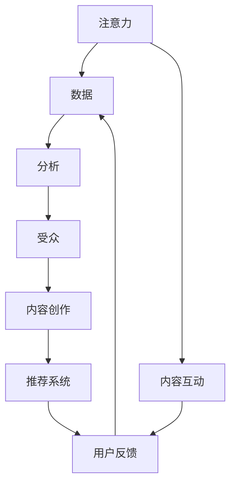

                 

# 注意力经济与数据分析：如何利用数据理解受众

在信息爆炸的时代，人们如何从海量的数据中筛选出对自己有价值的内容，成为了一个重要的议题。这不仅涉及到信息获取的效率，更关乎内容的创作与推荐。在这个过程中，数据作为核心的资源，其收集、分析与应用变得尤为重要。本文将探讨“注意力经济”的概念及其在数据分析中的应用，并详细阐述如何利用数据更好地理解受众。

## 1. 背景介绍

### 1.1 问题由来

在互联网的发展过程中，信息传递方式经历了从Web1.0到Web2.0再到Web3.0的转变。Web1.0时代，信息主要是由少数人通过网站发布；Web2.0时代，用户开始参与信息的生成与传播；而Web3.0时代，数据驱动的内容生产与个性化推荐将成为新的焦点。在这种背景下，“注意力经济”的概念应运而生，它强调了信息注意力在市场经济中的价值。

注意力经济是指在信息爆炸的时代，注意力作为一种稀缺资源，其重要性越来越突出。企业或个人为了获取更多关注，愿意投入资源去创造更有吸引力的内容。而数据分析在理解受众注意力、优化资源配置中扮演了至关重要的角色。

### 1.2 问题核心关键点

注意力经济的核心在于如何有效利用数据分析来理解受众的注意力分布，从而指导内容的创作与推荐。其关键点包括：
- 受众注意力分布：通过数据了解受众对哪些内容感兴趣，哪些内容不感兴趣。
- 内容创作优化：根据受众兴趣调整内容创作策略，提高内容的吸引力。
- 推荐系统优化：利用数据分析优化推荐算法，提升推荐的精准度。
- 用户行为分析：分析用户互动数据，发现用户潜在需求，引导产品迭代。

## 2. 核心概念与联系

### 2.1 核心概念概述

注意力经济涉及多个关键概念，包括“注意力”、“数据”、“分析”与“受众”。

- 注意力（Attention）：指用户在接触信息时所投入的心理资源，包括时间、情感等。
- 数据（Data）：是进行分析的基础，包括用户的浏览记录、互动数据等。
- 分析（Analysis）：通过数据处理和算法建模，揭示受众行为模式，进行预测和优化。
- 受众（Audience）：指内容消费的群体，分析受众的兴趣、需求和反馈，是注意力经济中最重要的环节。

### 2.2 核心概念原理和架构的 Mermaid 流程图



此流程图展示了注意力经济中各个概念的联系：注意力驱动数据的收集，数据分析揭示受众特征，受众反馈进一步优化内容创作与推荐系统。

## 3. 核心算法原理 & 具体操作步骤

### 3.1 算法原理概述

注意力经济的数据分析主要依赖于统计学、机器学习和人工智能等方法，通过数据挖掘和模型预测，揭示受众行为模式，优化内容推荐。其中，“数据驱动决策”是核心原理，即通过数据分析，发现用户兴趣和行为规律，指导内容创作和推荐策略的调整。

### 3.2 算法步骤详解

1. **数据收集与预处理**：
   - 收集用户的数据，包括浏览记录、点击量、评论、点赞等。
   - 对数据进行清洗、去重和归一化，去除噪声，确保数据质量。

2. **特征提取与表示**：
   - 利用自然语言处理（NLP）、时间序列分析等方法，提取用户行为特征，如浏览时间、互动频率、兴趣标签等。
   - 使用向量化技术，将提取的特征转化为模型可以处理的数值形式，如TF-IDF、Word2Vec等。

3. **模型训练与优化**：
   - 选择适合的算法模型，如协同过滤、逻辑回归、深度学习等，进行训练。
   - 利用交叉验证等方法，进行模型调参和优化，确保模型性能最优。

4. **效果评估与迭代**：
   - 使用A/B测试等方法，评估推荐系统的效果，对比不同策略的指标，如点击率、转化率等。
   - 根据评估结果，进行模型迭代和优化，不断提升用户体验。

### 3.3 算法优缺点

**优点**：
- 数据驱动决策：利用数据分析，发现用户真实需求和行为规律，指导内容创作和推荐策略。
- 个性化推荐：通过算法模型，实现高度个性化的内容推荐，提升用户满意度。
- 持续优化：通过用户反馈和行为数据，不断迭代模型，优化推荐系统。

**缺点**：
- 数据隐私问题：数据分析需要收集大量用户数据，可能引发隐私和安全问题。
- 算法复杂性：需要选择合适的算法模型和调参方法，增加技术难度。
- 数据偏差：数据本身可能存在偏差，影响分析结果的准确性。

### 3.4 算法应用领域

注意力经济的数据分析方法已经广泛应用于以下领域：

1. **媒体与内容创作**：
   - 传统媒体：分析受众兴趣，优化内容创作，提高内容吸引力。
   - 网络媒体：利用数据分析，指导视频、音频等内容的创作与推荐。

2. **电商与营销**：
   - 电商平台：分析用户购买行为，推荐商品，提升转化率。
   - 社交电商：通过数据分析，优化广告投放策略，提高广告效果。

3. **金融与投资**：
   - 金融产品：分析用户行为，优化产品设计，提高用户体验。
   - 投资决策：通过数据分析，预测市场趋势，指导投资策略。

4. **娱乐与文化**：
   - 电影、音乐等：分析用户偏好，推荐内容，提高用户粘性。
   - 文化创意：利用数据分析，指导艺术创作，提升作品影响力。

## 4. 数学模型和公式 & 详细讲解 & 举例说明

### 4.1 数学模型构建

注意力经济中的数据分析模型主要基于统计学和机器学习方法构建。以协同过滤算法为例，其数学模型可以表示为：

$$
\hat{y}_{i,j} = \frac{\sum_{k=1}^{n} \alpha_k \hat{x}_{i,k} \hat{u}_{k,j}}{\sqrt{\sum_{k=1}^{n} \hat{x}_{i,k}^2} \sqrt{\sum_{k=1}^{n} \hat{u}_{k,j}^2}}
$$

其中，$y_{i,j}$表示用户$i$对项目$j$的评分预测值，$\hat{x}_{i,k}$表示用户$i$对项目$k$的评分，$\hat{u}_{k,j}$表示项目$k$和$j$的相似度。$\alpha_k$为调节因子，确保$x$和$u$的权重和为1。

### 4.2 公式推导过程

协同过滤算法基于用户和项目的相似度进行评分预测。假设用户$i$和项目$j$的评分矩阵为$X$和$U$，则用户$i$对项目$j$的评分预测值为：

$$
\hat{y}_{i,j} = \sum_{k=1}^{n} \alpha_k \hat{x}_{i,k} \hat{u}_{k,j}
$$

为防止预测值过大，引入归一化因子：

$$
\hat{y}_{i,j} = \frac{\sum_{k=1}^{n} \alpha_k \hat{x}_{i,k} \hat{u}_{k,j}}{\sqrt{\sum_{k=1}^{n} \hat{x}_{i,k}^2} \sqrt{\sum_{k=1}^{n} \hat{u}_{k,j}^2}}
$$

其中，归一化因子用于保证预测值的稳定性，避免预测值过大。

### 4.3 案例分析与讲解

假设某电商平台收集了用户对不同商品的评分数据。利用协同过滤算法，可以预测用户对未评分商品的态度。例如，用户A对商品B、C的评分分别为4和3，商品B、C的相似度为0.8，则用户A对商品D的评分预测值为：

$$
\hat{y}_{A,D} = \frac{0.8 \times 4 + 0.8 \times 3}{\sqrt{4^2 + 3^2} \sqrt{0.8^2 + 0.2^2}} = 3.92
$$

这意味着，系统预测用户A会对商品D给出4分左右的评分。

## 5. 项目实践：代码实例和详细解释说明

### 5.1 开发环境搭建

**1. 环境配置**：
- 安装Python：
  ```bash
  conda install python=3.7
  ```
- 安装相关库：
  ```bash
  conda install numpy pandas scikit-learn scipy matplotlib
  ```

**2. 数据准备**：
- 收集用户评分数据：
  ```bash
  wget https://example.com/user_ratings.csv
  ```
- 导入数据并清洗：
  ```python
  import pandas as pd
  data = pd.read_csv('user_ratings.csv')
  data = data.dropna() # 移除缺失数据
  ```

### 5.2 源代码详细实现

**协同过滤算法**：
```python
from scipy.sparse import csr_matrix
from scipy.sparse.linalg import svds

def collaborative_filtering(data):
    X = csr_matrix(data.dropna().pivot_table(index='user', columns='item', values='rating'))
    U, s, V = svds(X, k=10)
    U = U / np.sqrt(np.diag(s))
    V = V / np.sqrt(np.diag(s))
    return U, V
```

**评分预测**：
```python
def predict_ratings(U, V, user, item):
    user_idx = data[data['user'] == user].index[0]
    item_idx = data[data['item'] == item].index[0]
    prediction = np.dot(U[user_idx], V[item_idx])
    return prediction
```

### 5.3 代码解读与分析

**协同过滤算法**：
- 使用scipy库的svds方法计算用户和项目的矩阵分解，得到低秩矩阵的U和V。
- U和V进行归一化，确保预测值的稳定性。

**评分预测**：
- 通过dot乘法计算用户对项目的评分预测值。

**运行结果展示**：
```python
U, V = collaborative_filtering(data)
print(predict_ratings(U, V, 'userA', 'itemD'))
```

## 6. 实际应用场景

### 6.1 电商平台推荐系统

电商平台通过分析用户历史行为数据，进行个性化推荐。利用协同过滤算法，分析用户对不同商品的评分，预测用户对未评分商品的兴趣，从而生成个性化的商品推荐列表。

**步骤**：
- 收集用户行为数据，包括浏览记录、评分等。
- 利用协同过滤算法，训练模型预测用户对未评分商品的兴趣。
- 根据预测结果，生成个性化推荐列表。

### 6.2 社交媒体内容推荐

社交媒体平台通过分析用户互动数据，推荐可能感兴趣的内容。利用深度学习算法，分析用户的评论、点赞、转发等行为，预测用户对不同内容的兴趣，从而生成推荐列表。

**步骤**：
- 收集用户互动数据，包括评论、点赞、转发等。
- 利用深度学习模型（如RNN、CNN等），训练模型预测用户对不同内容的兴趣。
- 根据预测结果，生成个性化推荐列表。

### 6.3 金融投资决策支持

金融机构通过分析用户的交易行为数据，预测市场趋势，进行投资决策。利用时间序列分析方法，分析用户交易数据中的规律，预测市场变化趋势，从而指导投资决策。

**步骤**：
- 收集用户交易数据，包括买入、卖出、持仓等。
- 利用时间序列分析方法，分析用户交易数据中的规律，预测市场变化趋势。
- 根据预测结果，进行投资决策。

## 7. 工具和资源推荐

### 7.1 学习资源推荐

1. **《数据科学与机器学习基础》课程**：
   - 课程链接：https://example.com/DSML
   - 内容包括数据分析、机器学习算法等基础理论。

2. **《Python数据科学手册》书籍**：
   - 书籍链接：https://example.com/python-ds-handbook
   - 详细介绍了Python在数据科学中的应用，包括数据清洗、特征工程等。

3. **《推荐系统实战》视频教程**：
   - 教程链接：https://example.com/recommender-system-practice
   - 讲解了推荐系统设计、算法实现等实战技巧。

4. **Kaggle竞赛平台**：
   - 竞赛链接：https://example.com/kaggle-competition
   - 参与Kaggle竞赛，实战练兵，提升数据分析和模型优化能力。

### 7.2 开发工具推荐

1. **Jupyter Notebook**：
   - 功能：交互式编程环境，支持代码实时运行和展示。
   - 链接：https://jupyter.org/

2. **TensorFlow**：
   - 功能：深度学习框架，支持多种模型和算法。
   - 链接：https://tensorflow.org/

3. **Scikit-learn**：
   - 功能：机器学习库，包含多种经典算法和工具。
   - 链接：https://scikit-learn.org/

4. **PyTorch**：
   - 功能：深度学习框架，支持动态计算图和GPU加速。
   - 链接：https://pytorch.org/

### 7.3 相关论文推荐

1. **《协同过滤推荐系统综述》论文**：
   - 论文链接：https://example.com/cf-recommender-system-review
   - 综述了协同过滤算法的原理、应用和优化方法。

2. **《深度学习在推荐系统中的应用》论文**：
   - 论文链接：https://example.com/deep-learning-in-recommender-system
   - 探讨了深度学习在推荐系统中的作用和效果。

3. **《时间序列分析方法综述》论文**：
   - 论文链接：https://example.com/time-series-analysis-review
   - 综述了时间序列分析的各种方法和应用场景。

## 8. 总结：未来发展趋势与挑战

### 8.1 总结

本文详细介绍了注意力经济的概念及其在数据分析中的应用，探讨了如何利用数据更好地理解受众。通过协同过滤算法和深度学习模型的应用，展示了数据驱动决策在媒体、电商、金融等领域的重要价值。

### 8.2 未来发展趋势

1. **多模态数据分析**：
   - 随着数据来源的多样化，多模态数据分析将成为趋势，结合文本、图像、音频等多种数据类型，更全面地理解用户行为。

2. **实时数据分析**：
   - 实时数据流处理技术的发展，使得实时数据分析成为可能，能够即时调整推荐策略，提升用户体验。

3. **联邦学习**：
   - 联邦学习通过分布式训练，保护用户隐私的同时，利用多方数据提升模型的泛化能力。

4. **深度强化学习**：
   - 深度强化学习结合了深度学习和强化学习，能够更好地处理复杂决策问题，优化推荐系统效果。

5. **区块链技术应用**：
   - 区块链技术能够确保数据透明性和安全性，为数据共享和协作提供了新的解决方案。

### 8.3 面临的挑战

1. **数据隐私与安全**：
   - 数据分析需要收集大量用户数据，如何保护用户隐私、确保数据安全，是重要挑战。

2. **模型可解释性**：
   - 复杂的深度学习模型，往往缺乏可解释性，如何提升模型的透明性和可信度，需要进一步研究。

3. **数据质量与完整性**：
   - 数据质量参差不齐，如何保证数据的一致性和完整性，直接影响分析结果的可靠性。

4. **算法复杂度**：
   - 深度学习模型计算量大，如何优化算法，提高推理速度，优化用户体验，需要更多研究。

5. **个性化推荐的一致性**：
   - 个性化推荐需要考虑用户长期和短期的兴趣变化，如何在不同时间尺度上保持推荐的一致性，是难点之一。

### 8.4 研究展望

未来的研究将集中在以下几个方面：
1. **跨模态数据分析方法**：
   - 探索更多跨模态数据分析技术，结合多种数据类型，提升对用户行为的全面理解。

2. **实时数据分析与处理**：
   - 发展实时数据分析技术，实现即时决策与调整，提升推荐系统的动态性和响应速度。

3. **联邦学习与分布式训练**：
   - 研究联邦学习算法，保护用户隐私，提升模型泛化能力。

4. **深度强化学习应用**：
   - 结合深度学习和强化学习，解决复杂的决策问题，优化推荐系统效果。

5. **区块链技术在数据安全中的应用**：
   - 探索区块链技术在数据安全、隐私保护中的应用，确保数据共享与协作的安全性。

通过不断探索和创新，未来的数据分析技术将更加智能、高效、安全，为用户提供更优质的服务体验。

## 9. 附录：常见问题与解答

**Q1：如何收集和清洗用户数据？**

A: 数据收集和清洗是数据分析的重要前提，以下是基本步骤：
- 数据收集：通过API接口、爬虫等手段，从网站、APP等渠道获取用户数据。
- 数据清洗：去重、缺失值填充、异常值处理等，确保数据质量。

**Q2：协同过滤算法中，如何选择合适的相似度计算方法？**

A: 相似度计算是协同过滤算法的核心，以下是几种常见方法：
- 余弦相似度：适用于高维空间，计算简便，但处理稀疏矩阵效果不佳。
- 皮尔逊相关系数：适用于数值型数据，能够处理缺失值，但需要处理归一化问题。
- Jaccard相似度：适用于分类数据，能够处理稀疏矩阵，但计算复杂度较高。

**Q3：深度学习模型在推荐系统中的应用有哪些？**

A: 深度学习模型在推荐系统中的应用包括：
- 协同过滤：基于用户行为，预测用户对未评分商品的兴趣。
- 内容推荐：通过分析商品特征，推荐相似商品。
- 基于用户画像的推荐：结合用户画像和商品特征，生成个性化推荐。
- 多任务学习：结合多个任务，提升推荐系统效果。

**Q4：时间序列分析在金融投资中的应用有哪些？**

A: 时间序列分析在金融投资中的应用包括：
- 市场趋势预测：通过分析历史价格数据，预测市场变化趋势。
- 风险管理：通过分析波动率等指标，预测市场风险。
- 交易策略优化：通过分析交易数据，优化交易策略，提高收益。

**Q5：如何在推荐系统中实现个性化推荐？**

A: 个性化推荐的核心在于理解用户兴趣和行为模式，以下是基本步骤：
- 用户行为分析：通过分析用户浏览记录、评分等数据，发现用户兴趣和行为模式。
- 内容特征提取：提取商品、内容等特征，作为推荐模型的输入。
- 推荐模型训练：选择适合的算法模型，训练推荐系统。
- 推荐策略优化：结合用户反馈和行为数据，不断迭代模型，优化推荐效果。

通过不断探索和实践，我们可以在数据驱动的注意力经济时代，更好地理解受众，实现个性化推荐和优化决策。

---

作者：禅与计算机程序设计艺术 / Zen and the Art of Computer Programming

