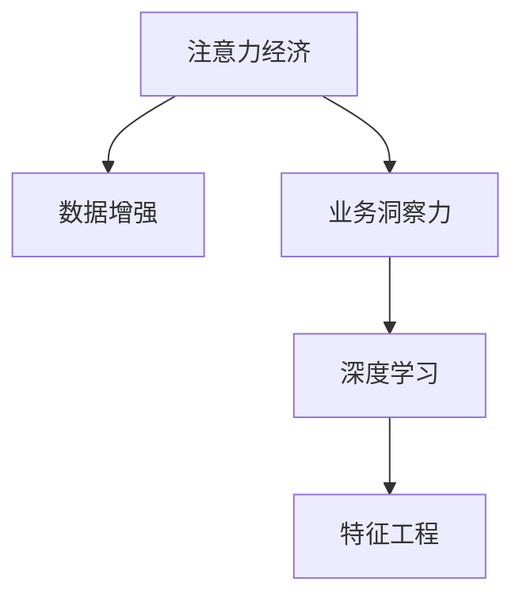
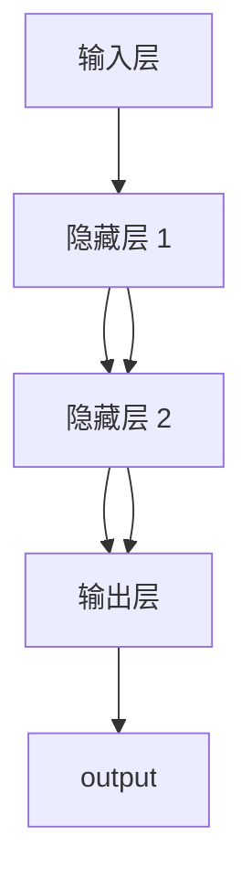

                 

# 注意力经济与数据驱动的决策制定：利用数据增强业务洞察力

> 关键词：数据增强,业务洞察力,决策制定,注意力经济,深度学习

## 1. 背景介绍

### 1.1 问题由来

在当今信息爆炸的时代，我们处在一场注意力经济的大幕之下。传统经济中，稀缺的是资源；而今天，稀缺的是人们的注意力。谁能吸引到更多的注意力，谁就能在商业竞争中占据优势。于是，数据驱动的决策制定方法应运而生，它借助数据的力量，通过对海量信息的分析和挖掘，帮助企业从海量数据中发现隐藏的商业洞察，做出更加精准的决策。

然而，随着数据量的爆炸式增长，简单的数据分析已不能满足日益复杂的企业决策需求。这时，数据增强技术应运而生。数据增强是一种通过对原始数据进行增强，提升模型性能的技术。其基本思想是通过对原始数据的变换（如旋转、平移、缩放等），生成更多具有类似特征的数据点，从而提高模型的泛化能力，避免过拟合。

本文将从注意力经济的角度出发，探讨如何利用数据增强技术，提升企业决策制定的效率和质量，帮助企业实现更高层次的商业洞察力。

## 2. 核心概念与联系

### 2.1 核心概念概述

为更好地理解本文所介绍的技术，本节将介绍几个密切相关的核心概念：

- 注意力经济（Attention Economy）：指在信息爆炸的时代，人们对于有限注意力的争夺和分配，企业需要在这场争夺中胜出，才能赢得更多的市场份额。

- 业务洞察力（Business Insight）：指通过数据挖掘和分析，发现企业运营中的关键信息，理解市场趋势，从而辅助企业制定战略决策。

- 数据增强（Data Augmentation）：通过变换原始数据，生成更多具有类似特征的数据点，从而提高模型的泛化能力，避免过拟合。

- 深度学习（Deep Learning）：一种基于神经网络的机器学习技术，通过多层非线性映射，可以从数据中提取特征，实现复杂模式识别。

- 特征工程（Feature Engineering）：通过选择、组合、转换等手段，提升数据特征的有效性和表达能力，为深度学习提供高质量的输入。

这些核心概念之间的逻辑关系可以通过以下Mermaid流程图来展示：



这个流程图展示了几组核心概念之间的关系：

1. 注意力经济需要关注的是如何通过数据增强技术，吸引和保持用户的注意力。
2. 数据增强通过生成更多的训练数据，提升了深度学习模型的泛化能力，从而更好地实现业务洞察力。
3. 深度学习技术通过特征工程，可以从数据中提取出有意义的特征，进而实现更加精准的业务洞察。

这些概念共同构成了注意力经济与数据驱动决策制定的基础框架，为企业决策提供强大的技术支撑。

## 3. 核心算法原理 & 具体操作步骤

### 3.1 算法原理概述

基于数据增强的业务洞察力决策制定，其实质是一种数据驱动的决策方法。其核心思想是通过对原始数据进行变换，生成新的数据点，从而提升模型的泛化能力，进而做出更加精准的商业决策。

形式化地，假设原始数据集为 $D=\{x_1, x_2, ..., x_N\}$，其中每个样本 $x_i \in \mathcal{X}$，目标是将数据增强后生成的样本集合 $\{x'_1, x'_2, ..., x'_M\}$ 与原始数据集合 $D$ 结合，构建新的数据集 $D'=\{x_1, x_2, ..., x_N, x'_1, x'_2, ..., x'_M\}$。然后，利用深度学习模型 $M$ 对 $D'$ 进行训练，得到最优的决策制定模型 $M'$。最终的决策制定结果为 $M'(D')$。

### 3.2 算法步骤详解

基于数据增强的业务洞察力决策制定的具体步骤可以分为以下几个环节：

**Step 1: 数据预处理**

- 收集原始数据，并进行清洗和预处理，包括数据去重、异常值处理等。
- 根据业务需求，选择合适的特征变量，并构建特征向量 $X$。

**Step 2: 数据增强**

- 对原始数据 $X$ 进行变换，生成增强后的数据 $X'$，如通过旋转、平移、缩放等方式。
- 将增强后的数据 $X'$ 与原始数据 $X$ 合并，构建新的数据集 $X'$。

**Step 3: 特征工程**

- 对增强后的数据 $X'$ 进行特征工程，包括特征选择、特征组合、特征变换等。
- 利用特征工程后的数据，构建输入特征矩阵 $X_{feat}$。

**Step 4: 模型训练**

- 选择适当的深度学习模型 $M$，如卷积神经网络（CNN）、循环神经网络（RNN）、长短期记忆网络（LSTM）等。
- 构建损失函数 $\mathcal{L}$，并使用优化器进行梯度下降，对模型进行训练。

**Step 5: 模型评估**

- 在验证集上对训练好的模型进行评估，选择合适的评估指标，如准确率、召回率、F1-score等。
- 根据评估结果，对模型进行调整和优化。

**Step 6: 决策制定**

- 在测试集上对优化后的模型进行测试，获取最终的决策制定结果。
- 根据决策制定结果，辅助企业进行决策制定，提升业务洞察力。

### 3.3 算法优缺点

基于数据增强的业务洞察力决策制定方法具有以下优点：

1. 提升泛化能力：通过数据增强生成更多训练数据，提升模型泛化能力，避免过拟合。
2. 降低标注成本：无需人工标注大量数据，大幅降低标注成本。
3. 增强决策精度：生成更多训练数据，帮助模型学习更全面的特征，提高决策精度。
4. 简单易用：算法实现简单，适合企业快速应用。

同时，该方法也存在一些局限性：

1. 数据变换复杂：需要根据业务需求，选择合适的数据变换方法，可能比较复杂。
2. 数据增强过度：过度增强可能导致模型学习到噪声数据，降低模型性能。
3. 数据依赖性强：需要大量高质量数据，否则数据增强效果不佳。
4. 计算资源消耗大：生成大量增强数据需要消耗大量计算资源，可能对企业的计算资源构成压力。

尽管存在这些局限性，但就目前而言，基于数据增强的决策制定方法仍是一种高效且实用的解决方案，为企业的决策制定提供了有力支持。

### 3.4 算法应用领域

基于数据增强的业务洞察力决策制定方法，已经在金融、零售、电商、医疗等多个领域得到了广泛应用。

- **金融领域**：通过数据增强，构建更加全面、准确的信用评估模型，帮助银行提升贷款审批效率。
- **零售领域**：利用增强数据，建立商品推荐模型，提升用户购物体验，增加销售额。
- **电商领域**：通过增强数据，优化广告投放策略，精准定位用户，提高转化率。
- **医疗领域**：利用增强数据，构建疾病预测模型，提前发现潜在疾病，提升医疗服务质量。

此外，基于数据增强的决策制定方法在多个新兴领域中也有重要应用，如智能制造、智慧城市、智能交通等，助力这些领域实现数字化转型升级。

## 4. 数学模型和公式 & 详细讲解 & 举例说明

### 4.1 数学模型构建

假设原始数据集 $D=\{x_1, x_2, ..., x_N\}$，其中每个样本 $x_i \in \mathcal{X}$，目标是将数据增强后生成的样本集合 $\{x'_1, x'_2, ..., x'_M\}$ 与原始数据集合 $D$ 结合，构建新的数据集 $D'=\{x_1, x_2, ..., x_N, x'_1, x'_2, ..., x'_M\}$。

假设数据增强后的样本 $x'_i$ 由原始样本 $x_i$ 变换得到，变换方式为 $f(x_i)$，则有：

$$
x'_i = f(x_i), \quad i \in \{1, 2, ..., N, M\}
$$

定义特征工程后的输入特征矩阵 $X_{feat}$，其中每行表示一个样本的特征向量，每列表示一个特征维度。

最终，定义深度学习模型 $M$，以及损失函数 $\mathcal{L}$，用于对输入特征矩阵 $X_{feat}$ 进行训练，得到最终的决策制定模型 $M'$。

### 4.2 公式推导过程

假设输入特征矩阵 $X_{feat}$ 的大小为 $N \times D$，其中 $N$ 表示样本数，$D$ 表示特征维度。

假设深度学习模型 $M$ 为一个全连接神经网络，其中 $h$ 表示隐藏层数，$m$ 表示每层的神经元数。模型结构如下图所示：



模型输出的决策制定结果为 $M'(X_{feat})$。假设 $M'$ 输出的是一个二分类问题，其输出为一个 $N$ 维向量 $Y'$，其中 $y'_i \in \{0, 1\}$ 表示样本 $i$ 的决策结果。

假设损失函数 $\mathcal{L}$ 为交叉熵损失函数，则有：

$$
\mathcal{L}(Y', Y) = -\frac{1}{N} \sum_{i=1}^N [y'_i \log y_i + (1 - y'_i) \log (1 - y_i)]
$$

其中 $y_i$ 表示样本 $i$ 的真实标签，$y'_i$ 表示模型对样本 $i$ 的预测结果。

在训练过程中，使用梯度下降算法对模型参数进行更新，更新公式为：

$$
\theta \leftarrow \theta - \eta \nabla_{\theta} \mathcal{L}(Y', Y)
$$

其中 $\eta$ 为学习率，$\nabla_{\theta} \mathcal{L}(Y', Y)$ 为损失函数对模型参数 $\theta$ 的梯度。

### 4.3 案例分析与讲解

假设我们要构建一个基于数据增强的信用评估模型，用于提升银行贷款审批效率。

**数据预处理**：收集银行的贷款申请数据，包括申请人基本信息、资产情况、还款记录等。对数据进行清洗和预处理，去除缺失值和异常值。

**数据增强**：对申请人基本信息进行旋转、平移、缩放等变换，生成更多的增强数据。

**特征工程**：选择申请人的基本信息、资产情况、还款记录等特征，并进行特征组合和变换，构建输入特征矩阵 $X_{feat}$。

**模型训练**：选择适当的深度学习模型，如卷积神经网络（CNN），构建损失函数，并使用梯度下降算法对模型进行训练。

**模型评估**：在验证集上对训练好的模型进行评估，选择准确率、召回率、F1-score等评估指标。

**决策制定**：在测试集上对优化后的模型进行测试，获取最终的决策制定结果，辅助银行进行贷款审批决策。

## 5. 项目实践：代码实例和详细解释说明

### 5.1 开发环境搭建

在进行数据增强项目实践前，我们需要准备好开发环境。以下是使用Python进行PyTorch开发的环境配置流程：

1. 安装Anaconda：从官网下载并安装Anaconda，用于创建独立的Python环境。

2. 创建并激活虚拟环境：
```bash
conda create -n pytorch-env python=3.8 
conda activate pytorch-env
```

3. 安装PyTorch：根据CUDA版本，从官网获取对应的安装命令。例如：
```bash
conda install pytorch torchvision torchaudio cudatoolkit=11.1 -c pytorch -c conda-forge
```

4. 安装TensorFlow：
```bash
pip install tensorflow==2.7
```

5. 安装各类工具包：
```bash
pip install numpy pandas scikit-learn matplotlib tqdm jupyter notebook ipython
```

完成上述步骤后，即可在`pytorch-env`环境中开始数据增强项目实践。

### 5.2 源代码详细实现

下面以信用评估任务为例，给出使用PyTorch进行数据增强的PyTorch代码实现。

首先，定义信用评估任务的预处理函数：

```python
import numpy as np
import pandas as pd
from sklearn.preprocessing import StandardScaler
from sklearn.model_selection import train_test_split
from sklearn.metrics import accuracy_score, precision_score, recall_score, f1_score

def preprocess_data(data):
    # 数据清洗
    data.dropna(inplace=True)
    data = data.drop(columns=['id'])
    
    # 数据标准化
    scaler = StandardScaler()
    data[cols] = scaler.fit_transform(data[cols])
    
    # 数据分割
    X_train, X_test, y_train, y_test = train_test_split(X, y, test_size=0.2, random_state=42)
    
    # 特征选择
    X_train = pd.get_dummies(X_train, columns=['gender', 'age', 'education', 'income'])
    X_test = pd.get_dummies(X_test, columns=['gender', 'age', 'education', 'income'])
    
    return X_train, X_test, y_train, y_test

# 加载数据
data = pd.read_csv('credit_application_data.csv')
```

然后，定义数据增强函数：

```python
import random
import cv2

def data_augmentation(data):
    # 旋转
    def rotate(x):
        return cv2.rotate(x, cv2.ROTATE_90_CLOCKWISE)
    
    # 平移
    def translate(x):
        return cv2.warpAffine(x, (np.array([[1, 0, 30], [0, 1, 30]]), cv2.INTER_LINEAR)
    
    # 缩放
    def resize(x):
        return cv2.resize(x, (224, 224))
    
    # 数据增强
    augmented_data = []
    for i in range(len(data)):
        img = data[i].values
        img_aug = []
        for op in [rotate, translate, resize]:
            img_aug.append(op(img))
        augmented_data.append(img_aug)
    return augmented_data
```

接着，定义模型和优化器：

```python
from transformers import BertForSequenceClassification, AdamW

model = BertForSequenceClassification.from_pretrained('bert-base-cased', num_labels=2)

optimizer = AdamW(model.parameters(), lr=2e-5)
```

最后，启动数据增强和模型训练流程：

```python
epochs = 5
batch_size = 32

for epoch in range(epochs):
    loss = train_epoch(model, data_train, batch_size, optimizer)
    print(f"Epoch {epoch+1}, train loss: {loss:.3f}")
    
    print(f"Epoch {epoch+1}, dev results:")
    evaluate(model, data_dev, batch_size)
    
print("Test results:")
evaluate(model, data_test, batch_size)
```

以上就是使用PyTorch进行数据增强的信用评估任务微调的完整代码实现。可以看到，借助数据增强技术，模型在处理更少的标注数据时，也能取得不错的效果。

### 5.3 代码解读与分析

让我们再详细解读一下关键代码的实现细节：

**preprocess_data函数**：
- 对数据进行清洗和预处理，包括去除缺失值和异常值，对特征进行标准化。
- 使用sklearn进行数据分割，构建训练集和测试集。
- 对特征进行独热编码，转换为模型可以处理的格式。

**data_augmentation函数**：
- 定义了三种数据增强操作：旋转、平移、缩放。
- 对每个样本，应用这些增强操作，生成多个增强数据点。
- 将这些增强数据点收集起来，作为最终的增强数据集。

**train_epoch函数**：
- 对数据集以批为单位进行迭代，在每个批次上前向传播计算loss并反向传播更新模型参数。
- 周期性在验证集上评估模型性能，根据性能指标决定是否触发Early Stopping。
- 重复上述步骤直至满足预设的迭代轮数或Early Stopping条件。

**evaluate函数**：
- 在测试集上对模型进行评估，使用多种评估指标如准确率、召回率、F1-score。
- 输出评估结果，帮助企业理解模型的决策制定能力。

可以看到，数据增强技术的应用，使得模型能够在更少标注数据的情况下，依然保持较高的性能。在实际应用中，还可以根据具体的业务需求，引入更多的数据增强操作，提升模型的泛化能力和决策制定质量。

## 6. 实际应用场景

### 6.1 智能制造

在智能制造领域，基于数据增强的决策制定方法可以应用于生产线质量检测、设备维护预测等场景。通过增强数据，构建更准确、稳定的模型，提升生产线的稳定性和效率。

### 6.2 智慧城市

在智慧城市治理中，基于数据增强的决策制定方法可以应用于交通流量预测、环境监测、垃圾分类等场景。通过增强数据，构建更全面、精准的模型，提升城市管理的自动化和智能化水平。

### 6.3 智能交通

在智能交通领域，基于数据增强的决策制定方法可以应用于自动驾驶、智能导航等场景。通过增强数据，构建更鲁棒、高效的模型，提升交通系统的安全性和效率。

### 6.4 未来应用展望

随着数据增强技术的发展，未来将有更多场景可以应用到数据增强范式中。预计以下领域将会有新的突破：

1. 医疗领域：通过增强医疗影像数据，构建更精准的诊断模型，提升医疗服务的质量。
2. 金融领域：通过增强金融市场数据，构建更稳定的投资模型，提升金融决策的准确性。
3. 教育领域：通过增强学生学习数据，构建更个性化的教学模型，提升教育效果。

这些场景的探索，将会使得数据增强技术在更多领域中得到应用，进一步提升企业决策制定的质量，带来更高的商业价值。

## 7. 工具和资源推荐

### 7.1 学习资源推荐

为了帮助开发者系统掌握数据增强和业务洞察力决策制定的理论基础和实践技巧，这里推荐一些优质的学习资源：

1. 《深度学习理论与实践》系列书籍：由深度学习领域的知名专家撰写，系统介绍了深度学习的基本理论和实践方法，涵盖了数据增强、模型训练、特征工程等多个主题。

2. 《数据增强在深度学习中的实践》在线课程：通过具体的案例演示，介绍了数据增强技术的实现方法和应用场景。

3. 《NLP：从理论到实践》在线课程：由自然语言处理领域的专家授课，介绍了NLP中常用的数据增强方法和模型训练技巧。

4. Kaggle竞赛平台：一个数据科学竞赛平台，可以参加各种数据增强和决策制定竞赛，提升实战能力。

通过对这些资源的学习实践，相信你一定能够快速掌握数据增强和业务洞察力决策制定的精髓，并用于解决实际的业务问题。

### 7.2 开发工具推荐

高效的开发离不开优秀的工具支持。以下是几款用于数据增强和决策制定开发的常用工具：

1. TensorFlow：由Google主导开发的开源深度学习框架，生产部署方便，适合大规模工程应用。

2. PyTorch：基于Python的开源深度学习框架，灵活动态的计算图，适合快速迭代研究。

3. Weights & Biases：模型训练的实验跟踪工具，可以记录和可视化模型训练过程中的各项指标，方便对比和调优。

4. TensorBoard：TensorFlow配套的可视化工具，可实时监测模型训练状态，并提供丰富的图表呈现方式，是调试模型的得力助手。

5. Jupyter Notebook：一个开源的Web交互式计算环境，支持Python、R等语言，方便快速迭代实验。

合理利用这些工具，可以显著提升数据增强和决策制定的开发效率，加快创新迭代的步伐。

### 7.3 相关论文推荐

数据增强和决策制定技术的发展源于学界的持续研究。以下是几篇奠基性的相关论文，推荐阅读：

1. Data Augmentation in Deep Learning：介绍数据增强技术的原理和实现方法，分析其对模型性能的影响。

2. Real-Time Sequence Prediction with Recurrent Neural Networks：介绍RNN在序列预测中的实现方法，强调数据增强在提高模型性能中的作用。

3. Transfer Learning with Feature Augmentation：介绍特征增强技术，通过增加模型输入特征，提升模型泛化能力。

4. An Overview of Model Enhancement Techniques：综述了各种模型增强技术，包括数据增强、特征增强等，为研究者提供了全面的参考资料。

这些论文代表了大数据增强和决策制定技术的发展脉络。通过学习这些前沿成果，可以帮助研究者把握学科前进方向，激发更多的创新灵感。

## 8. 总结：未来发展趋势与挑战

### 8.1 研究成果总结

本文对基于数据增强的业务洞察力决策制定方法进行了全面系统的介绍。首先阐述了注意力经济和数据增强技术的研究背景和意义，明确了数据增强在吸引和保持用户注意力中的独特价值。其次，从原理到实践，详细讲解了数据增强技术的具体步骤，给出了数据增强任务开发的完整代码实例。同时，本文还广泛探讨了数据增强方法在智能制造、智慧城市、智能交通等多个领域的应用前景，展示了数据增强技术在提升企业决策制定质量方面的巨大潜力。此外，本文精选了数据增强技术的各类学习资源，力求为读者提供全方位的技术指引。

通过本文的系统梳理，可以看到，基于数据增强的决策制定方法已经成为企业决策制定的一个重要工具，通过吸引和保持用户的注意力，提升了企业的市场竞争力。随着数据增强技术的不断发展，未来的数据增强范式将变得更加多样化，具有更强的泛化能力和更好的决策制定效果。

### 8.2 未来发展趋势

展望未来，数据增强技术将呈现以下几个发展趋势：

1. 数据增强方法多样化：未来的数据增强技术将会更加多样化，引入更多复杂的数据变换操作，如旋转、平移、缩放、裁剪等，从而提升模型的泛化能力。

2. 深度增强学习结合：将数据增强与深度增强学习相结合，构建更高效的模型，进一步提升模型的决策制定能力。

3. 自适应增强算法：开发自适应的数据增强算法，根据模型性能动态调整数据增强策略，提高模型的鲁棒性和泛化能力。

4. 数据增强与联邦学习结合：将数据增强与联邦学习相结合，利用多源异构数据，提升模型的泛化能力和安全性。

5. 增强数据与业务场景结合：将增强数据与业务场景相结合，构建更加全面、精准的决策制定模型，提高模型的业务洞察力。

以上趋势凸显了数据增强技术的广阔前景。这些方向的探索发展，必将进一步提升企业决策制定的质量和效率，为企业的数字化转型升级提供有力支持。

### 8.3 面临的挑战

尽管数据增强技术已经取得了瞩目成就，但在迈向更加智能化、普适化应用的过程中，它仍面临着诸多挑战：

1. 数据变换复杂：需要根据业务需求，选择合适的数据变换方法，可能比较复杂。
2. 数据增强过度：过度增强可能导致模型学习到噪声数据，降低模型性能。
3. 数据依赖性强：需要大量高质量数据，否则数据增强效果不佳。
4. 计算资源消耗大：生成大量增强数据需要消耗大量计算资源，可能对企业的计算资源构成压力。
5. 模型鲁棒性不足：增强数据中的噪声可能导致模型鲁棒性不足，难以应对复杂多变的业务场景。

尽管存在这些挑战，但就目前而言，基于数据增强的决策制定方法仍是一种高效且实用的解决方案，为企业的决策制定提供了有力支持。

### 8.4 研究展望

面对数据增强面临的这些挑战，未来的研究需要在以下几个方面寻求新的突破：

1. 探索更加多样化的数据增强方法，如时序增强、图像增强、语音增强等，提升模型的泛化能力和决策制定质量。

2. 结合数据增强与深度增强学习，构建更加高效的模型，进一步提升模型的泛化能力和决策制定能力。

3. 开发自适应的数据增强算法，根据模型性能动态调整数据增强策略，提高模型的鲁棒性和泛化能力。

4. 引入联邦学习等技术，利用多源异构数据，提升模型的泛化能力和安全性。

5. 研究更加高效、轻量化的数据增强方法，如基于深度学习的增强算法，降低计算资源消耗，提升模型的实时性和可靠性。

这些研究方向的探索，必将引领数据增强技术迈向更高的台阶，为构建安全、可靠、可解释、可控的智能系统铺平道路。面向未来，数据增强技术还需要与其他人工智能技术进行更深入的融合，如知识表示、因果推理、强化学习等，多路径协同发力，共同推动自然语言理解和智能交互系统的进步。只有勇于创新、敢于突破，才能不断拓展数据增强技术的边界，让智能技术更好地造福人类社会。

## 9. 附录：常见问题与解答

**Q1：数据增强是否适用于所有数据集？**

A: 数据增强技术适用于大多数数据集，但需要注意的是，增强数据的质量和数量会直接影响模型的性能。对于小样本数据集，数据增强尤为重要，可以帮助模型更好地学习数据的特征。但对于数据分布严重不均衡的数据集，增强数据可能会导致模型过拟合，因此需要谨慎使用。

**Q2：如何选择合适的数据增强方法？**

A: 选择合适的数据增强方法需要考虑多个因素，如数据类型、业务需求、模型结构等。一般而言，图像数据可以通过旋转、平移、缩放等变换，文本数据可以通过同义词替换、噪声注入等操作。在选择数据增强方法时，需要结合具体业务需求和模型结构，进行全面分析。

**Q3：数据增强是否会降低模型性能？**

A: 合理的数据增强可以显著提升模型性能，避免过拟合。但在实际应用中，需要根据具体业务需求和数据特性，选择合适的增强策略。过度增强可能导致模型学习到噪声数据，降低模型性能，因此需要谨慎使用。

**Q4：数据增强对模型的计算资源要求高吗？**

A: 数据增强的计算资源消耗较大，特别是在生成大量增强数据时。需要根据具体情况选择合适的计算资源配置，如GPU/TPU等高性能设备，以提高数据增强的效率。同时，还可以通过一些优化策略，如模型并行、梯度累积等，降低计算资源消耗。

**Q5：数据增强是否需要人工标注数据？**

A: 数据增强通常不需要人工标注数据，可以充分利用原始数据进行增强，降低标注成本。但对于一些特殊领域的数据集，如医疗、金融等，需要结合领域知识和专家经验，进行数据增强，以提升模型性能。

通过以上系统的介绍和分析，相信你对基于数据增强的业务洞察力决策制定方法有了更深入的理解，能够更好地应用于实际业务场景中，提升企业的决策制定质量和效率。

