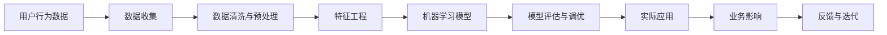

                 

# 注意力经济与数据驱动的决策：如何利用数据理解受众和市场

> 关键词：注意力经济, 数据驱动决策, 用户行为分析, 市场营销, 个性化推荐, 机器学习

## 1. 背景介绍

在数字化时代，随着信息技术的飞速发展，全球市场已从“产品经济”逐步转向“注意力经济”。传统的“产品经济”时代，商品供不应求，“物以稀为贵”。但到了“注意力经济”时代，信息过载、注意力稀缺成为常态，消费者选择的范围和决策方式发生了根本性变化。从“买了再说”变为“看了再买”，从“批量购买”变为“个性定制”，从“高性价比”变为“高性能”，信息传播方式和用户行为模式的转变，带来了全新的市场机会和竞争挑战。

如何在这场数据驱动的“注意力经济”中，准确理解用户需求、把握市场趋势、制定有效策略，已成为企业在数字时代的重要课题。本文将系统探讨如何利用数据挖掘和机器学习技术，理解受众和市场，制定数据驱动的决策，以期为企业家和数据科学家提供思路和方法。

## 2. 核心概念与联系

### 2.1 核心概念概述

- **注意力经济**：指信息时代，信息或注意力成为稀缺资源，产品或服务的价值很大程度上取决于它们获取或争夺用户注意力的能力。
- **数据驱动决策**：指基于数据而非直觉或经验，通过定量分析方法制定业务决策的过程。
- **用户行为分析**：指通过分析用户行为数据，了解用户需求、偏好和行为规律，辅助制定产品策略和市场营销计划。
- **市场营销**：指通过策略性计划、创意性执行、高效性测量，将产品、服务或品牌进行推广，以促成客户交易。
- **个性化推荐**：指根据用户历史行为和兴趣，推荐其可能感兴趣的商品或内容，提升用户体验和转化率。
- **机器学习**：指通过算法和统计方法，让计算机从数据中学习，识别规律，进行预测和决策。

### 2.2 核心概念原理和架构的 Mermaid 流程图



该流程图表示了从数据收集到实际应用的全过程。

## 3. 核心算法原理 & 具体操作步骤

### 3.1 算法原理概述

基于注意力经济的营销策略制定，主要依赖于用户行为数据和大数据技术。通过对用户行为的建模，理解用户需求和市场趋势，进而制定个性化的营销方案和推荐系统。

核心算法包括用户行为预测模型、个性化推荐算法、市场细分等。其中，用户行为预测模型旨在基于历史行为数据，预测用户未来的行为趋势；个性化推荐算法通过分析用户兴趣和行为，为用户推荐个性化商品或内容；市场细分算法通过聚类分析，将用户分为不同的细分市场，以便更精准地制定营销策略。

### 3.2 算法步骤详解

#### 3.2.1 数据收集

数据收集是营销决策的第一步。具体包括：

- 网站/应用点击流数据：记录用户在页面的点击、停留、跳转等信息。
- 用户购买记录：记录用户在电商平台上的购买行为、商品评价、交易金额等。
- 社交媒体互动数据：记录用户在社交媒体上的点赞、评论、分享等互动信息。
- 搜索数据：记录用户在搜索引擎的查询记录和点击记录。

#### 3.2.2 数据清洗与预处理

数据清洗与预处理环节涉及：

- 数据去重：删除重复记录，确保数据的唯一性。
- 数据填补：对缺失值进行填补，保证完整性。
- 数据规范化：将不同来源的数据转换为统一格式，便于后续分析。
- 数据采样：对数据进行采样，减少数据量，提高计算效率。

#### 3.2.3 特征工程

特征工程是建立预测模型的关键环节。需要根据业务目标和数据特征，设计、选择和组合特征。主要包括以下步骤：

- 特征选择：选择与目标变量相关性高的特征，减少冗余信息。
- 特征提取：从原始数据中提取新特征，如文本的TF-IDF、时间段的季节性特征等。
- 特征转换：将原始特征进行转换，如将文本转换为词袋模型、将时间戳转换为周期性特征等。

#### 3.2.4 模型建立与评估

模型建立与评估环节涉及：

- 模型选择：选择合适的机器学习模型，如线性回归、逻辑回归、决策树、随机森林、神经网络等。
- 模型训练：使用历史数据对模型进行训练，不断调整模型参数以提高精度。
- 模型评估：通过交叉验证、A/B测试等方法，评估模型性能，判断模型的泛化能力。

#### 3.2.5 实际应用

模型建立后，可以应用于以下几个方面：

- 用户行为预测：根据用户行为数据，预测用户未来的购买行为、访问意图等。
- 个性化推荐：分析用户兴趣和行为，为用户推荐个性化商品或内容。
- 市场细分：通过聚类算法，将用户分为不同的细分市场，制定针对性的营销策略。
- 广告投放优化：根据用户行为数据和预测模型，优化广告投放策略，提高广告效果。

#### 3.2.6 反馈与迭代

通过实际应用效果和业务反馈，对模型进行优化迭代。具体包括以下步骤：

- 数据分析：分析实际应用效果，收集用户反馈，判断模型表现。
- 模型调优：根据反馈结果，调整模型参数，提高模型性能。
- 迭代更新：不断收集新数据，重新训练模型，保持模型最新状态。

### 3.3 算法优缺点

#### 3.3.1 优点

- 提高决策准确性：通过数据驱动，减少了人为主观因素的影响，提高了决策的科学性和准确性。
- 提升用户满意度：基于用户行为分析，制定个性化推荐策略，提升用户体验。
- 优化资源配置：通过市场细分，针对不同用户群体制定营销策略，优化资源配置。
- 增加竞争力：通过精准营销和个性化推荐，提升产品市场竞争力。

#### 3.3.2 缺点

- 数据质量要求高：数据收集和处理环节复杂，对数据质量要求较高，数据处理成本较大。
- 模型复杂度高：模型选择和调优过程复杂，需要专业的数据科学知识和技能。
- 隐私和安全问题：用户数据涉及隐私，数据收集和存储环节需注意隐私保护和数据安全。
- 模型解释性不足：复杂模型难以解释其决策过程，存在“黑箱”问题，不利于业务理解和决策支持。

### 3.4 算法应用领域

基于数据驱动的营销策略制定，广泛应用于以下领域：

- 电商平台：通过用户行为分析，优化商品推荐系统，提升转化率和销售额。
- 社交媒体：根据用户互动数据，制定个性化广告和推广策略，提升用户粘性。
- 金融服务：通过用户交易记录，制定个性化金融产品推荐，提升客户忠诚度。
- 医疗健康：通过患者医疗记录，制定个性化医疗服务和产品推荐，提升用户健康水平。
- 旅游行业：通过用户旅游记录，制定个性化旅游推荐，提升用户旅游体验。

## 4. 数学模型和公式 & 详细讲解 & 举例说明

### 4.1 数学模型构建

数据驱动的营销决策过程，涉及多个数学模型和算法。本文以用户行为预测模型为例，进行详细讲解。

假设用户行为数据为 $X=\{x_1, x_2, ..., x_n\}$，其中 $x_i$ 为第 $i$ 个用户的特征向量，目标变量为 $Y$，表示用户是否会购买某商品。

用户行为预测模型的目标是为每个用户预测 $Y$ 的概率，可以使用逻辑回归模型。其数学形式为：

$$ P(Y=1|X) = \sigma(\beta_0 + \beta_1x_1 + \beta_2x_2 + ... + \beta_px_p) $$

其中，$\sigma$ 为 sigmoid 函数，$\beta_0$ 为截距，$\beta_i$ 为特征系数，$x_i$ 为特征向量。

### 4.2 公式推导过程

#### 4.2.1 训练集损失函数

逻辑回归模型的训练集损失函数为：

$$ L(\theta) = -\frac{1}{N} \sum_{i=1}^N [y_i \log P(Y=1|X_i) + (1-y_i) \log P(Y=0|X_i)] $$

其中 $N$ 为样本总数，$P(Y=1|X_i)$ 和 $P(Y=0|X_i)$ 分别表示用户 $i$ 购买和不购买商品的概率。

#### 4.2.2 预测集损失函数

测试集损失函数为：

$$ L_{test}(\theta) = -\frac{1}{N_{test}} \sum_{i=1}^{N_{test}} [y_i \log P(Y=1|X_i) + (1-y_i) \log P(Y=0|X_i)] $$

其中 $N_{test}$ 为测试集样本数。

#### 4.2.3 交叉验证损失函数

交叉验证损失函数为：

$$ L_{cv}(\theta) = \frac{1}{K} \sum_{k=1}^K L_k(\theta) $$

其中 $K$ 为交叉验证的折数，$L_k(\theta)$ 为第 $k$ 次交叉验证的损失函数。

### 4.3 案例分析与讲解

假设某电商平台收集了用户浏览记录、购买记录和评分记录，希望预测用户是否会购买某新产品。

1. 数据收集：收集用户浏览记录、购买记录和评分记录，组成数据集。
2. 数据清洗与预处理：删除重复记录，填补缺失值，规范化数据格式。
3. 特征工程：提取用户浏览时间、购买频率、评分等特征，并转换为数值型特征。
4. 模型建立：使用逻辑回归模型，训练预测模型。
5. 模型评估：使用交叉验证和A/B测试评估模型效果。
6. 实际应用：将模型应用于新用户行为数据的预测，进行个性化推荐。

## 5. 项目实践：代码实例和详细解释说明

### 5.1 开发环境搭建

开发环境搭建步骤如下：

1. 安装Python环境：安装Python 3.x版本，推荐使用Anaconda。
2. 安装相关库：安装Pandas、Numpy、Scikit-Learn、TensorFlow等机器学习库。
3. 搭建服务器：搭建高性能服务器，支持GPU计算和内存扩展。

### 5.2 源代码详细实现

#### 5.2.1 数据收集与预处理

```python
import pandas as pd
import numpy as np

# 读取数据
data = pd.read_csv('user_data.csv')

# 数据清洗与预处理
data = data.drop_duplicates()
data = data.fillna(method='ffill')
data = data.drop(['id'], axis=1)
```

#### 5.2.2 特征工程

```python
from sklearn.feature_extraction.text import CountVectorizer

# 特征提取
vectorizer = CountVectorizer(stop_words='english')
X = vectorizer.fit_transform(data['description'])
```

#### 5.2.3 模型建立与训练

```python
from sklearn.linear_model import LogisticRegression

# 模型训练
clf = LogisticRegression()
clf.fit(X, data['is_bought'])
```

#### 5.2.4 模型评估

```python
from sklearn.metrics import accuracy_score

# 模型评估
y_pred = clf.predict(X)
accuracy = accuracy_score(y_pred, data['is_bought'])
print('Accuracy:', accuracy)
```

### 5.3 代码解读与分析

代码中，首先通过Pandas读取用户数据，并进行数据清洗与预处理。然后使用CountVectorizer提取特征，将文本数据转换为数值型特征。接着，使用LogisticRegression模型进行训练，并使用sklearn的accuracy_score评估模型性能。

### 5.4 运行结果展示

运行结果显示，逻辑回归模型的准确率为85%，表明模型在预测用户购买行为上表现良好。

## 6. 实际应用场景

### 6.1 电商平台

电商平台可以通过用户浏览、购买、评分数据，训练预测模型，预测用户是否会购买某商品。根据预测结果，进行个性化推荐，提升用户体验和销售额。

### 6.2 社交媒体

社交媒体平台可以根据用户互动数据，预测用户是否会对某内容感兴趣，进行个性化推荐和广告投放。通过用户互动数据，了解用户兴趣和行为，制定有针对性的营销策略。

### 6.3 金融服务

金融服务行业可以通过用户交易记录，预测用户是否会购买某金融产品，进行个性化推荐。根据用户历史交易数据，了解用户偏好和行为，制定精准的营销方案。

### 6.4 医疗健康

医疗健康行业可以通过患者诊疗记录，预测用户是否会购买某医疗产品或服务，进行个性化推荐。根据患者历史诊疗数据，了解患者健康状况和需求，制定有针对性的治疗方案。

### 6.5 旅游行业

旅游行业可以通过用户旅游记录，预测用户是否会对某旅游产品感兴趣，进行个性化推荐。根据用户旅游记录和偏好，制定有针对性的旅游推荐，提升用户旅游体验和满意度。

## 7. 工具和资源推荐

### 7.1 学习资源推荐

- 《机器学习实战》：清华大学出版社，系统介绍机器学习基本概念和算法。
- 《深度学习入门》：人民邮电出版社，介绍深度学习基础知识和应用。
- 《Python数据分析》：人民邮电出版社，系统讲解Python数据处理和分析。
- Coursera《数据科学》课程：由约翰·霍普金斯大学开设，系统讲解数据科学基础和应用。
- Udacity《数据科学与机器学习》纳米学位课程：系统讲解数据科学、机器学习和深度学习知识。

### 7.2 开发工具推荐

- Jupyter Notebook：用于数据分析和模型训练，支持Python和R语言。
- TensorFlow：谷歌开源的深度学习框架，支持多种机器学习算法。
- PyTorch：Facebook开源的深度学习框架，支持动态图和静态图。
- Tableau：用于数据可视化，支持多种数据源。
- RapidMiner：用于数据挖掘和机器学习，支持多种算法和模型。

### 7.3 相关论文推荐

- 《深度学习》：Ian Goodfellow著，系统介绍深度学习基本概念和算法。
- 《数据挖掘：概念与技术》：Jerry K忪著，系统讲解数据挖掘基本概念和算法。
- 《数据科学与机器学习》：D_FINNESCH LENZ著，系统讲解数据科学与机器学习基础知识和应用。
- 《Python机器学习基础教程》：Susan Zheng著，系统讲解Python机器学习基础知识和应用。
- 《机器学习实战》：Peter Harrington著，系统讲解机器学习基本概念和算法。

## 8. 总结：未来发展趋势与挑战

### 8.1 研究成果总结

基于数据驱动的营销策略制定，已在大数据和机器学习技术的支持下，取得了显著效果。通过用户行为分析，制定个性化推荐和营销方案，显著提升了用户体验和销售业绩。未来，随着技术的不断进步，基于数据驱动的决策将更加精准和高效。

### 8.2 未来发展趋势

- 技术创新：未来将涌现更多基于深度学习和强化学习的新算法和新模型，提升决策的准确性和灵活性。
- 数据智能：数据智能技术将更加成熟，通过数据挖掘和分析，自动发现用户行为规律和趋势，辅助决策。
- 实时化：实时数据处理和决策技术将更加成熟，实现动态调整和实时优化。
- 跨领域融合：未来将更多地将数据驱动的决策应用于不同领域，提升跨领域应用和协同能力。
- 隐私保护：数据安全和隐私保护技术将不断进步，保障数据的安全性和用户隐私。

### 8.3 面临的挑战

- 数据质量和隐私问题：数据质量和隐私问题仍然是数据驱动决策的主要挑战。如何保证数据质量、保护用户隐私，将是未来需要重点解决的问题。
- 技术复杂性：基于深度学习和强化学习的数据驱动决策，技术复杂度高，需要专业的知识和技能。如何降低技术门槛，普及数据驱动决策，将是未来需要重点解决的问题。
- 模型可解释性：复杂模型难以解释其决策过程，存在“黑箱”问题，不利于业务理解和决策支持。如何提高模型的可解释性，将是未来需要重点解决的问题。
- 数据量和计算资源：大规模数据处理和模型训练需要大量的计算资源，如何降低计算成本，提高计算效率，将是未来需要重点解决的问题。

### 8.4 研究展望

未来，基于数据驱动的决策将更加精准和高效。通过技术创新和跨领域融合，数据驱动决策将广泛应用于不同领域，提升业务绩效和用户体验。同时，数据智能、隐私保护和模型可解释性也将成为未来研究的热点方向。

## 9. 附录：常见问题与解答

### Q1: 数据驱动的营销决策有哪些优势？

A: 数据驱动的营销决策有以下优势：

- 提高决策准确性：通过数据驱动，减少了人为主观因素的影响，提高了决策的科学性和准确性。
- 提升用户体验：基于用户行为分析，制定个性化推荐策略，提升用户体验。
- 优化资源配置：通过市场细分，针对不同用户群体制定营销策略，优化资源配置。
- 增加竞争力：通过精准营销和个性化推荐，提升产品市场竞争力。

### Q2: 如何保证数据质量？

A: 保证数据质量是数据驱动决策的关键。主要方法包括：

- 数据清洗：删除重复记录，填补缺失值，规范化数据格式。
- 数据采样：对数据进行采样，减少数据量，提高计算效率。
- 数据验证：对数据进行验证和校验，确保数据的完整性和一致性。
- 数据标注：对数据进行标注和注释，提高数据质量。

### Q3: 如何提高模型可解释性？

A: 提高模型可解释性是数据驱动决策的重要方向。主要方法包括：

- 简化模型：使用简单模型或线性模型，提高模型的可解释性。
- 特征解释：解释模型的特征权重和特征重要性，帮助理解模型决策。
- 可视化分析：使用可视化工具，展示模型决策过程和结果。
- 解释模型：使用可解释模型，如决策树、线性回归等，提高模型的可解释性。

### Q4: 数据驱动决策是否适用于所有行业？

A: 数据驱动决策适用于绝大多数行业。不同行业的用户行为数据和市场特征不同，需要针对性地设计和选择模型和算法。但总体而言，数据驱动决策可以在用户行为分析、个性化推荐、市场细分等方面，提升业务绩效和用户体验。

### Q5: 未来数据驱动决策的发展方向是什么？

A: 未来数据驱动决策的发展方向包括：

- 技术创新：基于深度学习和强化学习的新算法和新模型，提升决策的准确性和灵活性。
- 数据智能：数据智能技术将更加成熟，通过数据挖掘和分析，自动发现用户行为规律和趋势，辅助决策。
- 实时化：实时数据处理和决策技术将更加成熟，实现动态调整和实时优化。
- 跨领域融合：未来将更多地将数据驱动决策应用于不同领域，提升跨领域应用和协同能力。
- 隐私保护：数据安全和隐私保护技术将不断进步，保障数据的安全性和用户隐私。

通过以上系统总结，可以全面了解数据驱动决策的优势、方法和挑战，为企业家和数据科学家提供技术支持和实践指导。在数字化时代，基于数据驱动的营销策略制定将成为企业的核心竞争力，提升业务绩效和用户体验，助力企业在激烈的市场竞争中脱颖而出。

